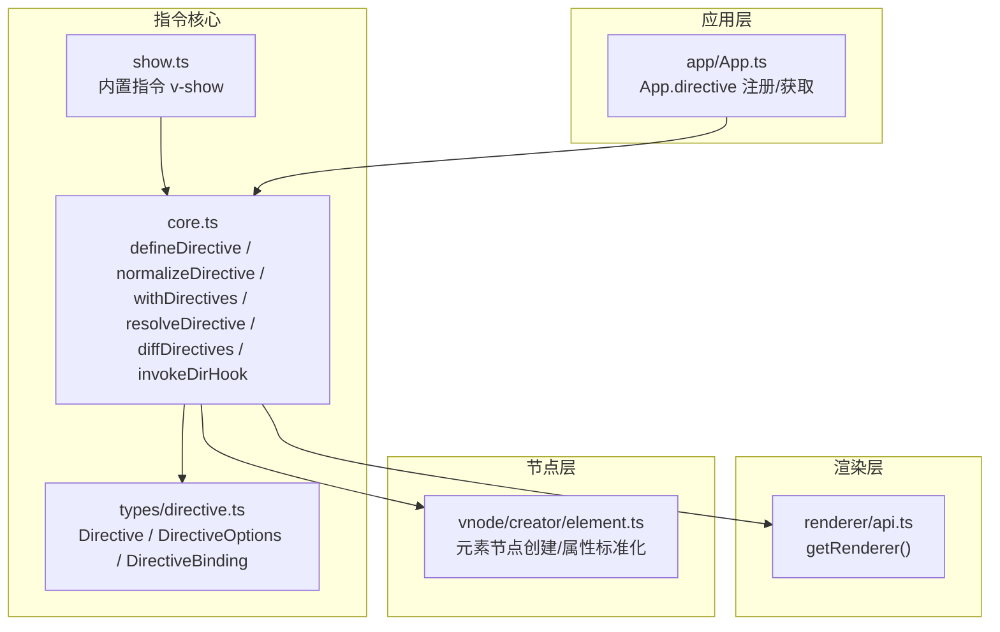
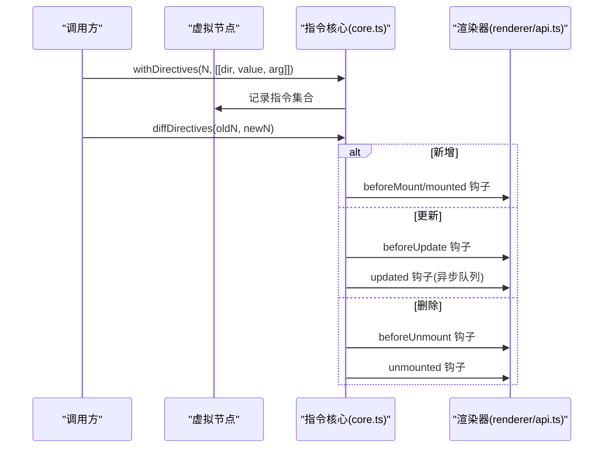
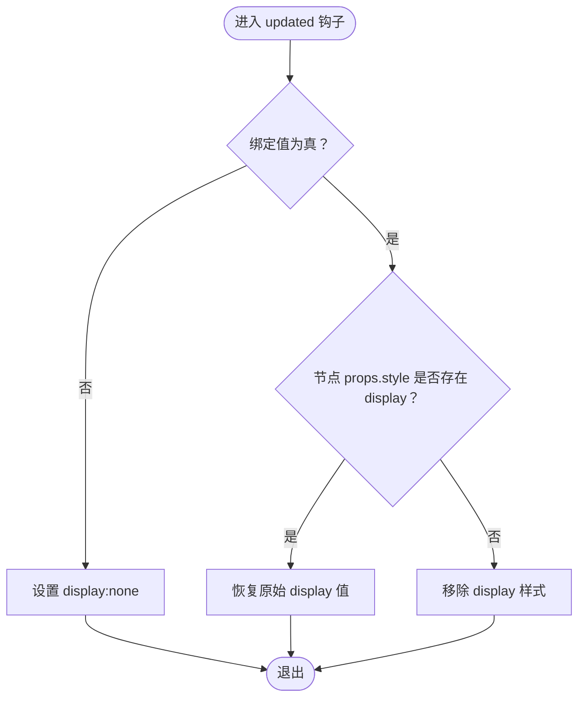
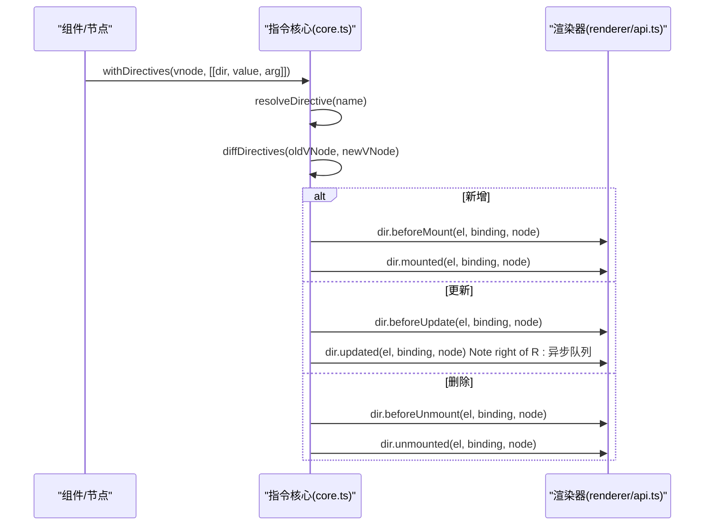
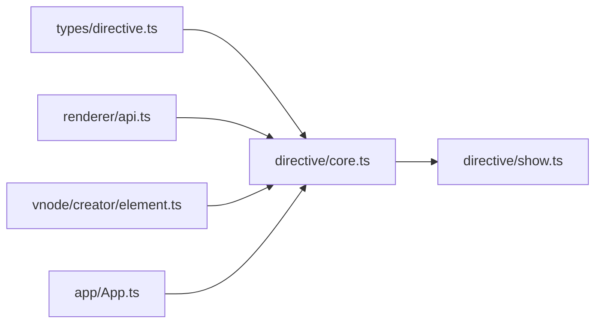

# 指令系统

<cite>
**本文引用的文件**
- [packages/runtime-core/src/directive/core.ts](file://packages/runtime-core/src/directive/core.ts)
- [packages/runtime-core/src/directive/show.ts](file://packages/runtime-core/src/directive/show.ts)
- [packages/runtime-core/src/directive/index.ts](file://packages/runtime-core/src/directive/index.ts)
- [packages/runtime-core/src/types/directive.ts](file://packages/runtime-core/src/types/directive.ts)
- [packages/runtime-core/src/app/App.ts](file://packages/runtime-core/src/app/App.ts)
- [packages/runtime-core/src/renderer/api.ts](file://packages/runtime-core/src/renderer/api.ts)
- [packages/runtime-core/src/vnode/creator/element.ts](file://packages/runtime-core/src/vnode/creator/element.ts)
- [packages/runtime-core/__tests__/directive/core.test.ts](file://packages/runtime-core/__tests__/directive/core.test.ts)
- [packages/runtime-core/__tests__/directive/show.test.ts](file://packages/runtime-core/__tests__/directive/show.test.ts)
</cite>

## 目录
1. [简介](#简介)
2. [项目结构](#项目结构)
3. [核心组件](#核心组件)
4. [架构总览](#架构总览)
5. [详细组件分析](#详细组件分析)
6. [依赖关系分析](#依赖关系分析)
7. [性能考量](#性能考量)
8. [故障排查指南](#故障排查指南)
9. [结论](#结论)
10. [附录](#附录)

## 简介
本文件系统性梳理 Vitarx 的指令系统架构，重点覆盖以下方面：
- 内置 v-show 指令的实现机制与性能特点
- v-show 与 v-if 的区别与适用场景
- 自定义指令的注册方式（app.directive）与生命周期钩子（created、beforeMount、mounted、beforeUpdate、updated、beforeUnmount、unmounted）的调用时机
- 指令参数、修饰符的解析逻辑与使用模式
- 通过实际案例演示如何创建 focus 或 debounce 指令，说明指令与组件状态的交互方式及复杂场景的最佳实践

## 项目结构
Vitarx 的指令系统主要分布在 runtime-core 包中，核心文件如下：
- 指令核心能力：defineDirective、normalizeDirective、withDirectives、resolveDirective、diffDirectives、invokeDirHook
- 内置指令：v-show
- 类型定义：Directive、DirectiveOptions、DirectiveBinding
- 应用层注册：App.directive
- 渲染器桥接：getRenderer
- 虚拟节点：元素节点创建与属性标准化

图表来源
- [packages/runtime-core/src/directive/core.ts](file://packages/runtime-core/src/directive/core.ts#L1-L329)
- [packages/runtime-core/src/directive/show.ts](file://packages/runtime-core/src/directive/show.ts#L1-L35)
- [packages/runtime-core/src/types/directive.ts](file://packages/runtime-core/src/types/directive.ts#L1-L89)
- [packages/runtime-core/src/app/App.ts](file://packages/runtime-core/src/app/App.ts#L280-L306)
- [packages/runtime-core/src/renderer/api.ts](file://packages/runtime-core/src/renderer/api.ts#L1-L26)
- [packages/runtime-core/src/vnode/creator/element.ts](file://packages/runtime-core/src/vnode/creator/element.ts#L1-L69)

章节来源
- [packages/runtime-core/src/directive/core.ts](file://packages/runtime-core/src/directive/core.ts#L1-L329)
- [packages/runtime-core/src/directive/show.ts](file://packages/runtime-core/src/directive/show.ts#L1-L35)
- [packages/runtime-core/src/types/directive.ts](file://packages/runtime-core/src/types/directive.ts#L1-L89)
- [packages/runtime-core/src/app/App.ts](file://packages/runtime-core/src/app/App.ts#L280-L306)
- [packages/runtime-core/src/renderer/api.ts](file://packages/runtime-core/src/renderer/api.ts#L1-L26)
- [packages/runtime-core/src/vnode/creator/element.ts](file://packages/runtime-core/src/vnode/creator/element.ts#L1-L69)

## 核心组件
- 指令定义与规范化
  - defineDirective：将指令注册到组件局部或全局缓存，支持函数或对象形式
  - normalizeDirective：将函数形式的指令规范化为对象，统一 name 字段
- 指令绑定与解析
  - withDirectives：为虚拟节点添加指令，支持 [指令, 值, 参数] 形式
  - resolveDirective：按“组件局部 > 应用级 > 全局”的优先级解析指令
- 指令差异更新与钩子调用
  - diffDirectives：比较新旧节点指令集合，触发 beforeMount/mounted/beforeUpdate/updated/beforeUnmount/unmounted
  - invokeDirHook：在节点生命周期中批量调用指定钩子
- 内置指令
  - show：基于 display 控制显隐，保留原始 display 值并在卸载时清理

章节来源
- [packages/runtime-core/src/directive/core.ts](file://packages/runtime-core/src/directive/core.ts#L28-L154)
- [packages/runtime-core/src/directive/core.ts](file://packages/runtime-core/src/directive/core.ts#L156-L329)
- [packages/runtime-core/src/directive/show.ts](file://packages/runtime-core/src/directive/show.ts#L1-L35)

## 架构总览
指令系统围绕“节点 -> 指令 -> 渲染器”的链路运行：
- 节点创建阶段：withDirectives 将指令写入 vnode.directives
- 指令解析阶段：resolveDirective 按优先级解析指令
- 生命周期阶段：diffDirectives 在新增/更新/删除时调用相应钩子
- 渲染阶段：getRenderer 提供 addStyle/removeStyle 等 DOM 操作

图表来源
- [packages/runtime-core/src/directive/core.ts](file://packages/runtime-core/src/directive/core.ts#L122-L301)
- [packages/runtime-core/src/renderer/api.ts](file://packages/runtime-core/src/renderer/api.ts#L1-L26)

## 详细组件分析

### 内置指令 v-show 的实现与性能
- 实现要点
  - created：当绑定值为假值时，设置 display:none；真值时不改变
  - updated：当绑定值为假值时，设置 display:none；为真值时，若节点 props.style 存在 display，则恢复该值，否则移除 display 样式
  - unmounted：当绑定值为真值时，清理残留 display 样式，优先恢复节点 props.style 中的原始 display
- 性能特点
  - 通过样式切换维持节点存在，避免频繁创建/销毁 DOM，适合频繁显隐场景
  - 保留原始 display 值，减少样式回流/重绘影响
- 与 v-if 的区别
  - v-if：条件为假时完全不渲染节点，节点从 DOM 树移除；条件为真时重新挂载
  - v-show：始终渲染节点，仅切换 display，适合频繁切换但不希望丢失状态的场景

图表来源
- [packages/runtime-core/src/directive/show.ts](file://packages/runtime-core/src/directive/show.ts#L1-L35)

章节来源
- [packages/runtime-core/src/directive/show.ts](file://packages/runtime-core/src/directive/show.ts#L1-L35)
- [packages/runtime-core/__tests__/directive/show.test.ts](file://packages/runtime-core/__tests__/directive/show.test.ts#L1-L238)

### 自定义指令注册与生命周期钩子
- 注册方式
  - 应用级注册：app.directive(name, directiveOptions|function)
  - 组件级注册：defineDirective(name, directiveOptions|function)，存储于当前组件的 directiveStore
- 生命周期钩子与调用时机
  - created：节点元素创建完成后调用
  - beforeMount：即将挂载到 DOM 前调用
  - mounted：真实挂载到 DOM 后调用
  - beforeUpdate：即将更新前调用
  - updated：更新后调用（通过调度队列异步执行）
  - beforeUnmount：即将卸载前调用
  - unmounted：卸载后调用
- 钩子调用路径
  - diffDirectives：根据新旧指令集合触发新增/更新/删除分支
  - invokeDirHook：在节点生命周期中批量调用指定钩子

图表来源
- [packages/runtime-core/src/directive/core.ts](file://packages/runtime-core/src/directive/core.ts#L239-L301)
- [packages/runtime-core/src/app/App.ts](file://packages/runtime-core/src/app/App.ts#L280-L306)
- [packages/runtime-core/src/renderer/api.ts](file://packages/runtime-core/src/renderer/api.ts#L1-L26)

章节来源
- [packages/runtime-core/src/app/App.ts](file://packages/runtime-core/src/app/App.ts#L280-L306)
- [packages/runtime-core/src/directive/core.ts](file://packages/runtime-core/src/directive/core.ts#L122-L301)
- [packages/runtime-core/src/types/directive.ts](file://packages/runtime-core/src/types/directive.ts#L1-L89)

### 指令参数、修饰符解析与使用模式
- 参数与值的解析
  - withDirectives 支持两种形式：Directive 对象数组或 [Directive, value, arg] 元组数组
  - vnode.directives 中以 Map 存储，键为指令名，值为 [dir, value, arg]
- 修饰符解析
  - 指令对象的 arg 字段承载“参数/修饰符”语义，具体含义由指令实现决定
  - 测试用例验证了参数传递与覆盖行为
- 使用模式
  - 值：任意类型（字符串、数字、对象、数组、undefined）
  - 参数：字符串或 undefined
  - 多指令：withDirectives 支持一次绑定多个指令

章节来源
- [packages/runtime-core/src/directive/core.ts](file://packages/runtime-core/src/directive/core.ts#L122-L154)
- [packages/runtime-core/__tests__/directive/core.test.ts](file://packages/runtime-core/__tests__/directive/core.test.ts#L51-L92)
- [packages/runtime-core/__tests__/directive/core.test.ts](file://packages/runtime-core/__tests__/directive/core.test.ts#L154-L209)

### 实战案例：focus 指令与 debounce 指令
- focus 指令
  - 设计思路：在 mounted 钩子中聚焦输入元素，常用于表单首屏聚焦
  - 关键点：仅在 mounted 钩子中执行，避免不必要的更新
- debounce 指令
  - 设计思路：在 mounted 钩子中为元素绑定事件监听，使用节流/防抖策略处理高频事件
  - 关键点：在 beforeUnmount 钩子中清理监听器，防止内存泄漏
- 与组件状态交互
  - 指令可通过绑定值接收组件状态，例如输入框的占位文案、禁用状态等
  - 指令内部可读取 vnode.props 以复用节点样式/属性
- 最佳实践
  - 仅在必要钩子中执行 DOM 操作，避免在 created/beforeMount 之外频繁变更
  - 对外暴露最小 API，参数尽量语义化
  - 在卸载阶段清理副作用，确保组件销毁时无残留

章节来源
- [packages/runtime-core/src/directive/core.ts](file://packages/runtime-core/src/directive/core.ts#L239-L301)
- [packages/runtime-core/src/directive/show.ts](file://packages/runtime-core/src/directive/show.ts#L1-L35)

## 依赖关系分析
- 指令核心依赖
  - 类型：Directive/DirectiveOptions/DirectiveBinding
  - 渲染器：getRenderer 提供 addStyle/removeStyle 等能力
  - 节点：isElementNode/isWidgetNode 判断节点类型
- 指令解析与更新
  - resolveDirective 优先从组件局部缓存获取，其次从 App 上下文获取，最后回退到全局缓存
  - diffDirectives 通过 Map 比较新旧指令集合，触发对应钩子
- 应用层集成
  - App.directive 提供应用级指令注册与获取，内部使用 normalizeDirective 规范化

图表来源
- [packages/runtime-core/src/types/directive.ts](file://packages/runtime-core/src/types/directive.ts#L1-L89)
- [packages/runtime-core/src/directive/core.ts](file://packages/runtime-core/src/directive/core.ts#L1-L329)
- [packages/runtime-core/src/app/App.ts](file://packages/runtime-core/src/app/App.ts#L280-L306)
- [packages/runtime-core/src/renderer/api.ts](file://packages/runtime-core/src/renderer/api.ts#L1-L26)
- [packages/runtime-core/src/vnode/creator/element.ts](file://packages/runtime-core/src/vnode/creator/element.ts#L1-L69)
- [packages/runtime-core/src/directive/show.ts](file://packages/runtime-core/src/directive/show.ts#L1-L35)

章节来源
- [packages/runtime-core/src/directive/core.ts](file://packages/runtime-core/src/directive/core.ts#L1-L329)
- [packages/runtime-core/src/app/App.ts](file://packages/runtime-core/src/app/App.ts#L280-L306)

## 性能考量
- v-show 的优势
  - 通过样式切换维持节点存在，避免频繁创建/销毁 DOM，降低 GC 压力
  - 保留原始 display 值，减少样式回流/重绘影响
- v-if 的优势
  - 条件为假时完全不渲染，节省内存与计算
- 选择建议
  - 频繁切换且需要保留状态：优先 v-show
  - 条件为假时几乎不使用：优先 v-if
- 指令更新优化
  - diffDirectives 支持 only/skip 选项，可在复杂场景中限制指令更新范围
  - updated 钩子通过调度队列异步执行，避免同步阻塞

章节来源
- [packages/runtime-core/src/directive/core.ts](file://packages/runtime-core/src/directive/core.ts#L193-L207)
- [packages/runtime-core/src/directive/core.ts](file://packages/runtime-core/src/directive/core.ts#L239-L301)

## 故障排查指南
- 常见问题
  - 指令未生效：检查 resolveDirective 是否正确解析到目标指令（组件局部 > 应用级 > 全局）
  - 显隐异常：确认 v-show 的绑定值是否为假值；检查节点 props.style 是否存在 display
  - 卸载残留样式：确认 unmounted 钩子是否恢复原始 display
  - 事件泄漏：确保在 beforeUnmount/unmounted 中清理监听器
- 调试建议
  - 使用测试用例覆盖边界值（0、空字符串、null、undefined、NaN）
  - 在开发模式下启用日志，观察指令解析与钩子调用顺序

章节来源
- [packages/runtime-core/__tests__/directive/show.test.ts](file://packages/runtime-core/__tests__/directive/show.test.ts#L1-L238)
- [packages/runtime-core/__tests__/directive/core.test.ts](file://packages/runtime-core/__tests__/directive/core.test.ts#L1-L236)

## 结论
Vitarx 的指令系统以“节点 -> 指令 -> 渲染器”为核心链路，具备完善的生命周期钩子与差异更新机制。内置 v-show 通过样式切换实现高效显隐，适合频繁切换场景；与 v-if 相比，v-show 更关注“保留状态”的性能收益。自定义指令可通过 app.directive 注册，借助 withDirectives 与 resolveDirective 实现灵活绑定与解析。在复杂场景中，合理使用 only/skip 选项与生命周期钩子，可进一步提升性能与稳定性。

## 附录
- API 速查
  - 注册：app.directive(name, directiveOptions|function)
  - 绑定：withDirectives(vnode, [ [dir, value, arg], ... ])
  - 解析：resolveDirective(name)
  - 更新：diffDirectives(oldVNode, newVNode, options?)
  - 钩子：created/beforeMount/mounted/beforeUpdate/updated/beforeUnmount/unmounted
- 内置指令
  - v-show：基于 display 控制显隐，保留并恢复原始 display 值