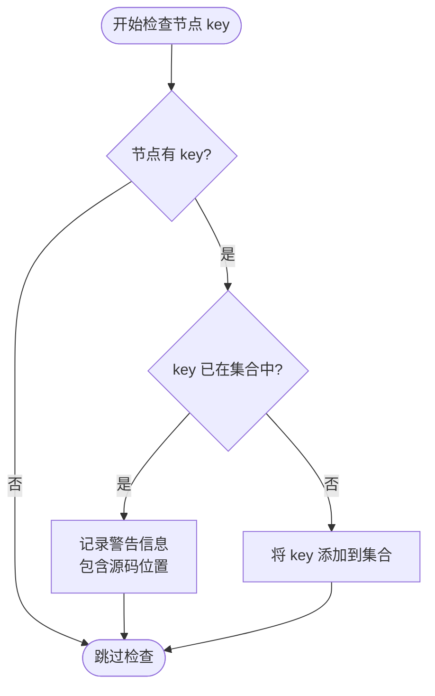

# JSX Key 使用

<cite>
**本文档引用文件**  
- [jsx-runtime.ts](file://packages/vitarx/src/jsx-runtime.ts)
- [jsx-dev-runtime.ts](file://packages/vitarx/src/jsx-dev-runtime.ts)
- [children.ts](file://packages/runtime-core/src/vnode/normalizer/children.ts)
- [props.ts](file://packages/runtime-core/src/types/props.ts)
- [create.ts](file://packages/runtime-core/src/vnode/core/create.ts)
- [dev.ts](file://packages/runtime-core/src/utils/dev.ts)
</cite>

## 目录
1. [引言](#引言)
2. [JSX 中 key 属性的作用](#jsx-中-key-属性的作用)
3. [key 在虚拟 DOM Diff 算法中的核心机制](#key-在虚拟-dom-diff-算法中的核心机制)
4. [列表渲染中 key 的重要性](#列表渲染中-key-的重要性)
5. [使用 index 作为 key 的潜在问题](#使用-index-作为-key-的潜在问题)
6. [重复 key 的警告机制](#重复-key-的警告机制)
7. [jsx-runtime 中 key 的提取与设置过程](#jsx-runtime-中-key-的提取与设置过程)
8. [最佳实践与推荐示例](#最佳实践与推荐示例)
9. [总结](#总结)

## 引言
在现代前端框架中，`key` 属性是 JSX 渲染机制中的关键组成部分。它不仅影响组件的性能表现，还直接关系到渲染结果的正确性。本文档将深入分析 `key` 属性在 Vitarx 框架中的实现原理，结合源码说明其在虚拟 DOM Diff 算法中的作用、重复 key 的检测机制以及最佳使用实践。

## JSX 中 key 属性的作用
`key` 是 JSX 中一个特殊的属性，用于在渲染列表时唯一标识每个节点。它的主要作用是帮助框架识别节点的身份，从而在后续更新时决定是复用现有节点还是创建新节点。

在 Vitarx 框架中，`key` 的类型定义为 `UniqueKey`，支持 `string`、`symbol`、`number` 和 `bigint` 类型。`null` 和 `undefined` 会被忽略，不作为有效 key 处理。

**Section sources**
- [props.ts](file://packages/runtime-core/src/types/props.ts#L106-L107)

## key 在虚拟 DOM Diff 算法中的核心机制
虚拟 DOM Diff 算法通过比较新旧虚拟节点树的差异来最小化实际 DOM 操作。`key` 属性在此过程中起着至关重要的作用：

1. **节点身份识别**：当框架进行 Diff 比较时，会优先根据 `key` 值匹配节点。相同 `key` 的节点被视为同一节点，即使其位置发生变化。
2. **节点复用与更新**：若节点 `key` 匹配，则框架会尝试复用现有 DOM 节点并仅更新其属性和内容，避免不必要的节点销毁和重建。
3. **节点移动优化**：对于 `key` 存在但位置变化的节点，框架会执行移动操作而非删除后重新插入，显著提升性能。

这种基于 `key` 的匹配策略使得列表重新排序、过滤等操作更加高效。

## 列表渲染中 key 的重要性
在渲染动态列表时，`key` 属性尤为重要。考虑以下场景：
- 列表项顺序发生变化
- 列表项被添加或删除
- 列表项内容更新

若不提供 `key`，框架只能基于索引进行比较，这会导致：
- 所有后续节点都被错误地标记为"已更改"
- 大量不必要的 DOM 重新创建
- 组件状态丢失（如输入框内容）

通过提供唯一 `key`，框架能准确识别每个列表项的身份，实现精准更新。

## 使用 index 作为 key 的潜在问题
虽然使用数组索引作为 `key` 是常见做法，但这可能导致严重问题：

### 状态错乱问题
当列表项顺序发生变化时，基于索引的 `key` 会导致状态绑定错误。例如：
```jsx
// 初始状态: [{id: 1, name: 'A'}, {id: 2, name: 'B'}]
// 渲染: <input key={0} value="A"/> <input key={1} value="B"/>

// 交换顺序后: [{id: 2, name: 'B'}, {id: 1, name: 'A'}]
// 错误渲染: <input key={0} value="B"/> <input key={1} value="A"/>
```
此时，虽然数据显示正确，但输入框的焦点和值可能错乱，因为框架认为 `key=0` 的输入框仍然是原来的那个。

### 性能问题
即使内容未变，顺序变化也会导致所有节点重新创建，而非简单的移动操作。

## 重复 key 的警告机制
Vitarx 框架在开发模式下提供了重复 `key` 的检测和警告机制，以防止潜在的渲染错误。

### 检测逻辑
在 `children.ts` 文件中，`checkDuplicateKey` 函数负责检测重复的 `key` 值：



**Diagram sources**
- [children.ts](file://packages/runtime-core/src/vnode/normalizer/children.ts#L45-L60)

该函数在处理每个虚拟节点时被调用，使用 `Set` 数据结构跟踪已出现的 `key` 值。一旦发现重复，就会通过 `logger.warn` 发出警告，并附带源码位置信息以便调试。

### 对渲染的影响
重复的 `key` 会导致：
- Diff 算法无法准确识别节点身份
- 可能出现意外的节点复用或销毁
- 组件状态管理混乱
- 渲染性能下降

**Section sources**
- [children.ts](file://packages/runtime-core/src/vnode/normalizer/children.ts#L36-L60)

## jsx-runtime 中 key 的提取与设置过程
`key` 属性的处理主要在 JSX 运行时层完成，涉及 `jsx-runtime.ts` 和 `createVNode` 函数的协作。

### JSX 转换流程
```mermaid
sequenceDiagram
participant JSX as JSX 表达式
participant Runtime as jsx-runtime
participant Create as createVNode
participant VNode as 虚拟节点
JSX->>Runtime : jsx(type, props, key)
Runtime->>Runtime : 检查 key 是否存在
alt key 存在且 props 为空
Runtime->>Runtime : 创建 props 对象并设置 key
else key 存在且 props 存在
Runtime->>Runtime : 将 key 添加到现有 props
end
Runtime->>Create : 调用 createVNode(type, props)
Create->>Create : 处理节点类型和属性
Create-->>VNode : 返回带有 key 的虚拟节点
VNode-->>Runtime : 返回虚拟节点
Runtime-->>JSX : 返回最终 VNode
```

**Diagram sources**
- [jsx-runtime.ts](file://packages/vitarx/src/jsx-runtime.ts#L15-L30)
- [create.ts](file://packages/runtime-core/src/vnode/core/create.ts#L87-L158)

### 关键代码路径
1. `jsx` 函数接收 `key` 参数（可选）
2. 若 `key` 存在，则将其合并到 `props` 对象中
3. 调用 `createVNode` 创建虚拟节点
4. 在节点标准化过程中，`key` 被用于 Diff 算法

在开发模式下，`jsxDEV` 函数还会调用 `setNodeDevInfo` 将源码位置信息与节点关联，便于错误追踪。

**Section sources**
- [jsx-runtime.ts](file://packages/vitarx/src/jsx-runtime.ts#L15-L30)
- [jsx-dev-runtime.ts](file://packages/vitarx/src/jsx-dev-runtime.ts#L24-L44)
- [dev.ts](file://packages/runtime-core/src/utils/dev.ts#L33-L36)

## 最佳实践与推荐示例
### 推荐做法
应始终使用稳定、唯一且有意义的标识符作为 `key`，如数据库 ID 或 UUID。

```jsx
// 推荐：使用唯一 ID 作为 key
const userList = users.map(user => 
  <UserCard key={user.id} user={user} />
);
```

### 避免的做法
```jsx
// 不推荐：使用索引作为 key
const items = list.map((item, index) => 
  <div key={index}>{item.name}</div>
);

// 不推荐：使用不稳定的值作为 key
const items = list.map(item => 
  <div key={Math.random()}>{item.name}</div>
);
```

### 特殊场景处理
对于没有自然唯一标识的列表，可考虑：
- 使用内容的哈希值
- 在数据层添加临时 ID
- 使用 `Symbol` 创建唯一值

## 总结
`key` 属性是 JSX 渲染机制中的核心概念，正确使用 `key` 能显著提升应用性能和用户体验。关键要点包括：
- 始终为列表项提供 `key` 属性
- 使用稳定且唯一的值作为 `key`
- 避免使用数组索引作为 `key`
- 利用开发模式下的重复 key 警告进行调试
- 理解 `key` 在 Diff 算法中的工作原理

通过遵循这些最佳实践，可以确保应用的渲染既高效又正确。