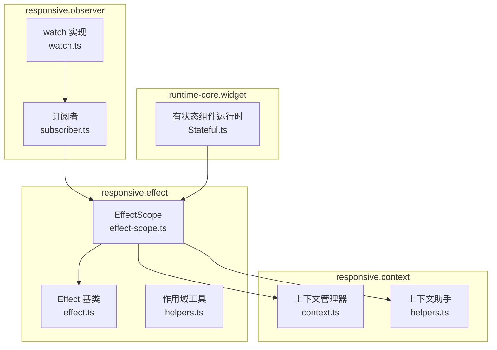
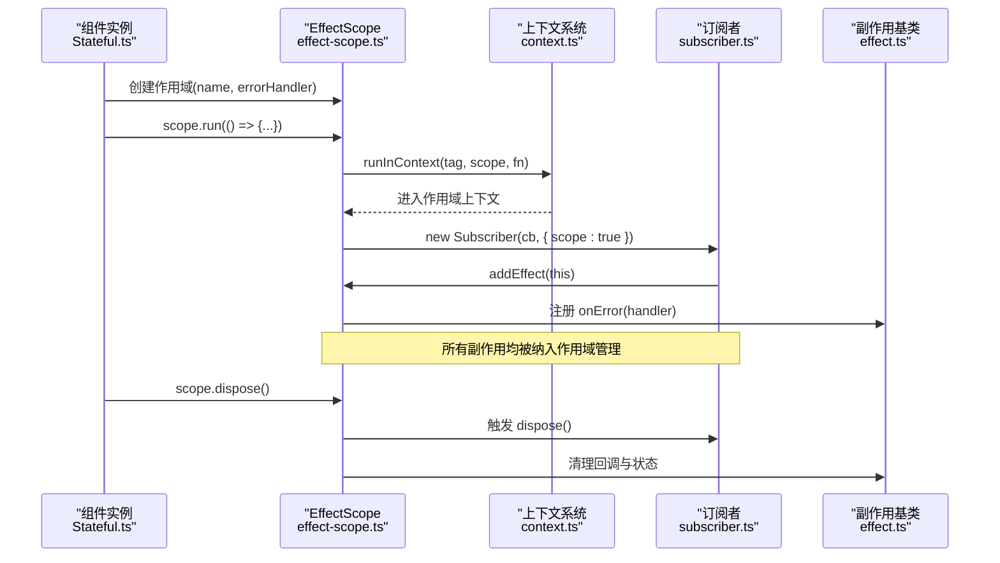
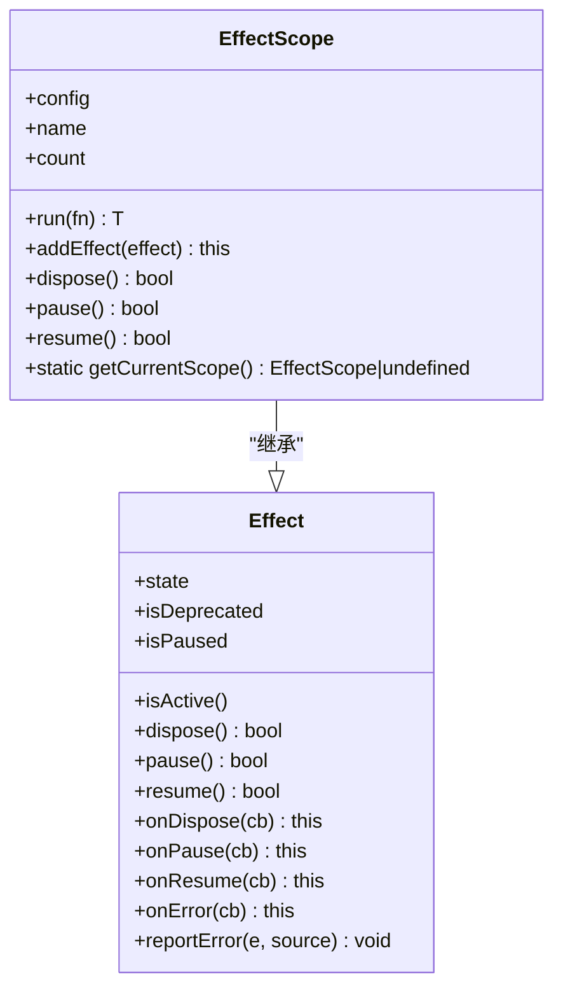
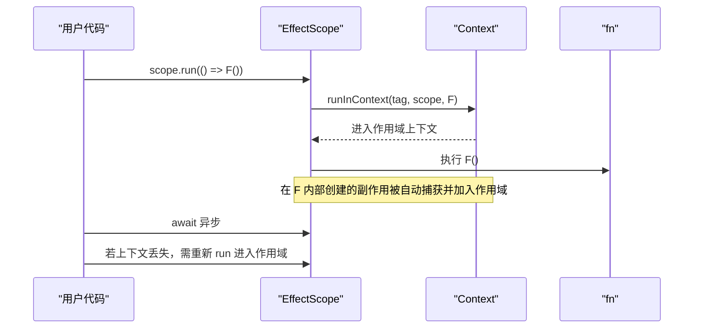
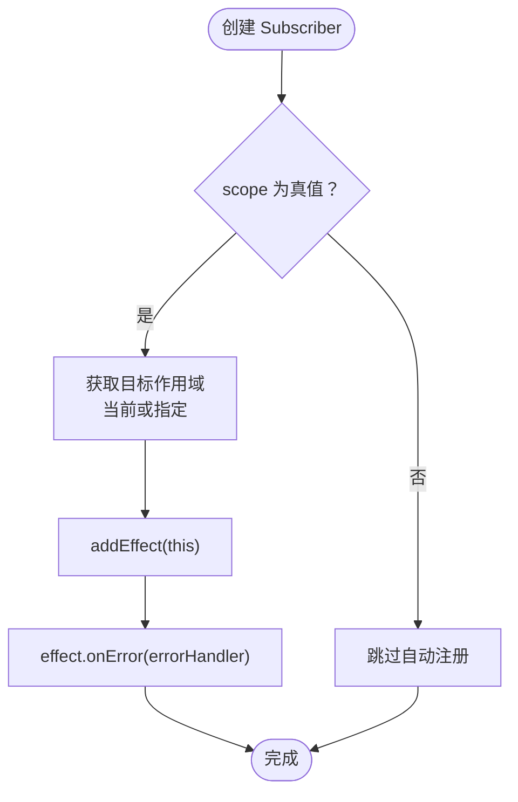
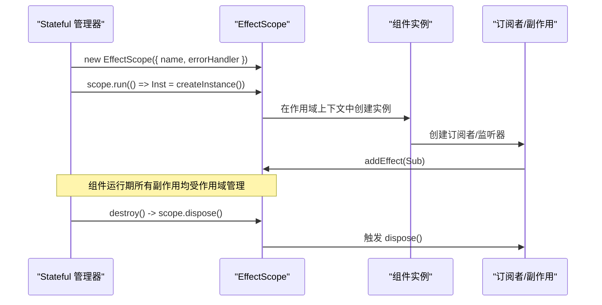
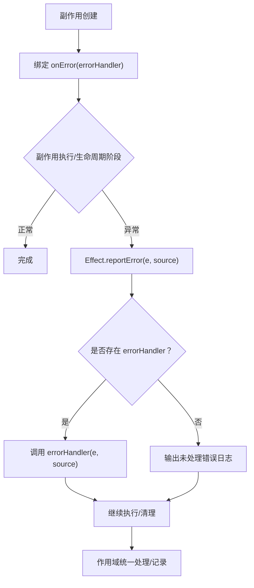
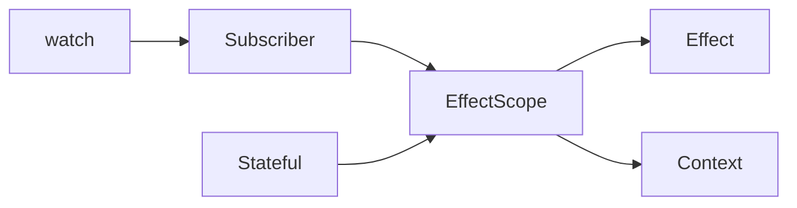

# 作用域管理

<cite>
**本文引用的文件**
- [packages/responsive/src/effect/effect-scope.ts](file://packages/responsive/src/effect/effect-scope.ts)
- [packages/responsive/src/effect/effect.ts](file://packages/responsive/src/effect/effect.ts)
- [packages/responsive/src/context/context.ts](file://packages/responsive/src/context/context.ts)
- [packages/responsive/src/context/helpers.ts](file://packages/responsive/src/context/helpers.ts)
- [packages/responsive/src/observer/subscriber.ts](file://packages/responsive/src/observer/subscriber.ts)
- [packages/responsive/src/observer/watch/watch.ts](file://packages/responsive/src/observer/watch/watch.ts)
- [packages/responsive/src/effect/helpers.ts](file://packages/responsive/src/effect/helpers.ts)
- [packages/responsive/README.md](file://packages/responsive/README.md)
- [packages/runtime-core/src/widget/runtime/Stateful.ts](file://packages/runtime-core/src/widget/runtime/Stateful.ts)
</cite>

## 目录
1. [简介](#简介)
2. [项目结构](#项目结构)
3. [核心组件](#核心组件)
4. [架构总览](#架构总览)
5. [详细组件分析](#详细组件分析)
6. [依赖关系分析](#依赖关系分析)
7. [性能考量](#性能考量)
8. [故障排查指南](#故障排查指南)
9. [结论](#结论)
10. [附录](#附录)

## 简介
本篇文档围绕 Vitarx 的作用域管理能力展开，系统阐述 EffectScope 如何统一管理一组副作用的生命周期，并通过 scope.dispose() 一键销毁所有关联副作用。文档重点解释：
- EffectScope 的配置项 attachToCurrentScope 的作用与使用方式
- name 字段在调试中的用途
- 订阅者如何通过 subscriber.ts 的 scope 选项自动注册到当前作用域
- 在组件级创建作用域并批量管理 watch、observer 等副作用的模式
- 异常处理器 errorHandler 的传递与处理机制

## 项目结构
与作用域管理直接相关的模块主要分布在 responsive 包的 effect、observer、context 三个子目录中，runtime-core 的 Stateful 管理器展示了组件级作用域的典型用法。

图表来源
- [packages/responsive/src/effect/effect-scope.ts](file://packages/responsive/src/effect/effect-scope.ts#L1-L212)
- [packages/responsive/src/effect/effect.ts](file://packages/responsive/src/effect/effect.ts#L1-L261)
- [packages/responsive/src/context/context.ts](file://packages/responsive/src/context/context.ts#L1-L138)
- [packages/responsive/src/context/helpers.ts](file://packages/responsive/src/context/helpers.ts#L45-L73)
- [packages/responsive/src/observer/subscriber.ts](file://packages/responsive/src/observer/subscriber.ts#L1-L248)
- [packages/responsive/src/observer/watch/watch.ts](file://packages/responsive/src/observer/watch/watch.ts)
- [packages/runtime-core/src/widget/runtime/Stateful.ts](file://packages/runtime-core/src/widget/runtime/Stateful.ts#L90-L110)

章节来源
- [packages/responsive/src/effect/effect-scope.ts](file://packages/responsive/src/effect/effect-scope.ts#L1-L212)
- [packages/responsive/src/context/context.ts](file://packages/responsive/src/context/context.ts#L1-L138)
- [packages/responsive/src/observer/subscriber.ts](file://packages/responsive/src/observer/subscriber.ts#L1-L248)
- [packages/runtime-core/src/widget/runtime/Stateful.ts](file://packages/runtime-core/src/widget/runtime/Stateful.ts#L90-L110)

## 核心组件
- EffectScope：作用域管理器，负责收集、暂停/恢复、销毁副作用；支持异常处理器传递与统一报告。
- Effect：副作用基类，提供状态管理、生命周期钩子、错误处理等通用能力。
- Subscriber：订阅者，支持触发时机、触发次数限制、作用域自动注册等。
- 上下文系统：通过 Context 与 runInContext/withAsyncContext 维护作用域上下文，保证异步场景下的作用域可用性。
- 组件运行时：在有状态组件中创建作用域，统一处理副作用生命周期与错误上报。

章节来源
- [packages/responsive/src/effect/effect-scope.ts](file://packages/responsive/src/effect/effect-scope.ts#L1-L212)
- [packages/responsive/src/effect/effect.ts](file://packages/responsive/src/effect/effect.ts#L1-L261)
- [packages/responsive/src/observer/subscriber.ts](file://packages/responsive/src/observer/subscriber.ts#L1-L248)
- [packages/responsive/src/context/context.ts](file://packages/responsive/src/context/context.ts#L1-L138)
- [packages/responsive/src/context/helpers.ts](file://packages/responsive/src/context/helpers.ts#L45-L73)
- [packages/runtime-core/src/widget/runtime/Stateful.ts](file://packages/runtime-core/src/widget/runtime/Stateful.ts#L90-L110)

## 架构总览
EffectScope 通过上下文标签将自身绑定到当前上下文，使得在其 run(fn) 中创建的副作用能够被自动捕获并纳入管理。订阅者在构造时可根据 scope 选项自动加入当前作用域，从而实现“组件级作用域”的批量管理。

图表来源
- [packages/responsive/src/effect/effect-scope.ts](file://packages/responsive/src/effect/effect-scope.ts#L112-L177)
- [packages/responsive/src/context/context.ts](file://packages/responsive/src/context/context.ts#L1-L138)
- [packages/responsive/src/observer/subscriber.ts](file://packages/responsive/src/observer/subscriber.ts#L135-L151)
- [packages/responsive/src/effect/effect.ts](file://packages/responsive/src/effect/effect.ts#L96-L133)
- [packages/runtime-core/src/widget/runtime/Stateful.ts](file://packages/runtime-core/src/widget/runtime/Stateful.ts#L90-L110)

## 详细组件分析

### EffectScope：统一管理副作用生命周期
- 配置项 attachToCurrentScope：当为 true 时，构造时会自动将当前作用域添加到“当前上下文中的作用域”中，便于层级化管理。
- 配置项 name：用于调试时直观识别作用域，支持字符串或 Symbol。
- 配置项 errorHandler：作用域内副作用抛出的异常会通过 effect.onError 传递给副作用对象，由副作用对象统一报告。
- 生命周期管理：
  - run(fn)：在当前作用域上下文中运行函数，捕获其中创建的副作用。
  - addEffect(effect)：将实现 EffectInterface 的副作用加入作用域，自动绑定错误处理器，并在副作用 dispose 时从集合中移除。
  - dispose()：销毁作用域并逐一调用内部副作用的 dispose，异常会被作用域的 errorHandler 报告。
  - pause()/resume()：对作用域内的副作用执行暂停/恢复操作。
- 上下文集成：通过静态 contextTag 与上下文系统协作，确保异步场景下作用域可用。

图表来源
- [packages/responsive/src/effect/effect.ts](file://packages/responsive/src/effect/effect.ts#L34-L239)
- [packages/responsive/src/effect/effect-scope.ts](file://packages/responsive/src/effect/effect-scope.ts#L40-L211)

章节来源
- [packages/responsive/src/effect/effect-scope.ts](file://packages/responsive/src/effect/effect-scope.ts#L1-L212)
- [packages/responsive/src/effect/effect.ts](file://packages/responsive/src/effect/effect.ts#L1-L261)

### 上下文与异步：runInContext 与 withAsyncContext
- runInContext(tag, ctx, fn)：在指定标签的上下文中运行函数，确保作用域上下文在同步范围内有效。
- withAsyncContext(asyncTask)：在异步任务前后备份/恢复上下文，保证 await 后仍能获取到正确的作用域上下文。
- EffectScope 的 run(fn) 即通过 runInContext 维持作用域上下文，避免异步场景下上下文丢失导致副作用无法被捕获。

图表来源
- [packages/responsive/src/effect/effect-scope.ts](file://packages/responsive/src/effect/effect-scope.ts#L112-L125)
- [packages/responsive/src/context/context.ts](file://packages/responsive/src/context/context.ts#L1-L138)
- [packages/responsive/src/context/helpers.ts](file://packages/responsive/src/context/helpers.ts#L45-L73)
- [packages/responsive/README.md](file://packages/responsive/README.md#L1390-L1410)

章节来源
- [packages/responsive/src/effect/effect-scope.ts](file://packages/responsive/src/effect/effect-scope.ts#L112-L125)
- [packages/responsive/src/context/context.ts](file://packages/responsive/src/context/context.ts#L1-L138)
- [packages/responsive/src/context/helpers.ts](file://packages/responsive/src/context/helpers.ts#L45-L73)
- [packages/responsive/README.md](file://packages/responsive/README.md#L1390-L1410)

### 订阅者自动注册到当前作用域：subscriber.ts 的 scope 选项
- SubscriberOptions.scope 支持：
  - true：自动添加到当前作用域
  - false：不自动添加
  - EffectScope：添加到指定作用域
- 构造时若 scope 为真值，会根据类型选择当前作用域或指定作用域，随后调用 addEffect(this) 将自身加入作用域。
- 作用域内的 errorHandler 会通过 effect.onError 传递给订阅者，使其在 notify 时统一报告错误。

图表来源
- [packages/responsive/src/observer/subscriber.ts](file://packages/responsive/src/observer/subscriber.ts#L135-L151)
- [packages/responsive/src/effect/effect-scope.ts](file://packages/responsive/src/effect/effect-scope.ts#L135-L157)

章节来源
- [packages/responsive/src/observer/subscriber.ts](file://packages/responsive/src/observer/subscriber.ts#L1-L248)
- [packages/responsive/src/effect/effect-scope.ts](file://packages/responsive/src/effect/effect-scope.ts#L1-L212)

### 组件级作用域：在 Stateful 中创建并销毁
- 在有状态组件初始化时创建 EffectScope，并将 name 设为组件名，errorHandler 将副作用错误转交给组件的错误处理流程。
- 组件实例在销毁时调用 scope.dispose()，从而自动清理所有订阅者、watcher 等副作用。
- 组件在创建实例时通过 scope.run(...) 包裹，确保在组件生命周期内创建的副作用均受作用域管理。

图表来源
- [packages/runtime-core/src/widget/runtime/Stateful.ts](file://packages/runtime-core/src/widget/runtime/Stateful.ts#L90-L110)
- [packages/runtime-core/src/widget/runtime/Stateful.ts](file://packages/runtime-core/src/widget/runtime/Stateful.ts#L218-L228)
- [packages/responsive/src/effect/effect-scope.ts](file://packages/responsive/src/effect/effect-scope.ts#L166-L180)
- [packages/responsive/src/observer/subscriber.ts](file://packages/responsive/src/observer/subscriber.ts#L135-L151)

章节来源
- [packages/runtime-core/src/widget/runtime/Stateful.ts](file://packages/runtime-core/src/widget/runtime/Stateful.ts#L90-L110)
- [packages/runtime-core/src/widget/runtime/Stateful.ts](file://packages/runtime-core/src/widget/runtime/Stateful.ts#L218-L228)

### 异常处理：errorHandler 的传递与处理机制
- EffectScope 构造时可传入 errorHandler，作用域内副作用若实现 onError，则会自动绑定该处理器。
- Effect 基类提供 onError/onDispose/onPause/onResume 等钩子，统一通过 reportError 进行错误报告。
- 当副作用在 dispose/pause/resume 等生命周期阶段抛错时，作用域会捕获并交由 errorHandler 处理，避免异常中断整体流程。

图表来源
- [packages/responsive/src/effect/effect-scope.ts](file://packages/responsive/src/effect/effect-scope.ts#L144-L146)
- [packages/responsive/src/effect/effect.ts](file://packages/responsive/src/effect/effect.ts#L177-L216)

章节来源
- [packages/responsive/src/effect/effect-scope.ts](file://packages/responsive/src/effect/effect-scope.ts#L1-L212)
- [packages/responsive/src/effect/effect.ts](file://packages/responsive/src/effect/effect.ts#L1-L261)

### 代码示例路径（不展示具体代码）
- 在组件中创建作用域并管理副作用：参见 [packages/runtime-core/src/widget/runtime/Stateful.ts](file://packages/runtime-core/src/widget/runtime/Stateful.ts#L90-L110)
- 在组件销毁时统一清理副作用：参见 [packages/runtime-core/src/widget/runtime/Stateful.ts](file://packages/runtime-core/src/widget/runtime/Stateful.ts#L218-L228)
- 通过 EffectScope.run 管理异步上下文：参见 [packages/responsive/README.md](file://packages/responsive/README.md#L1390-L1410)
- 订阅者自动注册到当前作用域：参见 [packages/responsive/src/observer/subscriber.ts](file://packages/responsive/src/observer/subscriber.ts#L135-L151)
- 作用域工具 getCurrentScope/addEffect：参见 [packages/responsive/src/effect/helpers.ts](file://packages/responsive/src/effect/helpers.ts#L20-L56)

章节来源
- [packages/runtime-core/src/widget/runtime/Stateful.ts](file://packages/runtime-core/src/widget/runtime/Stateful.ts#L90-L110)
- [packages/runtime-core/src/widget/runtime/Stateful.ts](file://packages/runtime-core/src/widget/runtime/Stateful.ts#L218-L228)
- [packages/responsive/README.md](file://packages/responsive/README.md#L1390-L1410)
- [packages/responsive/src/observer/subscriber.ts](file://packages/responsive/src/observer/subscriber.ts#L135-L151)
- [packages/responsive/src/effect/helpers.ts](file://packages/responsive/src/effect/helpers.ts#L20-L56)

## 依赖关系分析
- EffectScope 依赖 Effect 提供的状态与错误处理能力，并通过上下文系统维持作用域上下文。
- Subscriber 在构造时依赖 EffectScope.getCurrentScope() 获取当前作用域，实现自动注册。
- 上下文系统在浏览器与 Node 环境分别采用不同的实现，确保异步上下文的一致性。
- 组件运行时依赖 EffectScope 提供的统一生命周期管理与错误处理。

图表来源
- [packages/responsive/src/effect/effect-scope.ts](file://packages/responsive/src/effect/effect-scope.ts#L1-L212)
- [packages/responsive/src/effect/effect.ts](file://packages/responsive/src/effect/effect.ts#L1-L261)
- [packages/responsive/src/context/context.ts](file://packages/responsive/src/context/context.ts#L1-L138)
- [packages/responsive/src/observer/subscriber.ts](file://packages/responsive/src/observer/subscriber.ts#L1-L248)
- [packages/responsive/src/observer/watch/watch.ts](file://packages/responsive/src/observer/watch/watch.ts)
- [packages/runtime-core/src/widget/runtime/Stateful.ts](file://packages/runtime-core/src/widget/runtime/Stateful.ts#L90-L110)

章节来源
- [packages/responsive/src/effect/effect-scope.ts](file://packages/responsive/src/effect/effect-scope.ts#L1-L212)
- [packages/responsive/src/effect/effect.ts](file://packages/responsive/src/effect/effect.ts#L1-L261)
- [packages/responsive/src/context/context.ts](file://packages/responsive/src/context/context.ts#L1-L138)
- [packages/responsive/src/observer/subscriber.ts](file://packages/responsive/src/observer/subscriber.ts#L1-L248)
- [packages/responsive/src/observer/watch/watch.ts](file://packages/responsive/src/observer/watch/watch.ts)
- [packages/runtime-core/src/widget/runtime/Stateful.ts](file://packages/runtime-core/src/widget/runtime/Stateful.ts#L90-L110)

## 性能考量
- 使用作用域批量管理副作用可减少手动清理成本，降低内存泄漏风险。
- 合理选择 flush 与 limit 可减少无效触发与资源占用。
- 在高频更新场景中，优先使用批处理与合适的触发时机，避免频繁重建副作用。

## 故障排查指南
- 异步上下文丢失：在 await 后若需要继续在作用域中创建副作用，需重新使用 scope.run(...) 进入作用域上下文。
- 作用域已销毁：向已销毁作用域添加副作用会抛出错误，需确保在正确生命周期内创建副作用。
- errorHandler 未生效：确认副作用实现了 onError 并且作用域配置了 errorHandler；检查异常是否在 dispose/pause/resume 等阶段抛出。
- 订阅者未自动注册：检查 Subscriber 的 scope 选项是否为 true 或传入了正确的 EffectScope 实例。

章节来源
- [packages/responsive/src/effect/effect-scope.ts](file://packages/responsive/src/effect/effect-scope.ts#L135-L157)
- [packages/responsive/src/observer/subscriber.ts](file://packages/responsive/src/observer/subscriber.ts#L135-L151)
- [packages/responsive/README.md](file://packages/responsive/README.md#L1390-L1410)

## 结论
EffectScope 通过统一的生命周期管理与上下文集成，为副作用提供了“创建即受管、销毁即清理”的能力。attachToCurrentScope 与 name 字段分别解决了层级化管理与调试可观测性的问题；订阅者通过 scope 选项自动注册到当前作用域，使组件级副作用管理变得简洁可靠；errorHandler 的传递与统一报告机制进一步提升了系统的健壮性与可维护性。

## 附录
- 在组件中创建作用域并管理副作用：参见 [packages/runtime-core/src/widget/runtime/Stateful.ts](file://packages/runtime-core/src/widget/runtime/Stateful.ts#L90-L110)
- 在组件销毁时统一清理副作用：参见 [packages/runtime-core/src/widget/runtime/Stateful.ts](file://packages/runtime-core/src/widget/runtime/Stateful.ts#L218-L228)
- 通过 EffectScope.run 管理异步上下文：参见 [packages/responsive/README.md](file://packages/responsive/README.md#L1390-L1410)
- 订阅者自动注册到当前作用域：参见 [packages/responsive/src/observer/subscriber.ts](file://packages/responsive/src/observer/subscriber.ts#L135-L151)
- 作用域工具 getCurrentScope/addEffect：参见 [packages/responsive/src/effect/helpers.ts](file://packages/responsive/src/effect/helpers.ts#L20-L56)