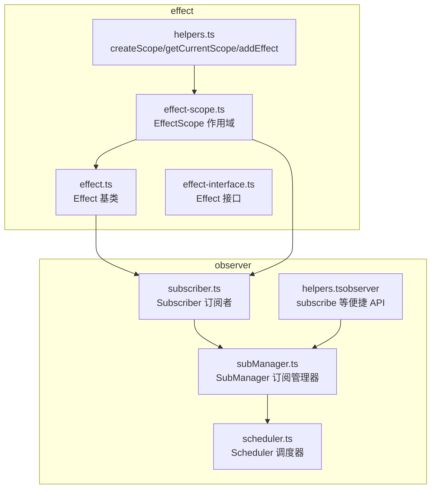
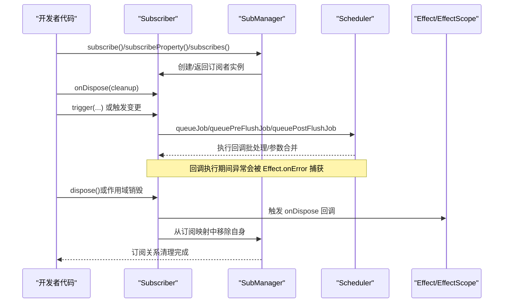
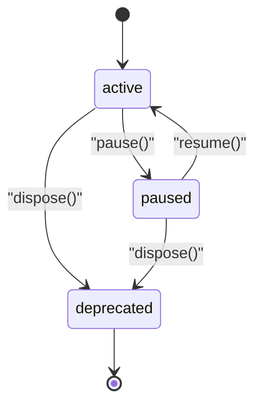
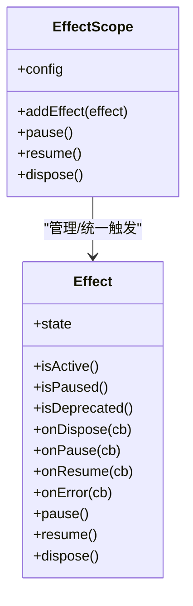
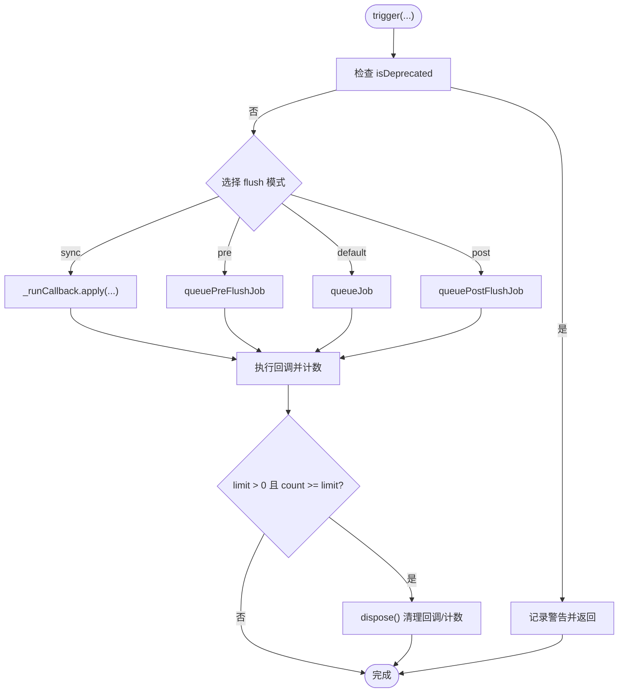
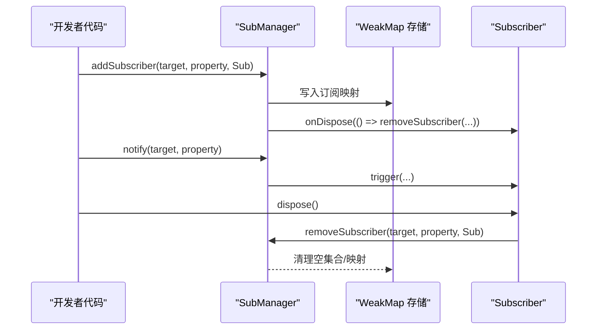
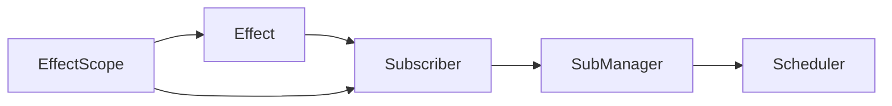

# 副作用清理机制

<cite>
**本文引用的文件**
- [effect.ts](file://packages/responsive/src/effect/effect.ts)
- [effect-interface.ts](file://packages/responsive/src/effect/effect-interface.ts)
- [effect-scope.ts](file://packages/responsive/src/effect/effect-scope.ts)
- [helpers.ts](file://packages/responsive/src/effect/helpers.ts)
- [subscriber.ts](file://packages/responsive/src/observer/subscriber.ts)
- [subManager.ts](file://packages/responsive/src/observer/subManager.ts)
- [scheduler.ts](file://packages/responsive/src/observer/scheduler.ts)
- [helpers.ts（observer）](file://packages/responsive/src/observer/helpers.ts)
</cite>

## 目录
1. [简介](#简介)
2. [项目结构](#项目结构)
3. [核心组件](#核心组件)
4. [架构总览](#架构总览)
5. [详细组件分析](#详细组件分析)
6. [依赖分析](#依赖分析)
7. [性能考量](#性能考量)
8. [故障排查指南](#故障排查指南)
9. [结论](#结论)
10. [附录](#附录)

## 简介
本文围绕 Vitarx 响应式模块中的副作用清理机制展开，重点解释：
- onDispose 回调的使用方式与最佳实践
- 通过 dispose() 方法清理定时器、事件监听器、订阅对象等资源，防止内存泄漏
- Effect 类的内部状态管理（active/paused/deprecated）与清理流程的关系
- 在 Subscriber 类中，trigger 触发后如何通过 isDeprecated 判断避免对已销毁实例的操作
- 结合 SubManager 与 Scheduler 的协作，实现批量通知与参数合并，降低资源泄漏风险
- 提供实际代码示例路径与错误处理、调试技巧

## 项目结构
本主题涉及的文件主要位于 packages/responsive/src 下的 effect 与 observer 两个子模块：
- effect：定义副作用生命周期与事件监听接口，提供 Effect 基类与作用域管理
- observer：提供订阅者模型、订阅管理器与调度器，支撑响应式变更通知与批处理

图表来源
- [effect.ts](file://packages/responsive/src/effect/effect.ts#L1-L261)
- [effect-interface.ts](file://packages/responsive/src/effect/effect-interface.ts#L1-L224)
- [effect-scope.ts](file://packages/responsive/src/effect/effect-scope.ts#L1-L212)
- [helpers.ts](file://packages/responsive/src/effect/helpers.ts#L1-L57)
- [subscriber.ts](file://packages/responsive/src/observer/subscriber.ts#L1-L248)
- [subManager.ts](file://packages/responsive/src/observer/subManager.ts#L1-L424)
- [scheduler.ts](file://packages/responsive/src/observer/scheduler.ts#L1-L326)
- [helpers.ts（observer）](file://packages/responsive/src/observer/helpers.ts#L1-L221)

章节来源
- [effect.ts](file://packages/responsive/src/effect/effect.ts#L1-L261)
- [subscriber.ts](file://packages/responsive/src/observer/subscriber.ts#L1-L248)
- [subManager.ts](file://packages/responsive/src/observer/subManager.ts#L1-L424)
- [scheduler.ts](file://packages/responsive/src/observer/scheduler.ts#L1-L326)
- [effect-scope.ts](file://packages/responsive/src/effect/effect-scope.ts#L1-L212)
- [helpers.ts](file://packages/responsive/src/effect/helpers.ts#L1-L57)
- [helpers.ts（observer）](file://packages/responsive/src/observer/helpers.ts#L1-L221)

## 核心组件
- Effect 基类：提供状态管理（active/paused/deprecated）、生命周期钩子（onDispose/onPause/onResume）、错误处理（onError）与回调触发机制
- EffectScope 作用域：集中管理副作用，统一触发 dispose/pause/resume，并在销毁时自动清理
- Subscriber 订阅者：基于 Effect 的订阅者，支持触发时机（sync/default/pre/post）、触发次数限制、参数合并与自动作用域管理
- SubManager 订阅管理器：负责订阅关系的建立、通知与清理，自动在订阅者销毁时移除映射
- Scheduler 调度器：三阶段队列（pre/main/post）+ 微任务 + 参数合并，保证变更通知的批处理与稳定性

章节来源
- [effect-interface.ts](file://packages/responsive/src/effect/effect-interface.ts#L1-L224)
- [effect.ts](file://packages/responsive/src/effect/effect.ts#L1-L261)
- [effect-scope.ts](file://packages/responsive/src/effect/effect-scope.ts#L1-L212)
- [subscriber.ts](file://packages/responsive/src/observer/subscriber.ts#L1-L248)
- [subManager.ts](file://packages/responsive/src/observer/subManager.ts#L1-L424)
- [scheduler.ts](file://packages/responsive/src/observer/scheduler.ts#L1-L326)

## 架构总览
下面的序列图展示了从订阅到触发再到清理的完整流程，体现 onDispose 回调与 dispose() 的关键作用。

图表来源
- [subscriber.ts](file://packages/responsive/src/observer/subscriber.ts#L1-L248)
- [subManager.ts](file://packages/responsive/src/observer/subManager.ts#L1-L424)
- [scheduler.ts](file://packages/responsive/src/observer/scheduler.ts#L1-L326)
- [effect.ts](file://packages/responsive/src/effect/effect.ts#L1-L261)
- [effect-scope.ts](file://packages/responsive/src/effect/effect-scope.ts#L1-L212)

## 详细组件分析

### Effect 基类与状态管理
- 状态流转
  - active → paused：pause()
  - paused → active：resume()
  - active/paused → deprecated：dispose()
  - deprecated 为终态，不可再转换
- 关键方法
  - onDispose(callback)：注册销毁回调
  - onPause/onResume：注册暂停/恢复回调
  - onError(handler)：注册错误回调
  - dispose()：触发销毁事件、清理回调集合
- 错误处理
  - 回调异常通过 reportError 统一上报，避免中断流程
  - 若未注册错误处理器，将使用 logger 输出未处理错误

图表来源
- [effect.ts](file://packages/responsive/src/effect/effect.ts#L1-L261)
- [effect-interface.ts](file://packages/responsive/src/effect/effect-interface.ts#L1-L224)

章节来源
- [effect.ts](file://packages/responsive/src/effect/effect.ts#L1-L261)
- [effect-interface.ts](file://packages/responsive/src/effect/effect-interface.ts#L1-L224)

### EffectScope 作用域与自动清理
- addEffect(effect)：将副作用加入作用域，自动继承错误处理，并在销毁时统一触发 dispose
- pause/resume：遍历作用域内所有副作用，按状态切换
- dispose：逐个触发副作用的 dispose，并清理内部集合与错误处理器

图表来源
- [effect.ts](file://packages/responsive/src/effect/effect.ts#L1-L261)
- [effect-scope.ts](file://packages/responsive/src/effect/effect-scope.ts#L1-L212)
- [helpers.ts](file://packages/responsive/src/effect/helpers.ts#L1-L57)

章节来源
- [effect-scope.ts](file://packages/responsive/src/effect/effect-scope.ts#L1-L212)
- [helpers.ts](file://packages/responsive/src/effect/helpers.ts#L1-L57)

### Subscriber 订阅者与触发流程
- 触发时机 flush：'default' | 'pre' | 'post' | 'sync'
- 触发次数限制 limit：达到次数后自动 dispose
- 参数处理 paramsHandler：在同周期内合并多次触发的参数
- 触发路径：trigger → Scheduler.queueJob/Pre/Post → _runCallback → 执行回调 → 增加计数 → 达限则 dispose
- 销毁清理：override dispose() 将回调置空，避免后续触发

图表来源
- [subscriber.ts](file://packages/responsive/src/observer/subscriber.ts#L1-L248)
- [scheduler.ts](file://packages/responsive/src/observer/scheduler.ts#L1-L326)

章节来源
- [subscriber.ts](file://packages/responsive/src/observer/subscriber.ts#L1-L248)
- [scheduler.ts](file://packages/responsive/src/observer/scheduler.ts#L1-L326)

### SubManager 订阅管理与自动清理
- 订阅建立：addSubscriber 将订阅者加入 WeakMap 映射
- 自动清理：若订阅者为 Subscriber 实例，注册 onDispose 回调，销毁时从映射中移除
- 通知：notify → 遍历属性订阅集合，触发函数或调用 subscriber.trigger
- 移除：removeSubscriber 自动清理空集合与空映射，释放内存

图表来源
- [subManager.ts](file://packages/responsive/src/observer/subManager.ts#L1-L424)
- [subscriber.ts](file://packages/responsive/src/observer/subscriber.ts#L1-L248)

章节来源
- [subManager.ts](file://packages/responsive/src/observer/subManager.ts#L1-L424)

### onDispose 回调与资源清理最佳实践
- 在创建副作用/订阅者后，立即注册 onDispose 回调，用于释放外部资源（定时器、事件监听器、网络连接、订阅对象等）
- 在组件卸载或条件变化时，主动调用 dispose()，确保：
  - 状态变为 deprecated
  - 触发所有 onDispose 回调
  - 清理内部回调集合，避免后续触发
- 作用域管理：通过 createScope/getCurrentScope/addEffect 将副作用纳入作用域，作用域销毁时统一清理

章节来源
- [effect.ts](file://packages/responsive/src/effect/effect.ts#L1-L261)
- [effect-scope.ts](file://packages/responsive/src/effect/effect-scope.ts#L1-L212)
- [helpers.ts](file://packages/responsive/src/effect/helpers.ts#L1-L57)
- [subscriber.ts](file://packages/responsive/src/observer/subscriber.ts#L1-L248)
- [subManager.ts](file://packages/responsive/src/observer/subManager.ts#L1-L424)

## 依赖分析
- Effect 与 Subscriber：Subscriber 继承 Effect，复用状态与回调机制
- SubManager 与 Subscriber/Scheduler：SubManager 通过 SubManager.addSubscriber 注册 onDispose，实现自动清理；通过 Scheduler 实现批处理与微任务调度
- EffectScope 与 Effect：EffectScope 管理 Effect 集合，统一触发生命周期事件

图表来源
- [effect.ts](file://packages/responsive/src/effect/effect.ts#L1-L261)
- [subscriber.ts](file://packages/responsive/src/observer/subscriber.ts#L1-L248)
- [subManager.ts](file://packages/responsive/src/observer/subManager.ts#L1-L424)
- [scheduler.ts](file://packages/responsive/src/observer/scheduler.ts#L1-L326)
- [effect-scope.ts](file://packages/responsive/src/effect/effect-scope.ts#L1-L212)

章节来源
- [effect.ts](file://packages/responsive/src/effect/effect.ts#L1-L261)
- [subscriber.ts](file://packages/responsive/src/observer/subscriber.ts#L1-L248)
- [subManager.ts](file://packages/responsive/src/observer/subManager.ts#L1-L424)
- [scheduler.ts](file://packages/responsive/src/observer/scheduler.ts#L1-L326)
- [effect-scope.ts](file://packages/responsive/src/effect/effect-scope.ts#L1-L212)

## 性能考量
- 批处理与微任务：Scheduler 采用三阶段队列与微任务，避免频繁同步执行带来的卡顿
- 参数合并：queueJob/Pre/Post 支持参数处理器，合并同周期多次触发的参数，减少无效回调
- 触发次数限制：Subscriber 的 limit 机制可在达到阈值后自动销毁，避免长期运行的副作用造成资源累积
- WeakMap 存储：SubManager 使用 WeakMap 存储订阅映射，便于垃圾回收，降低内存泄漏风险

章节来源
- [scheduler.ts](file://packages/responsive/src/observer/scheduler.ts#L1-L326)
- [subManager.ts](file://packages/responsive/src/observer/subManager.ts#L1-L424)
- [subscriber.ts](file://packages/responsive/src/observer/subscriber.ts#L1-L248)

## 故障排查指南
- 症状：回调抛错导致流程中断
  - 处理：注册 onError(handler)，在 Effect.reportError 中统一上报；确保错误处理器不抛出异常
  - 参考路径：[effect.ts](file://packages/responsive/src/effect/effect.ts#L177-L197)
- 症状：重复调用 dispose 无效
  - 处理：Effect.dispose 已对 isDeprecated 做幂等保护，无需担心重复调用
  - 参考路径：[effect.ts](file://packages/responsive/src/effect/effect.ts#L96-L102)
- 症状：订阅者销毁后仍被触发
  - 处理：Subscriber 在 isDeprecated 时直接返回；同时 SubManager 在 onDispose 中移除映射
  - 参考路径：[subscriber.ts](file://packages/responsive/src/observer/subscriber.ts#L175-L195)、[subManager.ts](file://packages/responsive/src/observer/subManager.ts#L315-L358)
- 症状：作用域未清理副作用
  - 处理：确保 addEffect 已将副作用加入当前作用域；作用域销毁时会统一触发 dispose
  - 参考路径：[effect-scope.ts](file://packages/responsive/src/effect/effect-scope.ts#L135-L179)、[helpers.ts](file://packages/responsive/src/effect/helpers.ts#L41-L57)

章节来源
- [effect.ts](file://packages/responsive/src/effect/effect.ts#L96-L197)
- [subscriber.ts](file://packages/responsive/src/observer/subscriber.ts#L175-L247)
- [subManager.ts](file://packages/responsive/src/observer/subManager.ts#L315-L394)
- [effect-scope.ts](file://packages/responsive/src/effect/effect-scope.ts#L135-L179)
- [helpers.ts](file://packages/responsive/src/effect/helpers.ts#L41-L57)

## 结论
Vitarx 的副作用清理机制通过 Effect 基类与 EffectScope 的状态机与事件驱动，结合 Subscriber 的触发与限制、SubManager 的自动清理与 Scheduler 的批处理，形成一套闭环的资源管理方案。开发者只需在 onDispose 中注册必要的清理逻辑，并在组件卸载或条件变化时主动调用 dispose()，即可有效避免定时器、事件监听器、订阅对象等资源泄漏。

## 附录
- 实际代码示例路径（不直接粘贴代码，仅提供定位）：
  - 注册销毁回调与触发清理：[effect.ts](file://packages/responsive/src/effect/effect.ts#L96-L109)
  - 订阅者触发与限制：[subscriber.ts](file://packages/responsive/src/observer/subscriber.ts#L175-L247)
  - 自动清理订阅映射：[subManager.ts](file://packages/responsive/src/observer/subManager.ts#L315-L358)
  - 作用域统一管理副作用：[effect-scope.ts](file://packages/responsive/src/effect/effect-scope.ts#L135-L179)
  - 便捷订阅 API（subscribe 等）：[helpers.ts（observer）](file://packages/responsive/src/observer/helpers.ts#L68-L221)