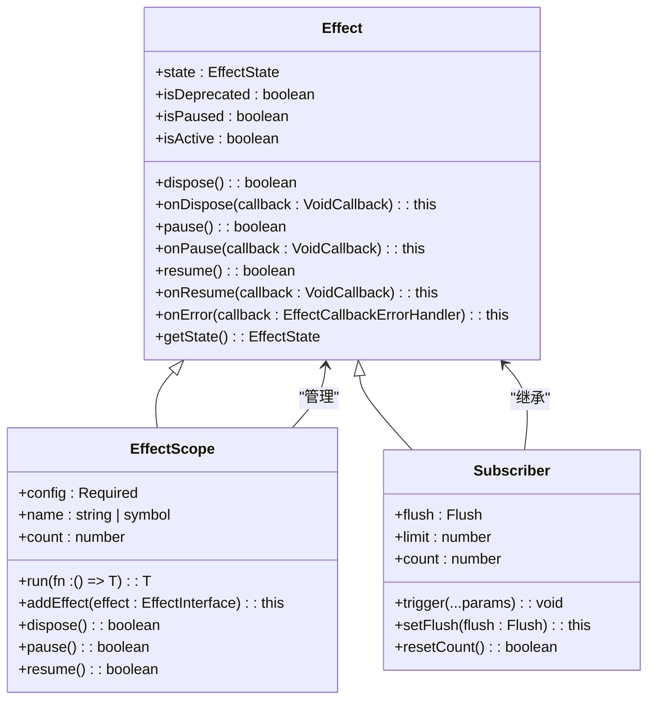
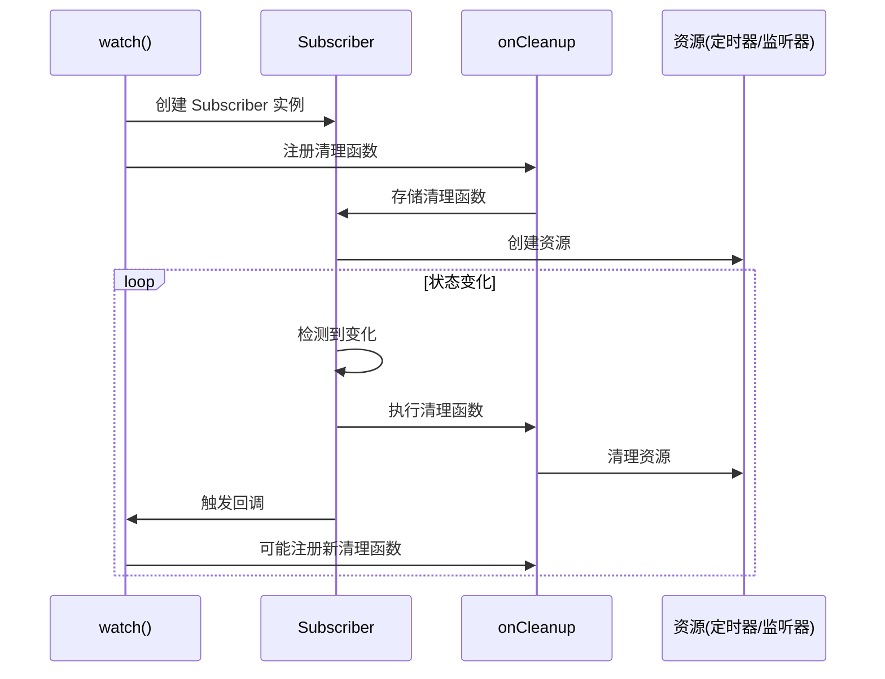
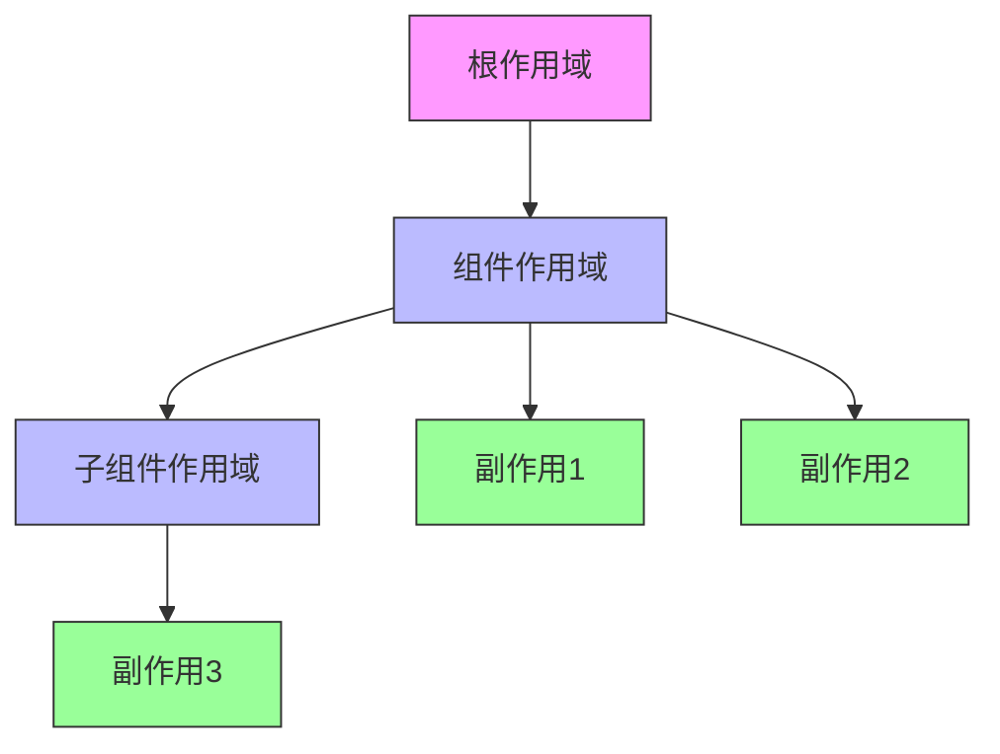
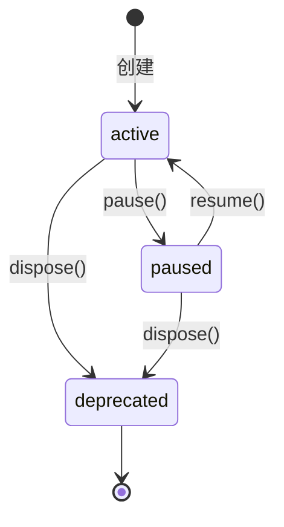
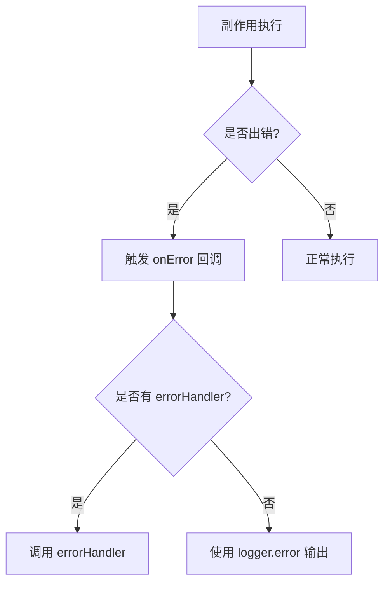

# 副作用管理

<cite>
**本文档引用文件**  
- [effect-scope.ts](file://packages/responsive/src/effect/effect-scope.ts)
- [effect.ts](file://packages/responsive/src/effect/effect.ts)
- [subscriber.ts](file://packages/responsive/src/observer/subscriber.ts)
- [watch.ts](file://packages/responsive/src/signal/watch/watch.ts)
- [context.ts](file://packages/responsive/src/context/context.ts)
- [effect-interface.ts](file://packages/responsive/src/effect/effect-interface.ts)
- [helpers.ts](file://packages/responsive/src/effect/helpers.ts)
</cite>

## 目录
1. [引言](#引言)
2. [核心组件分析](#核心组件分析)
3. [watch 的使用与清理机制](#watch-的使用与清理机制)
4. [EffectScope 统一管理副作用](#effectscope-统一管理副作用)
5. [onDispose 与 dispose 内部机制](#ondispose-与-dispose-内部机制)
6. [异步上下文中的作用域管理](#异步上下文中的作用域管理)
7. [错误处理与调试技巧](#错误处理与调试技巧)
8. [总结](#总结)

## 引言
Vitarx 框架提供了一套完整的副作用管理机制，通过 `watch` 和 `EffectScope` 实现对定时器、事件监听器等资源的高效管理，防止内存泄漏。本文档深入解析其内部实现原理，涵盖 `onCleanup` 回调、`scope.dispose()` 一键清理、异步上下文丢失问题的解决方案等核心内容。

## 核心组件分析
Vitarx 的副作用管理基于 `Effect` 类和 `EffectScope` 类构建，结合 `Subscriber` 和上下文管理机制，形成完整的生命周期管理体系。



**图示来源**  
- [effect.ts](file://packages/responsive/src/effect/effect.ts#L34-L261)
- [effect-scope.ts](file://packages/responsive/src/effect/effect-scope.ts#L40-L212)
- [subscriber.ts](file://packages/responsive/src/observer/subscriber.ts#L98-L248)

**本节来源**  
- [effect.ts](file://packages/responsive/src/effect/effect.ts#L34-L261)
- [effect-scope.ts](file://packages/responsive/src/effect/effect-scope.ts#L40-L212)
- [subscriber.ts](file://packages/responsive/src/observer/subscriber.ts#L98-L248)

## watch 的使用与清理机制
`watch` 函数是 Vitarx 中监听响应式数据变化的核心 API，它通过 `onCleanup` 回调机制实现副作用资源的自动清理。

### watch 函数签名
```typescript
function watch<T, C extends WatchCallback<T>>(
  source: T,
  callback: C,
  options?: WatchOptions
): Subscriber<VoidCallback>
```

### onCleanup 回调机制
`onCleanup` 是 `watch` 回调函数的第三个参数，用于注册清理函数。当监听器被销毁或下次触发前，注册的清理函数将被调用。



**图示来源**  
- [watch.ts](file://packages/responsive/src/signal/watch/watch.ts#L192-L296)
- [effect.ts](file://packages/responsive/src/effect/effect.ts#L107-L109)

**本节来源**  
- [watch.ts](file://packages/responsive/src/signal/watch/watch.ts#L192-L296)

## EffectScope 统一管理副作用
`EffectScope` 提供了组件级副作用生命周期的统一管理能力，通过 `scope.dispose()` 实现一键清理所有相关副作用。

### EffectScope 创建与配置
```typescript
interface EffectScopeOptions {
  attachToCurrentScope?: boolean
  name?: string | symbol
  errorHandler?: EffectCallbackErrorHandler | null
}
```

### 作用域层级管理


**图示来源**  
- [effect-scope.ts](file://packages/responsive/src/effect/effect-scope.ts#L10-L33)
- [helpers.ts](file://packages/responsive/src/effect/helpers.ts#L16-L18)

### 作用域运行机制
`run` 方法在指定作用域上下文中执行函数，确保其产生的副作用被正确捕获和管理。

```typescript
scope.run(() => {
  // 此函数内创建的所有副作用都会被添加到该作用域中
  const unwatch = watch(count, () => console.log(count.value))
  const timer = setTimeout(() => {}, 1000)
  onCleanup(() => clearTimeout(timer))
})
```

**本节来源**  
- [effect-scope.ts](file://packages/responsive/src/effect/effect-scope.ts#L123-L125)
- [context.ts](file://packages/responsive/src/context/context.ts#L45-L46)

## onDispose 与 dispose 内部机制
`onDispose` 和 `dispose` 是副作用生命周期管理的核心方法，它们共同构成了资源清理的基础。

### 生命周期状态转换


**图示来源**  
- [effect-interface.ts](file://packages/responsive/src/effect/effect-interface.ts#L36-L37)
- [effect.ts](file://packages/responsive/src/effect/effect.ts#L48-L81)

### dispose 方法执行流程
```mermaid
flowchart TD
Start([dispose()]) --> CheckState["检查是否已弃用"]
CheckState --> |是| ReturnTrue["返回 true"]
CheckState --> |否| SetDeprecated["设置状态为 deprecated"]
SetDeprecated --> TriggerDispose["触发 dispose 回调"]
TriggerDispose --> ClearCallbacks["清理所有回调"]
ClearCallbacks --> ReturnTrue
```

**图示来源**  
- [effect.ts](file://packages/responsive/src/effect/effect.ts#L96-L102)
- [effect-scope.ts](file://packages/responsive/src/effect/effect-scope.ts#L166-L178)

### onDispose 回调注册
```typescript
// 内部实现
private addCallback(callback: AnyCallback, type: EffectInherentErrorSource | 'error'): this {
  if (this.isDeprecated) {
    throw new Error('Cannot add callback to a deprecated effect.')
  }
  if (typeof callback !== 'function') {
    throw new TypeError(`Callback parameter for "${type}" must be a function.`)
  }
  if (!this.callbacks) {
    this.callbacks = new Map()
  }
  const callbackSet = this.callbacks.get(type) || new Set()
  callbackSet.add(callback)
  this.callbacks.set(type, callbackSet)
  return this
}
```

**本节来源**  
- [effect.ts](file://packages/responsive/src/effect/effect.ts#L224-L238)
- [effect-scope.ts](file://packages/responsive/src/effect/effect-scope.ts#L154-L155)

## 异步上下文中的作用域管理
在异步操作中，作用域上下文可能会丢失，Vitarx 提供了相应的解决方案。

### 问题场景
```typescript
const scope = createScope()
scope.run(() => {
  watch(count, () => console.log(count.value)) // 正常捕获
  
  setTimeout(() => {
    watch(count, () => console.log(count.value)) // 无法捕获，上下文丢失
  }, 1000)
})
```

### 解决方案：scope.run()
使用 `scope.run()` 重新进入作用域上下文：

```typescript
const scope = createScope()
scope.run(() => {
  setTimeout(() => {
    scope.run(() => {
      watch(count, () => console.log(count.value)) // 正确捕获
    })
  }, 1000)
})
```

### 异步上下文维护
对于 `async/await` 操作，需要使用 `withAsyncContext` API：

```typescript
import { withAsyncContext } from '@vitarx/responsive'

scope.run(async () => {
  await withAsyncContext(async () => {
    // 异步操作中保持上下文
    await fetch('/api/data')
    watch(count, () => console.log(count.value))
  })
})
```

**本节来源**  
- [effect-scope.ts](file://packages/responsive/src/effect/effect-scope.ts#L123-L125)
- [context.ts](file://packages/responsive/src/context/context.ts#L63-L64)

## 错误处理与调试技巧
Vitarx 提供了完善的错误处理机制和调试支持。

### 错误处理机制


**图示来源**  
- [effect.ts](file://packages/responsive/src/effect/effect.ts#L184-L197)

### 调试技巧
1. **命名作用域**：为 `EffectScope` 提供名称，便于调试识别
```typescript
const scope = createScope({ name: 'UserProfileScope' })
```

2. **错误处理器**：设置全局错误处理器
```typescript
const scope = createScope({
  errorHandler: (error, source) => {
    console.error(`[EffectScope Error] ${source}:`, error)
  }
})
```

3. **状态检查**：实时监控作用域状态
```typescript
console.log('Scope count:', scope.count)
console.log('Scope state:', scope.getState())
```

**本节来源**  
- [effect-scope.ts](file://packages/responsive/src/effect/effect-scope.ts#L27-L32)
- [effect.ts](file://packages/responsive/src/effect/effect.ts#L184-L197)

## 总结
Vitarx 的副作用管理策略通过 `watch` 和 `EffectScope` 的协同工作，实现了对定时器、事件监听器等资源的高效管理。`onCleanup` 回调机制确保了资源的及时清理，防止内存泄漏；`EffectScope` 提供了组件级副作用的统一管理，通过 `scope.dispose()` 实现一键清理；`onDispose` 和 `dispose` 方法构成了完整的生命周期管理基础；对于异步上下文丢失问题，通过 `scope.run()` 和 `withAsyncContext` 提供了有效的解决方案。这套机制既保证了开发的便利性，又确保了应用的性能和稳定性。