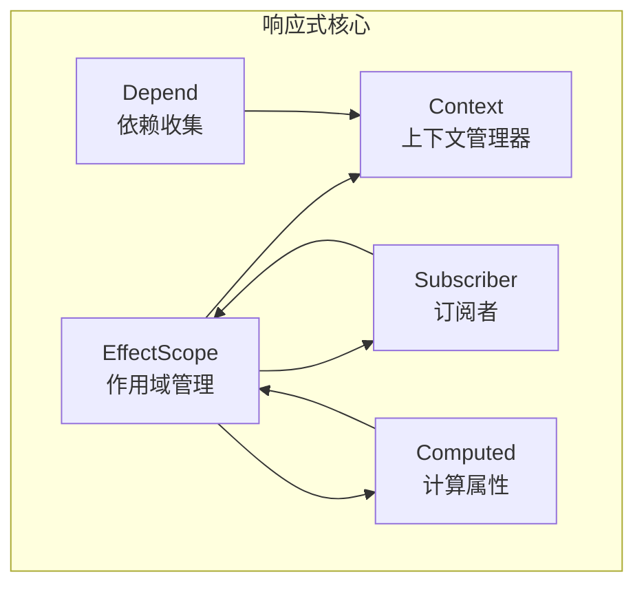
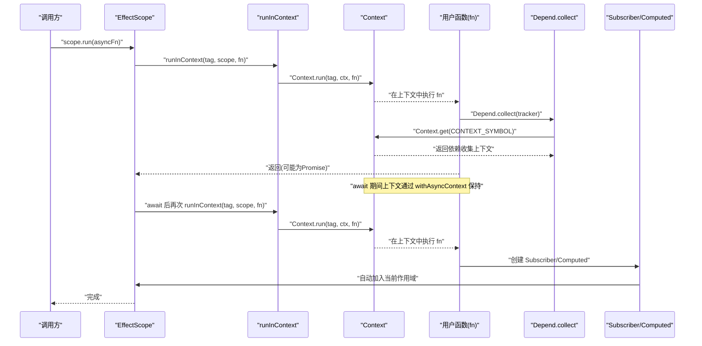
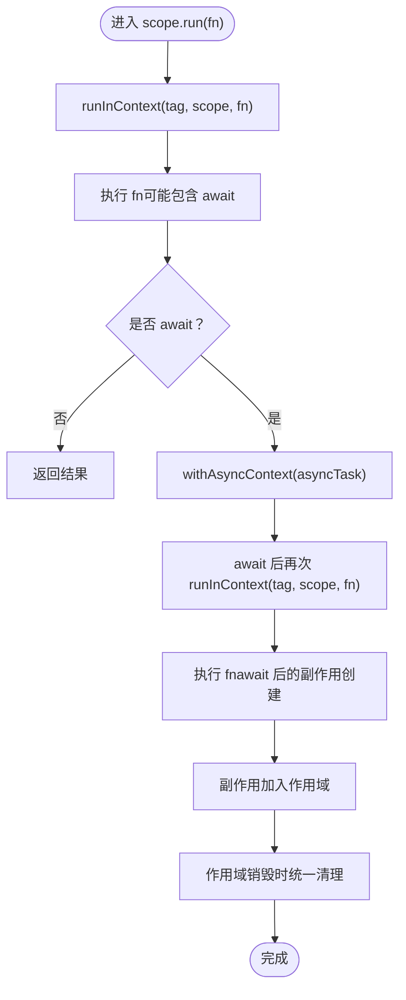
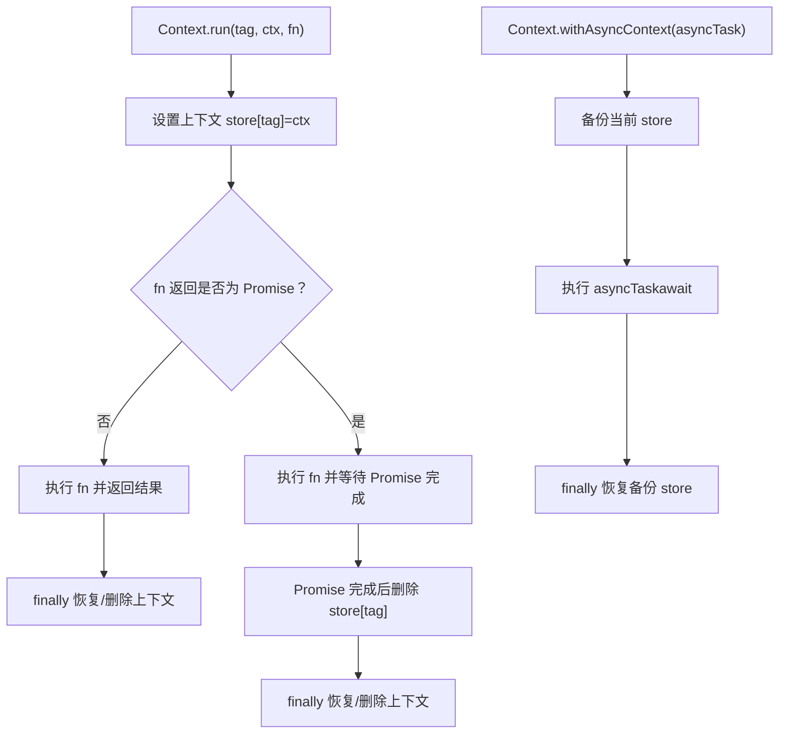
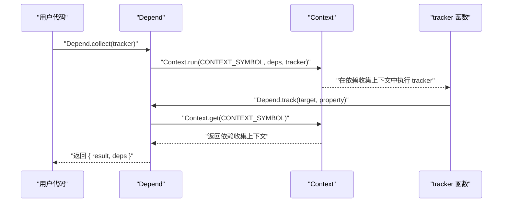
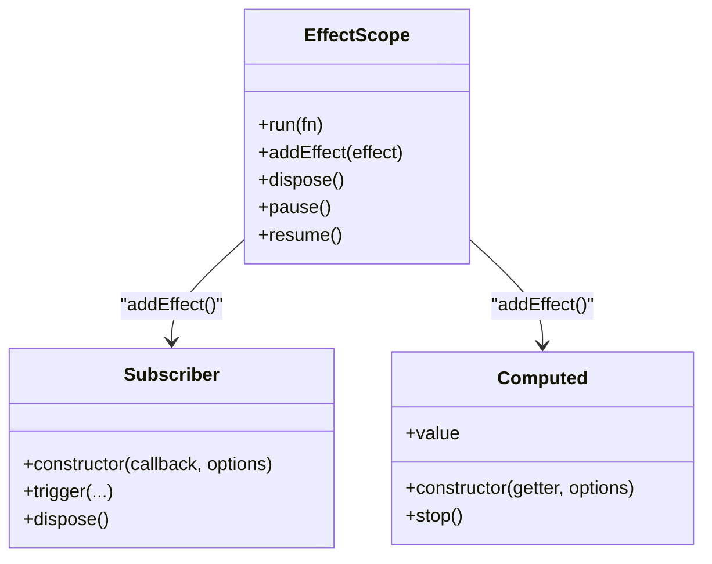
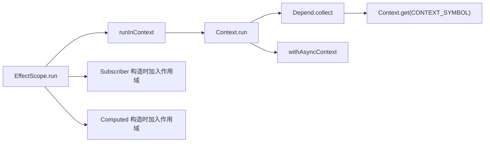

# 异步上下文维护

<cite>
**本文引用的文件列表**
- [effect-scope.ts](file://packages/responsive/src/effect/effect-scope.ts)
- [context.ts](file://packages/responsive/src/context/context.ts)
- [helpers.ts](file://packages/responsive/src/context/helpers.ts)
- [depend.ts](file://packages/responsive/src/depend/depend.ts)
- [subscriber.ts](file://packages/responsive/src/observer/subscriber.ts)
- [computed.ts](file://packages/responsive/src/signal/computed/computed.ts)
- [README.md](file://packages/responsive/README.md)
- [context.test.ts](file://packages/responsive/__tests__/context/context.test.ts)
- [helpers.test.ts](file://packages/responsive/__tests__/context/helpers.test.ts)
</cite>

## 目录
1. [简介](#简介)
2. [项目结构](#项目结构)
3. [核心组件](#核心组件)
4. [架构总览](#架构总览)
5. [详细组件分析](#详细组件分析)
6. [依赖关系分析](#依赖关系分析)
7. [性能考量](#性能考量)
8. [故障排查指南](#故障排查指南)
9. [结论](#结论)
10. [附录](#附录)

## 简介
本篇文档聚焦于 Vitarx 响应式系统在异步操作中“上下文丢失”的问题与解决方案，围绕 EffectScope.run() 如何在异步函数中重新建立作用域上下文展开，结合 context.ts 中 runInContext 的实现，解析其基于栈结构的上下文管理机制。文档还提供未使用 run() 导致的资源泄漏问题示例与正确使用 run() 的完整生命周期管理流程，并给出调试技巧与常见陷阱说明。

## 项目结构
与异步上下文维护直接相关的核心文件分布如下：
- effect-scope.ts：作用域管理与 run() 的入口，负责在指定上下文中运行副作用并捕获后续创建的副作用。
- context.ts：上下文管理器，提供 run()/withAsyncContext，分别用于同步/异步上下文维护。
- helpers.ts：runInContext/withAsyncContext 的便捷封装。
- depend.ts：依赖收集器，内部通过 Context.get(CONTEXT_SYMBOL) 获取当前依赖收集上下文。
- subscriber.ts：订阅者，支持自动加入当前作用域，便于作用域统一管理。
- computed.ts：计算属性，支持自动加入当前作用域，便于作用域统一管理。
- README.md：包含异步上下文维护的示例与最佳实践说明。
- 测试文件：验证上下文在异步场景下的行为与恢复。

图表来源
- [effect-scope.ts](file://packages/responsive/src/effect/effect-scope.ts#L1-L212)
- [context.ts](file://packages/responsive/src/context/context.ts#L1-L138)
- [depend.ts](file://packages/responsive/src/depend/depend.ts#L1-L152)
- [subscriber.ts](file://packages/responsive/src/observer/subscriber.ts#L1-L248)
- [computed.ts](file://packages/responsive/src/signal/computed/computed.ts#L1-L367)

章节来源
- [effect-scope.ts](file://packages/responsive/src/effect/effect-scope.ts#L1-L212)
- [context.ts](file://packages/responsive/src/context/context.ts#L1-L138)
- [depend.ts](file://packages/responsive/src/depend/depend.ts#L1-L152)
- [subscriber.ts](file://packages/responsive/src/observer/subscriber.ts#L1-L248)
- [computed.ts](file://packages/responsive/src/signal/computed/computed.ts#L1-L367)

## 核心组件
- EffectScope.run(fn)
  - 在当前作用域上下文中运行函数，确保在 fn 内部创建的副作用（如 watch、computed）被正确捕获到当前作用域。
  - 若 fn 内部存在 await，需配合 withAsyncContext 维护上下文，否则 await 后的副作用将无法被正确捕获。
- runInContext(tag, ctx, fn)
  - 在指定标签的上下文中同步运行函数，执行完成后恢复之前的上下文状态；若返回 Promise，将在 Promise 完成后自动删除该上下文。
- withAsyncContext(asyncTask)
  - 在异步任务前后备份/恢复上下文，保证 await 期间的上下文隔离与恢复。
- Depend.collect(fn)
  - 在当前上下文中收集函数执行过程中的依赖，依赖收集依赖 Context.get(CONTEXT_SYMBOL)。
- Subscriber/Computed
  - 订阅者与计算属性在构造时可自动加入当前作用域，便于统一生命周期管理。

章节来源
- [effect-scope.ts](file://packages/responsive/src/effect/effect-scope.ts#L112-L154)
- [helpers.ts](file://packages/responsive/src/context/helpers.ts#L1-L74)
- [context.ts](file://packages/responsive/src/context/context.ts#L1-L138)
- [depend.ts](file://packages/responsive/src/depend/depend.ts#L66-L86)
- [subscriber.ts](file://packages/responsive/src/observer/subscriber.ts#L135-L151)
- [computed.ts](file://packages/responsive/src/signal/computed/computed.ts#L156-L174)

## 架构总览
下面的序列图展示了 EffectScope.run() 在异步函数中重新建立作用域上下文的关键流程，以及依赖收集器如何在上下文中工作。

图表来源
- [effect-scope.ts](file://packages/responsive/src/effect/effect-scope.ts#L112-L154)
- [helpers.ts](file://packages/responsive/src/context/helpers.ts#L41-L73)
- [context.ts](file://packages/responsive/src/context/context.ts#L87-L119)
- [depend.ts](file://packages/responsive/src/depend/depend.ts#L66-L86)
- [subscriber.ts](file://packages/responsive/src/observer/subscriber.ts#L135-L151)
- [computed.ts](file://packages/responsive/src/signal/computed/computed.ts#L156-L174)

## 详细组件分析

### EffectScope.run() 与异步上下文
- 设计要点
  - run() 通过 runInContext(tag, ctx, fn) 将 EffectScope 实例作为上下文注入到 Context 中，使后续在该上下文中创建的副作用（如 watch、computed）能够被当前作用域捕获。
  - 文档注释明确指出：若函数内部存在异步操作（await），需要使用 withAsyncContext API 维护上下文，否则 await 之后的副作用将无法被正确捕获。
- 生命周期管理
  - run() 返回值可能是同步结果或 Promise；若为 Promise，await 后应再次通过 run() 进入同一作用域上下文，确保后续副作用仍被当前作用域持有。
  - 作用域销毁时，会遍历并 dispose 所有已添加的副作用，避免资源泄漏。

图表来源
- [effect-scope.ts](file://packages/responsive/src/effect/effect-scope.ts#L112-L154)
- [helpers.ts](file://packages/responsive/src/context/helpers.ts#L41-L73)
- [context.ts](file://packages/responsive/src/context/context.ts#L114-L137)

章节来源
- [effect-scope.ts](file://packages/responsive/src/effect/effect-scope.ts#L112-L154)
- [README.md](file://packages/responsive/README.md#L1394-L1410)

### Context.run()/withAsyncContext 的上下文管理机制
- run(tag, ctx, fn)
  - 同步运行：在执行 fn 前设置指定上下文，执行完成后恢复之前的上下文状态；若 fn 返回 Promise，则在 Promise 完成后自动删除该上下文。
- withAsyncContext(asyncTask)
  - 浏览器端：先备份当前上下文 store，执行 asyncTask 后再恢复备份；确保 await 期间的上下文隔离与最终恢复。
  - Node.js 端：使用 AsyncLocalStorage 保证异步操作之间的上下文隔离。

图表来源
- [context.ts](file://packages/responsive/src/context/context.ts#L87-L137)

章节来源
- [context.ts](file://packages/responsive/src/context/context.ts#L1-L138)
- [helpers.ts](file://packages/responsive/src/context/helpers.ts#L1-L74)

### 依赖收集与上下文的关系
- Depend.collect(fn)
  - 在执行 fn 前，通过 Context.run(CONTEXT_SYMBOL, dependencies, fn) 将依赖收集上下文注入到 Context 中。
  - 在 fn 执行过程中，Depend.track(target, property) 通过 Context.get(CONTEXT_SYMBOL) 获取当前依赖收集上下文并记录依赖。
- 这意味着：只要在正确的上下文中执行依赖收集，就能准确捕获到依赖关系。

图表来源
- [depend.ts](file://packages/responsive/src/depend/depend.ts#L66-L86)

章节来源
- [depend.ts](file://packages/responsive/src/depend/depend.ts#L1-L152)

### 订阅者与计算属性的作用域集成
- Subscriber
  - 构造时可自动加入当前作用域（scope: true），或显式传入 EffectScope 实例，从而在作用域销毁时自动清理。
- Computed
  - 构造时可自动加入当前作用域（scope: true），或显式传入 EffectScope 实例，从而在作用域销毁时自动清理。

图表来源
- [effect-scope.ts](file://packages/responsive/src/effect/effect-scope.ts#L112-L210)
- [subscriber.ts](file://packages/responsive/src/observer/subscriber.ts#L135-L151)
- [computed.ts](file://packages/responsive/src/signal/computed/computed.ts#L156-L174)

章节来源
- [subscriber.ts](file://packages/responsive/src/observer/subscriber.ts#L1-L248)
- [computed.ts](file://packages/responsive/src/signal/computed/computed.ts#L1-L367)

## 依赖关系分析
- EffectScope.run() 依赖 runInContext(tag, ctx, fn)，后者委托 Context.run() 实现上下文注入。
- Depend.collect() 依赖 Context.get(CONTEXT_SYMBOL) 获取依赖收集上下文。
- Subscriber/Computed 在构造时依赖 EffectScope.getCurrentScope() 自动加入当前作用域。
- 浏览器端 withAsyncContext 通过备份/恢复 Context.store 实现上下文隔离与恢复。

图表来源
- [effect-scope.ts](file://packages/responsive/src/effect/effect-scope.ts#L112-L154)
- [helpers.ts](file://packages/responsive/src/context/helpers.ts#L41-L73)
- [context.ts](file://packages/responsive/src/context/context.ts#L87-L137)
- [depend.ts](file://packages/responsive/src/depend/depend.ts#L66-L86)
- [subscriber.ts](file://packages/responsive/src/observer/subscriber.ts#L135-L151)
- [computed.ts](file://packages/responsive/src/signal/computed/computed.ts#L156-L174)

章节来源
- [effect-scope.ts](file://packages/responsive/src/effect/effect-scope.ts#L1-L212)
- [context.ts](file://packages/responsive/src/context/context.ts#L1-L138)
- [depend.ts](file://packages/responsive/src/depend/depend.ts#L1-L152)
- [subscriber.ts](file://packages/responsive/src/observer/subscriber.ts#L1-L248)
- [computed.ts](file://packages/responsive/src/signal/computed/computed.ts#L1-L367)

## 性能考量
- 合理选择 flush 与 limit
  - 使用 Subscriber 的 limit 选项限制一次性监听器的触发次数，减少无效更新。
  - 使用合适的 flush（'sync'/'default'/'pre'/'post'）平衡实时性与批处理效率。
- 作用域统一管理
  - 将副作用集中放入作用域，便于批量销毁，避免资源泄漏导致的性能下降。
- 依赖收集最小化
  - 通过 Depend.collect/track 的上下文机制，确保只收集必要的依赖，避免冗余订阅。

[本节为通用指导，不直接分析具体文件]

## 故障排查指南
- 常见问题：异步上下文丢失
  - 现象：在 await 之后创建的副作用（watch、computed）未被当前作用域捕获，导致无法随作用域销毁而清理。
  - 解决：在 await 之后再次调用 scope.run(() => {...}) 重新进入作用域上下文。
- 调试技巧
  - 使用 Depend.collect 检查依赖收集是否正确。
  - 使用 hasSubscribers/notify 等工具辅助定位订阅者状态。
  - 参考测试用例验证 withAsyncContext 的行为与恢复。
- 常见陷阱
  - 忘记在 await 之后再次进入作用域上下文。
  - 在浏览器端未使用 withAsyncContext 维护上下文。
  - 作用域未正确销毁，导致副作用泄漏。

章节来源
- [README.md](file://packages/responsive/README.md#L1394-L1410)
- [README.md](file://packages/responsive/README.md#L1530-L1557)
- [context.test.ts](file://packages/responsive/__tests__/context/context.test.ts#L1-L94)
- [helpers.test.ts](file://packages/responsive/__tests__/context/helpers.test.ts#L1-L32)

## 结论
EffectScope.run() 通过 runInContext 将作用域实例注入到 Context 中，使副作用在作用域上下文中被正确捕获。在异步场景中，await 会导致上下文断开，因此需要配合 withAsyncContext 与再次 run() 重新进入作用域上下文，确保 await 之后创建的副作用（watch、computed）仍被当前作用域持有。结合 Depend.collect 的上下文机制与 Subscriber/Computed 的作用域集成，可实现完整的生命周期管理与资源清理，避免资源泄漏与性能问题。

[本节为总结性内容，不直接分析具体文件]

## 附录
- 示例路径参考
  - 异步上下文维护示例：[README.md](file://packages/responsive/README.md#L1394-L1410)
  - 上下文测试用例：[context.test.ts](file://packages/responsive/__tests__/context/context.test.ts#L1-L94)
  - 辅助函数测试用例：[helpers.test.ts](file://packages/responsive/__tests__/context/helpers.test.ts#L1-L32)