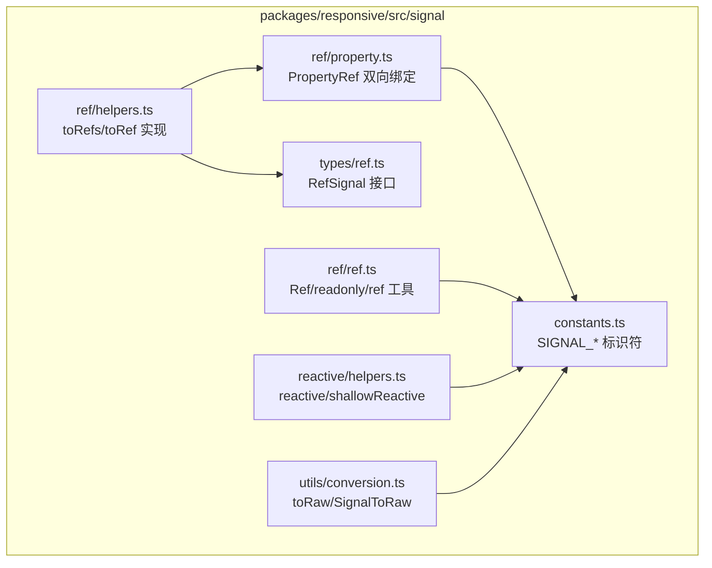
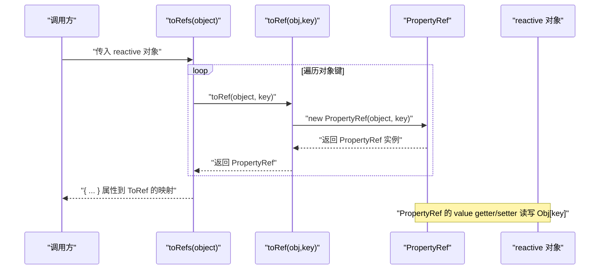
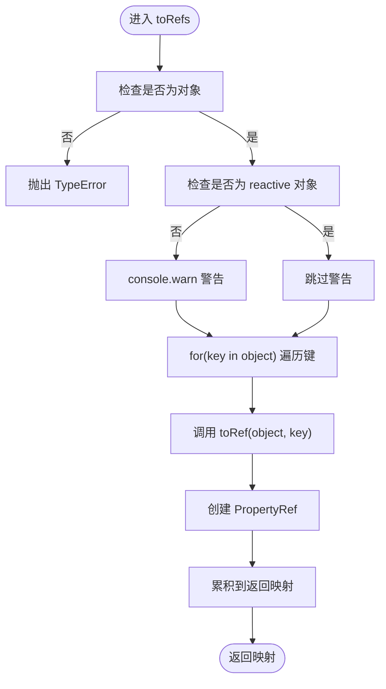
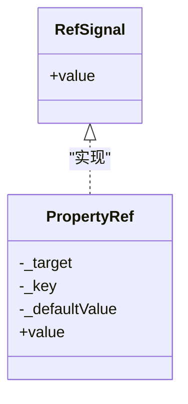
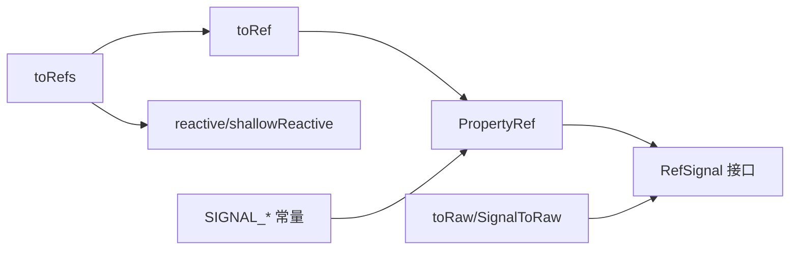

# toRefs 解构响应式对象

<cite>
**本文引用的文件列表**
- [helpers.ts](file://packages/responsive/src/signal/ref/helpers.ts)
- [property.ts](file://packages/responsive/src/signal/ref/property.ts)
- [ref.ts](file://packages/responsive/src/signal/ref/ref.ts)
- [ref.test.ts](file://packages/responsive/__tests__/signal/ref.test.ts)
- [helpers.ts (reactive)](file://packages/responsive/src/signal/reactive/helpers.ts)
- [index.ts (responsive)](file://packages/responsive/src/signal/index.ts)
- [README.md (responsive)](file://packages/responsive/README.md)
- [constants.ts](file://packages/responsive/src/signal/constants.ts)
- [conversion.ts](file://packages/responsive/src/signal/utils/conversion.ts)
- [ref.ts (types)](file://packages/responsive/src/signal/types/ref.ts)
</cite>

## 目录
1. [简介](#简介)
2. [项目结构](#项目结构)
3. [核心组件](#核心组件)
4. [架构总览](#架构总览)
5. [详细组件分析](#详细组件分析)
6. [依赖关系分析](#依赖关系分析)
7. [性能考量](#性能考量)
8. [故障排查指南](#故障排查指南)
9. [结论](#结论)
10. [附录](#附录)

## 简介
本篇文档围绕如何使用 toRefs 解决 reactive 对象解构后丢失响应性的问题展开，基于源码逐层剖析 toRefs 的实现机制：遍历 reactive 对象的每个 key，使用 toRef(object, key) 为每个属性创建具有双向绑定能力的 PropertyRef；并在组合式函数（composables）中返回响应式状态的标准模式，如 useUser 返回 { user, name, age } = toRefs(state)。文档还对比了错误做法（直接解构）与正确做法的效果差异，通过测试用例验证双向同步行为；说明 toRefs 对新增属性的处理限制（不会自动追踪新属性），并建议配合 reactive 使用；提供 TypeScript 类型推导说明，确保返回类型保持精确；最后给出常见错误排查方法，如解构后值不更新、类型报错等。

## 项目结构
本仓库采用多包结构，响应式核心位于 packages/responsive，其中 ref 与 reactive 相关逻辑集中在 signal 子目录下，toRefs 与 toRef 的实现位于 ref/helpers.ts，PropertyRef 作为双向绑定的核心载体位于 ref/property.ts，reactive 的代理创建位于 reactive/helpers.ts。

图表来源
- [helpers.ts](file://packages/responsive/src/signal/ref/helpers.ts#L183-L199)
- [property.ts](file://packages/responsive/src/signal/ref/property.ts#L36-L54)
- [ref.ts](file://packages/responsive/src/signal/ref/ref.ts#L70-L110)
- [helpers.ts (reactive)](file://packages/responsive/src/signal/reactive/helpers.ts#L35-L43)
- [ref.ts (types)](file://packages/responsive/src/signal/types/ref.ts#L10-L22)
- [conversion.ts](file://packages/responsive/src/signal/utils/conversion.ts#L10-L12)
- [constants.ts](file://packages/responsive/src/signal/constants.ts#L1-L25)

章节来源
- [helpers.ts](file://packages/responsive/src/signal/ref/helpers.ts#L1-L200)
- [helpers.ts (reactive)](file://packages/responsive/src/signal/reactive/helpers.ts#L1-L112)

## 核心组件
- toRefs：将 reactive 对象的每个属性转换为独立的 ref，保持双向绑定。对非 reactive 对象会发出警告但仍可工作。
- toRef：重载丰富，支持将普通值、函数、已有 Ref、以及对象属性转换为合适的 Ref；当传入对象与键时，返回与属性双向绑定的 PropertyRef。
- PropertyRef：实现 RefSignal 接口，提供 value 的 getter/setter，读写均指向目标对象的对应属性，从而实现双向绑定。
- reactive：创建响应式代理对象，使对象属性变更可被追踪；toRefs 默认要求传入 reactive 对象以获得完整双向关联性。
- RefSignal/Ref：RefSignal 是统一的引用信号接口，Ref 是通用的可写引用信号实现；toRefs 返回的 ToRef<T[K]> 在类型层面保证精确。

章节来源
- [helpers.ts](file://packages/responsive/src/signal/ref/helpers.ts#L183-L199)
- [helpers.ts](file://packages/responsive/src/signal/ref/helpers.ts#L120-L164)
- [property.ts](file://packages/responsive/src/signal/ref/property.ts#L36-L54)
- [ref.ts (types)](file://packages/responsive/src/signal/types/ref.ts#L10-L22)
- [ref.ts](file://packages/responsive/src/signal/ref/ref.ts#L70-L110)
- [helpers.ts (reactive)](file://packages/responsive/src/signal/reactive/helpers.ts#L35-L43)

## 架构总览
下面的序列图展示了 toRefs 的调用流程：调用方传入 reactive 对象，toRefs 遍历对象键，对每个键调用 toRef(object, key)，toRef 再创建 PropertyRef 并返回，最终返回一个属性到 ToRef 的映射。

图表来源
- [helpers.ts](file://packages/responsive/src/signal/ref/helpers.ts#L183-L199)
- [helpers.ts](file://packages/responsive/src/signal/ref/helpers.ts#L120-L164)
- [property.ts](file://packages/responsive/src/signal/ref/property.ts#L36-L54)

## 详细组件分析

### toRefs 的实现机制与双向绑定
- 遍历策略：toRefs 对传入对象执行 for(key in object) 遍历，确保仅处理自有可枚举键。
- 类型约束：ToRef<T[K]> 在类型层面区分 RefSignal 与普通 Ref，避免类型退化。
- 双向绑定：每个属性通过 toRef(object, key) 创建 PropertyRef，PropertyRef 的 value getter 读取 Obj[key]，setter 直接写入 Obj[key]，从而实现双向同步。
- 兼容性：若传入非 reactive 对象，会发出警告但仍然创建 PropertyRef；此时对新增属性无自动追踪，仍可通过 reactive 包裹解决。

图表来源
- [helpers.ts](file://packages/responsive/src/signal/ref/helpers.ts#L183-L199)

章节来源
- [helpers.ts](file://packages/responsive/src/signal/ref/helpers.ts#L183-L199)

### toRef 的重载与 PropertyRef 双向绑定
- 重载模式：toRef 支持函数（只读）、已有 Ref（直接返回）、普通值（可写）、对象+键（PropertyRef）四种形态。
- PropertyRef 行为：value getter 读取目标对象属性，setter 写回目标对象属性；支持默认值，当属性不存在时返回默认值。
- 类型推导：ToRef<T[K]> 在返回类型中保留精确的属性类型，避免泛型退化。

图表来源
- [ref.ts (types)](file://packages/responsive/src/signal/types/ref.ts#L10-L22)
- [property.ts](file://packages/responsive/src/signal/ref/property.ts#L36-L54)

章节来源
- [helpers.ts](file://packages/responsive/src/signal/ref/helpers.ts#L120-L164)
- [property.ts](file://packages/responsive/src/signal/ref/property.ts#L36-L54)
- [ref.ts (types)](file://packages/responsive/src/signal/types/ref.ts#L10-L22)

### 组合式函数（composables）中的标准模式
- 推荐模式：在组合式函数中返回响应式状态时，先将 reactive 状态解构成多个 ref，再解构使用，这样既保持响应性又便于按需消费。
- 示例路径：README 中提供了 useUser 返回 { count, user } = toRefs(state) 的使用场景，强调解构后保持响应性。

章节来源
- [README.md (responsive)](file://packages/responsive/README.md#L294-L324)

### 错误做法 vs 正确做法：直接解构 vs toRefs
- 错误做法（直接解构）：解构出的普通值不再是响应式引用，对这些值的修改不会反映到 reactive 对象中，也不会触发依赖更新。
- 正确做法（使用 toRefs）：将每个属性转换为 PropertyRef，解构后仍可双向绑定到 reactive 对象，修改任一端都会同步到另一端。
- 测试验证：测试用例覆盖了双向绑定与对普通对象的警告行为，验证了正确做法的效果。

章节来源
- [ref.test.ts](file://packages/responsive/__tests__/signal/ref.test.ts#L152-L187)

### 新增属性的处理限制与建议
- 限制：toRefs 仅对已有键创建 PropertyRef；对后续新增属性不会自动追踪，因为遍历发生在创建时。
- 建议：若需要动态新增属性并保持响应性，应在创建阶段就使用 reactive 包裹对象，或在新增属性后重新解构 toRefs。

章节来源
- [helpers.ts](file://packages/responsive/src/signal/ref/helpers.ts#L183-L199)

### TypeScript 类型推导说明
- ToRef<T[K]>：当 T[K] 已经是 RefSignal 时返回 T[K]，否则返回 Ref<T[K]>，确保返回类型精确。
- UnwrapRef<T>：用于解包 RefSignal 的原始值类型，避免类型退化。
- SignalToRaw<T>：toRaw 的类型映射，用于将信号类型还原为原始值类型。

章节来源
- [helpers.ts](file://packages/responsive/src/signal/ref/helpers.ts#L8-L23)
- [conversion.ts](file://packages/responsive/src/signal/utils/conversion.ts#L10-L12)

## 依赖关系分析
- toRefs 依赖 toRef，toRef 依赖 PropertyRef；PropertyRef 依赖 RefSignal 接口与常量标识符。
- reactive 提供响应式代理能力，toRefs 默认要求传入 reactive 对象以获得完整的双向关联性。
- toRaw/SignalToRaw 提供类型映射与原始值访问，有助于理解 Ref 与 Proxy 的类型关系。

图表来源
- [helpers.ts](file://packages/responsive/src/signal/ref/helpers.ts#L120-L199)
- [property.ts](file://packages/responsive/src/signal/ref/property.ts#L36-L54)
- [ref.ts (types)](file://packages/responsive/src/signal/types/ref.ts#L10-L22)
- [helpers.ts (reactive)](file://packages/responsive/src/signal/reactive/helpers.ts#L35-L43)
- [conversion.ts](file://packages/responsive/src/signal/utils/conversion.ts#L10-L12)
- [constants.ts](file://packages/responsive/src/signal/constants.ts#L1-L25)

章节来源
- [helpers.ts](file://packages/responsive/src/signal/ref/helpers.ts#L120-L199)
- [property.ts](file://packages/responsive/src/signal/ref/property.ts#L36-L54)
- [ref.ts (types)](file://packages/responsive/src/signal/types/ref.ts#L10-L22)
- [helpers.ts (reactive)](file://packages/responsive/src/signal/reactive/helpers.ts#L35-L43)
- [conversion.ts](file://packages/responsive/src/signal/utils/conversion.ts#L10-L12)
- [constants.ts](file://packages/responsive/src/signal/constants.ts#L1-L25)

## 性能考量
- 遍历开销：toRefs 对对象键进行一次遍历，创建 PropertyRef；对于大型对象，遍历成本与属性数量线性相关。
- 双向绑定成本：PropertyRef 的 getter/setter 仅做一次对象属性读写，成本较低；但在高频更新场景下仍需关注依赖收集与通知开销。
- 深度代理：toRefs 本身不改变对象的代理深度，但若对象是 reactive，其内部属性变更仍受 reactive 的 deep 配置影响。

## 故障排查指南
- 解构后值不更新
  - 症状：对解构出的值进行修改，reactive 对象未同步更新。
  - 排查：确认是否使用 toRefs 将属性转换为 PropertyRef；若直接解构普通值，将失去响应性。
  - 验证：参考测试用例中对双向绑定的断言路径。
- 类型报错
  - 症状：ToRef 推导不符合预期，或 Ref 与 Proxy 类型混淆。
  - 排查：检查返回类型是否为 ToRef<T[K]>；确认属性类型未被退化为 Ref<T[K]>。
  - 参考：ToRef/UnwrapRef 的类型定义路径。
- 对新增属性无响应
  - 症状：运行时新增属性后，解构出的 ref 不再响应。
  - 排查：toRefs 仅对已有键创建 PropertyRef；建议在创建阶段使用 reactive 包裹对象，或在新增属性后重新解构 toRefs。
- 非 reactive 对象警告
  - 症状：传入普通对象时出现警告但仍可工作。
  - 处理：将对象通过 reactive 包裹后再传入 toRefs，以获得完整的双向关联性。

章节来源
- [ref.test.ts](file://packages/responsive/__tests__/signal/ref.test.ts#L152-L187)
- [helpers.ts](file://packages/responsive/src/signal/ref/helpers.ts#L183-L199)
- [helpers.ts](file://packages/responsive/src/signal/ref/helpers.ts#L8-L23)

## 结论
toRefs 通过遍历 reactive 对象的每个键并使用 toRef 创建 PropertyRef，实现了对解构后属性的双向绑定，从而解决了 reactive 对象解构后丢失响应性的问题。在组合式函数中，推荐使用 { ... } = toRefs(state) 的模式返回响应式状态，既保持响应性又提升可读性。需要注意 toRefs 对新增属性的处理限制，建议配合 reactive 使用；同时利用 TypeScript 的 ToRef/UnwrapRef 等类型工具，确保返回类型精确可靠。通过测试用例可验证双向同步行为，结合本文的排障指南可快速定位常见问题。

## 附录
- 关键实现路径
  - toRefs：[helpers.ts](file://packages/responsive/src/signal/ref/helpers.ts#L183-L199)
  - toRef：[helpers.ts](file://packages/responsive/src/signal/ref/helpers.ts#L120-L164)
  - PropertyRef：[property.ts](file://packages/responsive/src/signal/ref/property.ts#L36-L54)
  - Ref/RefSignal：[ref.ts](file://packages/responsive/src/signal/ref/ref.ts#L70-L110), [ref.ts (types)](file://packages/responsive/src/signal/types/ref.ts#L10-L22)
  - reactive：[helpers.ts (reactive)](file://packages/responsive/src/signal/reactive/helpers.ts#L35-L43)
  - 类型映射：[conversion.ts](file://packages/responsive/src/signal/utils/conversion.ts#L10-L12)
  - 常量标识：[constants.ts](file://packages/responsive/src/signal/constants.ts#L1-L25)
- 使用示例路径
  - README 中的 useUser 场景：[README.md (responsive)](file://packages/responsive/README.md#L294-L324)
- 测试用例路径
  - toRefs 双向绑定与警告：[ref.test.ts](file://packages/responsive/__tests__/signal/ref.test.ts#L152-L187)
  - toRef 对象属性双向绑定与默认值：[ref.test.ts](file://packages/responsive/__tests__/signal/ref.test.ts#L122-L149)