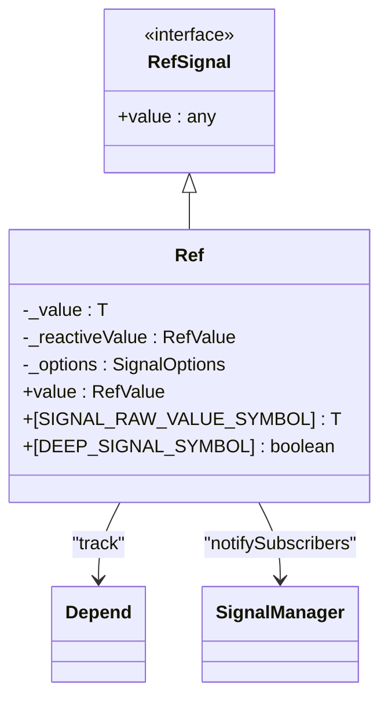
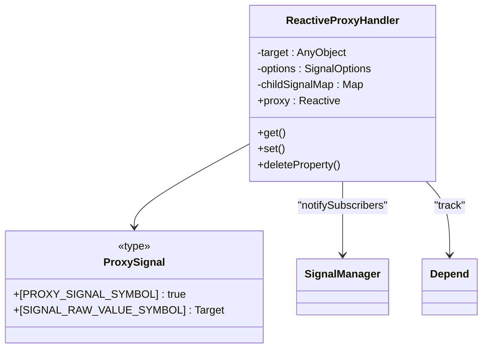
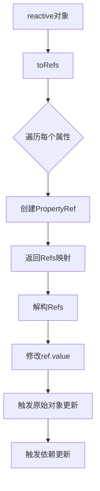
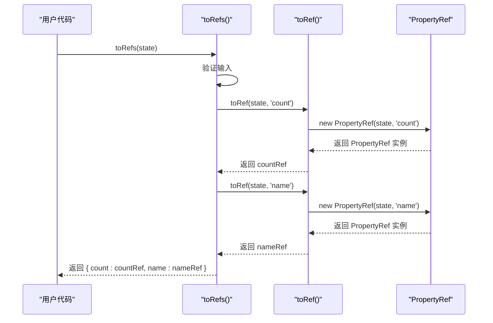
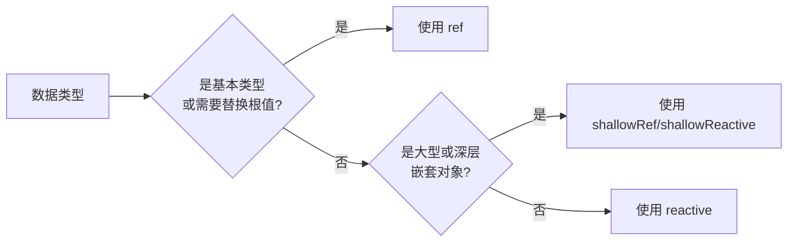

# 响应式数据使用

<cite>
**本文档引用文件**  
- [ref.ts](file://packages/responsive/src/signal/ref/ref.ts)
- [proxy-handler.ts](file://packages/responsive/src/signal/reactive/proxy-handler.ts)
- [helpers.ts](file://packages/responsive/src/signal/ref/helpers.ts)
- [conversion.ts](file://packages/responsive/src/signal/utils/conversion.ts)
- [types/index.ts](file://packages/responsive/src/signal/types/index.ts)
- [constants.ts](file://packages/responsive/src/signal/constants.ts)
- [ref/index.ts](file://packages/responsive/src/signal/ref/index.ts)
- [reactive/index.ts](file://packages/responsive/src/signal/reactive/index.ts)
</cite>

## 目录
1. [引言](#引言)
2. [核心概念与选择策略](#核心概念与选择策略)
3. [解构响应式对象的正确方式](#解构响应式对象的正确方式)
4. [toRef 与 toRefs 实现机制](#toref-与-torefs-实现机制)
5. [反模式与常见错误](#反模式与常见错误)
6. [类型推导与类型安全](#类型推导与类型安全)
7. [性能影响与优化建议](#性能影响与优化建议)
8. [错误排查与调试方法](#错误排查与调试方法)
9. [总结](#总结)

## 引言
Vitarx 框架提供了一套完整的响应式系统，通过 `ref` 和 `reactive` 两种核心机制实现数据的响应式追踪。本文档深入探讨了在不同场景下如何合理选择和使用这些机制，重点分析了 `toRefs` 如何解决 `reactive` 对象解构时的响应性丢失问题，并结合源码揭示了 `toRef` 和 `toRefs` 的内部实现原理。文档还提供了反模式对比、类型推导机制、性能考量以及常见问题的排查方法，旨在为开发者提供一套完整的响应式数据最佳实践指南。

## 核心概念与选择策略

### ref 的适用场景
`ref` 主要用于包装基本类型值或需要替换根值的对象。根据源码分析，`ref` 是一个实现了 `RefSignal` 接口的类，其核心是通过 `value` 属性来暴露和管理内部值。当 `value` 被访问时，会触发依赖收集（`Depend.track`）；当 `value` 被修改时，会通知所有订阅者进行更新。



**图示来源**
- [ref.ts](file://packages/responsive/src/signal/ref/ref.ts#L70-L287)
- [constants.ts](file://packages/responsive/src/signal/constants.ts#L4-L16)

`ref` 的优势在于其值可以被完全替换。例如，`user.value = newUser` 是完全合法的操作，这使得 `ref` 在处理需要整体替换的数据源时非常灵活。

### reactive 的适用场景
`reactive` 用于创建一个响应式代理对象，它通过 ES6 Proxy 拦截对象的 `get`、`set`、`deleteProperty` 等操作来实现响应式。`reactive` 更适合处理对象类型的数据，且通常用于仅修改对象内部属性的场景。



**图示来源**
- [proxy-handler.ts](file://packages/responsive/src/signal/reactive/proxy-handler.ts#L83-L300)
- [constants.ts](file://packages/responsive/src/signal/constants.ts#L17-L24)

`reactive` 的一个关键限制是，你不能直接替换整个代理对象（`state = newState`），因为这会丢失响应性。你只能修改其内部属性（`state.count = 1`）。这使得 `reactive` 在处理结构稳定、仅需局部更新的对象时非常高效。

**本节来源**
- [ref.ts](file://packages/responsive/src/signal/ref/ref.ts#L70-L287)
- [proxy-handler.ts](file://packages/responsive/src/signal/reactive/proxy-handler.ts#L83-L300)

## 解构响应式对象的正确方式

### 问题：直接解构导致响应性丢失
直接对 `reactive` 对象进行解构是一个常见的反模式。例如：
```typescript
const state = reactive({ count: 0, name: 'John' })
const { count, name } = state // ❌ 错误：count 和 name 是普通变量，不再响应式
count++ // 不会触发视图更新
```
在这种情况下，`count` 和 `name` 只是 `state` 对象属性的快照，它们与原始的 `reactive` 对象失去了联系，因此修改它们不会触发任何响应式更新。

### 解决方案：使用 toRefs
`toRefs` 函数是解决此问题的正确方案。它会遍历 `reactive` 对象的每一个属性，并为每个属性创建一个 `ref`，这些 `ref` 与原始对象的属性保持双向绑定。



**图示来源**
- [helpers.ts](file://packages/responsive/src/signal/ref/helpers.ts#L184-L199)
- [property.ts](file://packages/responsive/src/signal/ref/property.ts#L36-L54)

使用 `toRefs` 后的代码如下：
```typescript
const state = reactive({ count: 0, name: 'John' })
const { count, name } = toRefs(state) // ✅ 正确：count 和 name 是 ref
count.value++ // ✅ 会触发视图更新，state.count 也会同步更新
```

**本节来源**
- [helpers.ts](file://packages/responsive/src/signal/ref/helpers.ts#L184-L199)
- [property.ts](file://packages/responsive/src/signal/ref/property.ts#L36-L54)

## toRef 与 toRefs 实现机制

### toRefs 的内部实现
`toRefs` 函数的核心逻辑非常清晰。它首先检查输入是否为对象，然后遍历对象的每一个可枚举属性，对每个属性调用 `toRef(object, key)`，并将结果收集到一个新对象中返回。

```typescript
export function toRefs<T extends object>(
  object: T,
  skipWarn = false
): { [K in keyof T]: ToRef<T[K]> } {
  if (!isRecordObject(object)) {
    throw new TypeError(`toRefs() called on a non-object`)
  }
  if (!skipWarn && !isProxySignal(object)) {
    console.warn(`toRefs() called on a non-reactive object`)
  }
  const ret: any = {}
  for (const key in object) {
    ret[key] = toRef(object, key) // 为每个属性创建 ref
  }
  return ret
}
```

### toRef 的多态性实现
`toRef` 函数是一个重载函数，根据不同的参数组合表现出不同的行为：
1.  **对象属性重载** (`toRef(object, key, defaultValue?)`): 创建一个 `PropertyRef`，实现与对象属性的双向绑定。
2.  **函数重载** (`toRef(() => value)`): 创建一个只读的 `ReadonlyRef`，其值通过调用函数获取。
3.  **普通值重载** (`toRef(value)`): 将普通值包装成一个可写的 `Ref`。
4.  **Ref 重载** (`toRef(ref)`): 直接返回传入的 `Ref` 对象。

这种多态性设计使得 `toRef` 成为一个非常通用的工具函数，能够处理各种数据源。



**图示来源**
- [helpers.ts](file://packages/responsive/src/signal/ref/helpers.ts#L141-L164)
- [property.ts](file://packages/responsive/src/signal/ref/property.ts#L36-L54)

**本节来源**
- [helpers.ts](file://packages/responsive/src/signal/ref/helpers.ts#L141-L164)
- [property.ts](file://packages/responsive/src/signal/ref/property.ts#L36-L54)

## 反模式与常见错误

### 反模式对比
| 反模式 | 问题描述 | 正确解决方案 |
| :--- | :--- | :--- |
| `const { count } = reactive({ count: 0 })` | 解构后 `count` 是普通变量，修改不会触发更新。 | 使用 `const { count } = toRefs(reactive({ count: 0 }))`，`count` 变为 `ref`。 |
| `state = newState` | 直接替换 `reactive` 对象会丢失响应性。 | 使用 `Object.assign(state, newState)` 或 `state.count = newState.count` 等方式修改属性。 |
| `shallowRef({ nested: { deep: 1 } })` | 浅层 `ref` 不会代理嵌套对象，修改 `nested.deep` 不会触发更新。 | 改用 `ref({ nested: { deep: 1 } })` 或在修改后手动调用 `ref.forceUpdate()`。 |

### 常见错误排查
1.  **修改数据但视图未更新**:
    *   检查是否对 `reactive` 对象进行了直接解构。
    *   检查是否在 `computed` 或 `watch` 的回调中执行了异步操作而没有正确处理依赖。
    *   检查是否使用了 `shallowRef` 或 `shallowReactive`，而实际需要深度响应。

2.  **`toRefs` 发出警告**:
    *   警告 `toRefs() called on a non-reactive object` 表明传入 `toRefs` 的对象不是 `reactive` 创建的。虽然 `toRefs` 仍会工作，但创建的 `ref` 与原对象是单向的（修改 `ref` 会更新对象，但直接修改对象不会更新 `ref`）。

**本节来源**
- [README.md](file://packages/responsive/README.md#L1478-L1486)
- [helpers.ts](file://packages/responsive/src/signal/ref/helpers.ts#L191-L192)

## 类型推导与类型安全

### 类型定义分析
Vitarx 的响应式系统利用 TypeScript 的高级类型特性来保证类型安全。

*   **`UnwrapNestedRefs<T>`**: 这个类型递归地解包对象中所有 `Ref` 类型的属性。例如，`UnwrapNestedRefs<{ name: Ref<string>, age: number }>` 的结果是 `{ name: string, age: number }`。这解释了为什么在 `reactive` 对象中使用 `ref` 时，可以直接访问 `user.name` 而不需要 `.value`。

*   **`ToRef<T>`**: 这是一个条件类型，如果 `T` 已经是 `RefSignal`，则返回 `T` 本身，否则返回 `Ref<T>`。这保证了 `toRef` 函数的返回类型是精确的。

*   **`Reactive<T>`**: 这个类型定义了 `reactive` 函数的返回类型，它是一个 `ProxySignal`，结合了原始类型 `T` 和解包后的类型 `UnwrapNestedRefs<T>`。

这些类型定义确保了开发者在使用响应式 API 时能够获得准确的类型提示和编译时检查。

**本节来源**
- [ref.ts](file://packages/responsive/src/signal/ref/ref.ts#L39-L41)
- [proxy-handler.ts](file://packages/responsive/src/signal/reactive/proxy-handler.ts#L38-L42)
- [helpers.ts](file://packages/responsive/src/signal/ref/helpers.ts#L14-L15)

## 性能影响与优化建议

### 性能考量
*   **`ref` vs `reactive`**: `ref` 对于基本类型来说开销很小。`reactive` 由于使用了 Proxy，对每个属性访问和修改都有一定的性能开销，但对于对象来说，这种开销是值得的，因为它提供了更自然的语法。
*   **深度代理**: `ref` 和 `reactive` 默认都是深度代理的。这意味着它们会递归地将所有嵌套对象也转换为响应式。对于大型或深层嵌套的对象，这可能会带来显著的性能开销。
*   **`toRefs`**: `toRefs` 本身只是一个遍历和创建 `ref` 的过程，性能开销很小。它带来的好处是解构后的响应性，远大于其开销。

### 优化建议
1.  **使用浅层响应式**: 对于大型对象或已知结构简单的对象，使用 `shallowRef` 或 `shallowReactive` 来避免深度代理的开销。
2.  **标记非响应式数据**: 使用 `markNonSignal` 函数标记那些不需要响应式的对象（如第三方库的实例或大型静态数据），以跳过代理过程。
3.  **合理选择**: 对于基本类型和需要替换根值的场景，优先使用 `ref`；对于结构稳定、仅需修改属性的对象，使用 `reactive`。



**图示来源**
- [README.md](file://packages/responsive/README.md#L1416-L1417)
- [ref.ts](file://packages/responsive/src/signal/ref/ref.ts#L413-L472)

**本节来源**
- [README.md](file://packages/responsive/README.md#L1412-L1448)
- [ref.ts](file://packages/responsive/src/signal/ref/ref.ts#L413-L472)

## 错误排查与调试方法

### 常见错误排查
1.  **检查响应式标识**: 可以通过检查对象是否具有 `SIGNAL_SYMBOL` 等内部符号来判断一个对象是否是响应式对象。
2.  **利用 `toRaw`**: `toRaw` 函数可以获取响应式对象的原始值，这在调试时非常有用，可以查看代理对象内部的实际数据。
3.  **关注控制台警告**: 框架会在不推荐的操作（如对非响应式对象使用 `toRefs`）时发出警告，这些警告是重要的调试线索。

### 调试技巧
*   在 `ref` 的 `get value` 和 `set value` 方法中设置断点，可以观察依赖收集和更新通知的流程。
*   在 `ReactiveProxyHandler` 的 `get` 和 `set` 方法中设置断点，可以观察 `reactive` 对象的代理行为。

**本节来源**
- [conversion.ts](file://packages/responsive/src/signal/utils/conversion.ts#L43-L48)
- [README.md](file://packages/responsive/README.md#L1478-L1486)

## 总结
在 Vitarx 框架中，`ref` 和 `reactive` 是构建响应式应用的两大基石。`ref` 适用于基本类型和需要替换根值的场景，而 `reactive` 更适合处理对象类型且仅修改属性的场景。当需要解构 `reactive` 对象时，必须使用 `toRefs` 来保持响应性，避免直接解构导致的响应性丢失。`toRef` 和 `toRefs` 的实现机制巧妙地利用了 `PropertyRef` 来建立双向绑定。开发者应理解这些机制的类型推导、性能影响，并遵循最佳实践，避免常见的反模式，以构建高效、可靠的响应式应用。