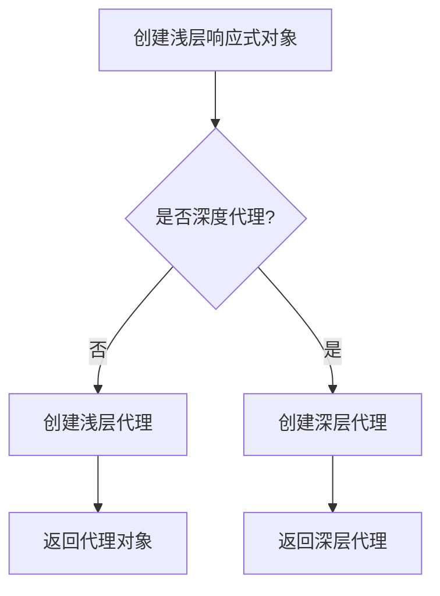
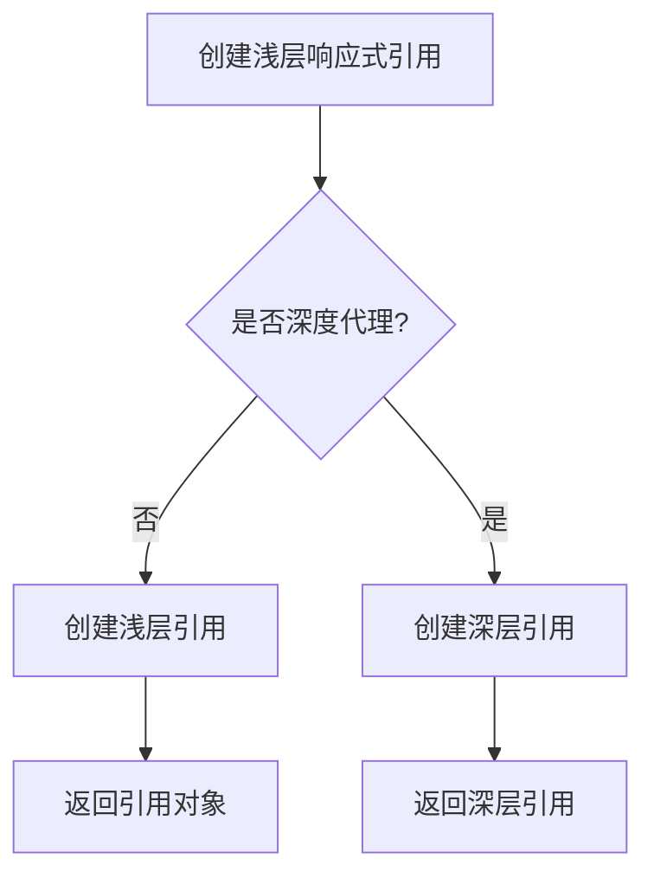
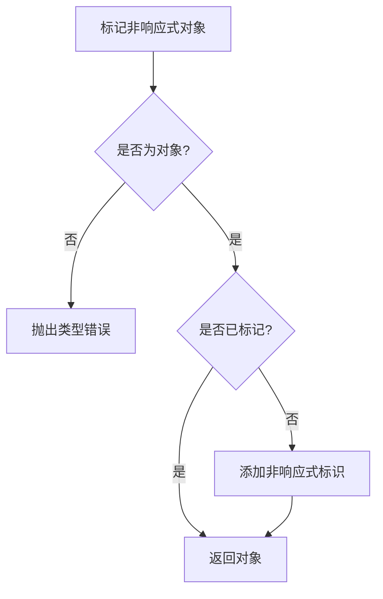
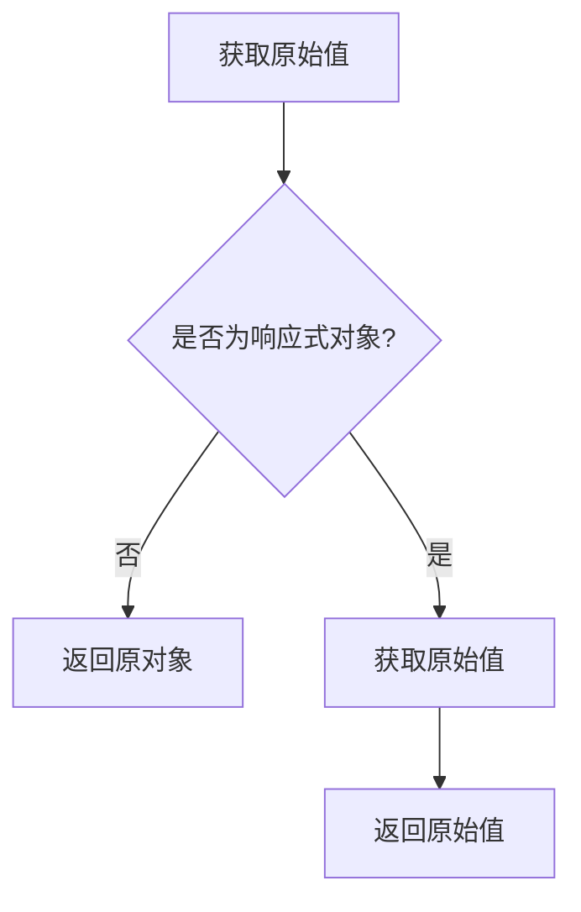
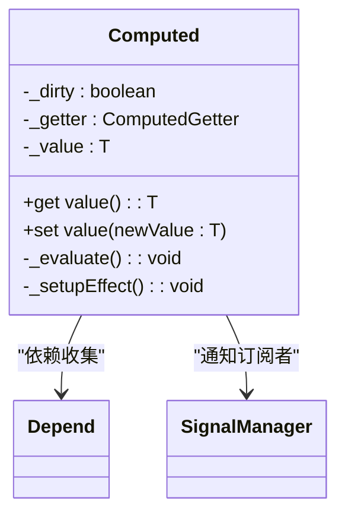
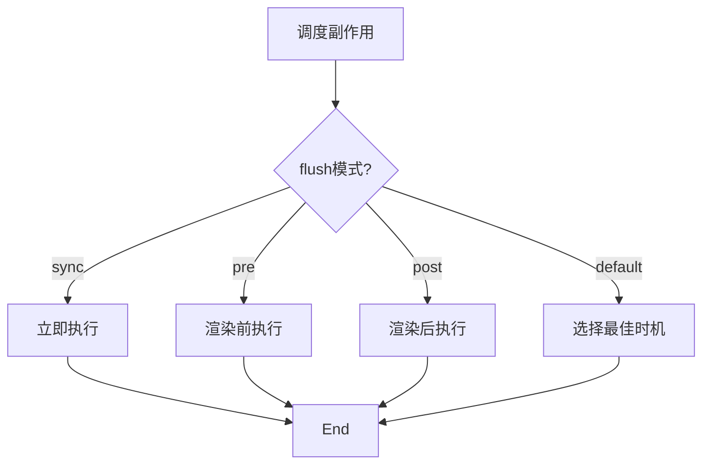

# 性能优化

<cite>
**本文档引用的文件**   
- [computed.ts](file://packages/responsive/src/signal/computed/computed.ts)
- [ref.ts](file://packages/responsive/src/signal/ref/ref.ts)
- [proxy-handler.ts](file://packages/responsive/src/signal/reactive/proxy-handler.ts)
- [constants.ts](file://packages/responsive/src/signal/constants.ts)
- [base.ts](file://packages/responsive/src/signal/types/base.ts)
- [scheduler.ts](file://packages/responsive/src/observer/scheduler.ts)
- [conversion.ts](file://packages/responsive/src/signal/utils/conversion.ts)
- [mark.ts](file://packages/responsive/src/signal/utils/mark.ts)
- [helpers.ts](file://packages/responsive/src/signal/reactive/helpers.ts)
</cite>

## 目录
1. [简介](#简介)
2. [避免深度代理](#避免深度代理)
3. [跳过响应式处理](#跳过响应式处理)
4. [避免 Proxy 兼容性问题](#避免-proxy-兼容性问题)
5. [计算属性优化](#计算属性优化)
6. [更新时机优化](#更新时机优化)
7. [性能对比与基准测试](#性能对比与基准测试)

## 简介
Vitarx 应用提供了一系列性能优化策略，旨在减少对大型或深层对象进行不必要的递归代理所带来的性能开销。通过使用 `shallowReactive` 和 `shallowRef`，可以避免对深层对象的递归代理；利用 `markNonSignal` 可以标记第三方类实例或静态大数据，使其完全跳过响应式处理；`unreactive` 在与第三方库集成时能有效避免 Proxy 兼容性问题。此外，`computed` 的懒计算与缓存机制可避免重复计算，而 `flush` 调度模式（sync、pre、post、default）则用于优化更新时机。本指南将详细介绍这些关键优化策略，并提供性能对比示例和基准测试建议。

## 避免深度代理
在处理大型或深层对象时，深度代理会带来显著的性能开销。Vitarx 提供了 `shallowReactive` 和 `shallowRef` 来避免这种不必要的递归代理。

### shallowReactive
`shallowReactive` 创建一个浅层响应式代理对象，仅代理顶层属性，不会递归地将嵌套对象转换为响应式信号。这在处理大型数据结构时非常有用，因为它减少了代理创建和依赖追踪的开销。

**Diagram sources**
- [proxy-handler.ts](file://packages/responsive/src/signal/reactive/proxy-handler.ts#L83-L156)
- [helpers.ts](file://packages/responsive/src/signal/reactive/helpers.ts#L56-L61)

### shallowRef
`shallowRef` 创建一个浅层响应式引用对象，其行为类似于 `shallowReactive`，但适用于值引用场景。它仅对顶层值进行代理，而不递归处理嵌套对象。

**Diagram sources**
- [ref.ts](file://packages/responsive/src/signal/ref/ref.ts#L413-L472)

## 跳过响应式处理
对于某些不需要响应式的对象，如第三方类实例或静态大数据，可以通过 `markNonSignal` 标记它们，使其完全跳过响应式处理。

### markNonSignal
`markNonSignal` 函数用于将一个对象标记为永远不会被转换为响应式信号。被标记的对象在传递给 `reactive` 或 `ref` 时将保持原样，不会被代理。

**Diagram sources**
- [mark.ts](file://packages/responsive/src/signal/utils/mark.ts#L23-L37)

## 避免 Proxy 兼容性问题
在与第三方库集成时，Proxy 的兼容性问题可能导致意外行为。`unreactive` 函数可以帮助解决这一问题。

### unreactive
`unreactive` 函数用于获取响应式对象的原始值，从而绕过响应式系统直接操作原始数据。这对于需要将响应式对象传递给不支持 Proxy 的外部库时特别有用。

**Diagram sources**
- [helpers.ts](file://packages/responsive/src/signal/reactive/helpers.ts#L109-L111)

## 计算属性优化
`computed` 提供了懒计算与缓存机制，避免了重复计算带来的性能损耗。

### 懒计算与缓存
`computed` 实现了懒计算策略：首次访问时设置副作用并计算结果，后续访问时仅当依赖变化时才重新计算。同时，计算结果会被缓存，避免重复计算。

**Diagram sources**
- [computed.ts](file://packages/responsive/src/signal/computed/computed.ts#L98-L367)

## 更新时机优化
通过 `flush` 调度模式（sync、pre、post、default），可以优化更新时机，确保在合适的时机执行副作用。

### flush 调度模式
`flush` 调度模式决定了副作用的执行时机：
- `sync`: 同步执行，立即触发更新。
- `pre`: 在渲染前执行，适合需要在渲染前完成的准备工作。
- `post`: 在渲染后执行，适合清理工作和后置处理。
- `default`: 默认模式，根据情况选择最佳时机。

**Diagram sources**
- [scheduler.ts](file://packages/responsive/src/observer/scheduler.ts#L44-L326)

## 性能对比与基准测试
为了验证上述优化策略的效果，建议进行性能对比和基准测试。

### 性能对比示例
比较使用 `shallowReactive` 和 `reactive` 处理大型对象时的性能差异：
- `shallowReactive`: 仅代理顶层属性，性能开销小。
- `reactive`: 递归代理所有嵌套属性，性能开销大。

### 基准测试建议
1. **创建测试用例**：编写包含大型或深层对象的测试用例。
2. **测量性能指标**：记录创建代理、访问属性、修改属性等操作的时间。
3. **对比不同策略**：分别使用 `shallowReactive`、`shallowRef`、`markNonSignal` 和 `unreactive` 进行测试，比较性能差异。
4. **分析结果**：根据测试结果调整优化策略，选择最适合的方案。

通过以上方法，可以有效地评估和优化 Vitarx 应用的性能表现。

**Section sources**
- [computed.ts](file://packages/responsive/src/signal/computed/computed.ts#L1-L367)
- [ref.ts](file://packages/responsive/src/signal/ref/ref.ts#L1-L473)
- [proxy-handler.ts](file://packages/responsive/src/signal/reactive/proxy-handler.ts#L1-L398)
- [constants.ts](file://packages/responsive/src/signal/constants.ts#L1-L25)
- [base.ts](file://packages/responsive/src/signal/types/base.ts#L1-L89)
- [scheduler.ts](file://packages/responsive/src/observer/scheduler.ts#L1-L326)
- [conversion.ts](file://packages/responsive/src/signal/utils/conversion.ts#L1-L49)
- [mark.ts](file://packages/responsive/src/signal/utils/mark.ts#L1-L60)
- [helpers.ts](file://packages/responsive/src/signal/reactive/helpers.ts#L1-L112)