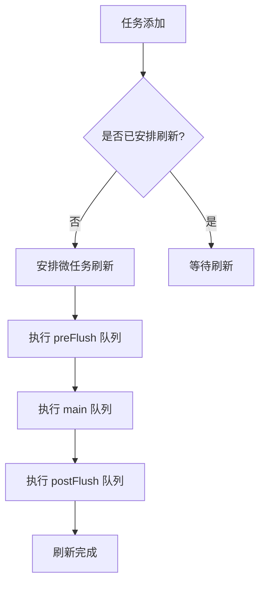
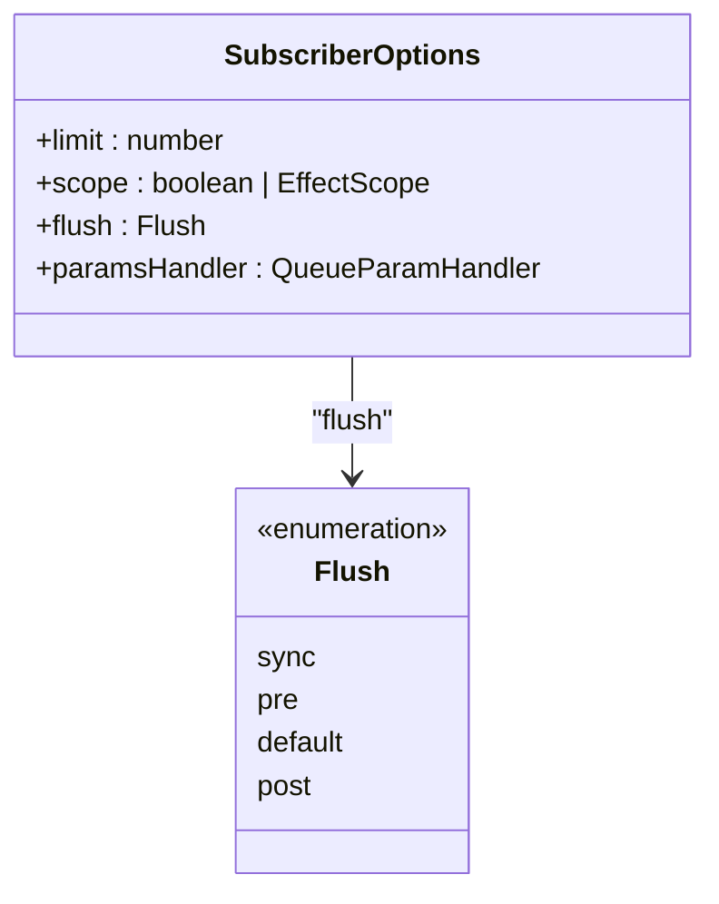
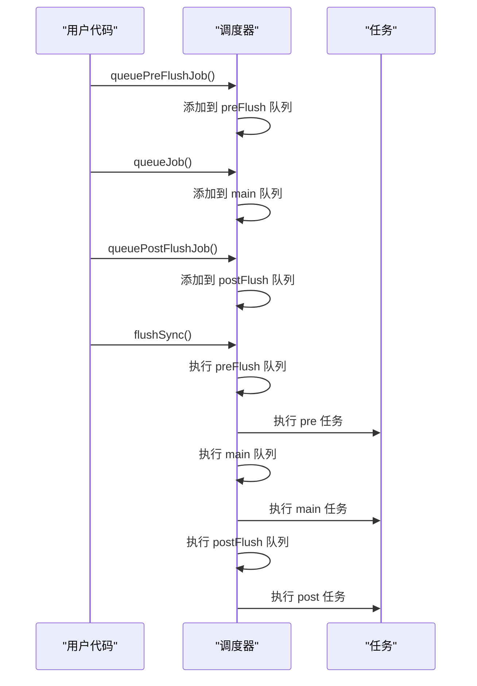
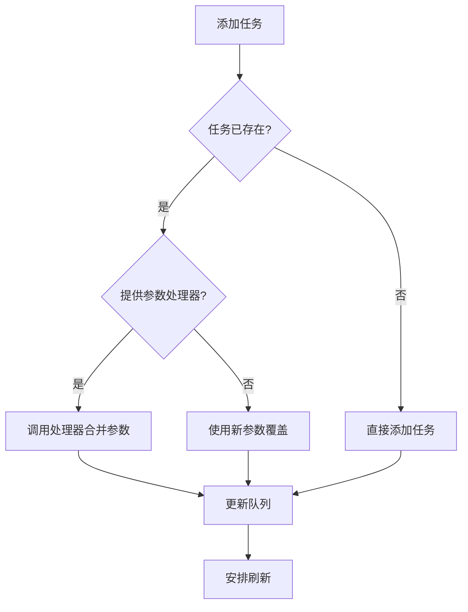
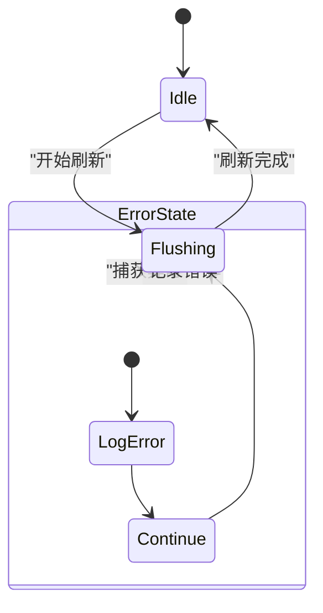
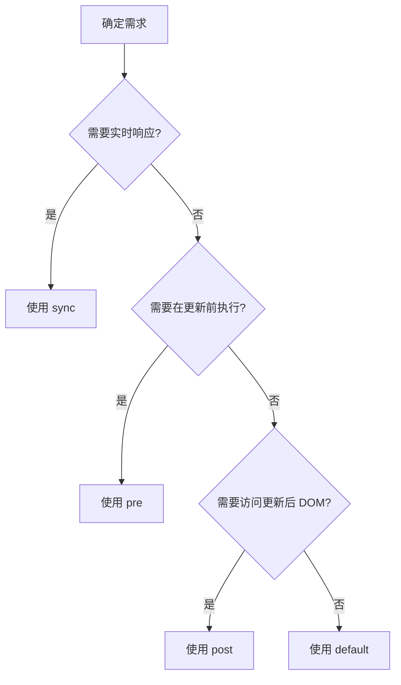

# 更新调度策略

<cite>
**本文档引用文件**  
- [scheduler.ts](file://packages/responsive/src/observer/scheduler.ts)
- [subscriber.ts](file://packages/responsive/src/observer/subscriber.ts)
- [watch.ts](file://packages/responsive/src/signal/watch/watch.ts)
- [depend.ts](file://packages/responsive/src/depend/depend.ts)
- [scheduler.test.ts](file://packages/responsive/__tests__/observer/core/scheduler.test.ts)
- [subscriber.test.ts](file://packages/responsive/__tests__/observer/core/subscriber.test.ts)
- [watch.test.ts](file://packages/responsive/__tests__/signal/watch.test.ts)
- [README.md](file://packages/responsive/README.md)
</cite>

## 目录
1. [引言](#引言)
2. [核心调度机制](#核心调度机制)
3. [flush 选项详解](#flush-选项详解)
4. [任务队列执行顺序](#任务队列执行顺序)
5. [参数合并机制](#参数合并机制)
6. [性能优化与适用场景](#性能优化与适用场景)
7. [错误处理与递归保护](#错误处理与递归保护)
8. [测试用例分析](#测试用例分析)
9. [最佳实践](#最佳实践)

## 引言

更新调度策略是响应式系统的核心机制，负责管理副作用的执行时机与顺序。通过 `flush` 选项的灵活配置，开发者可以精确控制更新行为，优化应用性能。本文档全面解析 `flush` 选项（sync、pre、post、default）对性能的影响与适用场景，结合调度器测试用例说明任务队列的执行顺序与合并机制，指导开发者合理选择调度策略以减少不必要的渲染循环，提升动画流畅度和应用响应性。

**Section sources**
- [README.md](file://packages/responsive/README.md#L752-L768)

## 核心调度机制

调度器（Scheduler）采用三阶段任务队列模型，确保任务按预定顺序执行：

- **preFlush 队列**：在主任务执行前运行，用于准备工作和前置处理
- **main 队列**：组件更新等核心任务的主要执行阶段
- **postFlush 队列**：在主任务执行后运行，用于后置处理和清理工作

调度器基于 Promise 微任务实现异步执行，同时提供 `flushSync` 方法支持同步立即执行。任务添加时会自动安排刷新操作，确保所有待执行任务在下一个微任务周期内被处理。



**Diagram sources**
- [scheduler.ts](file://packages/responsive/src/observer/scheduler.ts#L54-L61)
- [scheduler.ts](file://packages/responsive/src/observer/scheduler.ts#L261-L274)

**Section sources**
- [scheduler.ts](file://packages/responsive/src/observer/scheduler.ts#L1-L326)

## flush 选项详解

`SubscriberOptions` 中的 `flush` 参数控制副作用的执行时机，支持四种模式：

### sync 模式
- **执行时机**：同步立即执行
- **适用场景**：需要实时响应的场景，如测量 DOM 元素尺寸
- **特点**：绕过队列机制，立即执行回调函数

### pre 模式
- **执行时机**：在下一次更新周期开始时触发
- **适用场景**：需要在 DOM 更新前执行的操作，如计算布局
- **特点**：加入 preFlush 队列，在主任务前执行

### default 模式
- **执行时机**：合并批处理
- **适用场景**：大部分场景的默认选择，适用于常规异步更新
- **特点**：加入 main 队列，支持任务合并

### post 模式
- **执行时机**：在下一次更新周期结束时触发
- **适用场景**：需要访问更新后 DOM 的场景，如动画效果
- **特点**：加入 postFlush 队列，在主任务后执行



**Diagram sources**
- [subscriber.ts](file://packages/responsive/src/observer/subscriber.ts#L13-L47)
- [watch.ts](file://packages/responsive/src/signal/watch/watch.ts#L147-L151)

**Section sources**
- [subscriber.ts](file://packages/responsive/src/observer/subscriber.ts#L1-L248)
- [watch.ts](file://packages/responsive/src/signal/watch/watch.ts#L1-L432)

## 任务队列执行顺序

调度器严格按照 preFlush → main → postFlush 的顺序执行任务队列。这种分阶段执行机制确保了逻辑的正确性和可预测性。

### 执行流程
1. 添加任务到相应队列
2. 安排微任务刷新
3. 按顺序执行三个队列中的任务
4. 清理状态，准备下一次刷新

### 测试验证
测试用例验证了任务执行顺序的正确性：

```typescript
// 验证执行顺序
Scheduler.queuePostFlushJob(() => executionOrder.push('post'))
Scheduler.queueJob(() => executionOrder.push('main'))
Scheduler.queuePreFlushJob(() => executionOrder.push('pre'))
Scheduler.flushSync()
// 结果: ['pre', 'main', 'post']
```



**Diagram sources**
- [scheduler.test.ts](file://packages/responsive/__tests__/observer/core/scheduler.test.ts#L40-L50)
- [scheduler.ts](file://packages/responsive/src/observer/scheduler.ts#L269-L271)

**Section sources**
- [scheduler.test.ts](file://packages/responsive/__tests__/observer/core/scheduler.test.ts#L1-L430)

## 参数合并机制

调度器支持智能参数合并，当同一任务被多次调度时，可以合并新旧参数。

### 合并策略
- **提供参数处理器**：调用处理器函数合并新旧参数
- **未提供处理器**：使用新参数覆盖旧参数
- **无参数**：保持原有参数或 undefined

### 实现原理
```typescript
private static addJobToQueue<T extends Job>(
  queue: QueueMap,
  job: T,
  params?: Parameters<T>,
  handleParams?: QueueParamHandler<Parameters<T>>
): void {
  if (queue.has(job)) {
    const oldParams = queue.get(job)
    const newParams = handleParams
      ? handleParams(params as Parameters<T>, oldParams as Parameters<T>)
      : params
    queue.set(job, newParams)
  } else {
    queue.set(job, params)
  }
  this.scheduleFlush()
}
```



**Diagram sources**
- [scheduler.ts](file://packages/responsive/src/observer/scheduler.ts#L217-L234)
- [scheduler.test.ts](file://packages/responsive/__tests__/observer/core/scheduler.test.ts#L78-L91)

**Section sources**
- [scheduler.ts](file://packages/responsive/src/observer/scheduler.ts#L31-L37)
- [scheduler.test.ts](file://packages/responsive/__tests__/observer/core/scheduler.test.ts#L68-L107)

## 性能优化与适用场景

合理选择 `flush` 策略对应用性能有显著影响。

### 性能对比
| 模式 | 性能特点 | 内存占用 | 适用频率 |
|------|----------|----------|----------|
| sync | 高延迟，阻塞主线程 | 低 | 低频 |
| pre | 中等延迟，非阻塞 | 中 | 中频 |
| default | 低延迟，批处理优化 | 中 | 高频 |
| post | 中等延迟，非阻塞 | 中 | 中频 |

### 适用场景推荐
- **sync**：DOM 测量、同步计算、调试场景
- **pre**：布局计算、样式预处理、动画准备
- **default**：数据更新、状态同步、常规响应
- **post**：动画执行、DOM 操作、性能监控

### 优化建议
1. 频繁更新使用 `default` 模式进行批处理
2. 动画相关操作使用 `post` 模式确保 DOM 已更新
3. 避免在 `sync` 模式下执行耗时操作
4. 合理使用 `limit` 选项限制触发次数

**Section sources**
- [README.md](file://packages/responsive/README.md#L1416-L1421)
- [watch.test.ts](file://packages/responsive/__tests__/signal/watch.test.ts#L147-L154)

## 错误处理与递归保护

调度器内置完善的错误处理和递归保护机制，确保系统稳定性。

### 错误处理
- 捕获任务执行中的异常
- 记录错误信息但不中断整个刷新流程
- 避免单个任务失败影响其他任务执行

### 递归保护
- 检测是否已在刷新中，避免并发刷新
- 使用 `isFlushing` 标志防止递归调用
- 确保刷新操作的原子性

```typescript
private static flushAll(): void {
  if (this.isFlushing) return
  
  this.isFlushPending = false
  this.isFlushing = true
  
  try {
    this.flushJobMap(this.preFlushQueue)
    this.flushJobMap(this.mainQueue)
    this.flushJobMap(this.postFlushQueue)
  } finally {
    this.isFlushing = false
  }
}
```



**Diagram sources**
- [scheduler.ts](file://packages/responsive/src/observer/scheduler.ts#L261-L274)
- [scheduler.test.ts](file://packages/responsive/__tests__/observer/core/scheduler.test.ts#L140-L163)

**Section sources**
- [scheduler.ts](file://packages/responsive/src/observer/scheduler.ts#L305-L323)
- [scheduler.test.ts](file://packages/responsive/__tests__/observer/core/scheduler.test.ts#L139-L164)

## 测试用例分析

测试用例验证了调度器各项功能的正确性。

### 基础功能测试
- 任务添加与执行
- 执行顺序验证
- nextTick 延迟执行

### 参数处理测试
- 参数传递验证
- 参数合并功能
- 覆盖策略测试

### 边界情况测试
- 错误处理
- 并发刷新
- 任务移除

```typescript
// 错误处理测试
const errorJob = vi.fn(() => {
  throw new Error('Test error')
})
const normalJob = vi.fn()
Scheduler.queueJob(errorJob)
Scheduler.queueJob(normalJob)
Scheduler.flushSync()
// 验证两个任务都被执行
expect(errorJob).toHaveBeenCalledTimes(1)
expect(normalJob).toHaveBeenCalledTimes(1)
```

**Section sources**
- [scheduler.test.ts](file://packages/responsive/__tests__/observer/core/scheduler.test.ts#L1-L430)
- [subscriber.test.ts](file://packages/responsive/__tests__/observer/core/subscriber.test.ts#L1-L151)

## 最佳实践

### 选择合适的 flush 模式
- **实时响应**：使用 `sync`
- **前置处理**：使用 `pre`
- **常规更新**：使用 `default`
- **后置操作**：使用 `post`

### 性能优化技巧
1. **批处理更新**：高频更新使用 `default` 模式
2. **限制触发次数**：使用 `limit` 选项避免无限循环
3. **及时清理**：手动调用 `dispose()` 清理不需要的监听器
4. **避免阻塞**：`sync` 模式下避免执行耗时操作

### 常见反模式
- ❌ 在 `sync` 模式下执行复杂计算
- ❌ 频繁使用 `flushSync()` 阻塞主线程
- ❌ 忽略 `limit` 选项导致内存泄漏
- ❌ 在 `post` 队列中修改状态引发额外更新



**Section sources**
- [README.md](file://packages/responsive/README.md#L1416-L1454)
- [watch.test.ts](file://packages/responsive/__tests__/signal/watch.test.ts#L1-L195)