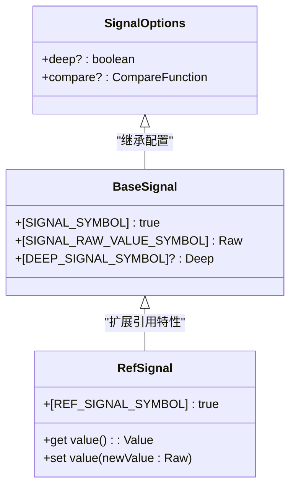
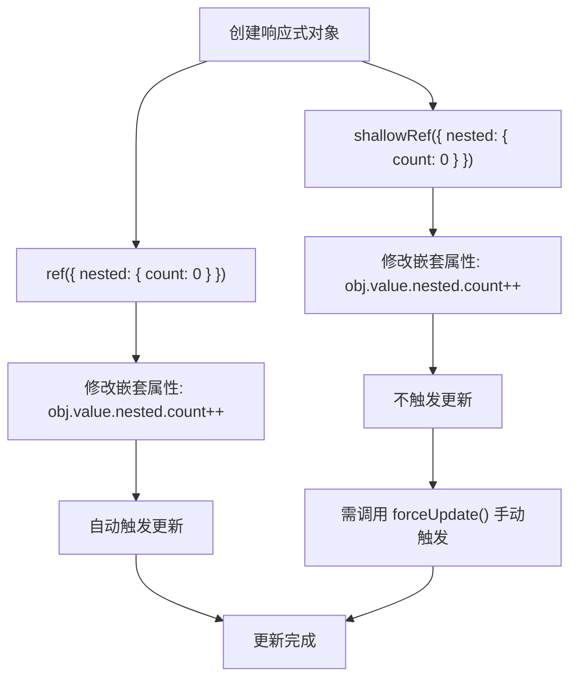

# 浅层响应式

<cite>
**本文档中引用的文件**  
- [ref.ts](file://packages/responsive/src/signal/ref/ref.ts)
- [proxy-handler.ts](file://packages/responsive/src/signal/reactive/proxy-handler.ts)
- [helpers.ts](file://packages/responsive/src/signal/reactive/helpers.ts)
- [base.ts](file://packages/responsive/src/signal/types/base.ts)
- [constants.ts](file://packages/responsive/src/signal/constants.ts)
</cite>

## 目录
1. [简介](#简介)
2. [核心实现机制](#核心实现机制)
3. [shallowRef 与 shallowReactive 的实现分析](#shallowref-与-shallowreactive-的实现分析)
4. [性能优势与使用场景](#性能优势与使用场景)
5. [更新检测差异对比](#更新检测差异对比)
6. [最佳实践与选择建议](#最佳实践与选择建议)

## 简介
浅层响应式（Shallow Reactive）是一种优化的响应式编程模式，通过仅代理对象的顶层属性，避免对深层嵌套对象进行递归代理，从而显著降低大型数据结构的响应式开销。该机制适用于管理包含大量嵌套配置项的状态对象，能够在保证响应式能力的同时，避免不必要的性能损耗。

## 核心实现机制

浅层响应式的核心在于控制响应式代理的深度，通过 `deep: false` 配置选项实现。系统通过 `Proxy` 拦截对象的访问和修改操作，但仅对顶层属性建立响应式追踪，不对嵌套对象进行递归代理。

关键实现要素包括：
- **信号标识符**：使用 Symbol 标记响应式对象的类型和特性
- **代理处理器**：定义 `get`、`set`、`deleteProperty` 等拦截器行为
- **依赖追踪**：在属性访问时收集依赖，在修改时通知订阅者
- **惰性代理**：仅在需要时创建子代理，避免不必要的对象转换

**本节来源**
- [constants.ts](file://packages/responsive/src/signal/constants.ts#L1-L25)
- [proxy-handler.ts](file://packages/responsive/src/signal/reactive/proxy-handler.ts#L83-L102)

## shallowRef 与 shallowReactive 的实现分析

### shallowRef 实现机制

`shallowRef` 是一个特殊的 `Ref` 类型，其核心特性是 `deep: false`。当创建 `shallowRef` 时，系统会传递 `deep: false` 选项给 `Ref` 构造函数，从而禁用对嵌套对象的深度代理。

```mermaid
classDiagram
class Ref {
+value : T
+[SIGNAL_SYMBOL] : true
+[REF_SIGNAL_SYMBOL] : true
-_options : SignalOptions
-_value : T
-_reactiveValue? : RefValue<T, Deep>
+constructor(value : T, options? : SignalOptions)
+get value() : RefValue<T, Deep>
+set value(newValue : T)
+forceUpdate() : void
}
class shallowRef {
<<function>>
+shallowRef() : Ref<any, false>
+shallowRef<Value>(value : Value) : Ref<Value, false>
+shallowRef<Value>(value : Value, options : Omit<SignalOptions, 'deep'>) : Ref<Value, false>
}
Ref <|-- shallowRef : "通过 deep : false 配置"
```

**图示来源**
- [ref.ts](file://packages/responsive/src/signal/ref/ref.ts#L70-L287)
- [ref.ts](file://packages/responsive/src/signal/ref/ref.ts#L413-L472)

### shallowReactive 实现机制

`shallowReactive` 通过调用 `createReactiveProxySignal` 并传入 `deep: false` 选项来创建浅层响应式对象。与 `reactive` 不同，它不会递归地将嵌套对象转换为响应式对象。

```mermaid
classDiagram
class ReactiveProxyHandler {
-target : AnyObject
-options : Required<SignalOptions>
-childSignalMap? : Map<AnyKey, BaseSignal>
-isArray : boolean
-_proxy : Reactive<T, Deep> | null
+constructor(target : T, options? : SignalOptions)
+get proxy() : Reactive<T, Deep>
+get(target : T, prop : AnyKey, receiver : any) : any
+set(target : T, prop : AnyKey, newValue : any, receiver : any) : boolean
+deleteProperty(target : T, prop : AnyKey) : boolean
+has(target : T, prop : AnyKey) : boolean
}
class shallowReactive {
<<function>>
+shallowReactive<T>(target : T, options? : Omit<SignalOptions, 'deep'>) : Reactive<T, false>
}
ReactiveProxyHandler <|-- shallowReactive : "通过 deep : false 配置"
```

**图示来源**
- [proxy-handler.ts](file://packages/responsive/src/signal/reactive/proxy-handler.ts#L83-L299)
- [helpers.ts](file://packages/responsive/src/signal/reactive/helpers.ts#L56-L61)

### 类型系统设计

系统通过泛型和条件类型精确描述浅层响应式的行为。`RefValue` 类型根据 `Deep` 参数决定是否对对象进行递归代理。



**图示来源**
- [base.ts](file://packages/responsive/src/signal/types/base.ts#L32-L89)
- [ref.ts](file://packages/responsive/src/signal/types/ref.ts#L10-L22)

## 性能优势与使用场景

### 性能优势

浅层响应式的主要性能优势体现在：

1. **减少代理开销**：避免对大型嵌套对象进行递归代理，显著降低内存占用和初始化时间
2. **降低依赖追踪复杂度**：仅追踪顶层属性的变化，减少依赖收集和通知的开销
3. **提高更新效率**：当深层属性变化时，不需要遍历整个对象树进行依赖通知

### 典型使用场景

#### 大型配置对象管理
当管理包含大量嵌套配置项的状态对象时，使用浅层响应式可以避免不必要的性能损耗。

```typescript
// 管理大型配置对象
const config = shallowRef({
  theme: { /* 大量主题配置 */ },
  layout: { /* 复杂布局配置 */ },
  features: { /* 功能开关配置 */ }
})
```

#### 频繁更新的嵌套数据
对于需要频繁更新深层属性但顶层结构稳定的对象，浅层响应式是理想选择。

```typescript
// 频繁更新的嵌套数据
const data = shallowRef({ items: [] })
// 直接操作嵌套数组，通过 forceUpdate 手动触发更新
data.value.items.push(newItem)
data.forceUpdate()
```

#### 第三方库集成
当需要将响应式对象传递给不支持 Proxy 的外部库时，浅层响应式可以减少兼容性问题。

**本节来源**
- [ref.ts](file://packages/responsive/src/signal/ref/ref.ts#L448-L459)
- [helpers.ts](file://packages/responsive/src/signal/reactive/helpers.ts#L45-L61)

## 更新检测差异对比

### ref 与 shallowRef 的更新检测

| 特性 | ref | shallowRef |
|------|-----|------------|
| 代理深度 | 深层代理（默认） | 浅层代理 |
| 嵌套属性变化检测 | 自动检测并触发更新 | 不自动检测，需手动调用 `forceUpdate` |
| 内存开销 | 较高（递归代理） | 较低（仅顶层代理） |
| 初始化性能 | 较慢（需遍历对象） | 较快（无需递归） |
| 使用复杂度 | 简单（自动追踪） | 稍复杂（需手动管理更新） |

### 实际行为差异



**图示来源**
- [ref.test.ts](file://packages/responsive/__tests__/signal/ref.test.ts#L56-L70)
- [reactive.test.ts](file://packages/responsive/__tests__/signal/reactive.test.ts#L125-L144)

## 最佳实践与选择建议

### 何时选择浅层响应式

1. **大型数据结构**：当处理包含大量嵌套属性的对象时
2. **性能敏感场景**：在需要优化初始化时间和内存占用的场景
3. **可控的更新模式**：当可以明确控制何时需要触发更新时
4. **第三方库集成**：与不支持深度代理的库进行交互时

### 使用注意事项

1. **手动更新管理**：修改嵌套属性后需要调用 `forceUpdate()` 手动触发更新
2. **避免过度使用**：对于小型或简单对象，深层响应式可能更方便
3. **类型安全**：利用 TypeScript 的泛型系统确保类型正确性
4. **调试支持**：利用 `isReactive`、`isRef` 等工具函数进行运行时检查

### 迁移策略

从 `ref` 迁移到 `shallowRef` 时需要注意：
- 检查所有嵌套属性的修改操作
- 在适当位置添加 `forceUpdate()` 调用
- 更新相关测试用例以适应新的更新机制
- 监控性能指标验证优化效果

**本节来源**
- [ref.ts](file://packages/responsive/src/signal/ref/ref.ts#L255-L257)
- [reactive.test.ts](file://packages/responsive/__tests__/signal/reactive.test.ts#L141-L144)
- [ref.test.ts](file://packages/responsive/__tests__/signal/ref.test.ts#L64-L70)