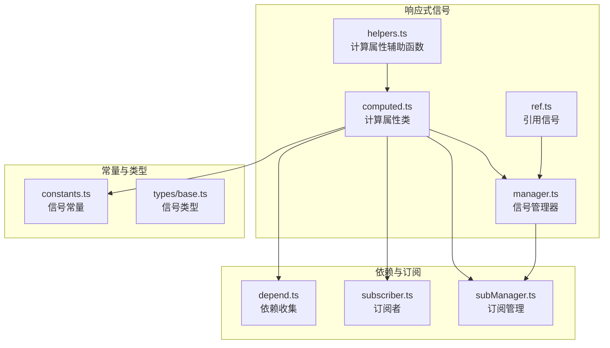
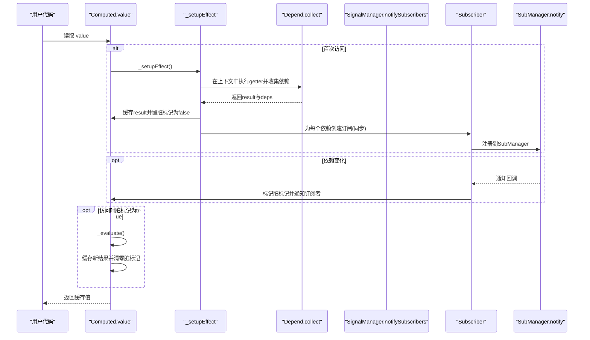
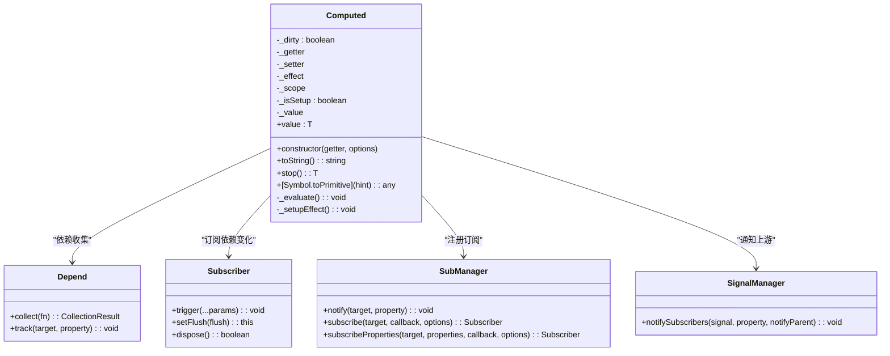
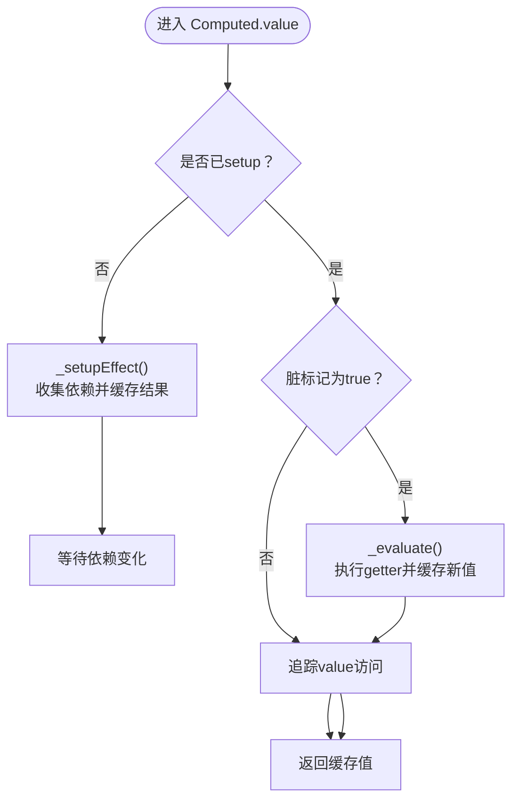
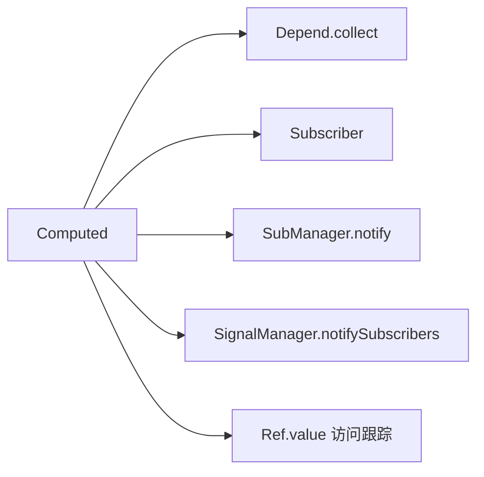

# 计算属性优化

<cite>
**本文引用的文件**
- [packages/responsive/src/signal/computed/computed.ts](file://packages/responsive/src/signal/computed/computed.ts)
- [packages/responsive/src/signal/computed/helpers.ts](file://packages/responsive/src/signal/computed/helpers.ts)
- [packages/responsive/src/signal/computed/index.ts](file://packages/responsive/src/signal/computed/index.ts)
- [packages/responsive/src/observer/subscriber.ts](file://packages/responsive/src/observer/subscriber.ts)
- [packages/responsive/src/observer/subManager.ts](file://packages/responsive/src/observer/subManager.ts)
- [packages/responsive/src/depend/depend.ts](file://packages/responsive/src/depend/depend.ts)
- [packages/responsive/src/signal/ref/ref.ts](file://packages/responsive/src/signal/ref/ref.ts)
- [packages/responsive/src/signal/manager.ts](file://packages/responsive/src/signal/manager.ts)
- [packages/responsive/src/signal/constants.ts](file://packages/responsive/src/signal/constants.ts)
- [packages/responsive/src/signal/types/base.ts](file://packages/responsive/src/signal/types/base.ts)
- [packages/responsive/__tests__/signal/computed.test.ts](file://packages/responsive/__tests__/signal/computed.test.ts)
</cite>

## 目录
1. [简介](#简介)
2. [项目结构](#项目结构)
3. [核心组件](#核心组件)
4. [架构总览](#架构总览)
5. [详细组件分析](#详细组件分析)
6. [依赖分析](#依赖分析)
7. [性能考量](#性能考量)
8. [故障排查指南](#故障排查指南)
9. [结论](#结论)
10. [附录](#附录)

## 简介
本指南聚焦于计算属性的懒计算与缓存机制，系统阐述如何通过“脏标记”与依赖追踪实现仅在依赖变更且被访问时才重新计算，从而避免重复执行昂贵的计算操作。文档基于源码分析 Computed 类的 _evaluate 与 _dirty 协同工作原理，结合测试用例展示多次修改依赖但仅触发一次重新计算的“懒执行”行为，并给出将复杂计算（如数组过滤、排序、聚合）封装在 computed 中的实践建议，以及与直接在渲染函数中执行计算的性能差异对比与基准测试建议。

## 项目结构
计算属性位于响应式信号模块中，与依赖收集、订阅者、信号管理器共同构成响应式系统的核心。关键文件如下：
- 计算属性实现：computed.ts
- 计算属性辅助函数：helpers.ts
- 导出入口：index.ts
- 依赖收集：depend.ts
- 订阅者与订阅管理：subscriber.ts、subManager.ts
- 原子信号（引用）：ref.ts
- 信号管理器：manager.ts
- 常量与类型：constants.ts、types/base.ts
- 测试用例：__tests__/signal/computed.test.ts

图表来源
- [packages/responsive/src/signal/computed/computed.ts](file://packages/responsive/src/signal/computed/computed.ts#L1-L367)
- [packages/responsive/src/signal/computed/helpers.ts](file://packages/responsive/src/signal/computed/helpers.ts#L1-L131)
- [packages/responsive/src/depend/depend.ts](file://packages/responsive/src/depend/depend.ts#L1-L152)
- [packages/responsive/src/observer/subscriber.ts](file://packages/responsive/src/observer/subscriber.ts#L1-L248)
- [packages/responsive/src/observer/subManager.ts](file://packages/responsive/src/observer/subManager.ts#L1-L424)
- [packages/responsive/src/signal/ref/ref.ts](file://packages/responsive/src/signal/ref/ref.ts#L1-L473)
- [packages/responsive/src/signal/manager.ts](file://packages/responsive/src/signal/manager.ts#L1-L153)
- [packages/responsive/src/signal/constants.ts](file://packages/responsive/src/signal/constants.ts#L1-L25)
- [packages/responsive/src/signal/types/base.ts](file://packages/responsive/src/signal/types/base.ts#L1-L89)

章节来源
- [packages/responsive/src/signal/computed/computed.ts](file://packages/responsive/src/signal/computed/computed.ts#L1-L367)
- [packages/responsive/src/signal/computed/helpers.ts](file://packages/responsive/src/signal/computed/helpers.ts#L1-L131)
- [packages/responsive/src/depend/depend.ts](file://packages/responsive/src/depend/depend.ts#L1-L152)
- [packages/responsive/src/observer/subscriber.ts](file://packages/responsive/src/observer/subscriber.ts#L1-L248)
- [packages/responsive/src/observer/subManager.ts](file://packages/responsive/src/observer/subManager.ts#L1-L424)
- [packages/responsive/src/signal/ref/ref.ts](file://packages/responsive/src/signal/ref/ref.ts#L1-L473)
- [packages/responsive/src/signal/manager.ts](file://packages/responsive/src/signal/manager.ts#L1-L153)
- [packages/responsive/src/signal/constants.ts](file://packages/responsive/src/signal/constants.ts#L1-L25)
- [packages/responsive/src/signal/types/base.ts](file://packages/responsive/src/signal/types/base.ts#L1-L89)

## 核心组件
- 计算属性类 Computed：实现懒计算、脏标记、依赖收集与订阅、作用域集成、immediate 选项等。
- 依赖收集 Depend：在函数执行期间收集访问过的响应式对象与属性，形成依赖映射。
- 订阅者 Subscriber 与订阅管理 SubManager：负责订阅依赖变化、调度通知时机（同步/异步），并提供生命周期管理。
- 信号管理器 SignalManager：向上游传播变更通知，确保父子信号链路一致。
- 引用 Ref：原子信号，提供 value 访问时的依赖跟踪，是计算属性依赖链路的基础。
- 辅助函数 computed、computedWithSetter、isComputed、stopComputed：对外暴露的 API 与工具。

章节来源
- [packages/responsive/src/signal/computed/computed.ts](file://packages/responsive/src/signal/computed/computed.ts#L98-L367)
- [packages/responsive/src/signal/computed/helpers.ts](file://packages/responsive/src/signal/computed/helpers.ts#L1-L131)
- [packages/responsive/src/depend/depend.ts](file://packages/responsive/src/depend/depend.ts#L1-L152)
- [packages/responsive/src/observer/subscriber.ts](file://packages/responsive/src/observer/subscriber.ts#L1-L248)
- [packages/responsive/src/observer/subManager.ts](file://packages/responsive/src/observer/subManager.ts#L1-L424)
- [packages/responsive/src/signal/manager.ts](file://packages/responsive/src/signal/manager.ts#L1-L153)
- [packages/responsive/src/signal/ref/ref.ts](file://packages/responsive/src/signal/ref/ref.ts#L1-L473)

## 架构总览
计算属性的运行时流程如下：
- 首次访问 value 时，若未 setup，则执行 _setupEffect：在依赖收集上下文中执行 getter，得到结果并清空脏标记，同时为每个依赖属性建立订阅。
- 依赖变化时，订阅者以同步模式触发回调，将计算属性标记为脏并通知订阅者。
- 下次访问 value 时，若脏标记为真则执行 _evaluate：直接调用 getter（不重新收集依赖），缓存结果并清零脏标记。
- 若 getter 未访问任何响应式属性，将发出警告，提示计算属性不会随数据变化而更新。

图表来源
- [packages/responsive/src/signal/computed/computed.ts](file://packages/responsive/src/signal/computed/computed.ts#L192-L365)
- [packages/responsive/src/depend/depend.ts](file://packages/responsive/src/depend/depend.ts#L66-L114)
- [packages/responsive/src/observer/subscriber.ts](file://packages/responsive/src/observer/subscriber.ts#L1-L248)
- [packages/responsive/src/observer/subManager.ts](file://packages/responsive/src/observer/subManager.ts#L77-L120)
- [packages/responsive/src/signal/manager.ts](file://packages/responsive/src/signal/manager.ts#L106-L123)

## 详细组件分析

### Computed 类与懒计算/缓存机制
- 脏标记 _dirty：true 表示依赖已变化，需要重新计算；false 表示结果有效。
- 值缓存 _value：保存最近一次计算结果。
- getter 参数：_evaluate 接收上一次的计算结果作为参数，便于增量计算。
- 懒计算策略：
  - 首次访问时 setupEffect 收集依赖并缓存结果，置脏标记为 false。
  - 依赖变化时，订阅者回调将脏标记置为 true，并通知订阅者。
  - 下次访问 value 时，若脏标记为真则执行 _evaluate，否则直接返回缓存值。
- immediate 选项：若设置为 true，则在构造时即执行一次 getter 并缓存，无需首次访问。
- stop：停止订阅，释放资源，但仍保留最后一次缓存值。

图表来源
- [packages/responsive/src/signal/computed/computed.ts](file://packages/responsive/src/signal/computed/computed.ts#L98-L367)
- [packages/responsive/src/depend/depend.ts](file://packages/responsive/src/depend/depend.ts#L1-L152)
- [packages/responsive/src/observer/subscriber.ts](file://packages/responsive/src/observer/subscriber.ts#L1-L248)
- [packages/responsive/src/observer/subManager.ts](file://packages/responsive/src/observer/subManager.ts#L1-L424)
- [packages/responsive/src/signal/manager.ts](file://packages/responsive/src/signal/manager.ts#L1-L153)

章节来源
- [packages/responsive/src/signal/computed/computed.ts](file://packages/responsive/src/signal/computed/computed.ts#L192-L365)

### 依赖收集与订阅链路
- Depend.collect：在上下文中执行函数，返回执行结果与依赖映射（对象 -> 属性集合）。
- Depend.track：在访问响应式对象属性时记录依赖。
- Subscriber：封装回调触发与生命周期，支持同步/异步触发与次数限制。
- SubManager.notify：批量通知订阅者，支持同步订阅者即时响应。
- SignalManager.notifySubscribers：向上游传播变更，确保父子链路一致。

章节来源
- [packages/responsive/src/depend/depend.ts](file://packages/responsive/src/depend/depend.ts#L1-L152)
- [packages/responsive/src/observer/subscriber.ts](file://packages/responsive/src/observer/subscriber.ts#L1-L248)
- [packages/responsive/src/observer/subManager.ts](file://packages/responsive/src/observer/subManager.ts#L77-L120)
- [packages/responsive/src/signal/manager.ts](file://packages/responsive/src/signal/manager.ts#L106-L123)

### 值访问与脏标记控制流程

图表来源
- [packages/responsive/src/signal/computed/computed.ts](file://packages/responsive/src/signal/computed/computed.ts#L192-L217)
- [packages/responsive/src/signal/computed/computed.ts](file://packages/responsive/src/signal/computed/computed.ts#L297-L301)
- [packages/responsive/src/signal/computed/computed.ts](file://packages/responsive/src/signal/computed/computed.ts#L313-L365)

### 测试用例解读：懒执行与缓存验证
- 缓存验证：首次访问计算值触发一次 getter；再次访问不触发；依赖变化后再访问触发一次重新计算。
- 懒执行验证：多次修改依赖但不访问值，不触发重新计算；访问时才触发一次重新计算。
- immediate 选项：构造时立即计算，无需首次访问。

章节来源
- [packages/responsive/__tests__/signal/computed.test.ts](file://packages/responsive/__tests__/signal/computed.test.ts#L1-L120)

## 依赖分析
- Computed 与 Depend：通过 Depend.collect 在 setup 时一次性收集依赖，避免每次访问都重新收集。
- Computed 与 Subscriber/SubManager：为每个依赖属性建立订阅，使用同步模式确保依赖变化即时触发脏标记与通知。
- Computed 与 SignalManager：在依赖变化时通知订阅者，同时向上游传播，保证父子链路一致性。
- Computed 与 Ref：Ref.value 在访问时进行依赖跟踪，是计算属性依赖链路的底层支撑。

图表来源
- [packages/responsive/src/signal/computed/computed.ts](file://packages/responsive/src/signal/computed/computed.ts#L313-L365)
- [packages/responsive/src/depend/depend.ts](file://packages/responsive/src/depend/depend.ts#L66-L114)
- [packages/responsive/src/observer/subscriber.ts](file://packages/responsive/src/observer/subscriber.ts#L180-L195)
- [packages/responsive/src/observer/subManager.ts](file://packages/responsive/src/observer/subManager.ts#L77-L120)
- [packages/responsive/src/signal/manager.ts](file://packages/responsive/src/signal/manager.ts#L106-L123)
- [packages/responsive/src/signal/ref/ref.ts](file://packages/responsive/src/signal/ref/ref.ts#L136-L147)

章节来源
- [packages/responsive/src/signal/computed/computed.ts](file://packages/responsive/src/signal/computed/computed.ts#L192-L365)
- [packages/responsive/src/depend/depend.ts](file://packages/responsive/src/depend/depend.ts#L66-L114)
- [packages/responsive/src/observer/subscriber.ts](file://packages/responsive/src/observer/subscriber.ts#L180-L195)
- [packages/responsive/src/observer/subManager.ts](file://packages/responsive/src/observer/subManager.ts#L77-L120)
- [packages/responsive/src/signal/manager.ts](file://packages/responsive/src/signal/manager.ts#L106-L123)
- [packages/responsive/src/signal/ref/ref.ts](file://packages/responsive/src/signal/ref/ref.ts#L136-L147)

## 性能考量
- 懒计算与缓存收益
  - 仅在依赖变更且被访问时重新计算，避免重复执行昂贵操作。
  - 通过 _dirty 与 _evaluate 的配合，确保同一轮依赖变化只触发一次重新计算。
- 与直接在渲染函数中计算的对比
  - 直接在渲染函数中执行复杂计算：每次渲染都会重新计算，即使依赖未变化。
  - 使用 computed：依赖未变化时复用缓存，减少重复计算成本。
- 复杂计算封装建议
  - 将数组过滤、排序、聚合等操作封装在 computed 中，利用懒计算与缓存降低开销。
  - 对于频繁访问但代价高的计算，优先使用 computed。
- 性能基准测试建议
  - 场景一：大量依赖变更但不访问计算值（验证懒执行）。
  - 场景二：依赖不变的多次访问（验证缓存命中）。
  - 场景三：渲染函数中直接计算 vs 使用 computed 的对比。
  - 指标：计算次数（可通过 vi.fn 计数）、渲染耗时、CPU 占用、内存分配。
  - 建议使用微基准测试框架（如 Vitest 的计时与断言能力）量化收益。

[本节为通用性能讨论，不直接分析具体文件]

## 故障排查指南
- 依赖未检测到
  - 现象：计算属性不会随数据变化而更新。
  - 原因：getter 未访问任何响应式属性，或访问路径未被跟踪。
  - 处理：确认 getter 内部确实访问了 ref/reactive 的属性；检查访问链路是否被代理。
- 未触发重新计算
  - 现象：依赖变化后访问值仍为旧值。
  - 原因：依赖未正确订阅或订阅被提前释放。
  - 处理：确认依赖属性已被订阅；检查作用域生命周期与 stop 调用。
- 重复计算问题
  - 现象：同一轮依赖变化多次重新计算。
  - 原因：订阅者 flush 配置不当或上游通知链路异常。
  - 处理：使用同步订阅模式；检查 SignalManager 通知链路。
- setter 使用
  - 现象：直接修改计算属性导致警告。
  - 处理：提供 setter 将写入委托给依赖的 ref，避免直接修改计算属性。

章节来源
- [packages/responsive/src/signal/computed/computed.ts](file://packages/responsive/src/signal/computed/computed.ts#L227-L235)
- [packages/responsive/src/signal/computed/computed.ts](file://packages/responsive/src/signal/computed/computed.ts#L361-L365)
- [packages/responsive/src/observer/subscriber.ts](file://packages/responsive/src/observer/subscriber.ts#L180-L195)
- [packages/responsive/src/signal/manager.ts](file://packages/responsive/src/signal/manager.ts#L106-L123)

## 结论
通过 Computed 的懒计算与缓存机制，系统在“依赖变更且被访问”的条件下才重新计算，显著降低了昂贵计算的重复执行成本。依赖收集与订阅链路确保了变更的及时感知，脏标记与值缓存保证了同一轮变更的幂等性。将复杂计算封装在 computed 中，可获得稳定的性能收益；配合测试用例与基准测试，可量化优化效果并指导开发实践。

[本节为总结性内容，不直接分析具体文件]

## 附录
- API 速览
  - computed：创建计算属性。
  - computedWithSetter：带 setter 的便捷创建。
  - isComputed：判断是否为计算属性。
  - stopComputed：停止监听并获取最终值。
- 常见使用模式
  - 将数组过滤、排序、聚合等封装在 computed 中。
  - 使用 immediate 在构造时预热计算结果。
  - 通过 setter 将写操作委托给依赖 ref。

章节来源
- [packages/responsive/src/signal/computed/helpers.ts](file://packages/responsive/src/signal/computed/helpers.ts#L1-L131)
- [packages/responsive/src/signal/computed/computed.ts](file://packages/responsive/src/signal/computed/computed.ts#L156-L174)