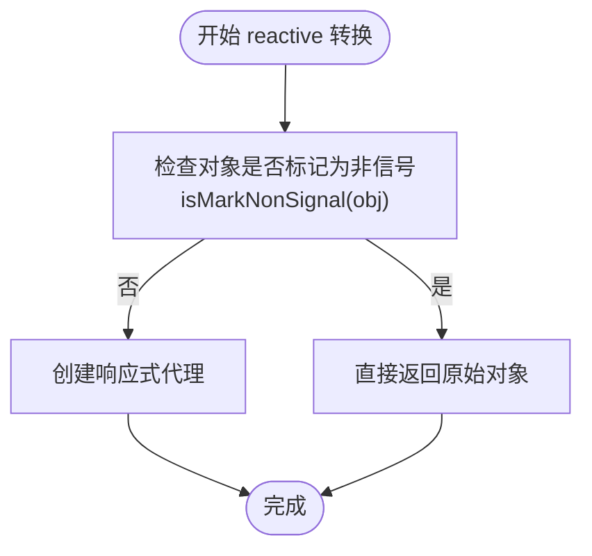
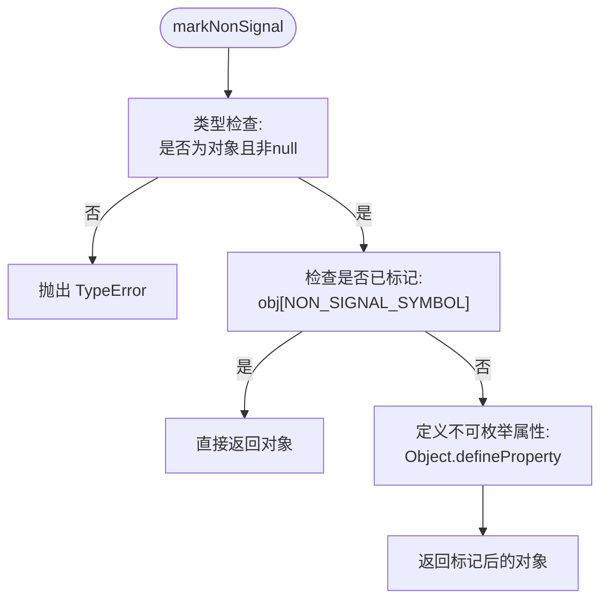
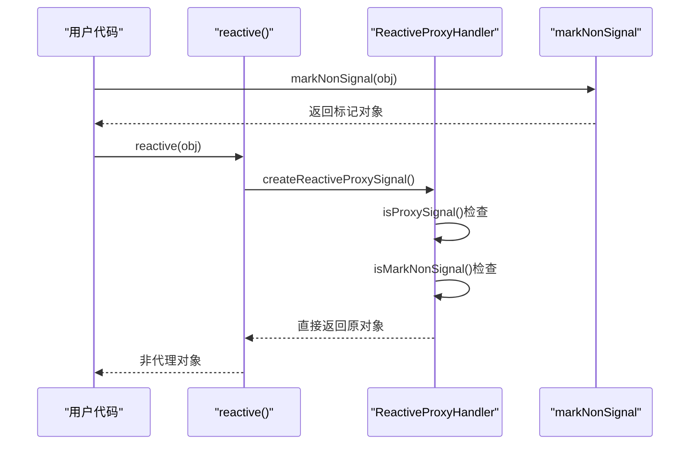
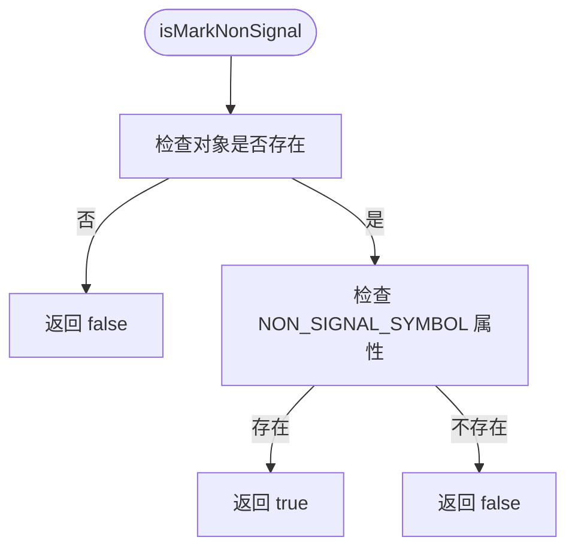

# 非响应式标记

<cite>
**本文档中引用的文件**  
- [mark.ts](file://packages/responsive/src/signal/utils/mark.ts)
- [constants.ts](file://packages/responsive/src/signal/constants.ts)
- [proxy-handler.ts](file://packages/responsive/src/signal/reactive/proxy-handler.ts)
- [conversion.ts](file://packages/responsive/src/signal/utils/conversion.ts)
- [verify.ts](file://packages/responsive/src/signal/utils/verify.ts)
</cite>

## 目录
1. [简介](#简介)
2. [核心实现原理](#核心实现原理)
3. [markNonSignal 函数详解](#marknonsignal-函数详解)
4. [NON_SIGNAL_SYMBOL 标识符](#non_signal_symbol-标识符)
5. [在响应式转换中的作用机制](#在响应式转换中的作用机制)
6. [isMarkNonSignal 运行时检查](#ismarknonsignal-运行时检查)
7. [典型使用场景](#典型使用场景)
8. [性能优化建议](#性能优化建议)

## 简介
`markNonSignal`（兼容别名 `markRaw`）是 Vitarx 响应式系统中的关键优化工具，用于标记不应被转换为响应式信号的对象。该机制通过特殊的 Symbol 标识符实现，确保被标记对象在 `reactive` 转换过程中被完全跳过，避免不必要的代理开销。这对于集成第三方库实例或处理大型静态数据集具有重要意义。

**Section sources**
- [mark.ts](file://packages/responsive/src/signal/utils/mark.ts#L1-L59)

## 核心实现原理
`markNonSignal` 的核心原理是利用不可枚举的 Symbol 属性标记对象，使其在响应式代理创建过程中被识别并排除。当 `reactive` 函数处理对象时，会检查 `NON_SIGNAL_SYMBOL` 标识符，若存在则直接返回原对象，不进行代理包装。



**Diagram sources**
- [mark.ts](file://packages/responsive/src/signal/utils/mark.ts#L23-L35)
- [proxy-handler.ts](file://packages/responsive/src/signal/reactive/proxy-handler.ts#L378-L397)

**Section sources**
- [mark.ts](file://packages/responsive/src/signal/utils/mark.ts#L23-L35)
- [proxy-handler.ts](file://packages/responsive/src/signal/reactive/proxy-handler.ts#L378-L397)

## markNonSignal 函数详解
`markNonSignal` 函数实现了对象的非响应式标记，包含类型检查、幂等性处理和属性定义等关键逻辑。



**Diagram sources**
- [mark.ts](file://packages/responsive/src/signal/utils/mark.ts#L23-L35)

**Section sources**
- [mark.ts](file://packages/responsive/src/signal/utils/mark.ts#L23-L35)

## NON_SIGNAL_SYMBOL 标识符
`NON_SIGNAL_SYMBOL` 是一个全局唯一的 Symbol，用于标记不应被转换为响应式的对象。该标识符被设计为不可枚举，避免影响对象的正常遍历操作。

```mermaid
classDiagram
class Constants {
+SIGNAL_SYMBOL : Symbol
+DEEP_SIGNAL_SYMBOL : Symbol
+NON_SIGNAL_SYMBOL : Symbol
+REF_SIGNAL_SYMBOL : Symbol
+PROXY_SIGNAL_SYMBOL : Symbol
+SIGNAL_RAW_VALUE_SYMBOL : Symbol
}
note right of Constants
NON_SIGNAL_SYMBOL 用于标记非响应式对象
值 : Symbol(VITARX_NOT_SIGNAL_SYMBOL)
end note
```

**Diagram sources**
- [constants.ts](file://packages/responsive/src/signal/constants.ts#L10-L12)

**Section sources**
- [constants.ts](file://packages/responsive/src/signal/constants.ts#L10-L12)

## 在响应式转换中的作用机制
`markNonSignal` 在 `reactive` 转换过程中发挥关键作用，通过短路机制避免对已标记对象进行代理创建，从而提升性能。



**Diagram sources**
- [mark.ts](file://packages/responsive/src/signal/utils/mark.ts#L55-L57)
- [proxy-handler.ts](file://packages/responsive/src/signal/reactive/proxy-handler.ts#L389-L392)

**Section sources**
- [proxy-handler.ts](file://packages/responsive/src/signal/reactive/proxy-handler.ts#L187-L188)
- [mark.ts](file://packages/responsive/src/signal/utils/mark.ts#L55-L57)

## isMarkNonSignal 运行时检查
`isMarkNonSignal` 函数提供运行时检查能力，用于判断对象是否已被标记为非响应式，支持别名 `isMarkRaw`。



**Diagram sources**
- [mark.ts](file://packages/responsive/src/signal/utils/mark.ts#L55-L57)

**Section sources**
- [mark.ts](file://packages/responsive/src/signal/utils/mark.ts#L55-L57)

## 典型使用场景
### 集成第三方库实例
当集成复杂的第三方库（如图表库、地图组件）时，使用 `markNonSignal` 可避免将整个库实例转换为响应式，消除性能瓶颈。

### 大型静态数据集
对于包含大量静态数据的配置对象或资源文件，标记为非响应式可防止不必要的代理创建和内存开销。

### 性能敏感场景
在高频更新或大数据量处理的场景中，合理使用 `markNonSignal` 可显著提升应用性能。

**Section sources**
- [mark.ts](file://packages/responsive/src/signal/utils/mark.ts#L5-L21)

## 性能优化建议
1. **优先标记大型对象**：对包含大量属性或嵌套结构的对象优先使用 `markNonSignal`
2. **第三方库集成**：所有第三方类实例都应标记为非响应式
3. **静态数据**：不会变更的配置数据应提前标记
4. **避免过度使用**：仅对确实不需要响应式的对象使用，以免影响响应式系统的正常功能

**Section sources**
- [mark.ts](file://packages/responsive/src/signal/utils/mark.ts#L23-L35)
- [proxy-handler.ts](file://packages/responsive/src/signal/reactive/proxy-handler.ts#L378-L397)