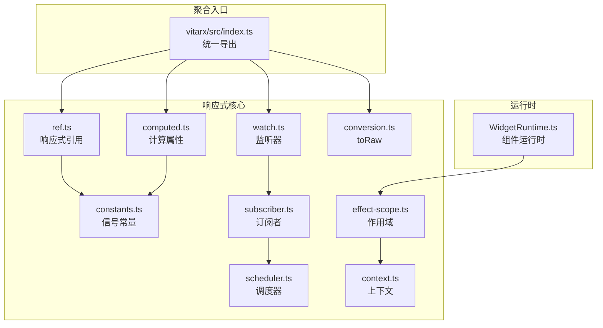
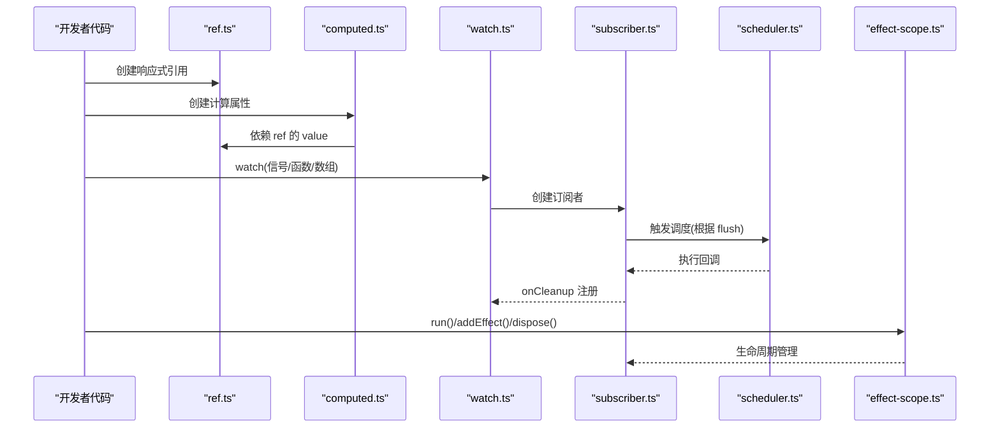
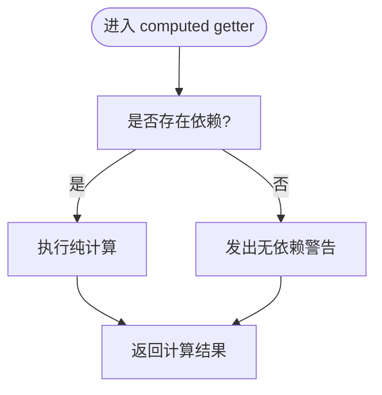
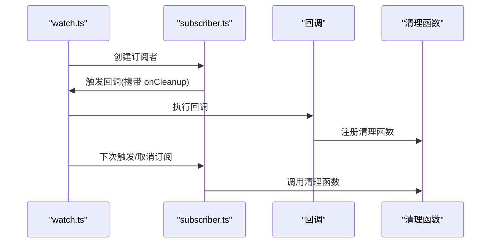
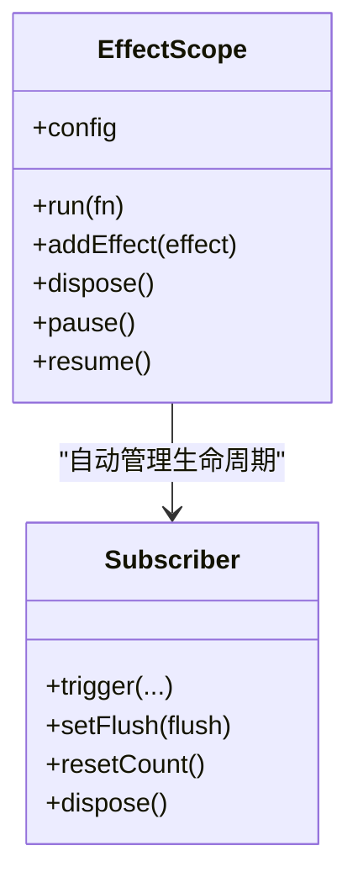
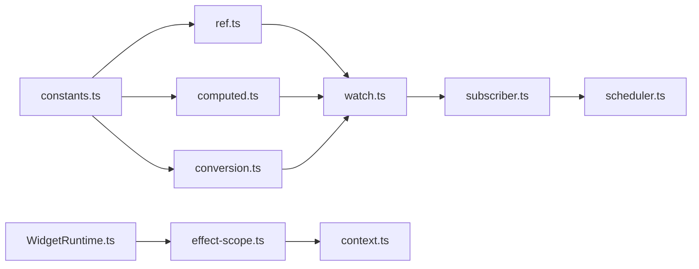

# 最佳实践

<cite>
**本文引用的文件**
- [README.md](file://README.md)
- [packages/vitarx/src/index.ts](file://packages/vitarx/src/index.ts)
- [packages/responsive/src/signal/constants.ts](file://packages/responsive/src/signal/constants.ts)
- [packages/responsive/src/signal/utils/conversion.ts](file://packages/responsive/src/signal/utils/conversion.ts)
- [packages/responsive/src/signal/ref/ref.ts](file://packages/responsive/src/signal/ref/ref.ts)
- [packages/responsive/src/signal/computed/computed.ts](file://packages/responsive/src/signal/computed/computed.ts)
- [packages/responsive/src/signal/watch/watch.ts](file://packages/responsive/src/signal/watch/watch.ts)
- [packages/responsive/src/observer/subscriber.ts](file://packages/responsive/src/observer/subscriber.ts)
- [packages/responsive/src/observer/scheduler.ts](file://packages/responsive/src/observer/scheduler.ts)
- [packages/responsive/src/effect/effect-scope.ts](file://packages/responsive/src/effect/effect-scope.ts)
- [packages/responsive/src/context/context.ts](file://packages/responsive/src/context/context.ts)
- [packages/runtime-core/src/widget/runtime/WidgetRuntime.ts](file://packages/runtime-core/src/widget/runtime/WidgetRuntime.ts)
</cite>

## 目录
1. [引言](#引言)
2. [项目结构](#项目结构)
3. [核心组件](#核心组件)
4. [架构总览](#架构总览)
5. [详细组件分析](#详细组件分析)
6. [依赖分析](#依赖分析)
7. [性能考量](#性能考量)
8. [故障排查指南](#故障排查指南)
9. [结论](#结论)
10. [附录](#附录)

## 引言
本实践指南聚焦于 Vitarx 响应式系统在实际工程中的最佳实践，围绕以下主题展开：合理使用响应式数据、避免在 computed 中产生副作用、通过 toRaw 保持解构后的响应性、onCleanup 清理定时器与事件监听器、合理组织 effect 作用域以避免内存泄漏、JSX 中 key 的正确使用方式，以及大型应用的状态管理策略。文档同时提供反模式对比，帮助开发者识别并规避常见陷阱，提升代码质量与应用性能。

## 项目结构
Vitarx 采用多包结构，核心响应式能力集中在 responsive 包，运行时与渲染在 runtime-* 包中，vitarx 包聚合导出统一入口。响应式系统的关键模块包括：
- 信号与类型：ref、computed、watch、toRaw、常量与类型系统
- 订阅与调度：Subscriber、Scheduler
- 作用域与上下文：EffectScope、Context
- 运行时与组件：WidgetRuntime

图表来源
- [packages/responsive/src/signal/ref/ref.ts](file://packages/responsive/src/signal/ref/ref.ts#L1-L473)
- [packages/responsive/src/signal/computed/computed.ts](file://packages/responsive/src/signal/computed/computed.ts#L1-L367)
- [packages/responsive/src/signal/watch/watch.ts](file://packages/responsive/src/signal/watch/watch.ts#L1-L432)
- [packages/responsive/src/signal/utils/conversion.ts](file://packages/responsive/src/signal/utils/conversion.ts#L1-L49)
- [packages/responsive/src/signal/constants.ts](file://packages/responsive/src/signal/constants.ts#L1-L25)
- [packages/responsive/src/observer/subscriber.ts](file://packages/responsive/src/observer/subscriber.ts#L1-L248)
- [packages/responsive/src/observer/scheduler.ts](file://packages/responsive/src/observer/scheduler.ts#L1-L326)
- [packages/responsive/src/effect/effect-scope.ts](file://packages/responsive/src/effect/effect-scope.ts#L1-L212)
- [packages/responsive/src/context/context.ts](file://packages/responsive/src/context/context.ts#L1-L138)
- [packages/runtime-core/src/widget/runtime/WidgetRuntime.ts](file://packages/runtime-core/src/widget/runtime/WidgetRuntime.ts#L1-L123)
- [packages/vitarx/src/index.ts](file://packages/vitarx/src/index.ts#L1-L8)

章节来源
- [README.md](file://README.md#L1-L85)
- [packages/vitarx/src/index.ts](file://packages/vitarx/src/index.ts#L1-L8)

## 核心组件
- 响应式引用 ref：提供浅/深代理、值变更通知、forceUpdate 强制更新等能力，适合承载基础值或对象。
- 计算属性 computed：惰性求值、依赖追踪、自动失效与缓存，支持 setter 与作用域绑定。
- 监听器 watch：支持信号、函数、数组多源监听，提供 onCleanup 注册清理函数，支持 immediate、clone 等选项。
- 订阅者 Subscriber：统一的回调触发与生命周期管理，支持 limit、flush、scope 等配置。
- 调度器 Scheduler：三阶段队列（preFlush/main/postFlush）、参数合并、nextTick、flushSync。
- 作用域 EffectScope：作用域内副作用的统一管理与销毁，支持 attachToCurrentScope、name、errorHandler。
- 上下文 Context：客户端/服务端上下文隔离与异步上下文管理。
- toRaw：安全获取信号原始值，避免在解构后丢失响应性。
- WidgetRuntime：组件运行时基类，提供生命周期与上下文执行能力。

章节来源
- [packages/responsive/src/signal/ref/ref.ts](file://packages/responsive/src/signal/ref/ref.ts#L1-L473)
- [packages/responsive/src/signal/computed/computed.ts](file://packages/responsive/src/signal/computed/computed.ts#L1-L367)
- [packages/responsive/src/signal/watch/watch.ts](file://packages/responsive/src/signal/watch/watch.ts#L1-L432)
- [packages/responsive/src/observer/subscriber.ts](file://packages/responsive/src/observer/subscriber.ts#L1-L248)
- [packages/responsive/src/observer/scheduler.ts](file://packages/responsive/src/observer/scheduler.ts#L1-L326)
- [packages/responsive/src/effect/effect-scope.ts](file://packages/responsive/src/effect/effect-scope.ts#L1-L212)
- [packages/responsive/src/context/context.ts](file://packages/responsive/src/context/context.ts#L1-L138)
- [packages/responsive/src/signal/utils/conversion.ts](file://packages/responsive/src/signal/utils/conversion.ts#L1-L49)
- [packages/runtime-core/src/widget/runtime/WidgetRuntime.ts](file://packages/runtime-core/src/widget/runtime/WidgetRuntime.ts#L1-L123)

## 架构总览
响应式系统围绕“信号-订阅-调度-作用域”的闭环设计：
- 信号层：ref/computed 提供响应式数据源，toRaw 提供原始值访问。
- 订阅层：watch/Subscriber 建立依赖与回调，支持 onCleanup。
- 调度层：Scheduler 三阶段队列批处理，flush 控制执行时机。
- 作用域层：EffectScope 管理副作用生命周期，Context 提供上下文隔离。

图表来源
- [packages/responsive/src/signal/ref/ref.ts](file://packages/responsive/src/signal/ref/ref.ts#L1-L473)
- [packages/responsive/src/signal/computed/computed.ts](file://packages/responsive/src/signal/computed/computed.ts#L1-L367)
- [packages/responsive/src/signal/watch/watch.ts](file://packages/responsive/src/signal/watch/watch.ts#L1-L432)
- [packages/responsive/src/observer/subscriber.ts](file://packages/responsive/src/observer/subscriber.ts#L1-L248)
- [packages/responsive/src/observer/scheduler.ts](file://packages/responsive/src/observer/scheduler.ts#L1-L326)
- [packages/responsive/src/effect/effect-scope.ts](file://packages/responsive/src/effect/effect-scope.ts#L1-L212)

## 详细组件分析

### 响应式数据的合理使用范围与 toRaw
- 反模式：直接解构 ref/reactive 的属性，导致失去响应性。
- 正确做法：使用 toRaw 获取原始值，或在需要响应性的场景中保持对 ref.value 的访问。
- 性能建议：toRaw 仅用于需要直接访问原始对象的场景，避免在高频路径中频繁调用。

章节来源
- [packages/responsive/src/signal/utils/conversion.ts](file://packages/responsive/src/signal/utils/conversion.ts#L1-L49)
- [packages/responsive/src/signal/ref/ref.ts](file://packages/responsive/src/signal/ref/ref.ts#L1-L473)

### 避免在 computed 中产生副作用
- 反模式：在 getter 中发起网络请求、写入全局状态、订阅事件等副作用。
- 正确做法：仅依赖其他响应式信号进行纯计算；如需副作用，请使用 watch 或 effect。
- 警告与提示：当 computed 无依赖时会发出警告，提示检查 getter 是否正确访问信号属性。

图表来源
- [packages/responsive/src/signal/computed/computed.ts](file://packages/responsive/src/signal/computed/computed.ts#L303-L366)

章节来源
- [packages/responsive/src/signal/computed/computed.ts](file://packages/responsive/src/signal/computed/computed.ts#L192-L236)

### 通过 toRaw 保持解构后的响应性
- 场景：在函数组件中解构 ref 对象，需要在后续使用中保持响应性。
- 方案：使用 toRaw 获取原始对象，再对原始对象进行解构；或在需要响应性的字段上继续使用 ref.value。

章节来源
- [packages/responsive/src/signal/utils/conversion.ts](file://packages/responsive/src/signal/utils/conversion.ts#L1-L49)
- [packages/responsive/src/signal/ref/ref.ts](file://packages/responsive/src/signal/ref/ref.ts#L136-L182)

### onCleanup 清理定时器与事件监听器
- 反模式：忘记清理定时器、事件监听器，导致内存泄漏与重复触发。
- 正确做法：在 watch 回调中使用 onCleanup 注册清理函数，确保下次触发前或取消监听时执行。

图表来源
- [packages/responsive/src/signal/watch/watch.ts](file://packages/responsive/src/signal/watch/watch.ts#L192-L296)
- [packages/responsive/src/observer/subscriber.ts](file://packages/responsive/src/observer/subscriber.ts#L1-L248)

章节来源
- [packages/responsive/src/signal/watch/watch.ts](file://packages/responsive/src/signal/watch/watch.ts#L192-L296)

### 合理组织 effect 作用域以避免内存泄漏
- 反模式：在组件卸载后仍持有副作用引用，未显式销毁。
- 正确做法：使用 EffectScope.run 包裹副作用，或在组件销毁时调用 scope.dispose()；watch/Subscriber 默认自动加入当前作用域，可在 scope 选项中传入具体作用域实例。

图表来源
- [packages/responsive/src/effect/effect-scope.ts](file://packages/responsive/src/effect/effect-scope.ts#L1-L212)
- [packages/responsive/src/observer/subscriber.ts](file://packages/responsive/src/observer/subscriber.ts#L1-L248)

章节来源
- [packages/responsive/src/effect/effect-scope.ts](file://packages/responsive/src/effect/effect-scope.ts#L1-L212)
- [packages/responsive/src/observer/subscriber.ts](file://packages/responsive/src/observer/subscriber.ts#L1-L248)

### JSX 中 key 的正确使用方式
- 反模式：使用索引作为 key，或 key 不随数据变化而变化。
- 正确做法：使用稳定且唯一的标识符作为 key；在列表渲染中，确保 key 与列表项一一对应，避免不必要的重渲染。

章节来源
- [packages/vitarx/src/index.ts](file://packages/vitarx/src/index.ts#L1-L8)
- [packages/runtime-core/src/widget/runtime/WidgetRuntime.ts](file://packages/runtime-core/src/widget/runtime/WidgetRuntime.ts#L1-L123)

### 大型应用的状态管理策略
- 反模式：将所有状态集中在一个巨大 store 中，缺乏边界划分。
- 正确做法：
  - 按功能域拆分状态，每个域拥有独立的 ref/computed/watch。
  - 使用 EffectScope 将域内副作用限定在作用域内，便于统一销毁。
  - 通过 watchProperty/watchChanges 监听局部属性变化，减少全局广播。
  - 使用 Scheduler 的 flush/pre/post/sync 控制更新时机，避免过度重渲染。

章节来源
- [packages/responsive/src/signal/watch/watch.ts](file://packages/responsive/src/signal/watch/watch.ts#L347-L432)
- [packages/responsive/src/observer/scheduler.ts](file://packages/responsive/src/observer/scheduler.ts#L1-L326)
- [packages/responsive/src/effect/effect-scope.ts](file://packages/responsive/src/effect/effect-scope.ts#L1-L212)

## 依赖分析
- 信号与类型：ref/computed/watch 依赖 constants.ts 中的信号标识，toRaw 依赖 SIGNAL_RAW_VALUE_SYMBOL。
- 订阅与调度：watch/Subscriber 依赖 Scheduler 进行批处理；watch 在函数场景使用 Depend.subscribe。
- 作用域与上下文：EffectScope 依赖 Context 进行上下文隔离；WidgetRuntime 在组件生命周期中使用上下文执行。

图表来源
- [packages/responsive/src/signal/constants.ts](file://packages/responsive/src/signal/constants.ts#L1-L25)
- [packages/responsive/src/signal/ref/ref.ts](file://packages/responsive/src/signal/ref/ref.ts#L1-L473)
- [packages/responsive/src/signal/computed/computed.ts](file://packages/responsive/src/signal/computed/computed.ts#L1-L367)
- [packages/responsive/src/signal/utils/conversion.ts](file://packages/responsive/src/signal/utils/conversion.ts#L1-L49)
- [packages/responsive/src/signal/watch/watch.ts](file://packages/responsive/src/signal/watch/watch.ts#L1-L432)
- [packages/responsive/src/observer/subscriber.ts](file://packages/responsive/src/observer/subscriber.ts#L1-L248)
- [packages/responsive/src/observer/scheduler.ts](file://packages/responsive/src/observer/scheduler.ts#L1-L326)
- [packages/responsive/src/effect/effect-scope.ts](file://packages/responsive/src/effect/effect-scope.ts#L1-L212)
- [packages/responsive/src/context/context.ts](file://packages/responsive/src/context/context.ts#L1-L138)
- [packages/runtime-core/src/widget/runtime/WidgetRuntime.ts](file://packages/runtime-core/src/widget/runtime/WidgetRuntime.ts#L1-L123)

## 性能考量
- 惰性计算与依赖追踪：computed 采用惰性求值与依赖追踪，避免不必要的计算。
- 批处理与调度：Scheduler 的三阶段队列与参数合并减少重复执行，nextTick/flushSync 提供可控的同步执行能力。
- 监听粒度：watchProperty 监听特定属性，减少全局广播；clone 选项带来额外开销，谨慎使用。
- 强制更新：ref 的 forceUpdate 适合浅引用对象深层变更场景，但需避免滥用。

章节来源
- [packages/responsive/src/signal/computed/computed.ts](file://packages/responsive/src/signal/computed/computed.ts#L192-L236)
- [packages/responsive/src/observer/scheduler.ts](file://packages/responsive/src/observer/scheduler.ts#L1-L326)
- [packages/responsive/src/signal/watch/watch.ts](file://packages/responsive/src/signal/watch/watch.ts#L1-L191)
- [packages/responsive/src/signal/ref/ref.ts](file://packages/responsive/src/signal/ref/ref.ts#L250-L288)

## 故障排查指南
- 计算属性无依赖警告：检查 getter 是否正确访问 ref/computed 的 value。
- 监听器未触发：确认监听源为有效信号或函数，且函数内部存在响应式依赖。
- 内存泄漏：确保在组件销毁时调用 scope.dispose()，或使用 onCleanup 注册清理函数。
- 异步上下文丢失：在 withAsyncContext 中执行异步任务，确保上下文隔离与恢复。

章节来源
- [packages/responsive/src/signal/computed/computed.ts](file://packages/responsive/src/signal/computed/computed.ts#L361-L366)
- [packages/responsive/src/signal/watch/watch.ts](file://packages/responsive/src/signal/watch/watch.ts#L293-L296)
- [packages/responsive/src/effect/effect-scope.ts](file://packages/responsive/src/effect/effect-scope.ts#L160-L180)
- [packages/responsive/src/context/context.ts](file://packages/responsive/src/context/context.ts#L45-L138)

## 结论
通过遵循上述最佳实践，可以在 Vitarx 中构建高性能、可维护的响应式应用。关键在于：明确响应式数据的使用边界、避免在计算属性中引入副作用、善用 toRaw 与作用域管理、在 watch 中使用 onCleanup 清理资源、合理选择调度时机与监听粒度，并在 JSX 中正确使用 key。这些实践有助于减少内存泄漏、避免重复渲染、提升开发体验与应用性能。

## 附录
- 统一导出入口：vitarx/src/index.ts 聚合导出响应式、运行时与 DOM 能力，便于按需引入。
- 组件运行时：WidgetRuntime 提供组件生命周期与上下文执行能力，结合 EffectScope 可实现组件级副作用管理。

章节来源
- [packages/vitarx/src/index.ts](file://packages/vitarx/src/index.ts#L1-L8)
- [packages/runtime-core/src/widget/runtime/WidgetRuntime.ts](file://packages/runtime-core/src/widget/runtime/WidgetRuntime.ts#L1-L123)