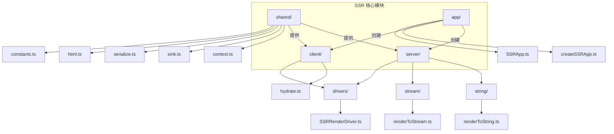
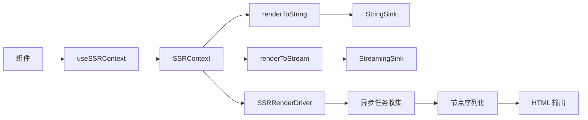
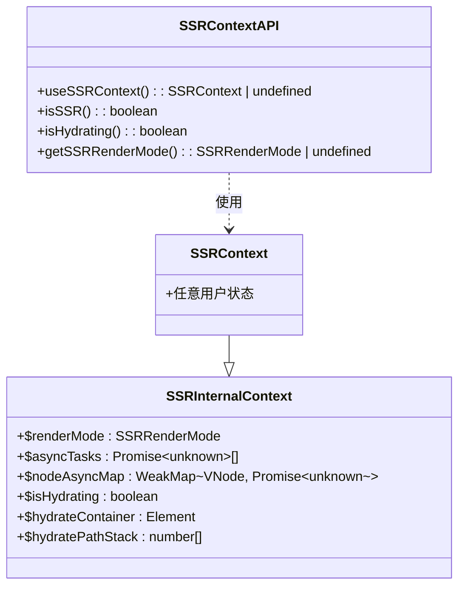
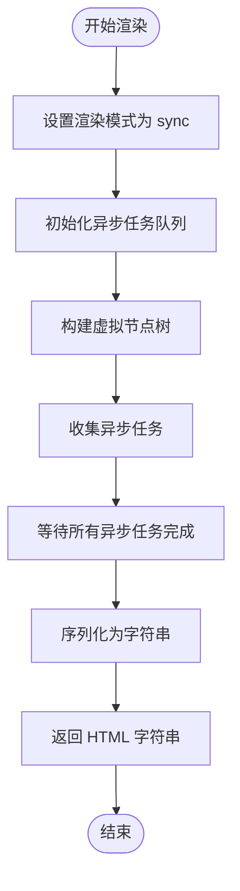
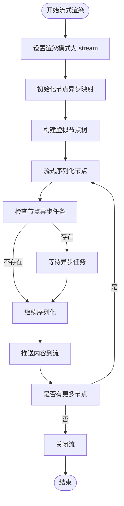
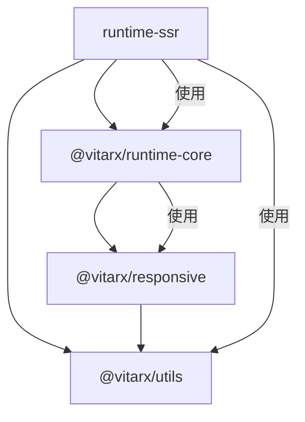

# SSR 上下文

<cite>
**本文档中引用的文件**  
- [context.ts](file://packages/runtime-ssr/src/shared/context.ts)
- [renderToString.ts](file://packages/runtime-ssr/src/server/string/renderToString.ts)
- [renderToStream.ts](file://packages/runtime-ssr/src/server/stream/renderToStream.ts)
- [SSRRenderDriver.ts](file://packages/runtime-ssr/src/server/drivers/SSRRenderDriver.ts)
- [sink.ts](file://packages/runtime-ssr/src/shared/sink.ts)
- [serialize.ts](file://packages/runtime-ssr/src/shared/serialize.ts)
- [constants.ts](file://packages/runtime-ssr/src/shared/constants.ts)
- [createSSRApp.ts](file://packages/runtime-ssr/src/app/createSSRApp.ts)
- [context.ts](file://packages/runtime-core/src/renderer/context.ts)
- [context.ts](file://packages/responsive/src/context/context.ts)
</cite>

## 目录
1. [简介](#简介)
2. [项目结构](#项目结构)
3. [核心组件](#核心组件)
4. [架构概述](#架构概述)
5. [详细组件分析](#详细组件分析)
6. [依赖分析](#依赖分析)
7. [性能考虑](#性能考虑)
8. [故障排除指南](#故障排除指南)
9. [结论](#结论)

## 简介
SSR（服务端渲染）上下文是 Vitarx 框架中用于支持服务端渲染的核心机制。它提供了一套完整的 API，允许开发者在服务端记录状态，并在客户端进行水合（hydrate）恢复。本文档深入分析 SSR 上下文的实现原理、核心组件及其在同步和流式渲染模式下的工作方式。

**SSR 渲染模式**  
- `sync`：同步渲染，等待所有异步任务完成后一次性输出  
- `stream`：流式渲染，遇到异步时阻塞等待完成后继续输出，最终内容与 sync 模式一致  

SSR 上下文的设计与 Vue 的 SSRContext 保持一致，确保了状态在服务端和客户端之间的一致性。

## 项目结构
Vitarx 框架的 SSR 功能主要集中在 `packages/runtime-ssr` 包中，其结构清晰地分离了共享逻辑、服务端渲染和客户端水合逻辑。



**Diagram sources**
- [context.ts](file://packages/runtime-ssr/src/shared/context.ts)
- [renderToString.ts](file://packages/runtime-ssr/src/server/string/renderToString.ts)
- [renderToStream.ts](file://packages/runtime-ssr/src/server/stream/renderToStream.ts)
- [SSRRenderDriver.ts](file://packages/runtime-ssr/src/server/drivers/SSRRenderDriver.ts)

**Section sources**
- [context.ts](file://packages/runtime-ssr/src/shared/context.ts)
- [renderToString.ts](file://packages/runtime-ssr/src/server/string/renderToString.ts)
- [renderToStream.ts](file://packages/runtime-ssr/src/server/stream/renderToStream.ts)

## 核心组件
SSR 上下文的核心组件包括上下文管理、渲染驱动、输出接收器和序列化工具。这些组件协同工作，实现了服务端渲染的完整流程。

**SSRContext 类型**  
开发者可在服务端渲染时写入任意状态，客户端通过 `runInRenderContext` 恢复。该类型扩展了 SSR 内部上下文，允许自定义状态的传递。

**渲染模式支持**  
框架支持两种渲染模式：同步（sync）和流式（stream），分别适用于不同的性能和用户体验需求。

**Section sources**
- [context.ts](file://packages/runtime-ssr/src/shared/context.ts)
- [constants.ts](file://packages/runtime-ssr/src/shared/constants.ts)

## 架构概述
SSR 上下文的架构基于响应式上下文系统，通过 `@vitarx/responsive` 提供的上下文管理能力，实现了跨环境的状态隔离和传递。



**Diagram sources**
- [context.ts](file://packages/runtime-ssr/src/shared/context.ts)
- [renderToString.ts](file://packages/runtime-ssr/src/server/string/renderToString.ts)
- [renderToStream.ts](file://packages/runtime-ssr/src/server/stream/renderToStream.ts)
- [sink.ts](file://packages/runtime-ssr/src/shared/sink.ts)

## 详细组件分析

### SSR 上下文管理分析
SSR 上下文管理基于 `@vitarx/responsive` 的上下文系统，实现了服务端和客户端的上下文隔离。



**Diagram sources**
- [context.ts](file://packages/runtime-ssr/src/shared/context.ts)

**Section sources**
- [context.ts](file://packages/runtime-ssr/src/shared/context.ts)
- [context.ts](file://packages/runtime-core/src/renderer/context.ts)

### 渲染流程分析
SSR 渲染流程分为构建虚拟节点树、收集异步任务和序列化输出三个阶段。

#### 同步渲染流程


**Diagram sources**
- [renderToString.ts](file://packages/runtime-ssr/src/server/string/renderToString.ts)

#### 流式渲染流程


**Diagram sources**
- [renderToStream.ts](file://packages/runtime-ssr/src/server/stream/renderToStream.ts)

### SSR 渲染驱动分析
SSRRenderDriver 是服务端渲染的核心驱动，负责处理不同类型的虚拟节点。

```mermaid
classDiagram
class SSRRenderDriver {
+render(node : VNode) : ElementOf~T~
+activate() : void
+deactivate() : void
+mount() : void
+unmount() : void
+updateProps() : void
}
class NodeDriver {
<<interface>>
+render(node : VNode) : ElementOf~T~
+activate() : void
+deactivate() : void
+mount() : void
+unmount() : void
+updateProps() : void
}
SSRRenderDriver --|> NodeDriver
SSRRenderDriver -->|使用| useSSRContext : 获取上下文
SSRRenderDriver -->|使用| renderNode : 渲染子节点
SSRRenderDriver -->|使用| createWidgetRuntime : 创建组件运行时
```

**Diagram sources**
- [SSRRenderDriver.ts](file://packages/runtime-ssr/src/server/drivers/SSRRenderDriver.ts)

**Section sources**
- [SSRRenderDriver.ts](file://packages/runtime-ssr/src/server/drivers/SSRRenderDriver.ts)

### 输出接收器分析
输出接收器（Sink）抽象了不同输出方式的差异，统一了字符串和流式输出的接口。

```mermaid
classDiagram
class Sink {
<<interface>>
+push(content : string) : void
}
class StringSink {
-buffer : string[]
+push(content : string) : void
+toString() : string
+get size() : number
}
class StreamingSink {
-options : StreamRenderOptions
+push(content : string) : void
}
Sink <|-- StringSink
Sink <|-- StreamingSink
StringSink -->|用于| renderToString
StreamingSink -->|用于| renderToStream
```

**Diagram sources**
- [sink.ts](file://packages/runtime-ssr/src/shared/sink.ts)

**Section sources**
- [sink.ts](file://packages/runtime-ssr/src/shared/sink.ts)
- [serialize.ts](file://packages/runtime-ssr/src/shared/serialize.ts)

## 依赖分析
SSR 上下文依赖于多个核心包，形成了清晰的依赖关系图。



**Diagram sources**
- [package.json](file://packages/runtime-ssr/package.json)
- [package.json](file://packages/runtime-core/package.json)

**Section sources**
- [context.ts](file://packages/runtime-ssr/src/shared/context.ts)
- [context.ts](file://packages/runtime-core/src/renderer/context.ts)
- [context.ts](file://packages/responsive/src/context/context.ts)

## 性能考虑
SSR 上下文在设计时充分考虑了性能因素：

1. **内存效率**：使用 `WeakMap` 存储节点异步任务映射，避免内存泄漏
2. **渲染模式选择**：提供 sync 和 stream 两种模式，适应不同场景需求
3. **异步任务管理**：在 stream 模式下按需等待异步任务，减少整体延迟
4. **缓冲优化**：StringSink 使用数组缓冲，最后一次性 join，减少字符串操作开销

对于高并发场景，推荐使用流式渲染模式，可以更快地开始传输内容，改善首屏加载体验。

## 故障排除指南
### 常见问题及解决方案

| 问题现象 | 可能原因 | 解决方案 |
|--------|--------|--------|
| 客户端水合失败 | SSRContext 未正确传递 | 确保服务端渲染的上下文完整传递到客户端 |
| 异步组件未渲染 | 异步任务未正确收集 | 检查组件是否正确返回 Promise |
| 流式渲染阻塞 | 异步任务长时间未完成 | 优化异步任务逻辑或设置超时机制 |
| 内存泄漏 | 大量虚拟节点未释放 | 检查 WeakMap 使用是否正确 |

### 调试技巧
- 使用 `useSSRContext()` 检查当前是否在 SSR 环境
- 通过 `getSSRRenderMode()` 确认当前渲染模式
- 在开发环境中启用详细的日志输出

**Section sources**
- [context.ts](file://packages/runtime-ssr/src/shared/context.ts)
- [renderToString.ts](file://packages/runtime-ssr/src/server/string/renderToString.ts)
- [renderToStream.ts](file://packages/runtime-ssr/src/server/stream/renderToStream.ts)

## 结论
SSR 上下文是 Vitarx 框架服务端渲染能力的核心，通过精心设计的 API 和架构，实现了高效、灵活的服务端渲染解决方案。其主要特点包括：

1. **统一的上下文管理**：基于响应式系统，确保状态一致性
2. **双模式渲染支持**：sync 和 stream 模式满足不同性能需求
3. **清晰的职责分离**：各组件职责明确，易于维护和扩展
4. **高效的异步处理**：合理管理异步任务，优化渲染性能

该设计不仅提供了强大的服务端渲染能力，还为未来的功能扩展奠定了坚实的基础。