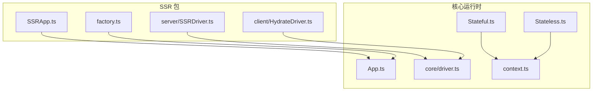
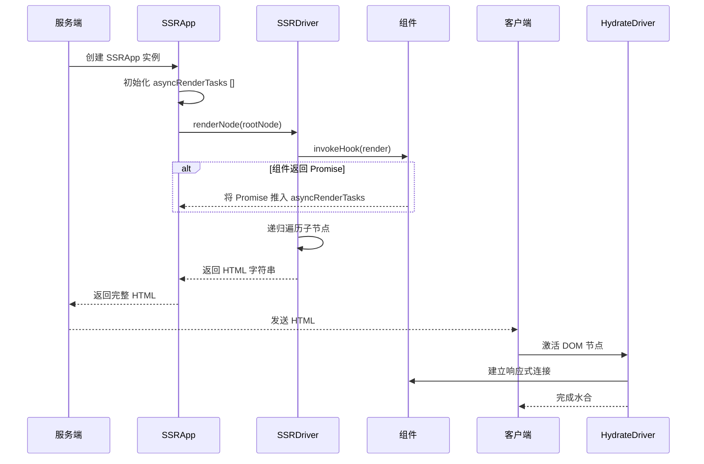
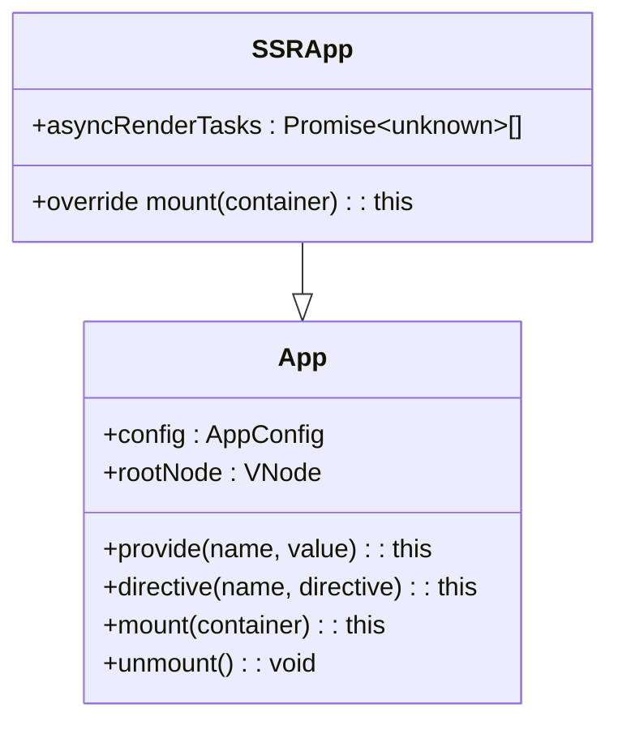
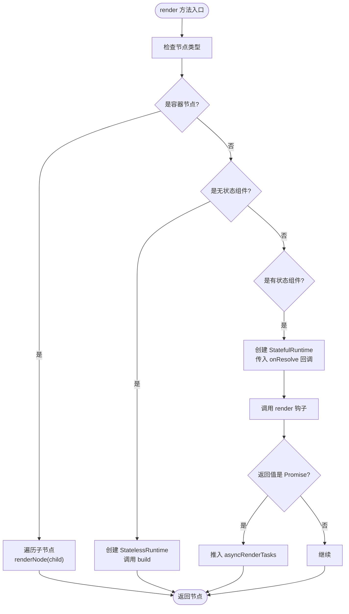
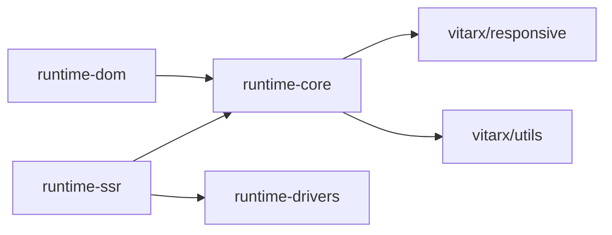

# SSR 原理

<cite>
**本文档引用文件**  
- [SSRApp.ts](file://packages/runtime-ssr/src/SSRApp.ts)
- [App.ts](file://packages/runtime-core/src/app/App.ts)
- [SSRDriver.ts](file://packages/runtime-ssr/src/server/SSRDriver.ts)
- [HydrateDriver.ts](file://packages/runtime-ssr/src/client/HydrateDriver.ts)
- [create.ts](file://packages/runtime-core/src/vnode/core/create.ts)
- [Stateful.ts](file://packages/runtime-core/src/widget/runtime/Stateful.ts)
- [Stateless.ts](file://packages/runtime-core/src/widget/runtime/Stateless.ts)
- [driver.ts](file://packages/runtime-core/src/vnode/core/driver.ts)
- [factory.ts](file://packages/runtime-ssr/src/factory.ts)
- [context.ts](file://packages/runtime-core/src/runtime/context.ts)
</cite>

## 目录
1. [简介](#简介)
2. [项目结构](#项目结构)
3. [核心组件](#核心组件)
4. [架构概述](#架构概述)
5. [详细组件分析](#详细组件分析)
6. [依赖分析](#依赖分析)
7. [性能考虑](#性能考虑)
8. [故障排除指南](#故障排除指南)
9. [结论](#结论)

## 简介
本文档深入解析 Vitarx 框架中服务端渲染（SSR）的整体架构与设计思想。重点阐述 SSRApp 如何继承自 App 并扩展异步渲染任务队列（asyncRenderTasks），揭示服务端与客户端的同构逻辑如何共享组件代码。文档将详细说明虚拟 DOM 在服务端如何被遍历而不进行实际挂载，以及如何通过 render 函数生成字符串 HTML。同时涵盖上下文传递、应用实例隔离、异步组件预加载等核心概念，并结合 SSRApp 的 mount 方法重写行为说明其执行流程。最后提供与主流框架 SSR 模式的对比分析，帮助开发者理解 Vitarx 的独特实现路径。

## 项目结构
Vitarx 的 SSR 实现主要分布在 `packages/runtime-ssr` 包中，该包与核心运行时 `runtime-core` 紧密协作。SSR 功能通过特定的驱动器（Driver）和应用类（SSRApp）来实现，确保服务端和客户端能够共享大部分代码，同时在各自环境中执行特定逻辑。

**Diagram sources**
- [SSRApp.ts](file://packages/runtime-ssr/src/SSRApp.ts)
- [App.ts](file://packages/runtime-core/src/app/App.ts)
- [SSRDriver.ts](file://packages/runtime-ssr/src/server/SSRDriver.ts)
- [driver.ts](file://packages/runtime-core/src/vnode/core/driver.ts)
- [factory.ts](file://packages/runtime-ssr/src/factory.ts)

**Section sources**
- [SSRApp.ts](file://packages/runtime-ssr/src/SSRApp.ts)
- [App.ts](file://packages/runtime-core/src/app/App.ts)

## 核心组件
Vitarx 的 SSR 核心在于 `SSRApp` 类，它继承自 `App` 类并扩展了服务端特有的功能。关键扩展包括 `asyncRenderTasks` 异步任务队列，用于收集在服务端渲染过程中产生的所有异步操作（如数据获取、异步组件加载），确保在 HTML 生成前所有异步任务都已解析。

**Section sources**
- [SSRApp.ts](file://packages/runtime-ssr/src/SSRApp.ts)
- [App.ts](file://packages/runtime-core/src/app/App.ts)

## 架构概述
Vitarx 的 SSR 架构采用驱动器（Driver）模式，通过不同的驱动器实现服务端和客户端的差异化行为。在服务端，`SSRDriver` 负责遍历虚拟 DOM 树，触发组件的 `render` 方法，但不执行实际的 DOM 挂载。所有异步任务被收集到 `SSRApp` 的 `asyncRenderTasks` 队列中。在客户端，`HydrateDriver` 则负责激活（hydrate）已有的 HTML，建立事件监听和响应式系统。

**Diagram sources**
- [SSRApp.ts](file://packages/runtime-ssr/src/SSRApp.ts)
- [SSRDriver.ts](file://packages/runtime-ssr/src/server/SSRDriver.ts)
- [Stateful.ts](file://packages/runtime-core/src/widget/runtime/Stateful.ts)

## 详细组件分析

### SSRApp 分析
`SSRApp` 是服务端渲染的核心应用类，它继承自 `App` 并添加了 `asyncRenderTasks` 属性来管理异步任务。

**Diagram sources**
- [SSRApp.ts](file://packages/runtime-ssr/src/SSRApp.ts)
- [App.ts](file://packages/runtime-core/src/app/App.ts)

**Section sources**
- [SSRApp.ts](file://packages/runtime-ssr/src/SSRApp.ts)

### SSRDriver 分析
`SSRDriver` 是服务端专用的驱动器，其核心在于 `render` 方法。该方法会遍历节点树，对于有状态组件，会创建 `StatefulWidgetRuntime` 实例，并传入特定的 `StatefulManagerOptions`。

**Diagram sources**
- [SSRDriver.ts](file://packages/runtime-ssr/src/server/SSRDriver.ts)
- [Stateful.ts](file://packages/runtime-core/src/widget/runtime/Stateful.ts)

**Section sources**
- [SSRDriver.ts](file://packages/runtime-ssr/src/server/SSRDriver.ts)

### 同构与上下文传递
Vitarx 通过 `runInAppContext` 和 `getAppContext` 等函数实现上下文传递。`SSRApp` 实例在创建时会作为上下文注入到根节点，确保在服务端渲染期间，任何组件都能通过 `getCurrentVNode()` 或 `getAppContext()` 访问到当前的应用实例和节点信息，从而实现应用实例的隔离。

**Section sources**
- [context.ts](file://packages/runtime-core/src/runtime/context.ts)
- [App.ts](file://packages/runtime-core/src/app/App.ts)

## 依赖分析
SSR 功能的实现依赖于多个核心包的协同工作。`runtime-ssr` 依赖 `runtime-core` 提供的虚拟 DOM、组件模型和应用生命周期管理，同时依赖 `runtime-drivers` 提供的驱动器注册机制。`runtime-dom` 则为客户端提供具体的 DOM 操作实现。

**Diagram sources**
- [package.json](file://packages/runtime-ssr/package.json)
- [factory.ts](file://packages/runtime-ssr/src/factory.ts)

**Section sources**
- [package.json](file://packages/runtime-ssr/package.json)

## 性能考虑
Vitarx 的 SSR 设计在性能方面有以下考量：
- **异步任务聚合**：通过 `asyncRenderTasks` 队列，可以一次性等待所有异步操作完成，避免了多次 `await` 带来的性能开销。
- **无实际挂载**：服务端的 `SSRDriver` 不执行 DOM 操作，仅进行虚拟 DOM 的遍历和字符串生成，极大提升了渲染速度。
- **驱动器模式**：清晰的驱动器分离使得服务端和客户端的逻辑互不干扰，优化了各自的执行路径。

## 故障排除指南
在使用 Vitarx SSR 时，可能遇到的常见问题及解决方案：
- **异步数据未加载**：确保在组件中触发的异步操作（如 API 调用）返回的 Promise 被正确地推入 `asyncRenderTasks`。检查 `StatefulManagerOptions.onResolve` 是否被正确调用。
- **水合失败**：确保服务端生成的 HTML 结构与客户端期望的结构完全一致。检查组件的 `render` 方法在服务端和客户端是否返回相同的内容。
- **上下文丢失**：确认 `SSRApp` 实例已正确创建并作为上下文注入。检查 `factory.ts` 中的 `setRenderer` 调用是否在正确的环境下执行。

**Section sources**
- [SSRDriver.ts](file://packages/runtime-ssr/src/server/SSRDriver.ts)
- [Stateful.ts](file://packages/runtime-core/src/widget/runtime/Stateful.ts)
- [factory.ts](file://packages/runtime-ssr/src/factory.ts)

## 结论
Vitarx 的 SSR 实现通过继承 `App` 类并引入 `SSRDriver` 驱动器，巧妙地实现了服务端和客户端的同构渲染。其核心优势在于：
1. **清晰的职责分离**：通过驱动器模式，将渲染逻辑与平台特定操作解耦。
2. **高效的异步处理**：利用 `asyncRenderTasks` 队列集中管理异步依赖，确保 HTML 的完整性。
3. **无缝的同构体验**：共享组件代码，通过上下文传递实现应用实例隔离。
4. **灵活的扩展性**：基于 `runtime-core` 的模块化设计，易于扩展和维护。

与主流框架相比，Vitarx 的实现更加注重底层驱动器的抽象，为开发者提供了更精细的控制能力，同时也保持了 SSR 的核心优势——首屏性能和 SEO 友好性。