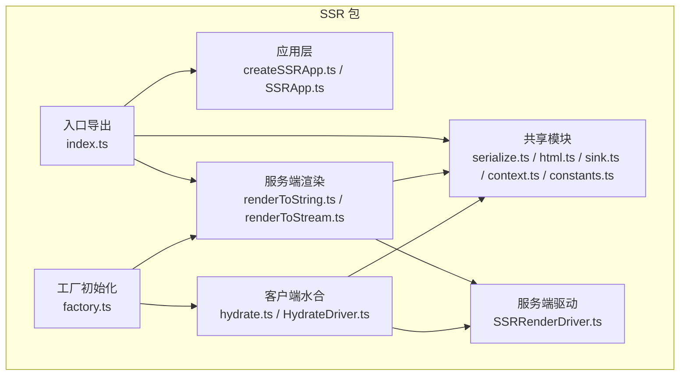
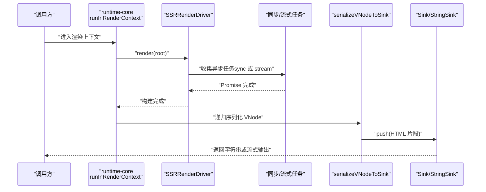
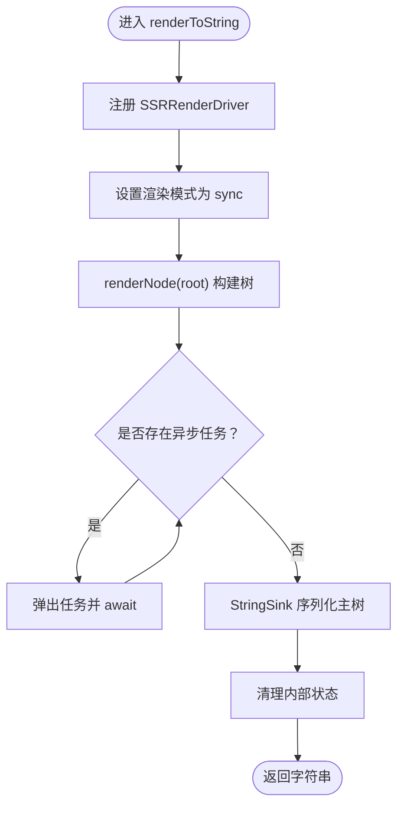
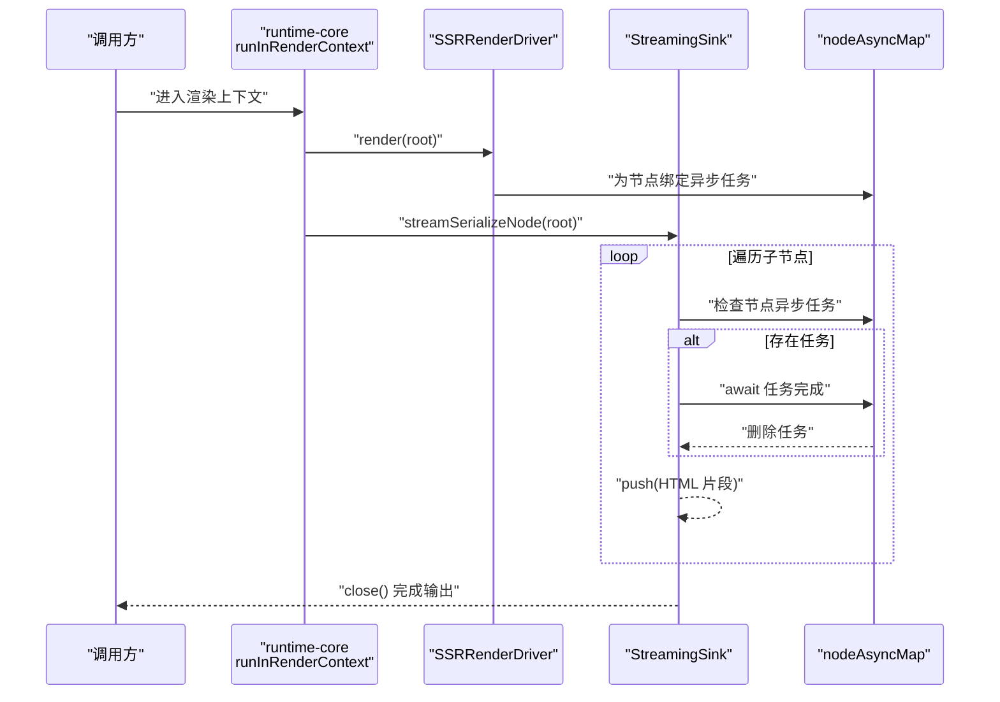
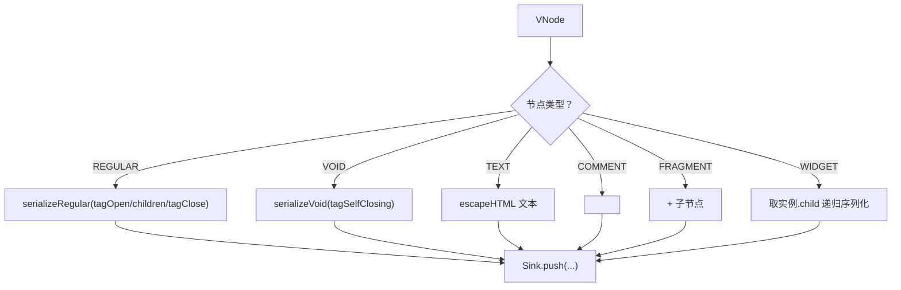
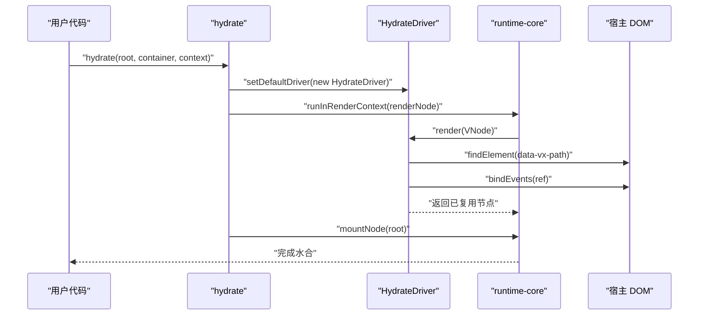
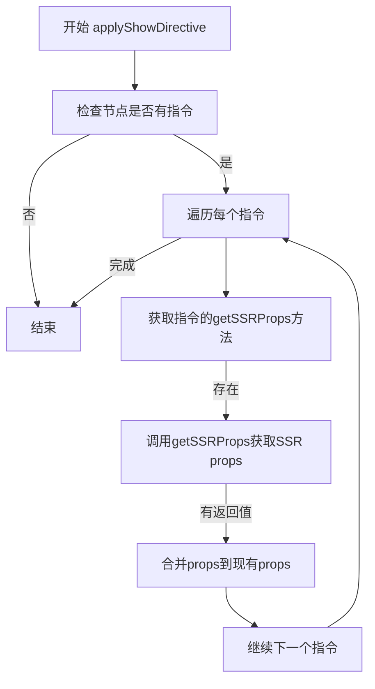
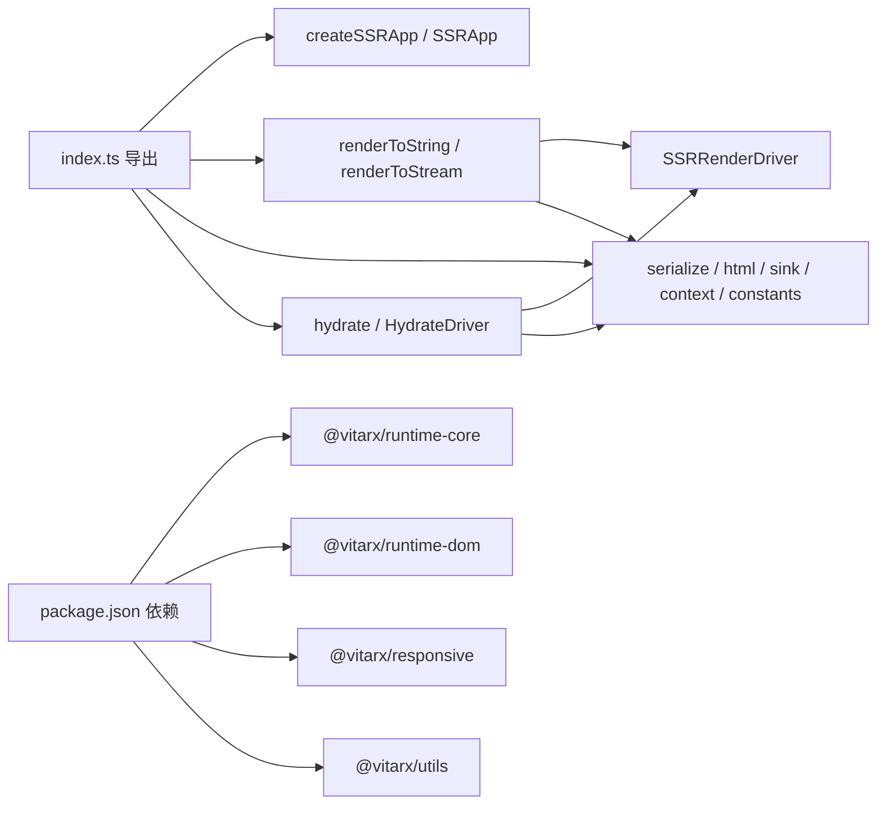

# SSR 序列化

<cite>
**本文引用的文件列表**
- [packages/runtime-ssr/src/index.ts](file://packages/runtime-ssr/src/index.ts)
- [packages/runtime-ssr/src/app/createSSRApp.ts](file://packages/runtime-ssr/src/app/createSSRApp.ts)
- [packages/runtime-ssr/src/app/SSRApp.ts](file://packages/runtime-ssr/src/app/SSRApp.ts)
- [packages/runtime-ssr/src/server/string/renderToString.ts](file://packages/runtime-ssr/src/server/string/renderToString.ts)
- [packages/runtime-ssr/src/server/stream/renderToStream.ts](file://packages/runtime-ssr/src/server/stream/renderToStream.ts)
- [packages/runtime-ssr/src/server/drivers/SSRRenderDriver.ts](file://packages/runtime-ssr/src/server/drivers/SSRRenderDriver.ts)
- [packages/runtime-ssr/src/shared/serialize.ts](file://packages/runtime-ssr/src/shared/serialize.ts)
- [packages/runtime-ssr/src/shared/html.ts](file://packages/runtime-ssr/src/shared/html.ts)
- [packages/runtime-ssr/src/shared/sink.ts](file://packages/runtime-ssr/src/shared/sink.ts)
- [packages/runtime-ssr/src/shared/context.ts](file://packages/runtime-ssr/src/shared/context.ts)
- [packages/runtime-ssr/src/shared/constants.ts](file://packages/runtime-ssr/src/shared/constants.ts)
- [packages/runtime-ssr/src/client/hydrate.ts](file://packages/runtime-ssr/src/client/hydrate.ts)
- [packages/runtime-ssr/src/client/drivers/HydrateDriver.ts](file://packages/runtime-ssr/src/client/drivers/HydrateDriver.ts)
- [packages/runtime-ssr/src/factory.ts](file://packages/runtime-ssr/src/factory.ts)
- [packages/runtime-ssr/package.json](file://packages/runtime-ssr/package.json)
- [packages/runtime-core/src/directive/show.ts](file://packages/runtime-core/src/directive/show.ts)
</cite>

## 更新摘要
**已更新内容**
- 在"核心组件"部分新增了v-show指令的SSR支持说明
- 在"详细组件分析"部分新增了getSSRProps方法、applyShowDirective和inheritShowDirective函数的实现细节
- 更新了"HTML序列化与属性处理"部分，详细说明了如何在服务端渲染中处理display:none样式
- 在"性能考量"部分新增了关于v-show指令的性能建议

## 目录
1. [简介](#简介)
2. [项目结构](#项目结构)
3. [核心组件](#核心组件)
4. [架构总览](#架构总览)
5. [详细组件分析](#详细组件分析)
6. [依赖关系分析](#依赖关系分析)
7. [性能考量](#性能考量)
8. [故障排查指南](#故障排查指南)
9. [结论](#结论)
10. [附录](#附录)

## 简介
本文件系统性梳理 Vitarx 的 SSR（服务端渲染）序列化能力，覆盖从应用创建、渲染（同步与流式）、HTML 序列化、上下文传递，到客户端水合的完整链路。重点解释以下关键点：
- 如何将虚拟节点树渲染为 HTML 字符串或流式输出
- 同步与流式两种渲染模式的差异与适用场景
- 服务端如何收集异步任务并在水合时恢复状态
- 客户端如何基于 data-vx-path 精确复用 DOM 并绑定事件
- **新增：v-show指令的SSR支持，包括getSSRProps方法的引入、applyShowDirective和inheritShowDirective函数的实现，以及如何在服务端渲染中正确处理display:none样式**

## 项目结构
runtime-ssr 包提供 SSR 应用入口、服务端渲染（字符串与流式）、HTML 序列化工具、上下文与常量、以及客户端水合能力。核心导出集中在入口文件中，便于按需引入。



图表来源
- [packages/runtime-ssr/src/index.ts](file://packages/runtime-ssr/src/index.ts#L1-L48)
- [packages/runtime-ssr/src/app/createSSRApp.ts](file://packages/runtime-ssr/src/app/createSSRApp.ts#L1-L25)
- [packages/runtime-ssr/src/server/string/renderToString.ts](file://packages/runtime-ssr/src/server/string/renderToString.ts#L1-L61)
- [packages/runtime-ssr/src/server/stream/renderToStream.ts](file://packages/runtime-ssr/src/server/stream/renderToStream.ts#L1-L296)
- [packages/runtime-ssr/src/server/drivers/SSRRenderDriver.ts](file://packages/runtime-ssr/src/server/drivers/SSRRenderDriver.ts#L1-L113)
- [packages/runtime-ssr/src/shared/serialize.ts](file://packages/runtime-ssr/src/shared/serialize.ts#L1-L91)
- [packages/runtime-ssr/src/shared/html.ts](file://packages/runtime-ssr/src/shared/html.ts#L1-L102)
- [packages/runtime-ssr/src/shared/sink.ts](file://packages/runtime-ssr/src/shared/sink.ts#L1-L44)
- [packages/runtime-ssr/src/shared/context.ts](file://packages/runtime-ssr/src/shared/context.ts#L1-L119)
- [packages/runtime-ssr/src/shared/constants.ts](file://packages/runtime-ssr/src/shared/constants.ts#L1-L10)
- [packages/runtime-ssr/src/client/hydrate.ts](file://packages/runtime-ssr/src/client/hydrate.ts#L1-L105)
- [packages/runtime-ssr/src/client/drivers/HydrateDriver.ts](file://packages/runtime-ssr/src/client/drivers/HydrateDriver.ts#L1-L351)
- [packages/runtime-ssr/src/factory.ts](file://packages/runtime-ssr/src/factory.ts#L1-L18)

章节来源
- [packages/runtime-ssr/src/index.ts](file://packages/runtime-ssr/src/index.ts#L1-L48)
- [packages/runtime-ssr/src/factory.ts](file://packages/runtime-ssr/src/factory.ts#L1-L18)

## 核心组件
- 应用层
  - createSSRApp：创建 SSR 应用实例，设置宿主 schema（void 元素集合）
  - SSRApp：继承自通用 App，用于 SSR 场景
- 服务端渲染
  - renderToString：同步模式，等待所有异步任务后一次性序列化
  - renderToStream：流式阻塞模式，遇到异步任务时等待，最终输出与 sync 一致
  - SSRRenderDriver：服务端渲染驱动，负责在渲染阶段收集异步任务（sync 或 stream）
- 共享模块
  - serializeVNodeToSink：将 VNode 递归序列化到 Sink（字符串或流）
  - html 工具：HTML 转义、属性序列化、标签开闭与自闭合
  - Sink 接口与 StringSink：统一输出抽象与字符串缓冲
  - SSRContext：渲染模式、异步任务队列、水合相关状态等
  - constants：检测服务端环境
- 客户端水合
  - hydrate：在客户端复用服务端渲染的 DOM，绑定事件与 ref，触发生命周期
  - HydrateDriver：水合驱动，基于 data-vx-path 精确定位 DOM 并绑定事件
- **v-show指令SSR支持**
  - **getSSRProps**: v-show指令的SSR专用钩子，用于在服务端渲染时生成适当的props
  - **applyShowDirective**: 应用指令样式到props的工具函数，处理v-show指令的SSR逻辑
  - **inheritShowDirective**: 将父组件的v-show指令继承到子节点的工具函数

章节来源
- [packages/runtime-ssr/src/app/createSSRApp.ts](file://packages/runtime-ssr/src/app/createSSRApp.ts#L1-L25)
- [packages/runtime-ssr/src/app/SSRApp.ts](file://packages/runtime-ssr/src/app/SSRApp.ts#L1-L13)
- [packages/runtime-ssr/src/server/string/renderToString.ts](file://packages/runtime-ssr/src/server/string/renderToString.ts#L1-L61)
- [packages/runtime-ssr/src/server/stream/renderToStream.ts](file://packages/runtime-ssr/src/server/stream/renderToStream.ts#L1-L296)
- [packages/runtime-ssr/src/server/drivers/SSRRenderDriver.ts](file://packages/runtime-ssr/src/server/drivers/SSRRenderDriver.ts#L1-L113)
- [packages/runtime-ssr/src/shared/serialize.ts](file://packages/runtime-ssr/src/shared/serialize.ts#L1-L91)
- [packages/runtime-ssr/src/shared/html.ts](file://packages/runtime-ssr/src/shared/html.ts#L1-L102)
- [packages/runtime-ssr/src/shared/sink.ts](file://packages/runtime-ssr/src/shared/sink.ts#L1-L44)
- [packages/runtime-ssr/src/shared/context.ts](file://packages/runtime-ssr/src/shared/context.ts#L1-L119)
- [packages/runtime-ssr/src/shared/constants.ts](file://packages/runtime-ssr/src/shared/constants.ts#L1-L10)
- [packages/runtime-ssr/src/client/hydrate.ts](file://packages/runtime-ssr/src/client/hydrate.ts#L1-L105)
- [packages/runtime-ssr/src/client/drivers/HydrateDriver.ts](file://packages/runtime-ssr/src/client/drivers/HydrateDriver.ts#L1-L351)
- [packages/runtime-core/src/directive/show.ts](file://packages/runtime-core/src/directive/show.ts#L1-L38)

## 架构总览
SSR 渲染分为"构建期"和"序列化期"，服务端驱动在构建期收集异步任务；在 sync 模式下，先等待所有任务完成再一次性序列化；在 stream 模式下，边构建边序列化，遇到节点异步任务则等待完成再继续。



图表来源
- [packages/runtime-ssr/src/server/string/renderToString.ts](file://packages/runtime-ssr/src/server/string/renderToString.ts#L1-L61)
- [packages/runtime-ssr/src/server/stream/renderToStream.ts](file://packages/runtime-ssr/src/server/stream/renderToStream.ts#L1-L296)
- [packages/runtime-ssr/src/server/drivers/SSRRenderDriver.ts](file://packages/runtime-ssr/src/server/drivers/SSRRenderDriver.ts#L1-L113)
- [packages/runtime-ssr/src/shared/serialize.ts](file://packages/runtime-ssr/src/shared/serialize.ts#L1-L91)
- [packages/runtime-ssr/src/shared/sink.ts](file://packages/runtime-ssr/src/shared/sink.ts#L1-L44)

## 详细组件分析

### 应用层：createSSRApp 与 SSRApp
- createSSRApp 负责创建 SSRApp 实例，并设置宿主 schema（void 元素集合），确保 SSR 期间对 void 元素的正确处理。
- SSRApp 继承自通用 App，保持与通用渲染流程一致。

章节来源
- [packages/runtime-ssr/src/app/createSSRApp.ts](file://packages/runtime-ssr/src/app/createSSRApp.ts#L1-L25)
- [packages/runtime-ssr/src/app/SSRApp.ts](file://packages/runtime-ssr/src/app/SSRApp.ts#L1-L13)

### 服务端渲染：renderToString（同步模式）
- 设置默认驱动为 SSRRenderDriver，渲染模式标记为 sync
- 构建根节点树，收集所有异步任务并逐一等待完成
- 使用 StringSink 一次性序列化主树，清理内部状态后返回字符串



图表来源
- [packages/runtime-ssr/src/server/string/renderToString.ts](file://packages/runtime-ssr/src/server/string/renderToString.ts#L1-L61)
- [packages/runtime-ssr/src/server/drivers/SSRRenderDriver.ts](file://packages/runtime-ssr/src/server/drivers/SSRRenderDriver.ts#L1-L113)
- [packages/runtime-ssr/src/shared/serialize.ts](file://packages/runtime-ssr/src/shared/serialize.ts#L1-L91)
- [packages/runtime-ssr/src/shared/sink.ts](file://packages/runtime-ssr/src/shared/sink.ts#L1-L44)

章节来源
- [packages/runtime-ssr/src/server/string/renderToString.ts](file://packages/runtime-ssr/src/server/string/renderToString.ts#L1-L61)

### 服务端渲染：renderToStream（流式阻塞模式）
- 设置渲染模式为 stream，使用 WeakMap 将异步任务绑定到节点
- 渲染根节点，随后逐节点流式序列化；遇到节点异步任务则等待完成再继续
- 提供多种输出适配：ReadableStream、Node Readable、管道到 Writable



图表来源
- [packages/runtime-ssr/src/server/stream/renderToStream.ts](file://packages/runtime-ssr/src/server/stream/renderToStream.ts#L1-L296)
- [packages/runtime-ssr/src/server/drivers/SSRRenderDriver.ts](file://packages/runtime-ssr/src/server/drivers/SSRRenderDriver.ts#L1-L113)

章节来源
- [packages/runtime-ssr/src/server/stream/renderToStream.ts](file://packages/runtime-ssr/src/server/stream/renderToStream.ts#L1-L296)

### HTML 序列化与属性处理：serializeVNodeToSink 与 html 工具
- serializeVNodeToSink：根据节点类型递归序列化，支持常规元素、void 元素、文本、注释、片段、有状态/无状态组件
- html 工具：转义 HTML、序列化属性（class/style 等特殊处理）、生成开闭标签与自闭合标签
- Sink 抽象：统一字符串与流式输出；StringSink 作为同步模式的缓冲
- **v-show指令处理**：通过applyShowDirective函数处理v-show指令，在服务端渲染时正确应用display:none样式



图表来源
- [packages/runtime-ssr/src/shared/serialize.ts](file://packages/runtime-ssr/src/shared/serialize.ts#L1-L91)
- [packages/runtime-ssr/src/shared/html.ts](file://packages/runtime-ssr/src/shared/html.ts#L1-L102)
- [packages/runtime-ssr/src/shared/sink.ts](file://packages/runtime-ssr/src/shared/sink.ts#L1-L44)

章节来源
- [packages/runtime-ssr/src/shared/serialize.ts](file://packages/runtime-ssr/src/shared/serialize.ts#L1-L91)
- [packages/runtime-ssr/src/shared/html.ts](file://packages/runtime-ssr/src/shared/html.ts#L1-L102)
- [packages/runtime-ssr/src/shared/sink.ts](file://packages/runtime-ssr/src/shared/sink.ts#L1-L44)

### 上下文与常量：SSRContext 与 __IS_SERVER__
- SSRContext：定义渲染模式、异步任务队列/映射、水合状态等；开发者可在服务端写入任意状态，客户端通过 runInRenderContext 恢复
- constants：检测是否在服务端环境，用于禁用宿主渲染器或切换实现

章节来源
- [packages/runtime-ssr/src/shared/context.ts](file://packages/runtime-ssr/src/shared/context.ts#L1-L119)
- [packages/runtime-ssr/src/shared/constants.ts](file://packages/runtime-ssr/src/shared/constants.ts#L1-L10)

### 客户端水合：hydrate 与 HydrateDriver
- hydrate：设置水合上下文（容器、路径栈、标记水合中），注册 HydrateDriver，先渲染复用 DOM 并绑定事件，再挂载触发生命钩子
- HydrateDriver：通过 data-vx-path 精确定位 DOM，复用元素/文本/注释节点，绑定事件与 ref，递归水合子节点；挂载阶段触发生命周期



图表来源
- [packages/runtime-ssr/src/client/hydrate.ts](file://packages/runtime-ssr/src/client/hydrate.ts#L1-L105)
- [packages/runtime-ssr/src/client/drivers/HydrateDriver.ts](file://packages/runtime-ssr/src/client/drivers/HydrateDriver.ts#L1-L351)

章节来源
- [packages/runtime-ssr/src/client/hydrate.ts](file://packages/runtime-ssr/src/client/hydrate.ts#L1-L105)
- [packages/runtime-ssr/src/client/drivers/HydrateDriver.ts](file://packages/runtime-ssr/src/client/drivers/HydrateDriver.ts#L1-L351)

### 工厂初始化：服务端禁用宿主渲染器
- 在服务端环境，通过工厂将宿主渲染器代理为抛错实现，避免在 SSR 期间误用 DOM API；在客户端使用 DomRenderer

章节来源
- [packages/runtime-ssr/src/factory.ts](file://packages/runtime-ssr/src/factory.ts#L1-L18)

### v-show指令SSR支持
#### getSSRProps方法
v-show指令新增了getSSRProps方法，这是SSR专用的钩子函数，用于在服务端渲染时生成适当的props。当v-show的值为false时，该方法返回{ style: { display: 'none' } }，确保在服务端渲染的HTML中正确应用display:none样式。

```typescript
getSSRProps(binding: DirectiveBinding, node: VNode): Record<string, any> {
  return binding.value ? {} : { style: { display: 'none' } }
}
```

#### applyShowDirective函数
applyShowDirective函数负责将v-show指令应用到节点的props上。它遍历节点的指令集合，调用getSSRProps方法获取SSR props，并使用deepMergeObject将这些props合并到现有props中。



#### inheritShowDirective函数
inheritShowDirective函数用于将父组件的v-show指令继承到子节点。这对于处理组件嵌套时的显示/隐藏逻辑非常重要，确保子组件能够正确继承父组件的显示状态。

章节来源
- [packages/runtime-core/src/directive/show.ts](file://packages/runtime-core/src/directive/show.ts#L1-L38)
- [packages/runtime-ssr/src/shared/serialize.ts](file://packages/runtime-ssr/src/shared/serialize.ts#L1-L34)

## 依赖关系分析
- runtime-ssr 依赖 runtime-core（渲染上下文、节点驱动、生命周期钩子等）、runtime-dom（void 元素集合）、responsive（响应式系统）、utils（Promise 判断）
- 入口导出聚合了应用、渲染、序列化、上下文、水合与自动初始化



图表来源
- [packages/runtime-ssr/src/index.ts](file://packages/runtime-ssr/src/index.ts#L1-L48)
- [packages/runtime-ssr/src/factory.ts](file://packages/runtime-ssr/src/factory.ts#L1-L18)
- [packages/runtime-ssr/package.json](file://packages/runtime-ssr/package.json#L1-L40)

章节来源
- [packages/runtime-ssr/package.json](file://packages/runtime-ssr/package.json#L1-L40)

## 性能考量
- 同步模式（renderToString）
  - 优点：输出稳定、与水合一致；适合小到中型页面
  - 注意：需要等待所有异步任务完成，首屏时间可能较长
- 流式模式（renderToStream）
  - 优点：边渲染边输出，降低首屏等待；最终内容与 sync 一致
  - 注意：需要合理控制异步粒度，避免过多细碎异步导致频繁等待
- 序列化与属性处理
  - HTML 转义与属性序列化为 O(n) 操作，建议避免在属性中传入超大对象
  - StringSink 使用数组拼接，整体复杂度与输出长度线性相关
- 水合定位
  - data-vx-path 由 serializeVNodeToSink 生成，路径越深查询成本越高；建议保持合理的嵌套深度
- **v-show指令性能**
  - **建议**：在服务端使用v-show指令时，尽量避免频繁切换显示状态，因为每次切换都会导致props的重新计算和合并
  - **注意**：当v-show为false时，会添加display:none样式，这可能会影响CSS选择器的匹配性能
  - **优化**：对于复杂的条件渲染，考虑使用v-if代替v-show，以减少不必要的DOM节点生成

[本节为通用指导，无需列出具体文件来源]

## 故障排查指南
- 未找到水合容器
  - 症状：hydrate 抛出容器不存在错误
  - 处理：确认容器元素存在且选择器正确
  - 参考：[packages/runtime-ssr/src/client/hydrate.ts](file://packages/runtime-ssr/src/client/hydrate.ts#L1-L105)
- 在服务端误用 DOM API
  - 症状：调用宿主渲染器方法抛错
  - 处理：确保在服务端环境使用 SSR 渲染，不要在服务端执行客户端逻辑
  - 参考：[packages/runtime-ssr/src/factory.ts](file://packages/runtime-ssr/src/factory.ts#L1-L18)
- 异步任务未被收集
  - 症状：流式渲染未等待异步组件完成
  - 处理：确认使用 SSRRenderDriver，且组件 onRender 返回 Promise；检查 context.$nodeAsyncMap 是否存在
  - 参考：[packages/runtime-ssr/src/server/drivers/SSRRenderDriver.ts](file://packages/runtime-ssr/src/server/drivers/SSRRenderDriver.ts#L1-L113)
- 水合失败或事件未绑定
  - 症状：点击等事件无效
  - 处理：确认 data-vx-path 与 DOM 对应；检查事件属性命名（以 on 开头且为函数）
  - 参考：[packages/runtime-ssr/src/client/drivers/HydrateDriver.ts](file://packages/runtime-ssr/src/client/drivers/HydrateDriver.ts#L1-L351)
- **v-show指令不生效**
  - 症状：服务端渲染的HTML中没有正确应用display:none样式
  - 处理：检查v-show指令是否正确应用，确认getSSRProps方法是否被调用
  - 参考：[packages/runtime-core/src/directive/show.ts](file://packages/runtime-core/src/directive/show.ts#L1-L38)

章节来源
- [packages/runtime-ssr/src/client/hydrate.ts](file://packages/runtime-ssr/src/client/hydrate.ts#L1-L105)
- [packages/runtime-ssr/src/factory.ts](file://packages/runtime-ssr/src/factory.ts#L1-L18)
- [packages/runtime-ssr/src/server/drivers/SSRRenderDriver.ts](file://packages/runtime-ssr/src/server/drivers/SSRRenderDriver.ts#L1-L113)
- [packages/runtime-ssr/src/client/drivers/HydrateDriver.ts](file://packages/runtime-ssr/src/client/drivers/HydrateDriver.ts#L1-L351)
- [packages/runtime-core/src/directive/show.ts](file://packages/runtime-core/src/directive/show.ts#L1-L38)

## 结论
Vitarx 的 SSR 序列化体系以"构建期收集异步任务 + 序列化期输出"的双阶段设计为核心，既保证了输出一致性，又提供了流式渲染的性能优势。通过 data-vx-path 与 HydrateDriver，实现了精准的 DOM 复用与事件绑定，确保水合体验与服务端一致。配合 SSRContext，开发者可以在服务端写入状态并在客户端恢复，形成完整的同构渲染闭环。**新增的v-show指令SSR支持通过getSSRProps方法、applyShowDirective和inheritShowDirective函数，确保了在服务端渲染时能够正确处理display:none样式，实现了与客户端一致的显示/隐藏行为。**

[本节为总结，无需列出具体文件来源]

## 附录
- 使用要点
  - 同步渲染：适合简单页面或对首屏时间要求不高
  - 流式渲染：适合大型页面或对首屏时间敏感
  - 水合：确保服务端输出包含 data-vx-path，客户端 hydrate 时容器与路径一致
  - **v-show指令**：在服务端渲染时，v-show指令会正确生成display:none样式，确保与客户端行为一致
- 相关导出参考
  - [packages/runtime-ssr/src/index.ts](file://packages/runtime-ssr/src/index.ts#L1-L48)

[本节为概览，无需列出具体文件来源]