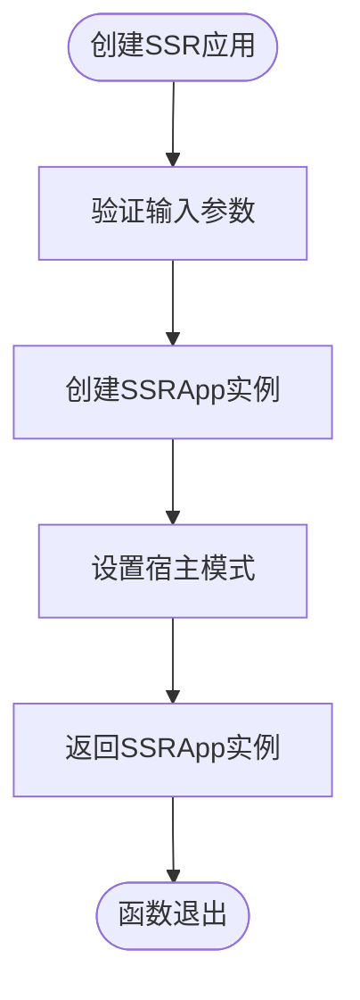

# SSR 渲染模式

<cite>
**本文档引用文件**  
- [SSRApp.ts](file://packages/runtime-ssr/src/app/SSRApp.ts)
- [createSSRApp.ts](file://packages/runtime-ssr/src/app/createSSRApp.ts)
- [renderToString.ts](file://packages/runtime-ssr/src/server/string/renderToString.ts)
- [renderToStream.ts](file://packages/runtime-ssr/src/server/stream/renderToStream.ts)
- [hydrate.ts](file://packages/runtime-ssr/src/client/hydrate.ts)
- [SSRRenderDriver.ts](file://packages/runtime-ssr/src/server/drivers/SSRRenderDriver.ts)
- [HydrateDriver.ts](file://packages/runtime-ssr/src/client/drivers/HydrateDriver.ts)
- [context.ts](file://packages/runtime-ssr/src/shared/context.ts)
- [serialize.ts](file://packages/runtime-ssr/src/shared/serialize.ts)
- [sink.ts](file://packages/runtime-ssr/src/shared/sink.ts)
- [html.ts](file://packages/runtime-ssr/src/shared/html.ts)
- [schema.ts](file://packages/runtime-core/src/renderer/schema.ts)
</cite>

## 目录
1. [简介](#简介)
2. [项目结构](#项目结构)
3. [核心组件](#核心组件)
4. [架构概述](#架构概述)
5. [详细组件分析](#详细组件分析)
6. [依赖分析](#依赖分析)
7. [性能考虑](#性能考虑)
8. [故障排除指南](#故障排除指南)
9. [结论](#结论)

## 简介
本文档详细介绍了 Vitarx 框架中的 SSR（服务端渲染）渲染模式。SSR 渲染模式允许在服务端将应用渲染为 HTML 字符串或流，并在客户端进行水合（hydration），从而实现更好的首屏加载性能和搜索引擎优化（SEO）。文档涵盖了 SSR 应用的创建、同步和流式渲染、客户端水合等核心功能。

## 项目结构
Vitarx 的 SSR 渲染功能主要位于 `packages/runtime-ssr` 包中，该包提供了服务端渲染和客户端水合所需的所有核心功能。结构清晰地分为服务端和客户端两个部分，以及共享的上下文和工具。


**Diagram sources**
- [SSRApp.ts](file://packages/runtime-ssr/src/app/SSRApp.ts)
- [renderToString.ts](file://packages/runtime-ssr/src/server/string/renderToString.ts)
- [renderToStream.ts](file://packages/runtime-ssr/src/server/stream/renderToStream.ts)
- [hydrate.ts](file://packages/runtime-ssr/src/client/hydrate.ts)
- [context.ts](file://packages/runtime-ssr/src/shared/context.ts)

**Section sources**
- [SSRApp.ts](file://packages/runtime-ssr/src/app/SSRApp.ts)
- [createSSRApp.ts](file://packages/runtime-ssr/src/app/createSSRApp.ts)
- [renderToString.ts](file://packages/runtime-ssr/src/server/string/renderToString.ts)
- [renderToStream.ts](file://packages/runtime-ssr/src/server/stream/renderToStream.ts)

## 核心组件
SSR 渲染模式的核心组件包括 SSR 应用类、渲染驱动、序列化器和水合机制。这些组件协同工作，实现了从服务端渲染到客户端水合的完整流程。

**Section sources**
- [SSRApp.ts](file://packages/runtime-ssr/src/app/SSRApp.ts)
- [SSRRenderDriver.ts](file://packages/runtime-ssr/src/server/drivers/SSRRenderDriver.ts)
- [serialize.ts](file://packages/runtime-ssr/src/shared/serialize.ts)
- [hydrate.ts](file://packages/runtime-ssr/src/client/hydrate.ts)

## 架构概述
Vitarx 的 SSR 渲染架构分为服务端和客户端两个主要部分。服务端负责将虚拟节点树渲染为 HTML 字符串或流，而客户端负责将服务端渲染的 HTML 与客户端应用进行水合，复用已有 DOM 结构并绑定事件处理程序。


**Diagram sources**
- [SSRApp.ts](file://packages/runtime-ssr/src/app/SSRApp.ts)
- [SSRRenderDriver.ts](file://packages/runtime-ssr/src/server/drivers/SSRRenderDriver.ts)
- [renderToString.ts](file://packages/runtime-ssr/src/server/string/renderToString.ts)
- [renderToStream.ts](file://packages/runtime-ssr/src/server/stream/renderToStream.ts)
- [hydrate.ts](file://packages/runtime-ssr/src/client/hydrate.ts)

## 详细组件分析

### SSR 应用分析
SSR 应用是 SSR 渲染的入口点，负责创建和管理 SSR 渲染实例。

#### SSRApp 类


**Diagram sources**
- [SSRApp.ts](file://packages/runtime-ssr/src/app/SSRApp.ts)

**Section sources**
- [SSRApp.ts](file://packages/runtime-ssr/src/app/SSRApp.ts)
- [createSSRApp.ts](file://packages/runtime-ssr/src/app/createSSRApp.ts)

#### createSSRApp 函数


**Diagram sources**
- [createSSRApp.ts](file://packages/runtime-ssr/src/app/createSSRApp.ts)

**Section sources**
- [createSSRApp.ts](file://packages/runtime-ssr/src/app/createSSRApp.ts)

### 渲染模式分析

#### 同步渲染模式


**Diagram sources**
- [renderToString.ts](file://packages/runtime-ssr/src/server/string/renderToString.ts)
- [SSRRenderDriver.ts](file://packages/runtime-ssr/src/server/drivers/SSRRenderDriver.ts)
- [serialize.ts](file://packages/runtime-ssr/src/shared/serialize.ts)

**Section sources**
- [renderToString.ts](file://packages/runtime-ssr/src/server/string/renderToString.ts)

#### 流式渲染模式


**Diagram sources**
- [renderToStream.ts](file://packages/runtime-ssr/src/server/stream/renderToStream.ts)
- [SSRRenderDriver.ts](file://packages/runtime-ssr/src/server/drivers/SSRRenderDriver.ts)
- [serialize.ts](file://packages/runtime-ssr/src/shared/serialize.ts)

**Section sources**
- [renderToStream.ts](file://packages/runtime-ssr/src/server/stream/renderToStream.ts)

### 水合机制分析


**Diagram sources**
- [hydrate.ts](file://packages/runtime-ssr/src/client/hydrate.ts)
- [HydrateDriver.ts](file://packages/runtime-ssr/src/client/drivers/HydrateDriver.ts)

**Section sources**
- [hydrate.ts](file://packages/runtime-ssr/src/client/hydrate.ts)

## 依赖分析
SSR 渲染模块依赖于多个核心包，形成了一个完整的依赖链。

```mermaid
graph TD
A[@vitarx/runtime-ssr] --> B[@vitarx/runtime-core]
A --> C[@vitarx/runtime-dom]
A --> D[@vitarx/responsive]
A --> E[@vitarx/utils]
B --> F[@vitarx/responsive]
B --> G[@vitarx/utils]
C --> B
D --> G
```

**Diagram sources**
- [package.json](file://packages/runtime-ssr/package.json)

**Section sources**
- [package.json](file://packages/runtime-ssr/package.json)

## 性能考虑
SSR 渲染模式在性能方面有以下考虑：
- 同步渲染模式适合内容相对静态的页面，可以一次性输出完整 HTML
- 流式渲染模式适合包含异步数据的页面，可以逐步输出 HTML，提高首屏渲染速度
- 水合过程应尽量轻量，避免在客户端进行大量 DOM 操作

## 故障排除指南
在使用 SSR 渲染模式时，可能会遇到以下常见问题：

**Section sources**
- [SSRApp.ts](file://packages/runtime-ssr/src/app/SSRApp.ts)
- [renderToString.ts](file://packages/runtime-ssr/src/server/string/renderToString.ts)
- [hydrate.ts](file://packages/runtime-ssr/src/client/hydrate.ts)

### 水合不匹配错误
当服务端和客户端渲染的 DOM 结构不一致时，会出现水合不匹配错误。确保服务端和客户端使用相同的组件和数据。

### 异步任务未完成
在同步渲染模式下，确保所有异步任务都已正确收集并等待完成，否则可能导致输出不完整。

### 事件绑定失败
检查 `data-vx-path` 属性是否正确生成，确保 HydrateDriver 能够正确找到对应的 DOM 元素。

## 结论
Vitarx 的 SSR 渲染模式提供了一套完整的服务端渲染解决方案，支持同步和流式两种渲染模式，并通过水合机制实现了服务端和客户端的无缝衔接。通过合理的架构设计和组件划分，SSR 渲染模式能够有效提升应用的首屏加载性能和 SEO 效果。