# SSR 渲染驱动

<cite>
**本文档引用的文件**  
- [index.ts](file://packages/runtime-ssr/src/index.ts)
- [createSSRApp.ts](file://packages/runtime-ssr/src/app/createSSRApp.ts)
- [SSRApp.ts](file://packages/runtime-ssr/src/app/SSRApp.ts)
- [renderToString.ts](file://packages/runtime-ssr/src/server/string/renderToString.ts)
- [renderToStream.ts](file://packages/runtime-ssr/src/server/stream/renderToStream.ts)
- [SSRRenderDriver.ts](file://packages/runtime-ssr/src/server/drivers/SSRRenderDriver.ts)
- [HydrateDriver.ts](file://packages/runtime-ssr/src/client/drivers/HydrateDriver.ts)
- [context.ts](file://packages/runtime-ssr/src/shared/context.ts)
- [serialize.ts](file://packages/runtime-ssr/src/shared/serialize.ts)
- [sink.ts](file://packages/runtime-ssr/src/shared/sink.ts)
- [html.ts](file://packages/runtime-ssr/src/shared/html.ts)
- [factory.ts](file://packages/runtime-ssr/src/factory.ts)
- [api.ts](file://packages/runtime-core/src/renderer/api.ts)
- [driver.ts](file://packages/runtime-core/src/vnode/core/driver.ts)
</cite>

## 目录
1. [简介](#简介)
2. [项目结构](#项目结构)
3. [核心组件](#核心组件)
4. [架构概述](#架构概述)
5. [详细组件分析](#详细组件分析)
6. [依赖分析](#依赖分析)
7. [性能考虑](#性能考虑)
8. [故障排除指南](#故障排除指南)
9. [结论](#结论)

## 简介
Vitarx 的 SSR 渲染驱动模块提供了完整的服务端渲染解决方案，支持同步字符串渲染和流式渲染两种模式。该系统通过虚拟节点树的构建、渲染和序列化，实现了高效的服务器端 HTML 生成，并通过水合机制在客户端恢复交互性。本文档详细分析了 SSR 驱动的核心架构、关键组件和工作流程。

## 项目结构
SSR 渲染驱动位于 `packages/runtime-ssr` 目录下，采用模块化设计，分为服务端渲染、客户端水合和共享模块三个主要部分。

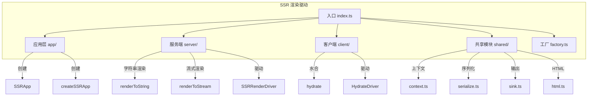

**图示来源**
- [index.ts](file://packages/runtime-ssr/src/index.ts)
- [app/](file://packages/runtime-ssr/src/app/)
- [server/](file://packages/runtime-ssr/src/server/)
- [client/](file://packages/runtime-ssr/src/client/)
- [shared/](file://packages/runtime-ssr/src/shared/)

**本节来源**
- [index.ts](file://packages/runtime-ssr/src/index.ts)

## 核心组件
SSR 渲染驱动的核心组件包括：SSR 应用实例、渲染驱动器、序列化器和上下文管理。这些组件协同工作，实现了从虚拟节点树到 HTML 字符串或流的转换过程。系统支持两种主要渲染模式：同步模式（等待所有异步任务完成后再输出）和流式模式（渐进式输出，遇到异步任务时阻塞等待）。

**本节来源**
- [index.ts](file://packages/runtime-ssr/src/index.ts)
- [createSSRApp.ts](file://packages/runtime-ssr/src/app/createSSRApp.ts)
- [SSRRenderDriver.ts](file://packages/runtime-ssr/src/server/drivers/SSRRenderDriver.ts)

## 架构概述
SSR 渲染驱动采用分层架构设计，各层职责分明，通过清晰的接口进行通信。系统核心是虚拟节点树的构建和渲染流程，结合特定的驱动器实现服务端和客户端的不同行为。

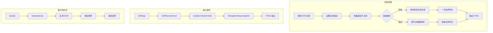

**图示来源**
- [renderToString.ts](file://packages/runtime-ssr/src/server/string/renderToString.ts)
- [renderToStream.ts](file://packages/runtime-ssr/src/server/stream/renderToStream.ts)
- [SSRRenderDriver.ts](file://packages/runtime-ssr/src/server/drivers/SSRRenderDriver.ts)
- [hydrate.ts](file://packages/runtime-ssr/src/client/hydrate.ts)

## 详细组件分析

### SSR 应用组件分析
SSR 应用组件负责创建和管理服务端渲染的应用实例，提供统一的 API 接口。

#### 类图
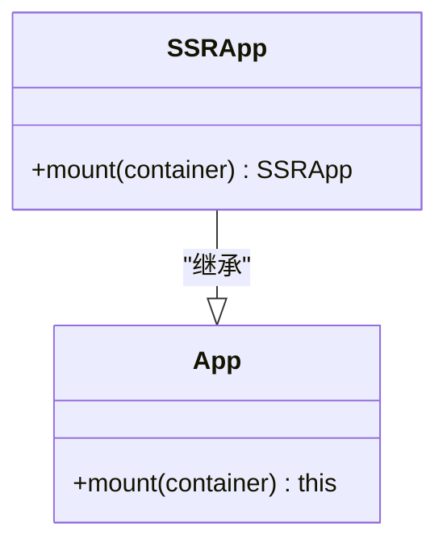

**图示来源**
- [SSRApp.ts](file://packages/runtime-ssr/src/app/SSRApp.ts)
- [createSSRApp.ts](file://packages/runtime-ssr/src/app/createSSRApp.ts)

#### 创建流程
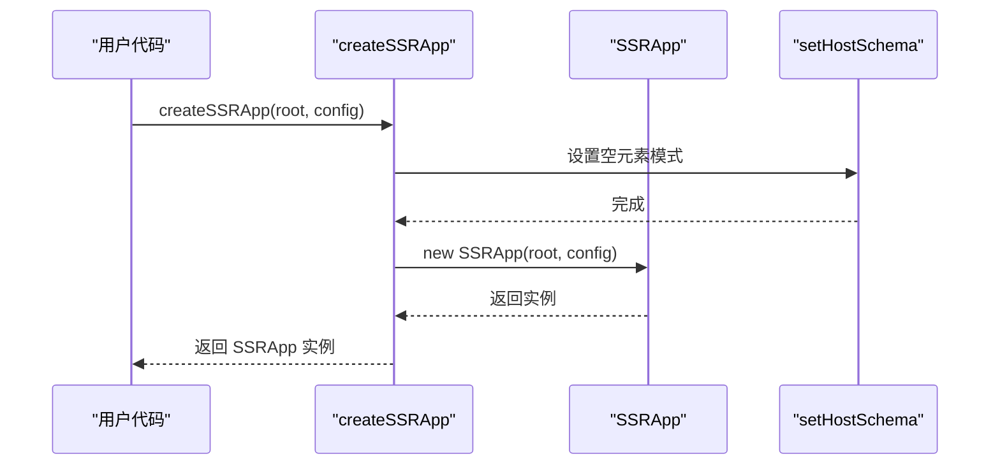

**图示来源**
- [createSSRApp.ts](file://packages/runtime-ssr/src/app/createSSRApp.ts)

**本节来源**
- [SSRApp.ts](file://packages/runtime-ssr/src/app/SSRApp.ts)
- [createSSRApp.ts](file://packages/runtime-ssr/src/app/createSSRApp.ts)

### 服务端渲染组件分析
服务端渲染组件实现了两种主要的渲染模式：同步字符串渲染和流式渲染，通过不同的驱动器和序列化策略来处理虚拟节点树。

#### 同步渲染流程
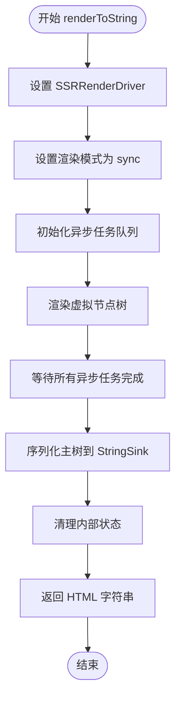

**图示来源**
- [renderToString.ts](file://packages/runtime-ssr/src/server/string/renderToString.ts)

#### 流式渲染流程
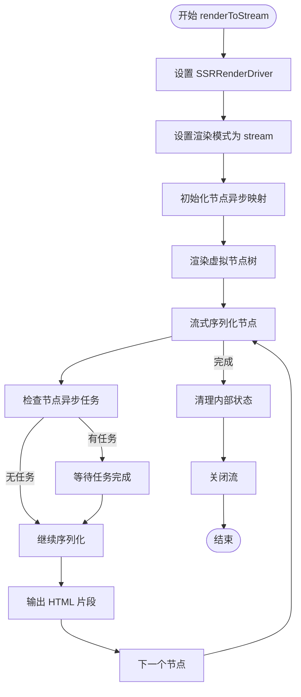

**图示来源**
- [renderToStream.ts](file://packages/runtime-ssr/src/server/stream/renderToStream.ts)

#### SSR 渲染驱动
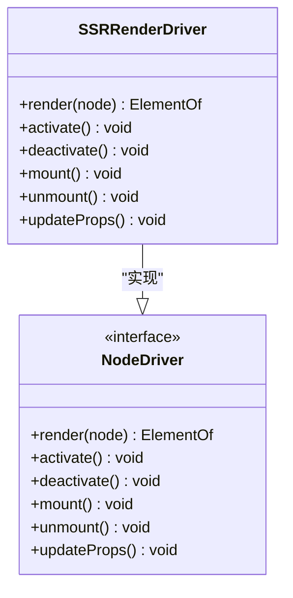

**图示来源**
- [SSRRenderDriver.ts](file://packages/runtime-ssr/src/server/drivers/SSRRenderDriver.ts)

**本节来源**
- [renderToString.ts](file://packages/runtime-ssr/src/server/string/renderToString.ts)
- [renderToStream.ts](file://packages/runtime-ssr/src/server/stream/renderToStream.ts)
- [SSRRenderDriver.ts](file://packages/runtime-ssr/src/server/drivers/SSRRenderDriver.ts)

### 客户端水合组件分析
客户端水合组件负责将服务端渲染的静态 HTML 与客户端应用进行绑定，恢复交互性和状态。

#### 水合流程
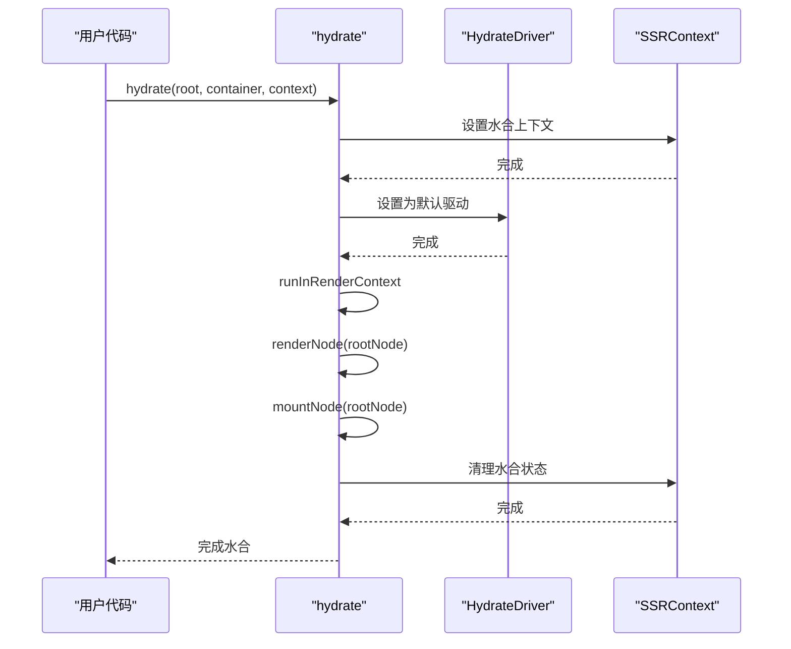

**图示来源**
- [hydrate.ts](file://packages/runtime-ssr/src/client/hydrate.ts)

#### 水合驱动器
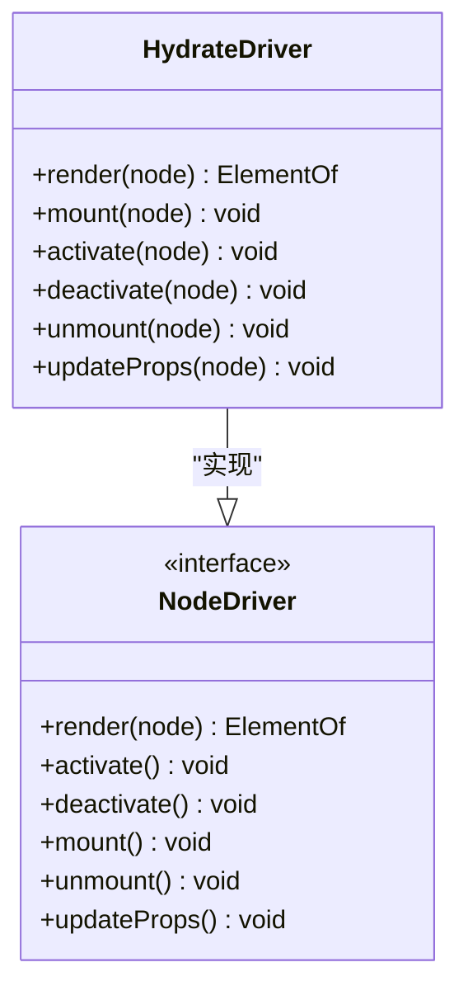

**图示来源**
- [HydrateDriver.ts](file://packages/runtime-ssr/src/client/drivers/HydrateDriver.ts)

**本节来源**
- [hydrate.ts](file://packages/runtime-ssr/src/client/hydrate.ts)
- [HydrateDriver.ts](file://packages/runtime-ssr/src/client/drivers/HydrateDriver.ts)

### 共享模块分析
共享模块提供了 SSR 渲染过程中所需的通用功能和数据结构，包括上下文管理、序列化和 HTML 处理。

#### 上下文管理
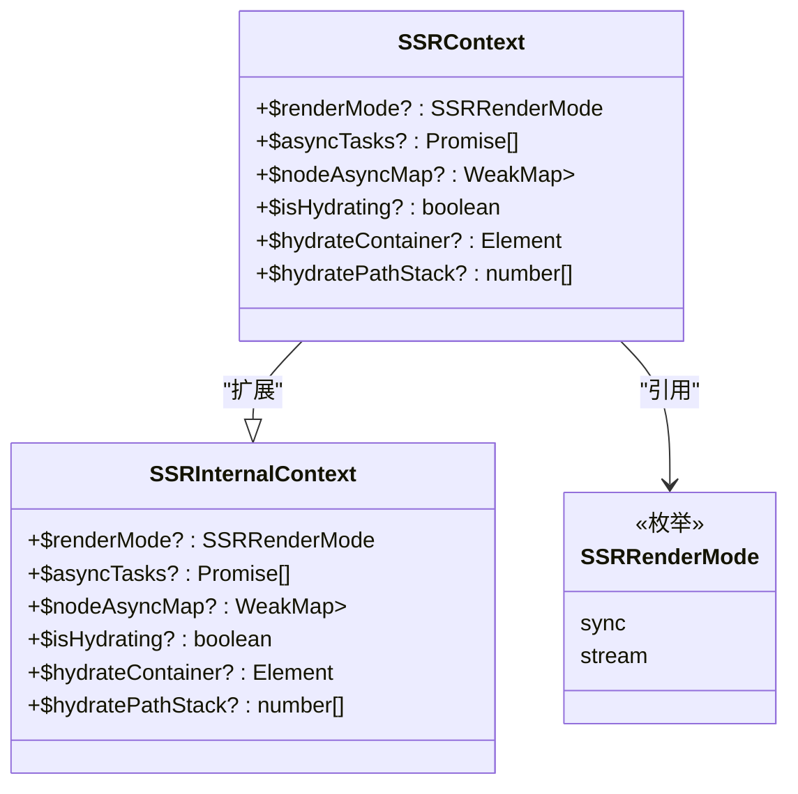

**图示来源**
- [context.ts](file://packages/runtime-ssr/src/shared/context.ts)

#### 序列化流程
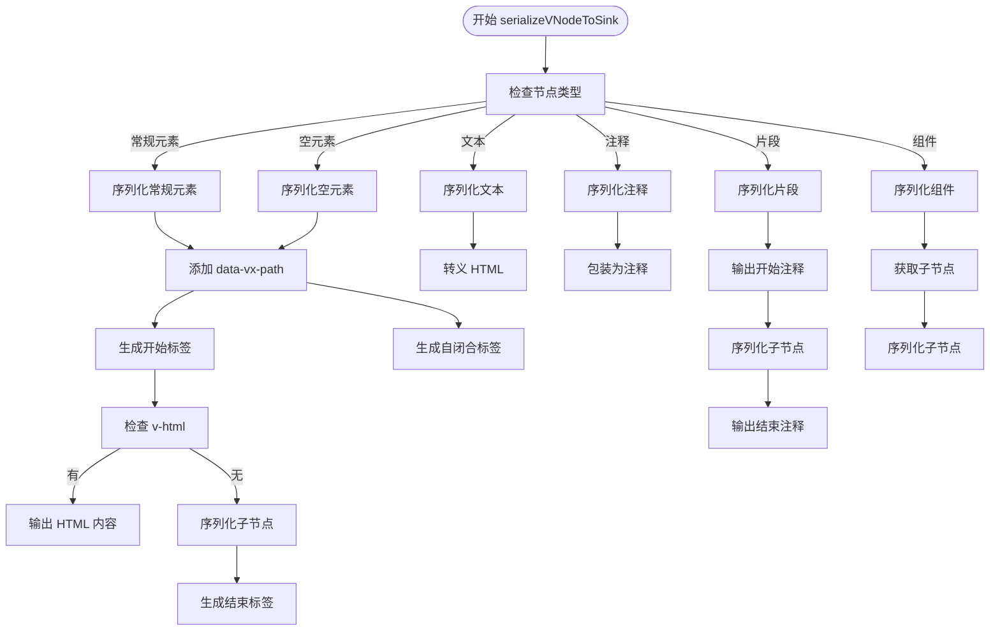

**图示来源**
- [serialize.ts](file://packages/runtime-ssr/src/shared/serialize.ts)
- [html.ts](file://packages/runtime-ssr/src/shared/html.ts)
- [sink.ts](file://packages/runtime-ssr/src/shared/sink.ts)

**本节来源**
- [context.ts](file://packages/runtime-ssr/src/shared/context.ts)
- [serialize.ts](file://packages/runtime-ssr/src/shared/serialize.ts)
- [sink.ts](file://packages/runtime-ssr/src/shared/sink.ts)
- [html.ts](file://packages/runtime-ssr/src/shared/html.ts)

## 依赖分析
SSR 渲染驱动与其他核心模块之间存在明确的依赖关系，通过接口和工厂模式实现解耦。

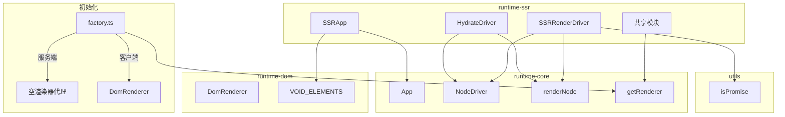

**图示来源**
- [factory.ts](file://packages/runtime-ssr/src/factory.ts)
- [api.ts](file://packages/runtime-core/src/renderer/api.ts)
- [driver.ts](file://packages/runtime-core/src/vnode/core/driver.ts)

**本节来源**
- [factory.ts](file://packages/runtime-ssr/src/factory.ts)
- [api.ts](file://packages/runtime-core/src/renderer/api.ts)
- [driver.ts](file://packages/runtime-core/src/vnode/core/driver.ts)

## 性能考虑
SSR 渲染驱动在设计时充分考虑了性能因素，提供了两种渲染模式以适应不同的应用场景。同步模式适合需要完整内容的场景，而流式模式可以实现渐进式加载，提高首屏渲染速度。系统通过异步任务队列和节点映射机制，有效管理异步组件的解析过程，避免阻塞主线程。此外，序列化过程采用缓冲区和流式输出，减少了内存占用和延迟。

## 故障排除指南
在使用 SSR 渲染驱动时，可能会遇到一些常见问题。以下是故障排除建议：

1. **渲染模式未设置**：确保在调用渲染函数前正确设置了渲染模式，否则可能导致行为异常。
2. **异步任务未完成**：在同步模式下，确保所有异步任务都已正确添加到任务队列中。
3. **水合失败**：检查服务端和客户端的虚拟节点树是否一致，路径栈是否正确匹配。
4. **事件绑定问题**：确认水合驱动正确绑定了事件处理程序，特别是在动态内容场景下。
5. **样式丢失**：检查 class 和 style 属性的序列化是否正确处理了对象和数组格式。

**本节来源**
- [context.ts](file://packages/runtime-ssr/src/shared/context.ts)
- [SSRRenderDriver.ts](file://packages/runtime-ssr/src/server/drivers/SSRRenderDriver.ts)
- [HydrateDriver.ts](file://packages/runtime-ssr/src/client/drivers/HydrateDriver.ts)

## 结论
Vitarx 的 SSR 渲染驱动提供了一套完整且高效的服务端渲染解决方案。通过模块化设计和清晰的架构分层，系统实现了同步和流式两种渲染模式的支持，满足了不同应用场景的需求。驱动器模式的设计使得服务端和客户端的行为可以灵活切换，而共享的虚拟节点树确保了渲染结果的一致性。水合机制有效地连接了服务端和客户端，实现了无缝的用户体验过渡。整体设计注重性能和可维护性，为构建高性能的 SSR 应用提供了坚实的基础。