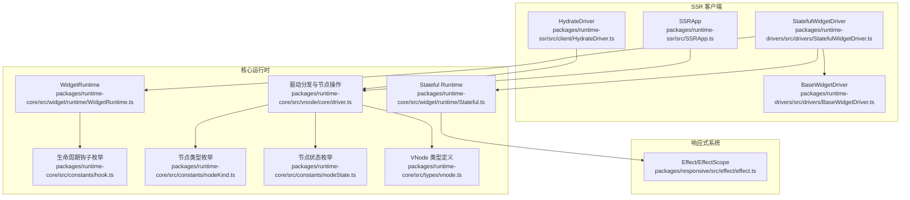
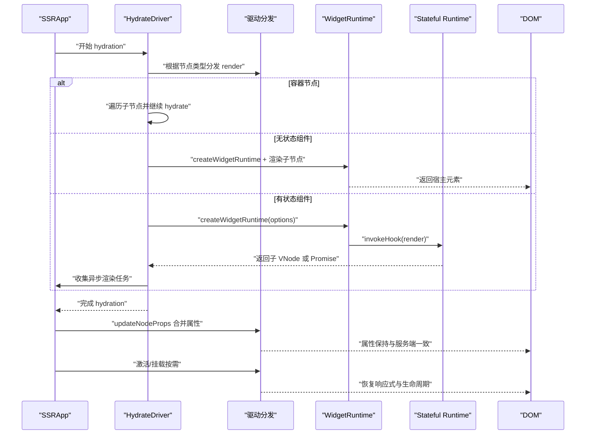
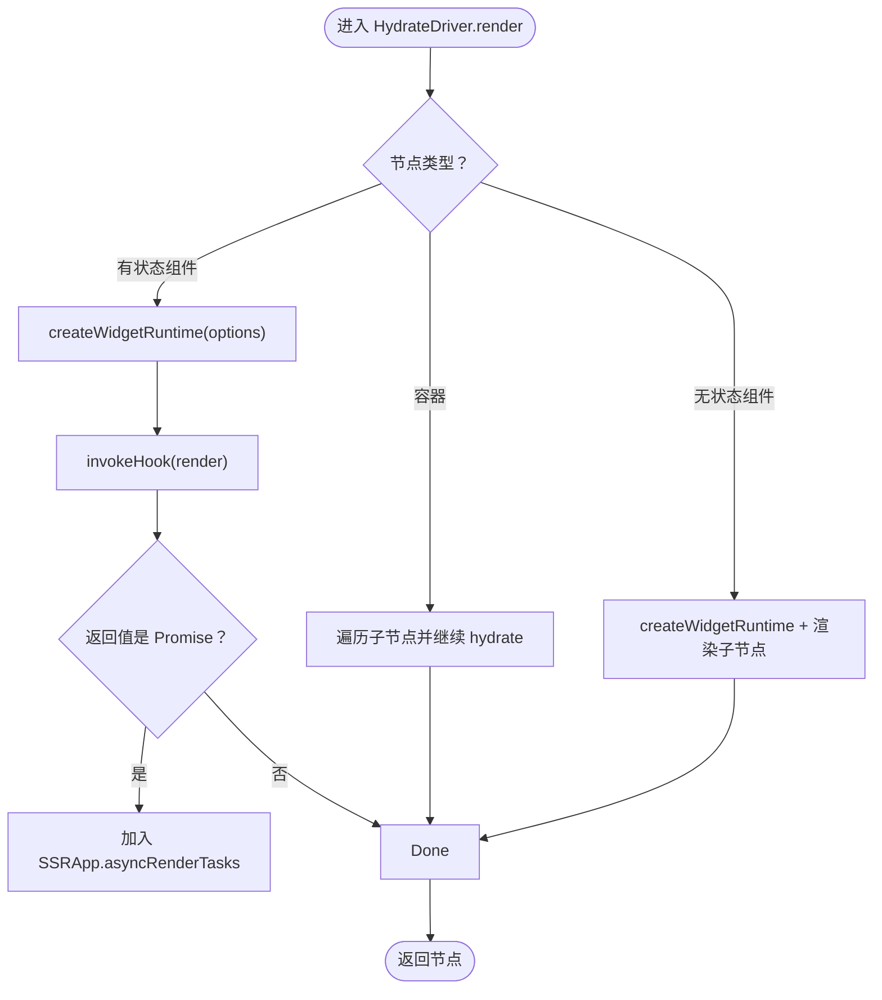
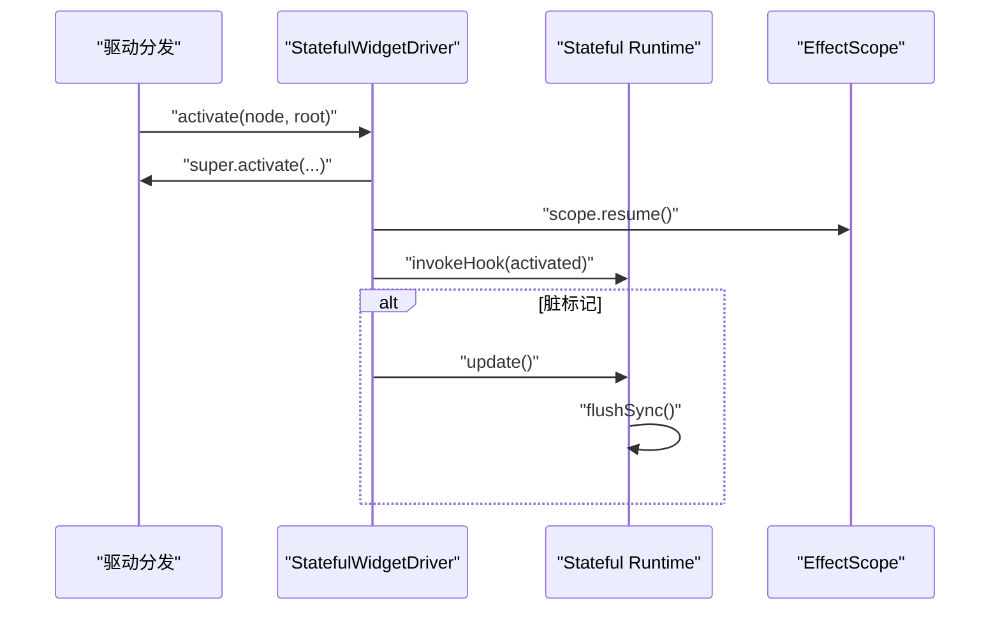
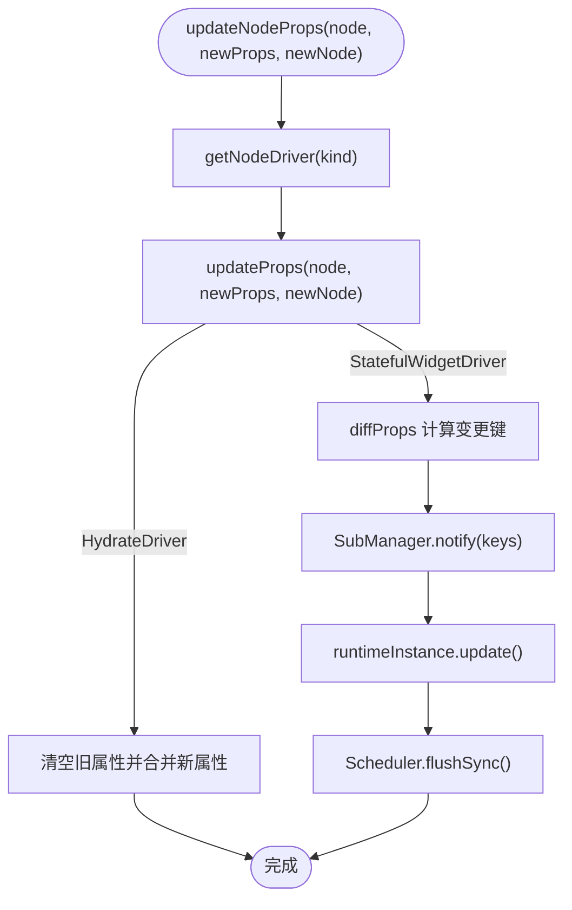
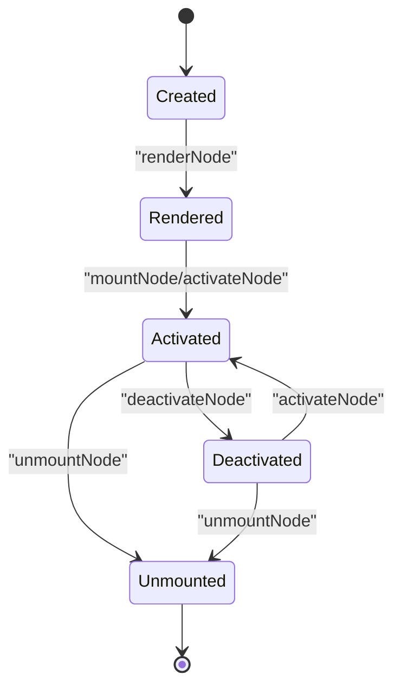
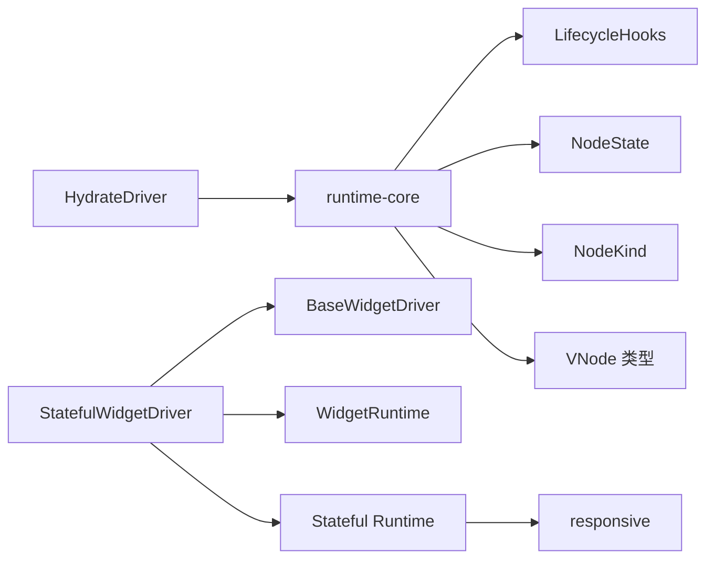

# 客户端激活

<cite>
**本文引用的文件列表**
- [HydrateDriver.ts](file://packages/runtime-ssr/src/client/HydrateDriver.ts)
- [driver.ts](file://packages/runtime-core/src/vnode/core/driver.ts)
- [WidgetRuntime.ts](file://packages/runtime-core/src/widget/runtime/WidgetRuntime.ts)
- [Stateful.ts](file://packages/runtime-core/src/widget/runtime/Stateful.ts)
- [StatefulWidgetDriver.ts](file://packages/runtime-drivers/src/drivers/StatefulWidgetDriver.ts)
- [BaseWidgetDriver.ts](file://packages/runtime-drivers/src/drivers/BaseWidgetDriver.ts)
- [vnode.ts](file://packages/runtime-core/src/types/vnode.ts)
- [nodeKind.ts](file://packages/runtime-core/src/constants/nodeKind.ts)
- [nodeState.ts](file://packages/runtime-core/src/constants/nodeState.ts)
- [hook.ts](file://packages/runtime-core/src/constants/hook.ts)
- [dev.ts](file://packages/runtime-core/src/utils/dev.ts)
- [SSRApp.ts](file://packages/runtime-ssr/src/SSRApp.ts)
- [factory.ts](file://packages/runtime-ssr/src/factory.ts)
- [effect.ts](file://packages/responsive/src/effect/effect.ts)
</cite>

## 目录
1. [引言](#引言)
2. [项目结构](#项目结构)
3. [核心组件](#核心组件)
4. [架构总览](#架构总览)
5. [详细组件分析](#详细组件分析)
6. [依赖关系分析](#依赖关系分析)
7. [性能考量](#性能考量)
8. [故障排查指南](#故障排查指南)
9. [结论](#结论)
10. [附录](#附录)

## 引言
本文件围绕“客户端激活（Hydration）”主题，系统阐述 HydrateDriver 在客户端如何接管服务端渲染（SSR）生成的 DOM 结构，重建组件运行时上下文而不重新创建 DOM 节点；重点说明有状态组件激活时如何恢复响应式系统与生命周期管理；解释 updateProps 方法在客户端如何更新虚拟节点属性以保持一致性；强调 mount、activate 等操作在 hydration 阶段的限制及其原因；提供 hydration 错误常见场景（如 HTML 不匹配）的排查指南；最后给出 hydration 完成后启用交互功能的最佳实践。

## 项目结构
本仓库采用多包结构，Hydration 相关能力集中在 runtime-ssr 与 runtime-drivers、runtime-core 等包中：
- runtime-ssr：提供 SSR 应用与 HydrateDriver 客户端激活驱动
- runtime-drivers：提供各类节点驱动器（含 StatefulWidgetDriver、BaseWidgetDriver）
- runtime-core：提供虚拟节点、驱动分发、生命周期钩子、运行时上下文等基础设施
- responsive：提供响应式系统（EffectScope、Scheduler 等）

图表来源
- [HydrateDriver.ts](file://packages/runtime-ssr/src/client/HydrateDriver.ts#L1-L78)
- [driver.ts](file://packages/runtime-core/src/vnode/core/driver.ts#L1-L143)
- [WidgetRuntime.ts](file://packages/runtime-core/src/widget/runtime/WidgetRuntime.ts#L1-L123)
- [Stateful.ts](file://packages/runtime-core/src/widget/runtime/Stateful.ts#L1-L368)
- [StatefulWidgetDriver.ts](file://packages/runtime-drivers/src/drivers/StatefulWidgetDriver.ts#L1-L121)
- [BaseWidgetDriver.ts](file://packages/runtime-drivers/src/drivers/BaseWidgetDriver.ts#L1-L128)
- [SSRApp.ts](file://packages/runtime-ssr/src/SSRApp.ts#L1-L8)
- [effect.ts](file://packages/responsive/src/effect/effect.ts#L1-L261)

章节来源
- [HydrateDriver.ts](file://packages/runtime-ssr/src/client/HydrateDriver.ts#L1-L78)
- [driver.ts](file://packages/runtime-core/src/vnode/core/driver.ts#L1-L143)
- [SSRApp.ts](file://packages/runtime-ssr/src/SSRApp.ts#L1-L8)

## 核心组件
- HydrateDriver：SSR 客户端激活驱动，负责在客户端“接管”服务端渲染的 DOM，重建组件运行时上下文，不重新创建 DOM 节点；同时提供 updateProps 以合并属性，保证与服务端一致。
- StatefulWidgetDriver/BaseWidgetDriver：通用 Widget 驱动，封装渲染、挂载、激活、停用、卸载等生命周期；StatefulWidgetDriver 侧重有状态组件的响应式与生命周期管理。
- WidgetRuntime/Stateful Runtime：组件运行时上下文与生命周期管理，负责在渲染、更新、错误处理、依赖订阅等环节工作。
- 驱动分发与节点操作：getNodeDriver/renderNode/mountNode/activateNode/deactivateNode/unmountNode/updateNodeProps 等统一分发到具体 NodeDriver 实现。

章节来源
- [HydrateDriver.ts](file://packages/runtime-ssr/src/client/HydrateDriver.ts#L1-L78)
- [StatefulWidgetDriver.ts](file://packages/runtime-drivers/src/drivers/StatefulWidgetDriver.ts#L1-L121)
- [BaseWidgetDriver.ts](file://packages/runtime-drivers/src/drivers/BaseWidgetDriver.ts#L1-L128)
- [WidgetRuntime.ts](file://packages/runtime-core/src/widget/runtime/WidgetRuntime.ts#L1-L123)
- [Stateful.ts](file://packages/runtime-core/src/widget/runtime/Stateful.ts#L1-L368)
- [driver.ts](file://packages/runtime-core/src/vnode/core/driver.ts#L1-L143)

## 架构总览
Hydration 的总体流程如下：
- 服务端渲染生成 HTML，客户端加载后由 HydrateDriver 接管
- HydrateDriver 根据节点类型选择策略：
  - 容器节点：遍历子节点并继续 hydrate
  - 无状态组件：创建运行时并渲染其子节点
  - 有状态组件：创建运行时并调用 render 生命周期钩子，同时禁用自动更新与生命周期钩子，仅收集异步渲染任务
- 客户端随后通过 updateProps 合并属性，使虚拟节点与 DOM 保持一致
- 交互启用：在 hydration 完成后，按需调用 activateNode 与驱动的 mount/activate，恢复响应式系统与生命周期

图表来源
- [HydrateDriver.ts](file://packages/runtime-ssr/src/client/HydrateDriver.ts#L35-L76)
- [driver.ts](file://packages/runtime-core/src/vnode/core/driver.ts#L60-L143)
- [WidgetRuntime.ts](file://packages/runtime-core/src/widget/runtime/WidgetRuntime.ts#L1-L123)
- [Stateful.ts](file://packages/runtime-core/src/widget/runtime/Stateful.ts#L164-L214)
- [SSRApp.ts](file://packages/runtime-ssr/src/SSRApp.ts#L1-L8)

## 详细组件分析

### HydrateDriver：客户端接管与属性合并
- 限制：在 hydration 阶段禁止 mount/activate/deactivate/unmount，防止破坏已存在的 DOM 结构与状态
- render：
  - 容器节点：递归渲染子节点
  - 无状态组件：创建运行时并渲染其子节点
  - 有状态组件：创建运行时并调用 render 生命周期钩子；通过 options 禁用自动更新、调度与生命周期钩子，仅收集异步渲染任务（Promise）以便 SSRApp 统一处理
- updateProps：清空旧属性并合并新属性，确保虚拟节点 props 与 DOM 一致

图表来源
- [HydrateDriver.ts](file://packages/runtime-ssr/src/client/HydrateDriver.ts#L35-L76)

章节来源
- [HydrateDriver.ts](file://packages/runtime-ssr/src/client/HydrateDriver.ts#L1-L78)

### 有状态组件激活：恢复响应式系统与生命周期
- 运行时上下文：Stateful Runtime 在创建时建立 EffectScope，代理组件 props，支持依赖订阅与错误处理
- 激活流程：
  - activateNode -> StatefulWidgetDriver.activate -> 恢复 EffectScope（resume）-> 触发生命周期 activated
  - 若存在脏标记（dirty），立即触发 update 并同步刷新（flushSync）
- 生命周期钩子：通过 invokeHook 统一调用，错误通过 reportError 冒泡至父组件或应用级处理器

图表来源
- [StatefulWidgetDriver.ts](file://packages/runtime-drivers/src/drivers/StatefulWidgetDriver.ts#L86-L95)
- [Stateful.ts](file://packages/runtime-core/src/widget/runtime/Stateful.ts#L164-L214)
- [effect.ts](file://packages/responsive/src/effect/effect.ts#L1-L261)

章节来源
- [StatefulWidgetDriver.ts](file://packages/runtime-drivers/src/drivers/StatefulWidgetDriver.ts#L1-L121)
- [Stateful.ts](file://packages/runtime-core/src/widget/runtime/Stateful.ts#L1-L368)
- [effect.ts](file://packages/responsive/src/effect/effect.ts#L1-L261)

### updateProps：在客户端合并属性
- 通用路径：updateNodeProps -> getNodeDriver(node.kind).updateProps
- HydrateDriver.updateProps：清空旧属性并合并新属性，确保虚拟节点 props 与 DOM 一致
- StatefulWidgetDriver.updateProps：基于 diffProps 计算变更键，通知 SubManager 并触发 update，随后同步刷新

图表来源
- [driver.ts](file://packages/runtime-core/src/vnode/core/driver.ts#L131-L143)
- [HydrateDriver.ts](file://packages/runtime-ssr/src/client/HydrateDriver.ts#L66-L76)
- [StatefulWidgetDriver.ts](file://packages/runtime-drivers/src/drivers/StatefulWidgetDriver.ts#L45-L55)

章节来源
- [driver.ts](file://packages/runtime-core/src/vnode/core/driver.ts#L131-L143)
- [HydrateDriver.ts](file://packages/runtime-ssr/src/client/HydrateDriver.ts#L66-L76)
- [StatefulWidgetDriver.ts](file://packages/runtime-drivers/src/drivers/StatefulWidgetDriver.ts#L1-L121)

### 节点驱动与状态机
- 节点状态：Created -> Rendered -> Activated -> Deactivated -> Unmounted
- 驱动分发：getNodeDriver -> renderNode/mountNode/activateNode/deactivateNode/unmountNode/updateNodeProps
- 限制：hydration 阶段禁止 mount/activate/deactivate/unmount，避免破坏已存在的 DOM 与状态

图表来源
- [nodeState.ts](file://packages/runtime-core/src/constants/nodeState.ts#L1-L19)
- [driver.ts](file://packages/runtime-core/src/vnode/core/driver.ts#L60-L143)

章节来源
- [nodeState.ts](file://packages/runtime-core/src/constants/nodeState.ts#L1-L19)
- [driver.ts](file://packages/runtime-core/src/vnode/core/driver.ts#L1-L143)

## 依赖关系分析
- HydrateDriver 依赖：
  - runtime-core：createWidgetRuntime、renderNode、LifecycleHooks、is*Node 工具、SSRApp
  - utils：isPromise
- StatefulWidgetDriver 依赖：
  - responsive：Scheduler、SubManager
  - runtime-core：createWidgetRuntime、LifecycleHooks、NodeState、renderNode、createCommentVNode
  - BaseWidgetDriver：继承与复用通用生命周期
- Stateful Runtime 依赖：
  - responsive：EffectScope、Scheduler、Subscriber
  - runtime-core：LifecycleHooks、NodeState、findParentNode、linkParentNode、proxyWidgetProps
- 驱动分发：
  - getNodeDriver/registerDriver：按 NodeKind 分发到具体 NodeDriver
  - renderNode/mountNode/activateNode/deactivateNode/unmountNode/updateNodeProps：统一路由到 NodeDriver

图表来源
- [HydrateDriver.ts](file://packages/runtime-ssr/src/client/HydrateDriver.ts#L1-L78)
- [StatefulWidgetDriver.ts](file://packages/runtime-drivers/src/drivers/StatefulWidgetDriver.ts#L1-L121)
- [BaseWidgetDriver.ts](file://packages/runtime-drivers/src/drivers/BaseWidgetDriver.ts#L1-L128)
- [WidgetRuntime.ts](file://packages/runtime-core/src/widget/runtime/WidgetRuntime.ts#L1-L123)
- [Stateful.ts](file://packages/runtime-core/src/widget/runtime/Stateful.ts#L1-L368)
- [driver.ts](file://packages/runtime-core/src/vnode/core/driver.ts#L1-L143)

章节来源
- [HydrateDriver.ts](file://packages/runtime-ssr/src/client/HydrateDriver.ts#L1-L78)
- [StatefulWidgetDriver.ts](file://packages/runtime-drivers/src/drivers/StatefulWidgetDriver.ts#L1-L121)
- [driver.ts](file://packages/runtime-core/src/vnode/core/driver.ts#L1-L143)

## 性能考量
- hydration 阶段禁用自动更新与调度，减少不必要的渲染与副作用开销
- 有状态组件激活时，若存在脏标记，立即同步刷新，避免后续多次调度
- updateProps 采用“清空+合并”的方式，降低属性比较复杂度
- SSRApp 收集异步渲染任务，统一处理，避免主线程阻塞

章节来源
- [HydrateDriver.ts](file://packages/runtime-ssr/src/client/HydrateDriver.ts#L44-L57)
- [StatefulWidgetDriver.ts](file://packages/runtime-drivers/src/drivers/StatefulWidgetDriver.ts#L86-L95)
- [driver.ts](file://packages/runtime-core/src/vnode/core/driver.ts#L131-L143)

## 故障排查指南
- 常见错误场景
  - HTML 不匹配：服务端与客户端渲染结果不一致导致 hydration 失败
  - 挂载/激活/停用/卸载在 hydration 阶段被禁止：违反状态机约束
  - 属性不一致：updateProps 合并后仍与 DOM 不一致
- 开发模式警告
  - __DEV__ 控制：在开发模式下输出调试信息与警告
  - 节点开发信息：getNodeDevInfo/popNodeDevInfo/setNodeDevInfo 辅助定位源码位置
- 定位差异节点
  - 使用 __DEV__ 输出的调试信息与节点源码位置信息，快速定位差异
  - 对比服务端与客户端的渲染结果，检查条件渲染、动态内容、随机数等
- 优化一致性
  - 服务端与客户端渲染逻辑保持一致，避免依赖浏览器特有 API
  - 使用稳定的 key 与结构，减少条件渲染差异
  - 在有状态组件中，确保 props 与状态初始化一致

章节来源
- [dev.ts](file://packages/runtime-core/src/utils/dev.ts#L1-L37)
- [nodeKind.ts](file://packages/runtime-core/src/constants/nodeKind.ts#L1-L26)
- [nodeState.ts](file://packages/runtime-core/src/constants/nodeState.ts#L1-L19)
- [driver.ts](file://packages/runtime-core/src/vnode/core/driver.ts#L120-L129)

## 结论
HydrateDriver 在客户端激活阶段的核心目标是“接管 DOM、重建运行时上下文、保持一致性”。通过禁用 mount/activate/deactivate/unmount，避免破坏已存在的 DOM；通过 createWidgetRuntime 与 invokeHook 恢复有状态组件的响应式系统与生命周期；通过 updateProps 合并属性，确保虚拟节点与 DOM 一致。在 hydration 完成后，再按需激活与挂载，即可启用完整交互功能。

## 附录
- 术语
  - VNode：虚拟节点，承载组件/元素/文本/注释等节点信息
  - NodeDriver：节点驱动器，封装节点的渲染、挂载、激活、停用、卸载、属性更新等操作
  - WidgetRuntime：组件运行时上下文，负责生命周期、依赖订阅与错误处理
  - SSRApp：SSR 应用，收集异步渲染任务并在客户端完成 hydration