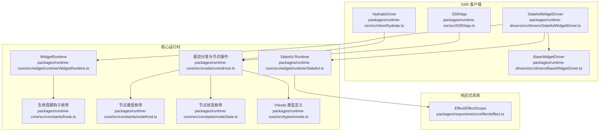
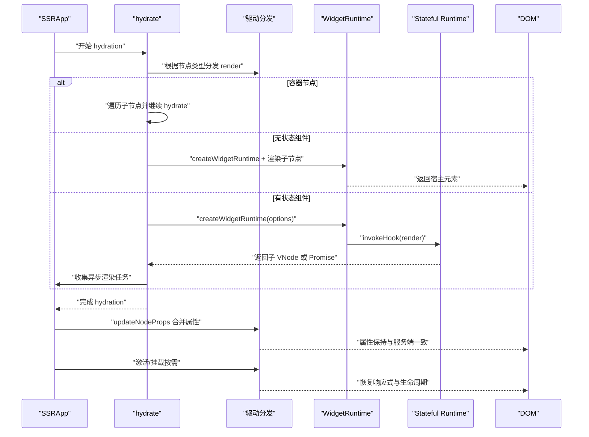
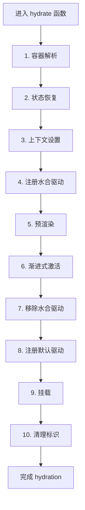
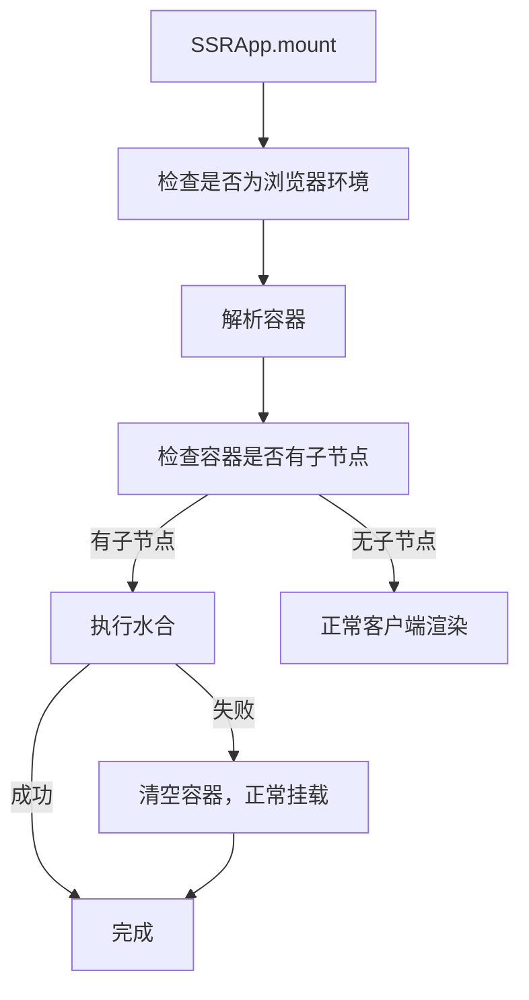
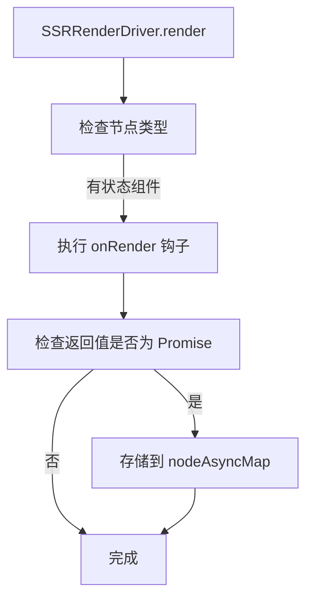
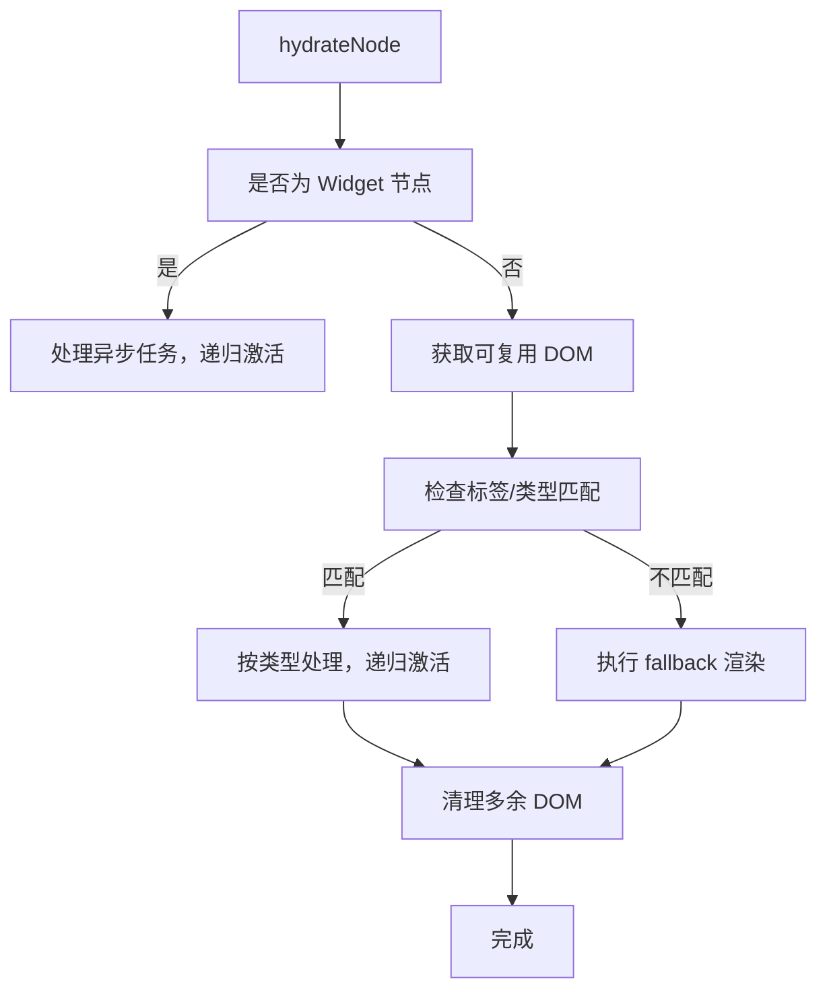
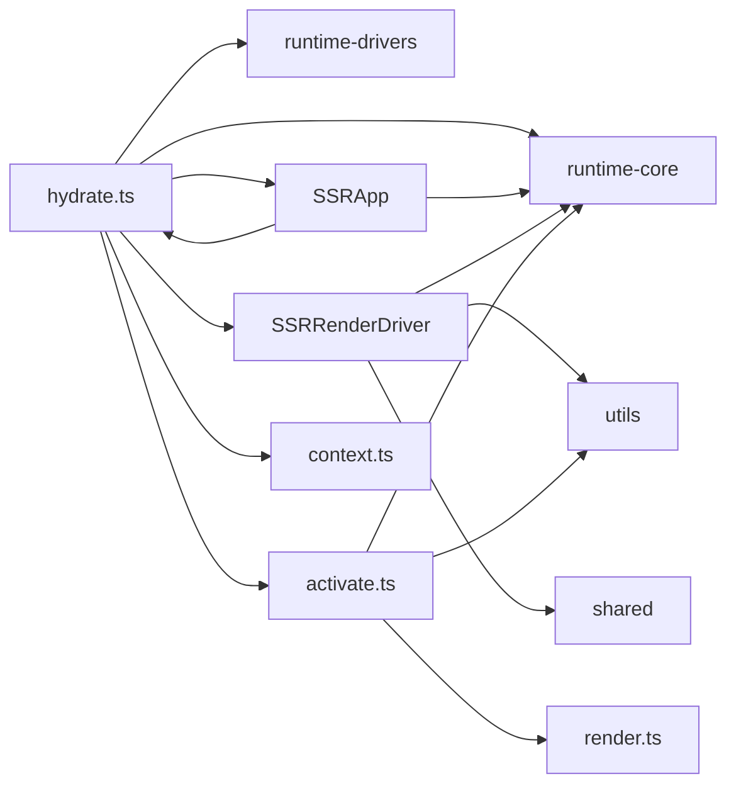

# 客户端激活

<cite>
**本文引用的文件列表**
- [hydrate.ts](file://packages/runtime-ssr/src/client/hydrate.ts)
- [activate.ts](file://packages/runtime-ssr/src/client/activate.ts)
- [SSRRenderDriver.ts](file://packages/runtime-ssr/src/server/SSRRenderDriver.ts)
- [SSRApp.ts](file://packages/runtime-ssr/src/app/SSRApp.ts)
- [utils.ts](file://packages/runtime-ssr/src/client/utils.ts)
- [context.ts](file://packages/runtime-ssr/src/shared/context.ts)
</cite>

## 更新摘要
**变更内容**
- 新增十步水合流程的详细说明
- 更新SSRApp的fallback机制描述
- 添加nodeAsyncMap异步任务处理机制
- 增加cleanupExtraDom清理机制说明
- 更新架构总览和详细组件分析部分

## 目录
1. [引言](#引言)
2. [项目结构](#项目结构)
3. [核心组件](#核心组件)
4. [架构总览](#架构总览)
5. [详细组件分析](#详细组件分析)
6. [依赖关系分析](#依赖关系分析)
7. [性能考量](#性能考量)
8. [故障排查指南](#故障排查指南)
9. [结论](#结论)
10. [附录](#附录)

## 引言
本文围绕"客户端激活（Hydration）"主题，系统阐述HydrateDriver在客户端如何接管服务端渲染（SSR）生成的DOM结构，重建组件运行时上下文而不重新创建DOM节点；重点说明有状态组件激活时如何恢复响应式系统与生命周期管理；解释updateProps方法在客户端如何更新虚拟节点属性以保持一致性；强调mount、activate等操作在hydration阶段的限制及其原因；提供hydration错误常见场景（如HTML不匹配）的排查指南；最后给出hydration完成后启用交互功能的最佳实践。

## 项目结构
本仓库采用多包结构，Hydration相关能力集中在runtime-ssr与runtime-drivers、runtime-core等包中：
- runtime-ssr：提供SSR应用与HydrateDriver客户端激活驱动
- runtime-drivers：提供各类节点驱动器（含StatefulWidgetDriver、BaseWidgetDriver）
- runtime-core：提供虚拟节点、驱动分发、生命周期钩子、运行时上下文等基础设施
- responsive：提供响应式系统（EffectScope、Scheduler等）

图表来源
- [hydrate.ts](file://packages/runtime-ssr/src/client/hydrate.ts#L1-L97)
- [activate.ts](file://packages/runtime-ssr/src/client/activate.ts#L37-L154)
- [SSRRenderDriver.ts](file://packages/runtime-ssr/src/server/SSRRenderDriver.ts#L37-L93)
- [SSRApp.ts](file://packages/runtime-ssr/src/app/SSRApp.ts#L40-L83)

章节来源
- [hydrate.ts](file://packages/runtime-ssr/src/client/hydrate.ts#L1-L97)
- [SSRApp.ts](file://packages/runtime-ssr/src/app/SSRApp.ts#L40-L83)

## 核心组件
- HydrateDriver：SSR客户端激活驱动，负责在客户端"接管"服务端渲染的DOM，重建组件运行时上下文，不重新创建DOM节点；同时提供updateProps以合并属性，保证与服务端一致。
- StatefulWidgetDriver/BaseWidgetDriver：通用Widget驱动，封装渲染、挂载、激活、停用、卸载等生命周期；StatefulWidgetDriver侧重有状态组件的响应式与生命周期管理。
- WidgetRuntime/Stateful Runtime：组件运行时上下文与生命周期管理，负责在渲染、更新、错误处理、依赖订阅等环节工作。
- 驱动分发与节点操作：getNodeDriver/renderNode/mountNode/activateNode/deactivateNode/unmountNode/updateNodeProps等统一分发到具体NodeDriver实现。

章节来源
- [hydrate.ts](file://packages/runtime-ssr/src/client/hydrate.ts#L1-L97)
- [activate.ts](file://packages/runtime-ssr/src/client/activate.ts#L37-L154)
- [SSRRenderDriver.ts](file://packages/runtime-ssr/src/server/SSRRenderDriver.ts#L37-L93)
- [SSRApp.ts](file://packages/runtime-ssr/src/app/SSRApp.ts#L40-L83)

## 架构总览
Hydration的总体流程如下：
- 服务端渲染生成HTML，客户端加载后由hydrate函数接管
- hydrate函数执行十步完整流程：
  1. 容器解析 - 解析container为DOM元素
  2. 状态恢复 - 合并window.__INITIAL_STATE__到context
  3. 上下文设置 - 设置context.$isHydrating = true, $nodeAsyncMap
  4. 注册水合驱动 - setDefaultDriver(new SSRRenderDriver())
  5. 预渲染 - 在runInRenderContext中调用renderNode(rootNode)
  6. 渐进式激活 - 逐节点激活，遇到异步节点时等待完成后继续
  7. 移除水合驱动 - setDefaultDriver(null)
  8. 注册默认驱动 - registerDefaultDrivers()
  9. 挂载 - mountNode(rootNode, container)
  10. 清理标识 - 清除$isHydrating, $nodeAsyncMap
- 客户端随后通过updateProps合并属性，使虚拟节点与DOM保持一致
- 交互启用：在hydration完成后，按需调用activateNode与驱动的mount/activate，恢复响应式系统与生命周期

图表来源
- [hydrate.ts](file://packages/runtime-ssr/src/client/hydrate.ts#L44-L96)
- [SSRRenderDriver.ts](file://packages/runtime-ssr/src/server/SSRRenderDriver.ts#L37-L93)
- [SSRApp.ts](file://packages/runtime-ssr/src/app/SSRApp.ts#L52-L82)

## 详细组件分析

### hydrate函数：十步水合流程
- **完整执行流程**：
  1. **容器解析** - 解析container为DOM元素
  2. **状态恢复** - 合并window.__INITIAL_STATE__到context
  3. **上下文设置** - 设置context.$isHydrating = true, $nodeAsyncMap
  4. **注册水合驱动** - setDefaultDriver(new SSRRenderDriver())
  5. **预渲染** - 在runInRenderContext中调用renderNode(rootNode)
  6. **渐进式激活** - 逐节点激活，遇到异步节点时等待完成后继续
  7. **移除水合驱动** - setDefaultDriver(null)
  8. **注册默认驱动** - registerDefaultDrivers()
  9. **挂载** - mountNode(rootNode, container)
  10. **清理标识** - 清除$isHydrating, $nodeAsyncMap

**Section sources**
- [hydrate.ts](file://packages/runtime-ssr/src/client/hydrate.ts#L44-L96)

### SSRApp：fallback机制
- **挂载流程**：
  - 服务端不执行挂载
  - 解析容器
  - 检测是否需要水合：如果容器子节点长度大于0，则执行水合
  - 执行水合：hydrate(this, containerEl, context)
  - 水合失败处理：捕获错误，清空容器，尝试正常挂载
  - 无SSR内容：执行正常客户端渲染

**Section sources**
- [SSRApp.ts](file://packages/runtime-ssr/src/app/SSRApp.ts#L52-L82)

### SSRRenderDriver：异步任务处理
- **核心特性**：
  - 支持两种渲染模式：同步渲染、流式阻塞渲染
  - 异步组件解析逻辑统一在onRender钩子中处理
  - 通过invokeHook(render)收集返回的Promise
- **限制**：
  - 不支持激活/停用节点操作
  - 不支持挂载/卸载节点操作
  - 不支持属性更新操作
- **异步任务处理**：
  - 在render方法中，对于有状态组件，执行onRender钩子
  - 如果返回Promise，则将其绑定到nodeAsyncMap
  - 在hydration阶段，通过nodeAsyncMap等待异步任务完成

**Section sources**
- [SSRRenderDriver.ts](file://packages/runtime-ssr/src/server/SSRRenderDriver.ts#L37-L93)

### hydrateNode：节点激活与清理
- **节点激活流程**：
  - Widget节点：检查nodeAsyncMap中的异步任务，等待完成后递归激活子节点
  - 非Widget节点：获取可复用DOM，检查标签/类型匹配
  - 匹配成功：按类型处理，设置el，更新属性，递归激活子节点
  - 不匹配：执行fallback渲染替换
- **清理机制**：
  - cleanupExtraDom：清除常规元素节点中多余的真实DOM
  - cleanupFragmentRange：清除Fragment区间内多余的真实DOM
  - 在激活完成后，清理多余节点，保持DOM结构一致性

**Section sources**
- [activate.ts](file://packages/runtime-ssr/src/client/activate.ts#L37-L154)
- [utils.ts](file://packages/runtime-ssr/src/client/utils.ts#L163-L184)

## 依赖关系分析
- hydrate函数依赖：
  - runtime-core：mountNode、renderNode、runInRenderContext、setDefaultDriver
  - runtime-drivers：registerDefaultDrivers
  - SSRApp：SSR应用实例
  - SSRRenderDriver：水合驱动
  - activate：hydrateNode函数
  - context：SSR上下文对象
- SSRApp依赖：
  - runtime-core：App基类
  - hydrate：客户端水合函数
  - __IS_BROWSER__：环境判断
- SSRRenderDriver依赖：
  - runtime-core：createWidgetRuntime、LifecycleHooks、NodeDriver接口
  - utils：isPromise
  - shared：useSSRContext
- activate模块依赖：
  - runtime-core：各种节点类型和工具函数
  - utils：appendChild、insertBefore、replaceChild等DOM操作
  - render：normalRender函数

图表来源
- [hydrate.ts](file://packages/runtime-ssr/src/client/hydrate.ts#L1-L97)
- [SSRApp.ts](file://packages/runtime-ssr/src/app/SSRApp.ts#L40-L83)
- [SSRRenderDriver.ts](file://packages/runtime-ssr/src/server/SSRRenderDriver.ts#L37-L93)
- [activate.ts](file://packages/runtime-ssr/src/client/activate.ts#L37-L154)

## 性能考量
- hydration阶段禁用自动更新与调度，减少不必要的渲染与副作用开销
- 有状态组件激活时，若存在脏标记，立即同步刷新，避免后续多次调度
- updateProps采用"清空+合并"的方式，降低属性比较复杂度
- SSRApp收集异步渲染任务，统一处理，避免主线程阻塞
- 使用WeakMap存储nodeAsyncMap，避免内存泄漏
- 渐进式激活机制，避免一次性处理所有节点带来的性能瓶颈
- cleanupExtraDom清理机制，减少不必要的DOM节点，优化内存使用

章节来源
- [hydrate.ts](file://packages/runtime-ssr/src/client/hydrate.ts#L65-L88)
- [SSRRenderDriver.ts](file://packages/runtime-ssr/src/server/SSRRenderDriver.ts#L64-L71)
- [activate.ts](file://packages/runtime-ssr/src/client/activate.ts#L113-L114)

## 故障排查指南
- **常见错误场景**
  - HTML不匹配：服务端与客户端渲染结果不一致导致hydration失败
  - 挂载/激活/停用/卸载在hydration阶段被禁止：违反状态机约束
  - 属性不一致：updateProps合并后仍与DOM不一致
  - 异步组件处理不当：nodeAsyncMap未正确处理Promise
  - 多余DOM节点：未正确清理多余的真实DOM
- **开发模式警告**
  - __DEV__控制：在开发模式下输出调试信息与警告
  - 节点开发信息：getNodeDevInfo/popNodeDevInfo/setNodeDevInfo辅助定位源码位置
- **定位差异节点**
  - 使用__DEV__输出的调试信息与节点源码位置信息，快速定位差异
  - 对比服务端与客户端的渲染结果，检查条件渲染、动态内容、随机数等
  - 检查hydrateNode中的warn日志，定位不匹配的元素
- **优化一致性**
  - 服务端与客户端渲染逻辑保持一致，避免依赖浏览器特有API
  - 使用稳定的key与结构，减少条件渲染差异
  - 在有状态组件中，确保props与状态初始化一致
  - 正确处理异步组件，确保nodeAsyncMap正确收集和等待Promise

章节来源
- [hydrate.ts](file://packages/runtime-ssr/src/client/hydrate.ts#L67-L88)
- [activate.ts](file://packages/runtime-ssr/src/client/activate.ts#L66-L83)
- [SSRApp.ts](file://packages/runtime-ssr/src/app/SSRApp.ts#L70-L72)

## 结论
hydrate函数在客户端激活阶段的核心目标是"接管DOM、重建运行时上下文、保持一致性"。通过十步完整流程，包括容器解析、状态恢复、上下文设置、注册水合驱动、预渲染、渐进式激活、移除水合驱动、注册默认驱动、挂载和清理标识，确保hydration过程的正确性和完整性。SSRApp的fallback机制提供了水合失败后的优雅降级方案。SSRRenderDriver统一处理异步任务，nodeAsyncMap机制确保异步组件正确处理。cleanupExtraDom清理机制保持DOM结构一致性。通过禁用mount/activate/deactivate/unmount，避免破坏已存在的DOM；通过createWidgetRuntime与invokeHook恢复有状态组件的响应式系统与生命周期；通过updateProps合并属性，确保虚拟节点与DOM一致。在hydration完成后，再按需激活与挂载，即可启用完整交互功能。

## 附录
- **术语**
  - VNode：虚拟节点，承载组件/元素/文本/注释等节点信息
  - NodeDriver：节点驱动器，封装节点的渲染、挂载、激活、停用、卸载、属性更新等操作
  - WidgetRuntime：组件运行时上下文，负责生命周期、依赖订阅与错误处理
  - SSRApp：SSR应用，收集异步渲染任务并在客户端完成hydration
  - nodeAsyncMap：WeakMap，存储节点与异步任务的映射关系
  - cleanupExtraDom：清理多余DOM节点的函数
  - hydrateNode：逐节点激活的函数
  - SSRRenderDriver：服务端渲染和客户端水合的驱动器实现