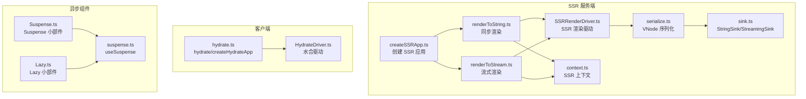
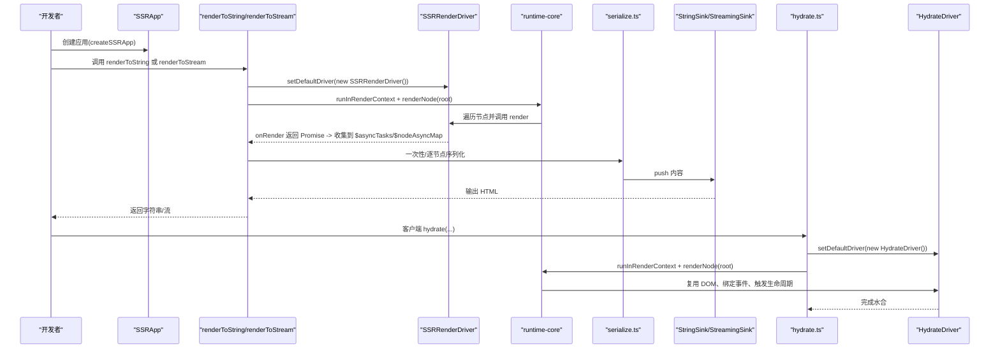
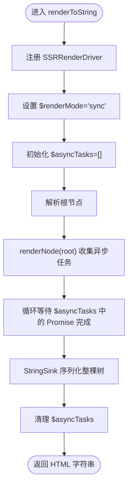
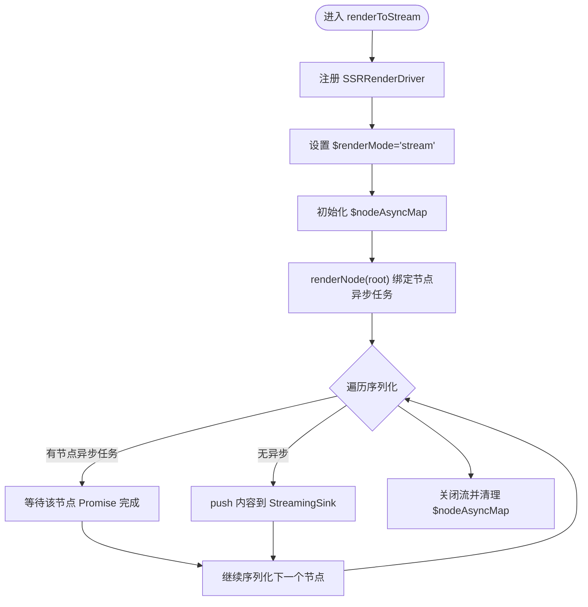
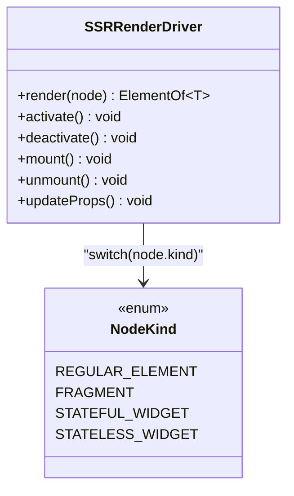
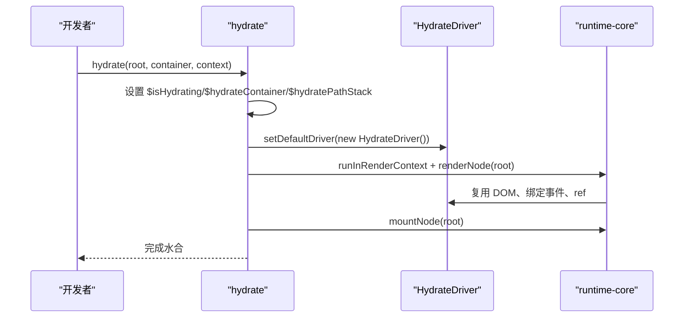
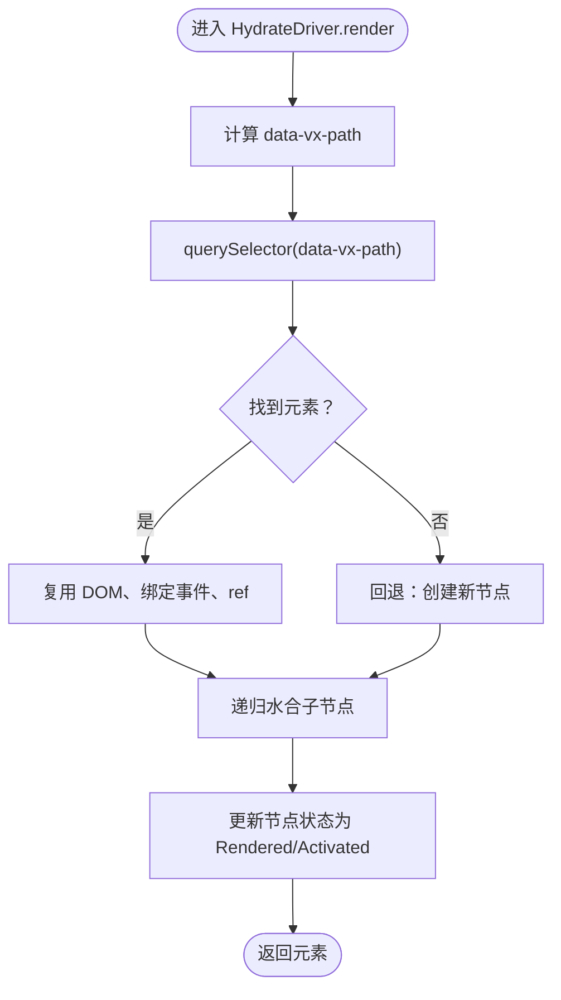
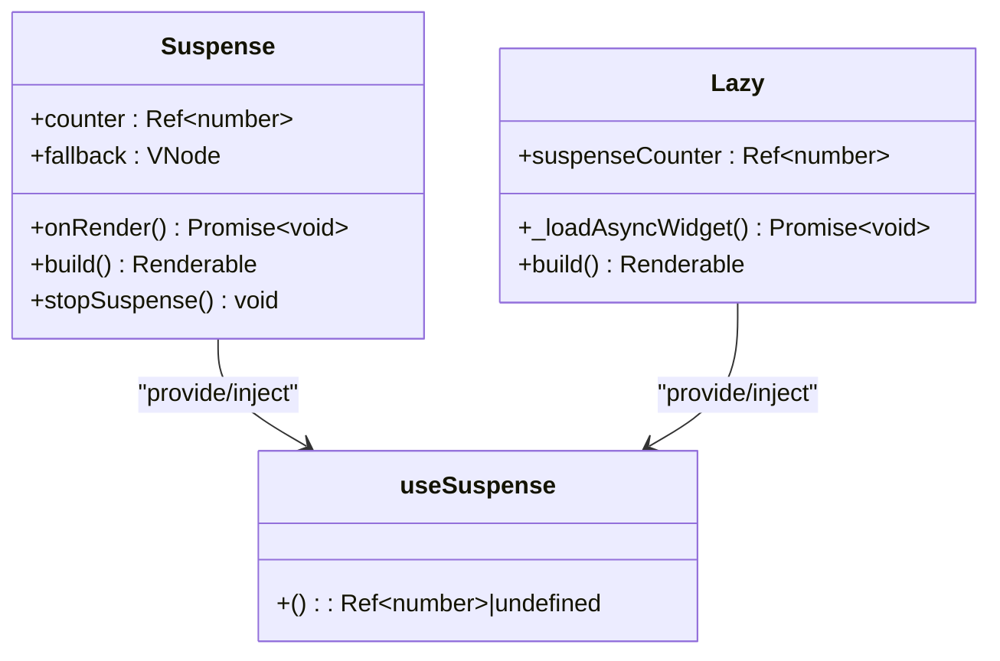
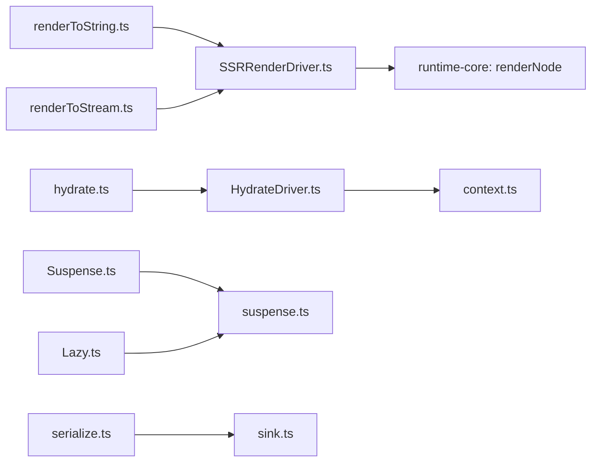

# 异步组件 SSR 集成

<cite>
**本文引用的文件列表**
- [createSSRApp.ts](file://packages/runtime-ssr/src/app/createSSRApp.ts)
- [SSRApp.ts](file://packages/runtime-ssr/src/app/SSRApp.ts)
- [renderToString.ts](file://packages/runtime-ssr/src/server/string/renderToString.ts)
- [renderToStream.ts](file://packages/runtime-ssr/src/server/stream/renderToStream.ts)
- [SSRRenderDriver.ts](file://packages/runtime-ssr/src/server/drivers/SSRRenderDriver.ts)
- [serialize.ts](file://packages/runtime-ssr/src/shared/serialize.ts)
- [sink.ts](file://packages/runtime-ssr/src/shared/sink.ts)
- [context.ts](file://packages/runtime-ssr/src/shared/context.ts)
- [hydrate.ts](file://packages/runtime-ssr/src/client/hydrate.ts)
- [HydrateDriver.ts](file://packages/runtime-ssr/src/client/drivers/HydrateDriver.ts)
- [Suspense.ts](file://packages/runtime-core/src/widget/widgets/Suspense.ts)
- [Lazy.ts](file://packages/runtime-core/src/widget/widgets/Lazy.ts)
- [suspense.ts](file://packages/runtime-core/src/runtime/suspense.ts)
- [nodeState.ts](file://packages/runtime-core/src/constants/nodeState.ts)
- [widget.ts](file://packages/runtime-core/src/vnode/creator/widget.ts)
- [base.ts](file://packages/runtime-core/src/vnode/creator/base.ts)
</cite>

## 目录
1. [简介](#简介)
2. [项目结构](#项目结构)
3. [核心组件](#核心组件)
4. [架构总览](#架构总览)
5. [详细组件分析](#详细组件分析)
6. [依赖关系分析](#依赖关系分析)
7. [性能考量](#性能考量)
8. [故障排查指南](#故障排查指南)
9. [结论](#结论)
10. [附录](#附录)

## 简介
本文件系统性阐述本仓库中“异步组件 SSR 集成”的设计与实现，覆盖服务端同步渲染、流式渲染、客户端水合以及 Suspense/Lazy 异步组件的协同机制。重点说明：
- 如何在 SSR 中正确收集与消费异步任务，保证服务端输出完整、可水合；
- 流式渲染如何在遇到异步时阻塞等待，同时保持与同步模式一致的最终输出；
- 客户端水合如何基于 data-vx-path 精确复用服务端 DOM；
- Suspense 与 Lazy 如何与 SSR 驱动协作，提供一致的回退与切换体验。

## 项目结构
围绕异步组件 SSR 集成的关键目录与文件：
- 服务端渲染入口与工具：packages/runtime-ssr/src/server
- 服务端渲染驱动：packages/runtime-ssr/src/server/drivers
- 客户端水合入口与驱动：packages/runtime-ssr/src/client
- 共享上下文与序列化：packages/runtime-ssr/src/shared
- 异步组件：packages/runtime-core/src/widget/widgets
- 虚拟节点与运行时：packages/runtime-core/src/vnode 与 runtime

图表来源
- [createSSRApp.ts](file://packages/runtime-ssr/src/app/createSSRApp.ts#L1-L25)
- [renderToString.ts](file://packages/runtime-ssr/src/server/string/renderToString.ts#L1-L61)
- [renderToStream.ts](file://packages/runtime-ssr/src/server/stream/renderToStream.ts#L1-L296)
- [SSRRenderDriver.ts](file://packages/runtime-ssr/src/server/drivers/SSRRenderDriver.ts#L1-L113)
- [serialize.ts](file://packages/runtime-ssr/src/shared/serialize.ts#L1-L91)
- [sink.ts](file://packages/runtime-ssr/src/shared/sink.ts#L1-L44)
- [context.ts](file://packages/runtime-ssr/src/shared/context.ts#L1-L119)
- [hydrate.ts](file://packages/runtime-ssr/src/client/hydrate.ts#L1-L105)
- [HydrateDriver.ts](file://packages/runtime-ssr/src/client/drivers/HydrateDriver.ts#L1-L351)
- [Suspense.ts](file://packages/runtime-core/src/widget/widgets/Suspense.ts#L1-L184)
- [Lazy.ts](file://packages/runtime-core/src/widget/widgets/Lazy.ts#L1-L235)
- [suspense.ts](file://packages/runtime-core/src/runtime/suspense.ts#L1-L13)

章节来源
- [createSSRApp.ts](file://packages/runtime-ssr/src/app/createSSRApp.ts#L1-L25)
- [renderToString.ts](file://packages/runtime-ssr/src/server/string/renderToString.ts#L1-L61)
- [renderToStream.ts](file://packages/runtime-ssr/src/server/stream/renderToStream.ts#L1-L296)
- [SSRRenderDriver.ts](file://packages/runtime-ssr/src/server/drivers/SSRRenderDriver.ts#L1-L113)
- [serialize.ts](file://packages/runtime-ssr/src/shared/serialize.ts#L1-L91)
- [sink.ts](file://packages/runtime-ssr/src/shared/sink.ts#L1-L44)
- [context.ts](file://packages/runtime-ssr/src/shared/context.ts#L1-L119)
- [hydrate.ts](file://packages/runtime-ssr/src/client/hydrate.ts#L1-L105)
- [HydrateDriver.ts](file://packages/runtime-ssr/src/client/drivers/HydrateDriver.ts#L1-L351)
- [Suspense.ts](file://packages/runtime-core/src/widget/widgets/Suspense.ts#L1-L184)
- [Lazy.ts](file://packages/runtime-core/src/widget/widgets/Lazy.ts#L1-L235)
- [suspense.ts](file://packages/runtime-core/src/runtime/suspense.ts#L1-L13)

## 核心组件
- SSR 应用工厂与应用类：createSSRApp、SSRApp
- 服务端渲染 API：renderToString、renderToStream、renderToReadableStream、renderToNodeStream、pipeToWritable
- 服务端渲染驱动：SSRRenderDriver，负责在渲染阶段收集异步任务（Promise），并按 sync/stream 模式分发
- 客户端水合 API：hydrate、createHydrateApp
- 客户端水合驱动：HydrateDriver，负责复用服务端 DOM、绑定事件、触发生命周期
- 异步组件：Suspense、Lazy，配合 useSuspense 计数器实现回退与切换
- 共享上下文：SSR 上下文（$renderMode、$asyncTasks、$nodeAsyncMap、$isHydrating、$hydrateContainer、$hydratePathStack）

章节来源
- [createSSRApp.ts](file://packages/runtime-ssr/src/app/createSSRApp.ts#L1-L25)
- [SSRApp.ts](file://packages/runtime-ssr/src/app/SSRApp.ts#L1-L13)
- [renderToString.ts](file://packages/runtime-ssr/src/server/string/renderToString.ts#L1-L61)
- [renderToStream.ts](file://packages/runtime-ssr/src/server/stream/renderToStream.ts#L1-L296)
- [SSRRenderDriver.ts](file://packages/runtime-ssr/src/server/drivers/SSRRenderDriver.ts#L1-L113)
- [hydrate.ts](file://packages/runtime-ssr/src/client/hydrate.ts#L1-L105)
- [HydrateDriver.ts](file://packages/runtime-ssr/src/client/drivers/HydrateDriver.ts#L1-L351)
- [Suspense.ts](file://packages/runtime-core/src/widget/widgets/Suspense.ts#L1-L184)
- [Lazy.ts](file://packages/runtime-core/src/widget/widgets/Lazy.ts#L1-L235)
- [suspense.ts](file://packages/runtime-core/src/runtime/suspense.ts#L1-L13)
- [context.ts](file://packages/runtime-ssr/src/shared/context.ts#L1-L119)

## 架构总览
SSR 渲染与水合的整体流程如下：

图表来源
- [renderToString.ts](file://packages/runtime-ssr/src/server/string/renderToString.ts#L1-L61)
- [renderToStream.ts](file://packages/runtime-ssr/src/server/stream/renderToStream.ts#L142-L177)
- [SSRRenderDriver.ts](file://packages/runtime-ssr/src/server/drivers/SSRRenderDriver.ts#L42-L96)
- [serialize.ts](file://packages/runtime-ssr/src/shared/serialize.ts#L56-L90)
- [sink.ts](file://packages/runtime-ssr/src/shared/sink.ts#L1-L44)
- [hydrate.ts](file://packages/runtime-ssr/src/client/hydrate.ts#L42-L79)
- [HydrateDriver.ts](file://packages/runtime-ssr/src/client/drivers/HydrateDriver.ts#L96-L222)

## 详细组件分析

### 服务端同步渲染（renderToString）
- 注册 SSRRenderDriver，设置渲染模式为 sync，并初始化 $asyncTasks
- 渲染根节点，收集所有异步任务（Promise）
- 循环等待所有异步任务完成，再一次性序列化整棵树到 StringSink
- 清理内部状态并返回字符串

图表来源
- [renderToString.ts](file://packages/runtime-ssr/src/server/string/renderToString.ts#L23-L60)
- [SSRRenderDriver.ts](file://packages/runtime-ssr/src/server/drivers/SSRRenderDriver.ts#L66-L90)
- [serialize.ts](file://packages/runtime-ssr/src/shared/serialize.ts#L56-L90)
- [sink.ts](file://packages/runtime-ssr/src/shared/sink.ts#L17-L44)

章节来源
- [renderToString.ts](file://packages/runtime-ssr/src/server/string/renderToString.ts#L1-L61)
- [SSRRenderDriver.ts](file://packages/runtime-ssr/src/server/drivers/SSRRenderDriver.ts#L42-L96)
- [serialize.ts](file://packages/runtime-ssr/src/shared/serialize.ts#L1-L91)
- [sink.ts](file://packages/runtime-ssr/src/shared/sink.ts#L1-L44)

### 服务端流式渲染（renderToStream）
- 注册 SSRRenderDriver，设置渲染模式为 stream，并初始化 $nodeAsyncMap
- 渲染根节点，将每个节点的异步任务绑定到该节点（WeakMap）
- 逐节点序列化，遇到有异步任务的节点时阻塞等待，完成后继续输出
- 与 sync 模式最终输出一致，水合逻辑一致

图表来源
- [renderToStream.ts](file://packages/runtime-ssr/src/server/stream/renderToStream.ts#L142-L177)
- [renderToStream.ts](file://packages/runtime-ssr/src/server/stream/renderToStream.ts#L53-L121)
- [SSRRenderDriver.ts](file://packages/runtime-ssr/src/server/drivers/SSRRenderDriver.ts#L66-L90)

章节来源
- [renderToStream.ts](file://packages/runtime-ssr/src/server/stream/renderToStream.ts#L1-L296)
- [SSRRenderDriver.ts](file://packages/runtime-ssr/src/server/drivers/SSRRenderDriver.ts#L1-L113)

### 服务端渲染驱动（SSRRenderDriver）
- 针对不同节点类型执行渲染：
  - 元素/片段：递归渲染子节点
  - 有状态组件：禁用自动更新与生命周期，执行 onRender，若返回 Promise 则按模式收集
  - 无状态组件：直接渲染其子节点
- 不允许激活/挂载/更新属性等客户端行为

图表来源
- [SSRRenderDriver.ts](file://packages/runtime-ssr/src/server/drivers/SSRRenderDriver.ts#L42-L113)

章节来源
- [SSRRenderDriver.ts](file://packages/runtime-ssr/src/server/drivers/SSRRenderDriver.ts#L1-L113)

### 客户端水合（hydrate/createHydrateApp）
- 设置 $isHydrating、$hydrateContainer、$hydratePathStack
- 注册 HydrateDriver，执行两阶段：
  - 渲染阶段：复用已有 DOM、绑定事件、ref，定位子节点
  - 挂载阶段：触发生命周期钩子
- 提供 createHydrateApp 延迟挂载

图表来源
- [hydrate.ts](file://packages/runtime-ssr/src/client/hydrate.ts#L42-L79)
- [HydrateDriver.ts](file://packages/runtime-ssr/src/client/drivers/HydrateDriver.ts#L96-L222)

章节来源
- [hydrate.ts](file://packages/runtime-ssr/src/client/hydrate.ts#L1-L105)
- [HydrateDriver.ts](file://packages/runtime-ssr/src/client/drivers/HydrateDriver.ts#L1-L351)

### 客户端水合驱动（HydrateDriver）
- 通过 data-vx-path 精确定位服务端输出的 DOM
- 复用现有元素，绑定事件与 ref
- 递归水合子节点，最后触发生命周期钩子
- 支持属性变更通知与调度刷新

图表来源
- [HydrateDriver.ts](file://packages/runtime-ssr/src/client/drivers/HydrateDriver.ts#L96-L222)
- [context.ts](file://packages/runtime-ssr/src/shared/context.ts#L1-L119)

章节来源
- [HydrateDriver.ts](file://packages/runtime-ssr/src/client/drivers/HydrateDriver.ts#L1-L351)
- [context.ts](file://packages/runtime-ssr/src/shared/context.ts#L1-L119)

### 异步组件：Suspense 与 Lazy
- Suspense：维护计数器，首次异步时显示 fallback，完成后切换为子节点；支持 onResolved 回调
- Lazy：延迟加载模块，支持 delay/timeout/loading/onError；加载完成后替换为真实组件；与 useSuspense 协作减少计数
- 两者均与 SSR 驱动协作：在 onRender 阶段返回 Promise，由 SSRRenderDriver 收集并在渲染后 resolve

图表来源
- [Suspense.ts](file://packages/runtime-core/src/widget/widgets/Suspense.ts#L84-L184)
- [Lazy.ts](file://packages/runtime-core/src/widget/widgets/Lazy.ts#L100-L208)
- [suspense.ts](file://packages/runtime-core/src/runtime/suspense.ts#L1-L13)

章节来源
- [Suspense.ts](file://packages/runtime-core/src/widget/widgets/Suspense.ts#L1-L184)
- [Lazy.ts](file://packages/runtime-core/src/widget/widgets/Lazy.ts#L1-L235)
- [suspense.ts](file://packages/runtime-core/src/runtime/suspense.ts#L1-L13)

### 虚拟节点与序列化
- serializeVNodeToSink：根据节点类型输出 HTML，支持 path 注入（data-vx-path）以便水合定位
- StringSink：同步模式下的字符串缓冲输出
- base.ts/widget.ts：创建 VNode 时处理 ref/key/directives 等属性，为 SSR/水合提供稳定结构

章节来源
- [serialize.ts](file://packages/runtime-ssr/src/shared/serialize.ts#L1-L91)
- [sink.ts](file://packages/runtime-ssr/src/shared/sink.ts#L1-L44)
- [base.ts](file://packages/runtime-core/src/vnode/creator/base.ts#L1-L118)
- [widget.ts](file://packages/runtime-core/src/vnode/creator/widget.ts#L103-L123)

## 依赖关系分析
- renderToString/renderToStream 依赖 SSRRenderDriver 收集异步任务
- SSRRenderDriver 依赖 runtime-core 的 renderNode 与生命周期钩子
- 客户端 hydrate 依赖 HydrateDriver 与 SSR 上下文（$hydrateContainer、$hydratePathStack）
- Suspense/Lazy 通过 useSuspense 与 SSR 驱动形成闭环，保证服务端与客户端一致的异步行为

图表来源
- [renderToString.ts](file://packages/runtime-ssr/src/server/string/renderToString.ts#L1-L61)
- [renderToStream.ts](file://packages/runtime-ssr/src/server/stream/renderToStream.ts#L1-L296)
- [SSRRenderDriver.ts](file://packages/runtime-ssr/src/server/drivers/SSRRenderDriver.ts#L1-L113)
- [hydrate.ts](file://packages/runtime-ssr/src/client/hydrate.ts#L1-L105)
- [HydrateDriver.ts](file://packages/runtime-ssr/src/client/drivers/HydrateDriver.ts#L1-L351)
- [context.ts](file://packages/runtime-ssr/src/shared/context.ts#L1-L119)
- [Suspense.ts](file://packages/runtime-core/src/widget/widgets/Suspense.ts#L1-L184)
- [Lazy.ts](file://packages/runtime-core/src/widget/widgets/Lazy.ts#L1-L235)
- [suspense.ts](file://packages/runtime-core/src/runtime/suspense.ts#L1-L13)
- [serialize.ts](file://packages/runtime-ssr/src/shared/serialize.ts#L1-L91)
- [sink.ts](file://packages/runtime-ssr/src/shared/sink.ts#L1-L44)

章节来源
- [renderToString.ts](file://packages/runtime-ssr/src/server/string/renderToString.ts#L1-L61)
- [renderToStream.ts](file://packages/runtime-ssr/src/server/stream/renderToStream.ts#L1-L296)
- [SSRRenderDriver.ts](file://packages/runtime-ssr/src/server/drivers/SSRRenderDriver.ts#L1-L113)
- [hydrate.ts](file://packages/runtime-ssr/src/client/hydrate.ts#L1-L105)
- [HydrateDriver.ts](file://packages/runtime-ssr/src/client/drivers/HydrateDriver.ts#L1-L351)
- [context.ts](file://packages/runtime-ssr/src/shared/context.ts#L1-L119)
- [Suspense.ts](file://packages/runtime-core/src/widget/widgets/Suspense.ts#L1-L184)
- [Lazy.ts](file://packages/runtime-core/src/widget/widgets/Lazy.ts#L1-L235)
- [suspense.ts](file://packages/runtime-core/src/runtime/suspense.ts#L1-L13)
- [serialize.ts](file://packages/runtime-ssr/src/shared/serialize.ts#L1-L91)
- [sink.ts](file://packages/runtime-ssr/src/shared/sink.ts#L1-L44)

## 性能考量
- 同步模式（renderToString）适合一次性输出，等待所有异步任务完成，适合静态页面或预渲染
- 流式模式（renderToStream）适合长耗时异步组件，边渲染边输出，降低首字节时间
- 水合阶段尽量减少不必要的 DOM 创建，HydrateDriver 通过 data-vx-path 精确复用
- Suspense/Lazy 的计数器与回退策略可避免闪烁，提升用户体验
- 虚拟节点创建时的属性解包与指令处理在 base.ts/widget.ts 中完成，减少运行时开销

[本节为通用指导，无需列出具体文件来源]

## 故障排查指南
- 未找到水合容器
  - 症状：hydrate 抛出容器未找到错误
  - 排查：确认传入的容器元素存在或选择器正确
  - 参考：[hydrate.ts](file://packages/runtime-ssr/src/client/hydrate.ts#L49-L53)
- SSR 模式未设置
  - 症状：异步任务未被收集或输出不完整
  - 排查：确保在 renderToString/renderToStream 前设置了 $renderMode
  - 参考：[renderToString.ts](file://packages/runtime-ssr/src/server/string/renderToString.ts#L30-L34)、[renderToStream.ts](file://packages/runtime-ssr/src/server/stream/renderToStream.ts#L150-L154)
- 流式渲染未等待异步
  - 症状：输出提前结束或组件未完全渲染
  - 排查：确认 SSRRenderDriver 已将 Promise 绑定到 $nodeAsyncMap，且 streamSerializeNode 正在等待
  - 参考：[SSRRenderDriver.ts](file://packages/runtime-ssr/src/server/drivers/SSRRenderDriver.ts#L80-L90)、[renderToStream.ts](file://packages/runtime-ssr/src/server/stream/renderToStream.ts#L104-L117)
- 水合路径不匹配
  - 症状：水合失败或事件未绑定
  - 排查：确认序列化时注入了 data-vx-path，HydrateDriver 能通过 $hydratePathStack 定位
  - 参考：[serialize.ts](file://packages/runtime-ssr/src/shared/serialize.ts#L17-L35)、[HydrateDriver.ts](file://packages/runtime-ssr/src/client/drivers/HydrateDriver.ts#L40-L61)
- Suspense 未切换
  - 症状：始终显示 fallback
  - 排查：确认 Lazy 成功加载并减少计数器；Suspense 的 onResolved 是否被触发
  - 参考：[Lazy.ts](file://packages/runtime-core/src/widget/widgets/Lazy.ts#L196-L207)、[Suspense.ts](file://packages/runtime-core/src/widget/widgets/Suspense.ts#L131-L162)

章节来源
- [hydrate.ts](file://packages/runtime-ssr/src/client/hydrate.ts#L42-L79)
- [renderToString.ts](file://packages/runtime-ssr/src/server/string/renderToString.ts#L23-L34)
- [renderToStream.ts](file://packages/runtime-ssr/src/server/stream/renderToStream.ts#L142-L177)
- [SSRRenderDriver.ts](file://packages/runtime-ssr/src/server/drivers/SSRRenderDriver.ts#L66-L90)
- [serialize.ts](file://packages/runtime-ssr/src/shared/serialize.ts#L17-L35)
- [HydrateDriver.ts](file://packages/runtime-ssr/src/client/drivers/HydrateDriver.ts#L40-L61)
- [Lazy.ts](file://packages/runtime-core/src/widget/widgets/Lazy.ts#L196-L207)
- [Suspense.ts](file://packages/runtime-core/src/widget/widgets/Suspense.ts#L131-L162)

## 结论
本项目通过 SSRRenderDriver 与 HydrateDriver 将异步组件无缝集成到 SSR/水合流程中：
- renderToString 与 renderToStream 在服务端统一收集异步任务，保证输出完整且可水合
- HydrateDriver 基于 data-vx-path 精准复用 DOM，确保水合一致性
- Suspense/Lazy 与 useSuspense 形成稳定的异步组件生态，提升用户体验
- 通过清晰的上下文与驱动抽象，实现服务端与客户端行为的一致性

[本节为总结，无需列出具体文件来源]

## 附录
- 节点生命周期状态（Created/Rendered/Activated/Deactivated/Unmounted）
  - 参考：[nodeState.ts](file://packages/runtime-core/src/constants/nodeState.ts#L1-L19)

章节来源
- [nodeState.ts](file://packages/runtime-core/src/constants/nodeState.ts#L1-L19)