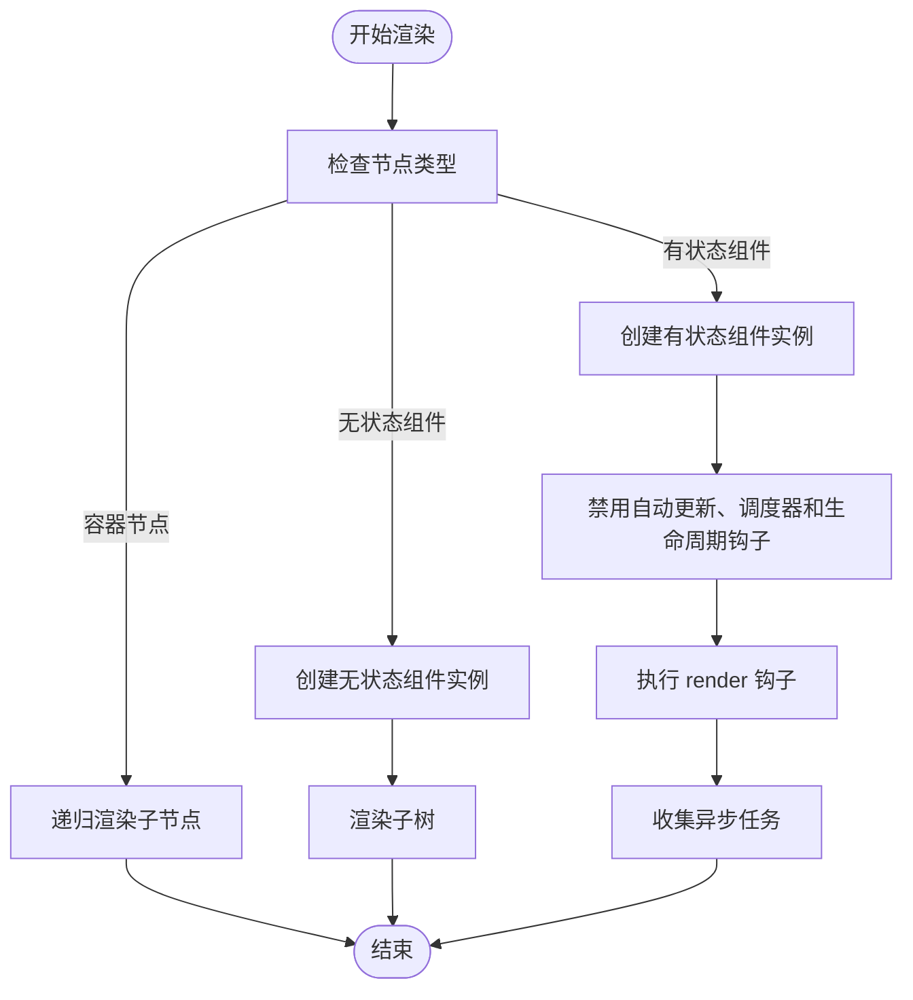
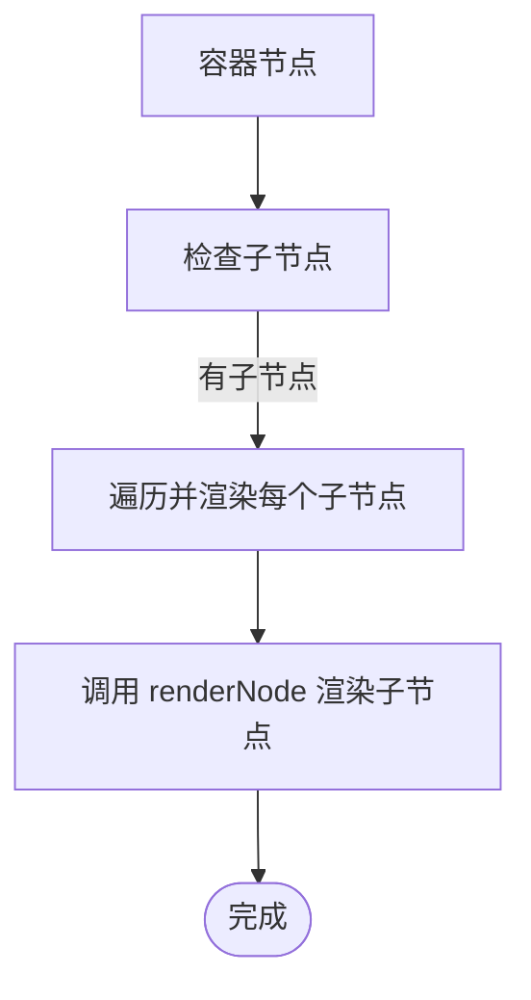
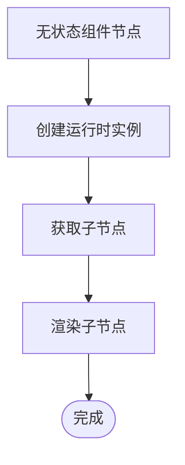
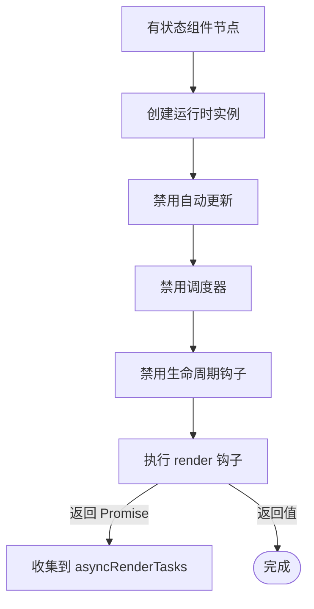
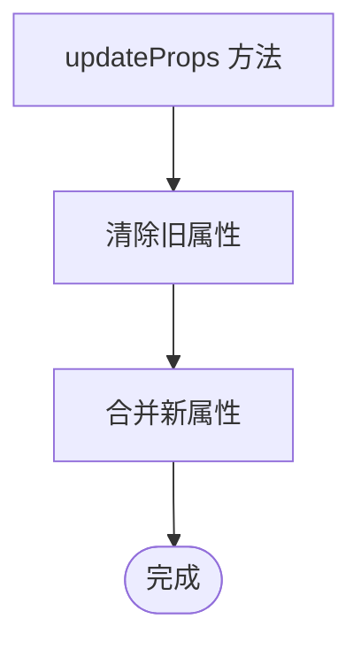
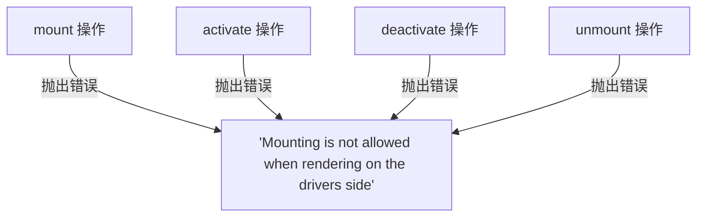
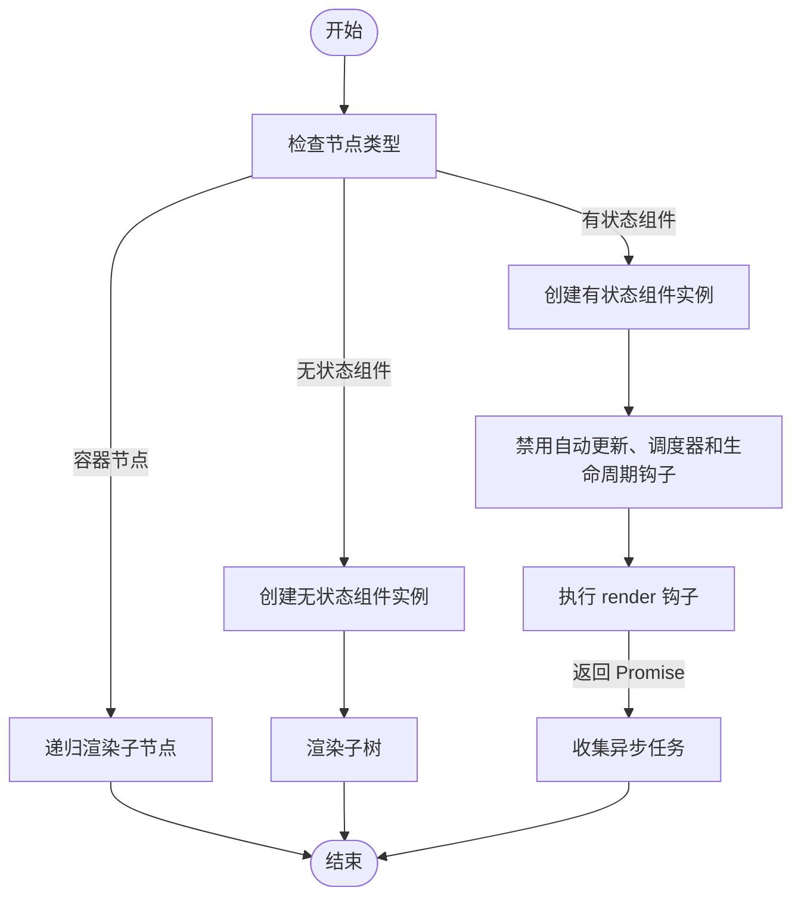

# 服务端渲染

<cite>
**本文档引用的文件**
- [SSRDriver.ts](file://packages/runtime-ssr/src/server/SSRDriver.ts)
- [SSRApp.ts](file://packages/runtime-ssr/src/SSRApp.ts)
- [StatefulWidgetDriver.ts](file://packages/runtime-drivers/src/drivers/StatefulWidgetDriver.ts)
- [StatelessWidgetDriver.ts](file://packages/runtime-drivers/src/drivers/StatelessWidgetDriver.ts)
- [ContainerDriver.ts](file://packages/runtime-drivers/src/drivers/ContainerDriver.ts)
- [WidgetRuntime.ts](file://packages/runtime-core/src/widget/runtime/WidgetRuntime.ts)
- [BaseNode.ts](file://packages/runtime-core/src/types/nodes/BaseNode.ts)
- [lifecycle.ts](file://packages/runtime-core/src/types/lifecycle.ts)
- [nodeTypes.ts](file://packages/runtime-core/src/constants/nodeTypes.ts)
</cite>

## 目录
1. [简介](#简介)
2. [核心组件](#核心组件)
3. [SSR 渲染流程](#ssr-渲染流程)
4. [容器节点处理](#容器节点处理)
5. [无状态组件处理](#无状态组件处理)
6. [有状态组件处理](#有状态组件处理)
7. [属性更新机制](#属性更新机制)
8. [禁用的操作](#禁用的操作)
9. [服务端渲染流程图](#服务端渲染流程图)
10. [Node.js 服务器集成示例](#nodejs-服务器集成示例)

## 简介
服务端渲染（SSR）是一种在服务器端将虚拟 DOM 转换为 HTML 字符串的技术，以提高首屏加载性能和搜索引擎优化（SEO）。本项目通过 `SSRDriver` 实现了服务端渲染的核心机制，针对不同类型的虚拟节点（VNode）采用不同的处理策略。对于容器节点，递归渲染其子节点；对于无状态组件，创建运行时实例并渲染其子树；对于有状态组件，则禁用自动更新、调度器和生命周期钩子，仅执行 `render` 钩子并收集异步任务。此外，`updateProps` 方法支持在服务端动态合并属性，而 `mount`、`activate`、`deactivate` 和 `unmount` 操作在服务端被禁止。

## 核心组件
服务端渲染的核心组件包括 `SSRDriver`、`SSRApp` 和各种驱动器（Driver）类。`SSRDriver` 是主要的渲染驱动器，负责处理不同类型的虚拟节点。`SSRApp` 扩展了基础的 `App` 类，增加了 `asyncRenderTasks` 属性用于收集异步渲染任务。各种驱动器类（如 `StatefulWidgetDriver`、`StatelessWidgetDriver` 和 `ContainerDriver`）分别处理有状态组件、无状态组件和容器节点。

**核心组件**
- [SSRDriver.ts](file://packages/runtime-ssr/src/server/SSRDriver.ts#L22-L77)
- [SSRApp.ts](file://packages/runtime-ssr/src/SSRApp.ts#L3-L8)
- [StatefulWidgetDriver.ts](file://packages/runtime-drivers/src/drivers/StatefulWidgetDriver.ts#L43-L120)
- [StatelessWidgetDriver.ts](file://packages/runtime-drivers/src/drivers/StatelessWidgetDriver.ts#L31-L48)
- [ContainerDriver.ts](file://packages/runtime-drivers/src/drivers/ContainerDriver.ts#L15-L61)

## SSR 渲染流程
`SSRDriver` 的 `render` 方法是服务端渲染的核心入口。它根据虚拟节点的类型采取不同的处理策略。对于容器节点，递归渲染其所有子节点；对于无状态组件，创建运行时实例并渲染其子树；对于有状态组件，禁用自动更新、调度器和生命周期钩子，仅执行 `render` 钩子并收集异步任务。



**图表来源**
- [SSRDriver.ts](file://packages/runtime-ssr/src/server/SSRDriver.ts#L35-L59)

## 容器节点处理
容器节点（如 `div`、`span` 等）可以包含子节点。`SSRDriver` 通过 `isContainerNode` 函数识别容器节点，并使用 `renderNode` 函数递归渲染其所有子节点。



**图表来源**
- [SSRDriver.ts](file://packages/runtime-ssr/src/server/SSRDriver.ts#L36-L39)
- [ContainerDriver.ts](file://packages/runtime-drivers/src/drivers/ContainerDriver.ts#L20-L23)

## 无状态组件处理
无状态组件是纯函数式的组件，其输出完全由输入属性决定。`SSRDriver` 通过 `isStatelessWidgetNode` 函数识别无状态组件，并使用 `createWidgetRuntime` 函数创建运行时实例，然后渲染其子树。



**图表来源**
- [SSRDriver.ts](file://packages/runtime-ssr/src/server/SSRDriver.ts#L40-L42)
- [StatelessWidgetDriver.ts](file://packages/runtime-drivers/src/drivers/StatelessWidgetDriver.ts#L32-L37)

## 有状态组件处理
有状态组件具有内部状态，可以在状态变化时重新渲染。`SSRDriver` 通过 `isStatefulWidgetNode` 函数识别有状态组件，并创建一个禁用了自动更新、调度器和生命周期钩子的运行时实例。仅执行 `render` 钩子，并将任何返回的 Promise 收集到 `asyncRenderTasks` 中。



**图表来源**
- [SSRDriver.ts](file://packages/runtime-ssr/src/server/SSRDriver.ts#L43-L57)
- [SSRApp.ts](file://packages/runtime-ssr/src/SSRApp.ts#L4)
- [WidgetRuntime.ts](file://packages/runtime-core/src/widget/runtime/WidgetRuntime.ts#L102-L106)

## 属性更新机制
`updateProps` 方法用于在服务端合并属性，以支持动态内容注入。它首先清除旧属性中的所有属性，然后将新属性的所有属性合并到旧属性中。



**图表来源**
- [SSRDriver.ts](file://packages/runtime-ssr/src/server/SSRDriver.ts#L66-L75)

## 禁用的操作
在服务端渲染过程中，`mount`、`activate`、`deactivate` 和 `unmount` 操作被禁止，因为这些操作涉及 DOM 操作和生命周期管理，而在服务端没有真实的 DOM 环境。



**图表来源**
- [SSRDriver.ts](file://packages/runtime-ssr/src/server/SSRDriver.ts#L23-L33)
- [SSRDriver.ts](file://packages/runtime-ssr/src/server/SSRDriver.ts#L62-L64)

## 服务端渲染流程图
以下是完整的服务端渲染流程图，展示了从 VNode 到 HTML 字符串的转换过程。



**图表来源**
- [SSRDriver.ts](file://packages/runtime-ssr/src/server/SSRDriver.ts#L35-L59)

## Node.js 服务器集成示例
以下是一个 Node.js 服务器集成示例，演示如何将渲染结果输出为响应流。

```typescript
import { createSSRApp } from '@vitarx/runtime-ssr';
import { renderToString } from '@vitarx/runtime-ssr/server';

const app = createSSRApp({
  render() {
    return <div>Hello, SSR!</div>;
  }
});

app.mount('#app');

const html = await renderToString(app);
console.log(html);
```

**代码来源**
- [SSRApp.ts](file://packages/runtime-ssr/src/SSRApp.ts#L3-L8)
- [SSRDriver.ts](file://packages/runtime-ssr/src/server/SSRDriver.ts#L22-L77)