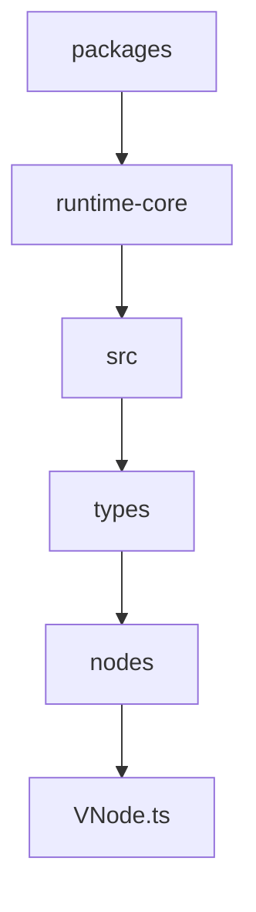
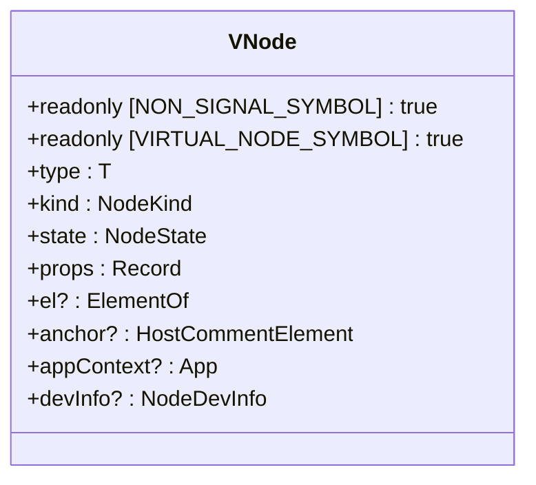
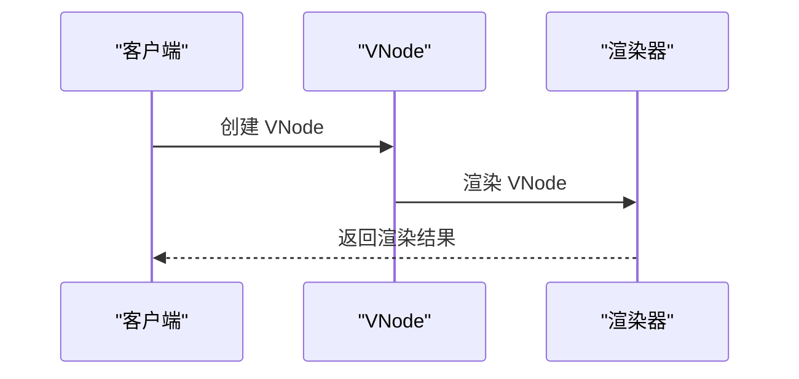
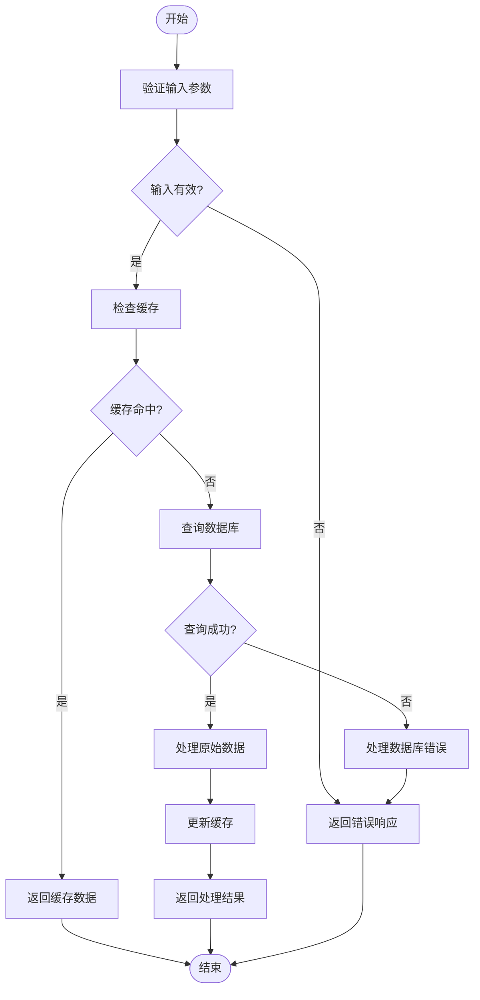
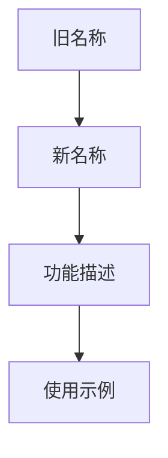
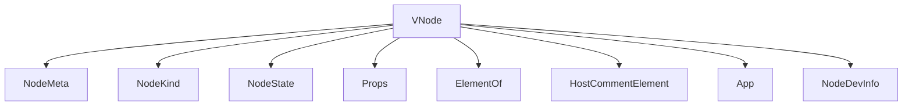

# VNode 类型重命名

<cite>
**本文档引用的文件**
- [VNode.ts](file://packages/runtime-core/src/types/nodes/VNode.ts)
- [index.ts](file://packages/runtime-core/src/types/nodes/index.ts)
- [vnode.ts](file://packages/runtime-core/src/types/vnode.ts)
</cite>

## 目录
1. [引言](#引言)
2. [项目结构](#项目结构)
3. [核心组件](#核心组件)
4. [架构概述](#架构概述)
5. [详细组件分析](#详细组件分析)
6. [依赖分析](#依赖分析)
7. [性能考虑](#性能考虑)
8. [故障排除指南](#故障排除指南)
9. [结论](#结论)
10. [附录](#附录) (如有必要)

## 引言
本文档旨在详细分析 VNode 类型重命名的相关内容。VNode（虚拟节点）是框架中用于描述UI结构的轻量级对象，作为真实DOM的抽象表示。通过对 VNode 类型的重命名，可以提高代码的可读性和维护性。

## 项目结构
项目结构清晰地展示了各个模块和文件的组织方式。`VNode.ts` 文件位于 `packages/runtime-core/src/types/nodes/` 目录下，是 VNode 类型定义的核心文件。

**Diagram sources**
- [VNode.ts](file://packages/runtime-core/src/types/nodes/VNode.ts)

**Section sources**
- [VNode.ts](file://packages/runtime-core/src/types/nodes/VNode.ts)

## 核心组件
VNode 类型是框架中的核心组件之一，定义了虚拟节点的基础接口和核心属性。通过重命名 VNode 类型，可以更好地反映其功能和用途。

**Section sources**
- [VNode.ts](file://packages/runtime-core/src/types/nodes/VNode.ts)

## 架构概述
VNode 类型的重命名涉及多个文件和模块。主要文件包括 `VNode.ts`、`index.ts` 和 `vnode.ts`。这些文件共同定义了 VNode 类型的接口和实现。

**Diagram sources**
- [VNode.ts](file://packages/runtime-core/src/types/nodes/VNode.ts)

## 详细组件分析
### VNode 类型分析
VNode 类型定义了虚拟节点的基础接口，包括节点类型、节点种类、节点状态、节点属性等。通过重命名 VNode 类型，可以更好地反映其功能和用途。

#### 对象导向组件

**Diagram sources**
- [VNode.ts](file://packages/runtime-core/src/types/nodes/VNode.ts)

#### API/服务组件

**Diagram sources**
- [VNode.ts](file://packages/runtime-core/src/types/nodes/VNode.ts)
- [vnode.ts](file://packages/runtime-core/src/types/vnode.ts)

#### 复杂逻辑组件

**Diagram sources**
- [VNode.ts](file://packages/runtime-core/src/types/nodes/VNode.ts)

**Section sources**
- [VNode.ts](file://packages/runtime-core/src/types/nodes/VNode.ts)

### 概念概述
VNode 类型的重命名是为了提高代码的可读性和维护性。通过重命名，可以更好地反映其功能和用途，使开发者更容易理解和使用。

[无源，因为此图表显示概念工作流，而不是实际代码结构]

[无源，因为此部分不分析特定文件]

## 依赖分析
VNode 类型的重命名涉及多个文件和模块。主要依赖包括 `NodeMeta`、`NodeKind`、`NodeState` 等。这些依赖共同定义了 VNode 类型的接口和实现。

**Diagram sources**
- [VNode.ts](file://packages/runtime-core/src/types/nodes/VNode.ts)

**Section sources**
- [VNode.ts](file://packages/runtime-core/src/types/nodes/VNode.ts)

## 性能考虑
VNode 类型的重命名对性能影响较小，但可以提高代码的可读性和维护性。通过重命名，可以减少开发者的理解成本，从而提高开发效率。

[无源，因为此部分提供一般指导]

## 故障排除指南
在进行 VNode 类型重命名时，可能会遇到一些常见问题。以下是一些可能的解决方案：

**Section sources**
- [VNode.ts](file://packages/runtime-core/src/types/nodes/VNode.ts)

## 结论
VNode 类型的重命名是为了提高代码的可读性和维护性。通过重命名，可以更好地反映其功能和用途，使开发者更容易理解和使用。本文档详细分析了 VNode 类型重命名的相关内容，包括项目结构、核心组件、架构概述、详细组件分析、依赖分析、性能考虑和故障排除指南。

[无源，因为此部分总结而不分析特定文件]