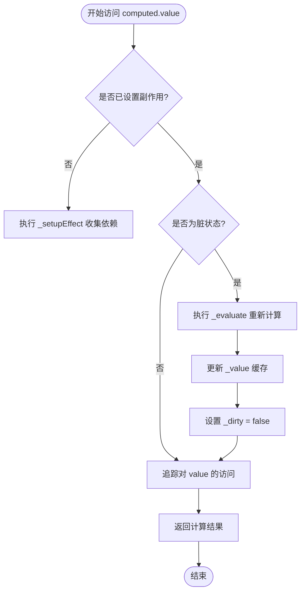
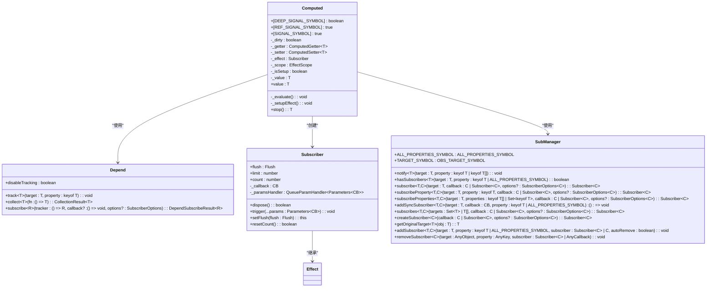

# computed

<cite>
**本文档中引用的文件**   
- [computed.ts](file://packages/responsive/src/signal/computed/computed.ts)
- [helpers.ts](file://packages/responsive/src/signal/computed/helpers.ts)
- [depend.ts](file://packages/responsive/src/depend/depend.ts)
- [subscriber.ts](file://packages/responsive/src/observer/subscriber.ts)
- [subManager.ts](file://packages/responsive/src/observer/subManager.ts)
- [effect.ts](file://packages/responsive/src/effect/effect.ts)
- [ref.ts](file://packages/responsive/src/signal/ref/ref.ts)
- [base.ts](file://packages/responsive/src/signal/types/base.ts)
- [ref.ts](file://packages/responsive/src/signal/types/ref.ts)
</cite>

## 目录
1. [简介](#简介)
2. [核心机制](#核心机制)
3. [源码解析](#源码解析)
4. [使用示例](#使用示例)
5. [性能对比](#性能对比)
6. [可写计算属性](#可写计算属性)
7. [常见误区](#常见误区)
8. [总结](#总结)

## 简介

`computed` 是 Vitarx 响应式系统中的核心功能之一，用于创建基于依赖追踪的计算属性。它通过惰性求值和缓存优化，确保仅在依赖的响应式数据发生变化时才重新执行计算函数。这种机制避免了不必要的重复计算，显著提升了应用性能。

计算属性的核心价值在于其智能更新策略：当依赖项未发生变化时，直接返回缓存结果；只有当依赖项变更时，才会重新执行计算逻辑。这使得 `computed` 成为处理复杂衍生状态的理想选择，特别是在需要频繁访问但计算成本较高的场景中。

**Section sources**
- [computed.ts](file://packages/responsive/src/signal/computed/computed.ts#L80-L97)

## 核心机制

`computed` 的核心机制建立在依赖追踪和脏检查（dirty checking）的基础上。其工作流程可分为三个关键阶段：依赖收集、惰性求值和缓存更新。

在依赖收集阶段，`computed` 通过 `Depend.collect` 方法执行 getter 函数，并记录所有被访问的响应式属性。这些依赖关系被存储在 `deps` 集合中，为后续的变更通知提供依据。当依赖项发生变化时，`SubManager` 会通知相关的 `Subscriber`，触发 `computed` 的更新流程。

惰性求值是 `computed` 的另一大特性。通过 `dirty` 标志位控制，`computed` 仅在首次访问或依赖变更时执行计算。这种懒加载策略避免了不必要的计算开销，特别适合初始化成本较高的场景。`immediate` 选项提供了灵活性，允许开发者选择立即计算还是延迟计算。

缓存更新机制确保了性能优化。`_value` 字段存储了上一次的计算结果，当 `dirty` 为 `false` 时直接返回缓存值。这种设计使得 `computed` 在多次访问时保持高效，即使在复杂的计算逻辑下也能提供稳定的性能表现。



**Diagram sources **
- [computed.ts](file://packages/responsive/src/signal/computed/computed.ts#L202-L217)
- [depend.ts](file://packages/responsive/src/depend/depend.ts#L75-L79)

**Section sources**
- [computed.ts](file://packages/responsive/src/signal/computed/computed.ts#L120-L125)
- [depend.ts](file://packages/responsive/src/depend/depend.ts#L59-L64)

## 源码解析

`Computed` 类的实现体现了响应式系统的核心设计模式。其构造函数接收 `getter` 函数和配置选项，初始化 `_getter` 和 `_setter` 属性，并根据 `scope` 选项决定是否将计算属性添加到当前作用域中。`immediate` 选项控制是否立即执行 `_setupEffect` 进行依赖收集。

`_setupEffect` 方法是依赖追踪的关键。它通过 `Depend.collect` 执行 getter 函数，收集所有依赖项，并为每个依赖创建 `Subscriber`。当依赖项变更时，`onDependencyChange` 回调会设置 `_dirty = true` 并通知订阅者。这种设计实现了精确的依赖追踪，避免了过度渲染。

`value` 的 getter 方法实现了惰性求值。首次访问时调用 `_setupEffect`，后续访问则检查 `_dirty` 标志位。只有当 `_dirty` 为 `true` 时才执行 `_evaluate` 重新计算。`Depend.track(this, 'value')` 确保了对 `value` 属性的访问也能被追踪，形成完整的依赖链。



**Diagram sources **
- [computed.ts](file://packages/responsive/src/signal/computed/computed.ts#L98-L366)
- [depend.ts](file://packages/responsive/src/depend/depend.ts#L41-L152)
- [subscriber.ts](file://packages/responsive/src/observer/subscriber.ts#L98-L248)
- [subManager.ts](file://packages/responsive/src/observer/subManager.ts#L46-L424)

**Section sources**
- [computed.ts](file://packages/responsive/src/signal/computed/computed.ts#L156-L174)
- [computed.ts](file://packages/responsive/src/signal/computed/computed.ts#L313-L365)
- [computed.ts](file://packages/responsive/src/signal/computed/computed.ts#L202-L217)

## 使用示例

`computed` 提供了灵活的 API 来处理各种响应式场景。最基本的用法是创建只读计算属性，通过 `computed` 函数包装 getter 函数。例如，基于 `count` 响应式变量创建 `double` 计算属性：

```typescript
const count = ref(0)
const double = computed(() => count.value * 2)
console.log(double.value) // 0
count.value = 2
console.log(double.value) // 4
```

对于复杂逻辑的衍生状态，`computed` 同样表现出色。可以处理数组过滤、对象映射等操作，确保仅在相关数据变更时重新计算：

```typescript
const items = ref([{ id: 1, active: true }, { id: 2, active: false }])
const activeItems = computed(() => items.value.filter(item => item.active))
```

在模板中使用 `computed` 能显著提升性能。由于计算结果被缓存，即使在循环中多次访问也不会重复执行计算逻辑。这使得 `computed` 成为处理列表过滤、排序等操作的理想选择。

**Section sources**
- [helpers.ts](file://packages/responsive/src/signal/computed/helpers.ts#L43-L45)
- [computed.ts](file://packages/responsive/src/signal/computed/computed.ts#L90-L96)

## 性能对比

`computed` 与普通函数调用在性能上有显著差异。普通函数每次调用都会执行计算逻辑，而 `computed` 通过缓存机制避免了重复计算。这种差异在计算成本较高的场景中尤为明显。

考虑一个需要遍历大型数组的计算场景：

```typescript
// 普通函数：每次调用都执行 O(n) 操作
function getActiveCount() {
  return items.value.filter(item => item.active).length
}

// computed：仅在 items 变更时执行 O(n) 操作
const activeCount = computed(() => items.value.filter(item => item.active).length)
```

在频繁访问的场景中，`computed` 的性能优势更加突出。即使 `items` 不变，普通函数仍会重复执行过滤操作，而 `computed` 直接返回缓存结果。这种优化对于保持应用流畅性至关重要，特别是在移动设备等资源受限的环境中。

**Section sources**
- [computed.ts](file://packages/responsive/src/signal/computed/computed.ts#L297-L301)
- [computed.ts](file://packages/responsive/src/signal/computed/computed.ts#L202-L217)

## 可写计算属性

Vitarx 支持通过 `setter` 选项创建可写计算属性。这为双向数据绑定提供了可能，允许通过计算属性修改其依赖的源数据。`computedWithSetter` 辅助函数简化了这一过程：

```typescript
const count = ref(0)
const double = computedWithSetter(
  () => count.value * 2,
  (newValue) => {
    count.value = newValue / 2
  }
)
double.value = 10
console.log(count.value) // 5
```

可写计算属性的实现依赖于 `_setter` 属性。当尝试修改 `computed` 的 `value` 时，如果定义了 `_setter`，则调用该函数处理新值；否则输出警告信息。这种设计保持了计算属性的单向数据流原则，同时提供了必要的灵活性。

**Section sources**
- [computed.ts](file://packages/responsive/src/signal/computed/computed.ts#L227-L235)
- [helpers.ts](file://packages/responsive/src/signal/computed/helpers.ts#L70-L76)

## 常见误区

使用 `computed` 时需要避免一些常见误区。首要原则是避免在 `getter` 中产生副作用。`computed` 应该是纯函数，仅基于依赖项计算并返回值。执行异步操作、修改外部状态或触发其他计算都可能破坏响应式系统的确定性。

另一个常见误区是错误地处理依赖关系。如果 `getter` 函数没有正确访问响应式属性，`computed` 将无法建立正确的依赖追踪，导致无法及时更新。例如：

```typescript
// 错误：没有访问响应式属性
const badComputed = computed(() => someGlobalVariable)

// 正确：访问响应式属性
const goodComputed = computed(() => state.value.someProperty)
```

此外，不应在 `computed` 中调用异步操作。由于 `computed` 是同步求值的，异步操作会导致返回 `Promise` 而非预期值。对于需要异步计算的场景，应该使用 `watch` 或其他异步处理机制。

**Section sources**
- [computed.ts](file://packages/responsive/src/signal/computed/computed.ts#L227-L235)
- [computed.ts](file://packages/responsive/src/signal/computed/computed.ts#L361-L364)

## 总结

`computed` 是 Vitarx 响应式系统中不可或缺的组成部分，通过依赖追踪、惰性求值和缓存优化实现了高效的衍生状态管理。其核心设计模式确保了计算属性仅在必要时重新执行，为复杂应用提供了可靠的性能保障。

通过深入理解 `Computed` 类的实现机制，包括 `_dirty` 标志位、`_setupEffect` 依赖收集和 `Depend` 追踪系统，开发者可以更好地利用这一功能。正确使用 `computed` 不仅能提升应用性能，还能使代码更加清晰和可维护。

在实际开发中，应遵循避免副作用、正确处理依赖和不执行异步操作的原则。通过合理使用 `computed`，可以构建出响应迅速、性能优越的应用程序，充分发挥响应式编程的优势。