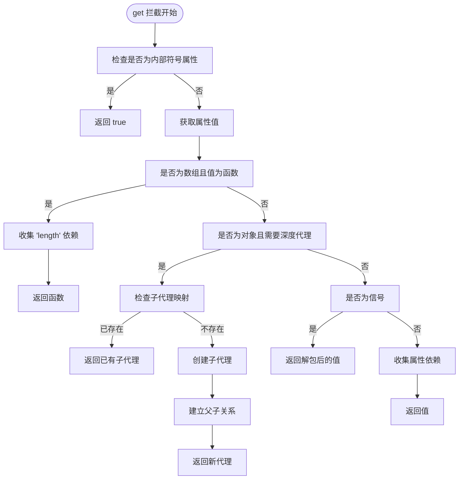
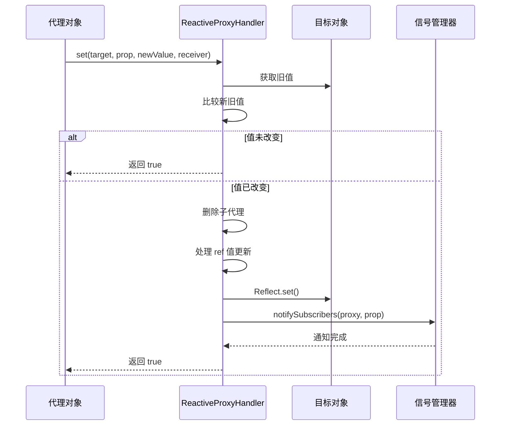
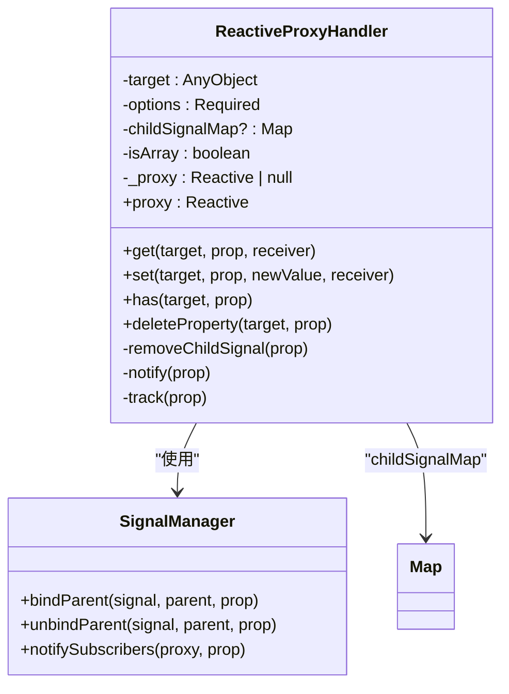
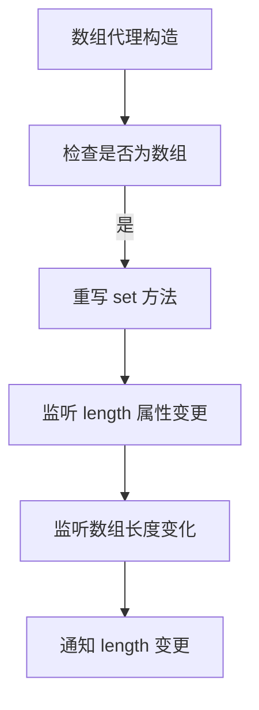

# reactive

<cite>
**本文档引用文件**  
- [proxy-handler.ts](file://packages/responsive/src/signal/reactive/proxy-handler.ts)
- [helpers.ts](file://packages/responsive/src/signal/reactive/helpers.ts)
- [readonly.ts](file://packages/responsive/src/signal/readonly/readonly.ts)
- [constants.ts](file://packages/responsive/src/signal/constants.ts)
- [types/proxy.ts](file://packages/responsive/src/signal/types/proxy.ts)
- [utils/verify.ts](file://packages/responsive/src/signal/utils/verify.ts)
- [utils/mark.ts](file://packages/responsive/src/signal/utils/mark.ts)
- [utils/conversion.ts](file://packages/responsive/src/signal/utils/conversion.ts)
- [README.md](file://packages/responsive/README.md)
</cite>

## 目录
1. [简介](#简介)
2. [核心机制](#核心机制)
3. [Proxy 处理器实现](#proxy-处理器实现)
4. [嵌套对象的递归响应性](#嵌套对象的递归响应性)
5. [数组与集合类型处理](#数组与集合类型处理)
6. [只读响应式对象](#只读响应式对象)
7. [使用限制与最佳实践](#使用限制与最佳实践)
8. [性能优化建议](#性能优化建议)

## 简介

`reactive` 是 Vitarx 框架中实现响应式数据系统的核心机制，基于 ES6 Proxy 技术构建。它能够将普通对象转换为响应式代理对象，自动追踪属性的读取和赋值操作，并在数据变化时通知依赖的订阅者进行更新。该机制支持深度代理，能够递归地将嵌套对象的所有属性都转换为响应式，同时提供了对数组、Map、Set 等集合类型的完整支持。

**Section sources**
- [README.md](file://packages/responsive/README.md#L1-L800)

## 核心机制

Vitarx 的 `reactive` 机制基于依赖收集和发布订阅模式工作。当访问响应式对象的属性时，系统会自动收集当前的依赖关系；当属性值发生变化时，系统会通知所有依赖该属性的订阅者执行相应的回调函数。

该机制的核心组件包括：
- **ProxyHandler**：ES6 Proxy 的处理器，负责拦截对象的 get、set、has、deleteProperty 等操作
- **Depend**：依赖管理器，负责在 get 操作时收集依赖
- **SignalManager**：信号管理器，负责在 set 操作时通知所有订阅者
- **SubManager**：订阅管理器，维护订阅者与响应式对象之间的关系

**Section sources**
- [README.md](file://packages/responsive/README.md#L86-L105)

## Proxy 处理器实现

`ReactiveProxyHandler` 类实现了 ES6 Proxy 的处理器接口，是 `reactive` 机制的核心实现。

### get 拦截器

`get` 方法负责拦截对象属性的读取操作，主要功能包括：

1. **内部符号属性处理**：拦截特殊的 Symbol 属性，如 `REACTIVE_PROXY_SYMBOL`、`SIGNAL_RAW_VALUE_SYMBOL` 等
2. **依赖收集**：通过 `Depend.track()` 方法收集当前属性的依赖
3. **惰性深度代理**：对于嵌套对象，在首次访问时才创建其响应式代理
4. **值解包**：自动解包 ref 类型的值



**Diagram sources**
- [proxy-handler.ts](file://packages/responsive/src/signal/reactive/proxy-handler.ts#L171-L214)

### set 拦截器

`set` 方法负责拦截对象属性的赋值操作，主要功能包括：

1. **值比较**：使用配置的比较函数（默认为 `Object.is`）判断新旧值是否相等
2. **清理旧代理**：删除旧值对应的子代理（如果存在）
3. **值更新**：更新目标对象的属性值
4. **通知变更**：通过 `SignalManager.notifySubscribers()` 通知所有订阅者



**Diagram sources**
- [proxy-handler.ts](file://packages/responsive/src/signal/reactive/proxy-handler.ts#L251-L263)

### has 和 deleteProperty 拦截器

`has` 方法在检查属性是否存在时收集依赖，`deleteProperty` 方法在删除属性时清理对应的子代理并通知变更。

```mermaid
flowchart TD
A[has 拦截] --> B[收集属性依赖]
B --> C[返回 Reflect.has() 结果]
D[deleteProperty 拦截] --> E[执行 Reflect.deleteProperty()]
E --> F[删除子代理]
F --> G[通知属性变更]
G --> H[返回结果]
```

**Diagram sources**
- [proxy-handler.ts](file://packages/responsive/src/signal/reactive/proxy-handler.ts#L237-L240)
- [proxy-handler.ts](file://packages/responsive/src/signal/reactive/proxy-handler.ts#L222-L228)

**Section sources**
- [proxy-handler.ts](file://packages/responsive/src/signal/reactive/proxy-handler.ts#L171-L299)

## 嵌套对象的递归响应性

`reactive` 机制通过惰性代理的方式实现嵌套对象的递归响应性。只有在访问嵌套对象的属性时，才会创建其响应式代理。

### 递归机制实现

1. **子代理映射**：`ReactiveProxyHandler` 维护一个 `childSignalMap`，用于存储已创建的子代理
2. **惰性创建**：当访问嵌套对象时，检查 `childSignalMap`，如果不存在则创建新的响应式代理
3. **父子关系绑定**：通过 `SignalManager.bindParent()` 建立父子代理之间的关系



**Diagram sources**
- [proxy-handler.ts](file://packages/responsive/src/signal/reactive/proxy-handler.ts#L83-L299)

### 递归过程示例

```typescript
const state = reactive({
  user: {
    profile: {
      name: 'John'
    }
  }
})

// 1. 访问 state.user 时，创建 user 的响应式代理
// 2. 访问 state.user.profile 时，创建 profile 的响应式代理
// 3. 访问 state.user.profile.name 时，收集 name 属性的依赖
```

**Section sources**
- [proxy-handler.ts](file://packages/responsive/src/signal/reactive/proxy-handler.ts#L186-L209)

## 数组与集合类型处理

`reactive` 机制不仅支持普通对象，还支持数组、Set、Map 等集合类型。

### 数组处理

对于数组类型，`reactive` 在构造函数中特殊处理 `length` 属性的变更：

1. **length 变更监听**：当数组长度发生变化时，自动通知 `length` 属性的订阅者
2. **数组方法代理**：数组的内置方法（如 push、pop 等）会自动触发响应



**Diagram sources**
- [proxy-handler.ts](file://packages/responsive/src/signal/reactive/proxy-handler.ts#L119-L138)

### 集合类型处理

对于 Set 和 Map 类型，`reactive` 通过 `createCollectionProxy` 函数创建专门的代理：

1. **size 变更监听**：当集合的大小发生变化时，自动通知 `size` 属性的订阅者
2. **方法拦截**：拦截 `add`、`delete`、`set`、`clear` 等修改集合大小的方法

```typescript
function createCollectionProxy(target: any, type: 'set' | 'map') {
  const triggerSizeChange = (method: string) => {
    return (...args: any[]) => {
      const oldSize = target.size
      const result = target[method](...args)
      if ((target as any).size !== oldSize) 
        SignalManager.notifySubscribers(proxy, 'size')
      return result
    }
  }
  
  return new Proxy(target, {
    get(target, prop, receiver) {
      if (prop === 'clear' || prop === 'delete') {
        return triggerSizeChange(prop)
      }
      if (type === 'set' && prop === 'add') {
        return triggerSizeChange(prop)
      }
      if (type === 'map' && prop === 'set') {
        return triggerSizeChange(prop)
      }
      Depend.track(proxy, 'size')
      const value = Reflect.get(target, prop, receiver)
      if (typeof value === 'function') return value.bind(target)
      return value
    }
  })
}
```

**Section sources**
- [proxy-handler.ts](file://packages/responsive/src/signal/reactive/proxy-handler.ts#L307-L343)

## 只读响应式对象

`readonly` 函数用于创建只读的响应式对象，防止状态被意外修改。

### 实现原理

`ReadonlyHandler` 类实现了只读代理，通过拦截 `set` 和 `deleteProperty` 操作来阻止修改：

1. **写入模式**：支持三种写入行为处理模式
   - `error`：抛出错误（默认）
   - `warning`：仅警告
   - `warningAndWrite`：警告并允许写入

```mermaid
flowchart TD
A[set 拦截] --> B[检查写入模式]
B --> |error| C[抛出错误]
B --> |warning| D[输出警告]
B --> |warningAndWrite| E[执行 Reflect.set()]
D --> F[返回 true]
E --> F
C --> G[中断执行]
```

**Diagram sources**
- [readonly.ts](file://packages/responsive/src/signal/readonly/readonly.ts#L67-L76)

### 使用场景

1. **防止状态污染**：将状态传递给子组件时，确保子组件不能直接修改父组件的状态
2. **API 安全**：暴露只读的 API 接口，防止外部代码修改内部状态

```typescript
const state = reactive({ count: 0 })
const readonlyState = readonly(state)

// 以下操作将被阻止
readonlyState.count = 1 // 抛出错误或警告
delete readonlyState.count // 抛出错误或警告
```

**Section sources**
- [readonly.ts](file://packages/responsive/src/signal/readonly/readonly.ts#L39-L110)

## 使用限制与最佳实践

### 原始值限制

`reactive` 只能用于对象类型，不能用于原始值（number、string、boolean 等）。对于原始值，应使用 `ref`：

```typescript
// ❌ 错误：不能对原始值使用 reactive
const count = reactive(0)

// ✅ 正确：使用 ref
const count = ref(0)
console.log(count.value) // 访问值
count.value = 1 // 修改值
```

### 解构响应性丢失

直接解构响应式对象会导致响应性丢失：

```typescript
const state = reactive({ count: 0, name: 'John' })

// ❌ 解构后丢失响应性
const { count, name } = state
count++ // 不会触发更新

// ✅ 使用 toRefs 保持响应性
const { count, name } = toRefs(state)
count.value++ // 会触发更新
```

### toRefs 的正确使用

`toRefs` 函数将 reactive 对象的每个属性转换为独立的 ref，保持双向绑定：

```typescript
function useUser() {
  const state = reactive({
    count: 0,
    name: 'John'
  })
  
  // 返回解构后的响应式引用
  return {
    ...toRefs(state),
    increment() {
      state.count++
    }
  }
}

// 使用时可以解构，且保持响应性
const { count, name, increment } = useUser()
```

**Section sources**
- [README.md](file://packages/responsive/README.md#L413-L414)
- [helpers.ts](file://packages/responsive/src/signal/reactive/helpers.ts#L35-L43)

## 性能优化建议

### 避免不必要的深层代理

对于大型对象或已知不需要深度监听的场景，使用 `shallowReactive`：

```typescript
// 深层代理：递归处理所有嵌套对象
const deep = reactive(largeObject)

// 浅层代理：仅处理顶层属性，性能更好
const shallow = shallowReactive(largeObject)
```

### 标记非响应式对象

使用 `markNonSignal` 标记不需要响应式的对象，完全跳过代理：

```typescript
const state = reactive({
  // 普通对象会被代理
  data: { count: 0 },
  // 标记为非响应式，不会被代理
  methods: markNonSignal({
    increment() { /* ... */ },
    decrement() { /* ... */ }
  })
})
```

### 合理使用 toRaw

在需要绕过响应式系统时，使用 `toRaw` 获取原始对象：

```typescript
const proxy = reactive({ data: [1, 2, 3] })

// 传递给不支持 Proxy 的第三方库
thirdPartyLib.process(toRaw(proxy))

// 批量操作时避免频繁触发更新
const raw = toRaw(proxy)
raw.data.push(4, 5, 6) // 不触发响应
```

**Section sources**
- [README.md](file://packages/responsive/README.md#L123-L127)
- [utils/mark.ts](file://packages/responsive/src/signal/utils/mark.ts#L23-L35)
- [utils/conversion.ts](file://packages/responsive/src/signal/utils/conversion.ts#L43-L48)