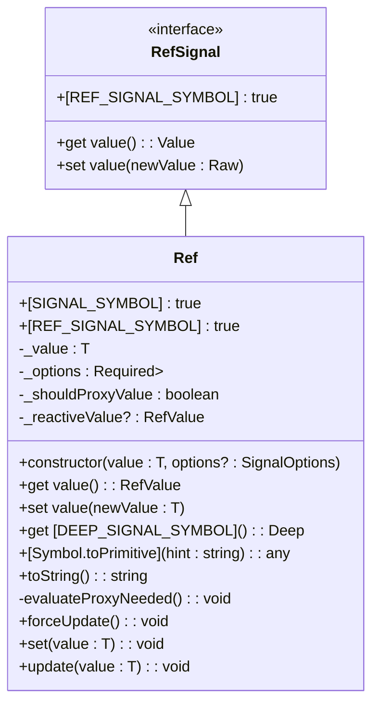
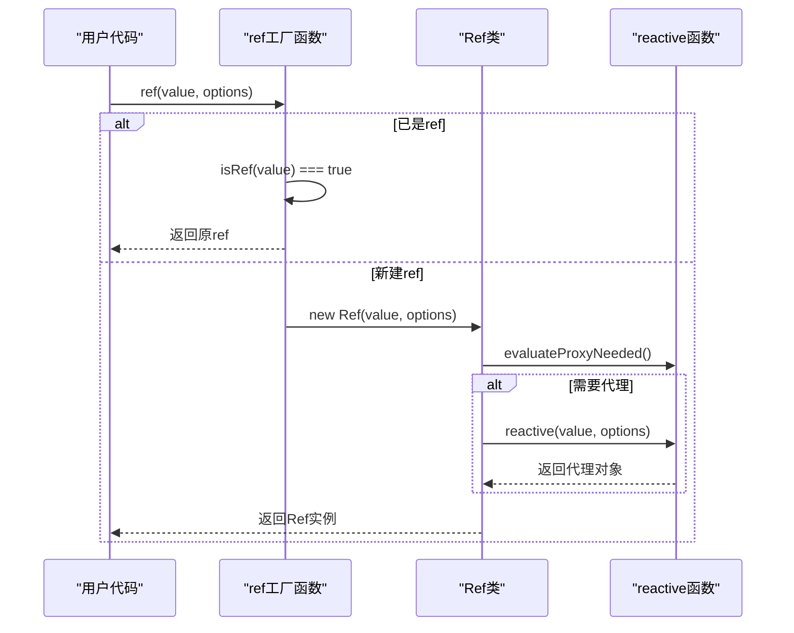
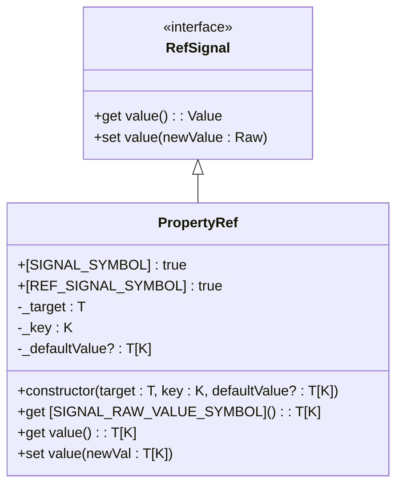
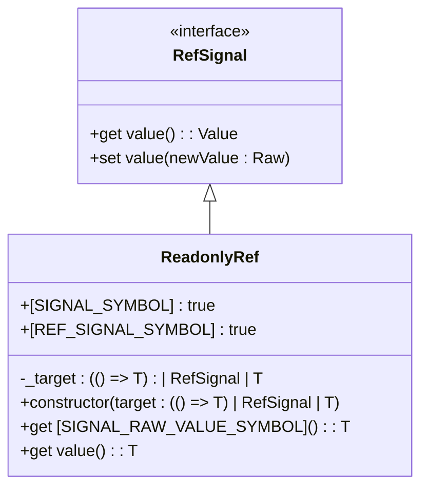
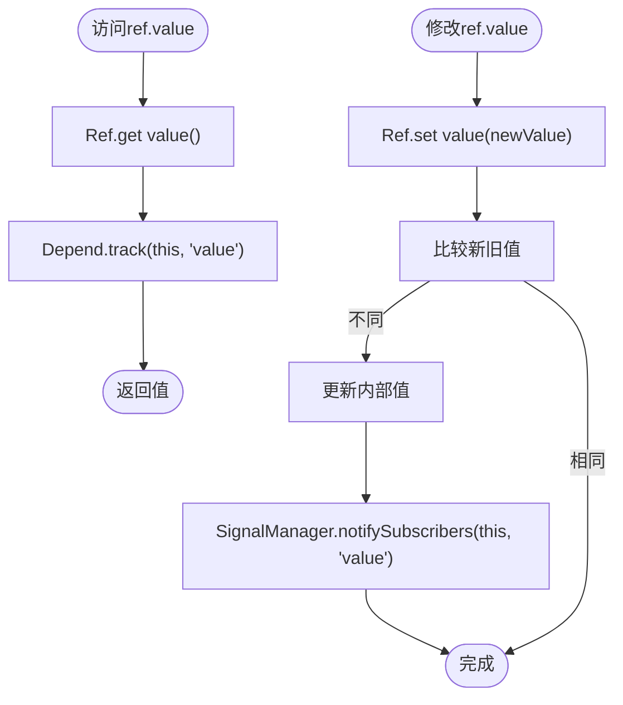
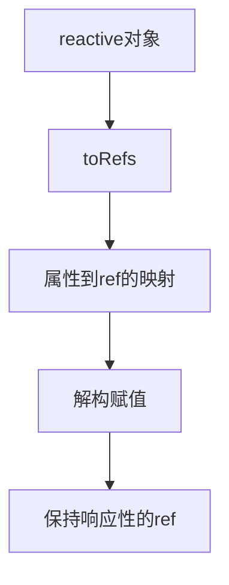

# ref

<cite>
**本文档引用的文件**
- [ref.ts](file://packages/responsive/src/signal/ref/ref.ts)
- [property.ts](file://packages/responsive/src/signal/ref/property.ts)
- [readonly.ts](file://packages/responsive/src/signal/ref/readonly.ts)
- [helpers.ts](file://packages/responsive/src/signal/ref/helpers.ts)
- [constants.ts](file://packages/responsive/src/signal/constants.ts)
- [ref.ts](file://packages/responsive/src/signal/types/ref.ts)
- [depend.ts](file://packages/responsive/src/depend/depend.ts)
- [manager.ts](file://packages/responsive/src/signal/manager.ts)
- [proxy-handler.ts](file://packages/responsive/src/signal/reactive/proxy-handler.ts)
- [verify.ts](file://packages/responsive/src/signal/utils/verify.ts)
- [conversion.ts](file://packages/responsive/src/signal/utils/conversion.ts)
- [mark.ts](file://packages/responsive/src/signal/utils/mark.ts)
</cite>

## 目录
1. [ref 响应式类型详解](#ref-响应式类型详解)
2. [核心组件](#核心组件)
3. [架构概览](#架构概览)
4. [详细组件分析](#详细组件分析)
5. [依赖分析](#依赖分析)
6. [性能考虑](#性能考虑)
7. [故障排除指南](#故障排除指南)
8. [结论](#结论)

## ref 响应式类型详解

Vitarx 中的 `ref` 是响应式系统的核心类型之一，用于创建对值的响应式引用。`ref` 通过封装原始值并利用 getter/setter 实现响应性追踪，当其值发生变化时，会自动触发依赖于它的计算和副作用。

### 设计原理与访问方式

`ref` 对象的设计原理是将一个值包装在一个具有 `value` 属性的对象中。在模板和逻辑中访问 `ref` 的值时，必须使用 `.value` 语法。这种设计有以下几个重要原因：

1. **明确性**：强制使用 `.value` 使开发者清楚地知道正在访问的是一个响应式引用，而不是普通变量。
2. **JavaScript 限制**：JavaScript 本身没有提供拦截对原始值（如字符串、数字）直接赋值的方法。通过对象包装，可以利用 getter/setter 拦截对 `value` 属性的访问和修改。
3. **类型安全**：在 TypeScript 中，这种模式提供了更好的类型推断和检查。

### 源码分析

`ref` 的核心实现位于 `packages/responsive/src/signal/ref/ref.ts` 文件中。`Ref` 类实现了 `RefSignal` 接口，该接口定义了 `value` 属性的 getter 和 setter。



**Diagram sources**
- [ref.ts](file://packages/responsive/src/signal/ref/ref.ts#L10-L23)
- [ref.ts](file://packages/responsive/src/signal/ref/ref.ts#L70-L287)

**Section sources**
- [ref.ts](file://packages/responsive/src/signal/ref/ref.ts#L1-L473)

## 核心组件

`ref` 系统由多个核心组件构成，包括 `Ref` 类、`ref` 工厂函数、`shallowRef`、`readonlyRef` 以及相关的工具函数。

### Ref 类

`Ref` 类是 `ref` 系统的基石。它包含以下关键特性：

- **符号标识**：使用 `SIGNAL_SYMBOL` 和 `REF_SIGNAL_SYMBOL` 来标识这是一个响应式信号对象。
- **深度代理**：通过 `deep` 选项控制是否对对象值进行深度代理。
- **惰性代理**：只有在访问 `value` 且需要时，才会创建内部的响应式代理对象。
- **依赖追踪**：在 getter 中调用 `Depend.track` 来收集依赖。
- **更新通知**：在 setter 中调用 `SignalManager.notifySubscribers` 来通知订阅者。

### 工厂函数

`ref` 函数是一个工厂函数，用于创建 `Ref` 实例。它提供了多种重载，支持直接传入值或配置选项。



**Diagram sources**
- [ref.ts](file://packages/responsive/src/signal/ref/ref.ts#L333-L406)
- [ref.ts](file://packages/responsive/src/signal/ref/ref.ts#L109-L117)

**Section sources**
- [ref.ts](file://packages/responsive/src/signal/ref/ref.ts#L333-L406)

## 架构概览

`ref` 系统与 Vitarx 的其他响应式组件紧密集成，形成了一个完整的响应式生态系统。

```mermaid
graph TB
subgraph "响应式核心"
Ref[Ref类]
Reactive[reactive函数]
Computed[computed函数]
end
subgraph "依赖管理"
Depend[Depend]
SubManager[SubManager]
SignalManager[SignalManager]
end
subgraph "工具函数"
toRef[toRef]
toRefs[toRefs]
unref[unref]
end
Ref --> Depend : track/notify
Reactive --> Depend : track/notify
Computed --> Depend : track/notify
Depend --> SubManager : 订阅管理
SignalManager --> SubManager : 通知订阅者
toRef --> Ref : 创建PropertyRef
toRefs --> toRef : 批量创建
unref --> Ref : 解包值
```

**Diagram sources**
- [ref.ts](file://packages/responsive/src/signal/ref/ref.ts)
- [depend.ts](file://packages/responsive/src/depend/depend.ts)
- [manager.ts](file://packages/responsive/src/signal/manager.ts)
- [helpers.ts](file://packages/responsive/src/signal/ref/helpers.ts)

## 详细组件分析

### PropertyRef 分析

`PropertyRef` 类用于创建对对象属性的响应式引用。它允许将对象的某个属性转换为 `ref`，从而可以在不破坏响应性的前提下传递和使用该属性。



**Diagram sources**
- [property.ts](file://packages/responsive/src/signal/ref/property.ts#L36-L54)

**Section sources**
- [property.ts](file://packages/responsive/src/signal/ref/property.ts#L1-L81)

### ReadonlyRef 分析

`ReadonlyRef` 类用于创建只读的响应式引用。它接受一个 getter 函数，并在每次访问 `value` 时调用该函数来获取最新值。



**Diagram sources**
- [readonly.ts](file://packages/responsive/src/signal/ref/readonly.ts#L33-L73)

**Section sources**
- [readonly.ts](file://packages/responsive/src/signal/ref/readonly.ts#L1-L95)

## 依赖分析

`ref` 的响应性依赖于 Vitarx 的依赖管理系统。当 `ref` 的 `value` 被访问时，会触发依赖收集；当 `value` 被修改时，会触发更新通知。



**Diagram sources**
- [ref.ts](file://packages/responsive/src/signal/ref/ref.ts#L136-L182)
- [depend.ts](file://packages/responsive/src/depend/depend.ts#L59-L64)
- [manager.ts](file://packages/responsive/src/signal/manager.ts#L115-L122)

**Section sources**
- [ref.ts](file://packages/responsive/src/signal/ref/ref.ts#L136-L182)
- [depend.ts](file://packages/responsive/src/depend/depend.ts#L1-L152)
- [manager.ts](file://packages/responsive/src/signal/manager.ts#L1-L153)

## 性能考虑

`ref` 系统在设计时考虑了性能优化：

1. **惰性代理**：只有在访问 `value` 且需要时，才会创建内部的响应式代理对象，避免了不必要的性能开销。
2. **值比较**：在 setter 中使用 `compare` 函数（默认为 `Object.is`）来比较新旧值，避免不必要的更新。
3. **符号标识**：使用 Symbol 来标识响应式对象，避免了属性名冲突，同时提供了高效的类型检查。

## 故障排除指南

### 常见错误：直接解构 ref 导致响应性断裂

一个常见的错误是直接解构 `ref` 对象，这会导致响应性丢失。

```typescript
const state = reactive({
  count: ref(0),
  name: 'Alice'
})

// ❌ 错误：直接解构会丢失响应性
const { count, name } = state
count++ // 不会触发更新

// ✅ 正确：使用 toRefs
const { count, name } = toRefs(state)
count.value++ // 会触发更新
```

### 解决方案

使用 `toRefs` 函数来解构 `reactive` 对象，它可以将对象的每个属性转换为对应的 `ref`，从而保持响应性。



**Diagram sources**
- [helpers.ts](file://packages/responsive/src/signal/ref/helpers.ts#L184-L200)

**Section sources**
- [helpers.ts](file://packages/responsive/src/signal/ref/helpers.ts#L166-L200)

## 结论

`ref` 是 Vitarx 响应式系统中不可或缺的组成部分。它通过巧妙的设计，解决了 JavaScript 原始值无法直接实现响应性的难题。通过理解 `ref` 的工作原理、正确使用 `toRefs` 等辅助函数，开发者可以构建高效、响应式的应用程序。`ref` 与 `reactive`、`computed` 等其他响应式 API 相辅相成，共同构成了 Vitarx 强大而灵活的响应式编程模型。