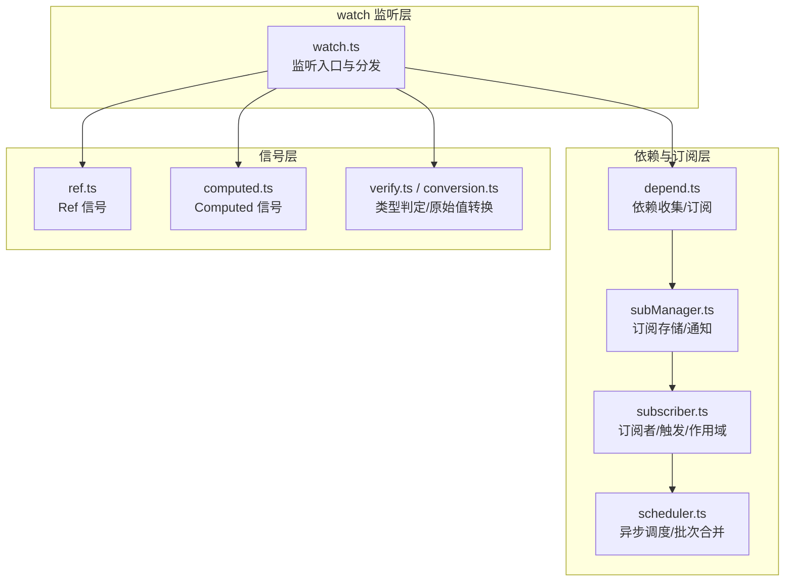
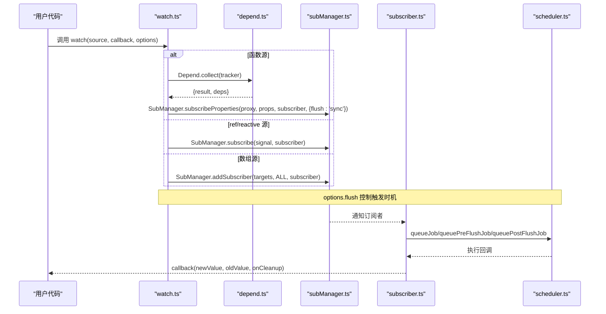
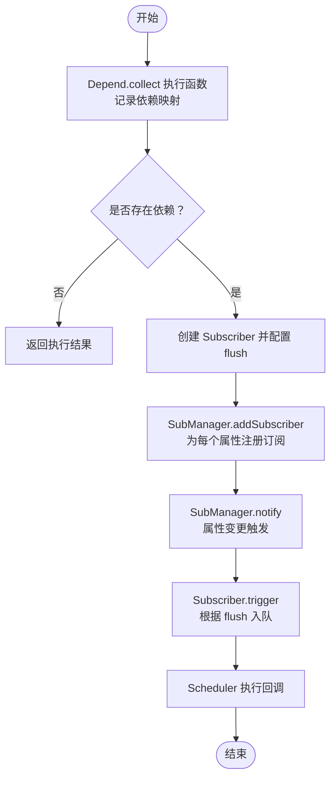
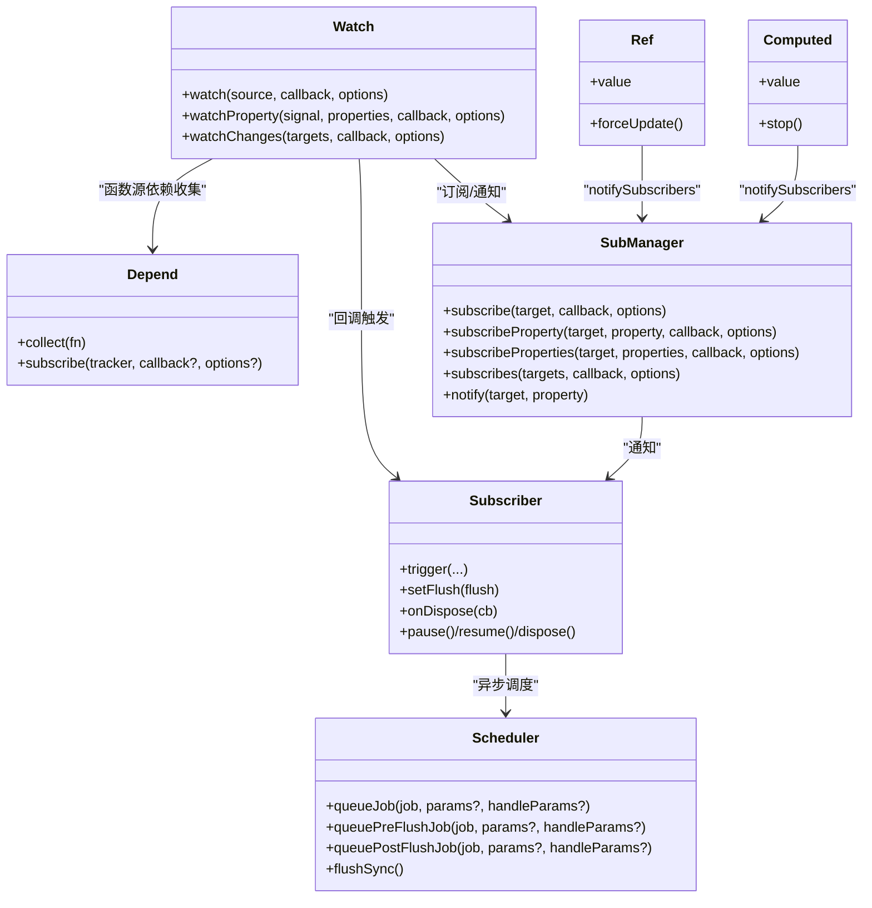

# watch

<cite>
**本文引用的文件**
- [packages/responsive/src/signal/watch/watch.ts](file://packages/responsive/src/signal/watch/watch.ts)
- [packages/responsive/src/signal/watch/index.ts](file://packages/responsive/src/signal/watch/index.ts)
- [packages/responsive/src/observer/subscriber.ts](file://packages/responsive/src/observer/subscriber.ts)
- [packages/responsive/src/observer/subManager.ts](file://packages/responsive/src/observer/subManager.ts)
- [packages/responsive/src/observer/scheduler.ts](file://packages/responsive/src/observer/scheduler.ts)
- [packages/responsive/src/depend/depend.ts](file://packages/responsive/src/depend/depend.ts)
- [packages/responsive/src/signal/ref/ref.ts](file://packages/responsive/src/signal/ref/ref.ts)
- [packages/responsive/src/signal/computed/computed.ts](file://packages/responsive/src/signal/computed/computed.ts)
- [packages/responsive/src/signal/utils/verify.ts](file://packages/responsive/src/signal/utils/verify.ts)
- [packages/responsive/src/signal/utils/conversion.ts](file://packages/responsive/src/signal/utils/conversion.ts)
</cite>

## 目录
1. [简介](#简介)
2. [项目结构](#项目结构)
3. [核心组件](#核心组件)
4. [架构总览](#架构总览)
5. [详细组件分析](#详细组件分析)
6. [依赖关系分析](#依赖关系分析)
7. [性能考量](#性能考量)
8. [故障排查指南](#故障排查指南)
9. [结论](#结论)
10. [附录](#附录)

## 简介
本篇文档围绕 Vitarx 的 watch 数据监听机制展开，系统阐述 watch 如何监听一个或多个响应式数据源（ref、reactive 对象、函数返回值、数组组合）的变化，并在变化时执行副作用回调。文档重点解析 watch 基于 effect 的衍生机制，说明其如何建立依赖关系并在变更时触发回调；同时覆盖执行时机（同步/异步/预/后/同步）、与 computed 的适用场景对比、清理副作用的最佳实践，以及常见问题与解决方案（如无限循环、深层对象性能开销）。

## 项目结构
watch 的实现位于响应式模块的 signal/watch 目录，围绕以下关键文件协同工作：
- watch 实现：packages/responsive/src/signal/watch/watch.ts
- 订阅者与调度：packages/responsive/src/observer/subscriber.ts、packages/responsive/src/observer/scheduler.ts、packages/responsive/src/observer/subManager.ts
- 依赖收集与订阅：packages/responsive/src/depend/depend.ts
- 信号类型与工具：packages/responsive/src/signal/ref/ref.ts、packages/responsive/src/signal/computed/computed.ts、packages/responsive/src/signal/utils/verify.ts、packages/responsive/src/signal/utils/conversion.ts

图表来源
- [packages/responsive/src/signal/watch/watch.ts](file://packages/responsive/src/signal/watch/watch.ts#L1-L296)
- [packages/responsive/src/depend/depend.ts](file://packages/responsive/src/depend/depend.ts#L1-L151)
- [packages/responsive/src/observer/subManager.ts](file://packages/responsive/src/observer/subManager.ts#L1-L424)
- [packages/responsive/src/observer/subscriber.ts](file://packages/responsive/src/observer/subscriber.ts#L1-L248)
- [packages/responsive/src/observer/scheduler.ts](file://packages/responsive/src/observer/scheduler.ts#L1-L326)
- [packages/responsive/src/signal/ref/ref.ts](file://packages/responsive/src/signal/ref/ref.ts#L1-L473)
- [packages/responsive/src/signal/computed/computed.ts](file://packages/responsive/src/signal/computed/computed.ts#L1-L367)
- [packages/responsive/src/signal/utils/verify.ts](file://packages/responsive/src/signal/utils/verify.ts#L1-L85)
- [packages/responsive/src/signal/utils/conversion.ts](file://packages/responsive/src/signal/utils/conversion.ts#L1-L49)

章节来源
- [packages/responsive/src/signal/watch/watch.ts](file://packages/responsive/src/signal/watch/watch.ts#L1-L296)
- [packages/responsive/src/observer/subscriber.ts](file://packages/responsive/src/observer/subscriber.ts#L1-L248)
- [packages/responsive/src/observer/subManager.ts](file://packages/responsive/src/observer/subManager.ts#L1-L424)
- [packages/responsive/src/observer/scheduler.ts](file://packages/responsive/src/observer/scheduler.ts#L1-L326)
- [packages/responsive/src/depend/depend.ts](file://packages/responsive/src/depend/depend.ts#L1-L151)
- [packages/responsive/src/signal/ref/ref.ts](file://packages/responsive/src/signal/ref/ref.ts#L1-L473)
- [packages/responsive/src/signal/computed/computed.ts](file://packages/responsive/src/signal/computed/computed.ts#L1-L367)
- [packages/responsive/src/signal/utils/verify.ts](file://packages/responsive/src/signal/utils/verify.ts#L1-L85)
- [packages/responsive/src/signal/utils/conversion.ts](file://packages/responsive/src/signal/utils/conversion.ts#L1-L49)

## 核心组件
- watch：统一监听入口，支持 ref、reactive 对象、函数返回值、数组组合；提供 immediate、clone、flush、limit、scope 等选项；内置清理回调 onCleanup。
- Subscriber：订阅者基类，封装触发时机（default/pre/post/sync）、次数限制、作用域管理、错误上报与销毁。
- SubManager：订阅存储与通知中心，维护 WeakMap 结构的订阅映射，支持属性级订阅、全局订阅、多对象订阅、即时订阅等。
- Scheduler：三阶段调度器（preFlush/main/postFlush），基于微任务批处理，支持参数合并与递归保护。
- Depend：依赖收集与订阅，支持收集函数执行期间访问的响应式属性，建立订阅关系。
- Ref/Computed：信号实现，提供 value 访问与更新路径，驱动 SubManager 通知。

章节来源
- [packages/responsive/src/signal/watch/watch.ts](file://packages/responsive/src/signal/watch/watch.ts#L148-L296)
- [packages/responsive/src/observer/subscriber.ts](file://packages/responsive/src/observer/subscriber.ts#L1-L248)
- [packages/responsive/src/observer/subManager.ts](file://packages/responsive/src/observer/subManager.ts#L1-L424)
- [packages/responsive/src/observer/scheduler.ts](file://packages/responsive/src/observer/scheduler.ts#L1-L326)
- [packages/responsive/src/depend/depend.ts](file://packages/responsive/src/depend/depend.ts#L1-L151)
- [packages/responsive/src/signal/ref/ref.ts](file://packages/responsive/src/signal/ref/ref.ts#L1-L473)
- [packages/responsive/src/signal/computed/computed.ts](file://packages/responsive/src/signal/computed/computed.ts#L1-L367)

## 架构总览
watch 的执行链路如下：
- 输入源识别：函数源 → 依赖收集与订阅；ref/reactive 源 → 直接订阅；数组源 → 绑定父子关系并订阅。
- 依赖建立：依赖收集（Depend.collect）记录访问的属性；SubManager.addSubscriber 建立订阅；Scheduler 进行异步调度。
- 回调触发：SubManager.notify → Subscriber.trigger → Scheduler.queueJob/queuePreFlushJob/queuePostFlushJob → 回调执行。
- 清理与销毁：onCleanup 注册清理函数；SubManager/Subscriber 生命周期管理；作用域自动回收。

图表来源
- [packages/responsive/src/signal/watch/watch.ts](file://packages/responsive/src/signal/watch/watch.ts#L192-L296)
- [packages/responsive/src/depend/depend.ts](file://packages/responsive/src/depend/depend.ts#L66-L151)
- [packages/responsive/src/observer/subManager.ts](file://packages/responsive/src/observer/subManager.ts#L108-L206)
- [packages/responsive/src/observer/subscriber.ts](file://packages/responsive/src/observer/subscriber.ts#L168-L247)
- [packages/responsive/src/observer/scheduler.ts](file://packages/responsive/src/observer/scheduler.ts#L84-L126)

## 详细组件分析

### watch 监听器实现与执行时机
- 监听源类型与分支：
  - 函数源：通过 Depend.subscribe 收集依赖，建立属性级订阅，依赖变化时回调执行；支持 immediate 立即触发一次。
  - ref/reactive 源：直接创建 Subscriber，订阅信号属性变化；支持 immediate 触发；支持 clone 深度克隆新旧值。
  - 数组源：数组元素必须包含至少一个信号对象，绑定父子关系，整体变化时触发回调；支持 immediate。
- 执行时机 flush：
  - default：进入主队列，微任务批处理。
  - pre：进入准备阶段队列，先于主队列执行。
  - post：进入清理阶段队列，后于主队列执行。
  - sync：同步触发，不使用批处理。
- 清理回调 onCleanup：在每次回调触发前执行，适合释放定时器、取消网络请求等资源。
- clone 选项：针对对象引用导致新旧值相等的问题，开启深度克隆以区分新旧对象。

章节来源
- [packages/responsive/src/signal/watch/watch.ts](file://packages/responsive/src/signal/watch/watch.ts#L148-L296)
- [packages/responsive/src/observer/subscriber.ts](file://packages/responsive/src/observer/subscriber.ts#L1-L248)
- [packages/responsive/src/observer/scheduler.ts](file://packages/responsive/src/observer/scheduler.ts#L1-L326)

### 依赖收集与订阅建立（基于 effect 的衍生机制）
- 依赖收集：Depend.collect 在上下文中执行函数，记录访问的响应式对象与属性，形成依赖映射。
- 订阅建立：SubManager.subscribeProperties 为每个属性建立订阅；SubManager.addSubscriber 将订阅者放入 WeakMap 存储。
- 订阅触发：SubManager.notify 遍历属性订阅集合，调用 Subscriber.trigger；Subscriber 根据 flush 选择调度器队列。
- 计算属性联动：Computed 在依赖变化时通过 Subscriber(sync) 通知，从而触发 watch 回调。

图表来源
- [packages/responsive/src/depend/depend.ts](file://packages/responsive/src/depend/depend.ts#L66-L151)
- [packages/responsive/src/observer/subManager.ts](file://packages/responsive/src/observer/subManager.ts#L108-L206)
- [packages/responsive/src/observer/subscriber.ts](file://packages/responsive/src/observer/subscriber.ts#L168-L247)
- [packages/responsive/src/observer/scheduler.ts](file://packages/responsive/src/observer/scheduler.ts#L84-L126)

章节来源
- [packages/responsive/src/depend/depend.ts](file://packages/responsive/src/depend/depend.ts#L1-L151)
- [packages/responsive/src/observer/subManager.ts](file://packages/responsive/src/observer/subManager.ts#L1-L424)
- [packages/responsive/src/observer/subscriber.ts](file://packages/responsive/src/observer/subscriber.ts#L1-L248)
- [packages/responsive/src/observer/scheduler.ts](file://packages/responsive/src/observer/scheduler.ts#L1-L326)

### 与 computed 的适用场景对比
- 计算属性（Computed）：懒计算，首次访问或依赖变化时重新计算并缓存；适合“读取型”的派生数据，避免在模板中重复计算。
- 副作用监听（watch）：主动监听变化并执行副作用（日志、请求、定时器等）；适合需要在数据变化时执行外部操作的场景。
- 二者配合：watch 可监听 computed 的 value 变化，实现“计算结果变化时的副作用”。

章节来源
- [packages/responsive/src/signal/computed/computed.ts](file://packages/responsive/src/signal/computed/computed.ts#L1-L367)
- [packages/responsive/src/signal/watch/watch.ts](file://packages/responsive/src/signal/watch/watch.ts#L148-L296)

### 清理副作用与资源管理
- onCleanup：在每次回调触发前执行，适合清理定时器、取消请求、移除事件监听等。
- Subscriber 生命周期：dispose/pause/resume/onDispose 提供完整生命周期管理；作用域（EffectScope）自动回收订阅者。
- 计算属性清理：stop() 停止依赖监听并释放资源。

章节来源
- [packages/responsive/src/signal/watch/watch.ts](file://packages/responsive/src/signal/watch/watch.ts#L192-L296)
- [packages/responsive/src/observer/subscriber.ts](file://packages/responsive/src/observer/subscriber.ts#L1-L248)
- [packages/responsive/src/signal/computed/computed.ts](file://packages/responsive/src/signal/computed/computed.ts#L250-L367)

### 实际使用示例（路径指引）
- 监听 ref：参考 watch 对 ref 信号的处理与 immediate 行为。
  - 示例路径：[packages/responsive/src/signal/watch/watch.ts](file://packages/responsive/src/signal/watch/watch.ts#L244-L259)
- 监听 reactive 对象：参考 watch 对信号的订阅与 clone 选项。
  - 示例路径：[packages/responsive/src/signal/watch/watch.ts](file://packages/responsive/src/signal/watch/watch.ts#L244-L259)
- 监听函数返回值：参考 watch 对函数源的依赖收集与立即触发。
  - 示例路径：[packages/responsive/src/signal/watch/watch.ts](file://packages/responsive/src/signal/watch/watch.ts#L216-L241)
- 监听多个信号（数组）：参考 watch 对数组源的绑定与触发。
  - 示例路径：[packages/responsive/src/signal/watch/watch.ts](file://packages/responsive/src/signal/watch/watch.ts#L260-L291)
- 属性级监听（watchProperty）：参考 watchProperty 的实现与 immediate 选项。
  - 示例路径：[packages/responsive/src/signal/watch/watch.ts](file://packages/responsive/src/signal/watch/watch.ts#L411-L431)
- 多对象变更监听（watchChanges）：参考 watchChanges 的封装与 flush 选项。
  - 示例路径：[packages/responsive/src/signal/watch/watch.ts](file://packages/responsive/src/signal/watch/watch.ts#L347-L353)

## 依赖关系分析
- watch 与依赖系统：
  - 函数源：依赖收集 → 订阅属性 → 依赖变化触发回调。
  - ref/reactive：直接订阅信号属性 → 变化触发回调。
  - 数组源：绑定父子关系 → 整体变化触发回调。
- 订阅与调度：
  - SubManager 维护订阅存储，notify 驱动 Subscriber.trigger。
  - Subscriber 根据 flush 选择 Scheduler 的不同队列。
- 信号实现：
  - Ref/Computed 的 value 访问与更新路径驱动 SubManager.notify。

图表来源
- [packages/responsive/src/signal/watch/watch.ts](file://packages/responsive/src/signal/watch/watch.ts#L148-L431)
- [packages/responsive/src/depend/depend.ts](file://packages/responsive/src/depend/depend.ts#L66-L151)
- [packages/responsive/src/observer/subManager.ts](file://packages/responsive/src/observer/subManager.ts#L108-L206)
- [packages/responsive/src/observer/subscriber.ts](file://packages/responsive/src/observer/subscriber.ts#L1-L248)
- [packages/responsive/src/observer/scheduler.ts](file://packages/responsive/src/observer/scheduler.ts#L1-L326)
- [packages/responsive/src/signal/ref/ref.ts](file://packages/responsive/src/signal/ref/ref.ts#L1-L473)
- [packages/responsive/src/signal/computed/computed.ts](file://packages/responsive/src/signal/computed/computed.ts#L1-L367)

章节来源
- [packages/responsive/src/signal/watch/watch.ts](file://packages/responsive/src/signal/watch/watch.ts#L148-L431)
- [packages/responsive/src/depend/depend.ts](file://packages/responsive/src/depend/depend.ts#L1-L151)
- [packages/responsive/src/observer/subManager.ts](file://packages/responsive/src/observer/subManager.ts#L1-L424)
- [packages/responsive/src/observer/subscriber.ts](file://packages/responsive/src/observer/subscriber.ts#L1-L248)
- [packages/responsive/src/observer/scheduler.ts](file://packages/responsive/src/observer/scheduler.ts#L1-L326)
- [packages/responsive/src/signal/ref/ref.ts](file://packages/responsive/src/signal/ref/ref.ts#L1-L473)
- [packages/responsive/src/signal/computed/computed.ts](file://packages/responsive/src/signal/computed/computed.ts#L1-L367)

## 性能考量
- 深度克隆 clone：当监听对象且需要区分新旧值时可启用，但会带来额外性能开销，建议谨慎使用。
- flush 选择：
  - default/post：微任务批处理，减少重复渲染与回调，适合大多数场景。
  - pre：在组件更新前执行，适合需要提前准备的副作用。
  - sync：同步触发，适合需要立即可见的场景，但可能导致频繁触发与抖动。
- limit：限制触发次数，避免无限循环或过度执行。
- computed 与懒计算：避免在模板中重复计算，减少不必要的依赖追踪。
- 数组监听：确保数组中至少包含一个信号对象，避免无效监听。

章节来源
- [packages/responsive/src/signal/watch/watch.ts](file://packages/responsive/src/signal/watch/watch.ts#L48-L96)
- [packages/responsive/src/observer/subscriber.ts](file://packages/responsive/src/observer/subscriber.ts#L1-L248)
- [packages/responsive/src/observer/scheduler.ts](file://packages/responsive/src/observer/scheduler.ts#L1-L326)
- [packages/responsive/src/signal/computed/computed.ts](file://packages/responsive/src/signal/computed/computed.ts#L1-L367)

## 故障排查指南
- 无限循环触发：
  - 症状：回调反复执行。
  - 排查：确认回调内部是否修改了被监听的响应式数据；使用 limit 限制触发次数；必要时改为 sync 并在回调内避免写回。
  - 参考：[packages/responsive/src/observer/subscriber.ts](file://packages/responsive/src/observer/subscriber.ts#L168-L247)
- 监听深层对象性能开销：
  - 症状：频繁变更导致大量回调。
  - 解决：使用 watchProperty 监听具体属性；或使用 shallowRef/ref 降低代理层级；合理使用 flush。
  - 参考：[packages/responsive/src/signal/watch/watch.ts](file://packages/responsive/src/signal/watch/watch.ts#L260-L291)
- clone 选项误用：
  - 症状：对象引用相同导致无法区分新旧值。
  - 解决：启用 clone；或在回调中自行深拷贝。
  - 参考：[packages/responsive/src/signal/watch/watch.ts](file://packages/responsive/src/signal/watch/watch.ts#L127-L130)
- 清理资源遗漏：
  - 症状：定时器/请求泄漏。
  - 解决：使用 onCleanup 注册清理函数；确保作用域销毁时自动回收。
  - 参考：[packages/responsive/src/signal/watch/watch.ts](file://packages/responsive/src/signal/watch/watch.ts#L192-L241)
- 数组监听无效：
  - 症状：数组中无信号对象导致报错。
  - 解决：确保数组元素至少包含一个信号对象；或改用对象属性监听。
  - 参考：[packages/responsive/src/signal/watch/watch.ts](file://packages/responsive/src/signal/watch/watch.ts#L260-L291)

章节来源
- [packages/responsive/src/signal/watch/watch.ts](file://packages/responsive/src/signal/watch/watch.ts#L127-L130)
- [packages/responsive/src/observer/subscriber.ts](file://packages/responsive/src/observer/subscriber.ts#L168-L247)

## 结论
watch 通过依赖收集与订阅机制，将响应式数据的变化转化为可预期的副作用执行；借助 Subscriber 的触发时机控制与 Scheduler 的批处理能力，兼顾性能与一致性。与 computed 相比，watch 更适合执行副作用，computed 更适合读取型派生数据。合理使用 flush、limit、clone、onCleanup 等选项，可有效避免性能问题与资源泄漏，构建稳定高效的响应式应用。

## 附录
- 常用选项速览
  - flush：default/pre/post/sync
  - limit：触发次数限制
  - scope：作用域自动回收
  - clone：深度克隆新旧值
  - immediate：立即执行一次回调
- 类型与工具
  - isSignal/isRefSignal/isProxySignal：信号类型判定
  - toRaw：信号转原始值

章节来源
- [packages/responsive/src/signal/utils/verify.ts](file://packages/responsive/src/signal/utils/verify.ts#L1-L85)
- [packages/responsive/src/signal/utils/conversion.ts](file://packages/responsive/src/signal/utils/conversion.ts#L1-L49)