# 响应式系统

<cite>
**本文档引用的文件**   
- [ref.ts](file://packages/responsive/src/signal/ref/ref.ts)
- [proxy-handler.ts](file://packages/responsive/src/signal/reactive/proxy-handler.ts)
- [computed.ts](file://packages/responsive/src/signal/computed/computed.ts)
- [watch.ts](file://packages/responsive/src/signal/watch/watch.ts)
- [manager.ts](file://packages/responsive/src/signal/manager.ts)
- [depend.ts](file://packages/responsive/src/depend/depend.ts)
- [subManager.ts](file://packages/responsive/src/observer/subManager.ts)
- [subscriber.ts](file://packages/responsive/src/observer/subscriber.ts)
- [constants.ts](file://packages/responsive/src/signal/constants.ts)
</cite>

## 目录
1. [引言](#引言)
2. [核心响应式API](#核心响应式api)
3. [响应式对象创建机制](#响应式对象创建机制)
4. [依赖追踪模型](#依赖追踪模型)
5. [副作用与调度机制](#副作用与调度机制)
6. [计算属性实现](#计算属性实现)
7. [数据监听系统](#数据监听系统)
8. [解构响应性保持](#解构响应性保持)
9. [只读响应式实现](#只读响应式实现)
10. [常见误区与解决方案](#常见误区与解决方案)

## 引言

Vitarx 的响应式系统基于 Proxy 代理和依赖追踪机制，提供了一套完整的响应式编程解决方案。系统通过 `ref`、`reactive`、`computed` 和 `watch` 等核心API，实现了数据的自动追踪和更新。响应式系统采用信号（Signal）架构，通过 `SIGNAL_SYMBOL` 等符号标识响应式对象，确保类型安全和运行时识别。

**Section sources**
- [constants.ts](file://packages/responsive/src/signal/constants.ts#L4-L25)

## 核心响应式API

### ref 响应式引用

`ref` 是响应式系统的基础单元，用于包装基本类型或对象，使其成为响应式数据。`ref` 通过 `value` 属性访问和修改值，当值发生变化时会触发依赖更新。

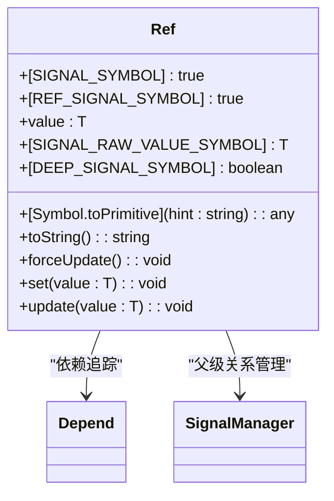

**Diagram sources**
- [ref.ts](file://packages/responsive/src/signal/ref/ref.ts#L70-L287)
- [depend.ts](file://packages/responsive/src/depend/depend.ts#L59-L64)
- [manager.ts](file://packages/responsive/src/signal/manager.ts#L39-L69)

### reactive 响应式对象

`reactive` 用于创建响应式对象，通过 Proxy 代理实现属性的拦截和追踪。所有对象属性都会被自动转换为响应式，支持深度代理。

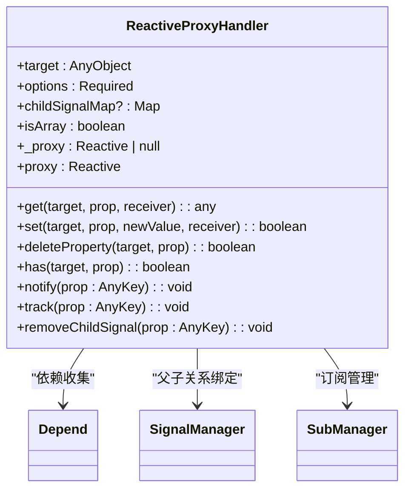

**Diagram sources**
- [proxy-handler.ts](file://packages/responsive/src/signal/reactive/proxy-handler.ts#L83-L300)
- [depend.ts](file://packages/responsive/src/depend/depend.ts#L59-L64)
- [manager.ts](file://packages/responsive/src/signal/manager.ts#L39-L69)
- [subManager.ts](file://packages/responsive/src/observer/subManager.ts#L77-L91)

## 响应式对象创建机制

### ref 创建流程

`ref` 的创建过程包括值验证、选项配置和代理评估。当包装对象且启用深度代理时，会创建响应式代理对象。

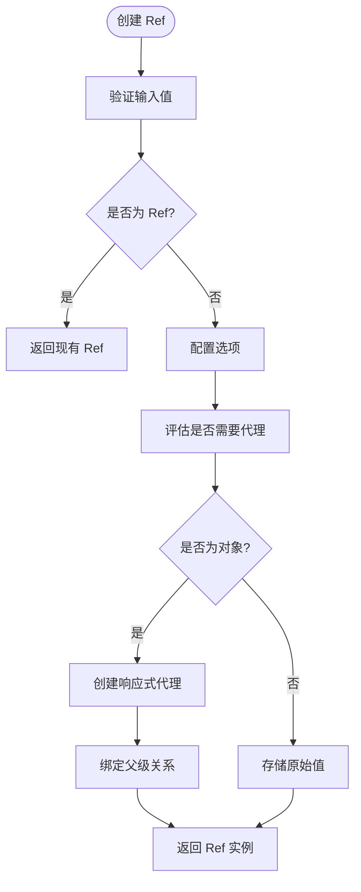

**Diagram sources**
- [ref.ts](file://packages/responsive/src/signal/ref/ref.ts#L109-L181)
- [proxy-handler.ts](file://packages/responsive/src/signal/reactive/proxy-handler.ts#L378-L397)

### reactive 创建流程

`reactive` 通过 `ReactiveProxyHandler` 创建代理对象，实现属性的拦截和追踪。系统会根据对象类型选择不同的代理策略。

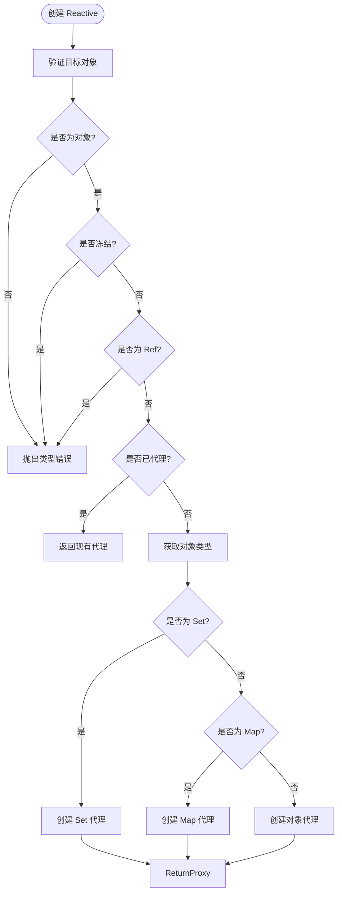

**Diagram sources**
- [proxy-handler.ts](file://packages/responsive/src/signal/reactive/proxy-handler.ts#L378-L397)
- [ref.ts](file://packages/responsive/src/signal/ref/ref.ts#L110-L114)

## 依赖追踪模型

### 依赖收集流程

依赖追踪系统通过 `Depend` 类实现，当访问响应式属性时会自动收集依赖关系。

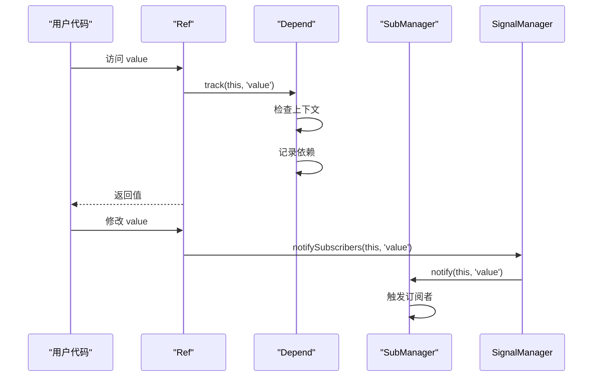

**Diagram sources**
- [ref.ts](file://packages/responsive/src/signal/ref/ref.ts#L136-L146)
- [depend.ts](file://packages/responsive/src/depend/depend.ts#L59-L64)
- [manager.ts](file://packages/responsive/src/signal/manager.ts#L115-L122)
- [subManager.ts](file://packages/responsive/src/observer/subManager.ts#L77-L91)

### 依赖关系图

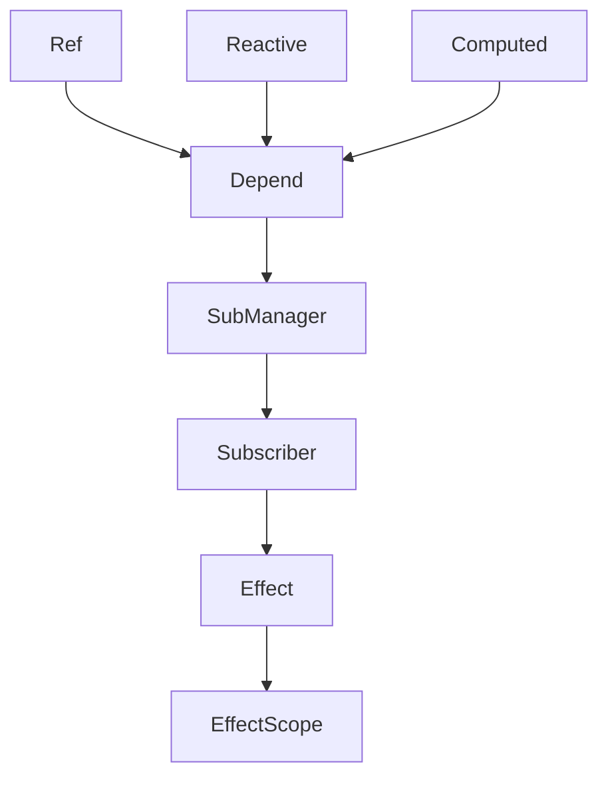

**Diagram sources**
- [ref.ts](file://packages/responsive/src/signal/ref/ref.ts)
- [proxy-handler.ts](file://packages/responsive/src/signal/reactive/proxy-handler.ts)
- [computed.ts](file://packages/responsive/src/signal/computed/computed.ts)
- [depend.ts](file://packages/responsive/src/depend/depend.ts)
- [subManager.ts](file://packages/responsive/src/observer/subManager.ts)
- [subscriber.ts](file://packages/responsive/src/observer/subscriber.ts)

## 副作用与调度机制

### Effect 与 Scheduler

副作用系统通过 `Effect` 和 `Scheduler` 实现，支持不同的调度模式。

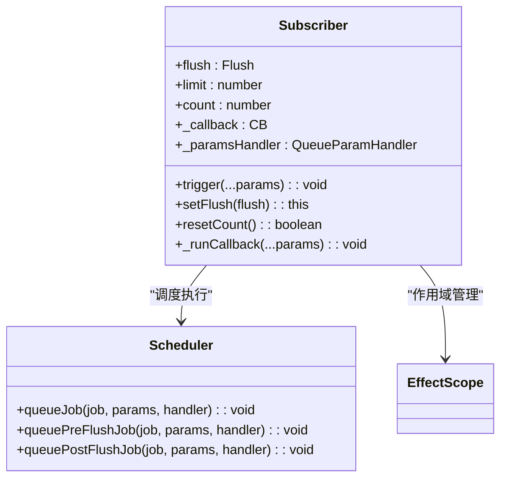

**Diagram sources**
- [subscriber.ts](file://packages/responsive/src/observer/subscriber.ts#L98-L247)
- [scheduler.ts](file://packages/responsive/src/observer/scheduler.ts)
- [effect-scope.ts](file://packages/responsive/src/effect/effect-scope.ts)

### 调度流程

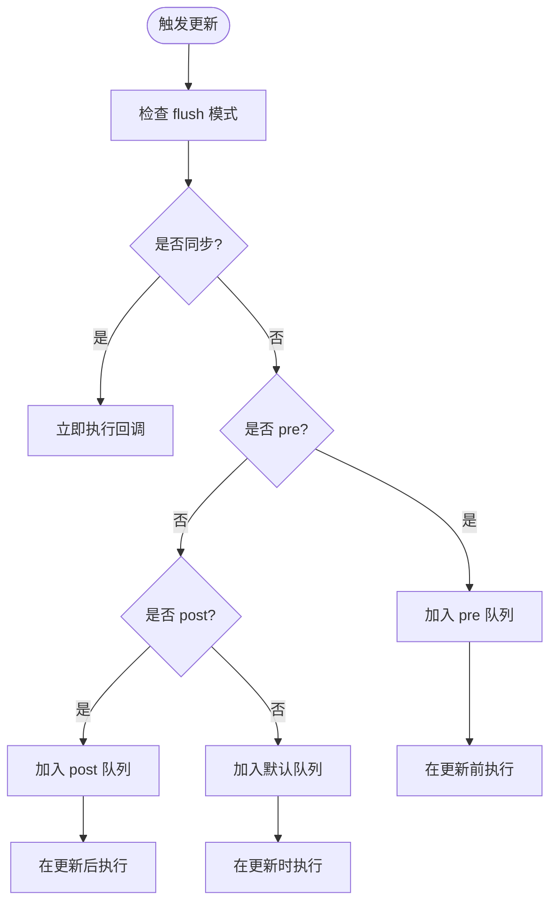

**Diagram sources**
- [subscriber.ts](file://packages/responsive/src/observer/subscriber.ts#L180-L194)
- [scheduler.ts](file://packages/responsive/src/observer/scheduler.ts)

## 计算属性实现

### Computed 类结构

`computed` 实现了懒计算和缓存机制，只有在依赖变化时才会重新计算。

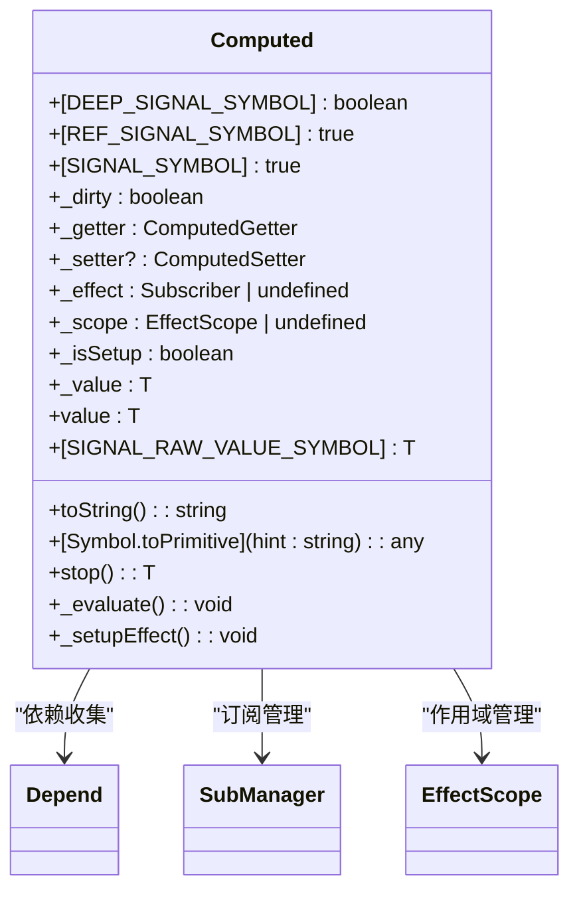

**Diagram sources**
- [computed.ts](file://packages/responsive/src/signal/computed/computed.ts#L98-L366)
- [depend.ts](file://packages/responsive/src/depend/depend.ts#L75-L79)
- [subManager.ts](file://packages/responsive/src/observer/subManager.ts#L123-L131)

### 计算属性流程

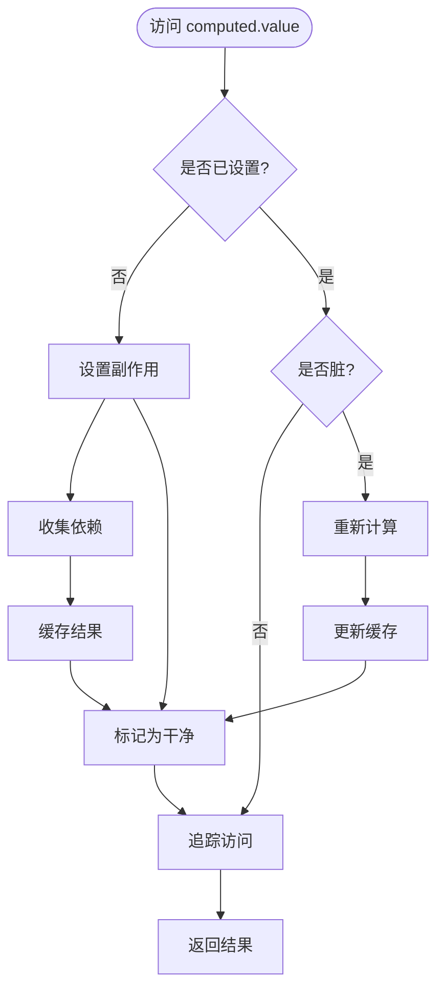

**Diagram sources**
- [computed.ts](file://packages/responsive/src/signal/computed/computed.ts#L202-L217)
- [depend.ts](file://packages/responsive/src/depend/depend.ts#L75-L79)

## 数据监听系统

### watch 实现机制

`watch` 系统支持监听信号、函数和数组，提供灵活的数据变化响应。

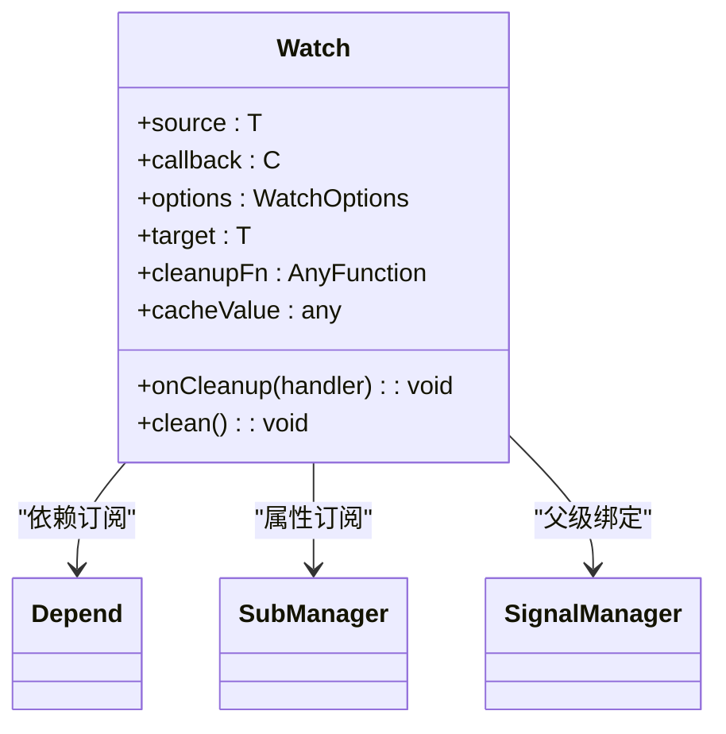

**Diagram sources**
- [watch.ts](file://packages/responsive/src/signal/watch/watch.ts#L192-L295)
- [depend.ts](file://packages/responsive/src/depend/depend.ts#L129-L151)
- [subManager.ts](file://packages/responsive/src/observer/subManager.ts#L149-L157)

### 监听类型处理

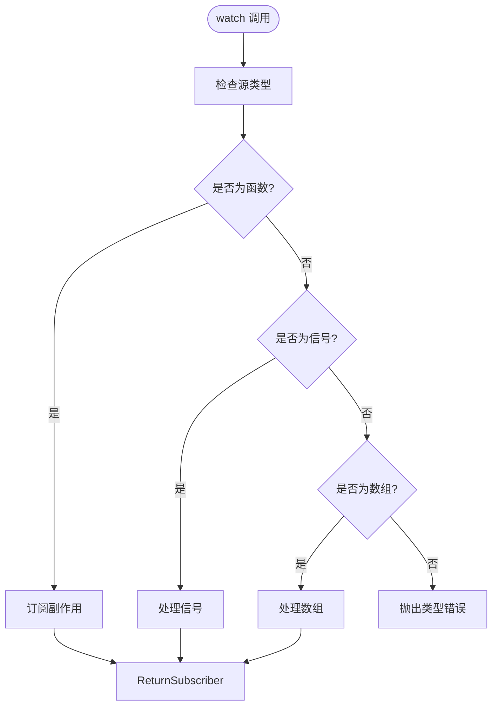

**Diagram sources**
- [watch.ts](file://packages/responsive/src/signal/watch/watch.ts#L192-L295)

## 解构响应性保持

### toRefs 实现

`toRefs` 将响应式对象的每个属性转换为 ref，保持解构后的响应性。

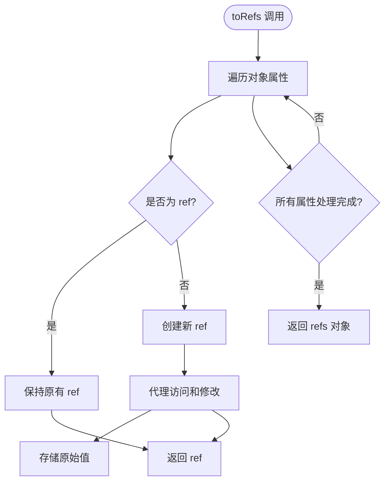

**Section sources**
- [ref.ts](file://packages/responsive/src/signal/ref/ref.ts#L39-L41)
- [utils/conversion.ts](file://packages/responsive/src/signal/utils/conversion.ts)

## 只读响应式实现

### readonly 机制

`readonly` 创建只读的响应式代理，禁止属性修改。

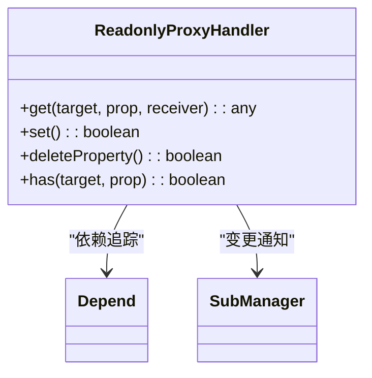

**Section sources**
- [readonly/readonly.ts](file://packages/responsive/src/signal/readonly/readonly.ts)
- [proxy-handler.ts](file://packages/responsive/src/signal/reactive/proxy-handler.ts)

## 常见误区与解决方案

### 响应性丢失场景

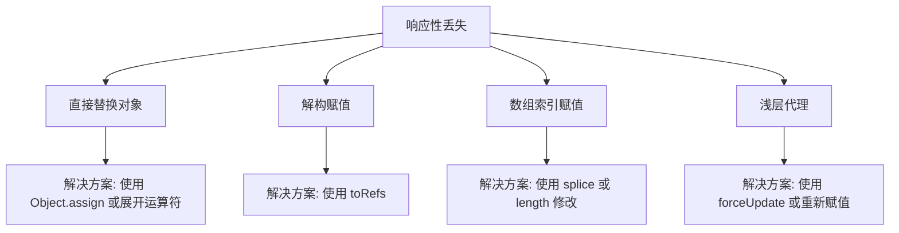

**Section sources**
- [ref.ts](file://packages/responsive/src/signal/ref/ref.ts#L171-L182)
- [proxy-handler.ts](file://packages/responsive/src/signal/reactive/proxy-handler.ts#L251-L263)
- [manager.ts](file://packages/responsive/src/signal/manager.ts#L144-L152)

### 信号架构差异

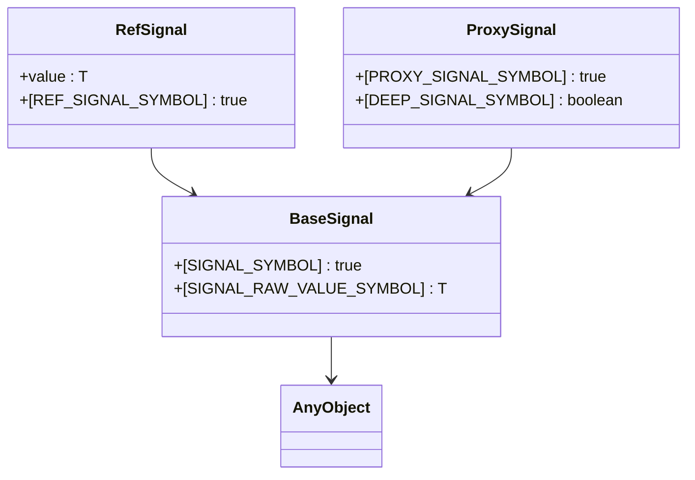

**Diagram sources**
- [types/base.ts](file://packages/responsive/src/signal/types/base.ts)
- [types/ref.ts](file://packages/responsive/src/signal/types/ref.ts)
- [types/proxy.ts](file://packages/responsive/src/signal/types/proxy.ts)
- [constants.ts](file://packages/responsive/src/signal/constants.ts#L4-L25)