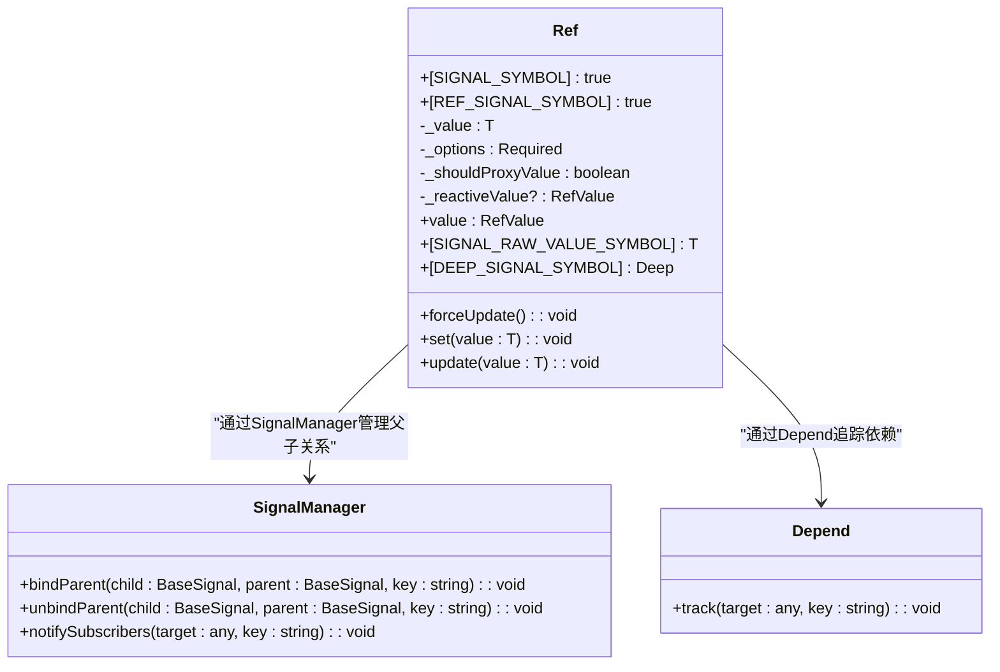
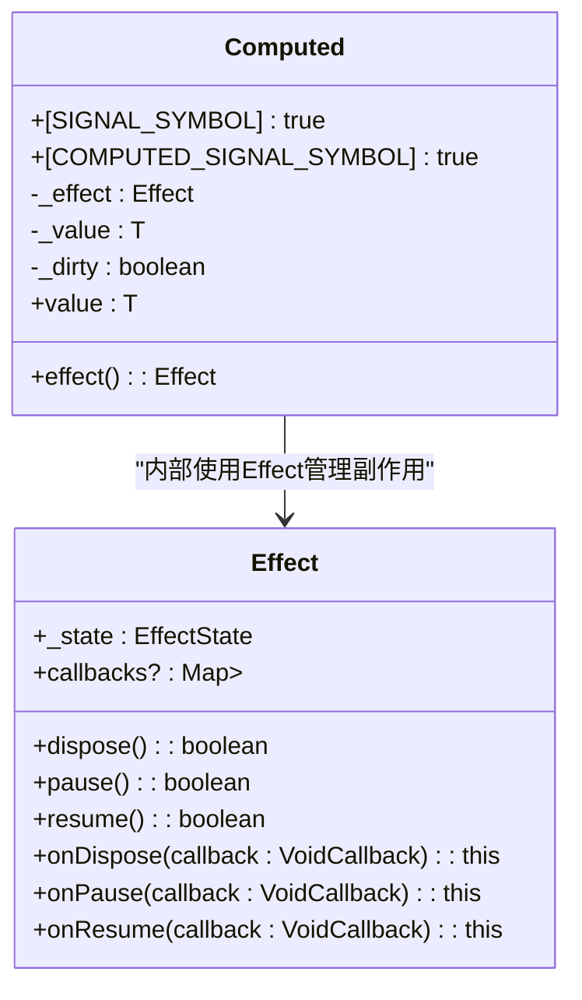
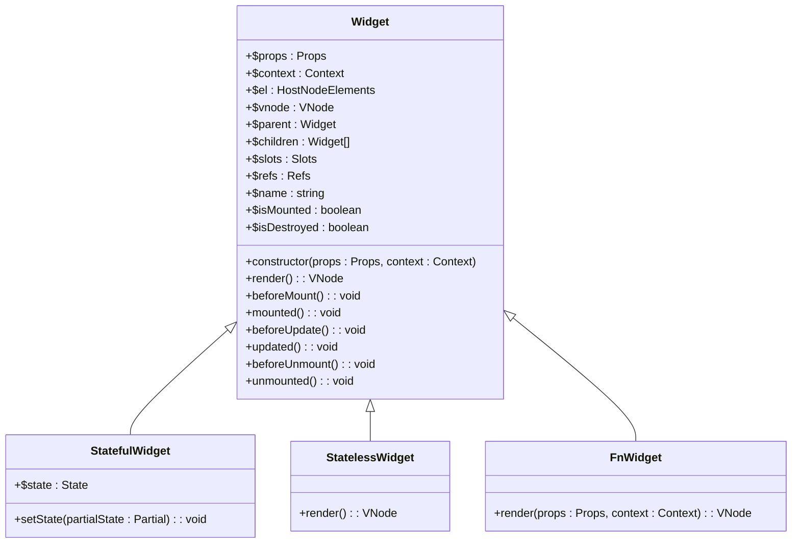
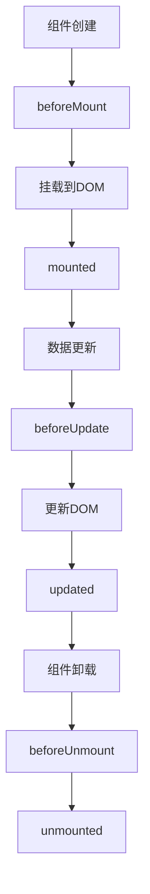
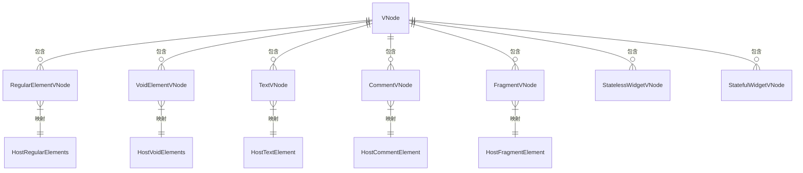
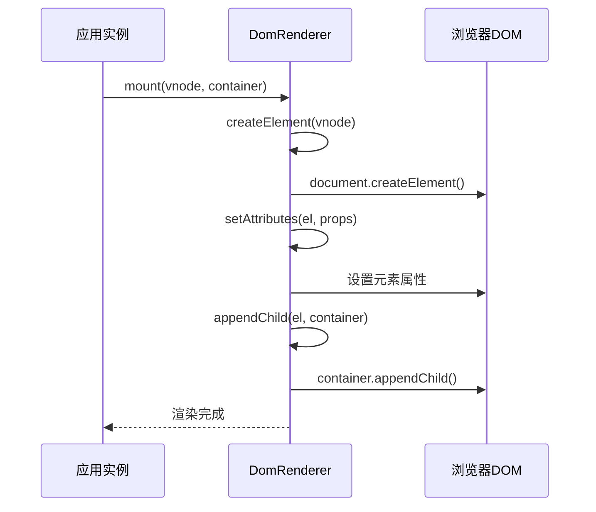
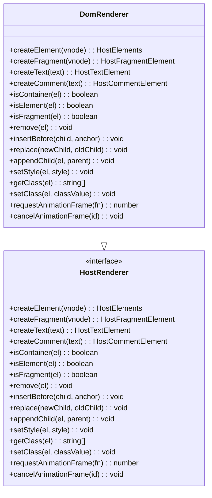

# 核心概念

<cite>
**本文档引用的文件**
- [ref.ts](file://packages/responsive/src/signal/ref/ref.ts)
- [reactive/index.ts](file://packages/responsive/src/signal/reactive/index.ts)
- [computed.ts](file://packages/responsive/src/signal/computed/computed.ts)
- [watch.ts](file://packages/responsive/src/signal/watch/watch.ts)
- [effect.ts](file://packages/responsive/src/effect/effect.ts)
- [vnode.ts](file://packages/runtime-core/src/types/vnode.ts)
- [DomRenderer.ts](file://packages/runtime-dom/src/DomRenderer.ts)
- [renderer/api.ts](file://packages/runtime-core/src/renderer/api.ts)
- [Widget.ts](file://packages/runtime-core/src/widget/base/Widget.ts)
- [Stateful.ts](file://packages/runtime-core/src/widget/runtime/Stateful.ts)
- [Stateless.ts](file://packages/runtime-core/src/widget/runtime/Stateless.ts)
</cite>

## 目录
1. [引言](#引言)
2. [响应式系统](#响应式系统)
3. [组件系统](#组件系统)
4. [虚拟 DOM 与 Diff 算法](#虚拟-dom-与-diff-算法)
5. [渲染机制](#渲染机制)
6. [概念协作关系](#概念协作关系)

## 引言
Vitarx 是一个现代化的前端框架，其核心概念体系围绕响应式系统、组件系统和虚拟 DOM 构建。本文档系统阐述这些核心概念的设计原理与实现机制，为开发者建立完整的框架认知模型。通过深入分析源码实现，我们将揭示框架内部的工作原理，帮助开发者更好地理解和使用 Vitarx。

## 响应式系统

Vitarx 的响应式系统是框架的核心，它基于 Proxy 实现了高效的依赖追踪和自动更新机制。系统提供了 `ref`、`reactive`、`computed` 和 `watch` 等核心 API，构成了一个完整的响应式编程模型。

### 响应式基础：ref 与 reactive

`ref` 和 `reactive` 是创建响应式数据的两种主要方式。`ref` 用于包装基本类型或对象，使其值具有响应性。当 `ref` 对象的 `value` 属性被访问时，会自动追踪依赖；当 `value` 被修改时，会通知所有依赖于它的副作用函数重新执行。



**图示来源**
- [ref.ts](file://packages/responsive/src/signal/ref/ref.ts#L70-L287)
- [manager.ts](file://packages/responsive/src/signal/manager.ts)
- [depend.ts](file://packages/responsive/src/depend/depend.ts)

`reactive` 则通过 Proxy 代理整个对象，使得对象的所有属性访问和修改都具有响应性。它与 `ref` 的主要区别在于，`reactive` 直接代理对象本身，而 `ref` 是通过 `value` 属性进行包装。

### 计算属性与侦听器

`computed` 用于创建计算属性，它是一个带有缓存的响应式 getter。只有当它的依赖项发生变化时，计算属性才会重新求值。



**图示来源**
- [computed.ts](file://packages/responsive/src/signal/computed/computed.ts)
- [effect.ts](file://packages/responsive/src/effect/effect.ts)

`watch` 用于侦听响应式数据的变化，并在变化时执行回调函数。它提供了更灵活的数据观察机制，支持立即执行、深度监听等选项。

**响应式系统来源**
- [ref.ts](file://packages/responsive/src/signal/ref/ref.ts)
- [reactive/index.ts](file://packages/responsive/src/signal/reactive/index.ts)
- [computed.ts](file://packages/responsive/src/signal/computed/computed.ts)
- [watch.ts](file://packages/responsive/src/signal/watch/watch.ts)

## 组件系统

Vitarx 的组件系统支持函数式组件和类组件两种形式，提供了完整的生命周期管理机制。

### 组件类型

函数式组件是简单的函数，接收 props 作为参数并返回虚拟 DOM 节点。类组件则继承自 `Widget` 基类，提供了更丰富的功能和状态管理能力。



**图示来源**
- [Widget.ts](file://packages/runtime-core/src/widget/base/Widget.ts)
- [Stateful.ts](file://packages/runtime-core/src/widget/runtime/Stateful.ts)
- [Stateless.ts](file://packages/runtime-core/src/widget/runtime/Stateless.ts)

### 生命周期钩子

组件的生命周期由一系列钩子函数管理，这些钩子在组件的不同阶段被调用：



`onMounted` 钩子在组件挂载到 DOM 后执行，通常用于执行需要访问 DOM 节点的操作或设置定时器。`onUnmounted` 钩子在组件卸载前执行，用于清理资源，如清除定时器、取消事件监听等。

**组件系统来源**
- [Widget.ts](file://packages/runtime-core/src/widget/base/Widget.ts)
- [Stateful.ts](file://packages/runtime-core/src/widget/runtime/Stateful.ts)
- [Stateless.ts](file://packages/runtime-core/src/widget/runtime/Stateless.ts)

## 虚拟 DOM 与 Diff 算法

Vitarx 使用虚拟 DOM 来描述 UI 结构，并通过高效的 Diff 算法实现最小化的 DOM 操作。

### 节点类型体系

虚拟 DOM 节点有多种类型，每种类型对应不同的 DOM 元素或组件：



**图示来源**
- [vnode.ts](file://packages/runtime-core/src/types/vnode.ts)
- [BaseNode.ts](file://packages/runtime-core/src/types/nodes/BaseNode.ts)

### Diff 算法优化

Diff 算法通过比较新旧虚拟 DOM 树的差异，生成最小的 DOM 操作集合。Vitarx 的 Diff 算法采用了多种优化策略，如静态节点提升、事件监听器缓存等，以提高更新性能。

## 渲染机制

Vitarx 的渲染机制由 `DomRenderer` 类实现，它负责将虚拟 DOM 转换为实际的 DOM 操作。

### DomRenderer 工作流程



`DomRenderer` 实现了 `HostRenderer` 接口，提供了创建元素、设置属性、插入节点等 DOM 操作方法。它通过 `setRenderer` 和 `getRenderer` 函数进行注册和获取，实现了渲染器的解耦。



**图示来源**
- [DomRenderer.ts](file://packages/runtime-dom/src/DomRenderer.ts)
- [renderer/api.ts](file://packages/runtime-core/src/renderer/api.ts)

## 概念协作关系

Vitarx 的各个核心概念协同工作，形成了一个完整的开发框架。响应式系统提供数据驱动能力，组件系统提供 UI 构建能力，虚拟 DOM 和渲染机制提供高效的 UI 更新能力。

```mermaid
graph TB
subgraph "响应式系统"
Ref[ref]
Reactive[reactive]
Computed[computed]
Watch[watch]
end
subgraph "组件系统"
FnComponent[函数式组件]
ClassComponent[类组件]
Lifecycle[生命周期钩子]
end
subgraph "渲染系统"
VNode[虚拟DOM]
Diff[Diff算法]
Renderer[DomRenderer]
end
Ref --> FnComponent : "提供响应式数据"
Reactive --> ClassComponent : "提供响应式数据"
Computed --> FnComponent : "提供计算属性"
Watch --> ClassComponent : "提供侦听器"
FnComponent --> VNode : "生成虚拟DOM"
ClassComponent --> VNode : "生成虚拟DOM"
VNode --> Diff : "进行差异比较"
Diff --> Renderer : "生成DOM操作"
Renderer --> DOM[(真实DOM)]
```

这种协作关系使得开发者可以专注于业务逻辑的实现，而框架负责高效地更新用户界面。

**渲染机制来源**
- [DomRenderer.ts](file://packages/runtime-dom/src/DomRenderer.ts)
- [renderer/api.ts](file://packages/runtime-core/src/renderer/api.ts)