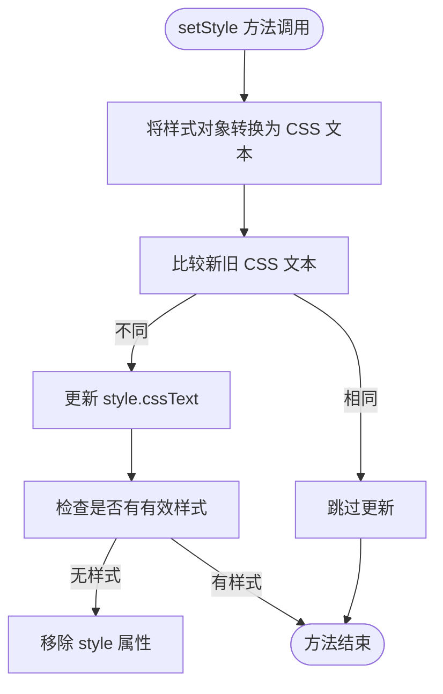
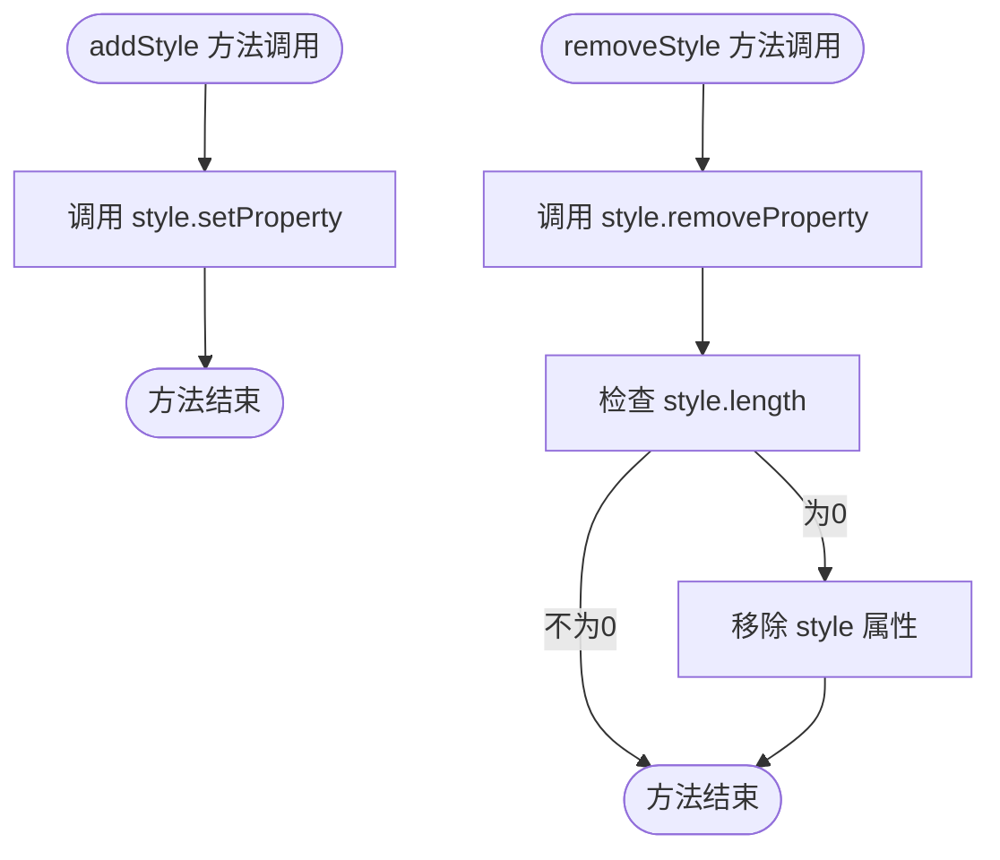
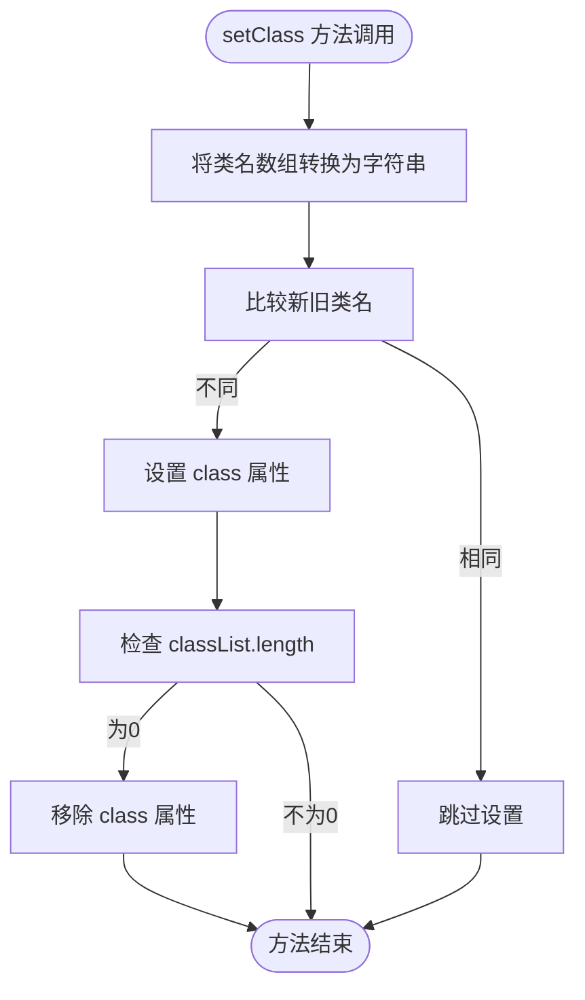
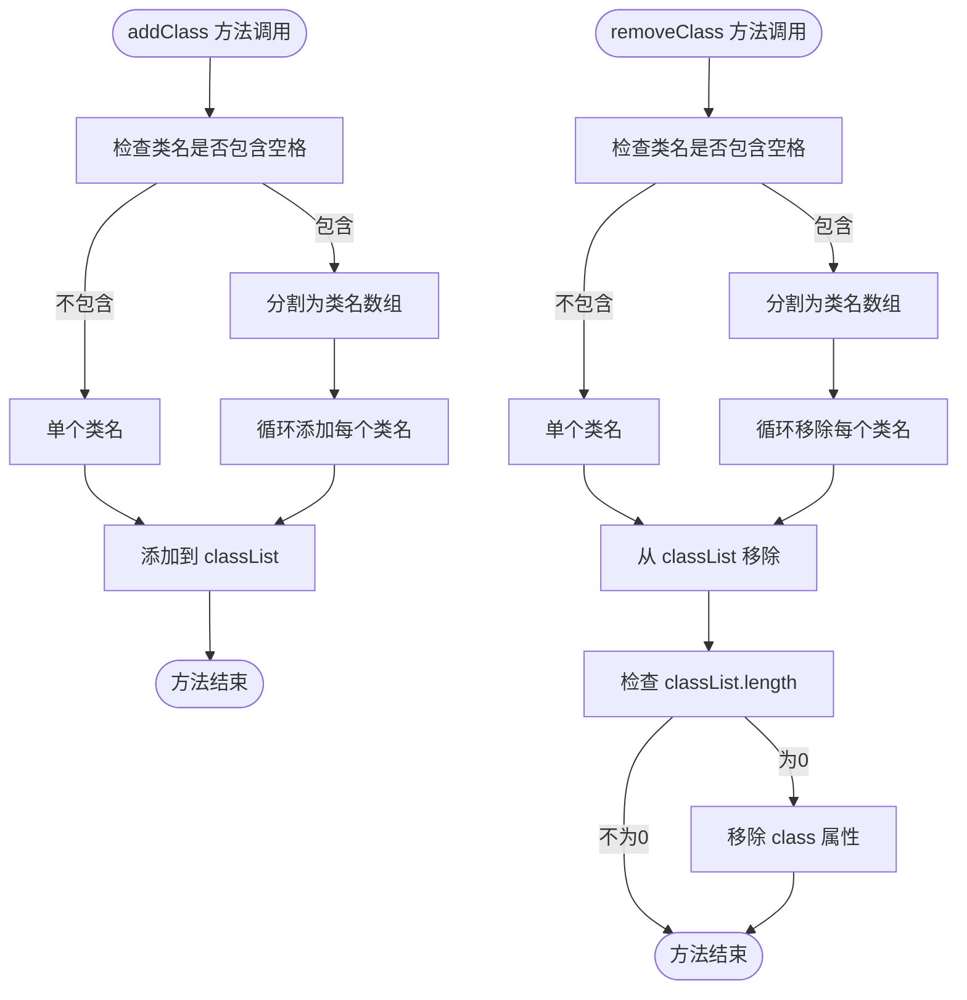
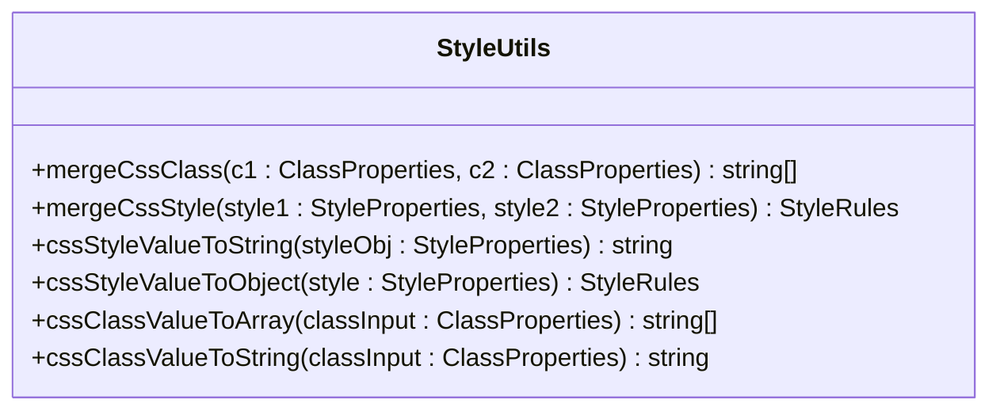
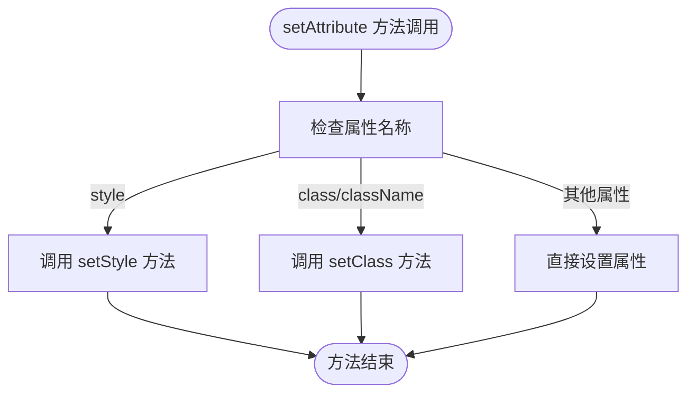

# CSS 样式与类名管理

<cite>
**本文档引用的文件**
- [style.ts](file://packages/runtime-core/src/utils/style.ts)
- [DomRenderer.ts](file://packages/runtime-dom/src/DomRenderer.ts)
- [renderer.ts](file://packages/runtime-core/src/types/renderer.ts)
- [props.ts](file://packages/runtime-core/src/types/props.ts)
- [attributes.ts](file://packages/runtime-dom/src/types/attributes.ts)
</cite>

## 目录
1. [简介](#简介)
2. [样式属性管理](#样式属性管理)
3. [类名管理](#类名管理)
4. [StyleUtils 工具类](#styleutils-工具类)
5. [渲染流程中的样式更新](#渲染流程中的样式更新)
6. [类型系统支持](#类型系统支持)

## 简介
Vitarx 框架提供了一套完整的 CSS 样式和类名管理机制，通过统一的 API 接口实现对 DOM 元素样式的高效操作。框架在 `runtime-dom` 包中实现了 `DomRenderer` 类，该类实现了 `HostRenderer` 接口，提供了对样式和类名的增删改查操作。这些操作通过 `StyleUtils` 工具类进行辅助，实现了对不同格式的样式和类名输入的统一处理。

**Section sources**
- [DomRenderer.ts](file://packages/runtime-dom/src/DomRenderer.ts#L1-L568)
- [renderer.ts](file://packages/runtime-core/src/types/renderer.ts#L1-L286)

## 样式属性管理
Vitarx 框架提供了多种方法来管理元素的样式属性，包括 `setStyle`、`addStyle` 和 `removeStyle` 方法。这些方法通过 `DomRenderer` 类实现，确保了样式操作的高效性和一致性。

### setStyle 方法
`setStyle` 方法用于批量设置元素的样式属性。该方法接收一个样式对象作为参数，将对象转换为 CSS 文本后更新元素的 `style.cssText` 属性。在更新前会进行比较，只有当新旧样式不同时才会执行更新操作，避免不必要的 DOM 操作。



**Diagram sources**
- [DomRenderer.ts](file://packages/runtime-dom/src/DomRenderer.ts#L239-L246)

### addStyle 和 removeStyle 方法
`addStyle` 方法用于添加单个样式属性，直接调用 DOM 元素的 `style.setProperty` 方法。`removeStyle` 方法用于移除单个样式属性，调用 `style.removeProperty` 方法，并在样式为空时自动移除 `style` 属性。



**Diagram sources**
- [DomRenderer.ts](file://packages/runtime-dom/src/DomRenderer.ts#L180-L189)

**Section sources**
- [DomRenderer.ts](file://packages/runtime-dom/src/DomRenderer.ts#L180-L250)
- [renderer.ts](file://packages/runtime-core/src/types/renderer.ts#L154-L167)

## 类名管理
Vitarx 框架提供了 `setClass`、`addClass` 和 `removeClass` 方法来管理元素的类名。这些方法通过与 `classList` 交互，实现了对类名的灵活操作。

### setClass 方法
`setClass` 方法用于设置元素的类名。该方法接收一个字符串数组作为参数，通过 `StyleUtils.cssClassValueToString` 方法将数组转换为字符串后设置到 `class` 属性。在设置前会进行比较，只有当新旧类名不同时才会执行更新操作。



**Diagram sources**
- [DomRenderer.ts](file://packages/runtime-dom/src/DomRenderer.ts#L197-L203)

### addClass 和 removeClass 方法
`addClass` 和 `removeClass` 方法支持处理包含空格的类名字符串。当类名字符串包含空格时，会通过 `StyleUtils.cssClassValueToArray` 方法将其分割为多个类名，然后逐个添加或移除。



**Diagram sources**
- [DomRenderer.ts](file://packages/runtime-dom/src/DomRenderer.ts#L206-L226)

**Section sources**
- [DomRenderer.ts](file://packages/runtime-dom/src/DomRenderer.ts#L197-L226)
- [renderer.ts](file://packages/runtime-core/src/types/renderer.ts#L186-L198)

## StyleUtils 工具类
`StyleUtils` 工具类是 Vitarx 框架中用于处理 CSS 样式和类名的核心工具类。该类提供了静态方法，用于在不同格式的样式和类名之间进行转换和合并。

### 样式转换方法
`StyleUtils` 提供了 `cssStyleValueToString` 和 `cssStyleValueToObject` 方法，用于在样式对象和 CSS 文本之间进行双向转换。`cssStyleValueToString` 方法会将样式对象转换为 CSS 文本，自动处理驼峰命名和 kebab-case 之间的转换。



**Diagram sources**
- [style.ts](file://packages/runtime-core/src/utils/style.ts#L32-L172)

### 类名转换方法
`StyleUtils` 提供了 `cssClassValueToArray` 和 `cssClassValueToString` 方法，用于在类名的不同格式之间进行转换。这些方法支持字符串、字符串数组和对象格式的类名输入。

**Section sources**
- [style.ts](file://packages/runtime-core/src/utils/style.ts#L32-L172)
- [props.ts](file://packages/runtime-core/src/types/props.ts#L213-L237)

## 渲染流程中的样式更新
在 Vitarx 框架的渲染流程中，样式更新是通过 `setAttribute` 方法统一处理的。当设置 `style` 或 `class` 属性时，会调用相应的样式或类名管理方法。



**Diagram sources**
- [DomRenderer.ts](file://packages/runtime-dom/src/DomRenderer.ts#L280-L288)

**Section sources**
- [DomRenderer.ts](file://packages/runtime-dom/src/DomRenderer.ts#L253-L312)

## 类型系统支持
Vitarx 框架通过 TypeScript 类型系统为样式和类名管理提供了完整的类型支持。`StyleProperties` 类型定义了样式属性可以是字符串或 `HostStyleRules` 对象，`ClassProperties` 类型定义了类名可以是字符串、字符串数组或对象。

```mermaid
erDiagram
STYLE_PROPERTIES ||--o{ STYLE_RULES : "extends"
STYLE_PROPERTIES ||--o{ STRING : "extends"
CLASS_PROPERTIES ||--o{ STRING : "extends"
CLASS_PROPERTIES ||--o{ STRING_ARRAY : "extends"
CLASS_PROPERTIES ||--o{ CLASS_OBJECT : "extends"
class STYLE_PROPERTIES {
string | HostStyleRules
}
class STYLE_RULES {
CSS 属性键值对
}
class CLASS_PROPERTIES {
string | Array<string> | Record<string, boolean>
}
```

**Diagram sources**
- [props.ts](file://packages/runtime-core/src/types/props.ts#L190-L237)
- [attributes.ts](file://packages/runtime-dom/src/types/attributes.ts#L383-L478)

**Section sources**
- [props.ts](file://packages/runtime-core/src/types/props.ts#L190-L237)
- [attributes.ts](file://packages/runtime-dom/src/types/attributes.ts#L383-L478)