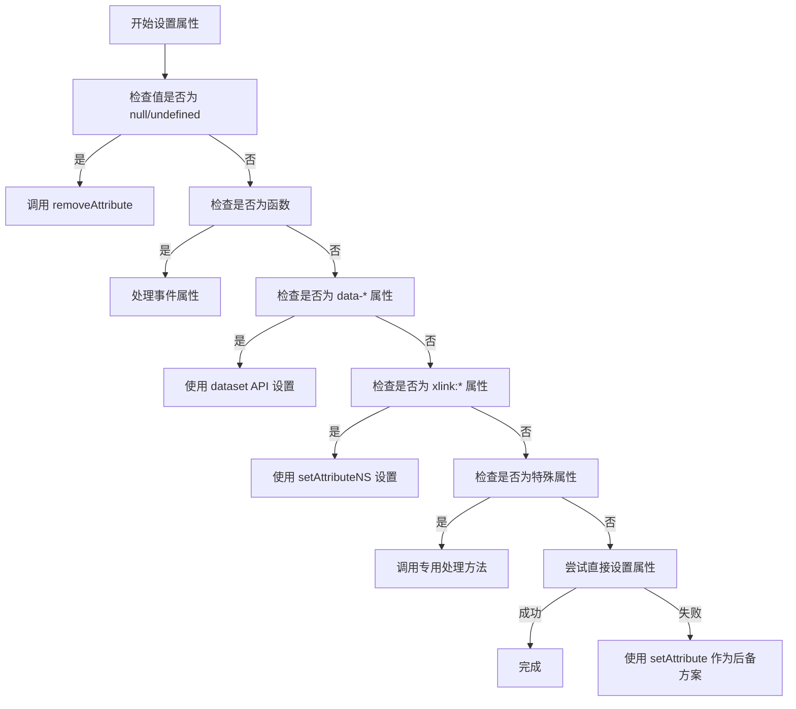
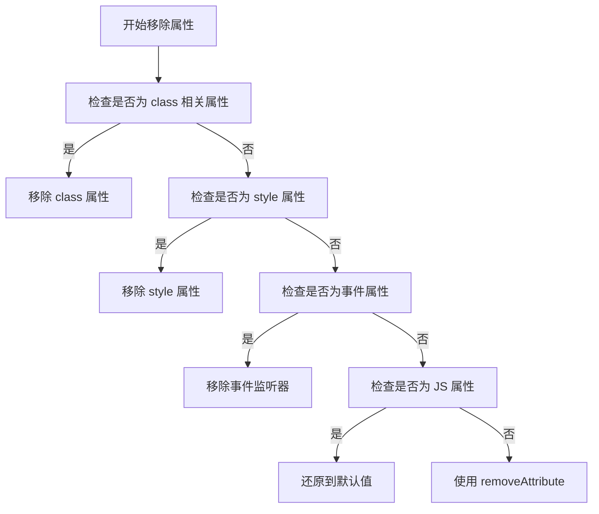
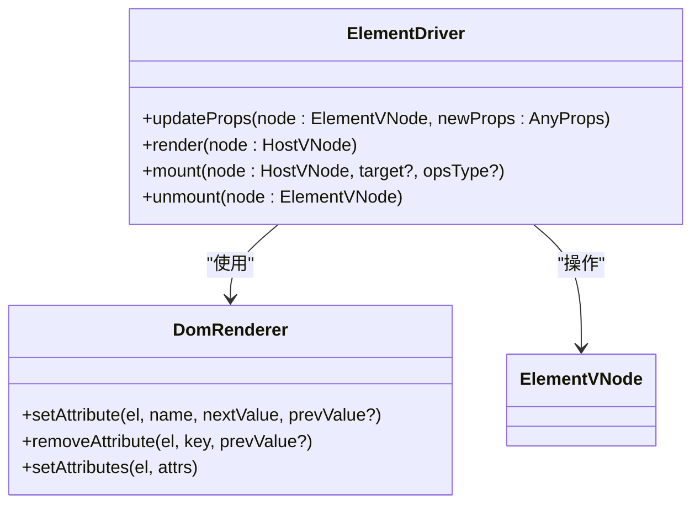
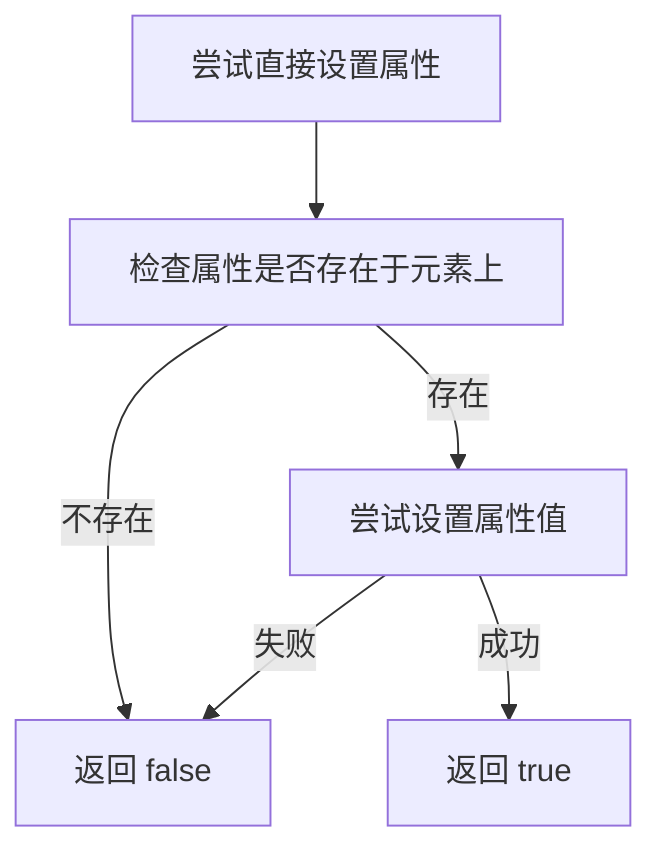

# DOM 属性操作

<cite>
**本文档引用的文件**  
- [DomRenderer.ts](file://packages/runtime-dom/src/DomRenderer.ts)
- [ElementDriver.ts](file://packages/runtime-drivers/src/drivers/ElementDriver.ts)
- [props.ts](file://packages/runtime-core/src/utils/props.ts)
- [attributes.ts](file://packages/runtime-core/src/constants/attributes.ts)
</cite>

## 目录
1. [简介](#简介)
2. [属性设置机制](#属性设置机制)
3. [属性移除策略](#属性移除策略)
4. [属性更新逻辑](#属性更新逻辑)
5. [特殊属性处理](#特殊属性处理)
6. [直接属性设置优化](#直接属性设置优化)

## 简介
Vitarx 框架提供了一套完整的 DOM 属性操作机制，通过 DomRenderer 和 ElementDriver 协同工作，实现了高效、安全的属性管理。该机制不仅支持普通属性的设置与移除，还特别处理了布尔属性、事件处理器、命名空间属性等特殊场景，确保 DOM 状态的一致性和性能优化。

## 属性设置机制
Vitarx 框架通过 `setAttribute` 方法实现属性设置，该方法根据属性类型采用不同的处理策略：

- **普通属性**：直接通过 DOM API 设置
- **数据属性**：使用 `dataset` API 进行设置
- **事件处理器**：作为函数类型属性特殊处理
- **特殊属性**：如 `style`、`class`、`v-html` 等有专门的处理逻辑
- **命名空间属性**：如 `xlink:` 和 `xmlns:xlink` 使用命名空间 API

**Diagram sources**
- [DomRenderer.ts](file://packages/runtime-dom/src/DomRenderer.ts#L253-L312)

**Section sources**
- [DomRenderer.ts](file://packages/runtime-dom/src/DomRenderer.ts#L253-L312)

## 属性移除策略
`removeAttribute` 方法不仅移除属性，还尝试将属性还原到默认值，避免 DOM 状态污染：

1. **class 属性**：直接移除 `class` 属性
2. **style 属性**：移除 `style` 属性
3. **事件属性**：移除事件监听器
4. **JS 属性**：尝试还原到默认值
5. **普通 attribute**：使用 `removeAttribute`

**Diagram sources**
- [DomRenderer.ts](file://packages/runtime-dom/src/DomRenderer.ts#L327-L358)

**Section sources**
- [DomRenderer.ts](file://packages/runtime-dom/src/DomRenderer.ts#L327-L358)

## 属性更新逻辑
ElementDriver 中的 `updateProps` 实现了差异更新逻辑，通过比较新旧属性值来决定是否需要更新：

**Diagram sources**
- [ElementDriver.ts](file://packages/runtime-drivers/src/drivers/ElementDriver.ts#L49-L70)
- [DomRenderer.ts](file://packages/runtime-dom/src/DomRenderer.ts)

**Section sources**
- [ElementDriver.ts](file://packages/runtime-drivers/src/drivers/ElementDriver.ts#L49-L70)

## 特殊属性处理
框架对特殊属性进行了专门处理，确保正确的行为：

### 布尔属性
布尔属性如 `checked`、`disabled` 等在移除时会被还原为默认的 `false` 值，而不是简单地从 DOM 中移除。

### 事件处理器
事件属性以 `on` 开头，框架会：
- 比较新旧函数引用
- 移除旧的事件监听器
- 添加新的事件监听器
- 支持事件修饰符如 `Capture`、`Once`、`Passive`

### 命名空间属性
对于 SVG 中常用的命名空间属性：
- `xlink:*` 属性使用 `http://www.w3.org/1999/xlink` 命名空间
- `xmlns:xlink` 属性使用 `http://www.w3.org/2000/xmlns/` 命名空间

**Section sources**
- [DomRenderer.ts](file://packages/runtime-dom/src/DomRenderer.ts#L275-L297)

## 直接属性设置优化
`trySetDirectProperty` 方法优先使用 DOM 元素的 JS 属性进行更新，提高性能：

该优化策略：
- 首先检查属性是否是元素的有效 JS 属性
- 尝试直接设置属性值
- 如果成功则返回 true，表示已处理
- 如果失败（如只读属性）则返回 false，让调用方使用后备方案

**Diagram sources**
- [DomRenderer.ts](file://packages/runtime-dom/src/DomRenderer.ts#L433-L446)

**Section sources**
- [DomRenderer.ts](file://packages/runtime-dom/src/DomRenderer.ts#L433-L446)