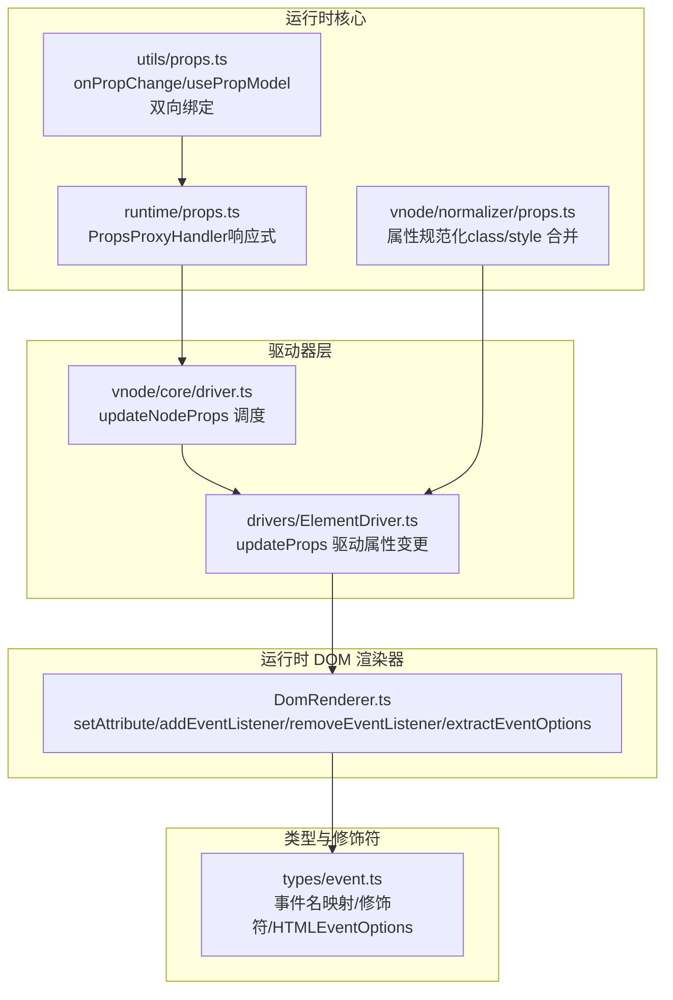
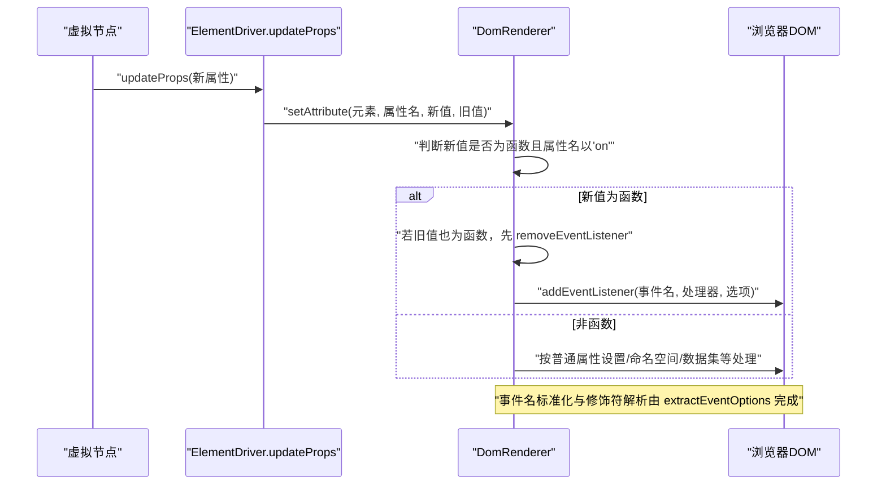
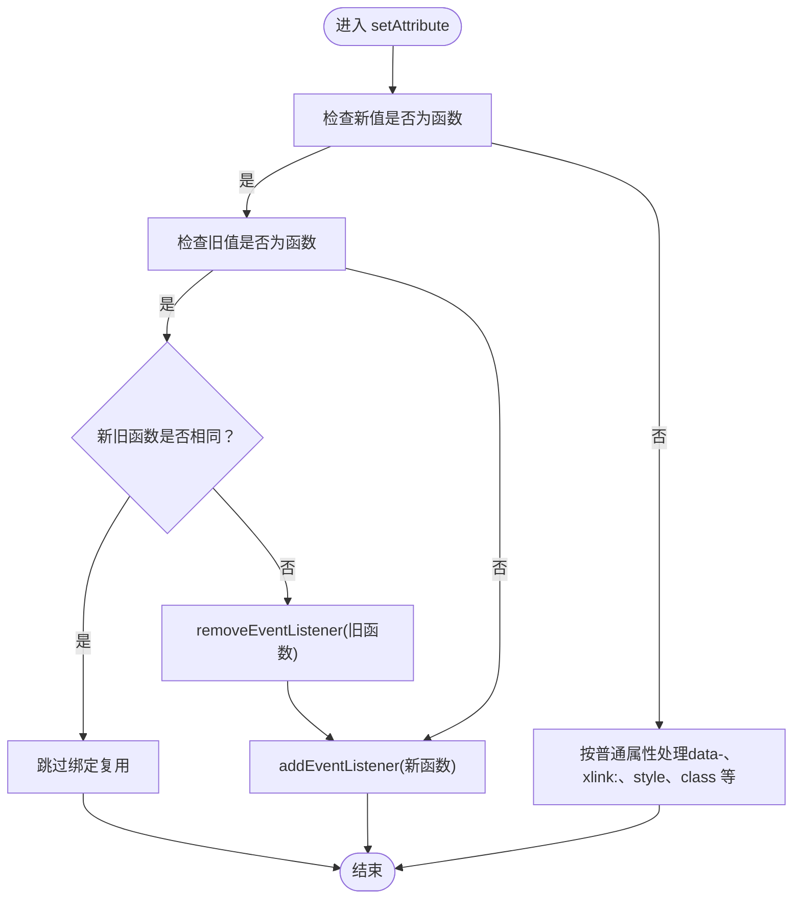
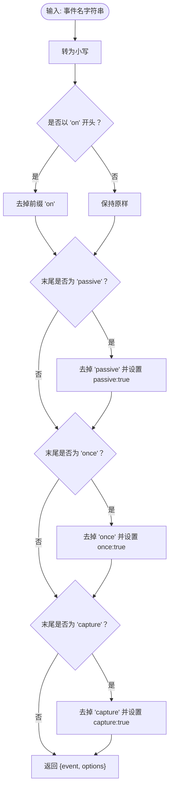
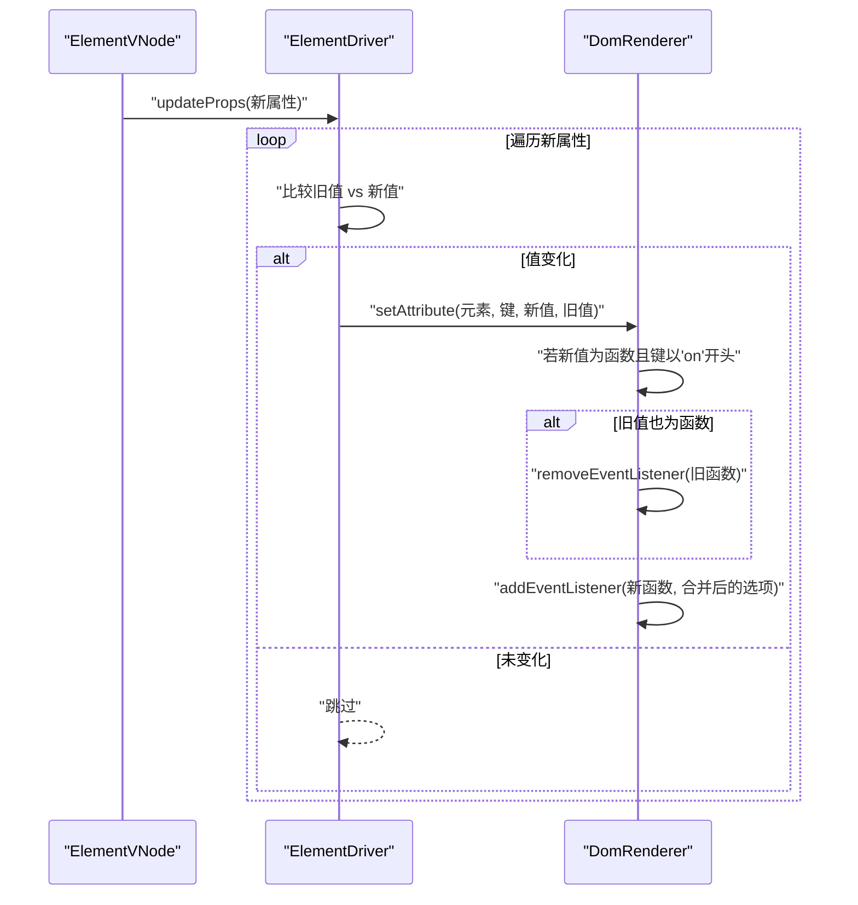
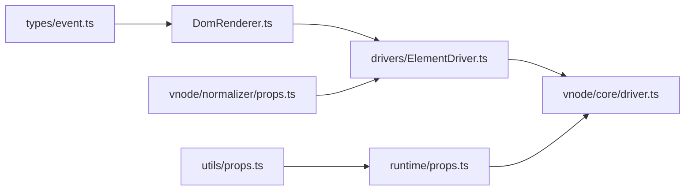

# 事件处理器绑定

<cite>
**本文引用的文件**
- [DomRenderer.ts](file://packages/runtime-dom/src/DomRenderer.ts)
- [event.ts](file://packages/runtime-dom/src/types/event.ts)
- [event.test.ts](file://packages/runtime-dom/__tests__/types/event.test.ts)
- [props.ts（运行时核心）](file://packages/runtime-core/src/runtime/props.ts)
- [props.ts（工具）](file://packages/runtime-core/src/utils/props.ts)
- [ElementDriver.ts](file://packages/runtime-drivers/src/drivers/ElementDriver.ts)
- [driver.ts](file://packages/runtime-core/src/vnode/core/driver.ts)
- [props.ts（规范化）](file://packages/runtime-core/src/vnode/normalizer/props.ts)
</cite>

## 目录
1. [简介](#简介)
2. [项目结构](#项目结构)
3. [核心组件](#核心组件)
4. [架构总览](#架构总览)
5. [详细组件分析](#详细组件分析)
6. [依赖分析](#依赖分析)
7. [性能考虑](#性能考虑)
8. [故障排查指南](#故障排查指南)
9. [结论](#结论)
10. [附录](#附录)

## 简介
本篇文档围绕 Vitarx 框架中的事件属性处理机制，系统阐述以下要点：
- setAttribute 如何识别以 'on' 开头的属性并将其作为事件处理器进行特殊处理
- 事件名称的标准化（如 onClick → click）
- 事件修饰符的支持（capture、once、passive），以及 extractEventOptions 的解析逻辑
- addEventListener 与 removeEventListener 的实现细节，包括选项合并与原生事件监听器的注册/注销
- updateProps 中的新旧函数比较机制，解释事件处理器的更新与复用策略
- 实际示例展示不同事件类型和修饰符的使用方法
- 事件处理器绑定过程中的性能优化与内存管理注意事项

## 项目结构
Vitarx 的事件处理涉及运行时 DOM 渲染器、类型定义、驱动器层以及运行时核心的属性更新流程。下图展示了与事件处理相关的核心文件与职责划分。

图表来源
- [DomRenderer.ts](file://packages/runtime-dom/src/DomRenderer.ts#L252-L312)
- [event.ts](file://packages/runtime-dom/src/types/event.ts#L419-L562)
- [ElementDriver.ts](file://packages/runtime-drivers/src/drivers/ElementDriver.ts#L49-L70)
- [driver.ts](file://packages/runtime-core/src/vnode/core/driver.ts#L131-L142)
- [props.ts（运行时核心）](file://packages/runtime-core/src/runtime/props.ts#L39-L109)
- [props.ts（工具）](file://packages/runtime-core/src/utils/props.ts#L1-L199)
- [props.ts（规范化）](file://packages/runtime-core/src/vnode/normalizer/props.ts#L68-L84)

章节来源
- [DomRenderer.ts](file://packages/runtime-dom/src/DomRenderer.ts#L252-L312)
- [event.ts](file://packages/runtime-dom/src/types/event.ts#L419-L562)
- [ElementDriver.ts](file://packages/runtime-drivers/src/drivers/ElementDriver.ts#L49-L70)
- [driver.ts](file://packages/runtime-core/src/vnode/core/driver.ts#L131-L142)

## 核心组件
- DomRenderer.setAttribute：统一的属性设置入口，对函数值的 'on' 属性进行事件绑定；对 data-*、xlink:*、style/class 等进行特殊处理；对事件属性移除时调用 removeAttribute。
- DomRenderer.addEventListener / removeEventListener：基于 extractEventOptions 解析事件名与修饰符，合并 HTMLEventOptions，最终调用原生 addEventListener/removeEventListener。
- DomRenderer.extractEventOptions：将 'onClickCaptureOncePassive' 等事件名标准化为 'click' 并解析 capture/once/passive 选项。
- ElementDriver.updateProps：遍历新旧属性，对变化的属性调用 dom.setAttribute，从而触发事件绑定/更新。
- 运行时核心 PropsProxyHandler：提供响应式 props 的读写追踪与通知，间接影响事件处理器的更新与复用。
- utils/props：onPropChange/usePropModel 提供属性变化监听与双向绑定，便于事件处理器的动态更新。

章节来源
- [DomRenderer.ts](file://packages/runtime-dom/src/DomRenderer.ts#L252-L312)
- [DomRenderer.ts](file://packages/runtime-dom/src/DomRenderer.ts#L448-L496)
- [DomRenderer.ts](file://packages/runtime-dom/src/DomRenderer.ts#L510-L538)
- [ElementDriver.ts](file://packages/runtime-drivers/src/drivers/ElementDriver.ts#L49-L70)
- [props.ts（运行时核心）](file://packages/runtime-core/src/runtime/props.ts#L39-L109)
- [props.ts（工具）](file://packages/runtime-core/src/utils/props.ts#L1-L199)

## 架构总览
下面的序列图展示了从虚拟节点属性更新到原生事件监听器注册/注销的完整流程。

图表来源
- [ElementDriver.ts](file://packages/runtime-drivers/src/drivers/ElementDriver.ts#L49-L70)
- [DomRenderer.ts](file://packages/runtime-dom/src/DomRenderer.ts#L252-L312)
- [DomRenderer.ts](file://packages/runtime-dom/src/DomRenderer.ts#L448-L496)
- [DomRenderer.ts](file://packages/runtime-dom/src/DomRenderer.ts#L510-L538)

## 详细组件分析

### setAttribute 的事件属性识别与处理
- 识别规则：当属性名为以 'on' 开头且值为函数时，视为事件处理器，走事件绑定路径；否则按普通属性处理。
- 事件更新策略：若旧值与新值均为函数且指向同一引用，则不重复绑定；若旧值为函数而新值为不同函数，则先移除旧监听再绑定新监听。
- 事件移除：当属性被删除或值变为 undefined/null 时，若此前是函数值（即曾经是事件处理器），则调用 removeAttribute，内部会识别并移除事件监听器。

图表来源
- [DomRenderer.ts](file://packages/runtime-dom/src/DomRenderer.ts#L252-L312)
- [DomRenderer.ts](file://packages/runtime-dom/src/DomRenderer.ts#L448-L496)

章节来源
- [DomRenderer.ts](file://packages/runtime-dom/src/DomRenderer.ts#L252-L312)
- [DomRenderer.ts](file://packages/runtime-dom/src/DomRenderer.ts#L448-L496)

### 事件名称标准化与修饰符解析（extractEventOptions）
- 名称标准化：将 'onClick'、'onclick' 等统一转换为小写并去除前缀 'on'，得到标准事件名（如 'click'）。
- 修饰符解析顺序：passive → once → capture。解析后将对应选项写入 HTMLEventOptions。
- 选项合并：addEventListener 接收的 HTMLEventOptions 与从事件名解析出的选项进行合并，后者优先级更高（因为 Object.assign 后面的选项覆盖前面的）。

图表来源
- [DomRenderer.ts](file://packages/runtime-dom/src/DomRenderer.ts#L510-L538)
- [event.ts](file://packages/runtime-dom/src/types/event.ts#L419-L562)

章节来源
- [DomRenderer.ts](file://packages/runtime-dom/src/DomRenderer.ts#L510-L538)
- [event.ts](file://packages/runtime-dom/src/types/event.ts#L419-L562)

### addEventListener 与 removeEventListener 的实现细节
- addEventListener：先通过 extractEventOptions 解析事件名与修饰符，再将外部传入的 HTMLEventOptions 与解析出的选项合并，最后调用原生 addEventListener。
- removeEventListener：同样解析事件名与修饰符，使用解析出的 capture 作为默认值，再调用原生 removeEventListener。
- 选项合并策略：外部 options 与解析出的 options 合并，外部 options 优先，确保用户显式传入的选项覆盖从事件名解析出的默认值。

章节来源
- [DomRenderer.ts](file://packages/runtime-dom/src/DomRenderer.ts#L448-L496)
- [DomRenderer.ts](file://packages/runtime-dom/src/DomRenderer.ts#L510-L538)

### updateProps 中的新旧函数比较与事件更新策略
- ElementDriver.updateProps：遍历新旧属性，对变化的属性调用 dom.setAttribute，从而触发事件绑定/更新。
- 新旧函数比较：当属性值为函数时，若新旧函数引用相同，则不重复绑定；若不同，则先移除旧监听再绑定新监听。
- 修饰符变更：由于 extractEventOptions 会从事件名解析选项，因此当事件名本身发生变化（如从 onClick 变为 onClickCaptureOnce），会触发完整的解绑与重新绑定流程。

图表来源
- [ElementDriver.ts](file://packages/runtime-drivers/src/drivers/ElementDriver.ts#L49-L70)
- [DomRenderer.ts](file://packages/runtime-dom/src/DomRenderer.ts#L252-L312)
- [DomRenderer.ts](file://packages/runtime-dom/src/DomRenderer.ts#L448-L496)

章节来源
- [ElementDriver.ts](file://packages/runtime-drivers/src/drivers/ElementDriver.ts#L49-L70)
- [DomRenderer.ts](file://packages/runtime-dom/src/DomRenderer.ts#L252-L312)
- [DomRenderer.ts](file://packages/runtime-dom/src/DomRenderer.ts#L448-L496)

### 事件修饰符与类型系统的支持
- 修饰符类型：EventModifier = 'Capture' | 'Once' | 'Passive' | 'OnceCapture'，支持组合修饰符（如 OnceCapture）。
- 事件名映射：HumpNameEventMap/LowerNameEventMap/EventNameMap 提供大小写与驼峰的事件名映射，确保小驼峰与小写事件名均能被识别。
- HTMLEventOptions：capture、once、passive 三个布尔选项，用于控制事件监听器的行为。
- 测试覆盖：event.test.ts 验证了事件类型、修饰符类型、HTMLEventOptions 的组合使用等。

章节来源
- [event.ts](file://packages/runtime-dom/src/types/event.ts#L27-L562)
- [event.test.ts](file://packages/runtime-dom/__tests__/types/event.test.ts#L1-L360)

### 实际示例（概念性说明）
- 基础事件：onClick、onMouseDown、onKeyDown 等。
- 捕获阶段：onClickCapture、onMouseDownCapture 等。
- 一次性触发：onClickOnce、onMouseDownOnce 等。
- Passive 模式：onScrollPassive、onWheelPassive、onTouchMovePassive 等。
- 组合修饰符：onClickCaptureOnce、onScrollPassiveCapture 等。
- 说明：上述示例均通过事件名后缀自动解析修饰符，无需手动传入 HTMLEventOptions；若需额外选项（如 capture: true），可通过 HTMLEventOptions 显式传入。

章节来源
- [event.ts](file://packages/runtime-dom/src/types/event.ts#L419-L562)
- [event.test.ts](file://packages/runtime-dom/__tests__/types/event.test.ts#L196-L245)

### 事件处理器绑定的性能优化与内存管理
- 函数引用相等时跳过绑定：减少重复 addEventListener 调用，避免重复监听器注册。
- 旧函数存在时先移除：确保同一事件名下只保留最新监听器，防止内存泄漏与重复触发。
- 修饰符解析与选项合并：通过 extractEventOptions 与 Object.assign 合并，保证用户显式传入的选项覆盖默认解析值。
- 事件名标准化：统一小写与去前缀，降低歧义，提升匹配效率。
- 注意事项：频繁切换事件名（如从 onClick 到 onClickCaptureOnce）会导致完整解绑与重新绑定，应尽量保持事件名稳定；对于高频更新的事件处理器，建议在组件层做函数引用稳定化（如使用 useCallback/绑定方法）。

章节来源
- [DomRenderer.ts](file://packages/runtime-dom/src/DomRenderer.ts#L252-L312)
- [DomRenderer.ts](file://packages/runtime-dom/src/DomRenderer.ts#L448-L496)
- [DomRenderer.ts](file://packages/runtime-dom/src/DomRenderer.ts#L510-L538)

## 依赖分析
- DomRenderer 依赖事件类型定义（event.ts）以支持事件名映射与修饰符类型。
- ElementDriver 依赖 DomRenderer 的 setAttribute/事件 API，驱动属性更新。
- 运行时核心的 PropsProxyHandler 与 utils/props 的 onPropChange/usePropModel 影响属性变化的触发与通知，间接影响事件处理器的更新。

图表来源
- [event.ts](file://packages/runtime-dom/src/types/event.ts#L419-L562)
- [DomRenderer.ts](file://packages/runtime-dom/src/DomRenderer.ts#L252-L312)
- [ElementDriver.ts](file://packages/runtime-drivers/src/drivers/ElementDriver.ts#L49-L70)
- [driver.ts](file://packages/runtime-core/src/vnode/core/driver.ts#L131-L142)
- [props.ts（运行时核心）](file://packages/runtime-core/src/runtime/props.ts#L39-L109)
- [props.ts（工具）](file://packages/runtime-core/src/utils/props.ts#L1-L199)
- [props.ts（规范化）](file://packages/runtime-core/src/vnode/normalizer/props.ts#L68-L84)

章节来源
- [event.ts](file://packages/runtime-dom/src/types/event.ts#L419-L562)
- [DomRenderer.ts](file://packages/runtime-dom/src/DomRenderer.ts#L252-L312)
- [ElementDriver.ts](file://packages/runtime-drivers/src/drivers/ElementDriver.ts#L49-L70)
- [driver.ts](file://packages/runtime-core/src/vnode/core/driver.ts#L131-L142)
- [props.ts（运行时核心）](file://packages/runtime-core/src/runtime/props.ts#L39-L109)
- [props.ts（工具）](file://packages/runtime-core/src/utils/props.ts#L1-L199)
- [props.ts（规范化）](file://packages/runtime-core/src/vnode/normalizer/props.ts#L68-L84)

## 性能考虑
- 事件处理器引用稳定化：在组件层保持事件处理器引用稳定，可避免不必要的解绑与重新绑定。
- 修饰符解析成本低：extractEventOptions 为常量时间操作，开销极小。
- 选项合并：Object.assign 合并两个小对象，性能开销可忽略。
- 频繁切换事件名：可能导致完整解绑/绑定，应尽量避免在渲染周期内频繁变更事件名。

## 故障排查指南
- 事件未触发：检查事件名是否以 'on' 开头且值为函数；确认事件名大小写与修饰符拼写正确。
- 修饰符无效：确认事件名后缀拼写正确（如 Capture/Once/Passive），或通过 HTMLEventOptions 显式传入。
- 重复触发或内存泄漏：确认同一事件名下只保留最新处理器；避免在同一事件名上注册多个监听器。
- 事件名标准化问题：确保事件名符合小驼峰或小写规范，避免大小写不一致导致的解析失败。

章节来源
- [DomRenderer.ts](file://packages/runtime-dom/src/DomRenderer.ts#L252-L312)
- [DomRenderer.ts](file://packages/runtime-dom/src/DomRenderer.ts#L448-L496)
- [DomRenderer.ts](file://packages/runtime-dom/src/DomRenderer.ts#L510-L538)
- [event.test.ts](file://packages/runtime-dom/__tests__/types/event.test.ts#L196-L245)

## 结论
Vitarx 的事件处理机制通过 DomRenderer 的统一入口，实现了对 'on' 属性的智能识别、事件名标准化与修饰符解析、以及原生事件监听器的注册/注销。ElementDriver 的属性更新流程与运行时核心的响应式系统共同作用，确保事件处理器在属性变更时得到及时更新与复用。通过 extractEventOptions 与 HTMLEventOptions 的配合，开发者既可以通过事件名后缀声明修饰符，又可显式传入选项以精确控制事件行为。遵循引用稳定化与事件名稳定的最佳实践，可显著提升性能并避免内存泄漏。

## 附录
- 事件类型与修饰符的类型定义与测试覆盖，详见 event.ts 与 event.test.ts。
- 属性规范化与响应式 props 的实现，详见 props.ts（运行时核心）与 props.ts（工具）。
- 节点属性更新调度，详见 vnode/core/driver.ts 与 vnode/normalizer/props.ts。