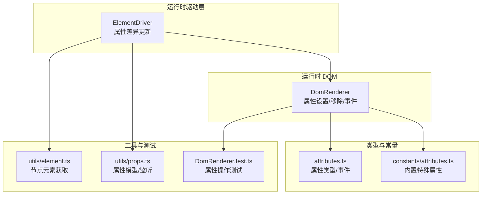
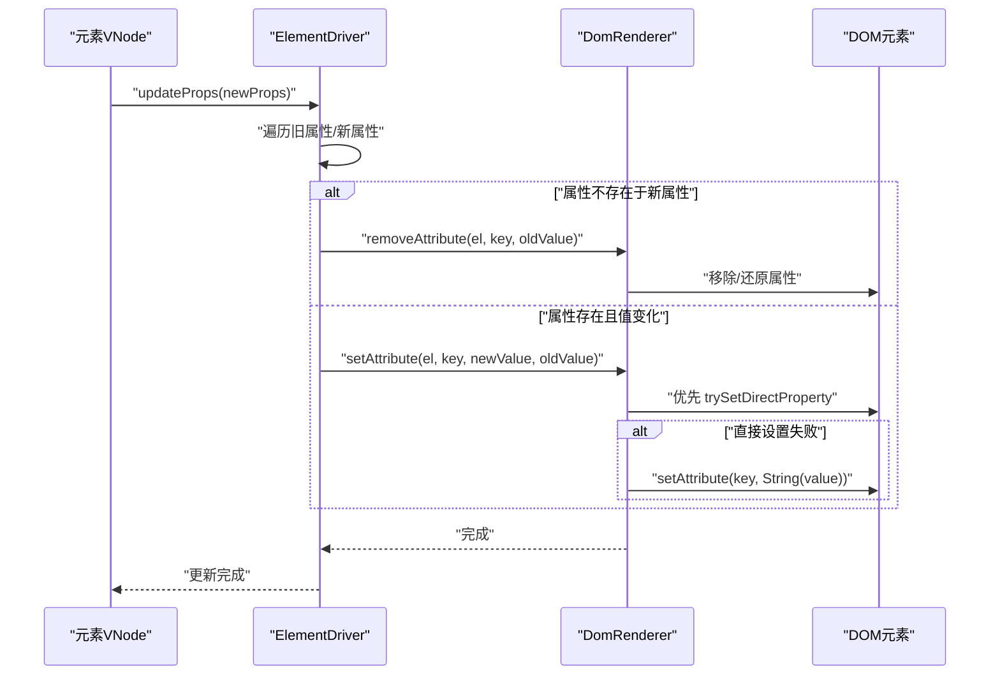
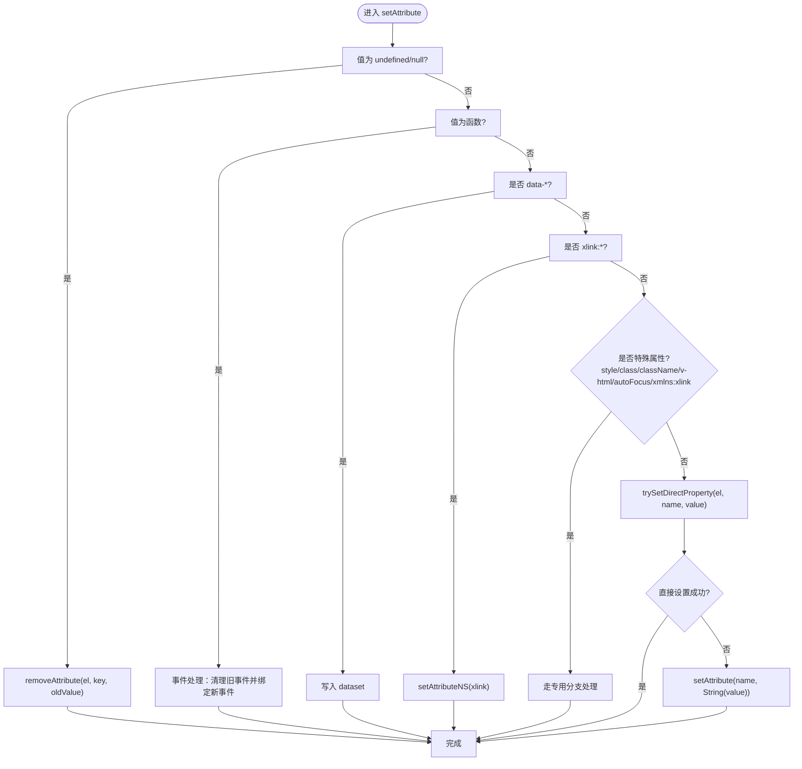
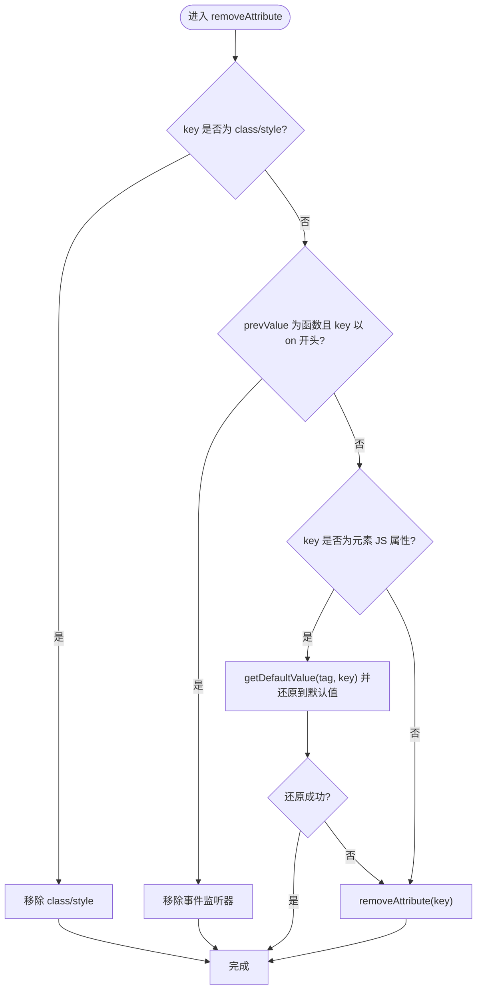
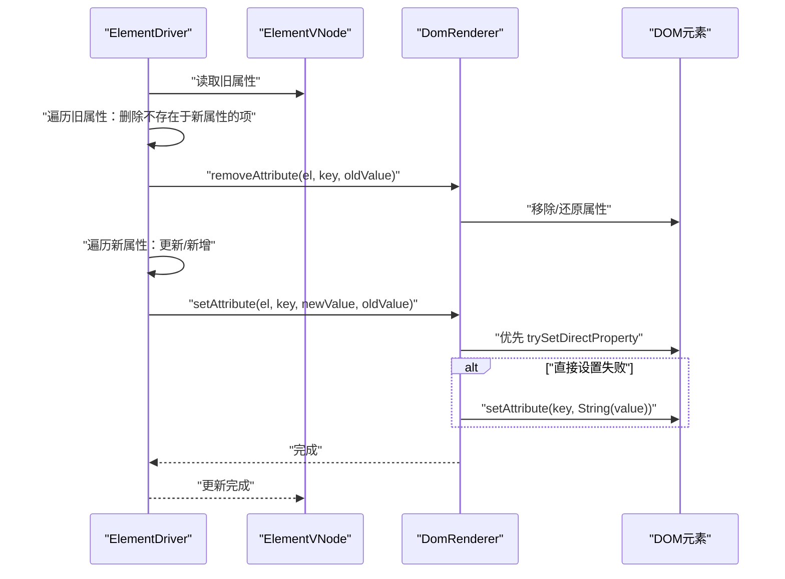
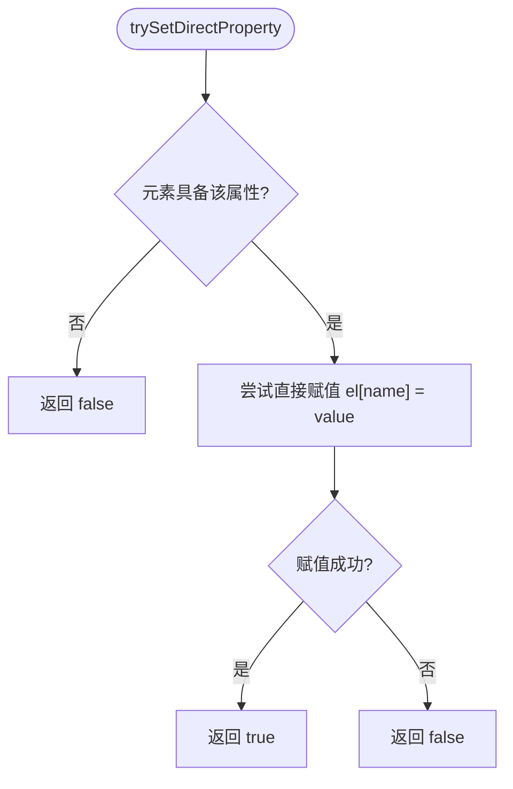
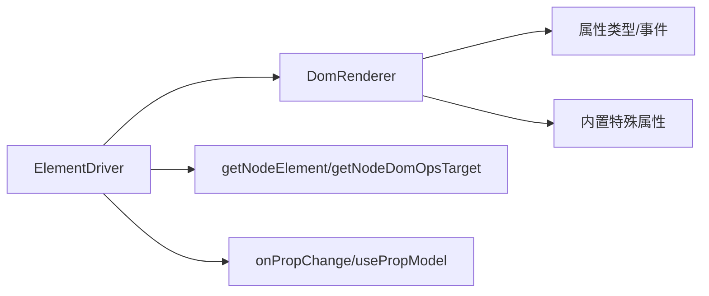

# 基础属性操作

<cite>
**本文引用的文件**
- [DomRenderer.ts](file://packages/runtime-dom/src/DomRenderer.ts)
- [ElementDriver.ts](file://packages/runtime-drivers/src/drivers/ElementDriver.ts)
- [attributes.ts](file://packages/runtime-dom/src/types/attributes.ts)
- [props.ts](file://packages/runtime-core/src/utils/props.ts)
- [element.ts](file://packages/runtime-core/src/utils/element.ts)
- [attributes.ts](file://packages/runtime-core/src/constants/attributes.ts)
- [DomRenderer.test.ts](file://packages/runtime-dom/__tests__/client/DomRenderer.test.ts)
</cite>

## 目录
1. [简介](#简介)
2. [项目结构](#项目结构)
3. [核心组件](#核心组件)
4. [架构总览](#架构总览)
5. [详细组件分析](#详细组件分析)
6. [依赖分析](#依赖分析)
7. [性能考量](#性能考量)
8. [故障排查指南](#故障排查指南)
9. [结论](#结论)
10. [附录](#附录)

## 简介
本技术文档聚焦 Vitarx 框架中 DOM 基础属性的操作机制，围绕 setAttribute 与 removeAttribute 的实现细节展开，解释普通 HTML 属性（如 id、title、value 等）的设置、更新与移除流程，涵盖属性值的类型转换与字符串化策略、trySetDirectProperty 的优先更新路径、以及 ElementDriver 中 updateProps 的新旧值比较与差异更新机制。同时提供基于仓库现有测试与源码的流程图与序列图，帮助读者从代码层面理解属性操作的完整闭环。

## 项目结构
与基础属性操作直接相关的核心模块分布如下：
- 运行时 DOM 渲染器：负责在浏览器环境中执行 DOM 操作，包括属性设置、移除、事件绑定与回退策略。
- 元素驱动器：负责在虚拟节点更新时，对元素属性进行差异计算与批量更新。
- 类型与常量：提供属性类型约束、内置特殊属性集合与全局属性定义。
- 工具与测试：提供节点元素获取工具与覆盖属性设置/移除行为的测试用例。

图表来源
- [DomRenderer.ts](file://packages/runtime-dom/src/DomRenderer.ts#L252-L358)
- [ElementDriver.ts](file://packages/runtime-drivers/src/drivers/ElementDriver.ts#L49-L70)
- [attributes.ts](file://packages/runtime-dom/src/types/attributes.ts#L1-L120)
- [attributes.ts](file://packages/runtime-core/src/constants/attributes.ts#L1-L25)
- [element.ts](file://packages/runtime-core/src/utils/element.ts#L1-L33)
- [props.ts](file://packages/runtime-core/src/utils/props.ts#L1-L199)
- [DomRenderer.test.ts](file://packages/runtime-dom/__tests__/client/DomRenderer.test.ts#L215-L311)

章节来源
- [DomRenderer.ts](file://packages/runtime-dom/src/DomRenderer.ts#L252-L358)
- [ElementDriver.ts](file://packages/runtime-drivers/src/drivers/ElementDriver.ts#L49-L70)
- [attributes.ts](file://packages/runtime-dom/src/types/attributes.ts#L1-L120)
- [attributes.ts](file://packages/runtime-core/src/constants/attributes.ts#L1-L25)
- [element.ts](file://packages/runtime-core/src/utils/element.ts#L1-L33)
- [props.ts](file://packages/runtime-core/src/utils/props.ts#L1-L199)
- [DomRenderer.test.ts](file://packages/runtime-dom/__tests__/client/DomRenderer.test.ts#L215-L311)

## 核心组件
- DomRenderer.setAttribute：统一入口，负责普通属性、事件、dataset、命名空间属性、style/class 等的差异化处理，并优先尝试直接设置 JS 属性，失败时回退到 setAttribute。
- DomRenderer.removeAttribute：负责移除属性，区分 class/style 的特殊处理、事件处理器的清理、JS 属性的还原到默认值，以及普通 attribute 的移除。
- ElementDriver.updateProps：在元素更新时，遍历新旧属性，删除不存在于新属性中的项，新增或更新存在于新属性中的项，逐项调用 DomRenderer 的 setAttribute/removeAttribute。
- 属性类型与常量：提供 W3C 标准属性集合、事件属性、内置特殊属性集合，确保类型安全与行为一致性。
- 工具与测试：提供节点元素获取工具与覆盖属性设置/移除行为的测试用例，验证基础属性的设置、更新与移除流程。

章节来源
- [DomRenderer.ts](file://packages/runtime-dom/src/DomRenderer.ts#L252-L358)
- [ElementDriver.ts](file://packages/runtime-drivers/src/drivers/ElementDriver.ts#L49-L70)
- [attributes.ts](file://packages/runtime-dom/src/types/attributes.ts#L1-L120)
- [attributes.ts](file://packages/runtime-core/src/constants/attributes.ts#L1-L25)
- [element.ts](file://packages/runtime-core/src/utils/element.ts#L1-L33)
- [DomRenderer.test.ts](file://packages/runtime-dom/__tests__/client/DomRenderer.test.ts#L215-L311)

## 架构总览
下图展示了属性更新从虚拟节点到真实 DOM 的端到端流程，包括差异计算、属性设置与移除、事件绑定与清理、以及回退策略。

图表来源
- [ElementDriver.ts](file://packages/runtime-drivers/src/drivers/ElementDriver.ts#L49-L70)
- [DomRenderer.ts](file://packages/runtime-dom/src/DomRenderer.ts#L252-L358)

## 详细组件分析

### DomRenderer.setAttribute：属性设置与回退策略
- 输入与分支
  - undefined/null 值：直接委托 removeAttribute，避免将无效值写入 DOM。
  - 函数值：视为事件处理器，先清理旧事件（若存在），再绑定新事件。
  - data-*：写入 dataset，不走 setAttribute。
  - xlink:*：使用命名空间 setAttributeNS。
  - 特殊属性：style、class/className、v-html、autoFocus、xmlns:xlink 等走专用分支。
  - 其他属性：优先尝试 trySetDirectProperty，若元素具备该 JS 属性且赋值成功则直接返回；否则回退到 setAttribute 并将值字符串化。
- 字符串化策略
  - 除特殊分支外，最终回退到 setAttribute 时，值会被转换为字符串后再写入。
- 错误处理
  - trySetDirectProperty 或 setAttribute 发生异常时，记录错误日志，避免中断渲染流程。

图表来源
- [DomRenderer.ts](file://packages/runtime-dom/src/DomRenderer.ts#L252-L312)

章节来源
- [DomRenderer.ts](file://packages/runtime-dom/src/DomRenderer.ts#L252-L312)

### DomRenderer.removeAttribute：属性移除与还原
- class/style 特殊处理：移除 class/style 属性，确保样式与类名状态一致。
- 事件处理器：若 prevValue 为函数且 key 以 on 开头，移除对应事件监听器。
- JS 属性还原：若 key 是元素的 JS 属性，尝试将其还原为默认值（通过缓存的默认值），失败则回退到 removeAttribute。
- 普通 attribute：直接 removeAttribute。

图表来源
- [DomRenderer.ts](file://packages/runtime-dom/src/DomRenderer.ts#L327-L358)

章节来源
- [DomRenderer.ts](file://packages/runtime-dom/src/DomRenderer.ts#L327-L358)

### ElementDriver.updateProps：新旧值比较与差异更新
- 删除逻辑：遍历旧属性，若 key 不在新属性中，则删除该项并调用 removeAttribute。
- 更新/新增逻辑：遍历新属性，若值与旧值不同，则更新旧值并调用 setAttribute。
- 与 DomRenderer 的协作：通过 getRenderer() 获取渲染器实例，保证属性更新的一致性与性能。

图表来源
- [ElementDriver.ts](file://packages/runtime-drivers/src/drivers/ElementDriver.ts#L49-L70)
- [DomRenderer.ts](file://packages/runtime-dom/src/DomRenderer.ts#L252-L312)

章节来源
- [ElementDriver.ts](file://packages/runtime-drivers/src/drivers/ElementDriver.ts#L49-L70)

### trySetDirectProperty：优先使用 JS 属性的高效更新
- 机制说明：在 setAttribute 流程中，优先尝试通过直接赋值元素的 JS 属性（如 id、title、value、checked、autofocus 等）来更新 DOM，避免字符串化与属性同步开销。
- 失败回退：若元素不具备该属性或赋值抛错，则回退到 setAttribute 并将值字符串化。
- 性能优势：直接 JS 属性赋值通常更快，且能正确处理布尔/数值等原生类型。

图表来源
- [DomRenderer.ts](file://packages/runtime-dom/src/DomRenderer.ts#L426-L446)

章节来源
- [DomRenderer.ts](file://packages/runtime-dom/src/DomRenderer.ts#L426-L446)

### 属性值类型转换与字符串化策略
- 事件属性：函数值直接绑定为事件处理器，不进行字符串化。
- data-*：写入 dataset，不走 setAttribute。
- xlink/xmlns：使用命名空间 setAttributeNS。
- 特殊属性：style、class/className、v-html、autoFocus 等走专用分支。
- 普通属性：最终回退到 setAttribute 时，值会被转换为字符串后再写入。
- undefined/null：委托 removeAttribute，避免写入无效值。

章节来源
- [DomRenderer.ts](file://packages/runtime-dom/src/DomRenderer.ts#L252-L312)
- [DomRenderer.test.ts](file://packages/runtime-dom/__tests__/client/DomRenderer.test.ts#L215-L311)

### 属性操作中的错误处理机制
- trySetDirectProperty：在赋值过程中捕获异常并返回 false，确保流程继续。
- setAttribute：在 trySetDirectProperty 失败时，捕获异常并输出错误日志，避免中断渲染。
- removeAttribute：对只读属性（如 innerHTML）的还原尝试失败时，回退到 removeAttribute，保证一致性。

章节来源
- [DomRenderer.ts](file://packages/runtime-dom/src/DomRenderer.ts#L252-L312)
- [DomRenderer.ts](file://packages/runtime-dom/src/DomRenderer.ts#L327-L358)

### 实际代码示例（基于测试与源码路径）
- 设置普通属性（id、title）：参考测试用例路径
  - [DomRenderer.test.ts](file://packages/runtime-dom/__tests__/client/DomRenderer.test.ts#L215-L224)
- 设置 data-* 属性：参考测试用例路径
  - [DomRenderer.test.ts](file://packages/runtime-dom/__tests__/client/DomRenderer.test.ts#L226-L234)
- 设置 xmlns:xlink/xlink:* 属性：参考测试用例路径
  - [DomRenderer.test.ts](file://packages/runtime-dom/__tests__/client/DomRenderer.test.ts#L236-L258)
- 设置事件处理函数：参考测试用例路径
  - [DomRenderer.test.ts](file://packages/runtime-dom/__tests__/client/DomRenderer.test.ts#L260-L268)
- 移除普通属性（value、checked）：参考测试用例路径
  - [DomRenderer.test.ts](file://packages/runtime-dom/__tests__/client/DomRenderer.test.ts#L270-L280)
- 移除 class 属性：参考测试用例路径
  - [DomRenderer.test.ts](file://packages/runtime-dom/__tests__/client/DomRenderer.test.ts#L282-L290)
- 移除事件处理函数：参考测试用例路径
  - [DomRenderer.test.ts](file://packages/runtime-dom/__tests__/client/DomRenderer.test.ts#L292-L301)
- 处理 undefined 值：参考测试用例路径
  - [DomRenderer.test.ts](file://packages/runtime-dom/__tests__/client/DomRenderer.test.ts#L303-L311)

## 依赖分析
- ElementDriver 依赖 DomRenderer 提供的属性设置/移除能力，形成“差异计算 + 统一落盘”的职责分离。
- DomRenderer 依赖属性类型与常量定义，确保对 W3C 标准属性、事件属性与内置特殊属性的正确识别与处理。
- 工具层提供节点元素获取与属性模型能力，辅助在复杂场景下进行属性监听与双向绑定。

图表来源
- [ElementDriver.ts](file://packages/runtime-drivers/src/drivers/ElementDriver.ts#L49-L70)
- [DomRenderer.ts](file://packages/runtime-dom/src/DomRenderer.ts#L252-L358)
- [attributes.ts](file://packages/runtime-dom/src/types/attributes.ts#L1-L120)
- [attributes.ts](file://packages/runtime-core/src/constants/attributes.ts#L1-L25)
- [element.ts](file://packages/runtime-core/src/utils/element.ts#L1-L33)
- [props.ts](file://packages/runtime-core/src/utils/props.ts#L1-L199)

章节来源
- [ElementDriver.ts](file://packages/runtime-drivers/src/drivers/ElementDriver.ts#L49-L70)
- [DomRenderer.ts](file://packages/runtime-dom/src/DomRenderer.ts#L252-L358)
- [attributes.ts](file://packages/runtime-dom/src/types/attributes.ts#L1-L120)
- [attributes.ts](file://packages/runtime-core/src/constants/attributes.ts#L1-L25)
- [element.ts](file://packages/runtime-core/src/utils/element.ts#L1-L33)
- [props.ts](file://packages/runtime-core/src/utils/props.ts#L1-L199)

## 性能考量
- 优先使用 JS 属性赋值：在 setAttribute 流程中，优先尝试 trySetDirectProperty，可减少字符串化与属性同步成本，提升更新效率。
- 事件处理优化：事件属性采用函数值直接绑定/替换，避免重复绑定与冗余属性写入。
- 特殊属性分支：style/class 等走专用分支，减少通用 setAttribute 的调用次数。
- 默认值缓存：getDefaultValues 通过缓存标签与属性的默认值，降低还原默认值的成本。

章节来源
- [DomRenderer.ts](file://packages/runtime-dom/src/DomRenderer.ts#L426-L446)
- [DomRenderer.ts](file://packages/runtime-dom/src/DomRenderer.ts#L540-L567)

## 故障排查指南
- 事件未生效
  - 检查事件名称大小写与修饰符（capture/once/passive）是否正确解析。
  - 参考路径：[DomRenderer.ts](file://packages/runtime-dom/src/DomRenderer.ts#L510-L538)
- 事件未移除
  - 确认 prevValue 为函数且 key 以 on 开头，removeAttribute 会移除事件监听器。
  - 参考路径：[DomRenderer.ts](file://packages/runtime-dom/src/DomRenderer.ts#L327-L358)
- 属性未移除或还原
  - 若为只读属性（如 innerHTML），还原尝试会失败并回退到 removeAttribute。
  - 参考路径：[DomRenderer.ts](file://packages/runtime-dom/src/DomRenderer.ts#L341-L357)
- undefined/null 导致属性异常
  - undefined/null 会委托 removeAttribute，确保不会写入无效值。
  - 参考路径：[DomRenderer.ts](file://packages/runtime-dom/src/DomRenderer.ts#L252-L260)
- 数据属性未生效
  - data-* 属性需通过 dataset 写入，不走 setAttribute。
  - 参考路径：[DomRenderer.ts](file://packages/runtime-dom/src/DomRenderer.ts#L270-L274)

章节来源
- [DomRenderer.ts](file://packages/runtime-dom/src/DomRenderer.ts#L252-L358)
- [DomRenderer.ts](file://packages/runtime-dom/src/DomRenderer.ts#L510-L538)

## 结论
Vitarx 框架在 DOM 基础属性操作上采用了“差异计算 + 优先 JS 属性赋值 + 通用回退”的设计：ElementDriver 负责新旧值比较与差异更新，DomRenderer 负责具体属性设置/移除与回退策略。通过 trySetDirectProperty 优先使用 JS 属性赋值，配合事件、dataset、命名空间等专用分支，既保证了类型安全与行为一致性，又兼顾了性能与可维护性。测试用例覆盖了常见属性场景，为实际使用提供了可靠参考。

## 附录
- 属性类型与事件定义：参考路径
  - [attributes.ts](file://packages/runtime-dom/src/types/attributes.ts#L1-L120)
- 内置特殊属性集合：参考路径
  - [attributes.ts](file://packages/runtime-core/src/constants/attributes.ts#L1-L25)
- 节点元素获取工具：参考路径
  - [element.ts](file://packages/runtime-core/src/utils/element.ts#L1-L33)
- 属性模型与监听：参考路径
  - [props.ts](file://packages/runtime-core/src/utils/props.ts#L1-L199)
- 属性操作测试用例：参考路径
  - [DomRenderer.test.ts](file://packages/runtime-dom/__tests__/client/DomRenderer.test.ts#L215-L311)