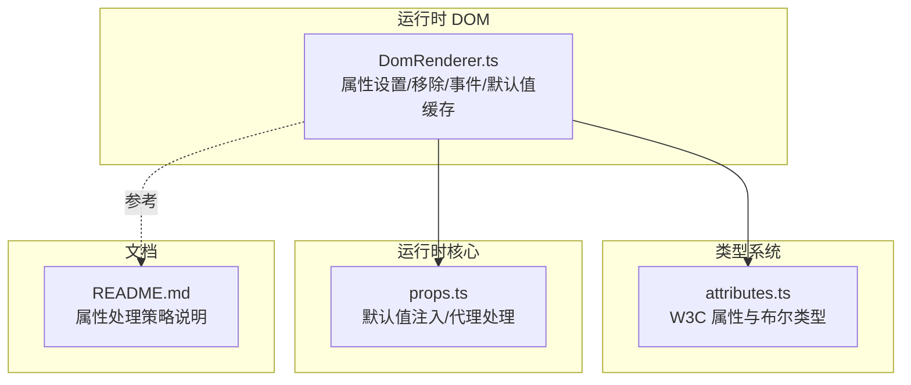
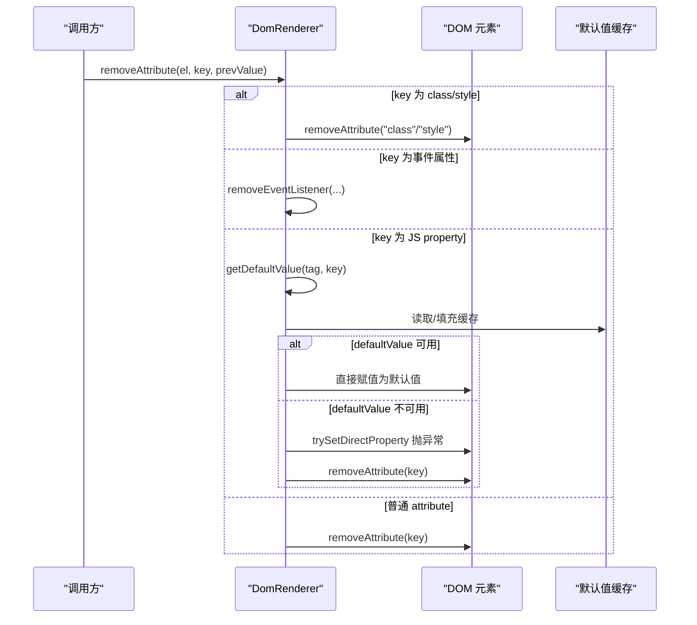
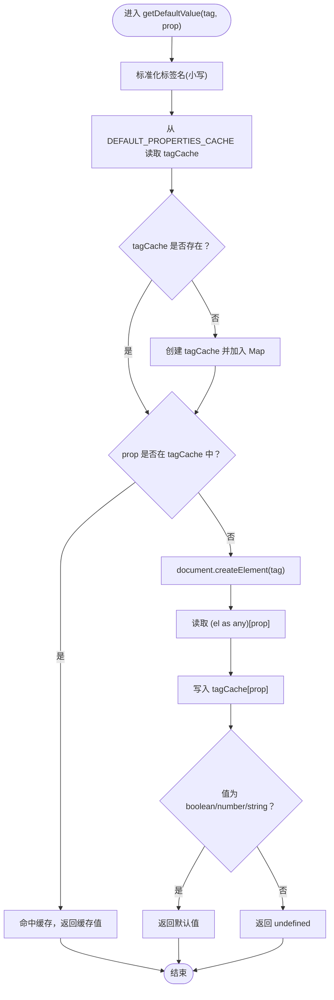
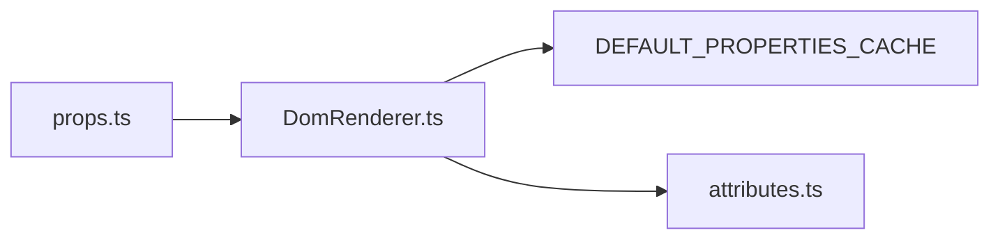

# 布尔属性与默认值恢复

<cite>
**本文引用的文件**
- [DomRenderer.ts](file://packages/runtime-dom/src/DomRenderer.ts)
- [attributes.ts](file://packages/runtime-dom/src/types/attributes.ts)
- [props.ts](file://packages/runtime-core/src/runtime/props.ts)
- [README.md](file://packages/runtime-dom/README.md)
</cite>

## 目录
1. [引言](#引言)
2. [项目结构](#项目结构)
3. [核心组件](#核心组件)
4. [架构总览](#架构总览)
5. [详细组件分析](#详细组件分析)
6. [依赖关系分析](#依赖关系分析)
7. [性能考量](#性能考量)
8. [故障排查指南](#故障排查指南)
9. [结论](#结论)

## 引言
本篇文档聚焦 Vitarx 框架中“布尔属性”的处理机制与“属性移除时的默认值恢复策略”。我们将系统阐述：
- removeAttribute 在移除属性时，如何通过 getDefaultValue 获取标签下该属性的原始默认值，并尝试通过直接属性赋值将其还原，以避免 DOM 状态污染。
- getDefaultValue 的实现原理：动态创建元素探测默认值与缓存优化。
- 为什么某些只读属性会回退到 removeAttribute。
- 通过对比直接移除属性与还原默认值，说明对表单元素（如 checked、disabled）等布尔属性的正确性保障。
- 开发中需要注意的边界情况与最佳实践。

## 项目结构
围绕布尔属性与默认值恢复，本次分析涉及以下关键文件：
- DomRenderer.ts：DOM 渲染器，负责属性设置/移除、事件绑定、默认值缓存与探测。
- attributes.ts：HTML 属性类型定义，包含布尔属性清单与类型约束。
- props.ts：运行时属性处理，包含默认值注入与代理处理逻辑。
- README.md：runtime-dom 的特性说明，涵盖属性处理策略与优先级。

图表来源
- [DomRenderer.ts](file://packages/runtime-dom/src/DomRenderer.ts#L252-L358)
- [attributes.ts](file://packages/runtime-dom/src/types/attributes.ts#L14-L193)
- [props.ts](file://packages/runtime-core/src/runtime/props.ts#L239-L266)
- [README.md](file://packages/runtime-dom/README.md#L211-L220)

章节来源
- [DomRenderer.ts](file://packages/runtime-dom/src/DomRenderer.ts#L252-L358)
- [attributes.ts](file://packages/runtime-dom/src/types/attributes.ts#L14-L193)
- [props.ts](file://packages/runtime-core/src/runtime/props.ts#L239-L266)
- [README.md](file://packages/runtime-dom/README.md#L211-L220)

## 核心组件
- DomRenderer.removeAttribute：移除属性的主流程，优先尝试将属性还原为默认值，失败则回退到 removeAttribute。
- DomRenderer.getDefaultValue：按标签+属性维度缓存默认值，首次探测通过动态创建元素读取。
- DomRenderer.trySetDirectProperty：优先尝试直接设置元素属性，失败再降级 setAttribute。
- attributes.ts：提供 W3C 属性清单与布尔类型约束，支撑类型层面的布尔属性识别。
- props.ts：默认值注入与代理处理，为组件层提供默认值语义，间接影响属性的初始状态。

章节来源
- [DomRenderer.ts](file://packages/runtime-dom/src/DomRenderer.ts#L252-L358)
- [DomRenderer.ts](file://packages/runtime-dom/src/DomRenderer.ts#L540-L566)
- [DomRenderer.ts](file://packages/runtime-dom/src/DomRenderer.ts#L426-L446)
- [attributes.ts](file://packages/runtime-dom/src/types/attributes.ts#L14-L193)
- [props.ts](file://packages/runtime-core/src/runtime/props.ts#L239-L266)

## 架构总览
下面的序列图展示了 removeAttribute 的完整调用链，体现“默认值恢复优先、只读属性回退”的策略。

图表来源
- [DomRenderer.ts](file://packages/runtime-dom/src/DomRenderer.ts#L327-L358)
- [DomRenderer.ts](file://packages/runtime-dom/src/DomRenderer.ts#L540-L566)

## 详细组件分析

### removeAttribute 的处理策略
- class/style 特殊路径：直接移除对应属性，避免误判为普通属性。
- 事件属性：若 prevValue 为函数且 key 以 on 开头，走 removeEventListener 流程。
- JS property：若 key 存在于元素实例上，优先尝试还原默认值；若还原失败（如只读属性），回退 removeAttribute。
- 普通 attribute：直接 removeAttribute。

章节来源
- [DomRenderer.ts](file://packages/runtime-dom/src/DomRenderer.ts#L327-L358)

### getDefaultValue 的实现与缓存
- 作用：按“标签名 + 属性名”维度缓存默认值，避免重复创建元素。
- 探测机制：首次命中未缓存时，动态创建同标签元素，读取属性默认值并写入缓存。
- 类型过滤：仅缓存 boolean/number/string 类型的默认值，其他类型视为不可用。
- 性能收益：后续同标签同属性的默认值读取走内存缓存，减少 DOM 操作。

图表来源
- [DomRenderer.ts](file://packages/runtime-dom/src/DomRenderer.ts#L540-L566)

章节来源
- [DomRenderer.ts](file://packages/runtime-dom/src/DomRenderer.ts#L540-L566)

### 为什么某些只读属性会回退到 removeAttribute
- trySetDirectProperty 在尝试直接赋值时可能抛出异常（如 innerHTML、outerHTML 等只读属性）。
- removeAttribute 是安全的兜底路径，确保不会因异常导致 DOM 状态污染。
- getDefaultValue 的返回值为 undefined 时，也会触发回退。

章节来源
- [DomRenderer.ts](file://packages/runtime-dom/src/DomRenderer.ts#L341-L357)
- [DomRenderer.ts](file://packages/runtime-dom/src/DomRenderer.ts#L426-L446)

### 与属性设置策略的协同
- setAttribute 的优先级策略：事件属性、data-*、命名空间、v-html、Property 优先、最后 setAttribute。
- 这保证了布尔属性在设置阶段也尽可能走“属性赋值”，减少 attribute 与 property 的不一致。

章节来源
- [DomRenderer.ts](file://packages/runtime-dom/src/DomRenderer.ts#L252-L312)
- [README.md](file://packages/runtime-dom/README.md#L211-L220)

### 表单元素布尔属性的正确性保障
- checked、disabled、readonly、required、multiple、hidden 等布尔属性在 DOM 层以 property 形式存在。
- 通过 getDefaultValue 获取原始默认值并直接赋值，可避免 attribute 与 property 的状态错配。
- 例如：input[type=checkbox] 的默认值为 false，input[type=radio] 的默认值也为 false；input[type=button] 的 disabled 默认值为 false。
- 通过“还原默认值”而非“移除属性”，可确保 UI 与底层状态一致，避免出现“属性消失但状态仍为 true”的异常。

章节来源
- [attributes.ts](file://packages/runtime-dom/src/types/attributes.ts#L14-L193)
- [attributes.ts](file://packages/runtime-dom/src/types/attributes.ts#L272-L380)

### 实际示例：直接移除 vs 还原默认值
- 直接移除属性：removeAttribute(key) 会彻底移除该属性，DOM 状态变为“未显式设置”，后续渲染可能受默认值影响。
- 还原默认值：将属性直接赋值为 getDefaultValue(tag, key)，可使 DOM 状态回到“初始真实状态”，避免 attribute 与 property 的不一致。
- 对比意义：前者可能导致 UI 与底层状态不一致；后者确保状态一致，降低副作用。

章节来源
- [DomRenderer.ts](file://packages/runtime-dom/src/DomRenderer.ts#L327-L358)
- [DomRenderer.ts](file://packages/runtime-dom/src/DomRenderer.ts#L540-L566)

## 依赖关系分析
- DomRenderer 依赖 DEFAULT_PROPERTIES_CACHE 进行默认值缓存。
- DomRenderer 依赖 attributes.ts 的属性清单与布尔类型约束，辅助类型层面的布尔属性识别。
- props.ts 的默认值注入与代理处理，为组件层提供默认值语义，间接影响属性的初始状态，从而影响 removeAttribute 的恢复效果。

图表来源
- [DomRenderer.ts](file://packages/runtime-dom/src/DomRenderer.ts#L42-L44)
- [DomRenderer.ts](file://packages/runtime-dom/src/DomRenderer.ts#L540-L566)
- [attributes.ts](file://packages/runtime-dom/src/types/attributes.ts#L14-L193)
- [props.ts](file://packages/runtime-core/src/runtime/props.ts#L239-L266)

章节来源
- [DomRenderer.ts](file://packages/runtime-dom/src/DomRenderer.ts#L42-L44)
- [DomRenderer.ts](file://packages/runtime-dom/src/DomRenderer.ts#L540-L566)
- [attributes.ts](file://packages/runtime-dom/src/types/attributes.ts#L14-L193)
- [props.ts](file://packages/runtime-core/src/runtime/props.ts#L239-L266)

## 性能考量
- 默认值缓存：DEFAULT_PROPERTIES_CACHE 以标签名为一级键，属性名为二级键，首次探测后常驻内存，显著降低重复创建元素的成本。
- trySetDirectProperty：优先走属性赋值，避免 setAttribute 的额外开销与潜在副作用。
- 事件属性与特殊属性的快速分支：减少不必要的探测与 DOM 访问。

章节来源
- [DomRenderer.ts](file://packages/runtime-dom/src/DomRenderer.ts#L540-L566)
- [DomRenderer.ts](file://packages/runtime-dom/src/DomRenderer.ts#L426-L446)
- [README.md](file://packages/runtime-dom/README.md#L211-L220)

## 故障排查指南
- 症状：移除布尔属性后 UI 未回到初始状态。
  - 排查：确认是否为只读属性（如 innerHTML），此时会回退 removeAttribute，无法还原默认值。
  - 解决：在业务层避免对只读属性进行移除；或在渲染前显式设置为默认值。
- 症状：多次切换布尔属性导致状态异常。
  - 排查：确认是否频繁移除与设置，建议统一通过“还原默认值”策略处理。
  - 解决：使用框架提供的属性更新流程，避免绕过 removeAttribute 的默认值恢复。
- 症状：表单元素状态与预期不符。
  - 排查：检查属性类型是否为布尔属性，确认 getDefaultValue 的返回值是否为期望的布尔默认值。
  - 解决：确保属性值为布尔类型，必要时在组件层注入默认值。

章节来源
- [DomRenderer.ts](file://packages/runtime-dom/src/DomRenderer.ts#L327-L358)
- [DomRenderer.ts](file://packages/runtime-dom/src/DomRenderer.ts#L540-L566)
- [props.ts](file://packages/runtime-core/src/runtime/props.ts#L239-L266)

## 结论
Vitarx 在布尔属性处理上采用“默认值恢复优先、只读属性回退”的稳健策略：
- 通过 getDefaultValue 动态探测并缓存默认值，结合 trySetDirectProperty 优先赋值，减少 attribute 与 property 的不一致。
- 对只读属性与不可探测的属性，回退 removeAttribute，确保 DOM 状态干净，避免污染。
- 对表单元素（如 checked、disabled、readonly、required、multiple、hidden）等布尔属性，还原默认值能有效保障 UI 与底层状态一致性。
- 开发者在处理布尔属性时，应优先考虑“还原默认值”而非“直接移除”，并在只读属性场景下谨慎操作。