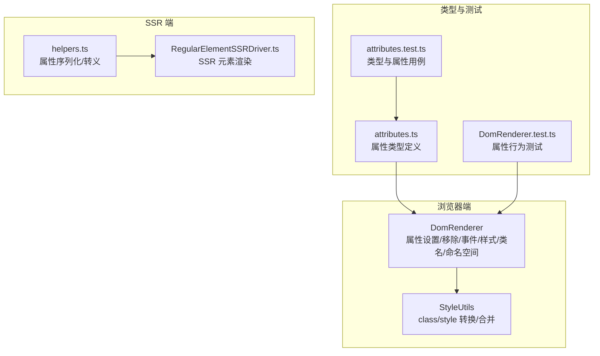
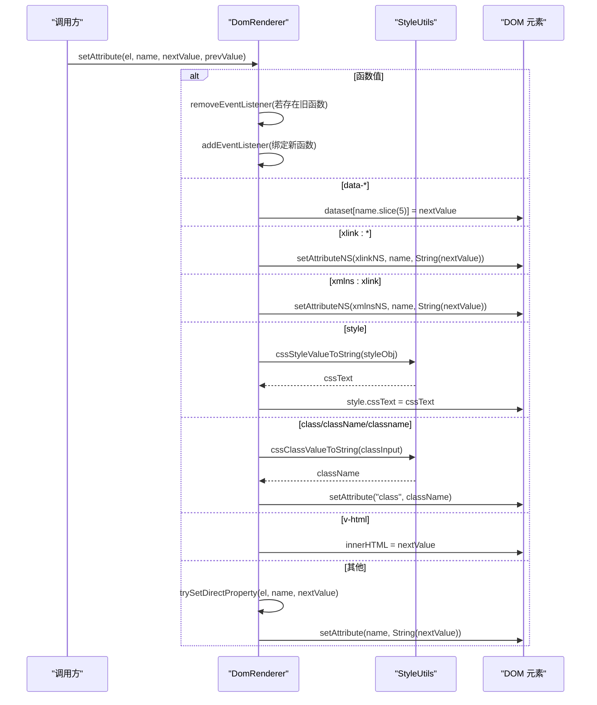
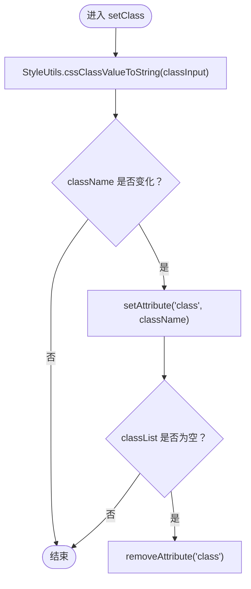
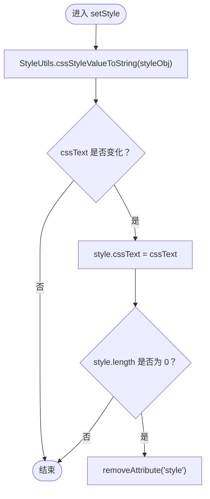
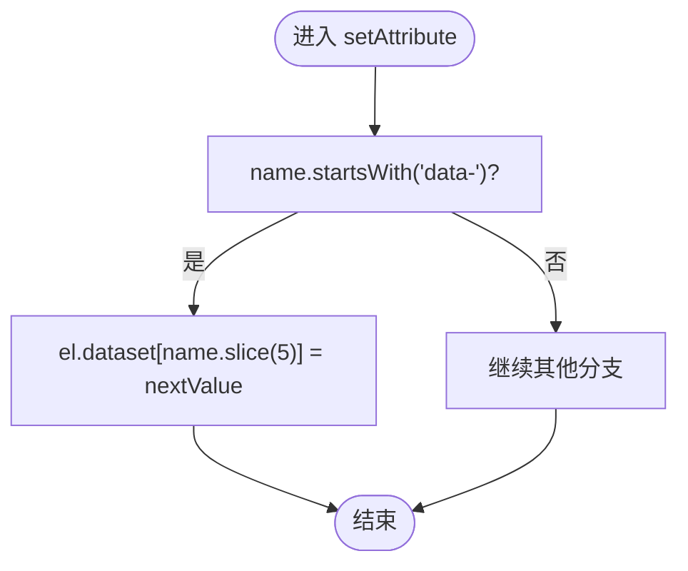
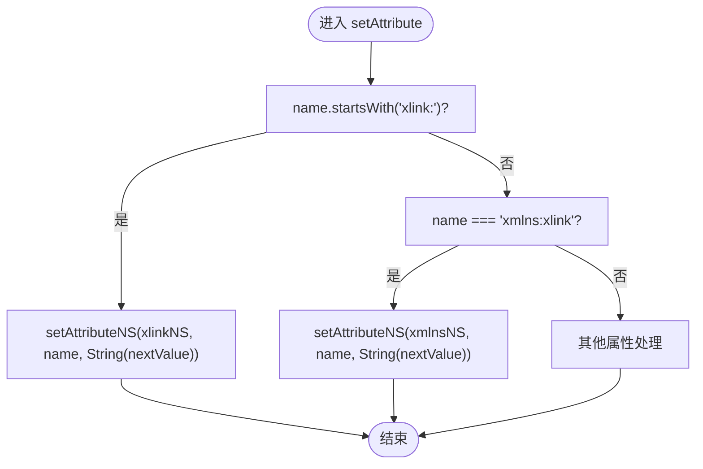
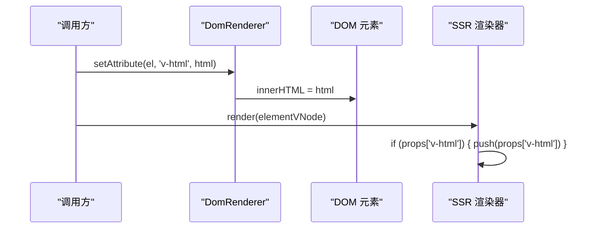
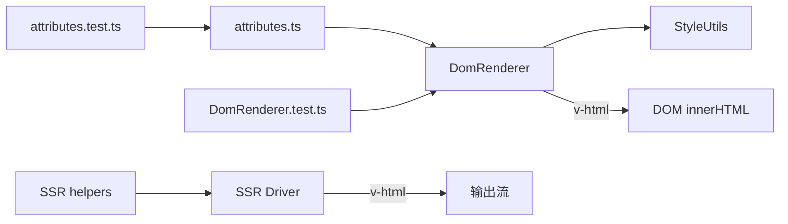

# 特殊属性处理

<cite>
**本文引用的文件**
- [DomRenderer.ts](file://packages/runtime-dom/src/DomRenderer.ts)
- [style.ts](file://packages/runtime-core/src/utils/style.ts)
- [attributes.ts](file://packages/runtime-dom/src/types/attributes.ts)
- [attributes.test.ts](file://packages/runtime-dom/__tests__/types/attributes.test.ts)
- [DomRenderer.test.ts](file://packages/runtime-dom/__tests__/client/DomRenderer.test.ts)
- [helpers.ts](file://packages/runtime-ssr/src/string/helpers.ts)
- [RegularElementSSRDriver.ts](file://packages/runtime-ssr/src/server/RegularElementSSRDriver.ts)
- [core.ts](file://packages/runtime-core/src/directive/core.ts)
</cite>

## 目录
1. [引言](#引言)
2. [项目结构](#项目结构)
3. [核心组件](#核心组件)
4. [架构总览](#架构总览)
5. [详细组件分析](#详细组件分析)
6. [依赖分析](#依赖分析)
7. [性能考量](#性能考量)
8. [故障排查指南](#故障排查指南)
9. [结论](#结论)
10. [附录](#附录)

## 引言
本文件系统性阐述 Vitarx 框架在浏览器端渲染器中对特殊 DOM 属性的处理策略，重点覆盖以下方面：
- class 属性：通过统一的 setClass 与 addClass/removeClass 管理，兼容字符串、数组与对象三类输入，保证与 dataset 的互斥与一致性。
- style 属性：通过 setStyle 将对象或字符串转换为 CSS 文本，removeStyle 提供清理策略，避免冗余 style 属性残留。
- data-* 属性：直接映射到元素的 dataset 对象，便于在运行时读取与调试。
- 命名空间属性：xlink:* 与 xmlns:xlink 通过 setAttributeNS 正确设置，确保 SVG 等命名空间元素的属性生效。
- v-html 指令：在浏览器端直接写入 innerHTML，SSR 端按属性直出，需注意安全风险与最佳实践。

## 项目结构
围绕特殊属性处理的相关模块分布如下：
- 浏览器端渲染器 DomRenderer：负责 DOM 元素创建、属性设置与移除、事件绑定、样式与类名管理、命名空间属性处理。
- 样式工具 StyleUtils：提供 class 与 style 的多形态输入转换与合并能力。
- 类型定义 attributes.ts：为 HTML 属性提供类型约束，明确 class、style、v-html 等特殊属性的类型与行为。
- 测试用例：覆盖属性设置、命名空间属性、事件、样式与类名等行为验证。
- SSR 端：在服务端渲染时对 v-html 与命名空间属性进行序列化与输出。

图表来源
- [DomRenderer.ts](file://packages/runtime-dom/src/DomRenderer.ts#L180-L358)
- [style.ts](file://packages/runtime-core/src/utils/style.ts#L66-L171)
- [attributes.ts](file://packages/runtime-dom/src/types/attributes.ts#L605-L633)
- [attributes.test.ts](file://packages/runtime-dom/__tests__/types/attributes.test.ts#L183-L192)
- [DomRenderer.test.ts](file://packages/runtime-dom/__tests__/client/DomRenderer.test.ts#L236-L258)
- [helpers.ts](file://packages/runtime-ssr/src/string/helpers.ts#L1-L106)
- [RegularElementSSRDriver.ts](file://packages/runtime-ssr/src/server/RegularElementSSRDriver.ts#L31-L47)

章节来源
- [DomRenderer.ts](file://packages/runtime-dom/src/DomRenderer.ts#L180-L358)
- [style.ts](file://packages/runtime-core/src/utils/style.ts#L66-L171)
- [attributes.ts](file://packages/runtime-dom/src/types/attributes.ts#L605-L633)
- [attributes.test.ts](file://packages/runtime-dom/__tests__/types/attributes.test.ts#L183-L192)
- [DomRenderer.test.ts](file://packages/runtime-dom/__tests__/client/DomRenderer.test.ts#L236-L258)
- [helpers.ts](file://packages/runtime-ssr/src/string/helpers.ts#L1-L106)
- [RegularElementSSRDriver.ts](file://packages/runtime-ssr/src/server/RegularElementSSRDriver.ts#L31-L47)

## 核心组件
- DomRenderer：浏览器端渲染器，实现 HostRenderer 接口，负责元素创建、属性批量设置、事件绑定与移除、样式与类名管理、命名空间属性处理、文本与注释节点创建等。
- StyleUtils：提供 class 与 style 的多形态输入转换与合并，支持字符串、数组、对象等输入，统一输出为字符串或对象，便于 DomRenderer 统一处理。
- attributes.ts：定义 HTML 属性类型，明确 class、style、v-html 等特殊属性的类型约束与行为边界。
- SSR helpers 与 RegularElementSSRDriver：在 SSR 场景中对 v-html 与命名空间属性进行序列化与直出，避免客户端内联 HTML。

章节来源
- [DomRenderer.ts](file://packages/runtime-dom/src/DomRenderer.ts#L180-L358)
- [style.ts](file://packages/runtime-core/src/utils/style.ts#L66-L171)
- [attributes.ts](file://packages/runtime-dom/src/types/attributes.ts#L605-L633)
- [helpers.ts](file://packages/runtime-ssr/src/string/helpers.ts#L1-L106)
- [RegularElementSSRDriver.ts](file://packages/runtime-ssr/src/server/RegularElementSSRDriver.ts#L31-L47)

## 架构总览
浏览器端渲染流程中，DomRenderer 在 setAttribute 与 setAttributes 中对特殊属性进行分支处理：
- 事件属性：函数值时走事件绑定/解绑路径。
- data-*：直接写入 dataset。
- xlink:* 与 xmlns:xlink：通过 setAttributeNS 设置命名空间属性。
- style：委托 StyleUtils 转换后写入 style.cssText。
- class/className/classname：委托 StyleUtils 转换后写入 class 属性。
- v-html：直接写入 innerHTML。
- 其他：尝试直接设置元素属性，否则回退到 setAttribute。

图表来源
- [DomRenderer.ts](file://packages/runtime-dom/src/DomRenderer.ts#L253-L305)
- [style.ts](file://packages/runtime-core/src/utils/style.ts#L66-L86)

章节来源
- [DomRenderer.ts](file://packages/runtime-dom/src/DomRenderer.ts#L253-L305)
- [style.ts](file://packages/runtime-core/src/utils/style.ts#L66-L86)

## 详细组件分析

### class 属性处理
- 输入形态：字符串、字符串数组、对象（键为类名，值为布尔决定是否启用）。
- 转换与设置：StyleUtils 将输入转换为字符串，DomRenderer 仅在值变化时更新 class 属性；当类名集合为空时移除 class 属性，避免冗余。
- 增删策略：addClass/removeClass 支持空格分隔的类名批量拆分，逐个调用 classList 操作，最终在必要时移除 class 属性。
- 与 dataset 的互斥：class 与 data-* 分属不同属性通道，互不影响。

图表来源
- [DomRenderer.ts](file://packages/runtime-dom/src/DomRenderer.ts#L196-L203)
- [style.ts](file://packages/runtime-core/src/utils/style.ts#L149-L171)

章节来源
- [DomRenderer.ts](file://packages/runtime-dom/src/DomRenderer.ts#L196-L203)
- [style.ts](file://packages/runtime-core/src/utils/style.ts#L149-L171)
- [DomRenderer.test.ts](file://packages/runtime-dom/__tests__/client/DomRenderer.test.ts#L341-L377)

### style 属性处理
- 输入形态：字符串或对象（驼峰键名映射到 kebab-case CSS 属性）。
- 转换与设置：StyleUtils 将对象转换为 CSS 文本，DomRenderer 仅在值变化时写入 style.cssText。
- 清理策略：removeStyle 移除指定属性并检查 style.length，若为空则移除 style 属性，避免空 style 属性残留。
- 读取策略：getStyle 通过 getPropertyValue 获取值，不存在时返回 null。

图表来源
- [DomRenderer.ts](file://packages/runtime-dom/src/DomRenderer.ts#L239-L246)
- [style.ts](file://packages/runtime-core/src/utils/style.ts#L66-L86)

章节来源
- [DomRenderer.ts](file://packages/runtime-dom/src/DomRenderer.ts#L239-L246)
- [style.ts](file://packages/runtime-core/src/utils/style.ts#L66-L86)
- [DomRenderer.test.ts](file://packages/runtime-dom/__tests__/client/DomRenderer.test.ts#L313-L340)

### data-* 属性处理
- 映射机制：以 "data-" 开头的属性名直接写入元素的 dataset 对象，键名去除 "data-" 前缀。
- 读写一致性：dataset 与 class/style 独立管理，互不干扰。
- 测试验证：通过测试断言 dataset 的读写行为。

图表来源
- [DomRenderer.ts](file://packages/runtime-dom/src/DomRenderer.ts#L271-L273)

章节来源
- [DomRenderer.ts](file://packages/runtime-dom/src/DomRenderer.ts#L271-L273)
- [DomRenderer.test.ts](file://packages/runtime-dom/__tests__/client/DomRenderer.test.ts#L230-L234)

### 命名空间属性处理（xlink:* 与 xmlns:xlink）
- xlink:*：以 "xlink:" 开头的属性通过 setAttributeNS 设置，命名空间为 xlink 常量。
- xmlns:xlink：特殊处理，使用 XMLNS 命名空间设置。
- 测试验证：在 SVG 环境下设置命名空间属性并通过 hasAttributeNS/getAttributeNS 断言。

图表来源
- [DomRenderer.ts](file://packages/runtime-dom/src/DomRenderer.ts#L275-L297)

章节来源
- [DomRenderer.ts](file://packages/runtime-dom/src/DomRenderer.ts#L275-L297)
- [DomRenderer.test.ts](file://packages/runtime-dom/__tests__/client/DomRenderer.test.ts#L236-L258)
- [helpers.ts](file://packages/runtime-ssr/src/string/helpers.ts#L89-L96)
- [RegularElementSSRDriver.ts](file://packages/runtime-ssr/src/server/RegularElementSSRDriver.ts#L33-L37)

### v-html 指令实现与安全风险
- 浏览器端：在 setAttribute 中识别 "v-html" 属性，直接写入 innerHTML，实现动态 HTML 插入。
- SSR 端：在 RegularElementSSRDriver 中检测 props['v-html'] 并直接推送字符串到输出流，避免二次转义。
- 安全风险：innerHTML 可能引入 XSS，建议仅在可信内容上使用，或在写入前进行严格的白名单过滤与转义。
- 类型约束：attributes.ts 明确 'v-html' 属性类型为可选字符串，便于类型推导与 IDE 提示。

图表来源
- [DomRenderer.ts](file://packages/runtime-dom/src/DomRenderer.ts#L289-L291)
- [attributes.ts](file://packages/runtime-dom/src/types/attributes.ts#L623-L626)
- [RegularElementSSRDriver.ts](file://packages/runtime-ssr/src/server/RegularElementSSRDriver.ts#L33-L37)

章节来源
- [DomRenderer.ts](file://packages/runtime-dom/src/DomRenderer.ts#L289-L291)
- [attributes.ts](file://packages/runtime-dom/src/types/attributes.ts#L623-L626)
- [attributes.test.ts](file://packages/runtime-dom/__tests__/types/attributes.test.ts#L183-L192)
- [RegularElementSSRDriver.ts](file://packages/runtime-ssr/src/server/RegularElementSSRDriver.ts#L33-L37)

## 依赖分析
- DomRenderer 依赖 StyleUtils 进行 class/style 的统一转换。
- attributes.ts 为属性类型约束提供基础，确保编译期对 class/style/v-html 等特殊属性的正确性。
- SSR helpers 与 RegularElementSSRDriver 与 DomRenderer 在 v-html 与命名空间属性上的处理形成互补：浏览器端直写 innerHTML/命名空间属性，SSR 端直出 HTML 字符串。

图表来源
- [DomRenderer.ts](file://packages/runtime-dom/src/DomRenderer.ts#L180-L358)
- [style.ts](file://packages/runtime-core/src/utils/style.ts#L66-L171)
- [attributes.ts](file://packages/runtime-dom/src/types/attributes.ts#L605-L633)
- [helpers.ts](file://packages/runtime-ssr/src/string/helpers.ts#L1-L106)
- [RegularElementSSRDriver.ts](file://packages/runtime-ssr/src/server/RegularElementSSRDriver.ts#L31-L47)

章节来源
- [DomRenderer.ts](file://packages/runtime-dom/src/DomRenderer.ts#L180-L358)
- [style.ts](file://packages/runtime-core/src/utils/style.ts#L66-L171)
- [attributes.ts](file://packages/runtime-dom/src/types/attributes.ts#L605-L633)
- [helpers.ts](file://packages/runtime-ssr/src/string/helpers.ts#L1-L106)
- [RegularElementSSRDriver.ts](file://packages/runtime-ssr/src/server/RegularElementSSRDriver.ts#L31-L47)

## 性能考量
- class/style 的批量设置：DomRenderer 在 setStyle/setClass 中比较当前值与目标值，仅在变化时写入，减少不必要的 DOM 操作与重排。
- removeStyle 的清理：当 style 属性为空时移除 style 属性，避免空属性带来的额外开销。
- class 的空集合清理：当类名集合为空时移除 class 属性，保持 DOM 属性简洁。
- 事件绑定的幂等：函数值时先移除旧事件再绑定新事件，避免重复绑定导致的内存泄漏与多次触发。
- 命名空间属性：仅在匹配分支时调用 setAttributeNS，避免不必要的命名空间解析。

章节来源
- [DomRenderer.ts](file://packages/runtime-dom/src/DomRenderer.ts#L180-L203)
- [DomRenderer.ts](file://packages/runtime-dom/src/DomRenderer.ts#L239-L246)
- [DomRenderer.ts](file://packages/runtime-dom/src/DomRenderer.ts#L253-L305)

## 故障排查指南
- v-html 导致的安全问题
  - 症状：注入脚本或恶意 HTML 导致页面被篡改。
  - 排查：确认 v-html 的来源是否可信；在写入前进行白名单过滤与转义。
  - 参考：SSR 端对 v-html 的直出行为，避免重复转义。
- class/style 未生效
  - 症状：样式未更新或类名未变化。
  - 排查：确认输入形态（字符串/数组/对象）是否符合预期；检查 DomRenderer 的值比较逻辑是否命中更新分支。
- data-* 读取不到
  - 症状：dataset 读取为空。
  - 排查：确认属性名是否以 "data-" 开头；检查 setAttribute 是否被调用。
- 命名空间属性无效
  - 症状：xlink:href 或 xmlns:xlink 未生效。
  - 排查：确认元素命名空间（如 SVG）；检查 setAttributeNS 的调用路径；在测试中使用 hasAttributeNS/getAttributeNS 验证。

章节来源
- [DomRenderer.test.ts](file://packages/runtime-dom/__tests__/client/DomRenderer.test.ts#L236-L258)
- [DomRenderer.test.ts](file://packages/runtime-dom/__tests__/client/DomRenderer.test.ts#L313-L377)
- [DomRenderer.ts](file://packages/runtime-dom/src/DomRenderer.ts#L271-L297)
- [helpers.ts](file://packages/runtime-ssr/src/string/helpers.ts#L89-L96)
- [RegularElementSSRDriver.ts](file://packages/runtime-ssr/src/server/RegularElementSSRDriver.ts#L33-L37)

## 结论
Vitarx 框架通过 DomRenderer 对 class/style/data-*、命名空间属性与 v-html 等特殊属性提供了统一、类型安全且高性能的处理策略。StyleUtils 为多形态输入提供转换与合并能力，attributes.ts 明确类型约束，测试用例覆盖关键行为。在 SSR 端，v-html 与命名空间属性通过 helpers 与 SSR 驱动直出，保证前后端一致性。对于 v-html，务必重视安全风险，仅在可信内容上使用。

## 附录
- 正确用法示例（以路径代替代码片段）
  - class 属性：参考 [DomRenderer.test.ts](file://packages/runtime-dom/__tests__/client/DomRenderer.test.ts#L341-L377)
  - style 属性：参考 [DomRenderer.test.ts](file://packages/runtime-dom/__tests__/client/DomRenderer.test.ts#L313-L340)
  - data-* 属性：参考 [DomRenderer.test.ts](file://packages/runtime-dom/__tests__/client/DomRenderer.test.ts#L230-L234)
  - 命名空间属性：参考 [DomRenderer.test.ts](file://packages/runtime-dom/__tests__/client/DomRenderer.test.ts#L236-L258)
  - v-html 类型与用法：参考 [attributes.test.ts](file://packages/runtime-dom/__tests__/types/attributes.test.ts#L183-L192) 与 [attributes.ts](file://packages/runtime-dom/src/types/attributes.ts#L623-L626)
- 最佳实践
  - 优先使用对象/数组形式的 class/style，借助 StyleUtils 的转换与合并能力。
  - v-html 仅用于可信内容，必要时进行白名单过滤与转义。
  - 事件属性使用函数值时，确保同一引用避免重复绑定；移除时使用 removeAttribute 并清理事件监听器。
  - 命名空间属性在 SVG 环境下使用，确保元素命名空间与属性命名空间一致。