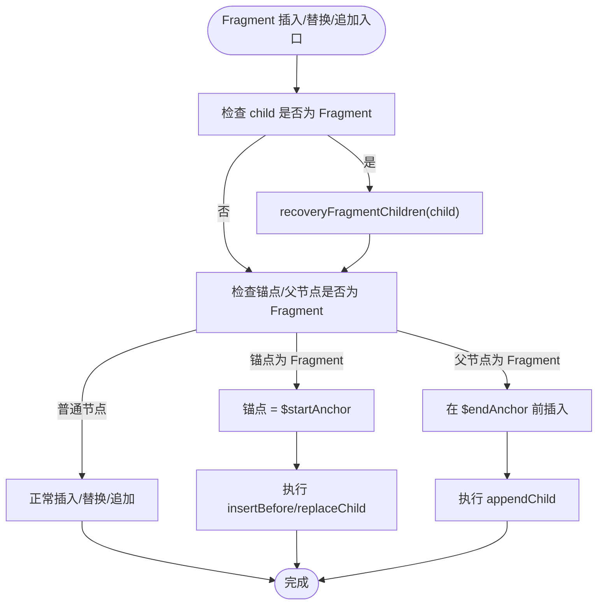

# DOM 操作机制

<cite>
**本文引用的文件**
- [DomRenderer.ts](file://packages/runtime-dom/src/DomRenderer.ts)
- [attributes.ts](file://packages/runtime-dom/src/types/attributes.ts)
- [event.ts](file://packages/runtime-dom/src/types/event.ts)
- [FragmentDriver.ts](file://packages/runtime-drivers/src/drivers/FragmentDriver.ts)
- [FragmentVNode.ts](file://packages/runtime-core/src/types/nodes/FragmentVNode.ts)
- [fragment.ts](file://packages/runtime-core/src/vnode/creator/fragment.ts)
- [element.ts](file://packages/runtime-core/src/utils/element.ts)
- [style.ts](file://packages/runtime-core/src/utils/style.ts)
- [nodeTypes.ts](file://packages/runtime-core/src/constants/nodeTypes.ts)
- [nodeKind.ts](file://packages/runtime-core/src/constants/nodeKind.ts)
</cite>

## 目录
1. [引言](#引言)
2. [项目结构](#项目结构)
3. [核心组件](#核心组件)
4. [架构总览](#架构总览)
5. [详细组件分析](#详细组件分析)
6. [依赖关系分析](#依赖关系分析)
7. [性能考量](#性能考量)
8. [故障排查指南](#故障排查指南)
9. [结论](#结论)

## 引言
本文件面向 Vitarx 运行时的 DOM 操作机制，系统梳理属性更新流程（普通属性、样式、类名、事件监听器、data 属性）、事件选项解析（capture、once、passive）、属性移除时的默认值还原策略、Fragment 节点的特殊处理（startAnchor/endAnchor、插入/替换/追加兼容）、以及样式管理（setClass/addClass/removeClass/setStyle）的实现细节与最佳实践。旨在帮助开发者在理解框架内部工作原理的基础上，编写更稳健、高效的 DOM 更新与交互代码。

## 项目结构
围绕 DOM 操作的关键模块分布如下：
- 运行时 DOM 渲染器：负责在浏览器环境中创建/更新/删除 DOM，处理属性、事件、样式与 Fragment。
- 驱动层 Fragment 驱动：负责 Fragment 节点的宿主元素创建与容器能力混入。
- 虚拟节点与工具：提供 FragmentVNode 接口、FragmentVNode 创建器、DOM 操作目标元素获取等。
- 样式工具：提供类名与样式的统一转换与合并能力。
- 类型系统：定义 HTML 属性、事件与事件选项的完整类型约束。

图表来源
- [DomRenderer.ts](file://packages/runtime-dom/src/DomRenderer.ts#L1-L120)
- [style.ts](file://packages/runtime-core/src/utils/style.ts#L1-L173)
- [FragmentDriver.ts](file://packages/runtime-drivers/src/drivers/FragmentDriver.ts#L1-L42)
- [FragmentVNode.ts](file://packages/runtime-core/src/types/nodes/FragmentVNode.ts#L1-L17)
- [fragment.ts](file://packages/runtime-core/src/vnode/creator/fragment.ts#L1-L24)
- [element.ts](file://packages/runtime-core/src/utils/element.ts#L1-L33)
- [attributes.ts](file://packages/runtime-dom/src/types/attributes.ts#L1-L120)
- [event.ts](file://packages/runtime-dom/src/types/event.ts#L490-L562)
- [nodeTypes.ts](file://packages/runtime-core/src/constants/nodeTypes.ts#L1-L8)
- [nodeKind.ts](file://packages/runtime-core/src/constants/nodeKind.ts#L1-L26)

章节来源
- [DomRenderer.ts](file://packages/runtime-dom/src/DomRenderer.ts#L1-L120)
- [FragmentDriver.ts](file://packages/runtime-drivers/src/drivers/FragmentDriver.ts#L1-L42)
- [fragment.ts](file://packages/runtime-core/src/vnode/creator/fragment.ts#L1-L24)
- [element.ts](file://packages/runtime-core/src/utils/element.ts#L1-L33)
- [style.ts](file://packages/runtime-core/src/utils/style.ts#L1-L173)
- [attributes.ts](file://packages/runtime-dom/src/types/attributes.ts#L1-L120)
- [event.ts](file://packages/runtime-dom/src/types/event.ts#L490-L562)
- [nodeTypes.ts](file://packages/runtime-core/src/constants/nodeTypes.ts#L1-L8)
- [nodeKind.ts](file://packages/runtime-core/src/constants/nodeKind.ts#L1-L26)

## 核心组件
- DomRenderer：浏览器 DOM 渲染器，实现属性设置/移除、事件绑定/解绑、样式与类名管理、Fragment 插入/替换/追加、范围删除等。
- FragmentDriver：Fragment 节点驱动，创建宿主 Fragment 元素并混入容器能力。
- StyleUtils：样式与类名转换/合并工具，支撑 setStyle/setClass/addClass/removeClass 的高效实现。
- 虚拟节点与工具：FragmentVNode 接口、FragmentVNode 创建器、getNodeDomOpsTarget 获取 DOM 操作目标。

章节来源
- [DomRenderer.ts](file://packages/runtime-dom/src/DomRenderer.ts#L62-L120)
- [FragmentDriver.ts](file://packages/runtime-drivers/src/drivers/FragmentDriver.ts#L1-L42)
- [style.ts](file://packages/runtime-core/src/utils/style.ts#L1-L173)
- [fragment.ts](file://packages/runtime-core/src/vnode/creator/fragment.ts#L1-L24)
- [element.ts](file://packages/runtime-core/src/utils/element.ts#L1-L33)

## 架构总览
DOM 操作由渲染器统一调度，事件与属性更新遵循“优先直设属性、其次 dataset/NS、再走 setAttribute”的策略；样式与类名通过 StyleUtils 统一转换；Fragment 通过 startAnchor/endAnchor 标记边界，插入/替换/追加均兼容 Fragment。

图表来源
- [DomRenderer.ts](file://packages/runtime-dom/src/DomRenderer.ts#L252-L358)
- [style.ts](file://packages/runtime-core/src/utils/style.ts#L66-L110)

章节来源
- [DomRenderer.ts](file://packages/runtime-dom/src/DomRenderer.ts#L252-L358)

## 详细组件分析

### 属性更新流程与差异化处理
- 函数类型事件处理器
  - 若 nextValue 为函数，且 prevValue 也为函数，则先移除旧监听，再绑定新监听；若 prevValue 为函数但 nextValue 非函数，则按常规移除逻辑处理。
  - 事件名解析与选项抽取：extractEventOptions 从 onXxx 名称中剥离 capture/once/passive，并将事件名标准化为小写。
  - addEventListener/removeEventListener 基于 extractEventOptions 的结果与传入 options 合并后调用原生 API。
- data-* 属性
  - 以 data- 开头的属性写入 dataset，键名去除前缀。
- xlink:* 属性
  - 以 xlink: 开头的属性通过命名空间 setAttributeNS 写入。
- 特殊属性
  - style：委托 StyleUtils 转换为 cssText 并设置；若最终样式为空则移除 style 属性。
  - class/className：委托 StyleUtils 转换为字符串并设置 class 属性；若最终类名为空则移除 class 属性。
  - v-html：直接设置 innerHTML。
  - autoFocus：直接设置 autofocus 布尔属性。
- 直设属性与后备 setAttribute
  - trySetDirectProperty 优先尝试直接设置元素属性；失败则回退到 setAttribute。
- 事件选项解析逻辑
  - extractEventOptions 支持从 onXxx、onXxxCapture、onXxxOnce、onXxxPassive、onXxxOnceCapture 等命名中解析 capture/once/passive 选项。
  - 与传入 options 合并后传入 addEventListener。

章节来源
- [DomRenderer.ts](file://packages/runtime-dom/src/DomRenderer.ts#L252-L358)
- [DomRenderer.ts](file://packages/runtime-dom/src/DomRenderer.ts#L487-L538)
- [style.ts](file://packages/runtime-core/src/utils/style.ts#L66-L110)
- [event.ts](file://packages/runtime-dom/src/types/event.ts#L490-L562)

### removeAttribute 的默认值还原策略
- class/style：直接移除对应属性，避免残留。
- 事件属性（onXxx）：若 prevValue 为函数，先移除对应事件监听器，再按普通属性处理。
- JS 属性：若 key 存在于元素上，尝试从缓存或新建元素获取默认值并还原；对于不可写/只读属性（如 innerHTML）会捕获异常并回退到 removeAttribute。
- 普通 attribute：直接 removeAttribute。

章节来源
- [DomRenderer.ts](file://packages/runtime-dom/src/DomRenderer.ts#L327-L358)
- [DomRenderer.ts](file://packages/runtime-dom/src/DomRenderer.ts#L540-L566)

### Fragment 节点的特殊处理与 DOM 操作兼容
- Fragment 宿主元素
  - createFragment 创建文档片段，并附加 $startAnchor/$endAnchor 注释节点与 $vnode 引用，用于后续 DOM 操作定位与恢复。
- 插入/替换/追加兼容
  - insertBefore：若锚点为 Fragment，则使用其 $startAnchor；同时在插入前对 child 调用 recoveryFragmentChildren，确保 Fragment 子节点被恢复为真实 DOM。
  - replace：若 oldChild 为 Fragment，则使用其 $startAnchor.parentNode 作为父节点；先在 $startAnchor 前插入 newChild，再删除旧 Fragment。
  - appendChild：若 parent 为 Fragment 且 $endAnchor 已挂载，则在 $endAnchor 前插入；否则直接追加到父节点。
- recoveryFragmentChildren
  - 若 Fragment 内部无子节点，基于 $vnode.children 递归恢复子树并插入 start/end 锚点；若仅缺少 start 锚点，插入 start 再追加 end。
- getNodeDomOpsTarget
  - Fragment 的操作目标优先使用 anchor（若存在），否则回退到 el；这保证了 Fragment 在插入/替换时能稳定定位锚点。

图表来源
- [DomRenderer.ts](file://packages/runtime-dom/src/DomRenderer.ts#L127-L177)
- [DomRenderer.ts](file://packages/runtime-dom/src/DomRenderer.ts#L400-L424)
- [element.ts](file://packages/runtime-core/src/utils/element.ts#L28-L33)

章节来源
- [DomRenderer.ts](file://packages/runtime-dom/src/DomRenderer.ts#L88-L177)
- [DomRenderer.ts](file://packages/runtime-dom/src/DomRenderer.ts#L400-L424)
- [element.ts](file://packages/runtime-core/src/utils/element.ts#L28-L33)
- [FragmentDriver.ts](file://packages/runtime-drivers/src/drivers/FragmentDriver.ts#L28-L41)
- [fragment.ts](file://packages/runtime-core/src/vnode/creator/fragment.ts#L1-L24)
- [FragmentVNode.ts](file://packages/runtime-core/src/types/nodes/FragmentVNode.ts#L1-L17)
- [nodeTypes.ts](file://packages/runtime-core/src/constants/nodeTypes.ts#L1-L8)
- [nodeKind.ts](file://packages/runtime-core/src/constants/nodeKind.ts#L1-L26)

### 事件绑定/解绑与 extractEventOptions 解析
- addEventListener
  - 从事件名解析出事件名与选项，与传入 options 合并后调用 addEventListener。
- removeEventListener
  - 从事件名解析出事件名与选项，使用 capture 优先级与传入 useCapture 合并后调用 removeEventListener。
- extractEventOptions
  - 支持从 onXxx、onXxxCapture、onXxxOnce、onXxxPassive、onXxxOnceCapture 等命名中解析 capture/once/passive。
  - 事件名标准化为小写，末尾的 Capture/Once/Passive 被剥离并映射到选项对象。

图表来源
- [DomRenderer.ts](file://packages/runtime-dom/src/DomRenderer.ts#L487-L538)
- [event.ts](file://packages/runtime-dom/src/types/event.ts#L490-L562)

章节来源
- [DomRenderer.ts](file://packages/runtime-dom/src/DomRenderer.ts#L487-L538)
- [event.ts](file://packages/runtime-dom/src/types/event.ts#L490-L562)

### 样式与类名管理（setStyle/setClass/addClass/removeClass）
- setStyle
  - 使用 StyleUtils.cssStyleValueToString 将样式对象/字符串转换为 cssText，设置到 style.cssText；若最终样式为空则移除 style 属性。
- setClass
  - 使用 StyleUtils.cssClassValueToString 将类名（字符串/数组/对象）转换为字符串，设置到 class 属性；若最终类名为空则移除 class 属性。
- addClass/removeClass
  - 支持空格分隔的多类名字符串，拆分为数组逐个调用 classList.add/remove；若最终 classList 为空则移除 class 属性。
- StyleUtils
  - 提供 cssStyleValueToString/cssStyleValueToObject、cssClassValueToArray/cssClassValueToString、mergeCssClass/mergeCssStyle 等工具方法，统一处理命名风格与合并策略。

图表来源
- [DomRenderer.ts](file://packages/runtime-dom/src/DomRenderer.ts#L196-L246)
- [style.ts](file://packages/runtime-core/src/utils/style.ts#L66-L171)

章节来源
- [DomRenderer.ts](file://packages/runtime-dom/src/DomRenderer.ts#L196-L246)
- [style.ts](file://packages/runtime-core/src/utils/style.ts#L66-L171)

## 依赖关系分析
- DomRenderer 依赖
  - 运行时核心类型与工具：Void 元素集合、HostRenderer 接口、StyleUtils、getNodeDomOpsTarget。
  - 事件类型：HTMLEventOptions、事件映射与修饰符。
  - 样式工具：StyleUtils。
- FragmentDriver 依赖
  - getRenderer 获取渲染器实例，createFragment 由渲染器提供。
  - mixinContainerDriver 提供容器能力。
- 虚拟节点与工具
  - FragmentVNode 接口与 FragmentVNode 创建器，getNodeDomOpsTarget 提供 Fragment 操作目标。

图表来源
- [DomRenderer.ts](file://packages/runtime-dom/src/DomRenderer.ts#L1-L120)
- [FragmentDriver.ts](file://packages/runtime-drivers/src/drivers/FragmentDriver.ts#L1-L42)
- [fragment.ts](file://packages/runtime-core/src/vnode/creator/fragment.ts#L1-L24)
- [FragmentVNode.ts](file://packages/runtime-core/src/types/nodes/FragmentVNode.ts#L1-L17)
- [element.ts](file://packages/runtime-core/src/utils/element.ts#L28-L33)

章节来源
- [DomRenderer.ts](file://packages/runtime-dom/src/DomRenderer.ts#L1-L120)
- [FragmentDriver.ts](file://packages/runtime-drivers/src/drivers/FragmentDriver.ts#L1-L42)
- [fragment.ts](file://packages/runtime-core/src/vnode/creator/fragment.ts#L1-L24)
- [element.ts](file://packages/runtime-core/src/utils/element.ts#L28-L33)

## 性能考量
- 事件绑定/解绑
  - 通过 extractEventOptions 与 options 合并，避免重复绑定同一处理器；函数类型事件在变更时先移除旧监听再绑定新监听，减少内存泄漏风险。
- 样式与类名
  - setStyle 采用 cssText 一次性设置，减少多次样式读写；setClass/addClass/removeClass 优先使用 classList，避免频繁 DOM 查询。
- Fragment 恢复
  - recoveryFragmentChildren 仅在 Fragment 子节点缺失时才重建，避免重复插入；插入/替换/追加前先恢复 Fragment 子树，降低碎片化风险。
- 默认值还原
  - removeAttribute 优先移除 class/style，再尝试还原 JS 属性默认值，减少 DOM 状态污染。

[本节为通用指导，不直接分析具体文件]

## 故障排查指南
- 事件未触发或重复绑定
  - 检查事件名是否包含 Capture/Once/Passive 修饰符，确认 extractEventOptions 解析正确；确保 prevValue 与 nextValue 的函数引用变化导致旧监听被移除。
  - 参考路径：[DomRenderer.ts](file://packages/runtime-dom/src/DomRenderer.ts#L487-L538)
- 样式未生效或残留
  - setStyle 后若样式为空会移除 style 属性；若仍显示异常，检查 StyleUtils 转换逻辑与最终 cssText。
  - 参考路径：[DomRenderer.ts](file://packages/runtime-dom/src/DomRenderer.ts#L239-L246)，[style.ts](file://packages/runtime-core/src/utils/style.ts#L66-L110)
- 类名未清理
  - addClass/removeClass 后 classList 为空会移除 class 属性；若仍存在，检查传入的类名格式与空格分隔。
  - 参考路径：[DomRenderer.ts](file://packages/runtime-dom/src/DomRenderer.ts#L196-L246)
- Fragment 插入异常
  - 确认锚点是否为 Fragment；insertBefore/replace/appendChild 均需先 recoveryFragmentChildren；检查 $startAnchor/$endAnchor 是否存在。
  - 参考路径：[DomRenderer.ts](file://packages/runtime-dom/src/DomRenderer.ts#L127-L177)，[DomRenderer.ts](file://packages/runtime-dom/src/DomRenderer.ts#L400-L424)
- 属性移除后状态污染
  - removeAttribute 会尝试还原 JS 属性默认值；若为只读属性会回退到 removeAttribute。
  - 参考路径：[DomRenderer.ts](file://packages/runtime-dom/src/DomRenderer.ts#L327-L358)，[DomRenderer.ts](file://packages/runtime-dom/src/DomRenderer.ts#L540-L566)

章节来源
- [DomRenderer.ts](file://packages/runtime-dom/src/DomRenderer.ts#L127-L177)
- [DomRenderer.ts](file://packages/runtime-dom/src/DomRenderer.ts#L239-L246)
- [DomRenderer.ts](file://packages/runtime-dom/src/DomRenderer.ts#L327-L358)
- [DomRenderer.ts](file://packages/runtime-dom/src/DomRenderer.ts#L400-L424)
- [DomRenderer.ts](file://packages/runtime-dom/src/DomRenderer.ts#L487-L538)
- [DomRenderer.ts](file://packages/runtime-dom/src/DomRenderer.ts#L540-L566)
- [style.ts](file://packages/runtime-core/src/utils/style.ts#L66-L171)

## 结论
Vitarx 的 DOM 操作机制通过 DomRenderer 实现了对属性、事件、样式与 Fragment 的统一管理。其关键优势包括：
- 事件处理器的精准绑定/解绑与选项解析，确保性能与行为可控；
- 样式与类名的高效转换与批量设置，减少 DOM 读写；
- Fragment 的锚点与恢复机制，保障复杂插入/替换场景的稳定性；
- 属性移除时的默认值还原策略，避免 DOM 状态污染。

以上设计使框架在保持易用性的同时，兼顾了性能与可靠性，适合在复杂交互场景中使用。