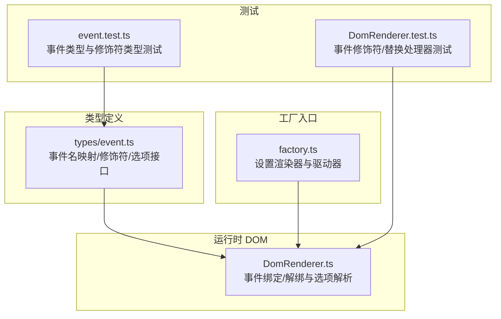
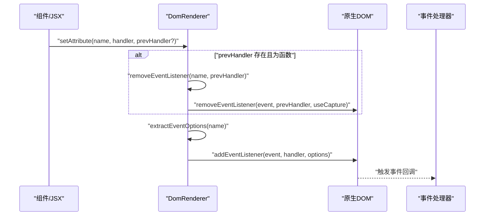
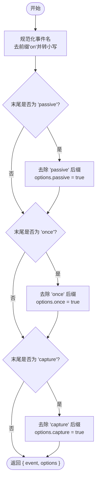
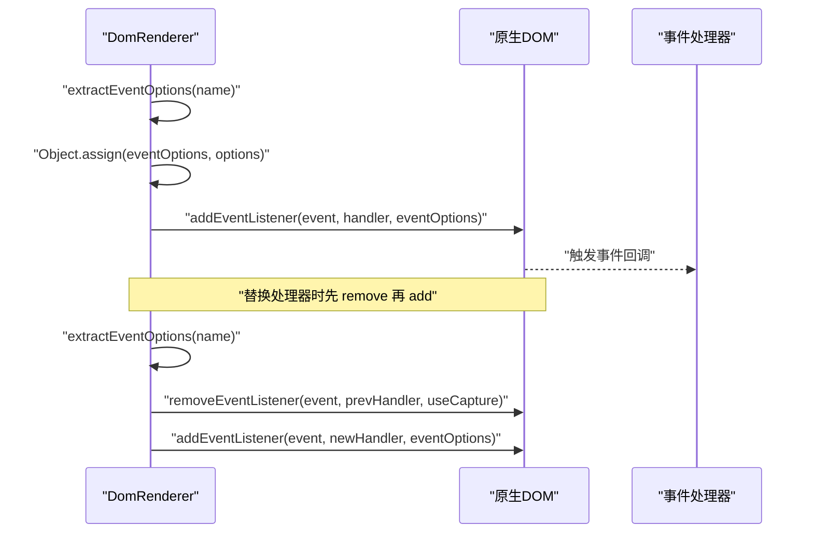
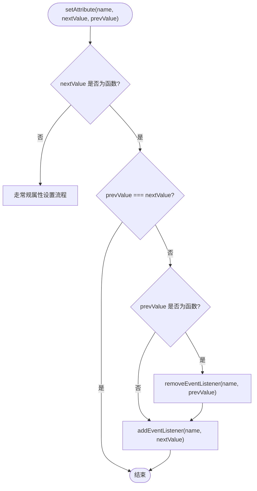
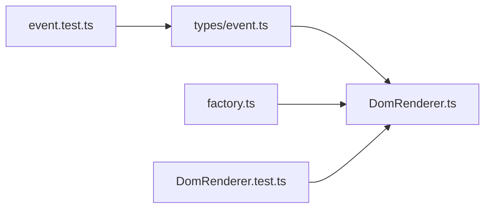

# 事件监听器处理

<cite>
**本文引用的文件列表**
- [DomRenderer.ts](file://packages/runtime-dom/src/DomRenderer.ts)
- [event.ts](file://packages/runtime-dom/src/types/event.ts)
- [factory.ts](file://packages/runtime-dom/src/factory.ts)
- [DomRenderer.test.ts](file://packages/runtime-dom/__tests__/client/DomRenderer.test.ts)
- [event.test.ts](file://packages/runtime-dom/__tests__/types/event.test.ts)
</cite>

## 目录
1. [简介](#简介)
2. [项目结构](#项目结构)
3. [核心组件](#核心组件)
4. [架构总览](#架构总览)
5. [详细组件分析](#详细组件分析)
6. [依赖关系分析](#依赖关系分析)
7. [性能考量](#性能考量)
8. [故障排查指南](#故障排查指南)
9. [结论](#结论)
10. [附录](#附录)

## 简介
本文件面向 Vitarx 框架使用者与贡献者，系统化阐述事件监听器的绑定与解绑机制。重点包括：
- addEventListener 与 removeEventListener 的实现细节
- extractEventOptions 如何从事件名（如 onClickCaptureOnce）中解析出事件类型与修饰符（capture、once、passive）
- 框架如何将修饰符转换为原生 DOM API 的选项并正确传递
- 当事件处理器函数变化时，框架如何自动清理旧监听器并绑定新处理器
- 不同事件选项的使用示例与对性能与用户体验的影响

## 项目结构
围绕事件处理的相关文件分布如下：
- 运行时 DOM 渲染器：负责在浏览器环境中创建元素、设置属性、绑定/解绑事件
- 类型定义：声明事件名映射、修饰符类型与事件选项接口
- 工厂入口：设置默认渲染器与驱动器
- 单元测试：覆盖事件修饰符、替换处理器、一次性监听等行为

图表来源
- [DomRenderer.ts](file://packages/runtime-dom/src/DomRenderer.ts#L252-L358)
- [event.ts](file://packages/runtime-dom/src/types/event.ts#L490-L562)
- [factory.ts](file://packages/runtime-dom/src/factory.ts#L1-L24)
- [DomRenderer.test.ts](file://packages/runtime-dom/__tests__/client/DomRenderer.test.ts#L379-L442)
- [event.test.ts](file://packages/runtime-dom/__tests__/types/event.test.ts#L196-L245)

章节来源
- [DomRenderer.ts](file://packages/runtime-dom/src/DomRenderer.ts#L252-L358)
- [event.ts](file://packages/runtime-dom/src/types/event.ts#L490-L562)
- [factory.ts](file://packages/runtime-dom/src/factory.ts#L1-L24)

## 核心组件
- DomRenderer：封装 DOM 操作与事件处理逻辑，负责属性设置、事件绑定与解绑、选项解析等。
- 事件类型与修饰符：通过类型系统定义事件名映射、修饰符（Capture/Once/Passive/OnceCapture）以及 HTMLEventOptions 接口。
- 工厂入口：在应用启动时注入 DomRenderer 作为默认渲染器。

章节来源
- [DomRenderer.ts](file://packages/runtime-dom/src/DomRenderer.ts#L448-L538)
- [event.ts](file://packages/runtime-dom/src/types/event.ts#L490-L562)
- [factory.ts](file://packages/runtime-dom/src/factory.ts#L1-L24)

## 架构总览
事件处理在框架中的流转路径如下：
- JSX/属性设置阶段：当 props 中的事件属性（如 onClick、onClickCapture、onClickOnce、onScrollPassive）被赋值为函数时，DomRenderer 会检测到变化并执行绑定/解绑。
- 绑定阶段：DomRenderer 调用 addEventListener，并通过 extractEventOptions 解析事件名与修饰符，最终调用原生 addEventListener。
- 解绑阶段：当事件处理器被替换或移除时，DomRenderer 调用 removeEventListener，同样解析修饰符并调用原生 removeEventListener。
- 修饰符优先级：事件名中的修饰符优先于显式传入的 options；若两者都存在，后者会覆盖前者。

图表来源
- [DomRenderer.ts](file://packages/runtime-dom/src/DomRenderer.ts#L252-L358)
- [DomRenderer.ts](file://packages/runtime-dom/src/DomRenderer.ts#L448-L538)

## 详细组件分析

### 事件选项解析：extractEventOptions
extractEventOptions 是事件修饰符解析的核心，它从事件名字符串中剥离修饰符并生成原生事件名与选项对象：
- 输入：事件名字符串（如 onClick、onClickCapture、onClickOnce、onScrollPassive、onClickCaptureOnce）
- 输出：{ event: 事件类型字符串, options: 修饰符选项对象 }
- 解析规则：
  - 去除前缀 "on" 并统一转为小写
  - 从末尾依次匹配 "passive"、"once"、"capture"，并设置对应布尔选项
  - 修饰符顺序会影响最终事件名（例如 "capture" 与 "once" 的顺序不同，最终事件名不同）

图表来源
- [DomRenderer.ts](file://packages/runtime-dom/src/DomRenderer.ts#L510-L538)

章节来源
- [DomRenderer.ts](file://packages/runtime-dom/src/DomRenderer.ts#L510-L538)

### 绑定与解绑：addEventListener 与 removeEventListener
- addEventListener
  - 解析事件名与修饰符
  - 合并显式 options（如 { capture, once, passive }）
  - 调用原生 addEventListener
- removeEventListener
  - 解析事件名与修饰符
  - 若未显式传入 useCapture，使用解析出的 capture 选项
  - 调用原生 removeEventListener

图表来源
- [DomRenderer.ts](file://packages/runtime-dom/src/DomRenderer.ts#L448-L538)

章节来源
- [DomRenderer.ts](file://packages/runtime-dom/src/DomRenderer.ts#L448-L538)

### 属性设置与处理器替换：setAttribute
- 当事件属性值从函数变为另一个函数时：
  - 若 prevValue 为函数，先调用 removeEventListener 清理旧监听器
  - 再调用 addEventListener 绑定新处理器
- 当事件属性值为 null/undefined 或被移除时：
  - 调用 removeAttribute，内部会识别以 "on" 开头的事件属性并移除对应监听器

图表来源
- [DomRenderer.ts](file://packages/runtime-dom/src/DomRenderer.ts#L252-L358)

章节来源
- [DomRenderer.ts](file://packages/runtime-dom/src/DomRenderer.ts#L252-L358)

### 事件修饰符类型与映射
- 修饰符类型：Capture、Once、Passive、OnceCapture
- 事件名映射：支持小驼峰事件名与修饰符组合（如 onClickCapture、onClickOnce、onScrollPassive、onClickCaptureOnce）
- HTMLEventOptions 接口：定义 capture、once、passive 三个布尔选项，均可选

章节来源
- [event.ts](file://packages/runtime-dom/src/types/event.ts#L27-L31)
- [event.ts](file://packages/runtime-dom/src/types/event.ts#L490-L562)

### 工厂入口与渲染器注入
- factory.ts 在应用启动时设置 DomRenderer 为默认渲染器，并加载默认驱动器
- 这保证了后续的 DOM 操作与事件处理由 DomRenderer 统一接管

章节来源
- [factory.ts](file://packages/runtime-dom/src/factory.ts#L1-L24)

## 依赖关系分析
- DomRenderer 依赖事件类型定义（event.ts）提供的修饰符与选项接口
- 测试用例覆盖了事件修饰符、替换处理器、一次性监听等关键行为
- 工厂入口确保渲染器被正确注入

图表来源
- [DomRenderer.ts](file://packages/runtime-dom/src/DomRenderer.ts#L252-L358)
- [event.ts](file://packages/runtime-dom/src/types/event.ts#L490-L562)
- [factory.ts](file://packages/runtime-dom/src/factory.ts#L1-L24)
- [DomRenderer.test.ts](file://packages/runtime-dom/__tests__/client/DomRenderer.test.ts#L379-L442)
- [event.test.ts](file://packages/runtime-dom/__tests__/types/event.test.ts#L196-L245)

章节来源
- [DomRenderer.ts](file://packages/runtime-dom/src/DomRenderer.ts#L252-L358)
- [event.ts](file://packages/runtime-dom/src/types/event.ts#L490-L562)
- [factory.ts](file://packages/runtime-dom/src/factory.ts#L1-L24)
- [DomRenderer.test.ts](file://packages/runtime-dom/__tests__/client/DomRenderer.test.ts#L379-L442)
- [event.test.ts](file://packages/runtime-dom/__tests__/types/event.test.ts#L196-L245)

## 性能考量
- passive 修饰符
  - 语义：声明监听器不会调用 preventDefault，有助于提升滚动等事件的性能
  - 行为：extractEventOptions 会将 onScrollPassive 等转换为 { passive: true } 并传递给原生 addEventListener
  - 影响：在移动端滚动场景下可显著降低主线程阻塞
- once 修饰符
  - 语义：监听器仅触发一次即自动移除
  - 行为：extractEventOptions 会将 onClickOnce 等转换为 { once: true }，原生 addEventListener 会在回调首次触发后自动解绑
  - 影响：减少内存占用与事件队列压力，适合一次性任务（如首屏交互引导）
- capture 修饰符
  - 语义：在捕获阶段触发，而非冒泡阶段
  - 行为：extractEventOptions 会将 onClickCapture 等转换为 { capture: true }
  - 影响：可更早拦截事件，但需谨慎避免与冒泡阶段监听器冲突

章节来源
- [DomRenderer.ts](file://packages/runtime-dom/src/DomRenderer.ts#L448-L538)
- [DomRenderer.ts](file://packages/runtime-dom/src/DomRenderer.ts#L510-L538)
- [event.ts](file://packages/runtime-dom/src/types/event.ts#L529-L556)

## 故障排查指南
- 事件未触发
  - 检查事件名大小写与修饰符拼写（如 onClickCaptureOnce），确保符合类型定义
  - 确认事件处理器函数确实被赋值且未被替换为 null/undefined
- 一次性监听未生效
  - 确认使用了 onClickOnce 等修饰符，或在 options 中设置 { once: true }
  - 验证事件是否在首次触发后被自动移除
- 捕获阶段未触发
  - 确认使用了 onClickCapture 等修饰符，或在 options 中设置 { capture: true }
  - 注意事件冒泡与捕获阶段的触发顺序
- 事件处理器替换无效
  - 确保 prevValue 与 nextValue 不相等，否则不会触发清理与绑定
  - 检查是否正确传入 prevValue 用于 removeEventListener
- 测试参考
  - 单元测试覆盖了修饰符、替换处理器、一次性监听等行为，可对照定位问题

章节来源
- [DomRenderer.test.ts](file://packages/runtime-dom/__tests__/client/DomRenderer.test.ts#L379-L442)
- [event.test.ts](file://packages/runtime-dom/__tests__/types/event.test.ts#L196-L245)

## 结论
Vitarx 框架通过 DomRenderer 将事件修饰符解析与原生 DOM API 无缝衔接，实现了：
- 从事件名字符串中自动提取事件类型与修饰符
- 在属性变更时自动清理旧监听器并绑定新处理器
- 将 capture、once、passive 等选项正确传递给原生 addEventListener/removeEventListener
- 通过类型系统保障事件名与修饰符的正确性与可维护性

这些设计既提升了开发体验，也兼顾了性能与可扩展性。

## 附录

### 使用示例（基于测试与类型定义）
- 基础事件：onClick
- 捕获阶段：onClickCapture
- 一次性事件：onClickOnce
- 被动事件：onScrollPassive
- 组合修饰符：onClickCaptureOnce、onScrollPassiveCapture

章节来源
- [DomRenderer.test.ts](file://packages/runtime-dom/__tests__/client/DomRenderer.test.ts#L379-L442)
- [event.test.ts](file://packages/runtime-dom/__tests__/types/event.test.ts#L196-L245)
- [event.ts](file://packages/runtime-dom/src/types/event.ts#L490-L562)