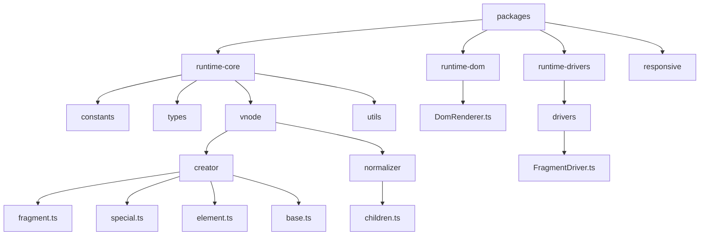
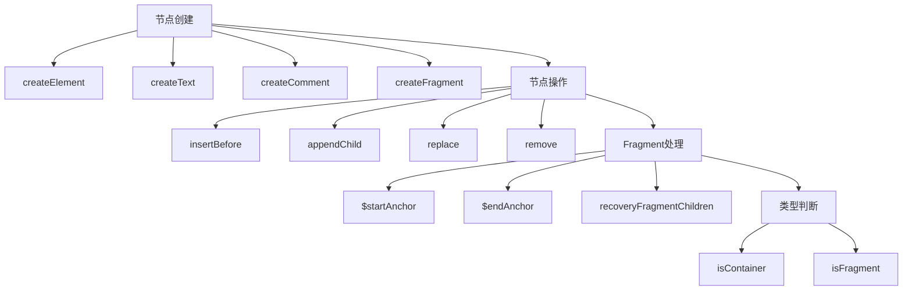
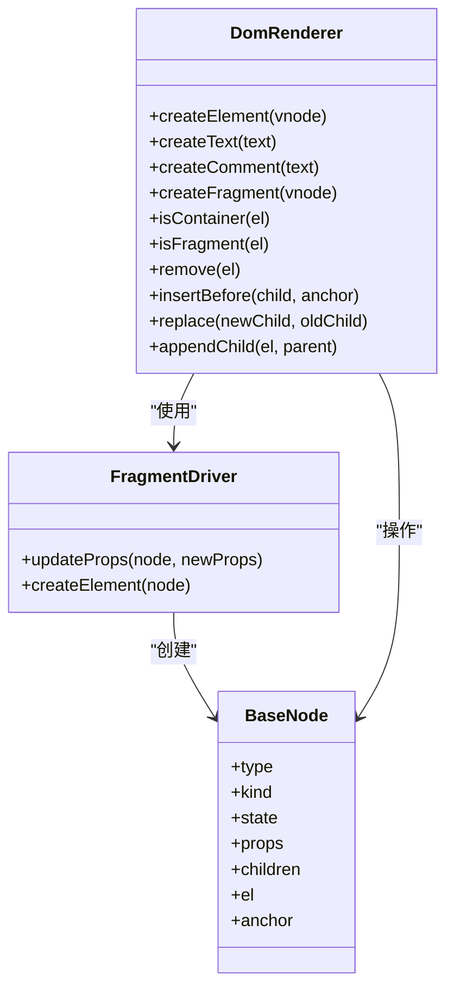
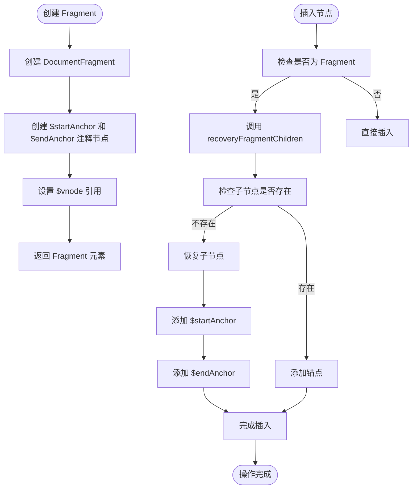
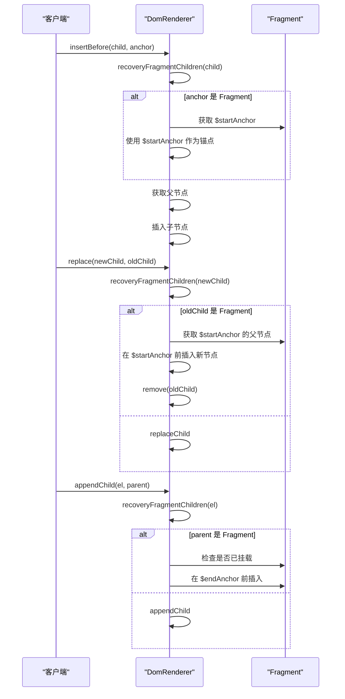
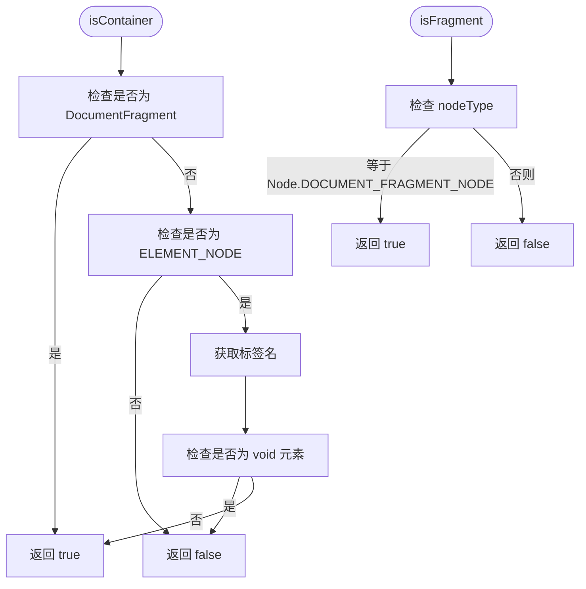
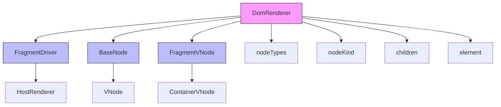

# 节点操作与 Fragment 处理

<cite>
**本文档引用的文件**
- [DomRenderer.ts](file://packages/runtime-dom/src/DomRenderer.ts)
- [fragment.ts](file://packages/runtime-core/src/vnode/creator/fragment.ts)
- [base.ts](file://packages/runtime-core/src/vnode/creator/base.ts)
- [special.ts](file://packages/runtime-core/src/vnode/creator/special.ts)
- [FragmentDriver.ts](file://packages/runtime-drivers/src/drivers/FragmentDriver.ts)
- [nodeTypes.ts](file://packages/runtime-core/src/constants/nodeTypes.ts)
- [BaseNode.ts](file://packages/runtime-core/src/types/nodes/BaseNode.ts)
- [FragmentVNode.ts](file://packages/runtime-core/src/types/nodes/FragmentVNode.ts)
- [create.ts](file://packages/runtime-core/src/vnode/core/create.ts)
- [element.ts](file://packages/runtime-core/src/vnode/creator/element.ts)
- [nodeKind.ts](file://packages/runtime-core/src/constants/nodeKind.ts)
- [nodeState.ts](file://packages/runtime-core/src/constants/nodeState.ts)
- [utils.ts](file://packages/runtime-core/src/vnode/core/utils.ts)
- [element.ts](file://packages/runtime-core/src/vnode/normalizer/children.ts)
- [element.ts](file://packages/runtime-core/src/utils/element.ts)
</cite>

## 目录
1. [项目结构](#项目结构)
2. [核心组件](#核心组件)
3. [架构概述](#架构概述)
4. [详细组件分析](#详细组件分析)
5. [依赖分析](#依赖分析)

## 项目结构

**图示来源**
- [DomRenderer.ts](file://packages/runtime-dom/src/DomRenderer.ts)
- [fragment.ts](file://packages/runtime-core/src/vnode/creator/fragment.ts)
- [FragmentDriver.ts](file://packages/runtime-drivers/src/drivers/FragmentDriver.ts)

**本节来源**
- [DomRenderer.ts](file://packages/runtime-dom/src/DomRenderer.ts)
- [fragment.ts](file://packages/runtime-core/src/vnode/creator/fragment.ts)
- [FragmentDriver.ts](file://packages/runtime-drivers/src/drivers/FragmentDriver.ts)

## 核心组件

Vitarx 框架的 DOM 节点操作机制围绕虚拟节点（VNode）系统构建，通过分层架构实现高效的 DOM 操作。核心组件包括节点创建、节点类型定义、渲染器和驱动器等模块。

**本节来源**
- [DomRenderer.ts](file://packages/runtime-dom/src/DomRenderer.ts)
- [create.ts](file://packages/runtime-core/src/vnode/core/create.ts)
- [base.ts](file://packages/runtime-core/src/vnode/creator/base.ts)

## 架构概述

**图示来源**
- [DomRenderer.ts](file://packages/runtime-dom/src/DomRenderer.ts)
- [fragment.ts](file://packages/runtime-core/src/vnode/creator/fragment.ts)
- [FragmentDriver.ts](file://packages/runtime-drivers/src/drivers/FragmentDriver.ts)

## 详细组件分析

### 节点创建机制分析

Vitarx 框架提供了完整的节点创建机制，包括元素节点、文本节点、注释节点和片段节点的创建。这些创建方法构成了框架的基础功能。

#### 节点创建类图

**图示来源**
- [DomRenderer.ts](file://packages/runtime-dom/src/DomRenderer.ts#L62-L568)
- [FragmentDriver.ts](file://packages/runtime-drivers/src/drivers/FragmentDriver.ts#L28-L42)
- [BaseNode.ts](file://packages/runtime-core/src/types/nodes/BaseNode.ts#L76-L223)

**本节来源**
- [DomRenderer.ts](file://packages/runtime-dom/src/DomRenderer.ts#L62-L568)
- [create.ts](file://packages/runtime-core/src/vnode/core/create.ts#L87-L159)
- [special.ts](file://packages/runtime-core/src/vnode/creator/special.ts#L19-L35)

### Fragment 节点处理机制

Fragment 节点是 Vitarx 框架中的特殊节点类型，用于处理多个根节点的情况。它不渲染为实际的 DOM 元素，而是作为子节点的容器。

#### Fragment 节点处理流程图

**图示来源**
- [DomRenderer.ts](file://packages/runtime-dom/src/DomRenderer.ts#L89-L424)
- [fragment.ts](file://packages/runtime-core/src/vnode/creator/fragment.ts#L15-L24)

**本节来源**
- [DomRenderer.ts](file://packages/runtime-dom/src/DomRenderer.ts#L89-L424)
- [fragment.ts](file://packages/runtime-core/src/vnode/creator/fragment.ts#L15-L24)
- [FragmentDriver.ts](file://packages/runtime-drivers/src/drivers/FragmentDriver.ts#L38-L40)

### 节点操作方法分析

Vitarx 框架提供了完整的节点操作方法，包括插入、删除、替换等操作。这些方法都特别处理了 Fragment 节点的情况。

#### 节点操作序列图

**图示来源**
- [DomRenderer.ts](file://packages/runtime-dom/src/DomRenderer.ts#L127-L177)
- [element.ts](file://packages/runtime-core/src/utils/element.ts#L28-L32)

**本节来源**
- [DomRenderer.ts](file://packages/runtime-dom/src/DomRenderer.ts#L127-L177)
- [element.ts](file://packages/runtime-core/src/utils/element.ts#L28-L32)

### 节点类型判断机制

框架通过 isContainer 和 isFragment 方法来判断节点的容器性质和类型，这对于正确处理 DOM 操作至关重要。

#### 节点类型判断流程图

**图示来源**
- [DomRenderer.ts](file://packages/runtime-dom/src/DomRenderer.ts#L77-L86)
- [nodeKind.ts](file://packages/runtime-core/src/constants/nodeKind.ts#L1-L26)

**本节来源**
- [DomRenderer.ts](file://packages/runtime-dom/src/DomRenderer.ts#L77-L86)
- [nodeKind.ts](file://packages/runtime-core/src/constants/nodeKind.ts#L1-L26)

## 依赖分析

**图示来源**
- [DomRenderer.ts](file://packages/runtime-dom/src/DomRenderer.ts)
- [FragmentDriver.ts](file://packages/runtime-drivers/src/drivers/FragmentDriver.ts)
- [BaseNode.ts](file://packages/runtime-core/src/types/nodes/BaseNode.ts)
- [FragmentVNode.ts](file://packages/runtime-core/src/types/nodes/FragmentVNode.ts)
- [nodeTypes.ts](file://packages/runtime-core/src/constants/nodeTypes.ts)
- [nodeKind.ts](file://packages/runtime-core/src/constants/nodeKind.ts)
- [children.ts](file://packages/runtime-core/src/vnode/normalizer/children.ts)
- [element.ts](file://packages/runtime-core/src/vnode/creator/element.ts)

**本节来源**
- [DomRenderer.ts](file://packages/runtime-dom/src/DomRenderer.ts)
- [FragmentDriver.ts](file://packages/runtime-drivers/src/drivers/FragmentDriver.ts)
- [BaseNode.ts](file://packages/runtime-core/src/types/nodes/BaseNode.ts)
- [FragmentVNode.ts](file://packages/runtime-core/src/types/nodes/FragmentVNode.ts)