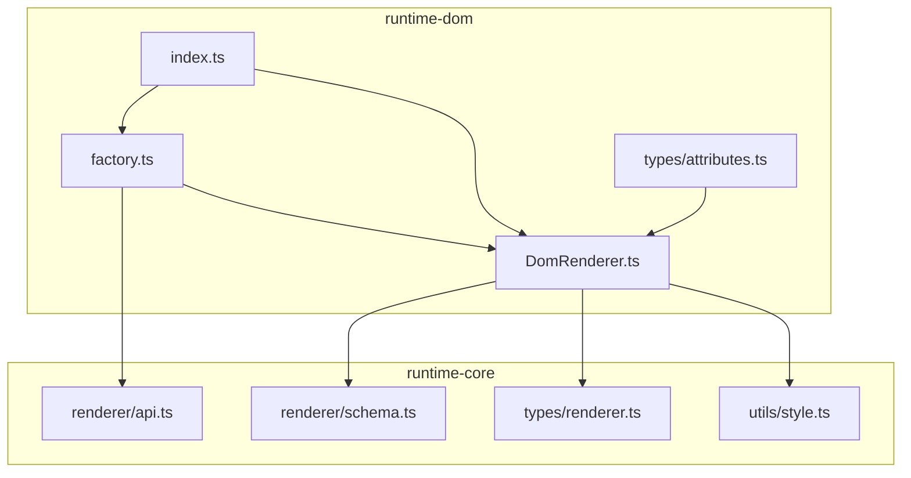
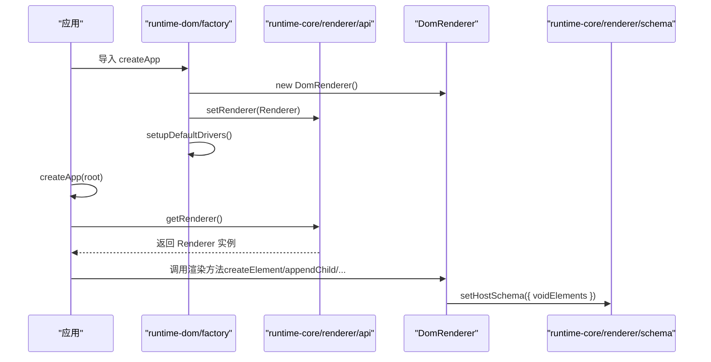
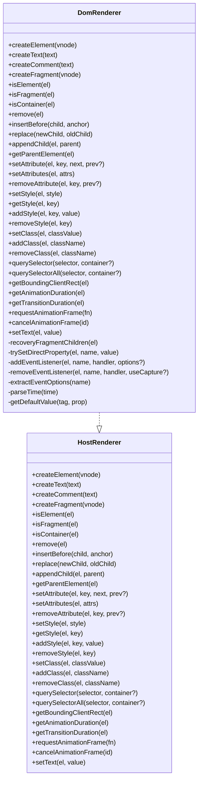
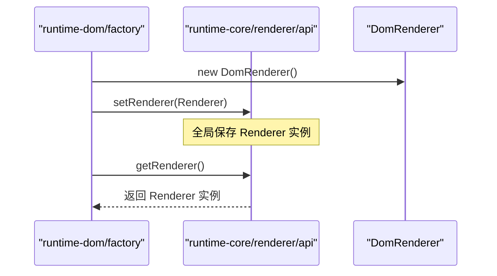
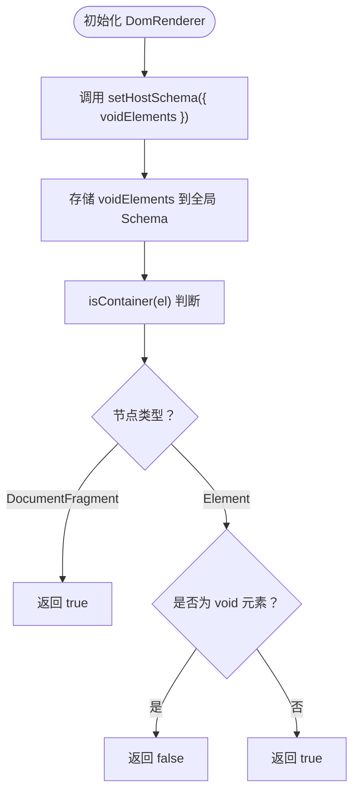
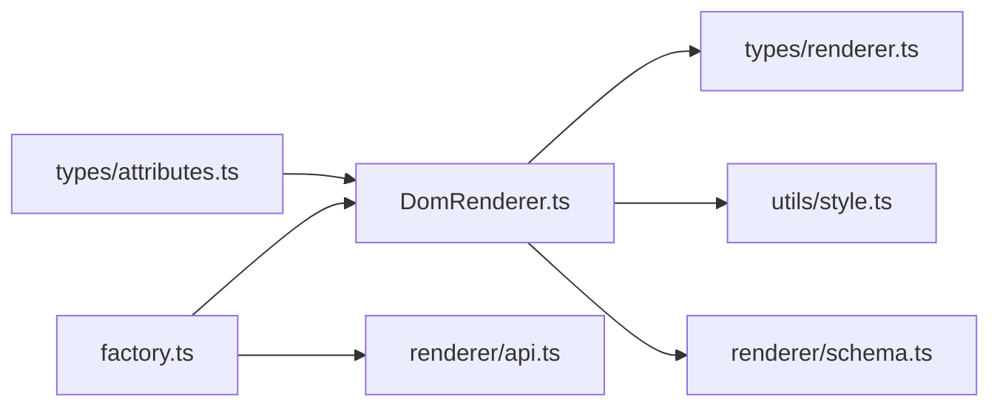

# 渲染器核心

<cite>
**本文引用的文件**
- [DomRenderer.ts](file://packages/runtime-dom/src/DomRenderer.ts)
- [factory.ts](file://packages/runtime-dom/src/factory.ts)
- [index.ts](file://packages/runtime-dom/src/index.ts)
- [api.ts](file://packages/runtime-core/src/renderer/api.ts)
- [schema.ts](file://packages/runtime-core/src/renderer/schema.ts)
- [renderer.ts](file://packages/runtime-core/src/types/renderer.ts)
- [style.ts](file://packages/runtime-core/src/utils/style.ts)
- [attributes.ts](file://packages/runtime-dom/src/types/attributes.ts)
- [DomRenderer.test.ts](file://packages/runtime-dom/__tests__/client/DomRenderer.test.ts)
</cite>

## 目录
1. [引言](#引言)
2. [项目结构](#项目结构)
3. [核心组件](#核心组件)
4. [架构总览](#架构总览)
5. [组件详解](#组件详解)
6. [依赖关系分析](#依赖关系分析)
7. [性能考量](#性能考量)
8. [故障排查指南](#故障排查指南)
9. [结论](#结论)

## 引言
本文件聚焦 Vitarx 的渲染器核心机制，系统阐述 DomRenderer 类如何实现 HostRenderer 接口，完成 DOM 元素、文本节点、注释节点与文档片段的创建与管理；详解 setRenderer 与 getRenderer 两个全局 API 的注册与获取流程；深入分析 DomRenderer 对 createElement、createText、appendChild、setAttribute 等关键方法的实现细节，尤其是对 SVG 元素、void 元素与 Fragment 节点的特殊处理；说明渲染器通过 setHostSchema 配置宿主环境特性及其与 runtime-core 的依赖关系；最后总结错误处理机制、性能优化策略（如 requestAnimationFrame 使用）与浏览器兼容性考虑。

## 项目结构
Vitarx 采用多包组织方式，渲染器核心位于 runtime-dom 包，运行时核心能力位于 runtime-core 包，二者通过 HostRenderer 接口解耦协作。runtime-dom 中的 DomRenderer 实现了 HostRenderer 接口，并在工厂模块中完成全局渲染器的注册与默认驱动器的初始化。

图表来源
- [DomRenderer.ts](file://packages/runtime-dom/src/DomRenderer.ts#L1-L60)
- [factory.ts](file://packages/runtime-dom/src/factory.ts#L1-L24)
- [index.ts](file://packages/runtime-dom/src/index.ts#L1-L4)
- [api.ts](file://packages/runtime-core/src/renderer/api.ts#L1-L26)
- [schema.ts](file://packages/runtime-core/src/renderer/schema.ts#L1-L37)
- [renderer.ts](file://packages/runtime-core/src/types/renderer.ts#L75-L280)
- [style.ts](file://packages/runtime-core/src/utils/style.ts#L1-L173)
- [attributes.ts](file://packages/runtime-dom/src/types/attributes.ts#L1-L651)

章节来源
- [DomRenderer.ts](file://packages/runtime-dom/src/DomRenderer.ts#L1-L60)
- [factory.ts](file://packages/runtime-dom/src/factory.ts#L1-L24)
- [index.ts](file://packages/runtime-dom/src/index.ts#L1-L4)

## 核心组件
- DomRenderer：实现 HostRenderer 接口，负责在浏览器环境中创建与管理 DOM 节点、属性、样式、事件、查询等。
- setRenderer/getRenderer：全局渲染器注册与获取 API，由 runtime-core 提供。
- setHostSchema：宿主 Schema 配置，用于声明 void 元素等宿主特性，runtime-core 提供。
- StyleUtils：样式与类名转换工具，被 DomRenderer 复用。
- 工厂模块：在应用启动时注册 DomRenderer 并初始化默认驱动器。

章节来源
- [renderer.ts](file://packages/runtime-core/src/types/renderer.ts#L75-L280)
- [api.ts](file://packages/runtime-core/src/renderer/api.ts#L1-L26)
- [schema.ts](file://packages/runtime-core/src/renderer/schema.ts#L1-L37)
- [style.ts](file://packages/runtime-core/src/utils/style.ts#L1-L173)
- [DomRenderer.ts](file://packages/runtime-dom/src/DomRenderer.ts#L1-L60)
- [factory.ts](file://packages/runtime-dom/src/factory.ts#L1-L24)

## 架构总览
DomRenderer 通过实现 HostRenderer 接口，将虚拟节点映射为真实 DOM；通过 setRenderer 将其实例注入到运行时核心，使上层组件树的渲染与更新统一走 DOM 渲染路径。setHostSchema 为宿主环境提供 void 元素等配置，影响容器判断与节点行为。

图表来源
- [factory.ts](file://packages/runtime-dom/src/factory.ts#L1-L24)
- [api.ts](file://packages/runtime-core/src/renderer/api.ts#L1-L26)
- [schema.ts](file://packages/runtime-core/src/renderer/schema.ts#L1-L37)
- [DomRenderer.ts](file://packages/runtime-dom/src/DomRenderer.ts#L1-L60)

## 组件详解

### DomRenderer 类与 HostRenderer 接口
DomRenderer 实现了 HostRenderer 接口定义的全部方法，涵盖：
- 节点创建：createElement、createText、createComment、createFragment
- 节点管理：remove、insertBefore、replace、appendChild、getParentElement
- 属性与样式：setAttribute、setAttributes、removeAttribute、setStyle、getStyle、addStyle、removeStyle、setClass、addClass、removeClass
- 查询与度量：querySelector、querySelectorAll、getBoundingClientRect
- 动画与过渡：requestAnimationFrame、cancelAnimationFrame、getAnimationDuration、getTransitionDuration
- Fragment 特殊处理：recoveryFragmentChildren、$startAnchor/$endAnchor、isFragment/isContainer

图表来源
- [renderer.ts](file://packages/runtime-core/src/types/renderer.ts#L75-L280)
- [DomRenderer.ts](file://packages/runtime-dom/src/DomRenderer.ts#L62-L568)

章节来源
- [renderer.ts](file://packages/runtime-core/src/types/renderer.ts#L75-L280)
- [DomRenderer.ts](file://packages/runtime-dom/src/DomRenderer.ts#L62-L568)

### setRenderer 与 getRenderer：全局渲染器注册与获取
- setRenderer：将平台渲染器实例注册到运行时核心，供全局共享。
- getRenderer：获取已注册的渲染器实例；若未注册则抛出错误，避免在未初始化的情况下进行渲染操作。

图表来源
- [factory.ts](file://packages/runtime-dom/src/factory.ts#L1-L24)
- [api.ts](file://packages/runtime-core/src/renderer/api.ts#L1-L26)

章节来源
- [api.ts](file://packages/runtime-core/src/renderer/api.ts#L1-L26)
- [factory.ts](file://packages/runtime-dom/src/factory.ts#L1-L24)

### setHostSchema：宿主环境特性配置
- setHostSchema：接收 HostSchema，其中 voidElements 用于声明 void 元素集合。
- DomRenderer 在构造时调用 setHostSchema({ voidElements })，将 void 元素集合注入到宿主 Schema。
- isContainer：基于宿主 Schema 的 voidElements 判断元素是否为容器，从而决定是否可容纳子节点。

图表来源
- [DomRenderer.ts](file://packages/runtime-dom/src/DomRenderer.ts#L1-L60)
- [schema.ts](file://packages/runtime-core/src/renderer/schema.ts#L1-L37)

章节来源
- [DomRenderer.ts](file://packages/runtime-dom/src/DomRenderer.ts#L1-L60)
- [schema.ts](file://packages/runtime-core/src/renderer/schema.ts#L1-L37)

### 关键方法实现要点

#### createElement：SVG 与普通元素的差异化创建
- 若 vnode 标记为 SVG 元素，则使用命名空间创建；否则使用标准 createElement。
- 创建后批量设置属性（setAttributes），确保初始状态一致。

章节来源
- [DomRenderer.ts](file://packages/runtime-dom/src/DomRenderer.ts#L64-L74)

#### createFragment：Fragment 节点的锚点与子节点恢复
- 创建 DocumentFragment，并附加 $startAnchor 与 $endAnchor 注释锚点，同时记录 vnode 与宿主 Fragment 的关联。
- recoveryFragmentChildren：在插入或恢复时，将 Fragment 的子节点按 vnode 结构重建并插入锚点之间，保证 Fragment 的子树一致性。

章节来源
- [DomRenderer.ts](file://packages/runtime-dom/src/DomRenderer.ts#L88-L116)
- [DomRenderer.ts](file://packages/runtime-dom/src/DomRenderer.ts#L400-L424)

#### appendChild/insertBefore/replace：对 Fragment 的兼容处理
- 插入前先 recoveryFragmentChildren，确保 Fragment 子节点已就绪。
- 插入到 Fragment 时，使用 $startAnchor 作为锚点定位。
- 替换 Fragment 时，先插入新节点到 $startAnchor 前，再删除旧 Fragment 内容。

章节来源
- [DomRenderer.ts](file://packages/runtime-dom/src/DomRenderer.ts#L127-L177)
- [DomRenderer.ts](file://packages/runtime-dom/src/DomRenderer.ts#L144-L163)

#### setAttribute：事件、data 属性、xlink、style/class/className、v-html、xmlns:xlink 等特殊分支
- 函数值属性：视为事件监听器，自动绑定/解绑旧事件，支持 onXxxCapture/Passive/Once 等修饰。
- data-*：写入 dataset。
- xlink:*：使用命名空间 setAttributeNS。
- style：委托 StyleUtils 转换为 cssText。
- class/className：委托 StyleUtils 转换为字符串并设置 class 属性。
- v-html：直接设置 innerHTML。
- xmlns:xlink：使用命名空间 setAttributeNS。
- 其他属性：优先尝试直接设置 JS 属性（trySetDirectProperty），失败回退到 setAttribute。
- 异常兜底：捕获设置属性过程中的错误并输出日志。

章节来源
- [DomRenderer.ts](file://packages/runtime-dom/src/DomRenderer.ts#L253-L312)
- [DomRenderer.ts](file://packages/runtime-dom/src/DomRenderer.ts#L319-L325)
- [DomRenderer.ts](file://packages/runtime-dom/src/DomRenderer.ts#L426-L446)
- [style.ts](file://packages/runtime-core/src/utils/style.ts#L66-L110)
- [style.ts](file://packages/runtime-core/src/utils/style.ts#L112-L171)

#### setStyle/addClass/setClass：样式与类名的高效设置
- setStyle：使用 StyleUtils 将样式对象转换为 cssText，避免逐条设置带来的重排。
- setClass/addClass/removeClass：支持字符串、数组、对象三种输入形式，内部统一转换后设置 class 属性或使用 classList。

章节来源
- [DomRenderer.ts](file://packages/runtime-dom/src/DomRenderer.ts#L191-L250)
- [style.ts](file://packages/runtime-core/src/utils/style.ts#L66-L110)
- [style.ts](file://packages/runtime-core/src/utils/style.ts#L112-L171)

#### requestAnimationFrame/cancelAnimationFrame：动画帧调度
- 直接代理至浏览器 API，便于上层组件在下一帧执行更新或清理。

章节来源
- [DomRenderer.ts](file://packages/runtime-dom/src/DomRenderer.ts#L228-L236)
- [renderer.ts](file://packages/runtime-core/src/types/renderer.ts#L212-L229)

#### getAnimationDuration/getTransitionDuration：动画/过渡时长计算
- 解析 computedStyle 的 animation/transition 的 duration 与 delay，返回最大时长。

章节来源
- [DomRenderer.ts](file://packages/runtime-dom/src/DomRenderer.ts#L382-L398)

### SVG 元素、void 元素与 Fragment 的特殊处理
- SVG 元素：createElement 使用命名空间创建，确保 SVG 元素正确渲染。
- void 元素：通过 setHostSchema 注册 voidElements，isContainer 将其视为不可容器，避免错误地向其追加子节点。
- Fragment：通过 $startAnchor/$endAnchor 与 vnode.children 的映射，在插入/恢复时重建子树，保证 Fragment 的边界与内容一致性。

章节来源
- [DomRenderer.ts](file://packages/runtime-dom/src/DomRenderer.ts#L1-L60)
- [DomRenderer.ts](file://packages/runtime-dom/src/DomRenderer.ts#L76-L86)
- [DomRenderer.ts](file://packages/runtime-dom/src/DomRenderer.ts#L88-L116)
- [DomRenderer.ts](file://packages/runtime-dom/src/DomRenderer.ts#L400-L424)

## 依赖关系分析
- DomRenderer 依赖 runtime-core 的 HostRenderer 接口、HostSchema 与 StyleUtils。
- setRenderer/getRenderer 由 runtime-core 提供，工厂模块在应用启动时完成注册。
- attributes.ts 为 HTML 属性与事件类型提供强类型支撑，间接影响 DomRenderer 的属性处理分支。

图表来源
- [DomRenderer.ts](file://packages/runtime-dom/src/DomRenderer.ts#L1-L60)
- [renderer.ts](file://packages/runtime-core/src/types/renderer.ts#L75-L280)
- [style.ts](file://packages/runtime-core/src/utils/style.ts#L1-L173)
- [schema.ts](file://packages/runtime-core/src/renderer/schema.ts#L1-L37)
- [api.ts](file://packages/runtime-core/src/renderer/api.ts#L1-L26)
- [attributes.ts](file://packages/runtime-dom/src/types/attributes.ts#L1-L651)
- [factory.ts](file://packages/runtime-dom/src/factory.ts#L1-L24)

章节来源
- [DomRenderer.ts](file://packages/runtime-dom/src/DomRenderer.ts#L1-L60)
- [renderer.ts](file://packages/runtime-core/src/types/renderer.ts#L75-L280)
- [style.ts](file://packages/runtime-core/src/utils/style.ts#L1-L173)
- [schema.ts](file://packages/runtime-core/src/renderer/schema.ts#L1-L37)
- [api.ts](file://packages/runtime-core/src/renderer/api.ts#L1-L26)
- [attributes.ts](file://packages/runtime-dom/src/types/attributes.ts#L1-L651)
- [factory.ts](file://packages/runtime-dom/src/factory.ts#L1-L24)

## 性能考量
- 批量属性设置：setAttributes 遍历属性对象一次性设置，减少多次 DOM 访问。
- 样式设置：setStyle 使用 cssText 一次性写入，避免逐条属性导致的多次重排。
- Fragment 子树恢复：recoveryFragmentChildren 在插入前重建子树，避免重复插入与碎片化。
- 动画帧调度：requestAnimationFrame/cancelAnimationFrame 与浏览器同步，避免阻塞主线程。
- 事件处理：事件属性采用 addEventListener/removeEventListener，支持 once/capture/passive 优化。

章节来源
- [DomRenderer.ts](file://packages/runtime-dom/src/DomRenderer.ts#L319-L325)
- [DomRenderer.ts](file://packages/runtime-dom/src/DomRenderer.ts#L238-L246)
- [DomRenderer.ts](file://packages/runtime-dom/src/DomRenderer.ts#L400-L424)
- [DomRenderer.ts](file://packages/runtime-dom/src/DomRenderer.ts#L228-L236)
- [DomRenderer.ts](file://packages/runtime-dom/src/DomRenderer.ts#L487-L496)

## 故障排查指南
- setRenderer 未注册：调用 getRenderer 时若未注册渲染器会抛错，需确认工厂模块已执行 setRenderer(new DomRenderer())。
- Fragment 插入异常：检查锚点是否存在与父节点关系，确保 recoveryFragmentChildren 在插入前被调用。
- 属性设置失败：setAttribute 对异常进行 try/catch 并输出错误日志，可据此定位具体属性与元素。
- 事件绑定失效：确认事件名是否包含 Capture/Once/Passive 修饰，extractEventOptions 会解析这些后缀。
- 样式/类名不生效：确认输入格式（字符串/数组/对象），StyleUtils 会进行转换；若最终 classList 为空，将移除 class 属性。

章节来源
- [api.ts](file://packages/runtime-core/src/renderer/api.ts#L1-L26)
- [DomRenderer.ts](file://packages/runtime-dom/src/DomRenderer.ts#L127-L177)
- [DomRenderer.ts](file://packages/runtime-dom/src/DomRenderer.ts#L253-L312)
- [DomRenderer.ts](file://packages/runtime-dom/src/DomRenderer.ts#L510-L538)
- [DomRenderer.ts](file://packages/runtime-dom/src/DomRenderer.ts#L191-L250)

## 结论
DomRenderer 通过实现 HostRenderer 接口，将虚拟节点映射为真实 DOM，并在浏览器环境下提供完善的节点管理、属性与样式处理、事件绑定、查询与度量能力。借助 setRenderer/getRenderer 与 setHostSchema，渲染器与运行时核心形成清晰的职责边界与扩展点。对 SVG、void 元素与 Fragment 的特殊处理，确保了复杂场景下的正确性与性能。结合 requestAnimationFrame 与 StyleUtils 的批量写入策略，整体渲染管线具备良好的性能与可维护性。