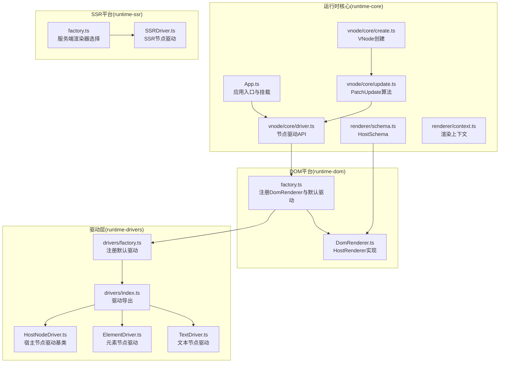
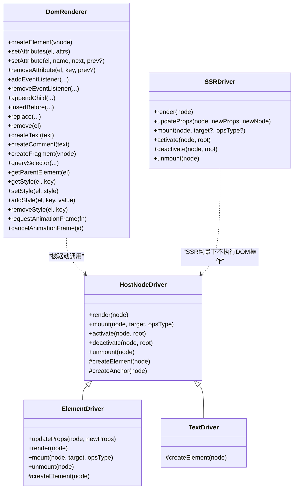
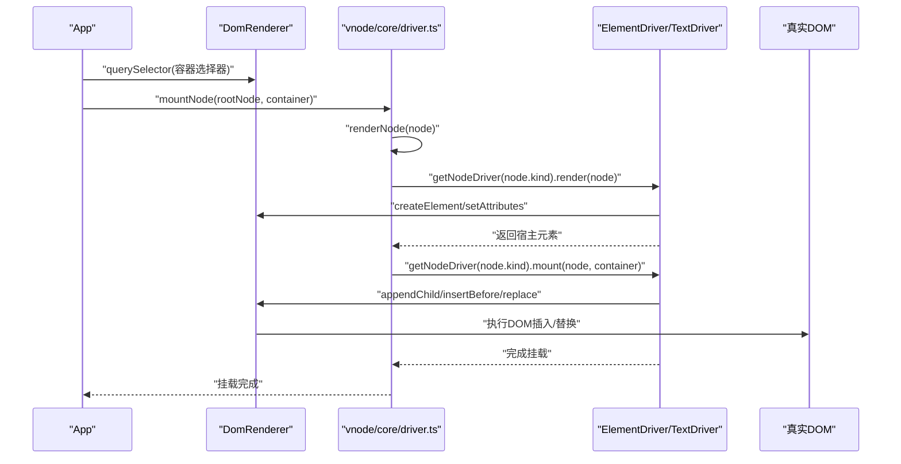
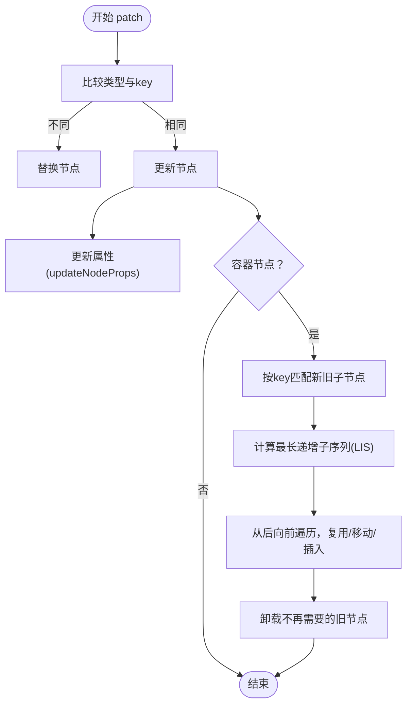
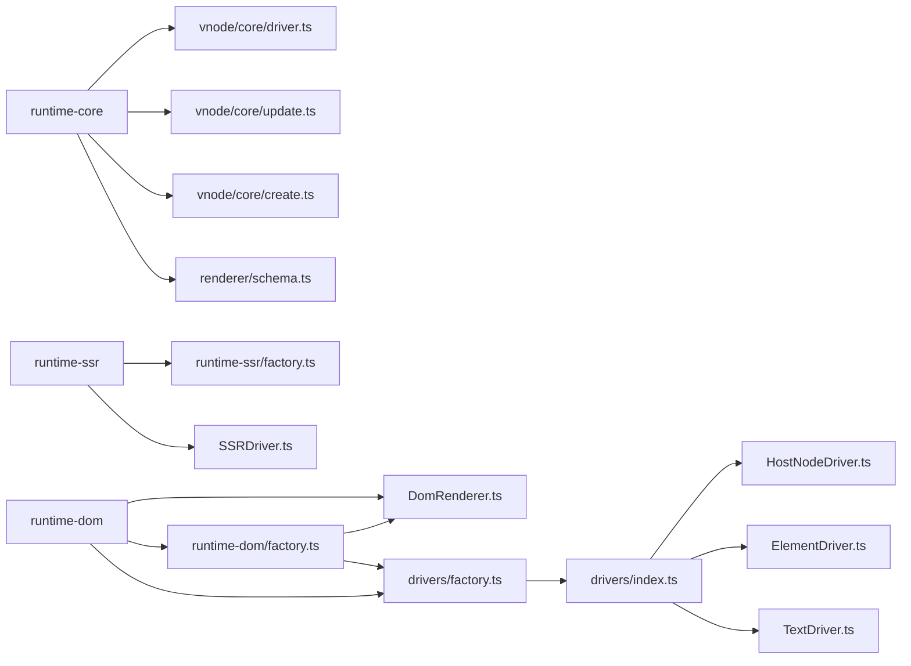

# 渲染机制

<cite>
**本文引用的文件列表**
- [DomRenderer.ts](file://packages/runtime-dom/src/DomRenderer.ts)
- [factory.ts](file://packages/runtime-dom/src/factory.ts)
- [index.ts](file://packages/runtime-drivers/src/drivers/index.ts)
- [schema.ts](file://packages/runtime-core/src/renderer/schema.ts)
- [driver.ts](file://packages/runtime-core/src/types/driver.ts)
- [ElementDriver.ts](file://packages/runtime-drivers/src/drivers/ElementDriver.ts)
- [TextDriver.ts](file://packages/runtime-drivers/src/drivers/TextDriver.ts)
- [HostNodeDriver.ts](file://packages/runtime-drivers/src/drivers/HostNodeDriver.ts)
- [context.ts](file://packages/runtime-core/src/renderer/context.ts)
- [create.ts](file://packages/runtime-core/src/vnode/core/create.ts)
- [update.ts](file://packages/runtime-core/src/vnode/core/update.ts)
- [driver.ts](file://packages/runtime-core/src/vnode/core/driver.ts)
- [App.ts](file://packages/runtime-core/src/app/App.ts)
- [factory.ts](file://packages/runtime-ssr/src/factory.ts)
- [SSRDriver.ts](file://packages/runtime-ssr/src/server/SSRDriver.ts)
- [vnode.ts](file://packages/runtime-core/src/types/vnode.ts)
</cite>

## 目录
1. [简介](#简介)
2. [项目结构](#项目结构)
3. [核心组件](#核心组件)
4. [架构总览](#架构总览)
5. [详细组件分析](#详细组件分析)
6. [依赖关系分析](#依赖关系分析)
7. [性能考量](#性能考量)
8. [故障排查指南](#故障排查指南)
9. [结论](#结论)

## 简介
本文件聚焦 Vitarx 的渲染机制，系统阐述 DomRenderer 的初始化、挂载与更新流程，阐明 HostRenderer 抽象接口与具体驱动层（ElementDriver、TextDriver 等）如何协同工作，完成 VNode 与真实 DOM 的映射。文档还解释 patch 过程中的属性更新、事件绑定、子节点协调的具体步骤，并通过调用链路展示从组件 render 到 DOM 更新的完整流程。最后总结平台解耦的设计思想，说明同一套 runtime-core 如何通过不同驱动支持 DOM 与 SSR 环境，并给出批量更新与异步渲染的优化建议。

## 项目结构
- 运行时核心（runtime-core）：定义 VNode 类型、渲染上下文、节点驱动接口、节点生命周期调度、patch 更新算法等。
- DOM 平台（runtime-dom）：实现 HostRenderer（DomRenderer），提供浏览器 DOM 操作能力，并通过工厂函数注册渲染器与默认驱动。
- 驱动层（runtime-drivers）：提供各类节点驱动（ElementDriver、TextDriver、FragmentDriver、WidgetDriver 等），按节点类型分发渲染、挂载、更新、卸载等操作。
- SSR 平台（runtime-ssr）：提供 SSR 渲染驱动（SSRDriver），在服务端渲染场景下禁用 DOM 操作，转而收集异步任务与属性变更。

图表来源
- [App.ts](file://packages/runtime-core/src/app/App.ts#L180-L202)
- [driver.ts](file://packages/runtime-core/src/vnode/core/driver.ts#L60-L84)
- [update.ts](file://packages/runtime-core/src/vnode/core/update.ts#L53-L65)
- [create.ts](file://packages/runtime-core/src/vnode/core/create.ts#L87-L136)
- [schema.ts](file://packages/runtime-core/src/renderer/schema.ts#L1-L37)
- [factory.ts](file://packages/runtime-dom/src/factory.ts#L1-L24)
- [DomRenderer.ts](file://packages/runtime-dom/src/DomRenderer.ts#L62-L110)
- [index.ts](file://packages/runtime-drivers/src/drivers/index.ts#L1-L18)
- [HostNodeDriver.ts](file://packages/runtime-drivers/src/drivers/HostNodeDriver.ts#L1-L124)
- [ElementDriver.ts](file://packages/runtime-drivers/src/drivers/ElementDriver.ts#L45-L106)
- [TextDriver.ts](file://packages/runtime-drivers/src/drivers/TextDriver.ts#L1-L31)
- [factory.ts](file://packages/runtime-ssr/src/factory.ts#L1-L18)
- [SSRDriver.ts](file://packages/runtime-ssr/src/server/SSRDriver.ts#L22-L78)

章节来源
- [factory.ts](file://packages/runtime-dom/src/factory.ts#L1-L24)
- [index.ts](file://packages/runtime-drivers/src/drivers/index.ts#L1-L18)
- [schema.ts](file://packages/runtime-core/src/renderer/schema.ts#L1-L37)

## 核心组件
- HostRenderer（DomRenderer）：在浏览器环境中实现 DOM 元素创建、属性设置、事件绑定、样式控制、插入/替换/删除、查询等操作。
- 节点驱动（NodeDriver）：按节点类型分发渲染、挂载、激活、停用、卸载与属性更新等生命周期操作。
- HostNodeDriver：宿主节点驱动基类，统一管理渲染、挂载、激活/停用、卸载与锚点创建等通用逻辑。
- ElementDriver：元素节点驱动，负责元素属性的新增/更新/删除与指令钩子调用。
- TextDriver：文本节点驱动，负责文本节点的创建与值更新。
- PatchUpdate：VNode 更新管理器，实现类型/键比较、属性更新、子节点协调与最长递增子序列优化。
- App：应用入口，负责挂载根节点到容器，委托底层驱动完成渲染与挂载。

章节来源
- [driver.ts](file://packages/runtime-core/src/types/driver.ts#L1-L51)
- [HostNodeDriver.ts](file://packages/runtime-drivers/src/drivers/HostNodeDriver.ts#L1-L124)
- [ElementDriver.ts](file://packages/runtime-drivers/src/drivers/ElementDriver.ts#L45-L106)
- [TextDriver.ts](file://packages/runtime-drivers/src/drivers/TextDriver.ts#L1-L31)
- [update.ts](file://packages/runtime-core/src/vnode/core/update.ts#L42-L104)
- [App.ts](file://packages/runtime-core/src/app/App.ts#L180-L202)

## 架构总览
Vitarx 的渲染体系采用“运行时核心 + 平台驱动”的解耦设计：
- 运行时核心提供统一的 VNode 类型、节点驱动接口、生命周期调度与 patch 算法。
- 平台通过实现 HostRenderer（DOM 或 SSR）与注册默认驱动，将核心逻辑适配到不同宿主环境。
- DOM 平台使用 DomRenderer 与 ElementDriver/TextDriver 等驱动，完成真实 DOM 的创建与更新。
- SSR 平台使用 SSRDriver，禁用 DOM 操作，改为收集异步渲染任务与属性变更。

图表来源
- [HostNodeDriver.ts](file://packages/runtime-drivers/src/drivers/HostNodeDriver.ts#L1-L124)
- [ElementDriver.ts](file://packages/runtime-drivers/src/drivers/ElementDriver.ts#L45-L106)
- [TextDriver.ts](file://packages/runtime-drivers/src/drivers/TextDriver.ts#L1-L31)
- [DomRenderer.ts](file://packages/runtime-dom/src/DomRenderer.ts#L62-L110)
- [SSRDriver.ts](file://packages/runtime-ssr/src/server/SSRDriver.ts#L22-L78)

## 详细组件分析

### DomRenderer 初始化与宿主模式
- 宿主模式通过 HostSchema 注册 void 元素集合，DomRenderer 在创建元素时据此判断容器性与插入策略。
- DomRenderer 实现 HostRenderer 接口，提供浏览器 DOM 操作能力，包括元素创建、属性设置、事件绑定、样式控制、插入/替换/删除、查询与尺寸测量等。

章节来源
- [schema.ts](file://packages/runtime-core/src/renderer/schema.ts#L1-L37)
- [DomRenderer.ts](file://packages/runtime-dom/src/DomRenderer.ts#L43-L61)
- [DomRenderer.ts](file://packages/runtime-dom/src/DomRenderer.ts#L62-L110)

### 驱动层职责分离与 HostRenderer 抽象
- HostNodeDriver 作为宿主节点驱动基类，统一管理渲染、挂载、激活/停用、卸载与锚点创建等通用逻辑。
- ElementDriver 继承 HostNodeDriver，专注元素节点的属性更新与指令钩子调用；TextDriver 继承 NonElementDriver，专注文本节点的创建与值更新。
- NodeDriver 接口定义了渲染、挂载、激活、停用、卸载与属性更新的标准契约，由具体驱动实现。

章节来源
- [HostNodeDriver.ts](file://packages/runtime-drivers/src/drivers/HostNodeDriver.ts#L1-L124)
- [ElementDriver.ts](file://packages/runtime-drivers/src/drivers/ElementDriver.ts#L45-L106)
- [TextDriver.ts](file://packages/runtime-drivers/src/drivers/TextDriver.ts#L1-L31)
- [driver.ts](file://packages/runtime-core/src/types/driver.ts#L1-L51)

### DOM 平台注册与默认驱动装配
- runtime-dom/factory.ts 通过 setRenderer 注册 DomRenderer，并调用 setupDefaultDrivers 完成默认驱动注册。
- runtime-drivers/factory.ts 将 RegularElementDriver、VoidElementDriver、FragmentDriver、TextDriver、CommentDriver、StatelessWidgetDriver、StatefulWidgetDriver 注册到运行时。

章节来源
- [factory.ts](file://packages/runtime-dom/src/factory.ts#L1-L24)
- [factory.ts](file://packages/runtime-drivers/src/factory.ts#L1-L39)
- [index.ts](file://packages/runtime-drivers/src/drivers/index.ts#L1-L18)

### 从组件 render 到 DOM 更新的调用链
- App.mount(container) 将根节点挂载到容器，内部通过 getRenderer().querySelector(...) 获取容器并调用 mountNode。
- mountNode 会先 renderNode（若未渲染），再根据节点 kind 查找对应驱动执行 mount。
- ElementDriver.render/mount/deactivate/activate/unmount 等生命周期中，会调用 HostNodeDriver 的通用逻辑与 DomRenderer 的 DOM 操作。

图表来源
- [App.ts](file://packages/runtime-core/src/app/App.ts#L180-L202)
- [driver.ts](file://packages/runtime-core/src/vnode/core/driver.ts#L60-L84)
- [HostNodeDriver.ts](file://packages/runtime-drivers/src/drivers/HostNodeDriver.ts#L44-L72)
- [ElementDriver.ts](file://packages/runtime-drivers/src/drivers/ElementDriver.ts#L85-L98)
- [DomRenderer.ts](file://packages/runtime-dom/src/DomRenderer.ts#L165-L177)

### Patch 过程：属性更新、事件绑定、子节点协调
- PatchUpdate.patch：比较新旧节点类型与 key，决定替换或更新。
- PatchUpdate.patchUpdateNode：更新指令、属性与子节点；容器节点进入子节点协调流程。
- PatchUpdate.patchUpdateProps：委托 updateNodeProps -> getNodeDriver(node.kind).updateProps。
- ElementDriver.updateProps：遍历新旧属性，删除不存在的属性、新增或更新存在的属性；对事件属性做特殊处理（解绑旧事件、绑定新事件）。
- 子节点协调：matchChildrenByKey 建立 key 映射，getLIS 计算最长递增子序列，从后向前遍历优化移动与插入；未匹配旧节点卸载。

图表来源
- [update.ts](file://packages/runtime-core/src/vnode/core/update.ts#L53-L65)
- [update.ts](file://packages/runtime-core/src/vnode/core/update.ts#L78-L104)
- [update.ts](file://packages/runtime-core/src/vnode/core/update.ts#L119-L121)
- [update.ts](file://packages/runtime-core/src/vnode/core/update.ts#L171-L249)
- [update.ts](file://packages/runtime-core/src/vnode/core/update.ts#L268-L315)
- [update.ts](file://packages/runtime-core/src/vnode/core/update.ts#L317-L378)
- [ElementDriver.ts](file://packages/runtime-drivers/src/drivers/ElementDriver.ts#L49-L70)
- [DomRenderer.ts](file://packages/runtime-dom/src/DomRenderer.ts#L253-L312)

### 平台解耦与 DOM/SSR 适配
- DOM 场景：runtime-dom/factory.ts 注册 DomRenderer，并通过 setupDefaultDrivers 注册各节点驱动，使 runtime-core 通过 HostRenderer 与 NodeDriver 完成 DOM 渲染。
- SSR 场景：runtime-ssr/factory.ts 在服务端环境下使用代理 HostRenderer 抛错，避免 DOM 操作；同时提供 SSRDriver，仅在服务端渲染时执行属性更新与异步任务收集，不进行挂载/激活/停用/卸载等 DOM 操作。

章节来源
- [factory.ts](file://packages/runtime-dom/src/factory.ts#L1-L24)
- [factory.ts](file://packages/runtime-ssr/src/factory.ts#L1-L18)
- [SSRDriver.ts](file://packages/runtime-ssr/src/server/SSRDriver.ts#L22-L78)

## 依赖关系分析
- 运行时核心依赖：通过 NodeKind 与 NodeDriver 接口，将节点类型与驱动实现解耦。
- DOM 平台依赖：DomRenderer 实现 HostRenderer，ElementDriver/TextDriver 继承 HostNodeDriver，统一调用 DomRenderer 完成 DOM 操作。
- SSR 平台依赖：SSRDriver 实现 NodeDriver，在服务端场景下禁用 DOM 操作，仅处理属性更新与异步任务。

图表来源
- [driver.ts](file://packages/runtime-core/src/vnode/core/driver.ts#L17-L53)
- [update.ts](file://packages/runtime-core/src/vnode/core/update.ts#L1-L39)
- [create.ts](file://packages/runtime-core/src/vnode/core/create.ts#L87-L136)
- [schema.ts](file://packages/runtime-core/src/renderer/schema.ts#L1-L37)
- [factory.ts](file://packages/runtime-dom/src/factory.ts#L1-L24)
- [DomRenderer.ts](file://packages/runtime-dom/src/DomRenderer.ts#L62-L110)
- [factory.ts](file://packages/runtime-ssr/src/factory.ts#L1-L18)
- [SSRDriver.ts](file://packages/runtime-ssr/src/server/SSRDriver.ts#L22-L78)
- [index.ts](file://packages/runtime-drivers/src/drivers/index.ts#L1-L18)
- [HostNodeDriver.ts](file://packages/runtime-drivers/src/drivers/HostNodeDriver.ts#L1-L124)
- [ElementDriver.ts](file://packages/runtime-drivers/src/drivers/ElementDriver.ts#L45-L106)
- [TextDriver.ts](file://packages/runtime-drivers/src/drivers/TextDriver.ts#L1-L31)

章节来源
- [driver.ts](file://packages/runtime-core/src/vnode/core/driver.ts#L17-L53)
- [index.ts](file://packages/runtime-drivers/src/drivers/index.ts#L1-L18)

## 性能考量
- 子节点协调优化：PatchUpdate 使用 key 匹配与最长递增子序列（LIS）优化，减少不必要的 DOM 移动与重排。
- 属性更新批处理：ElementDriver.updateProps 逐项比较新旧值，仅在变化时调用 DomRenderer.setAttribute/removeAttribute，避免重复设置。
- 事件绑定去抖：DomRenderer.setAttribute 对事件属性做特殊处理，先解绑旧事件再绑定新事件，防止重复监听。
- 异步渲染：SSRDriver 在有 Promise 的情况下将任务加入异步渲染队列，避免阻塞主线程。
- 批量更新与异步渲染策略建议：
  - 合并多次状态更新：在响应式系统中，利用调度器将多次更新合并为一次渲染批次。
  - 使用 requestAnimationFrame：在 DomRenderer 中提供 requestAnimationFrame/cancelAnimationFrame，可在动画/过渡场景中延后 DOM 操作。
  - 分片渲染：对大型列表采用分片渲染，结合 requestIdleCallback（如可用）或分帧渲染，降低卡顿。
  - SSR 异步任务聚合：在 SSR 场景下，将异步任务集中处理，减少网络往返与首屏时间。

章节来源
- [update.ts](file://packages/runtime-core/src/vnode/core/update.ts#L171-L249)
- [update.ts](file://packages/runtime-core/src/vnode/core/update.ts#L317-L378)
- [ElementDriver.ts](file://packages/runtime-drivers/src/drivers/ElementDriver.ts#L49-L70)
- [DomRenderer.ts](file://packages/runtime-dom/src/DomRenderer.ts#L253-L312)
- [DomRenderer.ts](file://packages/runtime-dom/src/DomRenderer.ts#L228-L236)
- [SSRDriver.ts](file://packages/runtime-ssr/src/server/SSRDriver.ts#L45-L57)

## 故障排查指南
- 节点未挂载却尝试替换：PatchUpdate.replace 在旧节点无父元素时抛出错误，需确保节点已挂载或走渲染后替换路径。
- 事件绑定异常：DomRenderer.setAttribute 对事件属性做特殊处理，若出现重复绑定或未解绑，检查事件名与选项（capture/once/passive）是否一致。
- 属性还原失败：removeAttribute 对某些只读属性会回退到 removeAttribute，若出现异常需确认属性是否可写。
- SSR 环境误用 DOM 操作：runtime-ssr/factory.ts 在服务端环境下对 HostRenderer 方法抛错，避免在 SSR 中进行 DOM 操作。
- 驱动缺失：getNodeDriver 未找到对应驱动会抛错，需确保已导入并注册平台驱动（如 runtime-dom 或 runtime-ssr）。

章节来源
- [update.ts](file://packages/runtime-core/src/vnode/core/update.ts#L134-L152)
- [DomRenderer.ts](file://packages/runtime-dom/src/DomRenderer.ts#L253-L312)
- [DomRenderer.ts](file://packages/runtime-dom/src/DomRenderer.ts#L327-L358)
- [factory.ts](file://packages/runtime-ssr/src/factory.ts#L1-L18)
- [driver.ts](file://packages/runtime-core/src/vnode/core/driver.ts#L40-L53)

## 结论
Vitarx 的渲染机制通过 HostRenderer 与 NodeDriver 的职责分离，将平台无关的核心逻辑与平台特定的 DOM/SSR 实现解耦。DomRenderer 提供浏览器 DOM 操作能力，ElementDriver/TextDriver 等驱动负责节点生命周期与属性更新，PatchUpdate 则保证高效、最小化的 DOM 操作。平台解耦设计使得同一套 runtime-core 可在 DOM 与 SSR 环境下复用，同时通过调度与异步策略提升性能与用户体验。