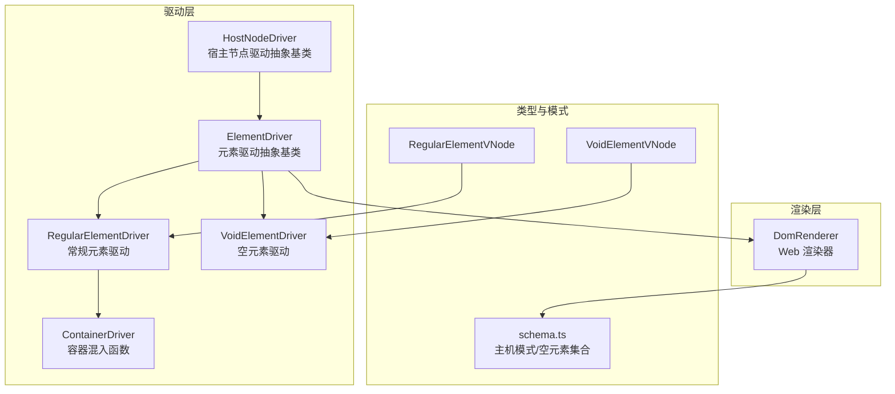
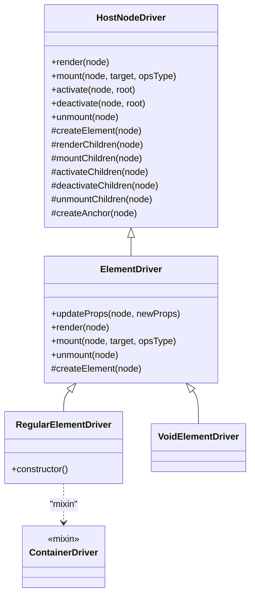
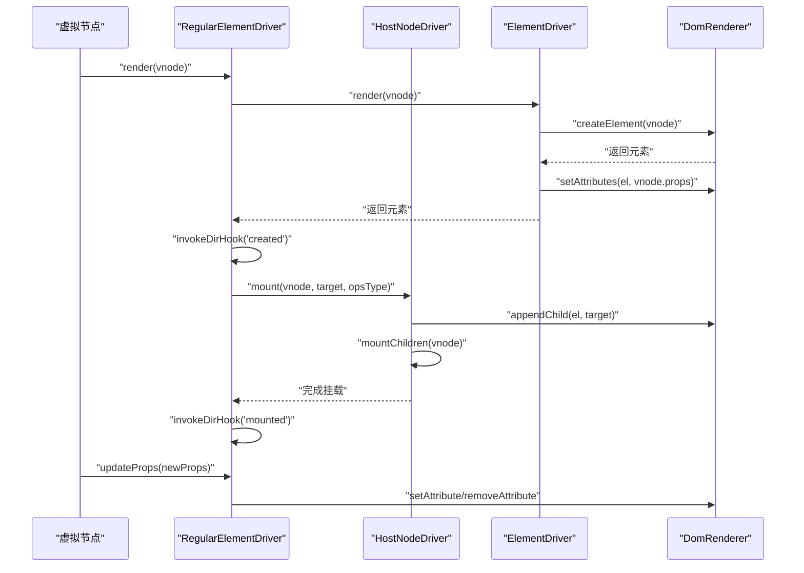
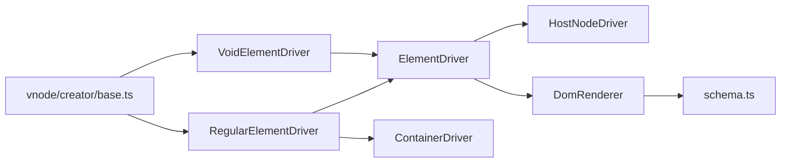

# 元素驱动

<cite>
**本文引用的文件**
- [ElementDriver.ts](file://packages/runtime-drivers/src/drivers/ElementDriver.ts)
- [HostNodeDriver.ts](file://packages/runtime-drivers/src/drivers/HostNodeDriver.ts)
- [RegularElementDriver.ts](file://packages/runtime-drivers/src/drivers/RegularElementDriver.ts)
- [VoidElementDriver.ts](file://packages/runtime-drivers/src/drivers/VoidElementDriver.ts)
- [ContainerDriver.ts](file://packages/runtime-drivers/src/drivers/ContainerDriver.ts)
- [factory.ts](file://packages/runtime-drivers/src/factory.ts)
- [DomRenderer.ts](file://packages/runtime-dom/src/DomRenderer.ts)
- [schema.ts](file://packages/runtime-core/src/renderer/schema.ts)
- [RegularElementVNode.ts](file://packages/runtime-core/src/types/nodes/RegularElementVNode.ts)
- [VoidElementVNode.ts](file://packages/runtime-core/src/types/nodes/VoidElementVNode.ts)
- [index.ts](file://packages/runtime-core/src/types/nodes/index.ts)
- [base.ts](file://packages/runtime-core/src/vnode/creator/base.ts)
</cite>

## 目录
1. [引言](#引言)
2. [项目结构](#项目结构)
3. [核心组件](#核心组件)
4. [架构总览](#架构总览)
5. [详细组件分析](#详细组件分析)
6. [依赖关系分析](#依赖关系分析)
7. [性能考量](#性能考量)
8. [故障排查指南](#故障排查指南)
9. [结论](#结论)
10. [附录](#附录)

## 引言
本篇文档聚焦于 Vitarx 中“元素驱动”体系，系统解析 ElementDriver 抽象基类的设计与实现，阐明其作为所有元素型节点驱动核心的职责边界：属性更新（updateProps）、事件绑定、生命周期钩子（created/beforeMount/mounted/beforeUnmount/unmounted）的调度机制；并进一步说明 RegularElementDriver 如何继承并扩展 ElementDriver 以支持常规 HTML/SVG 元素的完整 DOM 操作，VoidElementDriver 又如何针对自闭合标签（如 img、br）进行特殊处理；ContainerDriver 混入（mixin）在容器节点管理中的作用及其对子节点管理能力的增强；最后结合源码路径展示从虚拟节点到真实元素的创建与更新流程，并给出该层级的性能优化策略。

## 项目结构
围绕“元素驱动”的关键文件分布如下：
- 抽象基类与混入：ElementDriver、HostNodeDriver、ContainerDriver
- 具体元素驱动：RegularElementDriver、VoidElementDriver
- 驱动注册：factory.ts
- DOM 渲染器：DomRenderer.ts
- 主机模式与空元素判定：schema.ts
- 节点类型定义：RegularElementVNode.ts、VoidElementVNode.ts、nodes/index.ts
- 虚拟节点创建：base.ts

图表来源
- [HostNodeDriver.ts](file://packages/runtime-drivers/src/drivers/HostNodeDriver.ts#L1-L124)
- [ElementDriver.ts](file://packages/runtime-drivers/src/drivers/ElementDriver.ts#L1-L106)
- [RegularElementDriver.ts](file://packages/runtime-drivers/src/drivers/RegularElementDriver.ts#L1-L33)
- [VoidElementDriver.ts](file://packages/runtime-drivers/src/drivers/VoidElementDriver.ts#L1-L31)
- [ContainerDriver.ts](file://packages/runtime-drivers/src/drivers/ContainerDriver.ts#L1-L62)
- [DomRenderer.ts](file://packages/runtime-dom/src/DomRenderer.ts#L1-L568)
- [schema.ts](file://packages/runtime-core/src/renderer/schema.ts#L1-L37)
- [RegularElementVNode.ts](file://packages/runtime-core/src/types/nodes/RegularElementVNode.ts#L1-L19)
- [VoidElementVNode.ts](file://packages/runtime-core/src/types/nodes/VoidElementVNode.ts#L1-L18)

章节来源
- [factory.ts](file://packages/runtime-drivers/src/factory.ts#L1-L39)
- [DomRenderer.ts](file://packages/runtime-dom/src/DomRenderer.ts#L1-L568)
- [schema.ts](file://packages/runtime-core/src/renderer/schema.ts#L1-L37)

## 核心组件
- HostNodeDriver：宿主节点驱动抽象基类，提供通用的渲染、挂载、激活、停用、卸载生命周期与子节点管理的可选方法，以及锚点元素创建等基础设施。
- ElementDriver：元素驱动抽象基类，继承自 HostNodeDriver，专注于元素节点的属性更新与生命周期钩子调度，并委托 DOM 渲染器完成属性设置与删除。
- RegularElementDriver：常规元素驱动，继承 ElementDriver 并通过 ContainerDriver 混入获得子节点渲染/挂载/激活/停用/卸载能力，支持 HTML 与 SVG 元素创建。
- VoidElementDriver：空元素驱动，继承 ElementDriver，专用于 img、br、input 等自闭合标签，不包含子节点管理。
- ContainerDriver：容器混入函数，向宿主节点驱动注入子节点处理方法，使具备容器能力的驱动（如 RegularElementDriver）能统一管理子树生命周期。
- DomRenderer：Web 渲染器，实现 createElement、setAttribute/removeAttribute、事件绑定/解绑、容器判定等 DOM 操作，配合 schema.ts 的主机模式与空元素集合。

章节来源
- [HostNodeDriver.ts](file://packages/runtime-drivers/src/drivers/HostNodeDriver.ts#L1-L124)
- [ElementDriver.ts](file://packages/runtime-drivers/src/drivers/ElementDriver.ts#L1-L106)
- [RegularElementDriver.ts](file://packages/runtime-drivers/src/drivers/RegularElementDriver.ts#L1-L33)
- [VoidElementDriver.ts](file://packages/runtime-drivers/src/drivers/VoidElementDriver.ts#L1-L31)
- [ContainerDriver.ts](file://packages/runtime-drivers/src/drivers/ContainerDriver.ts#L1-L62)
- [DomRenderer.ts](file://packages/runtime-dom/src/DomRenderer.ts#L1-L568)
- [schema.ts](file://packages/runtime-core/src/renderer/schema.ts#L1-L37)

## 架构总览
元素驱动体系采用“抽象基类 + 具体驱动 + 混入”的分层设计：
- 抽象基类负责统一的生命周期与属性更新策略；
- 具体驱动负责差异化能力（如容器子节点管理）；
- 混入提供可插拔的子节点管理能力；
- 渲染器负责底层 DOM 操作与主机模式适配。

图表来源
- [HostNodeDriver.ts](file://packages/runtime-drivers/src/drivers/HostNodeDriver.ts#L1-L124)
- [ElementDriver.ts](file://packages/runtime-drivers/src/drivers/ElementDriver.ts#L1-L106)
- [RegularElementDriver.ts](file://packages/runtime-drivers/src/drivers/RegularElementDriver.ts#L1-L33)
- [VoidElementDriver.ts](file://packages/runtime-drivers/src/drivers/VoidElementDriver.ts#L1-L31)
- [ContainerDriver.ts](file://packages/runtime-drivers/src/drivers/ContainerDriver.ts#L1-L62)

## 详细组件分析

### ElementDriver 抽象基类
- 职责边界
  - 属性更新：遍历新旧属性，删除不存在于新属性集中的项，新增或更新存在项，委托渲染器执行 setAttribute/removeAttribute。
  - 生命周期钩子：在 render/mount/unmount 等关键节点调用指令钩子 created/beforeMount/mounted/beforeUnmount/unmounted。
  - 元素创建：委托渲染器创建元素并设置初始属性。
- 关键实现要点
  - updateProps 采用双遍历策略，先删后增，避免重复设置；通过渲染器统一处理事件属性、data-*、xlink:*、style/class 等特殊属性。
  - 生命周期钩子调用顺序严格遵循“created → beforeMount → mounted → beforeUnmount → unmounted”，保证指令与宿主节点状态一致。
  - createElement 由子类覆盖，RegularElementDriver/VoidElementDriver 分别对接 DOM 渲染器的 createElement 与主机模式（HTML/SVG）。

章节来源
- [ElementDriver.ts](file://packages/runtime-drivers/src/drivers/ElementDriver.ts#L1-L106)
- [DomRenderer.ts](file://packages/runtime-dom/src/DomRenderer.ts#L252-L358)

### RegularElementDriver：常规元素驱动
- 继承关系与扩展
  - 继承 ElementDriver，重用属性更新与生命周期调度。
  - 在构造函数中通过 mixinContainerDriver(this) 注入子节点管理方法，使其具备渲染/挂载/激活/停用/卸载子节点的能力。
- 元素创建
  - 由 DomRenderer 的 createElement 决定创建 HTML 元素或 SVG 元素，取决于 vnode 的 isSVGElement 标志。
- 适用场景
  - div、span、p、svg、circle 等可包含子节点的元素。

章节来源
- [RegularElementDriver.ts](file://packages/runtime-drivers/src/drivers/RegularElementDriver.ts#L1-L33)
- [ContainerDriver.ts](file://packages/runtime-drivers/src/drivers/ContainerDriver.ts#L1-L62)
- [DomRenderer.ts](file://packages/runtime-dom/src/DomRenderer.ts#L62-L74)
- [RegularElementVNode.ts](file://packages/runtime-core/src/types/nodes/RegularElementVNode.ts#L1-L19)

### VoidElementDriver：空元素驱动
- 继承关系与限制
  - 继承 ElementDriver，不混入容器能力，因为空元素（void elements）不允许包含子节点。
- 适用场景
  - img、br、input、hr、meta、embed 等自闭合标签。
- 主机模式与空元素判定
  - 通过 schema.ts 的 setHostSchema/getHostSchema/isVoidTag 与 DomRenderer 的 VOID_ELEMENTS 集合共同维护主机模式与空元素集合，确保容器判定与渲染行为一致。

章节来源
- [VoidElementDriver.ts](file://packages/runtime-drivers/src/drivers/VoidElementDriver.ts#L1-L31)
- [schema.ts](file://packages/runtime-core/src/renderer/schema.ts#L1-L37)
- [DomRenderer.ts](file://packages/runtime-dom/src/DomRenderer.ts#L21-L45)
- [VoidElementVNode.ts](file://packages/runtime-core/src/types/nodes/VoidElementVNode.ts#L1-L18)

### ContainerDriver 混入：容器节点管理
- 能力注入
  - renderChildren：遍历并渲染子节点。
  - mountChildren：将子节点挂载到容器元素上。
  - activateChildren/deactivateChildren：激活/停用子节点（不触发过渡）。
  - unmountChildren：卸载子节点。
- 设计动机
  - 将“子节点生命周期管理”从具体驱动中抽离，通过混入方式按需增强，降低重复代码与耦合度。
- 与 HostNodeDriver 的关系
  - HostNodeDriver 提供可选的 renderChildren/mountChildren 等方法，ContainerDriver 以同名方法覆盖并实现具体逻辑，形成“可选能力 + 混入增强”的组合模式。

章节来源
- [ContainerDriver.ts](file://packages/runtime-drivers/src/drivers/ContainerDriver.ts#L1-L62)
- [HostNodeDriver.ts](file://packages/runtime-drivers/src/drivers/HostNodeDriver.ts#L1-L124)

### 生命周期与指令钩子调度
- 调度点
  - render：在创建元素后立即调用 created。
  - mount：在挂载前调用 beforeMount，挂载后调用 mounted。
  - unmount：在卸载前调用 beforeUnmount，卸载后调用 unmounted，并将真实元素作为参数传递给钩子。
- 与虚拟节点的关系
  - 虚拟节点创建时会解析指令（如 v- 前缀），并将指令映射保存在节点上，驱动在相应生命周期中调用指令钩子，确保指令与节点生命周期同步。

章节来源
- [ElementDriver.ts](file://packages/runtime-drivers/src/drivers/ElementDriver.ts#L74-L98)
- [base.ts](file://packages/runtime-core/src/vnode/creator/base.ts#L77-L114)

### 从虚拟节点到真实元素的创建与更新流程
以下序列图展示了典型流程：RegularElementDriver 的渲染、挂载与属性更新。

图表来源
- [RegularElementDriver.ts](file://packages/runtime-drivers/src/drivers/RegularElementDriver.ts#L1-L33)
- [ElementDriver.ts](file://packages/runtime-drivers/src/drivers/ElementDriver.ts#L49-L104)
- [HostNodeDriver.ts](file://packages/runtime-drivers/src/drivers/HostNodeDriver.ts#L34-L89)
- [DomRenderer.ts](file://packages/runtime-dom/src/DomRenderer.ts#L62-L100)
- [base.ts](file://packages/runtime-core/src/vnode/creator/base.ts#L77-L114)

## 依赖关系分析
- 组件耦合
  - ElementDriver 依赖 HostNodeDriver（继承）与 DomRenderer（属性设置/删除）。
  - RegularElementDriver 依赖 ContainerDriver 混入与 DomRenderer。
  - VoidElementDriver 依赖 ElementDriver 与 DomRenderer。
  - DomRenderer 依赖 schema.ts 的主机模式与空元素集合。
- 外部依赖
  - 虚拟节点创建与指令解析位于 runtime-core 的 vnode/creator/base.ts，为驱动层提供指令映射与属性规范化。
- 循环依赖
  - 未发现循环依赖迹象；驱动层与渲染层通过接口契约解耦。

图表来源
- [ElementDriver.ts](file://packages/runtime-drivers/src/drivers/ElementDriver.ts#L1-L106)
- [HostNodeDriver.ts](file://packages/runtime-drivers/src/drivers/HostNodeDriver.ts#L1-L124)
- [RegularElementDriver.ts](file://packages/runtime-drivers/src/drivers/RegularElementDriver.ts#L1-L33)
- [VoidElementDriver.ts](file://packages/runtime-drivers/src/drivers/VoidElementDriver.ts#L1-L31)
- [ContainerDriver.ts](file://packages/runtime-drivers/src/drivers/ContainerDriver.ts#L1-L62)
- [DomRenderer.ts](file://packages/runtime-dom/src/DomRenderer.ts#L1-L568)
- [schema.ts](file://packages/runtime-core/src/renderer/schema.ts#L1-L37)
- [base.ts](file://packages/runtime-core/src/vnode/creator/base.ts#L1-L118)

章节来源
- [factory.ts](file://packages/runtime-drivers/src/factory.ts#L1-L39)
- [DomRenderer.ts](file://packages/runtime-dom/src/DomRenderer.ts#L1-L568)
- [schema.ts](file://packages/runtime-core/src/renderer/schema.ts#L1-L37)
- [base.ts](file://packages/runtime-core/src/vnode/creator/base.ts#L1-L118)

## 性能考量
- 属性更新优化
  - ElementDriver 的 updateProps 采用双遍历策略，先删后增，避免重复设置；DomRenderer 的 setAttribute/removeAttribute 对事件属性、data-*、xlink:*、style/class 等做了特殊处理，减少不必要的 DOM 操作。
  - 建议：在上层尽量合并属性变更，减少频繁调用 updateProps；对大量样式变更使用批量设置（如 setStyle）而非逐条设置。
- 子节点管理
  - ContainerDriver 的子节点管理方法以线性遍历实现，复杂度 O(n)；建议在子节点数量较多时，尽量减少不必要的全量重排，优先局部更新。
  - RegularElementDriver 通过 mixinContainerDriver 获得统一的子节点生命周期管理，避免重复实现，提升可维护性。
- 锚点与片段
  - HostNodeDriver 的 createAnchor 与 DomRenderer 的片段恢复逻辑（recoveryFragmentChildren）在停用/激活时用于锚定位置，避免 DOM 重排；合理使用可减少布局抖动。
- 主机模式与空元素
  - schema.ts 的主机模式与 DomRenderer 的 VOID_ELEMENTS 集合确保容器判定与渲染行为一致，避免对空元素执行不必要的子节点操作，提高渲染效率。

章节来源
- [ElementDriver.ts](file://packages/runtime-drivers/src/drivers/ElementDriver.ts#L49-L104)
- [DomRenderer.ts](file://packages/runtime-dom/src/DomRenderer.ts#L252-L358)
- [ContainerDriver.ts](file://packages/runtime-drivers/src/drivers/ContainerDriver.ts#L1-L62)
- [HostNodeDriver.ts](file://packages/runtime-drivers/src/drivers/HostNodeDriver.ts#L113-L123)
- [schema.ts](file://packages/runtime-core/src/renderer/schema.ts#L1-L37)

## 故障排查指南
- 指令钩子未触发
  - 确认虚拟节点创建时指令解析正常，指令映射已写入节点；检查 ElementDriver 的生命周期钩子调用点是否被执行。
  - 参考路径：[base.ts](file://packages/runtime-core/src/vnode/creator/base.ts#L77-L114)，[ElementDriver.ts](file://packages/runtime-drivers/src/drivers/ElementDriver.ts#L74-L98)
- 属性未生效或事件未绑定
  - 检查 DomRenderer 的 setAttribute/removeAttribute 对事件属性、data-*、xlink:*、style/class 的处理分支；确认属性值类型与渲染器期望一致。
  - 参考路径：[DomRenderer.ts](file://packages/runtime-dom/src/DomRenderer.ts#L252-L358)
- 自闭合标签子节点异常
  - VoidElementDriver 不支持子节点；若子节点被挂载，应检查节点类型与主机模式配置。
  - 参考路径：[VoidElementDriver.ts](file://packages/runtime-drivers/src/drivers/VoidElementDriver.ts#L1-L31)，[schema.ts](file://packages/runtime-core/src/renderer/schema.ts#L1-L37)
- 子节点生命周期异常
  - 确认 RegularElementDriver 已通过 mixinContainerDriver 注入子节点管理方法；检查 HostNodeDriver 的可选方法是否被正确覆盖。
  - 参考路径：[RegularElementDriver.ts](file://packages/runtime-drivers/src/drivers/RegularElementDriver.ts#L1-L33)，[ContainerDriver.ts](file://packages/runtime-drivers/src/drivers/ContainerDriver.ts#L1-L62)，[HostNodeDriver.ts](file://packages/runtime-drivers/src/drivers/HostNodeDriver.ts#L99-L107)

章节来源
- [base.ts](file://packages/runtime-core/src/vnode/creator/base.ts#L77-L114)
- [DomRenderer.ts](file://packages/runtime-dom/src/DomRenderer.ts#L252-L358)
- [VoidElementDriver.ts](file://packages/runtime-drivers/src/drivers/VoidElementDriver.ts#L1-L31)
- [schema.ts](file://packages/runtime-core/src/renderer/schema.ts#L1-L37)
- [RegularElementDriver.ts](file://packages/runtime-drivers/src/drivers/RegularElementDriver.ts#L1-L33)
- [ContainerDriver.ts](file://packages/runtime-drivers/src/drivers/ContainerDriver.ts#L1-L62)
- [HostNodeDriver.ts](file://packages/runtime-drivers/src/drivers/HostNodeDriver.ts#L99-L107)

## 结论
ElementDriver 以“抽象基类 + 生命周期钩子 + 属性更新”为核心，统一了元素型节点的渲染与更新策略；RegularElementDriver 通过 ContainerDriver 混入增强了容器节点的子节点管理能力，满足常规 HTML/SVG 元素的完整生命周期；VoidElementDriver 则针对自闭合标签进行专门处理，避免不合法的子节点操作。DomRenderer 与 schema.ts 的协作确保了主机模式与空元素判定的一致性。整体设计在可维护性与性能之间取得平衡，适合在复杂 UI 场景中稳定演进。

## 附录
- 节点类型与接口
  - RegularElementVNode：继承 ElementVNode 与 ContainerVNode，表示可包含子节点的常规元素。
  - VoidElementVNode：仅继承 ElementVNode，表示不可包含子节点的空元素。
  - 参考路径：[RegularElementVNode.ts](file://packages/runtime-core/src/types/nodes/RegularElementVNode.ts#L1-L19)，[VoidElementVNode.ts](file://packages/runtime-core/src/types/nodes/VoidElementVNode.ts#L1-L18)，[index.ts](file://packages/runtime-core/src/types/nodes/index.ts#L1-L9)
- 驱动注册
  - factory.ts 将默认驱动注册到运行时，确保不同类型节点使用对应驱动。
  - 参考路径：[factory.ts](file://packages/runtime-drivers/src/factory.ts#L1-L39)