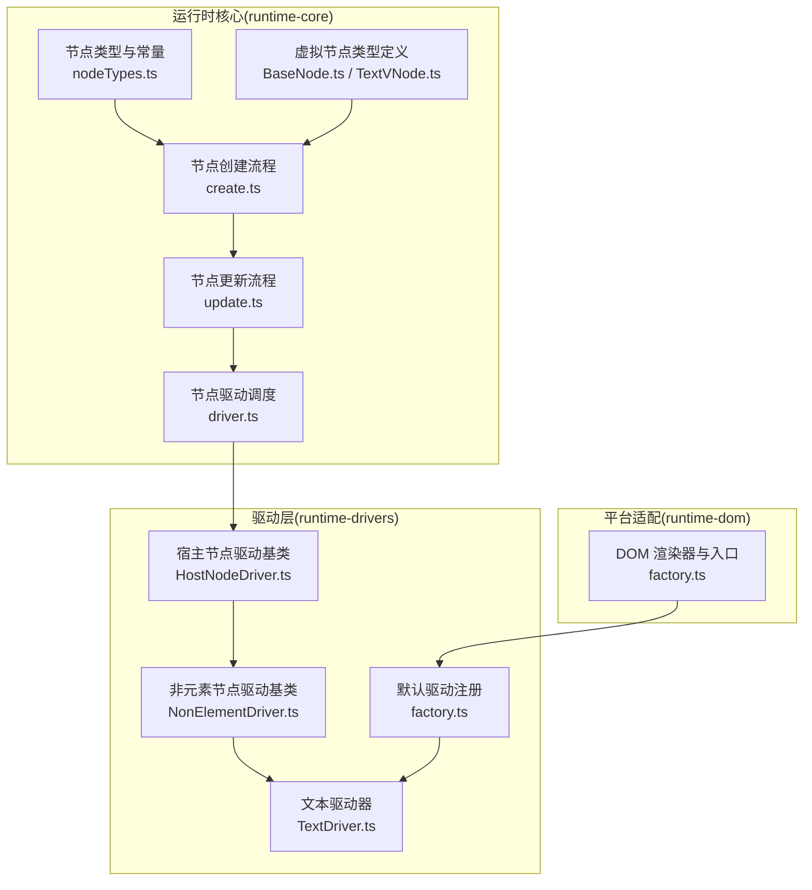
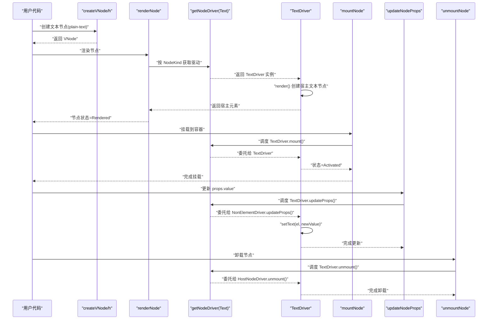
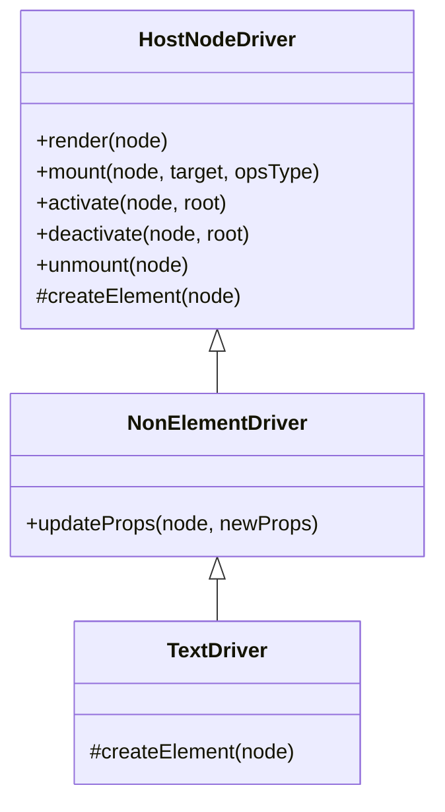
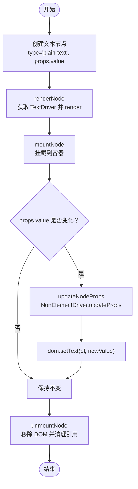
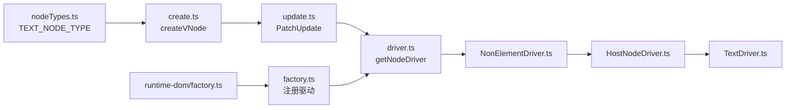

# 文本驱动

<cite>
**本文引用的文件**
- [packages/runtime-drivers/src/drivers/TextDriver.ts](file://packages/runtime-drivers/src/drivers/TextDriver.ts)
- [packages/runtime-drivers/src/drivers/NonElementDriver.ts](file://packages/runtime-drivers/src/drivers/NonElementDriver.ts)
- [packages/runtime-drivers/src/drivers/HostNodeDriver.ts](file://packages/runtime-drivers/src/drivers/HostNodeDriver.ts)
- [packages/runtime-drivers/src/factory.ts](file://packages/runtime-drivers/src/factory.ts)
- [packages/runtime-dom/src/factory.ts](file://packages/runtime-dom/src/factory.ts)
- [packages/runtime-core/src/vnode/core/create.ts](file://packages/runtime-core/src/vnode/core/create.ts)
- [packages/runtime-core/src/vnode/core/update.ts](file://packages/runtime-core/src/vnode/core/update.ts)
- [packages/runtime-core/src/vnode/core/driver.ts](file://packages/runtime-core/src/vnode/core/driver.ts)
- [packages/runtime-core/src/types/nodes/BaseNode.ts](file://packages/runtime-core/src/types/nodes/BaseNode.ts)
- [packages/runtime-core/src/types/nodes/TextVNode.ts](file://packages/runtime-core/src/types/nodes/TextVNode.ts)
- [packages/runtime-core/src/constants/nodeTypes.ts](file://packages/runtime-core/src/constants/nodeTypes.ts)
- [packages/runtime-drivers/__tests__/drivers/text-comment.test.ts](file://packages/runtime-drivers/__tests__/drivers/text-comment.test.ts)
</cite>

## 目录
1. [简介](#简介)
2. [项目结构](#项目结构)
3. [核心组件](#核心组件)
4. [架构总览](#架构总览)
5. [详细组件分析](#详细组件分析)
6. [依赖分析](#依赖分析)
7. [性能考量](#性能考量)
8. [故障排查指南](#故障排查指南)
9. [结论](#结论)
10. [附录](#附录)

## 简介
本文围绕 TextDriver 的设计原理与实现机制展开，重点说明其如何通过继承 NonElementDriver 来管理纯文本节点，解释文本节点与普通 DOM 元素的本质区别，并梳理 TextDriver 在“创建（create）—更新（update）—挂载（mount）”全流程中的职责分工。同时，结合 NonElementDriver 提供的通用非元素节点抽象，阐明其在节点管理与生命周期处理方面的简化设计；并通过具体调用示例展示响应式数据变化时，TextDriver 如何高效触发文本内容的重新渲染，并确保与虚拟 DOM 的同步一致性。

## 项目结构
围绕文本驱动的相关模块主要分布在以下包中：
- runtime-drivers：提供各类节点驱动器（含 TextDriver、NonElementDriver、HostNodeDriver 等），负责将虚拟节点映射到宿主环境（DOM）。
- runtime-core：提供虚拟节点类型、节点常量、节点创建与更新流程、节点驱动注册与调度等核心能力。
- runtime-dom：提供 DOM 渲染器与默认驱动注册入口，完成平台适配。
- 测试：覆盖 TextDriver 的渲染、挂载、更新、卸载等生命周期行为。

图表来源
- [packages/runtime-core/src/constants/nodeTypes.ts](file://packages/runtime-core/src/constants/nodeTypes.ts#L1-L32)
- [packages/runtime-core/src/types/nodes/BaseNode.ts](file://packages/runtime-core/src/types/nodes/BaseNode.ts#L1-L223)
- [packages/runtime-core/src/types/nodes/TextVNode.ts](file://packages/runtime-core/src/types/nodes/TextVNode.ts#L1-L17)
- [packages/runtime-core/src/vnode/core/create.ts](file://packages/runtime-core/src/vnode/core/create.ts#L1-L159)
- [packages/runtime-core/src/vnode/core/update.ts](file://packages/runtime-core/src/vnode/core/update.ts#L1-L391)
- [packages/runtime-core/src/vnode/core/driver.ts](file://packages/runtime-core/src/vnode/core/driver.ts#L1-L143)
- [packages/runtime-drivers/src/drivers/HostNodeDriver.ts](file://packages/runtime-drivers/src/drivers/HostNodeDriver.ts#L1-L124)
- [packages/runtime-drivers/src/drivers/NonElementDriver.ts](file://packages/runtime-drivers/src/drivers/NonElementDriver.ts#L1-L37)
- [packages/runtime-drivers/src/drivers/TextDriver.ts](file://packages/runtime-drivers/src/drivers/TextDriver.ts#L1-L31)
- [packages/runtime-drivers/src/factory.ts](file://packages/runtime-drivers/src/factory.ts#L1-L39)
- [packages/runtime-dom/src/factory.ts](file://packages/runtime-dom/src/factory.ts#L1-L24)

章节来源
- [packages/runtime-core/src/constants/nodeTypes.ts](file://packages/runtime-core/src/constants/nodeTypes.ts#L1-L32)
- [packages/runtime-core/src/types/nodes/BaseNode.ts](file://packages/runtime-core/src/types/nodes/BaseNode.ts#L1-L223)
- [packages/runtime-core/src/types/nodes/TextVNode.ts](file://packages/runtime-core/src/types/nodes/TextVNode.ts#L1-L17)
- [packages/runtime-core/src/vnode/core/create.ts](file://packages/runtime-core/src/vnode/core/create.ts#L1-L159)
- [packages/runtime-core/src/vnode/core/update.ts](file://packages/runtime-core/src/vnode/core/update.ts#L1-L391)
- [packages/runtime-core/src/vnode/core/driver.ts](file://packages/runtime-core/src/vnode/core/driver.ts#L1-L143)
- [packages/runtime-drivers/src/drivers/HostNodeDriver.ts](file://packages/runtime-drivers/src/drivers/HostNodeDriver.ts#L1-L124)
- [packages/runtime-drivers/src/drivers/NonElementDriver.ts](file://packages/runtime-drivers/src/drivers/NonElementDriver.ts#L1-L37)
- [packages/runtime-drivers/src/drivers/TextDriver.ts](file://packages/runtime-drivers/src/drivers/TextDriver.ts#L1-L31)
- [packages/runtime-drivers/src/factory.ts](file://packages/runtime-drivers/src/factory.ts#L1-L39)
- [packages/runtime-dom/src/factory.ts](file://packages/runtime-dom/src/factory.ts#L1-L24)

## 核心组件
- TextDriver：专门处理纯文本节点的驱动器，继承自 NonElementDriver，负责创建宿主文本节点与更新文本内容。
- NonElementDriver：非元素节点驱动基类，统一处理文本、注释等非元素节点的属性更新（主要是文本值）。
- HostNodeDriver：宿主节点驱动基类，提供渲染、挂载、激活、停用、卸载等生命周期方法与通用 DOM 操作封装。
- 节点类型与常量：定义了文本节点类型标识（plain-text）与节点种类（NodeKind.TEXT）。
- 节点创建与更新：create.ts 负责根据类型创建虚拟节点；update.ts 负责对比新旧节点并执行更新；driver.ts 负责按节点种类调度对应驱动器。
- 默认驱动注册：runtime-drivers/factory.ts 将 TextDriver 注册到运行时；runtime-dom/factory.ts 完成平台适配与入口。

章节来源
- [packages/runtime-drivers/src/drivers/TextDriver.ts](file://packages/runtime-drivers/src/drivers/TextDriver.ts#L1-L31)
- [packages/runtime-drivers/src/drivers/NonElementDriver.ts](file://packages/runtime-drivers/src/drivers/NonElementDriver.ts#L1-L37)
- [packages/runtime-drivers/src/drivers/HostNodeDriver.ts](file://packages/runtime-drivers/src/drivers/HostNodeDriver.ts#L1-L124)
- [packages/runtime-core/src/constants/nodeTypes.ts](file://packages/runtime-core/src/constants/nodeTypes.ts#L1-L32)
- [packages/runtime-core/src/vnode/core/create.ts](file://packages/runtime-core/src/vnode/core/create.ts#L1-L159)
- [packages/runtime-core/src/vnode/core/update.ts](file://packages/runtime-core/src/vnode/core/update.ts#L1-L391)
- [packages/runtime-core/src/vnode/core/driver.ts](file://packages/runtime-core/src/vnode/core/driver.ts#L1-L143)
- [packages/runtime-drivers/src/factory.ts](file://packages/runtime-drivers/src/factory.ts#L1-L39)
- [packages/runtime-dom/src/factory.ts](file://packages/runtime-dom/src/factory.ts#L1-L24)

## 架构总览
TextDriver 的工作流遵循“虚拟节点 → 驱动器 → 宿主节点”的标准路径。其关键流程如下：
- 节点创建：通过 createVNode 或 h 创建文本节点（type 为 plain-text），生成 VNode。
- 节点渲染：调用 renderNode，由 getNodeDriver 获取 TextDriver 并执行 render，创建宿主文本节点并设置 el 与状态。
- 节点挂载：调用 mountNode，将已渲染的文本节点挂载到目标容器，状态变为 Activated。
- 属性更新：当 props.value 发生变化时，通过 updateNodeProps 触发 TextDriver.updateProps，直接更新宿主文本节点内容。
- 卸载：调用 unmountNode，移除 DOM 节点并清理引用，状态变为 Unmounted。

图表来源
- [packages/runtime-core/src/vnode/core/create.ts](file://packages/runtime-core/src/vnode/core/create.ts#L1-L159)
- [packages/runtime-core/src/vnode/core/driver.ts](file://packages/runtime-core/src/vnode/core/driver.ts#L1-L143)
- [packages/runtime-core/src/vnode/core/update.ts](file://packages/runtime-core/src/vnode/core/update.ts#L1-L391)
- [packages/runtime-drivers/src/drivers/TextDriver.ts](file://packages/runtime-drivers/src/drivers/TextDriver.ts#L1-L31)
- [packages/runtime-drivers/src/drivers/NonElementDriver.ts](file://packages/runtime-drivers/src/drivers/NonElementDriver.ts#L1-L37)
- [packages/runtime-drivers/src/drivers/HostNodeDriver.ts](file://packages/runtime-drivers/src/drivers/HostNodeDriver.ts#L1-L124)

## 详细组件分析

### TextDriver 设计与实现
- 继承关系：TextDriver 继承 NonElementDriver，后者又继承 HostNodeDriver，形成“宿主节点驱动 → 非元素节点驱动 → 文本驱动”的层次结构。
- 创建（createElement）：在 TextDriver 中重写 createElement，通过 dom.createText(node.props.value) 创建宿主文本节点。
- 更新（updateProps）：继承自 NonElementDriver，当 props.value 变化时，直接调用 dom.setText(node.el!, newProps.value) 更新宿主文本内容。
- 生命周期：通过 HostNodeDriver 提供的 render/mount/activate/deactivate/unmount 等方法完成节点的渲染、挂载、激活、停用与卸载。

图表来源
- [packages/runtime-drivers/src/drivers/HostNodeDriver.ts](file://packages/runtime-drivers/src/drivers/HostNodeDriver.ts#L1-L124)
- [packages/runtime-drivers/src/drivers/NonElementDriver.ts](file://packages/runtime-drivers/src/drivers/NonElementDriver.ts#L1-L37)
- [packages/runtime-drivers/src/drivers/TextDriver.ts](file://packages/runtime-drivers/src/drivers/TextDriver.ts#L1-L31)

章节来源
- [packages/runtime-drivers/src/drivers/TextDriver.ts](file://packages/runtime-drivers/src/drivers/TextDriver.ts#L1-L31)
- [packages/runtime-drivers/src/drivers/NonElementDriver.ts](file://packages/runtime-drivers/src/drivers/NonElementDriver.ts#L1-L37)
- [packages/runtime-drivers/src/drivers/HostNodeDriver.ts](file://packages/runtime-drivers/src/drivers/HostNodeDriver.ts#L1-L124)

### 非元素节点抽象：NonElementDriver
- 职责：统一处理非元素节点（如文本、注释）的属性更新，核心是 props.value 的变更检测与宿主文本内容更新。
- 性能注意：直接操作 DOM 文本内容，频繁更新可能触发浏览器重绘，应避免不必要的重复更新（NonElementDriver 已做浅层比较）。
- 与 HostNodeDriver 的关系：NonElementDriver 仅负责属性更新，渲染、挂载、卸载等生命周期由 HostNodeDriver 提供。

章节来源
- [packages/runtime-drivers/src/drivers/NonElementDriver.ts](file://packages/runtime-drivers/src/drivers/NonElementDriver.ts#L1-L37)
- [packages/runtime-drivers/src/drivers/HostNodeDriver.ts](file://packages/runtime-drivers/src/drivers/HostNodeDriver.ts#L1-L124)

### 文本节点与普通 DOM 元素的区别
- 结构差异：文本节点是叶子节点，不可包含子节点，只能承载文本内容；元素节点可包含属性与子节点。
- 类型与常量：文本节点类型常量为 plain-text，节点种类为 NodeKind.TEXT；元素节点类型为 HTML 元素名。
- 虚拟节点模型：TextVNode 继承 NonElementVNode，props 中仅包含 value 字段；元素节点 props 包含属性与事件等。

章节来源
- [packages/runtime-core/src/types/nodes/TextVNode.ts](file://packages/runtime-core/src/types/nodes/TextVNode.ts#L1-L17)
- [packages/runtime-core/src/types/nodes/BaseNode.ts](file://packages/runtime-core/src/types/nodes/BaseNode.ts#L150-L223)
- [packages/runtime-core/src/constants/nodeTypes.ts](file://packages/runtime-core/src/constants/nodeTypes.ts#L1-L32)

### 创建（create）— 更新（update）— 挂载（mount）全流程
- 创建：通过 createVNode 或 h 创建文本节点，type 为 plain-text，props.value 为文本值。
- 渲染：renderNode 调用 getNodeDriver 获取 TextDriver，执行 render，创建宿主文本节点并设置 el 与状态。
- 挂载：mountNode 调用 TextDriver.mount，将宿主文本节点插入容器，状态变为 Activated。
- 更新：updateNodeProps 触发 NonElementDriver.updateProps，若 props.value 变化则更新宿主文本内容。
- 卸载：unmountNode 调用 HostNodeDriver.unmount，移除 DOM 节点并清理引用。

图表来源
- [packages/runtime-core/src/vnode/core/create.ts](file://packages/runtime-core/src/vnode/core/create.ts#L1-L159)
- [packages/runtime-core/src/vnode/core/driver.ts](file://packages/runtime-core/src/vnode/core/driver.ts#L1-L143)
- [packages/runtime-core/src/vnode/core/update.ts](file://packages/runtime-core/src/vnode/core/update.ts#L1-L391)
- [packages/runtime-drivers/src/drivers/NonElementDriver.ts](file://packages/runtime-drivers/src/drivers/NonElementDriver.ts#L1-L37)
- [packages/runtime-drivers/src/drivers/HostNodeDriver.ts](file://packages/runtime-drivers/src/drivers/HostNodeDriver.ts#L1-L124)

章节来源
- [packages/runtime-core/src/vnode/core/create.ts](file://packages/runtime-core/src/vnode/core/create.ts#L1-L159)
- [packages/runtime-core/src/vnode/core/driver.ts](file://packages/runtime-core/src/vnode/core/driver.ts#L1-L143)
- [packages/runtime-core/src/vnode/core/update.ts](file://packages/runtime-core/src/vnode/core/update.ts#L1-L391)
- [packages/runtime-drivers/src/drivers/NonElementDriver.ts](file://packages/runtime-drivers/src/drivers/NonElementDriver.ts#L1-L37)
- [packages/runtime-drivers/src/drivers/HostNodeDriver.ts](file://packages/runtime-drivers/src/drivers/HostNodeDriver.ts#L1-L124)

### 响应式数据变化与同步一致性
- 数据变化：当 props.value 来源于响应式信号（如 ref/computed）时，其值变化会触发虚拟节点的更新流程。
- 更新流程：PatchUpdate.patchUpdateNode 比较新旧节点类型与 key，若相同则调用 patchUpdateProps，进而通过 getNodeDriver 调用 TextDriver.updateProps。
- 同步一致性：NonElementDriver.updateProps 仅在 value 变化时更新 DOM，避免重复 setText；同时 HostNodeDriver 的生命周期方法保证节点状态与 DOM 一致。
- 测试验证：测试用例覆盖渲染、挂载、更新、卸载等场景，验证文本内容与节点状态的一致性。

章节来源
- [packages/runtime-core/src/vnode/core/update.ts](file://packages/runtime-core/src/vnode/core/update.ts#L1-L391)
- [packages/runtime-drivers/src/drivers/NonElementDriver.ts](file://packages/runtime-drivers/src/drivers/NonElementDriver.ts#L1-L37)
- [packages/runtime-drivers/__tests__/drivers/text-comment.test.ts](file://packages/runtime-drivers/__tests__/drivers/text-comment.test.ts#L1-L271)

## 依赖分析
- TextDriver 依赖 NonElementDriver 提供的属性更新逻辑，依赖 HostNodeDriver 提供的生命周期方法。
- 驱动注册：runtime-drivers/factory.ts 将 TextDriver 注册到 NodeKind.TEXT；runtime-dom/factory.ts 完成平台适配与入口。
- 节点类型：create.ts 根据 type 判断创建文本节点；update.ts 通过 getNodeDriver 按种类调度驱动器。

图表来源
- [packages/runtime-core/src/constants/nodeTypes.ts](file://packages/runtime-core/src/constants/nodeTypes.ts#L1-L32)
- [packages/runtime-core/src/vnode/core/create.ts](file://packages/runtime-core/src/vnode/core/create.ts#L1-L159)
- [packages/runtime-core/src/vnode/core/update.ts](file://packages/runtime-core/src/vnode/core/update.ts#L1-L391)
- [packages/runtime-core/src/vnode/core/driver.ts](file://packages/runtime-core/src/vnode/core/driver.ts#L1-L143)
- [packages/runtime-drivers/src/drivers/NonElementDriver.ts](file://packages/runtime-drivers/src/drivers/NonElementDriver.ts#L1-L37)
- [packages/runtime-drivers/src/drivers/HostNodeDriver.ts](file://packages/runtime-drivers/src/drivers/HostNodeDriver.ts#L1-L124)
- [packages/runtime-drivers/src/drivers/TextDriver.ts](file://packages/runtime-drivers/src/drivers/TextDriver.ts#L1-L31)
- [packages/runtime-drivers/src/factory.ts](file://packages/runtime-drivers/src/factory.ts#L1-L39)
- [packages/runtime-dom/src/factory.ts](file://packages/runtime-dom/src/factory.ts#L1-L24)

章节来源
- [packages/runtime-core/src/constants/nodeTypes.ts](file://packages/runtime-core/src/constants/nodeTypes.ts#L1-L32)
- [packages/runtime-core/src/vnode/core/create.ts](file://packages/runtime-core/src/vnode/core/create.ts#L1-L159)
- [packages/runtime-core/src/vnode/core/update.ts](file://packages/runtime-core/src/vnode/core/update.ts#L1-L391)
- [packages/runtime-core/src/vnode/core/driver.ts](file://packages/runtime-core/src/vnode/core/driver.ts#L1-L143)
- [packages/runtime-drivers/src/factory.ts](file://packages/runtime-drivers/src/factory.ts#L1-L39)
- [packages/runtime-dom/src/factory.ts](file://packages/runtime-dom/src/factory.ts#L1-L24)

## 性能考量
- 文本更新成本：每次 props.value 变化都会调用 setText，可能触发浏览器重绘。建议：
  - 合理拆分文本块，减少频繁更新的粒度。
  - 对热点文本使用缓存或记忆化策略（如 memo），避免不必要的更新。
- 生命周期开销：HostNodeDriver 的渲染/挂载/卸载均涉及 DOM 操作，尽量批量更新，减少多次 setState 导致的多次重排。
- diff 优化：对于包含大量文本节点的列表，合理使用 key，配合最长递增子序列优化，降低移动成本。

## 故障排查指南
- 文本未更新：确认 props.value 是否变化，以及 NonElementDriver.updateProps 是否被调用；检查 DOM 操作是否成功。
- 卸载异常：确认节点状态为 Activated 或 Rendered 后再卸载；确保未重复卸载。
- 测试参考：可对照测试用例验证渲染、挂载、更新、卸载的预期行为与状态变化。

章节来源
- [packages/runtime-drivers/__tests__/drivers/text-comment.test.ts](file://packages/runtime-drivers/__tests__/drivers/text-comment.test.ts#L1-L271)
- [packages/runtime-core/src/vnode/core/driver.ts](file://packages/runtime-core/src/vnode/core/driver.ts#L1-L143)

## 结论
TextDriver 通过继承 NonElementDriver，将文本节点的创建与更新聚焦在 props.value 的变更与宿主文本节点的 setText 操作上，借助 HostNodeDriver 提供的生命周期方法，实现了从“创建—渲染—挂载—更新—卸载”的完整闭环。在响应式系统中，当数据变化导致虚拟节点更新时，PatchUpdate 与 getNodeDriver 协作，确保 TextDriver 能够高效地将变更同步到 DOM，维持虚拟 DOM 与宿主节点的一致性。

## 附录
- 关键 API 与路径
  - 文本节点类型常量：[packages/runtime-core/src/constants/nodeTypes.ts](file://packages/runtime-core/src/constants/nodeTypes.ts#L1-L32)
  - 文本节点类型定义：[packages/runtime-core/src/types/nodes/TextVNode.ts](file://packages/runtime-core/src/types/nodes/TextVNode.ts#L1-L17)
  - 虚拟节点创建：[packages/runtime-core/src/vnode/core/create.ts](file://packages/runtime-core/src/vnode/core/create.ts#L1-L159)
  - 节点更新流程：[packages/runtime-core/src/vnode/core/update.ts](file://packages/runtime-core/src/vnode/core/update.ts#L1-L391)
  - 驱动调度与生命周期：[packages/runtime-core/src/vnode/core/driver.ts](file://packages/runtime-core/src/vnode/core/driver.ts#L1-L143)
  - 非元素节点驱动基类：[packages/runtime-drivers/src/drivers/NonElementDriver.ts](file://packages/runtime-drivers/src/drivers/NonElementDriver.ts#L1-L37)
  - 宿主节点驱动基类：[packages/runtime-drivers/src/drivers/HostNodeDriver.ts](file://packages/runtime-drivers/src/drivers/HostNodeDriver.ts#L1-L124)
  - 文本驱动器实现：[packages/runtime-drivers/src/drivers/TextDriver.ts](file://packages/runtime-drivers/src/drivers/TextDriver.ts#L1-L31)
  - 默认驱动注册：[packages/runtime-drivers/src/factory.ts](file://packages/runtime-drivers/src/factory.ts#L1-L39)
  - 平台适配入口：[packages/runtime-dom/src/factory.ts](file://packages/runtime-dom/src/factory.ts#L1-L24)
  - 测试用例参考：[packages/runtime-drivers/__tests__/drivers/text-comment.test.ts](file://packages/runtime-drivers/__tests__/drivers/text-comment.test.ts#L1-L271)