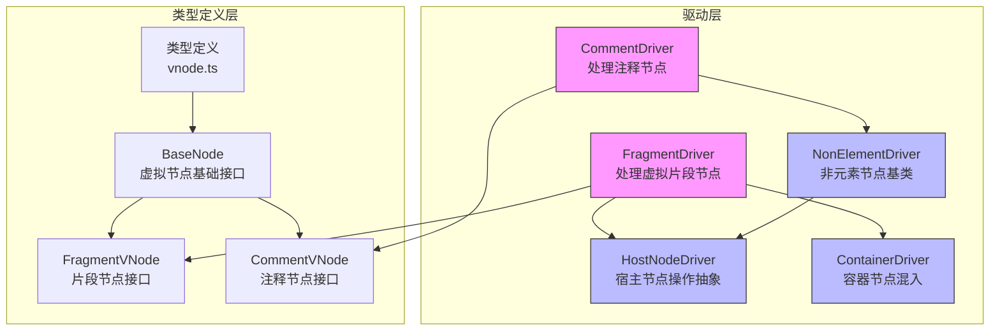

# 片段与注释驱动

<cite>
**本文档中引用的文件**  
- [FragmentDriver.ts](file://packages/runtime-drivers/src/drivers/FragmentDriver.ts)
- [CommentDriver.ts](file://packages/runtime-drivers/src/drivers/CommentDriver.ts)
- [HostNodeDriver.ts](file://packages/runtime-drivers/src/drivers/HostNodeDriver.ts)
- [NonElementDriver.ts](file://packages/runtime-drivers/src/drivers/NonElementDriver.ts)
- [ContainerDriver.ts](file://packages/runtime-drivers/src/drivers/ContainerDriver.ts)
- [FragmentVNode.ts](file://packages/runtime-core/src/types/nodes/FragmentVNode.ts)
- [CommentVNode.ts](file://packages/runtime-core/src/types/nodes/CommentVNode.ts)
- [BaseNode.ts](file://packages/runtime-core/src/types/nodes/BaseNode.ts)
- [vnode.ts](file://packages/runtime-core/src/types/vnode.ts)
- [renderer.ts](file://packages/runtime-core/src/types/renderer.ts)
- [nodeTypes.ts](file://packages/runtime-core/src/constants/nodeTypes.ts)
- [nodeKind.ts](file://packages/runtime-core/src/constants/nodeKind.ts)
</cite>

## 目录
1. [引言](#引言)
2. [核心架构概览](#核心架构概览)
3. [FragmentDriver 实现机制](#fragmentdriver-实现机制)
4. [CommentDriver 实现机制](#commentdriver-实现机制)
5. [HostNodeDriver 核心作用](#hostnodedriver-核心作用)
6. [协同工作机制](#协同工作机制)
7. [实际渲染场景分析](#实际渲染场景分析)
8. [总结](#总结)

## 引言
FragmentDriver 和 CommentDriver 是 Vitarx 框架中用于处理特殊虚拟节点的核心驱动组件。它们分别负责管理虚拟片段节点（Fragment）和注释节点（Comment），为框架提供高效的 DOM 操作抽象。FragmentDriver 允许组件返回多个根节点而无需创建额外的 DOM 容器，而 CommentDriver 则利用 DOM 注释节点作为占位符，支撑条件渲染等高级功能的实现。这些驱动通过 HostNodeDriver 提供的底层接口，实现了对虚拟节点生命周期的完整管理。

## 核心架构概览


**图示来源**
- [FragmentDriver.ts](file://packages/runtime-drivers/src/drivers/FragmentDriver.ts)
- [CommentDriver.ts](file://packages/runtime-drivers/src/drivers/CommentDriver.ts)
- [HostNodeDriver.ts](file://packages/runtime-drivers/src/drivers/HostNodeDriver.ts)
- [NonElementDriver.ts](file://packages/runtime-drivers/src/drivers/NonElementDriver.ts)
- [ContainerDriver.ts](file://packages/runtime-drivers/src/drivers/ContainerDriver.ts)
- [FragmentVNode.ts](file://packages/runtime-core/src/types/nodes/FragmentVNode.ts)
- [CommentVNode.ts](file://packages/runtime-core/src/types/nodes/CommentVNode.ts)
- [BaseNode.ts](file://packages/runtime-core/src/types/nodes/BaseNode.ts)
- [vnode.ts](file://packages/runtime-core/src/types/vnode.ts)

## FragmentDriver 实现机制
FragmentDriver 是专门用于管理虚拟片段节点的驱动器类，继承自 HostNodeDriver。它实现了对 Fragment 类型虚拟节点的创建、渲染和生命周期管理。FragmentDriver 的核心特点是不创建实际的 DOM 容器元素，而是直接管理其子节点的挂载、更新与卸载。

FragmentDriver 通过 mixinContainerDriver 混入了容器驱动器的功能，使其能够处理子节点的渲染、挂载、激活、停用和卸载等操作。在创建元素时，它调用 getRenderer().createFragment(node) 来创建文档片段，但这个片段仅作为逻辑容器，不会在 DOM 树中产生实际的元素节点。

特别值得注意的是，FragmentDriver 重写了 updateProps 方法，但实际不执行任何操作，因为片段节点本身不需要处理属性更新。这种设计优化了性能，避免了不必要的属性比较和更新操作。

**本节来源**
- [FragmentDriver.ts](file://packages/runtime-drivers/src/drivers/FragmentDriver.ts#L1-L42)
- [FragmentVNode.ts](file://packages/runtime-core/src/types/nodes/FragmentVNode.ts#L1-L17)
- [ContainerDriver.ts](file://packages/runtime-drivers/src/drivers/ContainerDriver.ts#L1-L62)

## CommentDriver 实现机制
CommentDriver 是专门用于处理注释节点的控制器类，继承自 NonElementDriver。它负责将虚拟注释节点转换为实际的 DOM 注释元素，并管理其生命周期。

CommentDriver 的主要功能是通过 createElement 方法将虚拟注释节点转换为实际的 DOM 注释元素。它调用 getRenderer().createComment(node.props.value) 来创建注释节点，其中 node.props.value 包含注释的内容。这种机制使得注释节点可以作为占位符，在 DOM 树中占据特定位置，但不会对用户可见。

注释节点在框架中扮演着重要角色，特别是在条件渲染（如 v-if、v-show）的实现中。当某个条件不满足时，框架可以用注释节点作为占位符，标记该位置原本应该存在的元素，从而在条件变化时能够快速定位和替换节点。

**本节来源**
- [CommentDriver.ts](file://packages/runtime-drivers/src/drivers/CommentDriver.ts#L1-L25)
- [CommentVNode.ts](file://packages/runtime-core/src/types/nodes/CommentVNode.ts#L1-L15)
- [NonElementDriver.ts](file://packages/runtime-drivers/src/drivers/NonElementDriver.ts#L1-L37)

## HostNodeDriver 核心作用
HostNodeDriver 是宿主节点驱动器的抽象基类，为所有特殊节点提供底层 DOM 操作接口。它定义了虚拟节点生命周期的核心方法，包括渲染、挂载、激活、停用和卸载等操作。

HostNodeDriver 通过 getRenderer() 获取渲染器实例，从而与具体的 DOM 操作解耦。它提供了 createElement 抽象方法，由子类实现具体的元素创建逻辑。同时，它还定义了 createAnchor 方法，用于创建锚点元素，这在片段节点的渲染中尤为重要。

HostNodeDriver 的设计体现了面向对象的抽象和继承原则。它为所有宿主节点提供了统一的接口，同时允许子类根据具体节点类型实现特定的行为。例如，FragmentDriver 和 CommentDriver 都继承自 HostNodeDriver 或其子类，从而共享了基本的生命周期管理功能，同时实现了各自特有的节点创建逻辑。

**本节来源**
- [HostNodeDriver.ts](file://packages/runtime-drivers/src/drivers/HostNodeDriver.ts#L1-L124)
- [BaseNode.ts](file://packages/runtime-core/src/types/nodes/BaseNode.ts#L1-L223)
- [renderer.ts](file://packages/runtime-core/src/types/renderer.ts#L1-L286)

## 协同工作机制
FragmentDriver、CommentDriver 和 HostNodeDriver 通过精心设计的继承和组合关系协同工作，支持复杂的组件结构。这种协同机制体现在以下几个方面：

首先，FragmentDriver 通过继承 HostNodeDriver 获得了基本的节点生命周期管理能力，同时通过 mixinContainerDriver 混入了容器节点的子节点处理能力。这使得 FragmentDriver 能够正确管理其子节点的挂载、更新和卸载，而无需创建实际的 DOM 容器。

其次，CommentDriver 通过继承 NonElementDriver（而 NonElementDriver 又继承自 HostNodeDriver）获得了对非元素节点的管理能力。NonElementDriver 提供了对文本内容的更新机制，而 CommentDriver 则专注于注释节点的创建和管理。

最后，HostNodeDriver 作为所有这些驱动的共同基类，提供了统一的 DOM 操作接口。通过 getRenderer() 获取的渲染器实例，这些驱动能够与具体的 DOM 实现解耦，从而支持不同的渲染目标（如浏览器、SSR 等）。

```mermaid
classDiagram
class HostNodeDriver {
+get dom
+render(node)
+mount(node, target, opsType)
+activate(node, root)
+deactivate(node, root)
+unmount(node)
+createAnchor(node)
-createElement(node)
}
class FragmentDriver {
+constructor()
+updateProps(node, newProps)
-createElement(node)
}
class CommentDriver {
-createElement(node)
}
class NonElementDriver {
+updateProps(node, newProps)
}
class ContainerDriver {
+mixinContainerDriver(driver)
}
HostNodeDriver <|-- FragmentDriver
HostNodeDriver <|-- NonElementDriver
NonElementDriver <|-- CommentDriver
FragmentDriver o-- ContainerDriver : "使用"
note right of FragmentDriver
不创建实际DOM容器
直接管理子节点的挂载与卸载
end note
note right of CommentDriver
利用DOM注释节点作为占位符
支持v-if、v-show等条件渲染
end note
note left of HostNodeDriver
宿主节点操作抽象基类
提供统一的DOM操作接口
end note
```

**图示来源**
- [FragmentDriver.ts](file://packages/runtime-drivers/src/drivers/FragmentDriver.ts#L1-L42)
- [CommentDriver.ts](file://packages/runtime-drivers/src/drivers/CommentDriver.ts#L1-L25)
- [HostNodeDriver.ts](file://packages/runtime-drivers/src/drivers/HostNodeDriver.ts#L1-L124)
- [NonElementDriver.ts](file://packages/runtime-drivers/src/drivers/NonElementDriver.ts#L1-L37)
- [ContainerDriver.ts](file://packages/runtime-drivers/src/drivers/ContainerDriver.ts#L1-L62)

## 实际渲染场景分析
在实际的渲染场景中，FragmentDriver 和 CommentDriver 的协同工作体现在多个方面。考虑一个包含条件渲染和多个根节点的组件：

当组件包含多个根节点时，框架会创建一个 Fragment 节点作为这些节点的容器。FragmentDriver 负责管理这个片段节点，它不会创建额外的 DOM 元素，而是直接将其子节点插入到父容器中。这避免了不必要的 DOM 嵌套，提高了渲染性能。

当组件包含条件渲染指令（如 v-if）时，CommentDriver 会发挥作用。当条件为假时，框架会创建一个注释节点作为占位符，标记该位置原本应该存在的元素。这个注释节点由 CommentDriver 管理，它确保了 DOM 结构的稳定性，使得在条件变化时能够快速定位和替换节点。

在更新过程中，如果片段节点的子节点发生变化，FragmentDriver 会协调子节点的更新、插入和删除操作。如果某个子节点被条件渲染指令控制，CommentDriver 会确保在节点被移除时用注释节点作为占位符，在节点被添加时移除占位符并插入实际节点。

这种协同工作机制使得框架能够高效地处理复杂的组件结构，同时保持 DOM 操作的最小化，从而提供流畅的用户体验。

**本节来源**
- [FragmentDriver.ts](file://packages/runtime-drivers/src/drivers/FragmentDriver.ts#L1-L42)
- [CommentDriver.ts](file://packages/runtime-drivers/src/drivers/CommentDriver.ts#L1-L25)
- [HostNodeDriver.ts](file://packages/runtime-drivers/src/drivers/HostNodeDriver.ts#L1-L124)
- [BaseNode.ts](file://packages/runtime-core/src/types/nodes/BaseNode.ts#L1-L223)

## 总结
FragmentDriver 和 CommentDriver 作为 Vitarx 框架的核心组件，通过精巧的设计实现了对特殊虚拟节点的高效管理。FragmentDriver 通过不创建实际 DOM 容器而直接管理子节点的方式，支持了多根节点组件的实现，避免了不必要的 DOM 嵌套。CommentDriver 利用 DOM 注释节点作为占位符，为条件渲染等高级功能提供了坚实的基础。

HostNodeDriver 作为宿主节点操作的抽象基类，为这些特殊节点驱动提供了统一的底层接口，实现了关注点分离和代码复用。通过继承和组合的设计模式，这些驱动组件能够协同工作，支持复杂的组件结构和动态的 UI 变化。

这种架构设计不仅提高了框架的性能和灵活性，还为开发者提供了直观的编程模型，使得构建复杂的用户界面变得更加简单和高效。