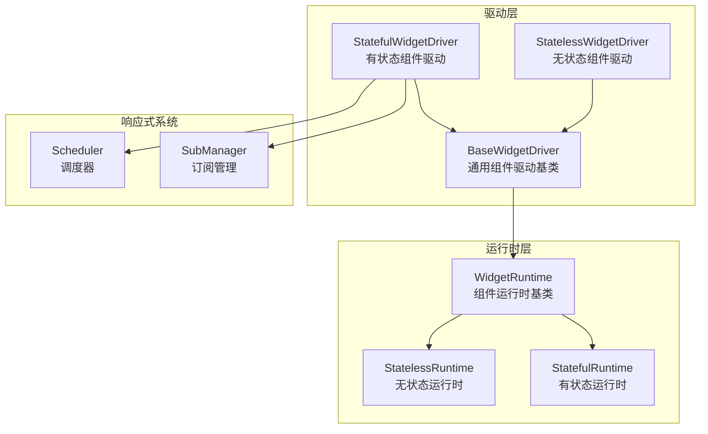
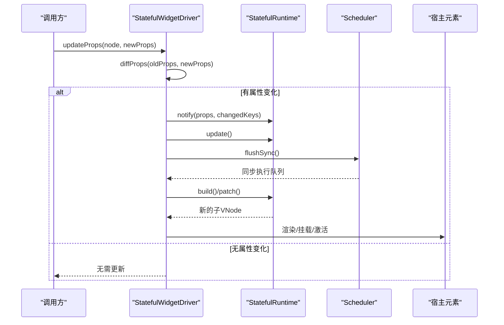
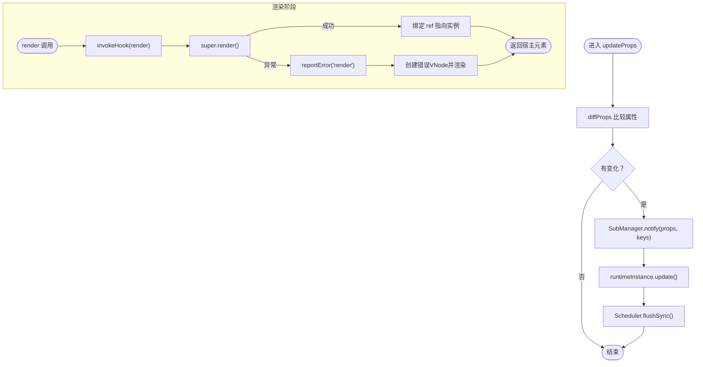
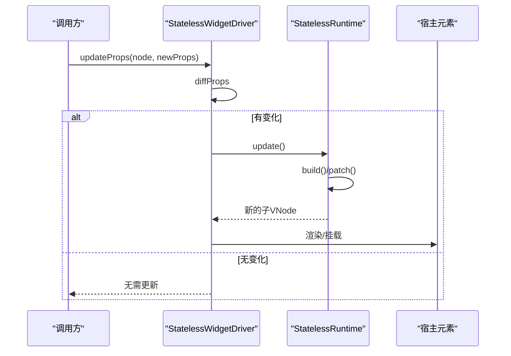
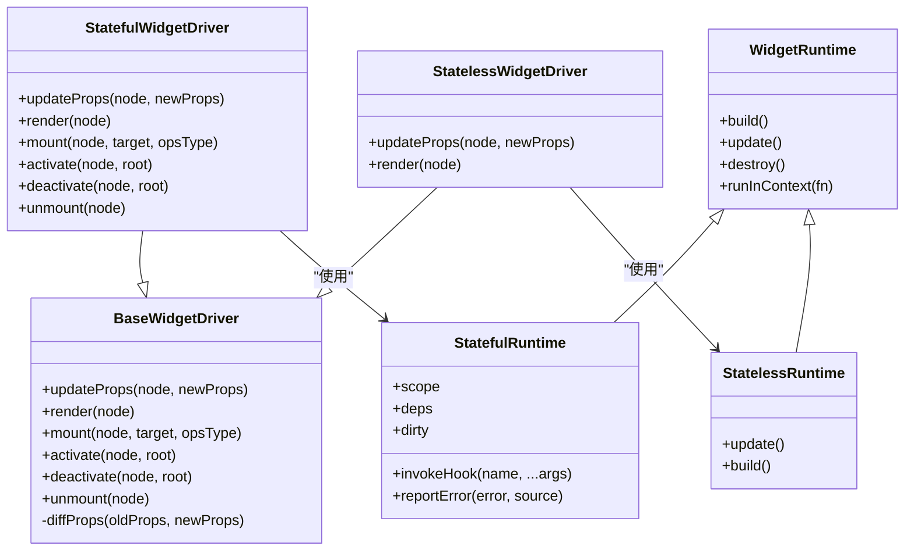

# 组件驱动

<cite>
**本文引用的文件**
- [BaseWidgetDriver.ts](file://packages/runtime-drivers/src/drivers/BaseWidgetDriver.ts)
- [StatefulWidgetDriver.ts](file://packages/runtime-drivers/src/drivers/StatefulWidgetDriver.ts)
- [StatelessWidgetDriver.ts](file://packages/runtime-drivers/src/drivers/StatelessWidgetDriver.ts)
- [index.ts](file://packages/runtime-drivers/src/drivers/index.ts)
- [WidgetRuntime.ts](file://packages/runtime-core/src/widget/runtime/WidgetRuntime.ts)
- [Stateful.ts](file://packages/runtime-core/src/widget/runtime/Stateful.ts)
- [Stateless.ts](file://packages/runtime-core/src/widget/runtime/Stateless.ts)
- [nodeState.ts](file://packages/runtime-core/src/constants/nodeState.ts)
- [lifecycle.ts](file://packages/runtime-core/src/types/lifecycle.ts)
- [scheduler.ts](file://packages/responsive/src/observer/scheduler.ts)
- [watch.ts](file://packages/responsive/src/signal/watch/watch.ts)
</cite>

## 目录
1. [引言](#引言)
2. [项目结构](#项目结构)
3. [核心组件](#核心组件)
4. [架构总览](#架构总览)
5. [详细组件分析](#详细组件分析)
6. [依赖关系分析](#依赖关系分析)
7. [性能考量](#性能考量)
8. [故障排查指南](#故障排查指南)
9. [结论](#结论)

## 引言
本文件系统性讲解组件驱动层的设计与实现，重点对比 StatefulWidgetDriver 与 StatelessWidgetDriver 的差异，阐述 BaseWidgetDriver 作为组件驱动基类提供的通用能力（上下文管理、状态监听与更新调度），并深入分析两类组件的生命周期管理、状态变更与重渲染机制。文档还结合组件挂载与更新流程，展示驱动层如何协调组件实例与虚拟 DOM 之间的交互，并确保响应式系统的正确接入。

## 项目结构
组件驱动位于 runtime-drivers 包中，分别提供通用基类与两类组件专用驱动器；组件运行时位于 runtime-core 包中，分别提供有状态与无状态组件运行时；响应式系统位于 responsive 包中，提供调度器与订阅管理。

图表来源
- [BaseWidgetDriver.ts](file://packages/runtime-drivers/src/drivers/BaseWidgetDriver.ts#L1-L128)
- [StatefulWidgetDriver.ts](file://packages/runtime-drivers/src/drivers/StatefulWidgetDriver.ts#L1-L121)
- [StatelessWidgetDriver.ts](file://packages/runtime-drivers/src/drivers/StatelessWidgetDriver.ts#L1-L49)
- [WidgetRuntime.ts](file://packages/runtime-core/src/widget/runtime/WidgetRuntime.ts#L1-L123)
- [Stateful.ts](file://packages/runtime-core/src/widget/runtime/Stateful.ts#L1-L368)
- [Stateless.ts](file://packages/runtime-core/src/widget/runtime/Stateless.ts#L1-L66)
- [scheduler.ts](file://packages/responsive/src/observer/scheduler.ts#L1-L326)
- [watch.ts](file://packages/responsive/src/signal/watch/watch.ts#L1-L432)

章节来源
- [index.ts](file://packages/runtime-drivers/src/drivers/index.ts#L1-L18)

## 核心组件
- BaseWidgetDriver：实现 NodeDriver 接口，提供通用的渲染、挂载、激活、停用、卸载与属性差异比较能力，统一处理指令钩子调用与节点状态转换。
- StatefulWidgetDriver：继承 BaseWidgetDriver，扩展有状态组件的生命周期钩子、错误处理、调度同步与作用域恢复/暂停等能力。
- StatelessWidgetDriver：继承 BaseWidgetDriver，针对无状态组件的属性更新与纯渲染特性，提供轻量级更新路径。

章节来源
- [BaseWidgetDriver.ts](file://packages/runtime-drivers/src/drivers/BaseWidgetDriver.ts#L1-L128)
- [StatefulWidgetDriver.ts](file://packages/runtime-drivers/src/drivers/StatefulWidgetDriver.ts#L1-L121)
- [StatelessWidgetDriver.ts](file://packages/runtime-drivers/src/drivers/StatelessWidgetDriver.ts#L1-L49)

## 架构总览
组件驱动层通过驱动器协调组件运行时与虚拟 DOM，响应式系统通过订阅与调度器确保更新的有序与高效。

图表来源
- [StatefulWidgetDriver.ts](file://packages/runtime-drivers/src/drivers/StatefulWidgetDriver.ts#L43-L85)
- [Stateful.ts](file://packages/runtime-core/src/widget/runtime/Stateful.ts#L196-L248)
- [scheduler.ts](file://packages/responsive/src/observer/scheduler.ts#L176-L186)

## 详细组件分析

### BaseWidgetDriver：组件驱动基类
- 职责
  - 渲染：创建组件运行时，渲染子节点，设置节点状态，调用指令钩子。
  - 挂载/激活/停用/卸载：按生命周期顺序调用底层渲染器与指令钩子，维护节点状态。
  - 属性差异比较：diffProps 对比新旧属性，返回变化键集合，供子类决定是否触发更新。
- 关键点
  - 统一的状态枚举与生命周期钩子调用，保证驱动器的一致性。
  - 通过泛型约束确保类型安全，子类只需实现 updateProps。

章节来源
- [BaseWidgetDriver.ts](file://packages/runtime-drivers/src/drivers/BaseWidgetDriver.ts#L52-L128)
- [nodeState.ts](file://packages/runtime-core/src/constants/nodeState.ts#L1-L19)

### StatefulWidgetDriver：有状态组件驱动
- 生命周期与更新
  - updateProps：检测属性变化，通知响应式订阅，触发组件更新并通过调度器同步刷新。
  - render：在渲染前调用 render 生命周期钩子，捕获渲染期错误，回退为注释节点并重新渲染。
  - mount/activate/deactivate/unmount：在各阶段调用组件生命周期钩子，激活时恢复作用域并按需触发更新，停用时暂停作用域。
- 错误处理
  - 在渲染与更新阶段均通过运行时的错误上报机制处理异常，必要时回退为注释节点，保证 UI 稳定。
- 与响应式系统协作
  - 通过 SubManager.notify 与 Scheduler.flushSync，确保属性变化触发的更新在当前 tick 内完成。

图表来源
- [StatefulWidgetDriver.ts](file://packages/runtime-drivers/src/drivers/StatefulWidgetDriver.ts#L43-L120)
- [Stateful.ts](file://packages/runtime-core/src/widget/runtime/Stateful.ts#L104-L162)
- [lifecycle.ts](file://packages/runtime-core/src/types/lifecycle.ts#L1-L139)

章节来源
- [StatefulWidgetDriver.ts](file://packages/runtime-drivers/src/drivers/StatefulWidgetDriver.ts#L1-L121)
- [Stateful.ts](file://packages/runtime-core/src/widget/runtime/Stateful.ts#L1-L368)
- [scheduler.ts](file://packages/responsive/src/observer/scheduler.ts#L176-L186)
- [watch.ts](file://packages/responsive/src/signal/watch/watch.ts#L298-L354)

### StatelessWidgetDriver：无状态组件驱动
- 特性
  - 无状态组件不维护内部状态，仅根据属性变化触发运行时更新。
  - render 阶段绑定 ref 指向节点自身，便于外部直接访问。
- 更新策略
  - diffProps 比较后若有变化，直接触发 runtimeInstance.update()，由运行时重建子节点并进行补丁更新。

图表来源
- [StatelessWidgetDriver.ts](file://packages/runtime-drivers/src/drivers/StatelessWidgetDriver.ts#L1-L49)
- [Stateless.ts](file://packages/runtime-core/src/widget/runtime/Stateless.ts#L1-L66)

章节来源
- [StatelessWidgetDriver.ts](file://packages/runtime-drivers/src/drivers/StatelessWidgetDriver.ts#L1-L49)
- [Stateless.ts](file://packages/runtime-core/src/widget/runtime/Stateless.ts#L1-L66)

### 运行时基类：WidgetRuntime
- 职责
  - 统一管理组件运行时生命周期与虚拟节点构建，提供子节点缓存、上下文执行、销毁清理等能力。
  - 为有状态组件提供依赖订阅与作用域管理，为无状态组件提供简单构建与补丁更新。
- 与驱动层的关系
  - 驱动器通过 createWidgetRuntime 获取运行时实例，再委托运行时完成构建、更新与错误处理。

章节来源
- [WidgetRuntime.ts](file://packages/runtime-core/src/widget/runtime/WidgetRuntime.ts#L1-L123)
- [Stateful.ts](file://packages/runtime-core/src/widget/runtime/Stateful.ts#L1-L368)
- [Stateless.ts](file://packages/runtime-core/src/widget/runtime/Stateless.ts#L1-L66)

## 依赖关系分析
- 驱动器对运行时的依赖
  - StatefulWidgetDriver/StatelessWidgetDriver 依赖 BaseWidgetDriver，后者依赖运行时基类与节点状态常量。
- 响应式系统集成
  - StatefulWidgetDriver 通过 SubManager.notify 与 Scheduler.flushSync，将属性变化转化为同步更新。
  - 有状态运行时通过 EffectScope 与 SubManager 建立依赖订阅，实现自动更新与错误上报。
- 生命周期与错误处理
  - 驱动器在关键生命周期调用运行时的钩子方法，运行时负责错误冒泡与全局处理。

图表来源
- [BaseWidgetDriver.ts](file://packages/runtime-drivers/src/drivers/BaseWidgetDriver.ts#L1-L128)
- [StatefulWidgetDriver.ts](file://packages/runtime-drivers/src/drivers/StatefulWidgetDriver.ts#L1-L121)
- [StatelessWidgetDriver.ts](file://packages/runtime-drivers/src/drivers/StatelessWidgetDriver.ts#L1-L49)
- [WidgetRuntime.ts](file://packages/runtime-core/src/widget/runtime/WidgetRuntime.ts#L1-L123)
- [Stateful.ts](file://packages/runtime-core/src/widget/runtime/Stateful.ts#L1-L368)
- [Stateless.ts](file://packages/runtime-core/src/widget/runtime/Stateless.ts#L1-L66)

## 性能考量
- 更新批量化与同步刷新
  - 有状态组件在属性变化时通过 SubManager.notify 与 Scheduler.flushSync，确保更新在同一 tick 内完成，避免多次重渲染带来的抖动。
- 依赖订阅与自动更新
  - 有状态运行时在启用自动更新时建立依赖订阅，仅在依赖变化时触发更新，减少不必要的渲染。
- 调度器队列分阶段
  - Scheduler 采用 preFlush/main/postFlush 三阶段队列，配合 nextTick 微任务调度，保证更新顺序与一致性。
- 无状态组件轻量更新
  - 无状态组件仅进行属性差异比较与运行时重建，路径简洁，适合高频纯渲染场景。

章节来源
- [scheduler.ts](file://packages/responsive/src/observer/scheduler.ts#L1-L326)
- [watch.ts](file://packages/responsive/src/signal/watch/watch.ts#L1-L432)
- [Stateful.ts](file://packages/runtime-core/src/widget/runtime/Stateful.ts#L256-L313)
- [Stateless.ts](file://packages/runtime-core/src/widget/runtime/Stateless.ts#L1-L66)

## 故障排查指南
- 渲染期错误
  - 有状态组件在 render 阶段捕获异常，通过运行时的错误上报机制生成错误节点并回退渲染，确保 UI 不崩溃。
- 生命周期钩子错误
  - 运行时在调用生命周期钩子时捕获异常并调用错误上报，必要时向上冒泡至父组件或应用级处理器。
- 调度器异常
  - Scheduler 在执行任务时捕获异常并记录，避免中断整个刷新流程，便于定位问题。

章节来源
- [StatefulWidgetDriver.ts](file://packages/runtime-drivers/src/drivers/StatefulWidgetDriver.ts#L57-L75)
- [Stateful.ts](file://packages/runtime-core/src/widget/runtime/Stateful.ts#L104-L162)
- [lifecycle.ts](file://packages/runtime-core/src/types/lifecycle.ts#L1-L139)
- [scheduler.ts](file://packages/responsive/src/observer/scheduler.ts#L299-L325)

## 结论
- BaseWidgetDriver 提供了组件驱动的通用骨架，统一了渲染、挂载、激活、停用与卸载的生命周期管理与指令钩子调用。
- StatefulWidgetDriver 通过响应式订阅与调度器，将属性变化转化为同步更新，配合运行时的依赖订阅与错误处理，确保有状态组件的稳定与高性能。
- StatelessWidgetDriver 专注于无状态组件的纯渲染与轻量更新，路径简洁，适合高频纯渲染场景。
- 三者协同，形成从驱动层到运行时再到响应式系统的完整链路，既保证了灵活性，也确保了更新的可控与高效。