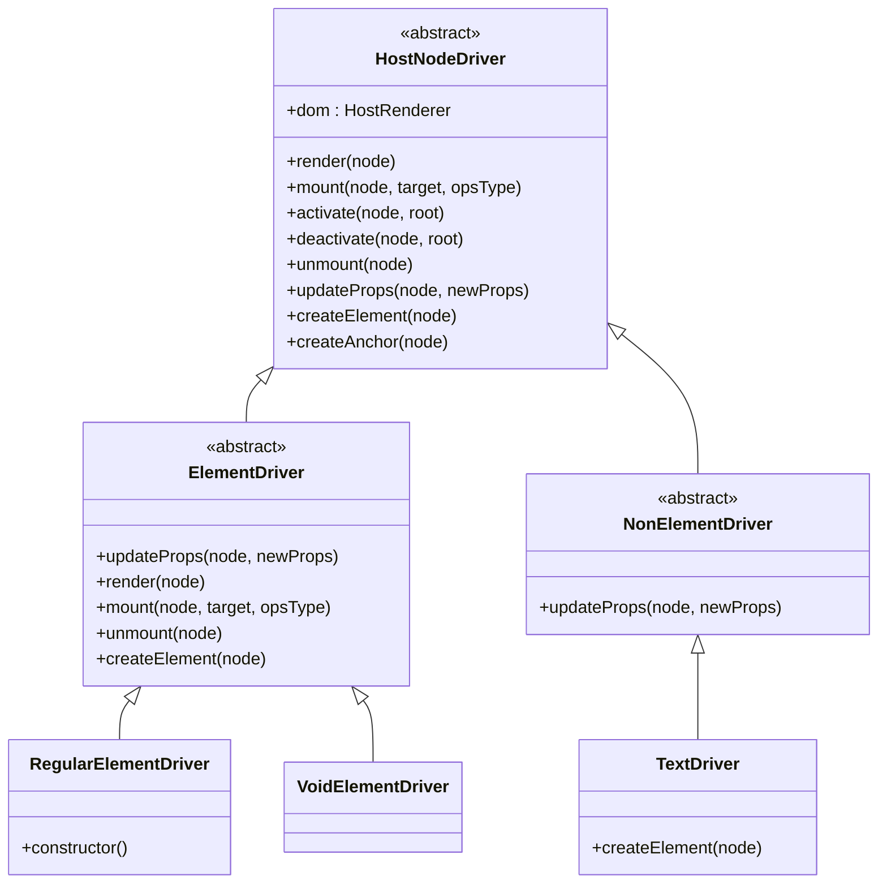
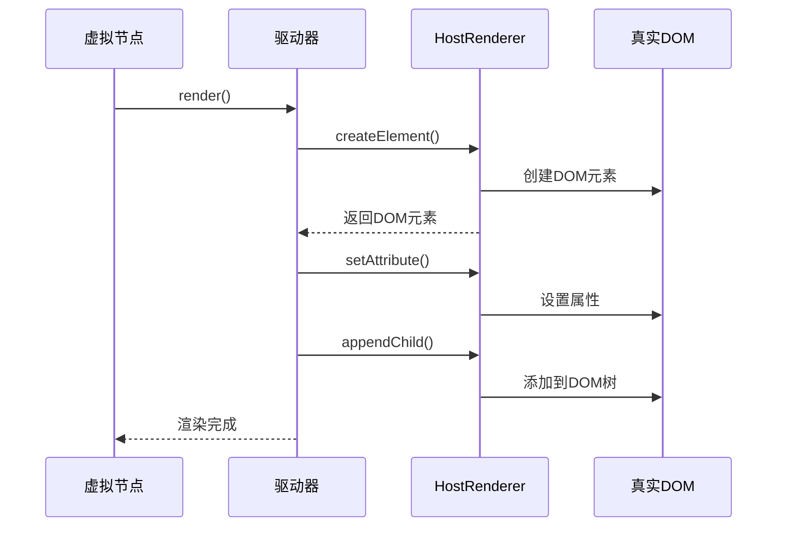
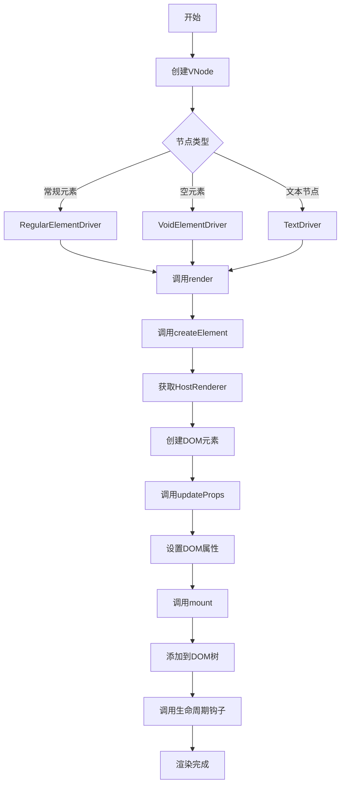

# 驱动抽象层

<cite>
**本文档引用文件**  
- [ElementDriver.ts](file://packages/runtime-drivers/src/drivers/ElementDriver.ts)
- [RegularElementDriver.ts](file://packages/runtime-drivers/src/drivers/RegularElementDriver.ts)
- [VoidElementDriver.ts](file://packages/runtime-drivers/src/drivers/VoidElementDriver.ts)
- [NonElementDriver.ts](file://packages/runtime-drivers/src/drivers/NonElementDriver.ts)
- [TextDriver.ts](file://packages/runtime-drivers/src/drivers/TextDriver.ts)
- [ContainerDriver.ts](file://packages/runtime-drivers/src/drivers/ContainerDriver.ts)
- [HostNodeDriver.ts](file://packages/runtime-drivers/src/drivers/HostNodeDriver.ts)
- [driver.ts](file://packages/runtime-core/src/types/driver.ts)
- [api.ts](file://packages/runtime-core/src/renderer/api.ts)
- [BaseNode.ts](file://packages/runtime-core/src/types/nodes/BaseNode.ts)
- [RegularElementVNode.ts](file://packages/runtime-core/src/types/nodes/RegularElementVNode.ts)
- [VoidElementVNode.ts](file://packages/runtime-core/src/types/nodes/VoidElementVNode.ts)
- [TextVNode.ts](file://packages/runtime-core/src/types/nodes/TextVNode.ts)
- [factory.ts](file://packages/runtime-drivers/src/factory.ts)
- [index.ts](file://packages/runtime-drivers/src/drivers/index.ts)
</cite>

## 目录
1. [引言](#引言)
2. [驱动抽象层架构概览](#驱动抽象层架构概览)
3. [ElementDriver 抽象基类设计](#elementdriver-抽象基类设计)
4. [RegularElementDriver 与 VoidElementDriver 对比分析](#regularelementdriver-与-voidelementdriver-对比分析)
5. [容器混入机制解析](#容器混入机制解析)
6. [TextDriver 与 NonElementDriver 实现原理](#textdriver-与-nonelementdriver-实现原理)
7. [驱动层与 HostRenderer 协作模式](#驱动层与-hostrrenderer-协作模式)
8. [从 VNode 到 DOM 的完整渲染流程](#从-vnode-到-dom-的完整渲染流程)
9. [平台扩展能力支持机制](#平台扩展能力支持机制)
10. [结论](#结论)

## 引言
Vitarx 框架的驱动抽象层是其核心渲染机制的关键组成部分，负责将虚拟节点（VNode）转换为真实 DOM 节点并管理其生命周期。该抽象层通过一系列精心设计的基类和继承关系，实现了对不同类型节点的统一处理与差异化行为。本文档系统阐述驱动抽象层的设计原理，重点解析 ElementDriver 抽象基类的职责、子类的继承关系、容器混入机制以及与 HostRenderer 的协作模式。

## 驱动抽象层架构概览
Vitarx 的驱动抽象层采用分层继承架构，以 HostNodeDriver 为最顶层基类，定义了所有宿主节点驱动器的公共接口。在此基础上，ElementDriver 专门处理元素节点，NonElementDriver 处理非元素节点（如文本节点），并进一步派生出针对特定节点类型的驱动器，如 RegularElementDriver、VoidElementDriver 和 TextDriver。



**图示来源**  
- [HostNodeDriver.ts](file://packages/runtime-drivers/src/drivers/HostNodeDriver.ts#L19-L124)
- [ElementDriver.ts](file://packages/runtime-drivers/src/drivers/ElementDriver.ts#L45-L105)
- [NonElementDriver.ts](file://packages/runtime-drivers/src/drivers/NonElementDriver.ts#L28-L36)
- [RegularElementDriver.ts](file://packages/runtime-drivers/src/drivers/RegularElementDriver.ts#L27-L32)
- [VoidElementDriver.ts](file://packages/runtime-drivers/src/drivers/VoidElementDriver.ts#L30-L30)
- [TextDriver.ts](file://packages/runtime-drivers/src/drivers/TextDriver.ts#L26-L30)

**本节来源**  
- [HostNodeDriver.ts](file://packages/runtime-drivers/src/drivers/HostNodeDriver.ts#L1-L124)
- [ElementDriver.ts](file://packages/runtime-drivers/src/drivers/ElementDriver.ts#L1-L106)
- [NonElementDriver.ts](file://packages/runtime-drivers/src/drivers/NonElementDriver.ts#L1-L37)

## ElementDriver 抽象基类设计
ElementDriver 是一个抽象基类，继承自 HostNodeDriver，专门用于管理 DOM 元素的生命周期和属性更新。它定义了元素节点的核心处理机制，包括属性更新、生命周期钩子调用和元素创建。

### 属性更新机制
ElementDriver 的 `updateProps` 方法负责处理元素属性的添加、修改和删除。该方法通过比较新旧属性对象，删除已移除的属性，并更新或添加新的属性。属性更新过程中会自动调用 HostRenderer 的 `setAttribute` 和 `removeAttribute` 方法进行底层 DOM 操作。

### 生命周期钩子调用
ElementDriver 在关键生命周期阶段调用指令的生命周期钩子：
- `render` 方法在元素创建后调用 `created` 钩子
- `mount` 方法在挂载前调用 `beforeMount` 钩子，挂载后调用 `mounted` 钩子
- `unmount` 方法在卸载前调用 `beforeUnmount` 钩子，卸载后调用 `unmounted` 钩子

### 元素创建机制
`createElement` 方法通过调用 HostRenderer 的 `createElement` 方法来创建实际的 DOM 元素。该方法被声明为受保护的抽象方法，由子类具体实现。

**本节来源**  
- [ElementDriver.ts](file://packages/runtime-drivers/src/drivers/ElementDriver.ts#L45-L105)

## RegularElementDriver 与 VoidElementDriver 对比分析
RegularElementDriver 和 VoidElementDriver 都继承自 ElementDriver，但针对不同类型的元素节点表现出差异化行为。

### RegularElementDriver
RegularElementDriver 用于处理常规 DOM 元素（如 div、span 等），这些元素可以包含子节点。其构造函数通过调用 `mixinContainerDriver(this)` 混入了容器驱动器的功能，从而获得了处理子节点的能力。该类支持完整的容器操作，包括渲染、挂载、激活、停用和卸载子节点。

### VoidElementDriver
VoidElementDriver 专门处理空元素（如 img、br、input 等自闭合标签），这些元素不能包含子节点。因此，该类没有混入容器功能，也不需要处理子节点相关的操作。其行为更简单，专注于元素自身的属性管理和生命周期。

```mermaid
classDiagram
class ElementDriver {
<<abstract>>
+updateProps(node, newProps)
+render(node)
+mount(node, target, opsType)
+unmount(node)
}
class RegularElementDriver {
+constructor()
+renderChildren(node)
+mountChildren(node)
+activateChildren(node)
+deactivateChildren(node)
+unmountChildren(node)
}
class VoidElementDriver {
}
ElementDriver <|-- RegularElementDriver
ElementDriver <|-- VoidElementDriver
note right of RegularElementDriver
通过mixinContainerDriver混入
容器功能，支持子节点操作
end note
note right of VoidElementDriver
不支持子节点，行为更简单
专注于元素自身管理
end note
```

**图示来源**  
- [RegularElementDriver.ts](file://packages/runtime-drivers/src/drivers/RegularElementDriver.ts#L27-L32)
- [VoidElementDriver.ts](file://packages/runtime-drivers/src/drivers/VoidElementDriver.ts#L30-L30)
- [ContainerDriver.ts](file://packages/runtime-drivers/src/drivers/ContainerDriver.ts#L15-L62)

**本节来源**  
- [RegularElementDriver.ts](file://packages/runtime-drivers/src/drivers/RegularElementDriver.ts#L1-L33)
- [VoidElementDriver.ts](file://packages/runtime-drivers/src/drivers/VoidElementDriver.ts#L1-L31)
- [ContainerDriver.ts](file://packages/runtime-drivers/src/drivers/ContainerDriver.ts#L1-L62)

## 容器混入机制解析
容器混入机制通过 `mixinContainerDriver` 函数实现，该函数向驱动器实例动态添加处理子节点的方法。这些方法包括 `renderChildren`、`mountChildren`、`activateChildren`、`deactivateChildren` 和 `unmountChildren`，每个方法都遍历容器节点的子节点列表并执行相应的操作。

这种混入模式避免了通过继承实现容器功能的复杂性，使得 RegularElementDriver 可以在保持 ElementDriver 继承关系的同时，获得处理子节点的能力。混入的函数通过闭包访问运行时核心的 `renderNode`、`mountNode` 等函数，实现了与框架核心逻辑的解耦。

**本节来源**  
- [ContainerDriver.ts](file://packages/runtime-drivers/src/drivers/ContainerDriver.ts#L15-L62)

## TextDriver 与 NonElementDriver 实现原理
TextDriver 用于处理文本节点，它通过继承 NonElementDriver 基类来实现文本节点的创建与管理。

### NonElementDriver 基类
NonElementDriver 是一个抽象基类，专门处理非元素类型的虚拟节点。它重写了 `updateProps` 方法，针对文本节点的 `value` 属性进行特殊处理。当文本内容发生变化时，直接调用 HostRenderer 的 `setText` 方法更新 DOM 文本内容。

### TextDriver 实现
TextDriver 继承 NonElementDriver 并实现了 `createElement` 方法，通过调用 HostRenderer 的 `createText` 方法创建文本节点。该类专门用于处理文本节点，不适用于其他类型的节点。

```mermaid
classDiagram
class HostNodeDriver {
<<abstract>>
+render(node)
+mount(node, target, opsType)
+unmount(node)
}
class NonElementDriver {
<<abstract>>
+updateProps(node, newProps)
}
class TextDriver {
+createElement(node)
}
HostNodeDriver <|-- NonElementDriver
NonElementDriver <|-- TextDriver
note right of NonElementDriver
处理非元素节点的属性更新
特别是文本节点的value属性
end note
note right of TextDriver
实现createElement方法
创建文本节点
end note
```

**图示来源**  
- [NonElementDriver.ts](file://packages/runtime-drivers/src/drivers/NonElementDriver.ts#L28-L36)
- [TextDriver.ts](file://packages/runtime-drivers/src/drivers/TextDriver.ts#L26-L30)

**本节来源**  
- [NonElementDriver.ts](file://packages/runtime-drivers/src/drivers/NonElementDriver.ts#L1-L37)
- [TextDriver.ts](file://packages/runtime-drivers/src/drivers/TextDriver.ts#L1-L31)

## 驱动层与 HostRenderer 协作模式
驱动抽象层与 HostRenderer 之间存在清晰的职责分离：驱动层负责虚拟节点的逻辑处理，而 HostRenderer 负责底层 DOM 操作。

### 职责分离
- **驱动层**：管理虚拟节点的生命周期、属性更新、子节点处理等逻辑
- **HostRenderer**：提供创建元素、设置属性、添加/删除节点等底层 DOM 操作的抽象接口

### 协作机制
驱动器通过 `getRenderer()` 函数获取 HostRenderer 实例，并通过其提供的方法执行 DOM 操作。这种依赖注入模式使得框架能够支持不同平台（如浏览器、SSR、原生应用）的渲染适配。



**图示来源**  
- [ElementDriver.ts](file://packages/runtime-drivers/src/drivers/ElementDriver.ts#L49-L105)
- [api.ts](file://packages/runtime-core/src/renderer/api.ts#L21-L25)
- [DomRenderer.ts](file://packages/runtime-dom/src/DomRenderer.ts)

**本节来源**  
- [ElementDriver.ts](file://packages/runtime-drivers/src/drivers/ElementDriver.ts#L1-L106)
- [api.ts](file://packages/runtime-core/src/renderer/api.ts#L1-L26)

## 从 VNode 到 DOM 的完整渲染流程
从虚拟节点到真实 DOM 的完整渲染流程涉及多个阶段的协作：

1. **驱动器注册**：通过 `setupDefaultDrivers()` 函数注册各种节点类型的默认驱动器
2. **节点渲染**：调用驱动器的 `render()` 方法创建 DOM 元素
3. **属性更新**：调用 `updateProps()` 方法同步节点属性
4. **节点挂载**：调用 `mount()` 方法将元素添加到 DOM 树
5. **生命周期钩子**：在关键阶段调用相应的生命周期钩子



**图示来源**  
- [factory.ts](file://packages/runtime-drivers/src/factory.ts#L23-L38)
- [ElementDriver.ts](file://packages/runtime-drivers/src/drivers/ElementDriver.ts#L49-L105)
- [TextDriver.ts](file://packages/runtime-drivers/src/drivers/TextDriver.ts#L27-L29)

**本节来源**  
- [factory.ts](file://packages/runtime-drivers/src/factory.ts#L1-L39)
- [ElementDriver.ts](file://packages/runtime-drivers/src/drivers/ElementDriver.ts#L1-L106)
- [TextDriver.ts](file://packages/runtime-drivers/src/drivers/TextDriver.ts#L1-L31)

## 平台扩展能力支持机制
驱动抽象层的设计充分考虑了平台扩展能力。通过 HostRenderer 抽象接口，框架可以轻松支持不同平台的渲染需求。

### 扩展机制
- **HostRenderer 接口**：定义了所有平台必须实现的 DOM 操作方法
- **驱动器解耦**：驱动器不直接操作 DOM，而是通过 HostRenderer 间接操作
- **运行时注册**：通过 `setRenderer()` 函数在运行时注册特定平台的渲染器

### 平台适配
框架已经实现了针对不同平台的渲染器，如 runtime-dom 中的 DomRenderer 用于浏览器环境，runtime-ssr 中的 SSRDriver 用于服务端渲染。这种设计使得 Vitarx 能够轻松扩展到原生应用、小程序等其他平台。

**本节来源**  
- [api.ts](file://packages/runtime-core/src/renderer/api.ts#L1-L26)
- [DomRenderer.ts](file://packages/runtime-dom/src/DomRenderer.ts)

## 结论
Vitarx 的驱动抽象层通过精心设计的继承体系和职责分离，实现了高效、灵活的虚拟 DOM 渲染机制。ElementDriver 作为核心抽象基类，统一处理元素节点的属性更新和生命周期管理。RegularElementDriver 和 VoidElementDriver 通过继承实现差异化行为，而容器混入机制则提供了灵活的子节点处理能力。TextDriver 通过 NonElementDriver 基类实现了文本节点的高效管理。驱动层与 HostRenderer 的清晰协作模式不仅保证了代码的可维护性，还为框架的平台扩展能力提供了坚实基础。整个抽象层设计体现了高内聚、低耦合的原则，是 Vitarx 框架高性能和可扩展性的关键所在。