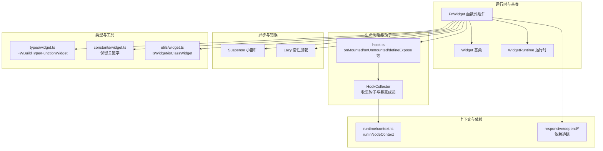
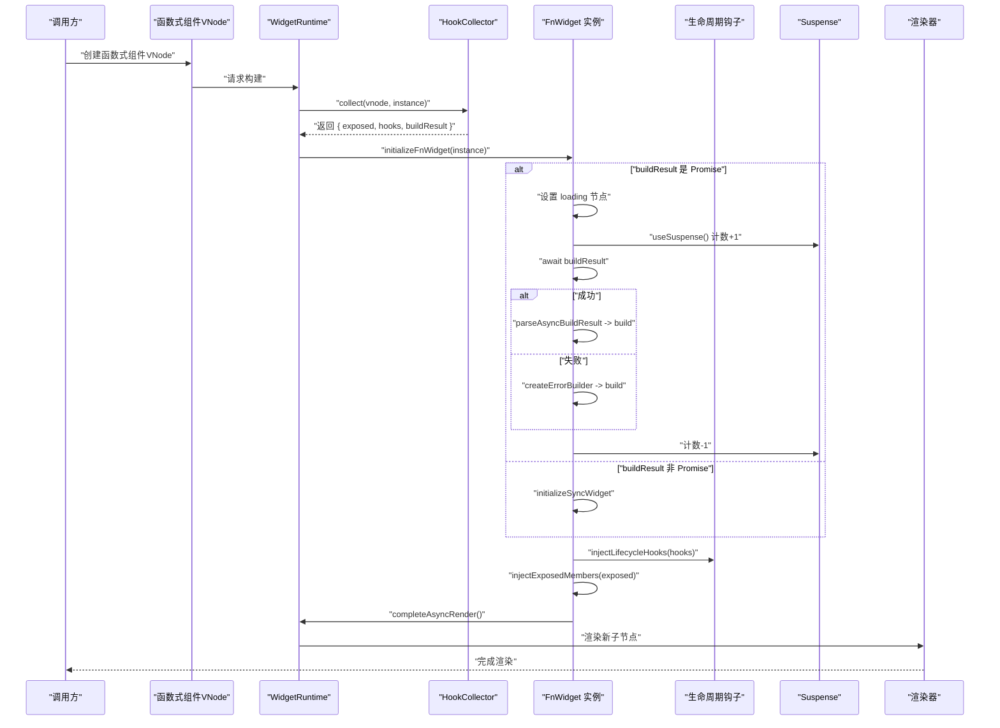
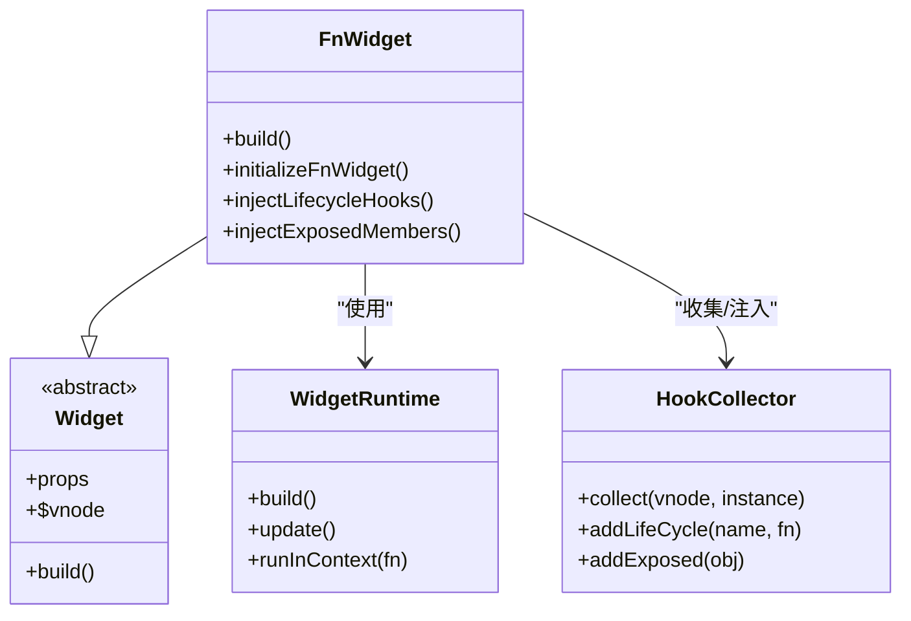
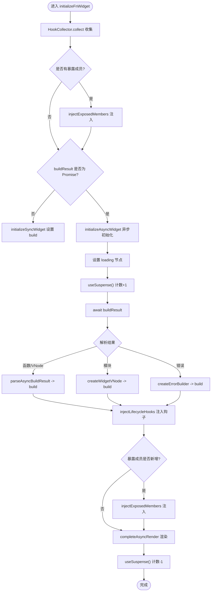
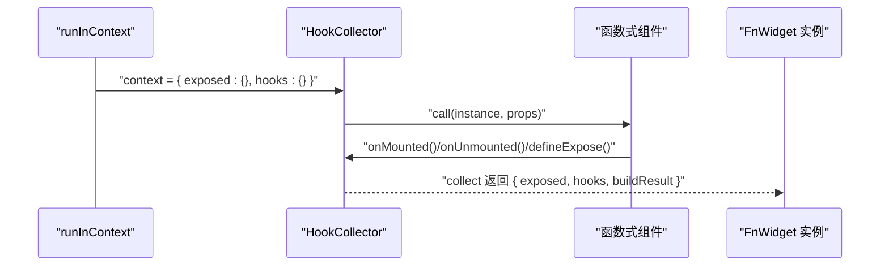
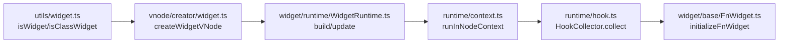

# 函数式组件

<cite>
**本文引用的文件列表**
- [packages/runtime-core/src/widget/base/FnWidget.ts](file://packages/runtime-core/src/widget/base/FnWidget.ts)
- [packages/runtime-core/src/runtime/hook.ts](file://packages/runtime-core/src/runtime/hook.ts)
- [packages/runtime-core/src/types/widget.ts](file://packages/runtime-core/src/types/widget.ts)
- [packages/runtime-core/src/constants/widget.ts](file://packages/runtime-core/src/constants/widget.ts)
- [packages/runtime-core/src/widget/base/Widget.ts](file://packages/runtime-core/src/widget/base/Widget.ts)
- [packages/runtime-core/src/widget/runtime/WidgetRuntime.ts](file://packages/runtime-core/src/widget/runtime/WidgetRuntime.ts)
- [packages/runtime-core/src/runtime/context.ts](file://packages/runtime-core/src/runtime/context.ts)
- [packages/runtime-core/src/vnode/creator/widget.ts](file://packages/runtime-core/src/vnode/creator/widget.ts)
- [packages/runtime-core/src/widget/widgets/Suspense.ts](file://packages/runtime-core/src/widget/widgets/Suspense.ts)
- [packages/runtime-core/src/widget/widgets/Lazy.ts](file://packages/runtime-core/src/widget/widgets/Lazy.ts)
- [packages/runtime-core/src/utils/widget.ts](file://packages/runtime-core/src/utils/widget.ts)
- [packages/responsive/src/depend/depend.ts](file://packages/responsive/src/depend/depend.ts)
- [packages/responsive/src/depend/helpers.ts](file://packages/responsive/src/depend/helpers.ts)
</cite>

## 目录
1. [引言](#引言)
2. [项目结构](#项目结构)
3. [核心组件](#核心组件)
4. [架构总览](#架构总览)
5. [详细组件分析](#详细组件分析)
6. [依赖分析](#依赖分析)
7. [性能考量](#性能考量)
8. [故障排查指南](#故障排查指南)
9. [结论](#结论)
10. [附录](#附录)

## 引言
本篇文档围绕 Vitarx 的函数式组件（FnWidget）实现机制展开，系统阐述 FnWidget 类的继承结构与核心职责，说明其如何通过 initializeFnWidget 完成异步初始化、生命周期钩子注入与暴露成员处理；深入讲解函数式组件对多种构建类型（函数、VNode、Promise）的支持机制，特别是异步组件的加载流程与 Suspense 集成；解释 HookCollector 如何在函数式组件执行上下文中收集 onMounted、onUnmounted 等钩子函数，并将其注入到组件实例中；提供示例路径展示如何定义函数式组件、使用 defineExpose 暴露内部状态、处理异步加载与错误边界；同时说明函数式组件在响应式系统中的依赖追踪方式，以及其与类组件在性能和使用场景上的差异。

## 项目结构
函数式组件能力主要分布在 runtime-core 包中，涉及以下关键模块：
- 基类与运行时：Widget、FnWidget、WidgetRuntime
- 生命周期与钩子：hook.ts（onMounted、onUnmounted、defineExpose 等）
- 上下文与依赖：runtime/context.ts、responsive/depend/*
- 虚拟节点与创建：vnode/creator/widget.ts
- 异步与错误：Suspense、Lazy
- 类型与保留关键字：types/widget.ts、constants/widget.ts
- 工具与判定：utils/widget.ts

图表来源
- [packages/runtime-core/src/widget/base/FnWidget.ts](file://packages/runtime-core/src/widget/base/FnWidget.ts#L28-L280)
- [packages/runtime-core/src/runtime/hook.ts](file://packages/runtime-core/src/runtime/hook.ts#L56-L111)
- [packages/runtime-core/src/widget/runtime/WidgetRuntime.ts](file://packages/runtime-core/src/widget/runtime/WidgetRuntime.ts#L91-L122)
- [packages/runtime-core/src/runtime/context.ts](file://packages/runtime-core/src/runtime/context.ts#L29-L51)
- [packages/runtime-core/src/vnode/creator/widget.ts](file://packages/runtime-core/src/vnode/creator/widget.ts#L121-L162)
- [packages/runtime-core/src/widget/widgets/Suspense.ts](file://packages/runtime-core/src/widget/widgets/Suspense.ts#L41-L87)
- [packages/runtime-core/src/widget/widgets/Lazy.ts](file://packages/runtime-core/src/widget/widgets/Lazy.ts#L80-L110)
- [packages/runtime-core/src/types/widget.ts](file://packages/runtime-core/src/types/widget.ts#L101-L115)
- [packages/runtime-core/src/constants/widget.ts](file://packages/runtime-core/src/constants/widget.ts#L1-L28)
- [packages/runtime-core/src/utils/widget.ts](file://packages/runtime-core/src/utils/widget.ts#L47-L92)
- [packages/responsive/src/depend/depend.ts](file://packages/responsive/src/depend/depend.ts#L100-L151)
- [packages/responsive/src/depend/helpers.ts](file://packages/responsive/src/depend/helpers.ts#L61-L101)

章节来源
- [packages/runtime-core/src/widget/base/FnWidget.ts](file://packages/runtime-core/src/widget/base/FnWidget.ts#L28-L280)
- [packages/runtime-core/src/runtime/hook.ts](file://packages/runtime-core/src/runtime/hook.ts#L56-L111)
- [packages/runtime-core/src/widget/runtime/WidgetRuntime.ts](file://packages/runtime-core/src/widget/runtime/WidgetRuntime.ts#L91-L122)
- [packages/runtime-core/src/runtime/context.ts](file://packages/runtime-core/src/runtime/context.ts#L29-L51)
- [packages/runtime-core/src/vnode/creator/widget.ts](file://packages/runtime-core/src/vnode/creator/widget.ts#L121-L162)
- [packages/runtime-core/src/widget/widgets/Suspense.ts](file://packages/runtime-core/src/widget/widgets/Suspense.ts#L41-L87)
- [packages/runtime-core/src/widget/widgets/Lazy.ts](file://packages/runtime-core/src/widget/widgets/Lazy.ts#L80-L110)
- [packages/runtime-core/src/types/widget.ts](file://packages/runtime-core/src/types/widget.ts#L101-L115)
- [packages/runtime-core/src/constants/widget.ts](file://packages/runtime-core/src/constants/widget.ts#L1-L28)
- [packages/runtime-core/src/utils/widget.ts](file://packages/runtime-core/src/utils/widget.ts#L47-L92)
- [packages/responsive/src/depend/depend.ts](file://packages/responsive/src/depend/depend.ts#L100-L151)
- [packages/responsive/src/depend/helpers.ts](file://packages/responsive/src/depend/helpers.ts#L61-L101)

## 核心组件
- FnWidget：继承自 Widget，承载函数式组件的构建、异步初始化、生命周期钩子注入与暴露成员注入等职责。
- HookCollector：在函数式组件执行上下文中收集生命周期钩子与暴露成员，并提供统一的收集结果。
- initializeFnWidget：函数式组件初始化入口，区分同步与异步构建，处理加载态、错误态与 Suspense 计数。
- 生命周期钩子：onMounted、onUnmounted、onBeforeMount、onBeforeUnmount、onRender、onError 等。
- defineExpose：在函数式组件中暴露内部状态或方法，注入到 FnWidget 实例中，同时过滤保留关键字。
- 异步与错误：支持 Promise 返回值、懒加载模块、错误边界与 Suspense 集成。
- 依赖追踪：通过响应式系统在构建阶段收集依赖，驱动更新。

章节来源
- [packages/runtime-core/src/widget/base/FnWidget.ts](file://packages/runtime-core/src/widget/base/FnWidget.ts#L28-L280)
- [packages/runtime-core/src/runtime/hook.ts](file://packages/runtime-core/src/runtime/hook.ts#L56-L111)
- [packages/runtime-core/src/runtime/hook.ts](file://packages/runtime-core/src/runtime/hook.ts#L248-L270)

## 架构总览
下面的序列图展示了函数式组件从创建到渲染的关键流程，包括 HookCollector 收集、initializeFnWidget 初始化、异步加载与 Suspense 集成、以及生命周期钩子注入。

图表来源
- [packages/runtime-core/src/widget/base/FnWidget.ts](file://packages/runtime-core/src/widget/base/FnWidget.ts#L258-L280)
- [packages/runtime-core/src/runtime/hook.ts](file://packages/runtime-core/src/runtime/hook.ts#L56-L111)
- [packages/runtime-core/src/widget/runtime/WidgetRuntime.ts](file://packages/runtime-core/src/widget/runtime/WidgetRuntime.ts#L91-L122)
- [packages/runtime-core/src/widget/widgets/Suspense.ts](file://packages/runtime-core/src/widget/widgets/Suspense.ts#L41-L87)

## 详细组件分析

### FnWidget 类与继承结构
- 继承关系：FnWidget 继承自 Widget，具备 props、vnode、生命周期钩子等通用能力。
- 核心职责：
  - 支持多种构建类型：函数、VNode、Promise（异步）、懒加载模块等。
  - 异步初始化：通过 initializeFnWidget 区分同步与异步构建，处理 loading、错误与 Suspense。
  - 生命周期钩子注入：将 HookCollector 收集到的钩子注入到实例上。
  - 暴露成员注入：将 defineExpose 暴露的成员注入到实例，过滤保留关键字。
  - 子节点替换：在激活/停用状态下完成异步渲染后的子节点替换与钩子触发。

图表来源
- [packages/runtime-core/src/widget/base/Widget.ts](file://packages/runtime-core/src/widget/base/Widget.ts#L16-L68)
- [packages/runtime-core/src/widget/base/FnWidget.ts](file://packages/runtime-core/src/widget/base/FnWidget.ts#L28-L48)
- [packages/runtime-core/src/widget/runtime/WidgetRuntime.ts](file://packages/runtime-core/src/widget/runtime/WidgetRuntime.ts#L91-L122)
- [packages/runtime-core/src/runtime/hook.ts](file://packages/runtime-core/src/runtime/hook.ts#L56-L111)

章节来源
- [packages/runtime-core/src/widget/base/Widget.ts](file://packages/runtime-core/src/widget/base/Widget.ts#L16-L68)
- [packages/runtime-core/src/widget/base/FnWidget.ts](file://packages/runtime-core/src/widget/base/FnWidget.ts#L28-L48)

### initializeFnWidget 初始化流程
- 收集阶段：HookCollector.collect 在组件执行上下文中收集钩子与暴露成员，并返回 buildResult。
- 同步构建：若 buildResult 非 Promise，直接注入钩子并设置 build。
- 异步构建：若 buildResult 为 Promise，设置 loading 节点，增加 Suspense 计数，await 结果后解析为构建器或错误构建器，最后注入钩子与暴露成员并完成异步渲染，减少 Suspense 计数。
- 关键点：错误处理通过 createErrorBuilder 抛出；激活/停用状态下的子节点替换通过 performChildReplacement 完成。

图表来源
- [packages/runtime-core/src/widget/base/FnWidget.ts](file://packages/runtime-core/src/widget/base/FnWidget.ts#L258-L280)
- [packages/runtime-core/src/runtime/hook.ts](file://packages/runtime-core/src/runtime/hook.ts#L56-L111)

章节来源
- [packages/runtime-core/src/widget/base/FnWidget.ts](file://packages/runtime-core/src/widget/base/FnWidget.ts#L258-L280)

### HookCollector 与上下文执行
- HookCollector.context：通过运行时上下文 Symbol 获取当前收集上下文。
- collect：在 runInContext 中执行组件函数，收集钩子与暴露成员，并返回 buildResult。
- addLifeCycle/addExposed：向当前上下文写入钩子与暴露对象。
- defineExpose：在上下文中写入暴露对象，内部过滤保留关键字并发出警告。

图表来源
- [packages/runtime-core/src/runtime/hook.ts](file://packages/runtime-core/src/runtime/hook.ts#L56-L111)
- [packages/runtime-core/src/runtime/context.ts](file://packages/runtime-core/src/runtime/context.ts#L29-L51)

章节来源
- [packages/runtime-core/src/runtime/hook.ts](file://packages/runtime-core/src/runtime/hook.ts#L56-L111)
- [packages/runtime-core/src/runtime/context.ts](file://packages/runtime-core/src/runtime/context.ts#L29-L51)

### 构建类型与异步支持
- 支持类型：Renderable、ChildBuilder、Promise<Renderable | LazyLoadModule | ChildBuilder>。
- 懒加载模块：当 buildResult 为 { default: Widget } 且 isWidget(default) 时，解析为 createWidgetVNode 构建器。
- 异步组件：通过 Suspense 计数控制并发异步节点数量；loading 节点可自定义或默认注释节点。
- 错误边界：捕获异步错误后，将 build 设置为抛错构建器，渲染时抛出错误。

章节来源
- [packages/runtime-core/src/types/widget.ts](file://packages/runtime-core/src/types/widget.ts#L101-L115)
- [packages/runtime-core/src/widget/base/FnWidget.ts](file://packages/runtime-core/src/widget/base/FnWidget.ts#L151-L173)
- [packages/runtime-core/src/widget/widgets/Suspense.ts](file://packages/runtime-core/src/widget/widgets/Suspense.ts#L41-L87)

### Suspense 集成与异步渲染
- Suspense 通过计数器跟踪异步子节点数量，首次完成时显示子节点，后续切换时自动替换。
- 异步函数组件在初始化时增加计数，渲染完成后减少计数，从而与 Suspense 协同工作。
- 激活/停用状态下的子节点替换：在激活时直接替换，停用时通过 onActivated 包装替换逻辑。

章节来源
- [packages/runtime-core/src/widget/base/FnWidget.ts](file://packages/runtime-core/src/widget/base/FnWidget.ts#L50-L128)
- [packages/runtime-core/src/widget/widgets/Suspense.ts](file://packages/runtime-core/src/widget/widgets/Suspense.ts#L41-L87)

### 响应式系统与依赖追踪
- 依赖收集：在构建阶段通过响应式系统收集依赖，当依赖变化时触发更新。
- 订阅与回调：Depend.subscribe 收集依赖并建立订阅，依赖变化时执行回调或重新执行 tracker。
- 自动更新开关：可通过运行时配置禁用自动更新，避免不必要的订阅。

章节来源
- [packages/responsive/src/depend/depend.ts](file://packages/responsive/src/depend/depend.ts#L100-L151)
- [packages/responsive/src/depend/helpers.ts](file://packages/responsive/src/depend/helpers.ts#L61-L101)

### 与类组件的差异与使用场景
- 性能差异：函数式组件通常更轻量，适合纯渲染逻辑；类组件更适合复杂状态与生命周期管理。
- 使用场景：函数式组件适合无副作用、纯展示或少量状态的组件；类组件适合需要完整生命周期、复杂状态管理与指令集成的组件。
- 保留关键字：defineExpose 暴露的键名不得与 Widget 内部保留关键字冲突，框架会过滤并给出警告。

章节来源
- [packages/runtime-core/src/constants/widget.ts](file://packages/runtime-core/src/constants/widget.ts#L1-L28)
- [packages/runtime-core/src/runtime/hook.ts](file://packages/runtime-core/src/runtime/hook.ts#L248-L270)

## 依赖分析
- 组件类型与判定：isWidget、isClassWidget、isStatelessWidget 用于区分组件类型，影响 VNode 创建与渲染策略。
- VNode 创建：createWidgetVNode 根据组件类型创建 StatelessWidgetVNode 或 StatefulWidgetVNode，并处理 defaultProps。
- 运行时上下文：runInNodeContext 确保函数式组件在正确的节点上下文中执行，保证 HookCollector 能正确收集钩子与暴露成员。

图表来源
- [packages/runtime-core/src/utils/widget.ts](file://packages/runtime-core/src/utils/widget.ts#L47-L92)
- [packages/runtime-core/src/vnode/creator/widget.ts](file://packages/runtime-core/src/vnode/creator/widget.ts#L121-L162)
- [packages/runtime-core/src/widget/runtime/WidgetRuntime.ts](file://packages/runtime-core/src/widget/runtime/WidgetRuntime.ts#L91-L122)
- [packages/runtime-core/src/runtime/context.ts](file://packages/runtime-core/src/runtime/context.ts#L29-L51)
- [packages/runtime-core/src/runtime/hook.ts](file://packages/runtime-core/src/runtime/hook.ts#L56-L111)
- [packages/runtime-core/src/widget/base/FnWidget.ts](file://packages/runtime-core/src/widget/base/FnWidget.ts#L258-L280)

章节来源
- [packages/runtime-core/src/utils/widget.ts](file://packages/runtime-core/src/utils/widget.ts#L47-L92)
- [packages/runtime-core/src/vnode/creator/widget.ts](file://packages/runtime-core/src/vnode/creator/widget.ts#L121-L162)
- [packages/runtime-core/src/widget/runtime/WidgetRuntime.ts](file://packages/runtime-core/src/widget/runtime/WidgetRuntime.ts#L91-L122)
- [packages/runtime-core/src/runtime/context.ts](file://packages/runtime-core/src/runtime/context.ts#L29-L51)
- [packages/runtime-core/src/runtime/hook.ts](file://packages/runtime-core/src/runtime/hook.ts#L56-L111)
- [packages/runtime-core/src/widget/base/FnWidget.ts](file://packages/runtime-core/src/widget/base/FnWidget.ts#L258-L280)

## 性能考量
- 依赖追踪：在构建阶段收集依赖，避免不必要的订阅；在 enableAutoUpdate 关闭时可减少订阅开销。
- 异步渲染：通过 Suspense 计数与 loading 节点，避免阻塞主线程；错误快速失败，减少无效渲染。
- 构建类型优化：优先返回 VNode 或函数构建器，减少 Promise 分支带来的额外调度成本。
- 暴露成员过滤：defineExpose 内部过滤保留关键字，避免覆盖实例方法导致的性能与稳定性问题。

[本节为通用性能讨论，不直接分析具体文件]

## 故障排查指南
- 生命周期钩子类型错误：onMounted 等钩子注册时必须传入函数，否则抛出类型错误。
- defineExpose 保留关键字：暴露键名若与 Widget 内部保留关键字冲突，框架会发出警告并移除该键。
- 异步组件错误：异步构建失败时会抛出错误，可在 onError 钩子中处理并返回备用节点。
- Suspense 计数异常：确保每个异步子节点正确完成渲染后计数减一，避免阻塞父级 Suspense。

章节来源
- [packages/runtime-core/src/runtime/hook.ts](file://packages/runtime-core/src/runtime/hook.ts#L112-L135)
- [packages/runtime-core/src/runtime/hook.ts](file://packages/runtime-core/src/runtime/hook.ts#L248-L270)
- [packages/runtime-core/src/widget/base/FnWidget.ts](file://packages/runtime-core/src/widget/base/FnWidget.ts#L203-L211)
- [packages/runtime-core/src/widget/widgets/Suspense.ts](file://packages/runtime-core/src/widget/widgets/Suspense.ts#L41-L87)

## 结论
FnWidget 通过 HookCollector 在函数式组件执行上下文中收集生命周期钩子与暴露成员，并在 initializeFnWidget 中完成同步/异步初始化、加载态与错误态处理、Suspense 集成与子节点替换。其对多种构建类型的全面支持使得函数式组件既能简洁表达纯渲染逻辑，也能优雅处理异步与错误场景。配合响应式系统的依赖追踪，函数式组件在性能与可维护性之间取得良好平衡。与类组件相比，函数式组件更适合轻量、无副作用的场景，而类组件则更适合复杂状态与生命周期管理。

[本节为总结性内容，不直接分析具体文件]

## 附录
- 示例路径参考（不展示具体代码内容）：
  - 定义函数式组件与生命周期钩子：[packages/runtime-core/src/runtime/hook.ts](file://packages/runtime-core/src/runtime/hook.ts#L152-L184)
  - 暴露内部状态与方法：[packages/runtime-core/src/runtime/hook.ts](file://packages/runtime-core/src/runtime/hook.ts#L248-L270)
  - 异步组件与 Suspense 集成：[packages/runtime-core/src/widget/base/FnWidget.ts](file://packages/runtime-core/src/widget/base/FnWidget.ts#L212-L256), [packages/runtime-core/src/widget/widgets/Suspense.ts](file://packages/runtime-core/src/widget/widgets/Suspense.ts#L41-L87)
  - 依赖追踪与订阅：[packages/responsive/src/depend/depend.ts](file://packages/responsive/src/depend/depend.ts#L100-L151), [packages/responsive/src/depend/helpers.ts](file://packages/responsive/src/depend/helpers.ts#L61-L101)
  - 组件类型与判定：[packages/runtime-core/src/utils/widget.ts](file://packages/runtime-core/src/utils/widget.ts#L47-L92)
  - VNode 创建与运行时上下文：[packages/runtime-core/src/vnode/creator/widget.ts](file://packages/runtime-core/src/vnode/creator/widget.ts#L121-L162), [packages/runtime-core/src/runtime/context.ts](file://packages/runtime-core/src/runtime/context.ts#L29-L51)