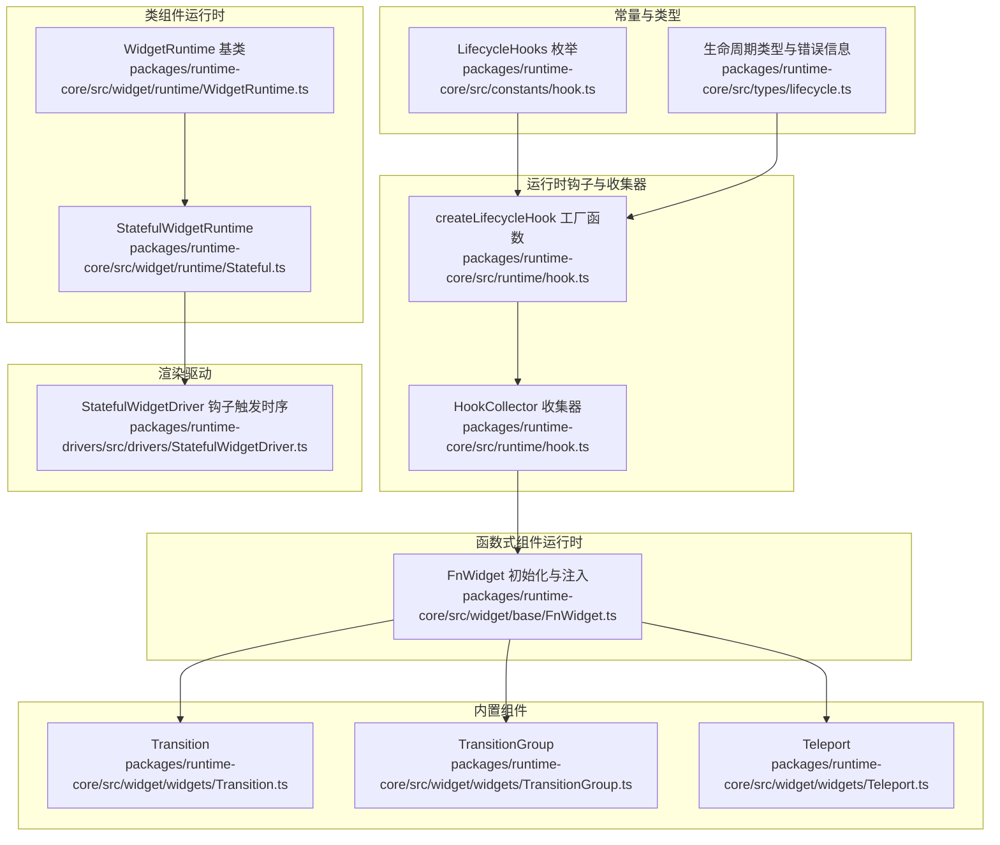
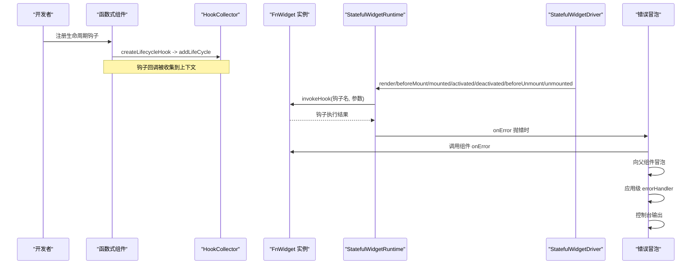
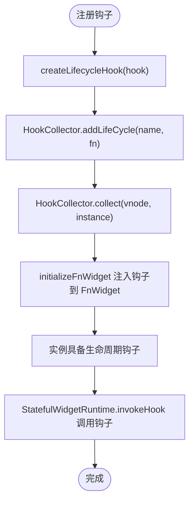
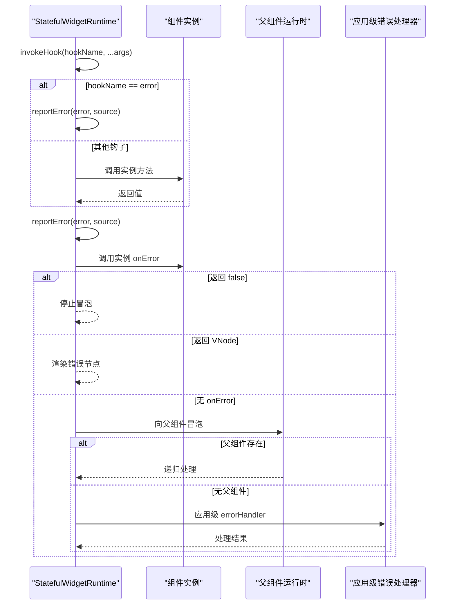
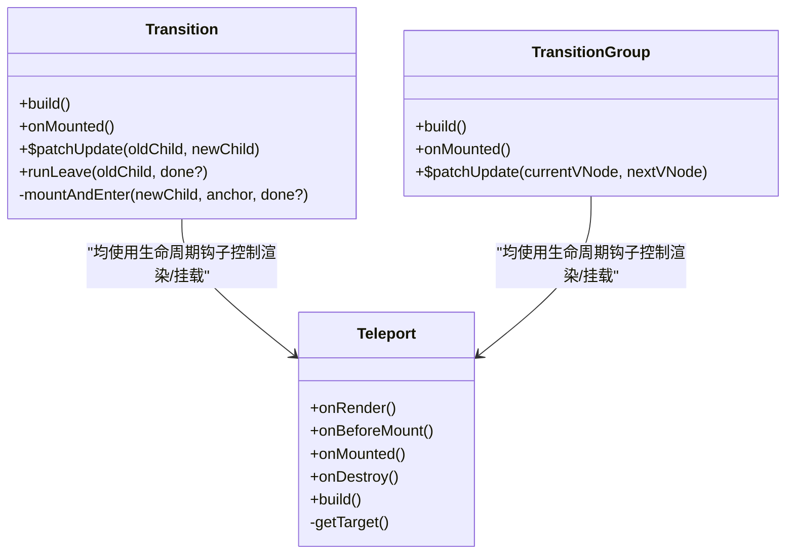
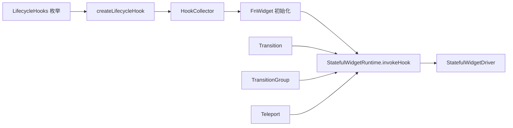

# 生命周期钩子

<cite>
**本文引用的文件**
- [packages/runtime-core/src/constants/hook.ts](file://packages/runtime-core/src/constants/hook.ts)
- [packages/runtime-core/src/types/lifecycle.ts](file://packages/runtime-core/src/types/lifecycle.ts)
- [packages/runtime-core/src/runtime/hook.ts](file://packages/runtime-core/src/runtime/hook.ts)
- [packages/runtime-core/src/widget/runtime/Stateful.ts](file://packages/runtime-core/src/widget/runtime/Stateful.ts)
- [packages/runtime-core/src/widget/runtime/WidgetRuntime.ts](file://packages/runtime-core/src/widget/runtime/WidgetRuntime.ts)
- [packages/runtime-core/src/widget/base/FnWidget.ts](file://packages/runtime-core/src/widget/base/FnWidget.ts)
- [packages/runtime-core/src/widget/widgets/Transition.ts](file://packages/runtime-core/src/widget/widgets/Transition.ts)
- [packages/runtime-core/src/widget/widgets/TransitionGroup.ts](file://packages/runtime-core/src/widget/widgets/TransitionGroup.ts)
- [packages/runtime-core/src/widget/widgets/Teleport.ts](file://packages/runtime-core/src/widget/widgets/Teleport.ts)
- [packages/runtime-drivers/src/drivers/StatefulWidgetDriver.ts](file://packages/runtime-drivers/src/drivers/StatefulWidgetDriver.ts)
- [packages/runtime-core/__tests__/runtime/hook.test.ts](file://packages/runtime-core/__tests__/runtime/hook.test.ts)
- [packages/runtime-core/__tests__/widget/runtime/Stateful.test.ts](file://packages/runtime-core/__tests__/widget/runtime/Stateful.test.ts)
</cite>

## 目录
1. [简介](#简介)
2. [项目结构](#项目结构)
3. [核心组件](#核心组件)
4. [架构总览](#架构总览)
5. [详细组件分析](#详细组件分析)
6. [依赖关系分析](#依赖关系分析)
7. [性能考量](#性能考量)
8. [故障排查指南](#故障排查指南)
9. [结论](#结论)
10. [附录](#附录)

## 简介
本文件围绕 Vitarx 生命周期钩子系统展开，系统阐述 onMounted、onUnmounted、onUpdated、onActivated、onDeactivated 等核心钩子的语义、执行时机与典型使用场景；深入分析 createLifecycleHook 工厂函数如何生成标准化的钩子注册函数，并结合 HookCollector 机制说明函数式组件中钩子的收集与注入流程；解释类组件中 onMounted 等方法的重写机制及其在 StatefulWidgetRuntime.invokeHook 中的调用过程；通过 Transition、TransitionGroup 和 Teleport 组件的 onMounted 实现，展示生命周期钩子在实际组件中的应用模式；最后提供代码示例路径对比函数式与类组件中使用生命周期钩子的不同方式，并说明 onError 钩子的错误冒泡机制与 onRender 钩子在 SSR 场景下的特殊行为。

## 项目结构
生命周期钩子相关代码主要分布在以下模块：
- 常量与类型：生命周期钩子枚举与类型定义
- 运行时钩子与收集器：工厂函数、HookCollector 收集与注入
- 类组件运行时：钩子调用、错误冒泡与更新流程
- 函数式组件运行时：钩子注入、异步渲染与关键钩子注册
- 内置组件：Transition、TransitionGroup、Teleport 的钩子使用
- 驱动层：渲染驱动中对钩子的触发时序
- 测试：钩子注册、类型校验、错误冒泡与更新流程验证

图表来源
- [packages/runtime-core/src/constants/hook.ts](file://packages/runtime-core/src/constants/hook.ts#L1-L16)
- [packages/runtime-core/src/types/lifecycle.ts](file://packages/runtime-core/src/types/lifecycle.ts#L1-L139)
- [packages/runtime-core/src/runtime/hook.ts](file://packages/runtime-core/src/runtime/hook.ts#L1-L271)
- [packages/runtime-core/src/widget/runtime/Stateful.ts](file://packages/runtime-core/src/widget/runtime/Stateful.ts#L1-L368)
- [packages/runtime-core/src/widget/runtime/WidgetRuntime.ts](file://packages/runtime-core/src/widget/runtime/WidgetRuntime.ts#L1-L123)
- [packages/runtime-core/src/widget/base/FnWidget.ts](file://packages/runtime-core/src/widget/base/FnWidget.ts#L1-L281)
- [packages/runtime-core/src/widget/widgets/Transition.ts](file://packages/runtime-core/src/widget/widgets/Transition.ts#L1-L246)
- [packages/runtime-core/src/widget/widgets/TransitionGroup.ts](file://packages/runtime-core/src/widget/widgets/TransitionGroup.ts#L1-L284)
- [packages/runtime-core/src/widget/widgets/Teleport.ts](file://packages/runtime-core/src/widget/widgets/Teleport.ts#L1-L165)
- [packages/runtime-drivers/src/drivers/StatefulWidgetDriver.ts](file://packages/runtime-drivers/src/drivers/StatefulWidgetDriver.ts#L48-L120)

章节来源
- [packages/runtime-core/src/constants/hook.ts](file://packages/runtime-core/src/constants/hook.ts#L1-L16)
- [packages/runtime-core/src/runtime/hook.ts](file://packages/runtime-core/src/runtime/hook.ts#L1-L271)

## 核心组件
- 生命周期钩子枚举：定义所有可用钩子名称，如 mounted、unmounted、updated、activated、deactivated、beforeMount、beforeUnmount、beforeUpdate、render、error、create、destroy 等。
- 生命周期类型与错误信息：定义钩子名、方法名、参数与返回值类型，以及错误来源与错误处理器签名。
- 工厂函数 createLifecycleHook：将钩子注册标准化为“收集器注入”，并在注册时进行类型校验。
- HookCollector：在函数式组件渲染上下文中收集钩子与暴露成员，并在初始化后注入到 FnWidget 实例。
- StatefulWidgetRuntime：统一调用生命周期钩子，处理错误冒泡与更新流程。
- 函数式组件运行时：在 HookCollector.collect 后，将钩子注入到 FnWidget 实例，关键钩子（如 onError、onRender）被直接绑定到实例方法。
- 渲染驱动：在渲染、挂载、激活、停用、卸载等阶段触发相应钩子，形成稳定的生命周期时序。
- 内置组件：Transition、TransitionGroup、Teleport 在各自生命周期中使用钩子实现过渡与传送逻辑。

章节来源
- [packages/runtime-core/src/constants/hook.ts](file://packages/runtime-core/src/constants/hook.ts#L1-L16)
- [packages/runtime-core/src/types/lifecycle.ts](file://packages/runtime-core/src/types/lifecycle.ts#L1-L139)
- [packages/runtime-core/src/runtime/hook.ts](file://packages/runtime-core/src/runtime/hook.ts#L1-L271)
- [packages/runtime-core/src/widget/runtime/Stateful.ts](file://packages/runtime-core/src/widget/runtime/Stateful.ts#L1-L368)
- [packages/runtime-core/src/widget/base/FnWidget.ts](file://packages/runtime-core/src/widget/base/FnWidget.ts#L1-L281)
- [packages/runtime-drivers/src/drivers/StatefulWidgetDriver.ts](file://packages/runtime-drivers/src/drivers/StatefulWidgetDriver.ts#L48-L120)

## 架构总览
生命周期钩子系统由“注册—收集—注入—调用—冒泡”五步构成：
- 注册：通过 createLifecycleHook 生成具体钩子注册函数，内部将回调加入 HookCollector 上下文。
- 收集：在函数式组件渲染时，HookCollector.collect 在上下文中运行组件构建，收集钩子与暴露成员。
- 注入：初始化完成后，将钩子注入到 FnWidget 实例，关键钩子直接覆盖实例方法。
- 调用：渲染驱动与运行时在各阶段调用对应钩子；类组件通过 StatefulWidgetRuntime.invokeHook 统一调度。
- 冒泡：错误钩子 onError 在组件内处理失败后，按“组件 onError → 父组件 onError → 应用级 errorHandler → 控制台”的顺序冒泡。

图表来源
- [packages/runtime-core/src/runtime/hook.ts](file://packages/runtime-core/src/runtime/hook.ts#L120-L211)
- [packages/runtime-core/src/widget/base/FnWidget.ts](file://packages/runtime-core/src/widget/base/FnWidget.ts#L130-L201)
- [packages/runtime-core/src/widget/runtime/Stateful.ts](file://packages/runtime-core/src/widget/runtime/Stateful.ts#L104-L194)
- [packages/runtime-drivers/src/drivers/StatefulWidgetDriver.ts](file://packages/runtime-drivers/src/drivers/StatefulWidgetDriver.ts#L56-L119)

## 详细组件分析

### 生命周期钩子语义与执行时机
- onCreate：在函数式组件实例创建时立即执行，用于早期初始化。
- onBeforeMount：在类组件挂载前、函数式组件首次渲染前触发，可返回挂载目标容器。
- onMounted：类组件挂载完成时触发；函数式组件在首次渲染后触发。
- onBeforeUpdate：组件更新前触发。
- onUpdated：组件更新完成后触发。
- onBeforeUnmount：组件卸载前触发。
- onUnmounted：组件卸载完成后触发。
- onActivated：组件被激活时触发（通常由 KeepAlive 触发）。
- onDeactivated：组件被停用时触发（通常由 KeepAlive 触发）。
- onRender：客户端渲染时等同于 onBeforeMount；SSR 时若返回 Promise，会在 Promise 完成后替换占位节点，不阻塞渲染。
- onError：渲染/构建/更新/副作用等阶段捕获错误，支持返回 VNode 渲染错误 UI 或返回 false 阻止冒泡。
- onDestroy：运行时实例销毁时触发。

章节来源
- [packages/runtime-core/src/runtime/hook.ts](file://packages/runtime-core/src/runtime/hook.ts#L136-L235)
- [packages/runtime-core/src/types/lifecycle.ts](file://packages/runtime-core/src/types/lifecycle.ts#L52-L139)

### createLifecycleHook 工厂函数与 HookCollector 机制
- 工厂函数 createLifecycleHook 接收一个 LifecycleHooks 枚举值，返回注册函数；注册时会对回调进行类型校验，非函数将抛出错误。
- HookCollector 提供上下文隔离，通过 runInContext 将收集过程限定在函数式组件渲染上下文中；collect 方法在上下文中运行组件构建，返回构建结果与收集到的 hooks/exposed。
- 注入阶段：initializeFnWidget 在收集完成后，将 hooks 注入到 FnWidget 实例；关键钩子（onError/onRender）直接覆盖实例方法，确保在运行时可被统一调用。

图表来源
- [packages/runtime-core/src/runtime/hook.ts](file://packages/runtime-core/src/runtime/hook.ts#L120-L134)
- [packages/runtime-core/src/runtime/hook.ts](file://packages/runtime-core/src/runtime/hook.ts#L100-L110)
- [packages/runtime-core/src/widget/base/FnWidget.ts](file://packages/runtime-core/src/widget/base/FnWidget.ts#L130-L201)

章节来源
- [packages/runtime-core/src/runtime/hook.ts](file://packages/runtime-core/src/runtime/hook.ts#L120-L211)
- [packages/runtime-core/src/widget/base/FnWidget.ts](file://packages/runtime-core/src/widget/base/FnWidget.ts#L130-L201)

### 类组件中钩子的重写机制与调用过程
- StatefulWidgetRuntime.invokeHook 统一调度生命周期钩子：对 onError 进行特殊处理，其余钩子通过实例方法名调用；若未启用生命周期或禁用钩子，仅 render 钩子仍可执行。
- 错误冒泡：reportError 按“组件 onError → 父组件 onError → 应用级 errorHandler → 控制台”的顺序处理错误；onError 钩子自身抛错时会防止无限循环。
- 更新流程：update 先触发 beforeUpdate，再调度 finishUpdate；finishUpdate 中构建新子节点并调用 updated，期间任何错误都会走 reportError。

图表来源
- [packages/runtime-core/src/widget/runtime/Stateful.ts](file://packages/runtime-core/src/widget/runtime/Stateful.ts#L104-L194)

章节来源
- [packages/runtime-core/src/widget/runtime/Stateful.ts](file://packages/runtime-core/src/widget/runtime/Stateful.ts#L104-L194)
- [packages/runtime-core/__tests__/widget/runtime/Stateful.test.ts](file://packages/runtime-core/__tests__/widget/runtime/Stateful.test.ts#L369-L510)

### 函数式组件与类组件使用钩子的差异
- 函数式组件：通过 HookCollector 收集钩子，初始化后注入到 FnWidget 实例；onMounted 在首次渲染后触发；onRender 可返回 Promise 以延迟替换占位节点（SSR）。
- 类组件：直接在实例上重写钩子方法；渲染驱动在挂载/激活/卸载等阶段调用对应钩子；onMounted 在挂载完成后触发。

章节来源
- [packages/runtime-core/src/widget/base/FnWidget.ts](file://packages/runtime-core/src/widget/base/FnWidget.ts#L130-L201)
- [packages/runtime-drivers/src/drivers/StatefulWidgetDriver.ts](file://packages/runtime-drivers/src/drivers/StatefulWidgetDriver.ts#L56-L119)

### Transition、TransitionGroup、Teleport 中的钩子应用
- Transition.onMounted：若 props.appear 为真，首次挂载时触发出现动画。
- TransitionGroup.onMounted：若 props.appear 为真，首次挂载时为所有子元素触发进入动画。
- Teleport.onBeforeMount/onMounted：在 beforeMount 或 defer 为真时挂载到目标容器；onRender 在 disabled 为真时渲染到当前位置；onDestroy 卸载时从目标容器移除。

图表来源
- [packages/runtime-core/src/widget/widgets/Transition.ts](file://packages/runtime-core/src/widget/widgets/Transition.ts#L150-L246)
- [packages/runtime-core/src/widget/widgets/TransitionGroup.ts](file://packages/runtime-core/src/widget/widgets/TransitionGroup.ts#L115-L284)
- [packages/runtime-core/src/widget/widgets/Teleport.ts](file://packages/runtime-core/src/widget/widgets/Teleport.ts#L83-L165)

章节来源
- [packages/runtime-core/src/widget/widgets/Transition.ts](file://packages/runtime-core/src/widget/widgets/Transition.ts#L150-L246)
- [packages/runtime-core/src/widget/widgets/TransitionGroup.ts](file://packages/runtime-core/src/widget/widgets/TransitionGroup.ts#L115-L284)
- [packages/runtime-core/src/widget/widgets/Teleport.ts](file://packages/runtime-core/src/widget/widgets/Teleport.ts#L83-L165)

### onRender 钩子在 SSR 场景下的特殊行为
- 客户端：onRender 与 onBeforeMount 等效；返回 Promise 不阻塞渲染，依赖响应式更新机制自动触发视图更新。
- 服务端：onRender 先渲染占位节点，若返回 Promise，则在 Promise 完成后用真实节点替换占位节点，避免阻塞 SSR 渲染。

章节来源
- [packages/runtime-core/src/runtime/hook.ts](file://packages/runtime-core/src/runtime/hook.ts#L213-L230)

### onError 钩子的错误冒泡机制
- 组件 onError：优先处理错误，可返回 VNode 渲染错误 UI 或返回 false 阻止冒泡。
- 父组件冒泡：若无组件 onError 或未阻止冒泡，向上查找最近的有状态父组件，递归处理。
- 应用级 errorHandler：若无父组件或未处理，调用应用级 errorHandler。
- 控制台输出：最终仍未处理则输出到控制台。

章节来源
- [packages/runtime-core/src/widget/runtime/Stateful.ts](file://packages/runtime-core/src/widget/runtime/Stateful.ts#L104-L194)
- [packages/runtime-core/__tests__/widget/runtime/Stateful.test.ts](file://packages/runtime-core/__tests__/widget/runtime/Stateful.test.ts#L369-L510)

## 依赖关系分析
- 常量与类型：LifecycleHooks 与生命周期类型定义为运行时钩子与运行时调用提供契约。
- HookCollector 与工厂函数：createLifecycleHook 依赖 HookCollector 将钩子注入上下文；FnWidget 初始化时从上下文注入钩子。
- 运行时调用：StatefulWidgetRuntime.invokeHook 统一调度钩子；StatefulWidgetDriver 在渲染驱动中触发钩子时序。
- 内置组件：Transition/TransitionGroup/Teleport 通过重写钩子方法实现过渡与传送逻辑。

图表来源
- [packages/runtime-core/src/constants/hook.ts](file://packages/runtime-core/src/constants/hook.ts#L1-L16)
- [packages/runtime-core/src/runtime/hook.ts](file://packages/runtime-core/src/runtime/hook.ts#L120-L211)
- [packages/runtime-core/src/widget/base/FnWidget.ts](file://packages/runtime-core/src/widget/base/FnWidget.ts#L130-L201)
- [packages/runtime-core/src/widget/runtime/Stateful.ts](file://packages/runtime-core/src/widget/runtime/Stateful.ts#L163-L194)
- [packages/runtime-drivers/src/drivers/StatefulWidgetDriver.ts](file://packages/runtime-drivers/src/drivers/StatefulWidgetDriver.ts#L56-L119)
- [packages/runtime-core/src/widget/widgets/Transition.ts](file://packages/runtime-core/src/widget/widgets/Transition.ts#L150-L246)
- [packages/runtime-core/src/widget/widgets/TransitionGroup.ts](file://packages/runtime-core/src/widget/widgets/TransitionGroup.ts#L115-L284)
- [packages/runtime-core/src/widget/widgets/Teleport.ts](file://packages/runtime-core/src/widget/widgets/Teleport.ts#L83-L165)

章节来源
- [packages/runtime-core/src/constants/hook.ts](file://packages/runtime-core/src/constants/hook.ts#L1-L16)
- [packages/runtime-core/src/runtime/hook.ts](file://packages/runtime-core/src/runtime/hook.ts#L120-L211)
- [packages/runtime-core/src/widget/runtime/Stateful.ts](file://packages/runtime-core/src/widget/runtime/Stateful.ts#L163-L194)
- [packages/runtime-drivers/src/drivers/StatefulWidgetDriver.ts](file://packages/runtime-drivers/src/drivers/StatefulWidgetDriver.ts#L56-L119)

## 性能考量
- 生命周期钩子调用：StatefulWidgetRuntime.update 采用调度队列（queueJob）批量更新，避免重复渲染；beforeUpdate 与 updated 成对出现，便于统计与调试。
- SSR 优化：onRender 返回 Promise 不阻塞渲染，通过占位节点与替换策略提升首屏性能。
- 函数式组件：HookCollector.collect 在渲染上下文中运行，避免跨组件污染；异步组件初始化时先渲染 loading 节点，随后注入钩子与暴露成员，减少不必要的重排。

[本节为通用指导，不直接分析具体文件]

## 故障排查指南
- 钩子注册类型错误：createLifecycleHook 会在注册非函数时抛出错误，检查回调类型。
- 钩子未触发：确认组件是否启用生命周期（enableLifecycle），以及渲染驱动是否正确触发对应钩子。
- 错误冒泡异常：若 onError 钩子抛错，系统会防止无限循环并输出日志；检查 onError 返回值与父组件冒泡链路。
- SSR 占位节点未替换：确认 onRender 返回 Promise 且在完成后替换占位节点；检查渲染上下文与替换逻辑。

章节来源
- [packages/runtime-core/src/runtime/hook.ts](file://packages/runtime-core/src/runtime/hook.ts#L120-L134)
- [packages/runtime-core/src/widget/runtime/Stateful.ts](file://packages/runtime-core/src/widget/runtime/Stateful.ts#L104-L194)
- [packages/runtime-core/__tests__/runtime/hook.test.ts](file://packages/runtime-core/__tests__/runtime/hook.test.ts#L90-L111)
- [packages/runtime-core/__tests__/widget/runtime/Stateful.test.ts](file://packages/runtime-core/__tests__/widget/runtime/Stateful.test.ts#L369-L510)

## 结论
Vitarx 生命周期钩子系统通过 createLifecycleHook 工厂函数与 HookCollector 收集机制，实现了函数式与类组件一致的钩子注册与调用体验；StatefulWidgetRuntime.invokeHook 与渲染驱动共同保证了钩子的时序一致性与错误处理的可预期性。内置组件通过重写钩子方法展示了钩子在真实场景中的应用模式；onRender 在 SSR 场景下的特殊行为与 onError 的冒泡机制进一步完善了框架的健壮性与开发体验。

[本节为总结性内容，不直接分析具体文件]

## 附录
- 示例路径参考（不展示具体代码内容）：
  - 函数式组件注册钩子与收集：[packages/runtime-core/src/runtime/hook.ts](file://packages/runtime-core/src/runtime/hook.ts#L120-L134)、[packages/runtime-core/src/runtime/hook.ts](file://packages/runtime-core/src/runtime/hook.ts#L100-L110)
  - 函数式组件钩子注入：[packages/runtime-core/src/widget/base/FnWidget.ts](file://packages/runtime-core/src/widget/base/FnWidget.ts#L130-L201)
  - 类组件钩子调用与错误冒泡：[packages/runtime-core/src/widget/runtime/Stateful.ts](file://packages/runtime-core/src/widget/runtime/Stateful.ts#L163-L194)、[packages/runtime-core/src/widget/runtime/Stateful.ts](file://packages/runtime-core/src/widget/runtime/Stateful.ts#L104-L162)
  - 渲染驱动钩子触发时序：[packages/runtime-drivers/src/drivers/StatefulWidgetDriver.ts](file://packages/runtime-drivers/src/drivers/StatefulWidgetDriver.ts#L56-L119)
  - 内置组件钩子使用：[packages/runtime-core/src/widget/widgets/Transition.ts](file://packages/runtime-core/src/widget/widgets/Transition.ts#L150-L246)、[packages/runtime-core/src/widget/widgets/TransitionGroup.ts](file://packages/runtime-core/src/widget/widgets/TransitionGroup.ts#L115-L284)、[packages/runtime-core/src/widget/widgets/Teleport.ts](file://packages/runtime-core/src/widget/widgets/Teleport.ts#L83-L165)
  - 钩子类型校验与测试：[packages/runtime-core/__tests__/runtime/hook.test.ts](file://packages/runtime-core/__tests__/runtime/hook.test.ts#L90-L111)、[packages/runtime-core/__tests__/runtime/hook.test.ts](file://packages/runtime-core/__tests__/runtime/hook.test.ts#L158-L170)