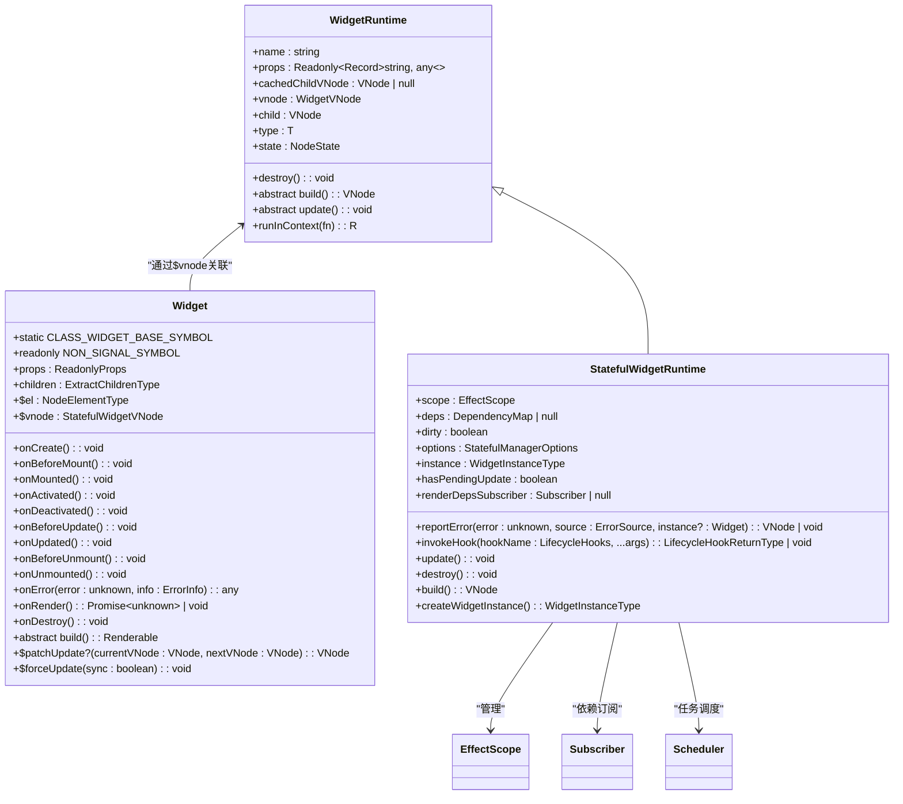
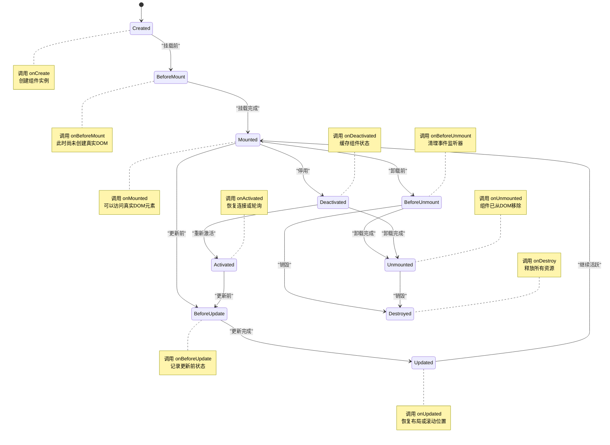
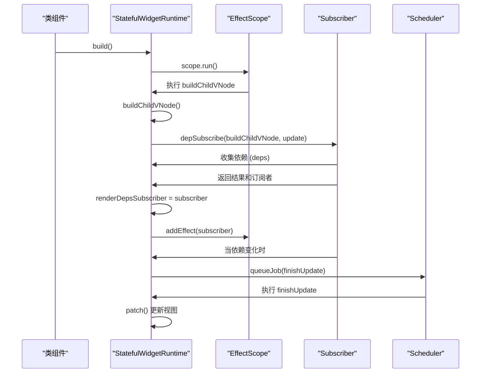
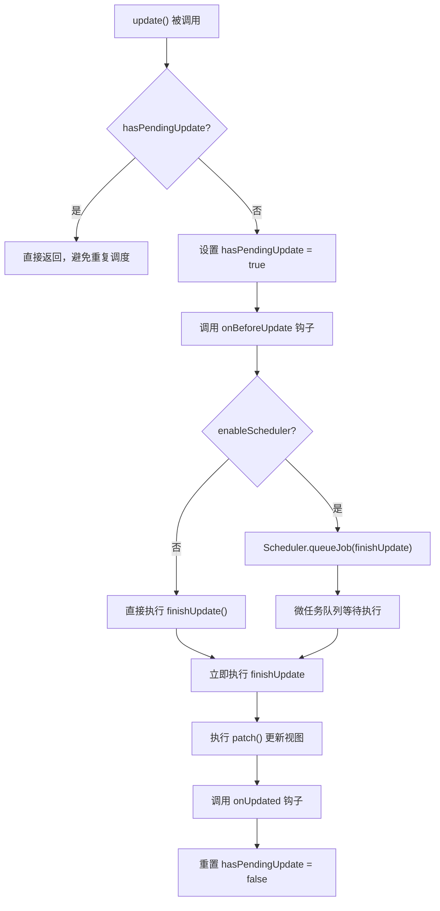
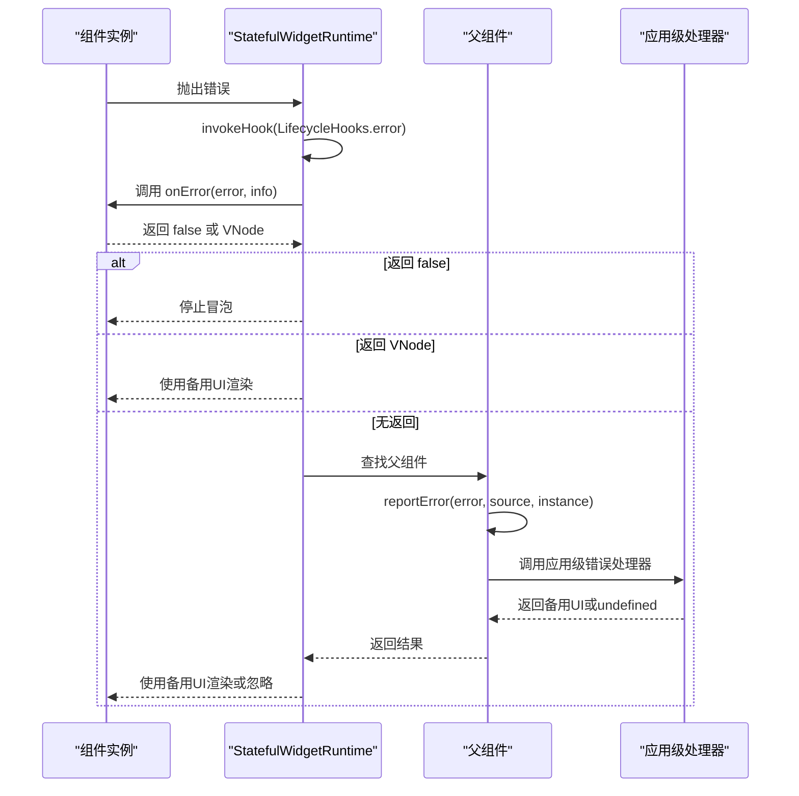
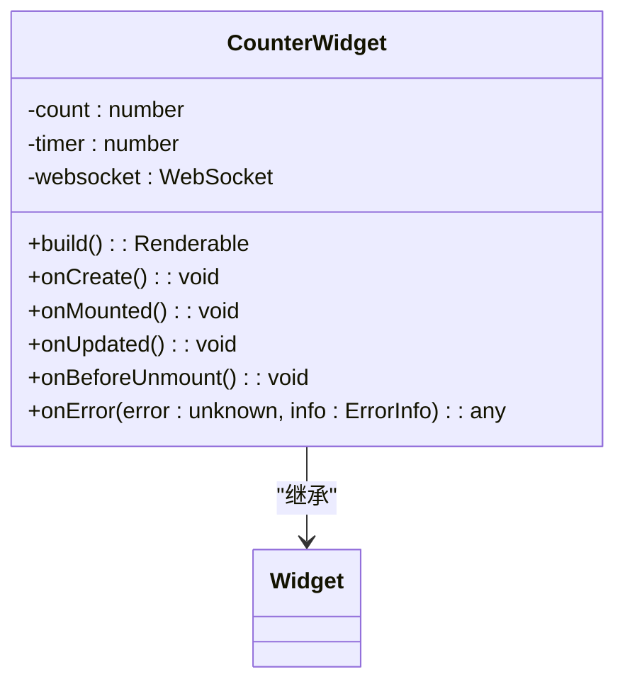

# 类组件

<cite>
**本文档引用的文件**
- [Widget.ts](file://packages/runtime-core/src/widget/base/Widget.ts)
- [Stateful.ts](file://packages/runtime-core/src/widget/runtime/Stateful.ts)
- [effect-scope.ts](file://packages/responsive/src/effect/effect-scope.ts)
- [scheduler.ts](file://packages/responsive/src/observer/scheduler.ts)
- [effect.ts](file://packages/responsive/src/effect/effect.ts)
- [helpers.ts](file://packages/responsive/src/effect/helpers.ts)
- [lifecycle.ts](file://packages/runtime-core/src/types/lifecycle.ts)
- [hook.ts](file://packages/runtime-core/src/constants/hook.ts)
- [nodeState.ts](file://packages/runtime-core/src/constants/nodeState.ts)
- [widget.ts](file://packages/runtime-core/src/vnode/creator/widget.ts)
- [depend.ts](file://packages/responsive/src/depend/depend.ts)
- [depend/helpers.ts](file://packages/responsive/src/depend/helpers.ts)
</cite>

## 目录
1. [引言](#引言)
2. [核心架构](#核心架构)
3. [类组件生命周期](#类组件生命周期)
4. [依赖追踪与自动更新](#依赖追踪与自动更新)
5. [更新调度机制](#更新调度机制)
6. [错误处理机制](#错误处理机制)
7. [使用示例](#使用示例)

## 引言
Vitarx 的类组件（StatefulWidget）架构设计基于响应式编程范式，通过 `Widget` 基类和 `StatefulWidgetRuntime` 运行时管理器的协作，实现了高效的视图更新和生命周期管理。本文档将深入解析这一架构的核心机制。

## 核心架构
Vitarx 的类组件架构由 `Widget` 基类和 `StatefulWidgetRuntime` 运行时管理器构成，二者通过虚拟节点（VNode）进行关联和协作。

**图示来源**
- [Widget.ts](file://packages/runtime-core/src/widget/base/Widget.ts#L45-L387)
- [Stateful.ts](file://packages/runtime-core/src/widget/runtime/Stateful.ts#L69-L367)
- [WidgetRuntime.ts](file://packages/runtime-core/src/widget/runtime/WidgetRuntime.ts#L35-L122)

**本节来源**
- [Widget.ts](file://packages/runtime-core/src/widget/base/Widget.ts#L1-L387)
- [Stateful.ts](file://packages/runtime-core/src/widget/runtime/Stateful.ts#L1-L367)

## 类组件生命周期
类组件的生命周期由 `StatefulWidgetRuntime` 管理，通过 `invokeHook` 方法调用相应的生命周期钩子。生命周期的执行流程严格遵循组件的状态变化。

**图示来源**
- [Stateful.ts](file://packages/runtime-core/src/widget/runtime/Stateful.ts#L172-L193)
- [hook.ts](file://packages/runtime-core/src/constants/hook.ts#L2-L15)
- [nodeState.ts](file://packages/runtime-core/src/constants/nodeState.ts#L12-L17)

**本节来源**
- [Widget.ts](file://packages/runtime-core/src/widget/base/Widget.ts#L120-L338)
- [Stateful.ts](file://packages/runtime-core/src/widget/runtime/Stateful.ts#L172-L193)
- [lifecycle.ts](file://packages/runtime-core/src/types/lifecycle.ts#L1-L138)

## 依赖追踪与自动更新
`StatefulWidgetRuntime` 利用 `EffectScope` 和 `depSubscribe` 实现了自动依赖追踪与视图更新。当组件依赖的响应式数据发生变化时，会自动触发视图更新。

**图示来源**
- [Stateful.ts](file://packages/runtime-core/src/widget/runtime/Stateful.ts#L256-L275)
- [helpers.ts](file://packages/responsive/src/depend/helpers.ts#L92-L97)
- [depend.ts](file://packages/responsive/src/depend/depend.ts#L129-L150)
- [scheduler.ts](file://packages/responsive/src/observer/scheduler.ts#L105-L111)

**本节来源**
- [Stateful.ts](file://packages/runtime-core/src/widget/runtime/Stateful.ts#L256-L275)
- [effect-scope.ts](file://packages/responsive/src/effect/effect-scope.ts#L123-L125)
- [helpers.ts](file://packages/responsive/src/depend/helpers.ts#L92-L97)

## 更新调度机制
`StatefulWidgetRuntime` 的 `update` 方法通过 `Scheduler.queueJob` 实现异步调度，避免了重复渲染，提高了性能。

**图示来源**
- [Stateful.ts](file://packages/runtime-core/src/widget/runtime/Stateful.ts#L203-L212)
- [scheduler.ts](file://packages/responsive/src/observer/scheduler.ts#L105-L111)
- [scheduler.ts](file://packages/responsive/src/observer/scheduler.ts#L243-L247)

**本节来源**
- [Stateful.ts](file://packages/runtime-core/src/widget/runtime/Stateful.ts#L203-L212)
- [scheduler.ts](file://packages/responsive/src/observer/scheduler.ts#L1-L325)

## 错误处理机制
Vitarx 的错误处理机制采用冒泡策略，通过 `invokeHook` 方法调用 `onError` 钩子，并在发生错误时向上冒泡到父组件。

**图示来源**
- [Stateful.ts](file://packages/runtime-core/src/widget/runtime/Stateful.ts#L118-L155)
- [Stateful.ts](file://packages/runtime-core/src/widget/runtime/Stateful.ts#L172-L193)
- [lifecycle.ts](file://packages/runtime-core/src/types/lifecycle.ts#L18-L50)

**本节来源**
- [Stateful.ts](file://packages/runtime-core/src/widget/runtime/Stateful.ts#L118-L193)
- [lifecycle.ts](file://packages/runtime-core/src/types/lifecycle.ts#L1-L138)

## 使用示例
以下示例展示了如何创建类组件、管理内部状态、实现自定义更新逻辑以及处理组件销毁时的资源清理。

**图示来源**
- [Widget.ts](file://packages/runtime-core/src/widget/base/Widget.ts#L45-L387)

**本节来源**
- [Widget.ts](file://packages/runtime-core/src/widget/base/Widget.ts#L120-L338)
- [Stateful.ts](file://packages/runtime-core/src/widget/runtime/Stateful.ts#L203-L212)