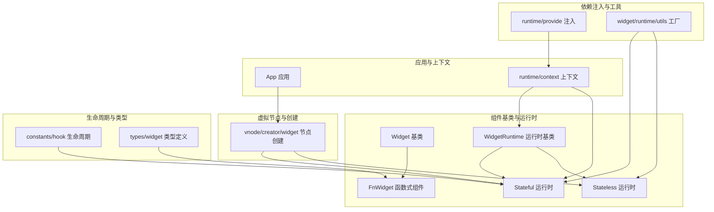
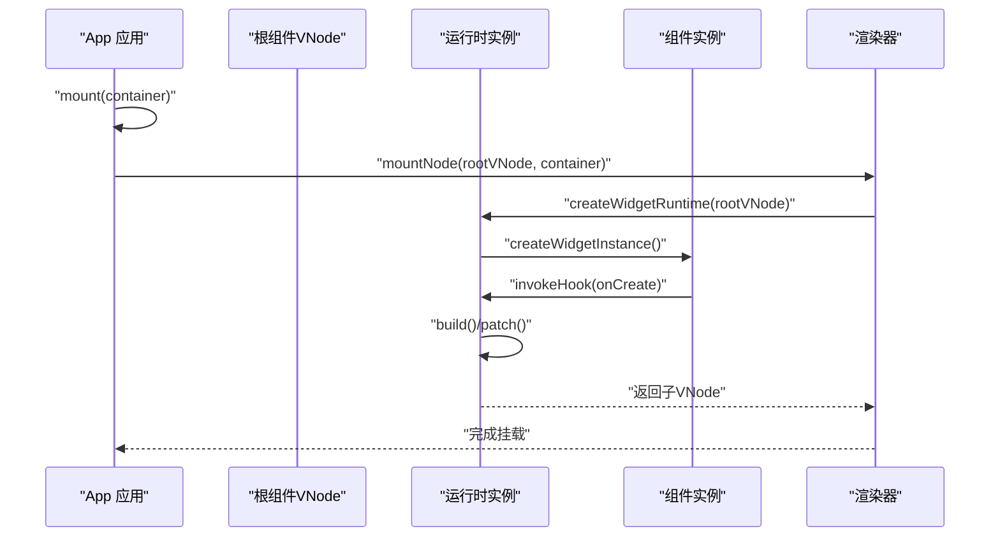
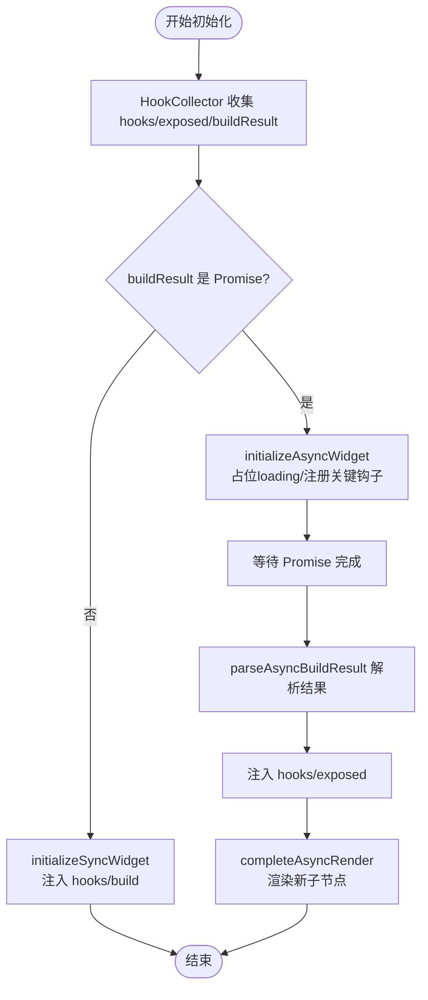
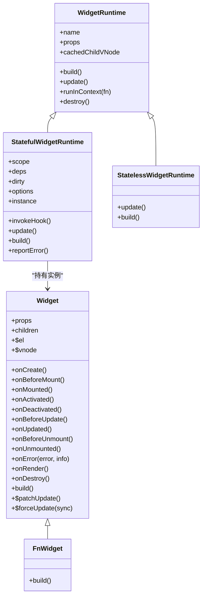
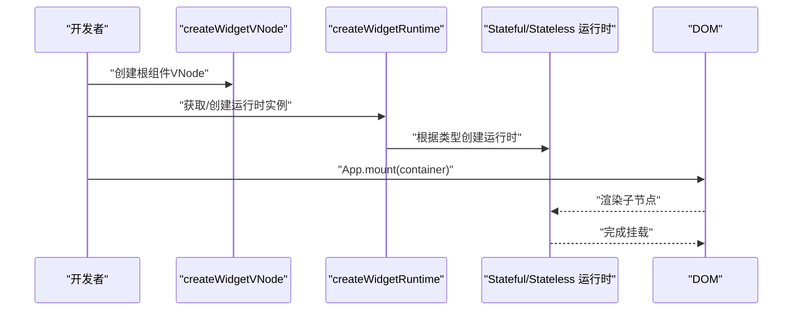
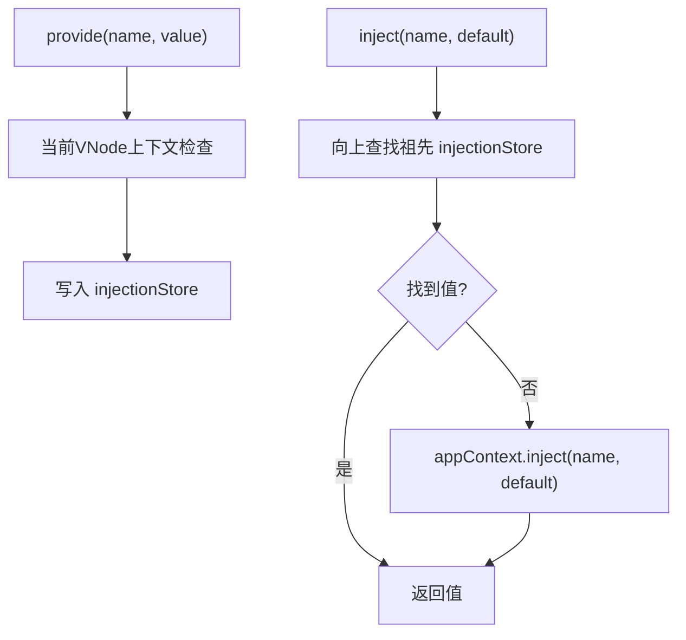
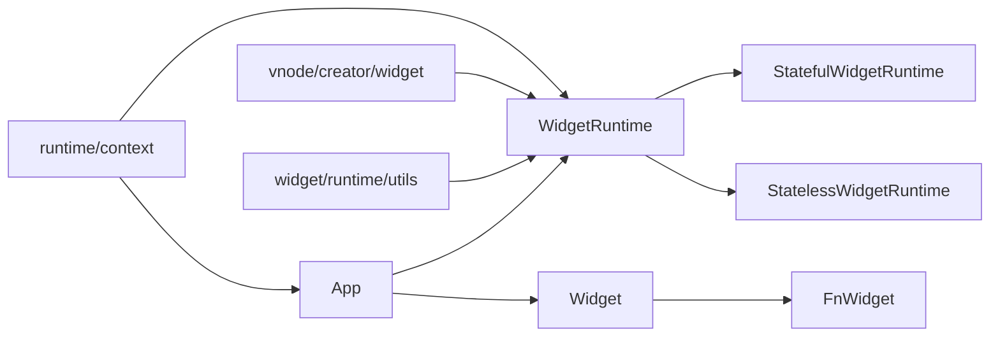

# 组件系统

<cite>
**本文引用的文件**
- [packages/runtime-core/src/widget/base/Widget.ts](file://packages/runtime-core/src/widget/base/Widget.ts)
- [packages/runtime-core/src/widget/base/FnWidget.ts](file://packages/runtime-core/src/widget/base/FnWidget.ts)
- [packages/runtime-core/src/widget/runtime/WidgetRuntime.ts](file://packages/runtime-core/src/widget/runtime/WidgetRuntime.ts)
- [packages/runtime-core/src/widget/runtime/Stateful.ts](file://packages/runtime-core/src/widget/runtime/Stateful.ts)
- [packages/runtime-core/src/widget/runtime/Stateless.ts](file://packages/runtime-core/src/widget/runtime/Stateless.ts)
- [packages/runtime-core/src/widget/runtime/utils.ts](file://packages/runtime-core/src/widget/runtime/utils.ts)
- [packages/runtime-core/src/app/App.ts](file://packages/runtime-core/src/app/App.ts)
- [packages/runtime-core/src/runtime/provide.ts](file://packages/runtime-core/src/runtime/provide.ts)
- [packages/runtime-core/src/runtime/context.ts](file://packages/runtime-core/src/runtime/context.ts)
- [packages/runtime-core/src/vnode/creator/widget.ts](file://packages/runtime-core/src/vnode/creator/widget.ts)
- [packages/runtime-core/src/constants/hook.ts](file://packages/runtime-core/src/constants/hook.ts)
- [packages/runtime-core/src/types/widget.ts](file://packages/runtime-core/src/types/widget.ts)
- [packages/runtime-core/src/widget/widgets/Dynamic.ts](file://packages/runtime-core/src/widget/widgets/Dynamic.ts)
- [packages/runtime-core/src/widget/widgets/Fragment.ts](file://packages/runtime-core/src/widget/widgets/Fragment.ts)
</cite>

## 目录
1. [引言](#引言)
2. [项目结构](#项目结构)
3. [核心组件](#核心组件)
4. [架构总览](#架构总览)
5. [详细组件分析](#详细组件分析)
6. [依赖关系分析](#依赖关系分析)
7. [性能考量](#性能考量)
8. [故障排查指南](#故障排查指南)
9. [结论](#结论)
10. [附录](#附录)

## 引言
本文件围绕 Vitarx 的组件系统进行系统化梳理，重点阐述函数式组件（FnWidget）与类组件（Stateful Widget）的定义方式、状态管理机制与渲染流程；深入讲解生命周期钩子（如 onMounted、onUnmounted、onUpdated）的执行时机与使用规范；说明 setup 函数（在函数式组件中体现为 HookCollector 收集的钩子）的执行上下文与返回值处理逻辑；解释组件实例（Widget 实例）的创建、挂载与卸载全过程，并结合 App 实例的 mount 方法说明根组件的启动机制；最后提供 provide/inject 依赖注入机制的工作原理及其在深层组件树中的应用。

## 项目结构
Vitarx 的组件系统主要分布在 runtime-core 包中，核心文件包括：
- 组件基类与运行时：Widget、FnWidget、WidgetRuntime、Stateful、Stateless
- 应用入口与上下文：App、runtime/context
- 虚拟节点与创建：vnode/creator/widget
- 生命周期常量：constants/hook
- 类型定义：types/widget
- 依赖注入：runtime/provide
- 工具与运行时工厂：widget/runtime/utils
- 常用内置组件：widget/widgets/Dynamic、Fragment

**图表来源**
- [packages/runtime-core/src/widget/base/Widget.ts](file://packages/runtime-core/src/widget/base/Widget.ts#L1-L388)
- [packages/runtime-core/src/widget/base/FnWidget.ts](file://packages/runtime-core/src/widget/base/FnWidget.ts#L1-L281)
- [packages/runtime-core/src/widget/runtime/WidgetRuntime.ts](file://packages/runtime-core/src/widget/runtime/WidgetRuntime.ts#L1-L123)
- [packages/runtime-core/src/widget/runtime/Stateful.ts](file://packages/runtime-core/src/widget/runtime/Stateful.ts#L1-L368)
- [packages/runtime-core/src/widget/runtime/Stateless.ts](file://packages/runtime-core/src/widget/runtime/Stateless.ts#L1-L66)
- [packages/runtime-core/src/app/App.ts](file://packages/runtime-core/src/app/App.ts#L1-L394)
- [packages/runtime-core/src/runtime/context.ts](file://packages/runtime-core/src/runtime/context.ts#L1-L52)
- [packages/runtime-core/src/vnode/creator/widget.ts](file://packages/runtime-core/src/vnode/creator/widget.ts#L1-L174)
- [packages/runtime-core/src/constants/hook.ts](file://packages/runtime-core/src/constants/hook.ts#L1-L16)
- [packages/runtime-core/src/types/widget.ts](file://packages/runtime-core/src/types/widget.ts#L1-L286)
- [packages/runtime-core/src/runtime/provide.ts](file://packages/runtime-core/src/runtime/provide.ts#L1-L131)
- [packages/runtime-core/src/widget/runtime/utils.ts](file://packages/runtime-core/src/widget/runtime/utils.ts#L1-L103)

**章节来源**
- [packages/runtime-core/src/widget/base/Widget.ts](file://packages/runtime-core/src/widget/base/Widget.ts#L1-L388)
- [packages/runtime-core/src/widget/runtime/WidgetRuntime.ts](file://packages/runtime-core/src/widget/runtime/WidgetRuntime.ts#L1-L123)
- [packages/runtime-core/src/app/App.ts](file://packages/runtime-core/src/app/App.ts#L1-L394)

## 核心组件
- Widget 基类：定义组件实例的属性、生命周期钩子、构建方法与更新策略。提供只读 props、children 访问，以及 $el、$vnode 等运行时信息；支持强制更新与上下文执行。
- FnWidget：函数式组件基类，负责收集 Hook（如 onError、onRender 等）、注入生命周期钩子与暴露成员、处理同步/异步构建、激活/失活替换子节点等。
- WidgetRuntime：组件运行时基类，统一维护 vnode、props、cachedChildVNode、状态与上下文执行；提供抽象的 build/update 接口。
- StatefulWidgetRuntime：有状态组件运行时，负责实例创建（类组件或函数组件）、依赖订阅、错误上报、生命周期钩子调用、更新调度与补丁。
- StatelessWidgetRuntime：无状态组件运行时，直接调用函数式构建器，按类型转换为 VNode/文本/注释节点。
- App：应用入口，提供 mount/unmount、指令注册、插件系统、应用级 provide/inject、上下文注入等能力。
- provide/inject：基于组件上下文的依赖注入，支持祖先链路查找与应用级回退。

**章节来源**
- [packages/runtime-core/src/widget/base/Widget.ts](file://packages/runtime-core/src/widget/base/Widget.ts#L1-L388)
- [packages/runtime-core/src/widget/base/FnWidget.ts](file://packages/runtime-core/src/widget/base/FnWidget.ts#L1-L281)
- [packages/runtime-core/src/widget/runtime/WidgetRuntime.ts](file://packages/runtime-core/src/widget/runtime/WidgetRuntime.ts#L1-L123)
- [packages/runtime-core/src/widget/runtime/Stateful.ts](file://packages/runtime-core/src/widget/runtime/Stateful.ts#L1-L368)
- [packages/runtime-core/src/widget/runtime/Stateless.ts](file://packages/runtime-core/src/widget/runtime/Stateless.ts#L1-L66)
- [packages/runtime-core/src/app/App.ts](file://packages/runtime-core/src/app/App.ts#L1-L394)
- [packages/runtime-core/src/runtime/provide.ts](file://packages/runtime-core/src/runtime/provide.ts#L1-L131)

## 架构总览
组件系统采用“节点驱动”的渲染架构：组件以 VNode 形式存在，运行时根据节点类型创建对应运行时实例，执行生命周期与更新流程。应用层通过 App 提供挂载、上下文注入与依赖注入能力。

**图表来源**
- [packages/runtime-core/src/app/App.ts](file://packages/runtime-core/src/app/App.ts#L170-L210)
- [packages/runtime-core/src/vnode/creator/widget.ts](file://packages/runtime-core/src/vnode/creator/widget.ts#L121-L174)
- [packages/runtime-core/src/widget/runtime/utils.ts](file://packages/runtime-core/src/widget/runtime/utils.ts#L47-L63)
- [packages/runtime-core/src/widget/runtime/Stateful.ts](file://packages/runtime-core/src/widget/runtime/Stateful.ts#L335-L366)
- [packages/runtime-core/src/widget/runtime/WidgetRuntime.ts](file://packages/runtime-core/src/widget/runtime/WidgetRuntime.ts#L108-L122)

## 详细组件分析

### 函数式组件（FnWidget）与 Hook 收集
- Hook 收集：通过 HookCollector 收集组件内的生命周期钩子（如 onError、onRender），以及暴露成员（exposed）。这些钩子在实例创建后注入到 FnWidget 实例中。
- 同步构建：若 buildResult 非 Promise，直接注入 build 函数或包装为函数。
- 异步构建：若 buildResult 为 Promise，则：
  - 使用 loading 节点占位（可为 VNode 或注释节点）
  - 注册关键钩子（如 onError/onRender）
  - 等待 Promise 完成，解析为函数组件或 VNode 构建器
  - 注入新的 exposed 成员
  - 完成异步渲染，处理激活/失活替换子节点
- 激活/失活替换：在节点状态为 Activated/Deactivated 时，执行子节点替换流程，确保 onMounted/onActivated 钩子正确触发。

**图表来源**
- [packages/runtime-core/src/widget/base/FnWidget.ts](file://packages/runtime-core/src/widget/base/FnWidget.ts#L130-L281)

**章节来源**
- [packages/runtime-core/src/widget/base/FnWidget.ts](file://packages/runtime-core/src/widget/base/FnWidget.ts#L1-L281)
- [packages/runtime-core/src/constants/hook.ts](file://packages/runtime-core/src/constants/hook.ts#L1-L16)

### 类组件（Stateful Widget）与运行时
- 实例创建：StatefulWidgetRuntime 在 runInContext 中创建实例，类组件直接 new，函数组件通过 initializeFnWidget 初始化。
- 生命周期钩子：invokeHook 统一调用，支持 onError 特殊处理与错误冒泡；enableLifecycle 控制是否启用生命周期。
- 更新流程：update 通过 Scheduler.queueJob 调度，finishUpdate 中执行 patch，若节点处于 Deactivated 则标记 dirty 待激活。
- 依赖订阅：enableAutoUpdate 下，使用 depSubscribe 订阅渲染依赖，自动触发更新；开发模式下记录依赖用于调试。
- 错误处理：reportError 优先调用组件 onError，再向上冒泡到父组件，最后回落到应用级 errorHandler。

**图表来源**
- [packages/runtime-core/src/widget/base/Widget.ts](file://packages/runtime-core/src/widget/base/Widget.ts#L1-L388)
- [packages/runtime-core/src/widget/base/FnWidget.ts](file://packages/runtime-core/src/widget/base/FnWidget.ts#L1-L281)
- [packages/runtime-core/src/widget/runtime/WidgetRuntime.ts](file://packages/runtime-core/src/widget/runtime/WidgetRuntime.ts#L1-L123)
- [packages/runtime-core/src/widget/runtime/Stateful.ts](file://packages/runtime-core/src/widget/runtime/Stateful.ts#L1-L368)
- [packages/runtime-core/src/widget/runtime/Stateless.ts](file://packages/runtime-core/src/widget/runtime/Stateless.ts#L1-L66)

**章节来源**
- [packages/runtime-core/src/widget/runtime/Stateful.ts](file://packages/runtime-core/src/widget/runtime/Stateful.ts#L1-L368)
- [packages/runtime-core/src/widget/runtime/WidgetRuntime.ts](file://packages/runtime-core/src/widget/runtime/WidgetRuntime.ts#L1-L123)

### 无状态组件（Stateless）运行时
- 直接调用函数式构建器，返回 VNode/字符串/数字；其他类型转换为注释节点（开发模式下带警告）。
- 更新策略：直接 patchUpdate 新旧子节点，适用于纯函数式、无副作用的渲染。

**章节来源**
- [packages/runtime-core/src/widget/runtime/Stateless.ts](file://packages/runtime-core/src/widget/runtime/Stateless.ts#L1-L66)

### 组件实例创建、挂载与卸载全流程
- 节点创建：createWidgetVNode 根据组件类型创建 StatefulWidgetVNode/StatelessWidgetVNode，注入 appContext，开发模式下执行属性校验。
- 运行时工厂：createWidgetRuntime 依据节点类型创建对应运行时实例，首次创建时绑定到 vnode.runtimeInstance。
- 挂载：App.mount 将根节点挂载到容器，内部调用 mountNode 完成渲染与 DOM 挂载。
- 卸载：unmountNode 触发节点卸载，运行时 destroy 清理资源。

**图表来源**
- [packages/runtime-core/src/vnode/creator/widget.ts](file://packages/runtime-core/src/vnode/creator/widget.ts#L121-L174)
- [packages/runtime-core/src/widget/runtime/utils.ts](file://packages/runtime-core/src/widget/runtime/utils.ts#L47-L63)
- [packages/runtime-core/src/app/App.ts](file://packages/runtime-core/src/app/App.ts#L170-L210)

**章节来源**
- [packages/runtime-core/src/vnode/creator/widget.ts](file://packages/runtime-core/src/vnode/creator/widget.ts#L1-L174)
- [packages/runtime-core/src/widget/runtime/utils.ts](file://packages/runtime-core/src/widget/runtime/utils.ts#L1-L103)
- [packages/runtime-core/src/app/App.ts](file://packages/runtime-core/src/app/App.ts#L1-L394)

### 生命周期钩子与执行时机
- 生命周期钩子枚举：LifecycleHooks 定义了完整的钩子集合，包括 error、create、render、beforeMount、mounted、activated、deactivated、beforeUpdate、updated、beforeUnmount、unmounted、destroy。
- 执行顺序与时机：
  - onCreate：实例创建时立即调用（类组件）或初始化完成后（函数组件）。
  - onBeforeMount：真实 DOM 元素尚未创建，禁止访问 $el。
  - onMounted：组件挂载到 DOM 后触发，可安全访问 $el。
  - onActivated：缓存组件重新激活时触发。
  - onDeactivated：组件被缓存时触发。
  - onBeforeUpdate：组件即将重新渲染前触发。
  - onUpdated：组件更新完成后触发。
  - onBeforeUnmount：组件卸载前触发，仍可使用实例。
  - onUnmounted：组件卸载完成后触发。
  - onError：错误处理钩子，支持返回备用 UI 或 false 停止向上冒泡。
  - onRender：渲染前钩子，客户端不阻塞，SSR 下可延迟替换占位节点。
  - onDestroy：服务端/客户端均会执行，用于清理资源。

**章节来源**
- [packages/runtime-core/src/constants/hook.ts](file://packages/runtime-core/src/constants/hook.ts#L1-L16)
- [packages/runtime-core/src/widget/base/Widget.ts](file://packages/runtime-core/src/widget/base/Widget.ts#L120-L339)
- [packages/runtime-core/src/widget/runtime/Stateful.ts](file://packages/runtime-core/src/widget/runtime/Stateful.ts#L164-L194)

### setup 函数的执行上下文与返回值处理
- 执行上下文：运行时通过 runInContext 将函数执行在应用上下文与节点上下文中，确保 provide/inject、上下文感知 API 正常工作。
- 返回值处理：Stateful/Stateless 运行时对 build 的返回值进行类型判定与转换，确保最终产出合法的 VNode；错误时转为注释节点并交由 onError 处理。

**章节来源**
- [packages/runtime-core/src/widget/runtime/WidgetRuntime.ts](file://packages/runtime-core/src/widget/runtime/WidgetRuntime.ts#L108-L122)
- [packages/runtime-core/src/widget/runtime/Stateful.ts](file://packages/runtime-core/src/widget/runtime/Stateful.ts#L278-L313)
- [packages/runtime-core/src/widget/runtime/Stateless.ts](file://packages/runtime-core/src/widget/runtime/Stateless.ts#L35-L66)

### provide/inject 依赖注入机制
- provide：在有状态组件上下文中提供数据，写入当前 VNode 的 injectionStore；若未在有状态组件中调用将抛错。
- inject：向上查找祖先节点的 injectionStore，命中即返回；若未找到则回退到 appContext.inject；支持默认值与工厂函数两种形式。
- 应用级注入：App.provide/inject 提供应用级别的依赖注入能力，便于跨层级共享配置或服务。

**图表来源**
- [packages/runtime-core/src/runtime/provide.ts](file://packages/runtime-core/src/runtime/provide.ts#L1-L131)
- [packages/runtime-core/src/app/App.ts](file://packages/runtime-core/src/app/App.ts#L308-L337)

**章节来源**
- [packages/runtime-core/src/runtime/provide.ts](file://packages/runtime-core/src/runtime/provide.ts#L1-L131)
- [packages/runtime-core/src/app/App.ts](file://packages/runtime-core/src/app/App.ts#L308-L337)

### 组件类型与 Props/Children
- 类型定义：types/widget 定义了 ClassWidget、FunctionWidget、StatelessWidget、WidgetType、LazyLoadWidget 等类型，支持 defaultProps、validateProps、displayName、loading 等配置。
- Props 代理：props 为只读响应式代理，defaultProps 通过代理 get 动态返回；validateProps 在开发模式下校验并输出警告/错误。
- Children 提取：通过 ExtractChildrenType 从 props 中提取 children 类型。

**章节来源**
- [packages/runtime-core/src/types/widget.ts](file://packages/runtime-core/src/types/widget.ts#L1-L286)

### 内置组件与动态渲染
- Fragment：将多个子节点组合为一个 FragmentVNode，便于无包裹容器的多节点渲染。
- Dynamic：根据 is 属性动态渲染目标组件，支持响应式切换。

**章节来源**
- [packages/runtime-core/src/widget/widgets/Fragment.ts](file://packages/runtime-core/src/widget/widgets/Fragment.ts#L1-L23)
- [packages/runtime-core/src/widget/widgets/Dynamic.ts](file://packages/runtime-core/src/widget/widgets/Dynamic.ts#L1-L44)

## 依赖关系分析
- 组件基类与运行时：Widget 为 FnWidget 父类；WidgetRuntime 为 Stateful/Stateless 的父类；StatefulWidgetRuntime 持有实例并负责生命周期与更新。
- 应用与上下文：App 注入 appContext 到 VNode 树；runtime/context 提供 runInAppContext/runInNodeContext/getCurrentVNode。
- 节点创建：vnode/creator/widget 负责创建有/无状态组件节点，注入 appContext 并执行属性校验。
- 运行时工厂：widget/runtime/utils 提供 createWidgetRuntime 工厂，按节点类型创建对应运行时实例。

**图表来源**
- [packages/runtime-core/src/widget/base/Widget.ts](file://packages/runtime-core/src/widget/base/Widget.ts#L1-L388)
- [packages/runtime-core/src/widget/runtime/WidgetRuntime.ts](file://packages/runtime-core/src/widget/runtime/WidgetRuntime.ts#L1-L123)
- [packages/runtime-core/src/widget/runtime/Stateful.ts](file://packages/runtime-core/src/widget/runtime/Stateful.ts#L1-L368)
- [packages/runtime-core/src/widget/runtime/Stateless.ts](file://packages/runtime-core/src/widget/runtime/Stateless.ts#L1-L66)
- [packages/runtime-core/src/app/App.ts](file://packages/runtime-core/src/app/App.ts#L1-L394)
- [packages/runtime-core/src/runtime/context.ts](file://packages/runtime-core/src/runtime/context.ts#L1-L52)
- [packages/runtime-core/src/vnode/creator/widget.ts](file://packages/runtime-core/src/vnode/creator/widget.ts#L1-L174)
- [packages/runtime-core/src/widget/runtime/utils.ts](file://packages/runtime-core/src/widget/runtime/utils.ts#L1-L103)

**章节来源**
- [packages/runtime-core/src/widget/runtime/utils.ts](file://packages/runtime-core/src/widget/runtime/utils.ts#L1-L103)
- [packages/runtime-core/src/runtime/context.ts](file://packages/runtime-core/src/runtime/context.ts#L1-L52)

## 性能考量
- 异步组件：通过 loading 占位与 Suspense 计数器避免阻塞渲染；Promise 完成后替换为真实子节点。
- 自动更新：enableAutoUpdate 下使用 depSubscribe 订阅渲染依赖，减少不必要的重渲染；enableScheduler 使用队列作业避免重复渲染。
- 调度同步：$forceUpdate 可配合 Scheduler.flushSync 实现同步更新。
- 无状态组件：直接 patchUpdate，适合纯函数式渲染，避免副作用开销。

**章节来源**
- [packages/runtime-core/src/widget/base/FnWidget.ts](file://packages/runtime-core/src/widget/base/FnWidget.ts#L212-L281)
- [packages/runtime-core/src/widget/runtime/Stateful.ts](file://packages/runtime-core/src/widget/runtime/Stateful.ts#L196-L248)
- [packages/runtime-core/src/widget/runtime/WidgetRuntime.ts](file://packages/runtime-core/src/widget/runtime/WidgetRuntime.ts#L108-L122)
- [packages/runtime-core/src/widget/base/Widget.ts](file://packages/runtime-core/src/widget/base/Widget.ts#L378-L388)

## 故障排查指南
- 错误冒泡：onError 返回 false/false-like 值可阻止向上冒泡；未处理错误将逐级向上，最终回落到应用级 errorHandler。
- 上下文错误：provide/inject 必须在有状态组件上下文中使用；否则抛出错误。
- 无效返回：build 返回非 VNode/字符串/数字将被转换为注释节点（开发模式下带警告），检查返回值类型。
- $el 访问：onBeforeMount 时 $el 尚未创建，访问将抛错；应在 onMounted 后使用。
- 强制更新：在函数式组件未包含响应式数据时，可通过 useForceUpdater 手动触发更新。

**章节来源**
- [packages/runtime-core/src/widget/runtime/Stateful.ts](file://packages/runtime-core/src/widget/runtime/Stateful.ts#L104-L163)
- [packages/runtime-core/src/runtime/provide.ts](file://packages/runtime-core/src/runtime/provide.ts#L1-L41)
- [packages/runtime-core/src/widget/runtime/Stateful.ts](file://packages/runtime-core/src/widget/runtime/Stateful.ts#L278-L313)
- [packages/runtime-core/src/widget/base/Widget.ts](file://packages/runtime-core/src/widget/base/Widget.ts#L97-L114)
- [packages/runtime-core/src/widget/runtime/utils.ts](file://packages/runtime-core/src/widget/runtime/utils.ts#L65-L103)

## 结论
Vitarx 的组件系统以 VNode 为核心，通过运行时工厂与上下文执行机制，实现了函数式与类组件的一致化管理。函数式组件通过 Hook 收集与异步构建增强灵活性；类组件通过响应式作用域与依赖订阅实现高效更新。生命周期钩子贯穿组件全生命周期，配合 provide/inject 与 App 上下文，形成清晰的依赖注入与错误处理体系。通过合理的配置与最佳实践，可在保证性能的同时提升开发体验与可维护性。

## 附录
- 定义组件：类组件继承 Widget 并实现 build；函数组件遵循 FunctionWidget 类型定义，可使用 Hook 收集与异步构建。
- 传递 Props：通过 createWidgetVNode 创建节点时传入 props；defaultProps 通过代理动态返回。
- 处理事件：在 JSX 中绑定事件属性，事件处理器在组件上下文中执行，可安全访问 props/$vnode。
- 组件通信：父子通信通过 props；跨层级通信推荐使用 provide/inject 或应用级 provide；兄弟/跨树通信可借助应用级 provide 或集中式状态管理。
